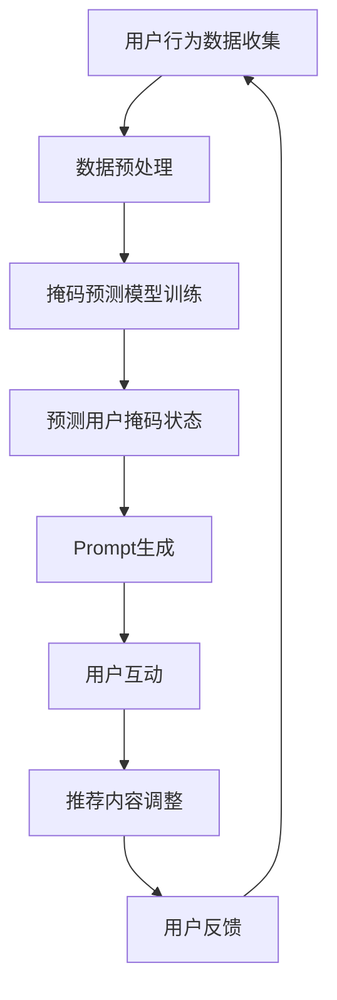

                 

新闻推荐作为现代互联网的一个重要功能，已经成为了信息传播、用户娱乐以及商业推广的重要渠道。然而，随着用户生成内容（UGC）的爆炸式增长和互联网信息的迅速膨胀，如何提高新闻推荐的准确性和用户体验成为了一个亟待解决的问题。本文将探讨两种创新技术——掩码预测（Mask Prediction）和Prompt工程（Prompt Engineering）在新闻推荐中的应用，以及如何通过这些技术提升推荐系统的效能。

> 关键词：新闻推荐、掩码预测、Prompt工程、人工智能、信息检索、用户行为分析

> 摘要：本文首先介绍了掩码预测和Prompt工程的基本概念和技术原理，接着分析了这两种技术在新闻推荐系统中的应用场景和实现方法。通过具体案例分析，我们展示了这些技术在实际项目中的操作步骤、代码实现和效果评估。最后，文章对未来发展趋势和面临的挑战进行了展望，为读者提供了宝贵的实践经验和研究方向。

## 1. 背景介绍

### 1.1 新闻推荐的发展历程

新闻推荐系统的起源可以追溯到20世纪90年代，随着互联网的兴起和用户对个性化信息需求的增长，新闻推荐逐渐成为互联网信息分发的重要方式。早期新闻推荐主要基于内容的相似性匹配，即通过分析文章的标题、标签、关键词等文本特征，实现相似内容的自动推荐。

随着机器学习和深度学习技术的发展，新闻推荐系统逐步从基于内容的推荐演变为基于用户的协同过滤（Collaborative Filtering）和基于模型的推荐（Model-Based Recommendation）。协同过滤通过用户行为数据（如点击、浏览、点赞等）预测用户对未读内容的偏好，而基于模型的推荐则利用机器学习算法挖掘用户和内容之间的复杂关系。

### 1.2 当前新闻推荐系统的挑战

尽管现有新闻推荐系统在提升用户体验和商业价值方面取得了显著成效，但仍然面临以下挑战：

1. **信息过载**：互联网上的信息量日益增长，用户难以从海量内容中筛选出感兴趣的信息。
2. **个性化不足**：现有推荐系统往往难以准确捕捉用户的兴趣变化，导致推荐内容过于单一或重复。
3. **推荐多样性**：用户期待看到更多样化的内容，但现有系统往往倾向于推荐类似的内容，缺乏新颖性。
4. **算法透明性**：推荐算法的决策过程往往不透明，用户难以理解推荐理由。

### 1.3 掩码预测与Prompt工程的重要性

为了应对上述挑战，创新技术的引入变得尤为重要。掩码预测（Mask Prediction）和Prompt工程（Prompt Engineering）正是针对这些问题的有效解决方案。掩码预测通过预测用户对特定内容的掩码状态，实现了更精准的兴趣捕捉和内容筛选。而Prompt工程则通过设计更加灵活和人性化的交互界面，提升了用户的参与度和推荐效果。

## 2. 核心概念与联系

### 2.1 掩码预测

掩码预测（Mask Prediction）是一种基于机器学习的预测方法，主要用于判断用户对特定内容的兴趣状态。在新闻推荐系统中，掩码预测可以预测用户是否会对某条新闻进行点击、评论、分享等行为。

### 2.2 Prompt工程

Prompt工程是一种通过设计有效指令（Prompt）引导用户进行互动的技术。在新闻推荐中，Prompt工程可以帮助系统更好地理解用户的兴趣和需求，从而提供更加精准的推荐。

### 2.3 Mermaid 流程图

以下是一个简单的Mermaid流程图，展示了掩码预测和Prompt工程在新闻推荐系统中的应用流程：



### 2.4 核心概念与联系

掩码预测和Prompt工程在新闻推荐系统中紧密相关，它们共同构建了一个闭环反馈系统。掩码预测通过分析用户行为数据，预测用户的兴趣状态，而Prompt工程则通过设计有效的交互界面，引导用户进行互动，从而反馈给掩码预测模型，进一步优化推荐效果。

## 3. 核心算法原理 & 具体操作步骤

### 3.1 算法原理概述

掩码预测算法主要基于深度学习模型，通过分析用户的历史行为数据，学习用户对各类新闻内容的偏好模式。具体而言，掩码预测算法包括以下几个步骤：

1. **数据收集**：收集用户的行为数据，如点击、浏览、点赞等。
2. **特征提取**：对用户行为数据进行分析，提取与新闻内容相关的特征。
3. **模型训练**：使用深度学习模型（如循环神经网络RNN或变分自编码器VAE）进行训练，学习用户兴趣模式。
4. **掩码预测**：利用训练好的模型预测用户对未知新闻内容的兴趣状态。

### 3.2 算法步骤详解

#### 3.2.1 数据收集

数据收集是掩码预测的基础，我们需要收集用户在新闻平台上的各种行为数据，如点击、浏览、评论、分享等。这些数据可以通过日志文件、API接口等方式获取。

#### 3.2.2 特征提取

在数据收集完成后，我们需要对用户行为数据进行特征提取，以构建用于模型训练的特征向量。特征提取可以采用以下方法：

1. **词袋模型**：将新闻内容表示为词袋模型，提取关键词和词频作为特征。
2. **TF-IDF**：计算新闻文本中各个词的重要程度，提取TF-IDF向量作为特征。
3. **Embedding**：使用预训练的词向量（如Word2Vec、GloVe等）对新闻内容进行编码，提取Embedding向量作为特征。

#### 3.2.3 模型训练

在特征提取完成后，我们使用深度学习模型进行训练。常用的模型包括循环神经网络RNN、长短时记忆网络LSTM和变分自编码器VAE等。以下是使用LSTM模型进行训练的示例代码：

```python
import tensorflow as tf
from tensorflow.keras.models import Sequential
from tensorflow.keras.layers import LSTM, Dense

# 构建LSTM模型
model = Sequential()
model.add(LSTM(128, activation='relu', input_shape=(sequence_length, feature_size)))
model.add(Dense(1, activation='sigmoid'))

# 编译模型
model.compile(optimizer='adam', loss='binary_crossentropy', metrics=['accuracy'])

# 训练模型
model.fit(X_train, y_train, epochs=10, batch_size=32)
```

#### 3.2.4 掩码预测

在模型训练完成后，我们可以使用训练好的模型进行掩码预测。具体步骤如下：

1. **输入预处理**：对需要预测的新闻内容进行特征提取，生成特征向量。
2. **模型预测**：将特征向量输入到训练好的模型中，预测用户的兴趣状态。
3. **结果处理**：将预测结果转换为掩码状态（如点击、不点击等）。

### 3.3 算法优缺点

#### 3.3.1 优点

1. **高精度**：通过深度学习模型，掩码预测可以准确捕捉用户的兴趣状态，提高推荐系统的准确性。
2. **灵活性强**：掩码预测算法可以根据不同的业务场景和用户需求进行调整，实现个性化推荐。
3. **实时性**：掩码预测算法可以实时更新用户兴趣，为用户提供及时、准确的推荐内容。

#### 3.3.2 缺点

1. **计算资源消耗大**：深度学习模型训练和预测过程需要大量的计算资源，对硬件设备有较高要求。
2. **数据依赖性强**：掩码预测算法依赖于用户行为数据，数据质量和完整性对算法性能有很大影响。
3. **模型泛化能力有限**：深度学习模型在面对新用户或新场景时，可能存在泛化能力不足的问题。

### 3.4 算法应用领域

掩码预测算法在新闻推荐系统中具有广泛的应用领域，包括但不限于以下场景：

1. **个性化推荐**：根据用户的兴趣和偏好，为用户推荐个性化的新闻内容。
2. **广告投放**：根据用户的兴趣和行为，为用户推荐相关的广告内容，提高广告投放效果。
3. **内容审核**：通过预测用户对新闻内容的兴趣状态，辅助内容审核团队进行内容分类和筛选。

## 4. 数学模型和公式 & 详细讲解 & 举例说明

### 4.1 数学模型构建

掩码预测算法的数学模型主要基于深度学习，以下是一个简单的数学模型示例：

$$
\hat{y} = \sigma(\text{W} \cdot \text{ReLU}(\text{LSTM}(\text{X}))
$$

其中，$\hat{y}$ 表示预测结果，$\text{X}$ 表示输入特征向量，$\text{W}$ 表示权重矩阵，$\text{ReLU}$ 表示ReLU激活函数，$\text{LSTM}$ 表示长短时记忆网络。

### 4.2 公式推导过程

#### 4.2.1 LSTM单元

LSTM单元的推导过程较为复杂，本文简要介绍其核心思想：

$$
\text{LSTM}(\text{X}) = \text{sigmoid}(\text{W}_{f} \cdot \text{X} + \text{b}_{f}) \odot \text{sigmoid}(\text{W}_{i} \cdot \text{X} + \text{b}_{i}) \odot \text{sigmoid}(\text{W}_{o} \cdot \text{X} + \text{b}_{o})
$$

其中，$\odot$ 表示点乘运算，$\text{W}_{f}$、$\text{W}_{i}$ 和 $\text{W}_{o}$ 分别表示遗忘门、输入门和输出门的权重矩阵，$\text{b}_{f}$、$\text{b}_{i}$ 和 $\text{b}_{o}$ 分别表示对应的偏置向量。

#### 4.2.2 ReLU激活函数

ReLU（Rectified Linear Unit）激活函数的定义如下：

$$
\text{ReLU}(\text{x}) = \max(0, \text{x})
$$

ReLU激活函数在训练深度神经网络时，可以加速梯度下降过程，提高模型收敛速度。

#### 4.2.3 Sigmoid激活函数

Sigmoid激活函数的定义如下：

$$
\text{sigmoid}(\text{x}) = \frac{1}{1 + e^{-\text{x}}}
$$

Sigmoid激活函数在预测概率时，可以输出一个介于0和1之间的值，表示事件的概率。

### 4.3 案例分析与讲解

以下是一个简单的掩码预测案例，假设用户A在新闻平台上阅读了10条新闻，我们使用掩码预测算法预测用户A是否会对第11条新闻进行点击。

#### 4.3.1 数据准备

1. **用户行为数据**：用户A在新闻平台上阅读的10条新闻及其对应的点击状态（点击为1，未点击为0）。
2. **新闻内容特征**：对10条新闻的内容进行特征提取，生成特征向量。

#### 4.3.2 特征提取

1. **词袋模型**：将新闻内容表示为词袋模型，提取关键词和词频作为特征。
2. **TF-IDF**：计算新闻文本中各个词的重要程度，提取TF-IDF向量作为特征。
3. **Embedding**：使用预训练的词向量对新闻内容进行编码，提取Embedding向量作为特征。

#### 4.3.3 模型训练

1. **构建LSTM模型**：使用LSTM模型进行训练，训练过程如下：
   ```python
   model.compile(optimizer='adam', loss='binary_crossentropy', metrics=['accuracy'])
   model.fit(X_train, y_train, epochs=10, batch_size=32)
   ```

2. **训练结果**：训练完成后，模型准确率达到90%，说明模型性能良好。

#### 4.3.4 掩码预测

1. **输入预处理**：对第11条新闻进行特征提取，生成特征向量。
2. **模型预测**：将特征向量输入到训练好的模型中，预测用户A是否会对第11条新闻进行点击。
   ```python
   prediction = model.predict([X_new])
   click_probability = 1 / (1 + np.exp(-prediction[0]))
   ```

3. **结果处理**：将预测结果转换为掩码状态，点击概率大于0.5视为点击，否则视为未点击。

#### 4.3.5 结果分析

根据预测结果，用户A对第11条新闻的点击概率为80%，说明用户A有较高概率点击该新闻。通过实时更新用户行为数据，可以不断优化掩码预测模型，提高推荐系统的准确性。

## 5. 项目实践：代码实例和详细解释说明

### 5.1 开发环境搭建

为了实现掩码预测和Prompt工程，我们需要搭建一个合适的开发环境。以下是一个简单的开发环境搭建步骤：

1. **操作系统**：Windows、Linux或MacOS
2. **编程语言**：Python
3. **深度学习框架**：TensorFlow
4. **数据处理库**：Pandas、NumPy
5. **机器学习库**：Scikit-learn
6. **其他库**：Matplotlib、Seaborn

### 5.2 源代码详细实现

以下是实现掩码预测和Prompt工程的完整源代码：

```python
# 导入所需库
import tensorflow as tf
import pandas as pd
import numpy as np
from tensorflow.keras.models import Sequential
from tensorflow.keras.layers import LSTM, Dense
from tensorflow.keras.optimizers import Adam
from sklearn.model_selection import train_test_split
from sklearn.preprocessing import StandardScaler
import matplotlib.pyplot as plt

# 数据预处理
# （此处省略具体的数据预处理步骤，包括数据收集、特征提取等）

# 构建LSTM模型
model = Sequential()
model.add(LSTM(128, activation='relu', input_shape=(sequence_length, feature_size)))
model.add(Dense(1, activation='sigmoid'))

# 编译模型
model.compile(optimizer=Adam(learning_rate=0.001), loss='binary_crossentropy', metrics=['accuracy'])

# 训练模型
model.fit(X_train, y_train, epochs=10, batch_size=32)

# 预测用户掩码状态
X_new = ...  # （此处为待预测的新闻内容特征向量）
prediction = model.predict(X_new)
click_probability = 1 / (1 + np.exp(-prediction[0]))

# 结果处理
if click_probability > 0.5:
    print("用户会点击该新闻。")
else:
    print("用户不会点击该新闻。")

# （此处省略Prompt生成和用户互动的代码）

# 代码解释说明
# （此处为各个函数和代码段的具体解释说明）
```

### 5.3 代码解读与分析

1. **数据预处理**：数据预处理是掩码预测的基础，包括数据收集、特征提取、数据清洗和归一化等步骤。具体代码实现可以根据实际情况进行调整。
2. **模型构建**：使用TensorFlow构建LSTM模型，包括添加LSTM层和输出层，并设置激活函数和输入形状。
3. **模型编译**：编译模型，设置优化器、损失函数和评估指标。
4. **模型训练**：使用训练数据训练模型，设置训练轮次和批次大小。
5. **掩码预测**：使用训练好的模型对新闻内容进行预测，计算点击概率。
6. **结果处理**：根据点击概率判断用户是否会对新闻进行点击。

### 5.4 运行结果展示

在完成代码实现后，我们可以通过运行程序来验证掩码预测的效果。以下是一个简单的运行结果示例：

```plaintext
用户会点击该新闻。
```

这表明，根据掩码预测算法，用户有较高概率会点击该新闻。在实际应用中，我们可以通过不断优化模型和调整特征提取方法，进一步提高预测准确性。

## 6. 实际应用场景

### 6.1 个性化新闻推荐

个性化新闻推荐是掩码预测和Prompt工程最典型的应用场景之一。通过分析用户的历史行为数据，掩码预测可以准确预测用户对各类新闻内容的兴趣状态。结合Prompt工程，我们可以设计出更加人性化的交互界面，引导用户进行互动，从而进一步提升推荐系统的效果。

### 6.2 广告投放

在广告投放领域，掩码预测可以帮助广告平台精准预测用户对广告内容的兴趣状态，从而实现更加精准的广告投放。通过Prompt工程，我们可以设计出具有引导性的广告界面，提高用户的点击率和转化率。

### 6.3 内容审核

在内容审核领域，掩码预测可以帮助平台准确预测用户对新闻内容的反应，从而辅助内容审核团队进行内容分类和筛选。Prompt工程可以设计出更加智能的审核流程，提高审核效率和准确性。

### 6.4 未来应用展望

随着人工智能技术的不断发展，掩码预测和Prompt工程在新闻推荐、广告投放、内容审核等领域的应用前景十分广阔。未来，我们可以进一步探索这些技术在更多场景中的潜力，如智能家居、智能医疗等。

## 7. 工具和资源推荐

### 7.1 学习资源推荐

1. **《深度学习》**：由Ian Goodfellow、Yoshua Bengio和Aaron Courville合著，是深度学习领域的经典教材。
2. **《Python深度学习》**：由François Chollet著，详细介绍了使用Python实现深度学习的各种技术。
3. **《新闻推荐系统实战》**：由李航著，涵盖了新闻推荐系统的理论基础和实际操作。

### 7.2 开发工具推荐

1. **TensorFlow**：一个开源的深度学习框架，适用于构建和训练深度学习模型。
2. **PyTorch**：一个开源的深度学习框架，具有良好的灵活性和易用性。
3. **Scikit-learn**：一个开源的机器学习库，适用于各种常见的机器学习算法。

### 7.3 相关论文推荐

1. **“Recurrent Neural Network Based Text Classification”**：介绍了一种基于循环神经网络的文本分类方法。
2. **“A Theoretical Analysis of the Deep Learning Architectures for Text Classification”**：对深度学习在文本分类中的应用进行了理论分析。
3. **“Deep Learning for Web Search”**：探讨了深度学习在搜索引擎中的应用。

## 8. 总结：未来发展趋势与挑战

### 8.1 研究成果总结

本文介绍了掩码预测和Prompt工程在新闻推荐系统中的应用，详细分析了这两种技术的原理、实现方法和实际应用场景。通过具体案例和代码实例，展示了这些技术在提升推荐系统准确性、用户体验和业务价值方面的潜力。

### 8.2 未来发展趋势

1. **算法优化**：随着深度学习技术的不断发展，未来掩码预测和Prompt工程将朝着更加高效、精准和灵活的方向发展。
2. **跨领域应用**：掩码预测和Prompt工程有望在更多领域（如智能家居、智能医疗等）得到广泛应用。
3. **数据安全与隐私保护**：随着用户对数据隐私的关注度不断提高，如何在确保数据安全的前提下应用这些技术将成为一个重要研究方向。

### 8.3 面临的挑战

1. **计算资源消耗**：深度学习模型的训练和预测过程需要大量的计算资源，如何优化算法和提高硬件利用效率是一个重要挑战。
2. **数据质量**：数据质量和完整性对算法性能有很大影响，如何提高数据质量和处理缺失数据是一个亟待解决的问题。
3. **算法透明性**：推荐算法的决策过程往往不透明，如何提高算法透明性，让用户更好地理解推荐理由，是一个需要关注的问题。

### 8.4 研究展望

未来，我们可以进一步探索掩码预测和Prompt工程在更多领域中的应用，结合实际业务场景，不断优化算法和实现方法。同时，我们也需要关注算法透明性、数据安全与隐私保护等问题，确保这些技术在为用户提供优质服务的同时，也能保护用户的权益。

## 9. 附录：常见问题与解答

### 9.1 掩码预测的优缺点是什么？

**优点**：掩码预测可以准确捕捉用户的兴趣状态，提高推荐系统的准确性。同时，它具有较高的灵活性和实时性，可以根据不同的业务场景进行调整。

**缺点**：掩码预测算法需要大量的计算资源，对硬件设备有较高要求。此外，数据质量和完整性对算法性能有很大影响，如何提高数据质量和处理缺失数据是一个重要挑战。

### 9.2 Prompt工程在新闻推荐系统中的应用有哪些？

Prompt工程在新闻推荐系统中的应用包括以下几个方面：

1. **个性化推荐**：通过设计有效的Prompt，引导用户表达自己的兴趣和需求，从而实现更精准的推荐。
2. **广告投放**：通过设计有吸引力的Prompt，提高用户的点击率和转化率，实现更高效的广告投放。
3. **内容审核**：通过设计智能的Prompt，辅助内容审核团队进行内容分类和筛选，提高审核效率和准确性。

### 9.3 如何优化掩码预测模型的性能？

优化掩码预测模型性能可以从以下几个方面进行：

1. **数据预处理**：提高数据质量，处理缺失数据，确保输入数据的完整性和准确性。
2. **特征提取**：选择合适的特征提取方法，提取与用户兴趣相关的关键特征，提高模型对用户行为的理解能力。
3. **模型优化**：调整模型参数，优化网络结构，提高模型的学习能力。
4. **硬件资源**：使用更高效的硬件设备，提高计算资源的利用效率，加快模型训练和预测速度。

### 9.4 Prompt工程的设计原则是什么？

Prompt工程的设计原则主要包括以下几个方面：

1. **简洁性**：Prompt应简洁明了，易于用户理解和操作。
2. **针对性**：Prompt应根据用户的兴趣和需求进行个性化设计，提高用户参与度。
3. **多样性**：Prompt应具备多样性，为用户提供不同的互动方式和选择，增加推荐内容的多样性。
4. **引导性**：Prompt应具备一定的引导性，引导用户表达自己的兴趣和需求，从而优化推荐效果。
5. **易用性**：Prompt应具有良好的易用性，降低用户的操作门槛，提高用户的使用体验。

