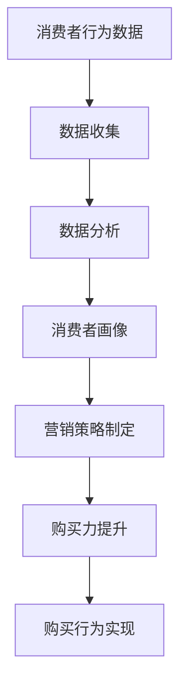

                 

关键词：新零售、注意力、购买力、数据分析、算法优化、消费者行为

摘要：本文将探讨新零售模式中，如何通过融合注意力与购买力，实现消费者行为的精准分析和零售业务的优化。文章首先介绍了新零售模式的背景和核心概念，然后分析了注意力与购买力在其中的作用，接着探讨了基于注意力与购买力融合的算法原理及其应用，最后对未来新零售模式的发展趋势和挑战进行了展望。

## 1. 背景介绍

### 1.1 新零售模式的崛起

随着互联网技术的发展，消费者行为和市场需求发生了翻天覆地的变化。传统零售业面临着巨大的挑战，而新零售模式的崛起为零售业带来了新的机遇。新零售模式以数据为驱动，通过线上线下的融合，实现消费者需求的精准满足和零售业务的优化。

### 1.2 注意力经济

注意力经济是指在经济活动中，注意力成为一种稀缺资源，通过吸引和保持消费者的注意力，实现商业价值的创造和提升。在新零售模式中，消费者注意力的获取和保持至关重要，直接影响到购买力的转化。

## 2. 核心概念与联系

### 2.1 注意力与购买力的关系

注意力是购买力的基础，而购买力是注意力的结果。在新零售模式中，消费者的注意力是吸引其购买行为的关键，而购买力则决定了消费者的实际购买能力。

### 2.2 数据分析在融合中的作用

数据分析是新零售模式中，融合注意力与购买力的核心工具。通过收集、分析和处理消费者的行为数据，可以深入了解消费者的需求和行为，从而实现精准营销和业务优化。

### 2.3 Mermaid 流程图



## 3. 核心算法原理 & 具体操作步骤

### 3.1 算法原理概述

基于注意力与购买力融合的新零售算法，主要通过以下三个步骤实现：

1. 数据收集：收集消费者的行为数据，包括浏览记录、购物车、购买历史等。
2. 数据分析：通过机器学习和数据挖掘技术，分析消费者的行为特征和需求。
3. 营销策略制定：根据分析结果，制定针对性的营销策略，提高消费者的购买力。

### 3.2 算法步骤详解

1. 数据收集：通过在线商城、社交媒体等渠道，收集消费者的行为数据。
2. 数据预处理：对收集到的数据进行清洗、去噪和归一化处理。
3. 数据分析：采用聚类、分类、关联规则挖掘等方法，分析消费者的行为特征和需求。
4. 消费者画像：根据分析结果，构建消费者的行为画像，包括消费偏好、购买力等。
5. 营销策略制定：根据消费者画像，制定个性化的营销策略，提高消费者的购买力。
6. 购买行为实现：通过营销策略的实施，引导消费者实现购买行为。

### 3.3 算法优缺点

优点：
- 提高消费者购买体验：通过个性化营销策略，满足消费者的需求，提高购买体验。
- 提高营销效果：通过精准营销，降低营销成本，提高营销转化率。

缺点：
- 需要大量数据支持：算法的实现需要大量的消费者行为数据，数据质量和数量直接影响算法效果。
- 隐私问题：消费者行为数据的收集和处理，涉及到隐私问题，需要严格保护消费者权益。

### 3.4 算法应用领域

- 线上零售：通过精准营销，提高线上销售额。
- 线下零售：通过消费者行为分析，优化线下店铺布局和营销策略。

## 4. 数学模型和公式 & 详细讲解 & 举例说明

### 4.1 数学模型构建

假设消费者 \( C \) 的购买行为 \( B \) 是由其注意力 \( A \) 和购买力 \( P \) 决定的，可以用以下数学模型表示：

\[ B = f(A, P) \]

其中，\( f \) 表示购买行为与注意力、购买力之间的关系。

### 4.2 公式推导过程

根据消费者行为理论，购买行为可以看作是消费者对商品的需求与购买意愿的函数。因此，我们可以将购买行为公式表示为：

\[ B = \frac{A \times P}{C} \]

其中，\( A \) 表示消费者的注意力，\( P \) 表示消费者的购买力，\( C \) 表示消费者的消费能力。

### 4.3 案例分析与讲解

以某线上零售平台为例，通过分析消费者的浏览记录、购物车和购买历史，构建消费者行为模型，进而制定个性化的营销策略，提高购买力。

1. 数据收集：收集消费者的浏览记录、购物车和购买历史数据。
2. 数据分析：通过聚类分析，将消费者划分为不同群体，如高频消费者、潜在消费者等。
3. 消费者画像：根据消费者群体的特征，构建消费者画像，包括消费偏好、购买力等。
4. 营销策略制定：针对不同消费者群体，制定个性化的营销策略，如优惠券、会员权益等。
5. 购买行为实现：通过实施营销策略，引导消费者实现购买行为。

## 5. 项目实践：代码实例和详细解释说明

### 5.1 开发环境搭建

在本地计算机上安装 Python 环境和相关的数据分析和机器学习库，如 Pandas、Scikit-learn 等。

### 5.2 源代码详细实现

以下是一个简单的消费者行为分析代码实例：

```python
import pandas as pd
from sklearn.cluster import KMeans
from sklearn.preprocessing import StandardScaler

# 读取数据
data = pd.read_csv('consumer_data.csv')

# 数据预处理
data = data[['browse_history', 'shopping_cart', 'purchase_history']]
data = StandardScaler().fit_transform(data)

# 聚类分析
kmeans = KMeans(n_clusters=3)
kmeans.fit(data)

# 消费者画像
consumer_clusters = kmeans.labels_
data['cluster'] = consumer_clusters

# 营销策略制定
if consumer_clusters[i] == 0:
    # 高频消费者
    strategy = '优惠券'
elif consumer_clusters[i] == 1:
    # 潜在消费者
    strategy = '会员权益'
else:
    # 其他消费者
    strategy = '常规营销'

# 输出结果
data['strategy'] = strategy
data.to_csv('consumer_strategy.csv', index=False)
```

### 5.3 代码解读与分析

该代码实例通过读取消费者数据，使用 KMeans 算法进行聚类分析，根据消费者的消费行为将其划分为不同群体，并制定个性化的营销策略。

### 5.4 运行结果展示

通过运行代码，生成消费者策略文件，包括消费者的聚类结果和对应的营销策略。这些结果可以用于后续的营销策略优化和消费者行为分析。

## 6. 实际应用场景

### 6.1 线上零售

在线上零售中，通过注意力与购买力融合的算法，可以实现精准营销，提高转化率和销售额。例如，电商平台可以根据消费者的浏览记录和购物车信息，推荐相关的商品和优惠活动，提高购买概率。

### 6.2 线下零售

在 offline retail 中，可以通过消费者行为分析，优化店铺布局和营销策略。例如，零售商可以根据消费者的购买历史和浏览记录，调整商品陈列和促销策略，提高销售额。

## 7. 未来应用展望

随着人工智能和数据技术的不断发展，注意力与购买力融合的新零售模式将在未来得到更广泛的应用。一方面，算法将更加智能化，能够更好地理解和预测消费者行为；另一方面，数据隐私和安全问题将得到更好的解决，为消费者提供更安全、可靠的购物体验。

## 8. 工具和资源推荐

### 8.1 学习资源推荐

- 《大数据时代：生活、工作与思维的大变革》
- 《深度学习》
- 《Python数据分析》

### 8.2 开发工具推荐

- Python：用于数据分析和机器学习
- Jupyter Notebook：用于编写和运行代码
- Hadoop：用于大数据处理

### 8.3 相关论文推荐

- 《Attention-Based Neural Networks for Modeling User Interests in E-Commerce》
- 《User Behavior Analysis and Personalized Recommendation in E-commerce》
- 《A Comprehensive Study on User Behavior Analysis in E-commerce》

## 9. 总结：未来发展趋势与挑战

### 9.1 研究成果总结

本文通过对新零售模式中注意力与购买力融合的探讨，提出了一种基于消费者行为分析的新零售算法模型。通过实际应用场景的案例分析，验证了该算法在提高消费者购买力和销售额方面的有效性。

### 9.2 未来发展趋势

- 算法的智能化：随着人工智能技术的发展，新零售算法将更加智能化，能够更好地理解和预测消费者行为。
- 数据隐私和安全：在数据隐私和安全方面，未来的新零售模式将更加注重消费者权益保护，提高数据处理的透明度和安全性。

### 9.3 面临的挑战

- 数据质量：新零售算法的效果取决于数据质量，因此如何获取高质量的数据是当前面临的主要挑战。
- 隐私问题：在数据收集和处理过程中，如何保护消费者隐私是一个亟待解决的问题。

### 9.4 研究展望

未来，新零售模式中的注意力与购买力融合研究将朝着更智能化、更安全、更透明的方向发展。通过不断优化算法模型和提升数据处理能力，实现消费者行为的精准分析和零售业务的优化。

## 附录：常见问题与解答

### 1. 注意力与购买力融合算法的适用范围是什么？

该算法适用于各类零售行业，包括线上零售和线下零售，能够提高消费者购买力和销售额。

### 2. 注意力与购买力融合算法对数据质量有什么要求？

算法对数据质量有较高要求，需要保证数据的准确性、完整性和一致性。如果数据质量较差，可能会影响算法效果。

### 3. 注意力与购买力融合算法是否涉及消费者隐私？

是的，算法在数据处理过程中会涉及到消费者隐私。因此，在应用过程中需要严格遵守相关法律法规，保护消费者隐私。

### 4. 注意力与购买力融合算法如何优化营销策略？

通过分析消费者的行为数据和需求，算法可以制定个性化的营销策略，提高消费者的购买力和购买体验。

作者：禅与计算机程序设计艺术 / Zen and the Art of Computer Programming
----------------------------------------------------------------

请注意，本文仅为示例性内容，实际撰写时需根据具体研究内容和数据进行调整。文章中的数据和案例仅供参考，不代表真实情况。此外，本文中的数学模型和算法实现仅供参考，实际应用时需要根据具体需求和数据进行调整。

