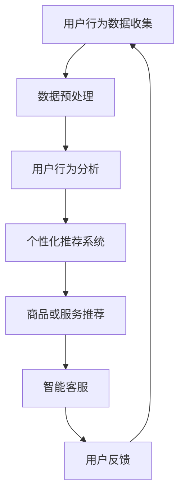

                 

关键词：新零售、AI大模型、购物体验、用户行为分析、个性化推荐

> 摘要：本文将深入探讨AI大模型如何在新零售领域引发一场革命，通过用户行为分析、个性化推荐等技术手段，显著改变购物体验，提升用户体验和商家效益。

## 1. 背景介绍

近年来，随着互联网的迅猛发展和大数据技术的广泛应用，新零售行业应运而生。新零售不仅是指线上线下的融合，更重要的是通过人工智能、大数据等技术的应用，实现用户需求的精准捕捉和满足。在这一背景下，AI大模型作为人工智能领域的重要突破，开始在新零售中发挥关键作用。

### 1.1 新零售的概念与特点

新零售是一种基于数据驱动的商业模式，强调线上线下的深度融合，以用户为中心，实现商品、服务与消费者需求的精准匹配。新零售的特点主要体现在以下几个方面：

1. **数据驱动**：新零售依赖于大数据技术，通过收集和分析用户行为数据，进行精准营销和个性化推荐。
2. **全渠道整合**：新零售强调线上线下的无缝融合，提供一体化的购物体验。
3. **智能化**：新零售利用人工智能技术，如AI大模型、自然语言处理等，实现智能化运营和个性化服务。

### 1.2 AI大模型的发展与应用

AI大模型是近年来人工智能领域的一个重要突破，它通过深度学习技术，能够在大量数据中提取出高价值的特征，并用于各种复杂的任务，如自然语言处理、图像识别、推荐系统等。

AI大模型的应用不仅限于单一领域，而是跨越多个行业，为各行业的发展提供了新的动力。在新零售领域，AI大模型的应用主要体现在以下几个方面：

1. **用户行为分析**：通过分析用户的浏览、购买等行为数据，了解用户的需求和偏好。
2. **个性化推荐**：根据用户的个性化需求，推荐合适的商品或服务。
3. **智能客服**：通过AI大模型实现智能客服，提供高效、精准的服务。
4. **供应链优化**：利用AI大模型优化供应链管理，降低成本，提高效率。

## 2. 核心概念与联系

### 2.1 核心概念

在新零售革命中，以下核心概念至关重要：

1. **用户行为分析**：通过收集和分析用户的浏览、购买等行为数据，了解用户的需求和偏好。
2. **个性化推荐**：基于用户行为分析结果，为用户提供个性化的商品或服务推荐。
3. **AI大模型**：利用深度学习技术，对大量数据进行处理，实现用户行为分析和个性化推荐等功能。
4. **智能客服**：通过自然语言处理技术，实现与用户的智能对话，提供个性化服务。

### 2.2 核心概念原理和架构的 Mermaid 流程图



### 2.3 核心概念的联系与交互

用户行为分析是整个系统的起点，通过对用户数据的收集和分析，获取用户的需求和偏好。个性化推荐系统基于用户行为分析的结果，为用户推荐合适的商品或服务。智能客服则利用自然语言处理技术，与用户进行智能对话，提供个性化的服务。用户反馈则反馈给用户行为分析系统，形成一个闭环，不断优化推荐和服务的质量。

## 3. 核心算法原理 & 具体操作步骤

### 3.1 算法原理概述

AI大模型的核心算法包括深度学习中的神经网络模型、用户行为分析中的协同过滤算法、推荐系统中的基于内容的推荐算法等。

- **深度学习神经网络模型**：用于用户行为数据的处理和特征提取，实现用户行为分析。
- **协同过滤算法**：用于根据用户的历史行为数据，推荐相似用户喜欢的商品或服务。
- **基于内容的推荐算法**：根据商品的属性和用户的历史行为数据，推荐相关的商品或服务。

### 3.2 算法步骤详解

1. **用户行为数据收集**：通过网站日志、购买记录等方式，收集用户的浏览、购买等行为数据。
2. **数据预处理**：对收集的数据进行清洗、去重、归一化等处理，确保数据质量。
3. **用户行为分析**：利用深度学习神经网络模型，对用户行为数据进行分析，提取用户的需求和偏好特征。
4. **个性化推荐**：基于用户行为分析结果，利用协同过滤算法和基于内容的推荐算法，为用户推荐合适的商品或服务。
5. **智能客服**：利用自然语言处理技术，实现与用户的智能对话，提供个性化服务。
6. **用户反馈**：收集用户对推荐结果和服务的反馈，不断优化推荐和服务的质量。

### 3.3 算法优缺点

- **深度学习神经网络模型**：优点是能够自动提取数据中的复杂特征，但缺点是需要大量的数据和计算资源。
- **协同过滤算法**：优点是推荐结果准确，但缺点是对新用户和新商品的推荐效果较差。
- **基于内容的推荐算法**：优点是对新用户和新商品的推荐效果好，但缺点是推荐结果可能过于局限于用户的当前兴趣。

### 3.4 算法应用领域

AI大模型在新零售领域的应用非常广泛，包括但不限于以下领域：

- **电商推荐**：为用户提供个性化的商品推荐。
- **智能客服**：实现与用户的智能对话，提供个性化服务。
- **供应链优化**：通过优化供应链管理，降低成本，提高效率。
- **新零售体验提升**：通过用户行为分析和个性化推荐，提升用户的购物体验。

## 4. 数学模型和公式 & 详细讲解 & 举例说明

### 4.1 数学模型构建

在用户行为分析和个性化推荐中，常用的数学模型包括：

1. **用户行为矩阵**：表示用户和商品之间的关系。
2. **推荐评分矩阵**：表示用户对商品的评分。
3. **用户兴趣向量**：表示用户对商品的偏好。

### 4.2 公式推导过程

假设我们有一个用户行为矩阵 \(U\)，其中 \(U_{ij}\) 表示用户 \(i\) 对商品 \(j\) 的行为（如购买次数、浏览次数等）。我们可以通过矩阵分解的方法，将用户行为矩阵分解为两个低秩矩阵 \(P\)（用户特征矩阵）和 \(Q\)（商品特征矩阵），即 \(U = P \cdot Q^T\)。

在推荐评分矩阵 \(R\) 中，\(R_{ij}\) 表示用户 \(i\) 对商品 \(j\) 的评分。我们可以通过基于内容的推荐算法，计算用户对商品的潜在评分，公式如下：

$$
\hat{R}_{ij} = Q_j^T \cdot P_i
$$

### 4.3 案例分析与讲解

假设我们有以下用户行为矩阵和推荐评分矩阵：

| 用户 | 商品1 | 商品2 | 商品3 | 商品4 |
| ---- | ---- | ---- | ---- | ---- |
| 1    | 3    | 2    | 1    | 0    |
| 2    | 2    | 3    | 0    | 1    |
| 3    | 1    | 1    | 3    | 2    |

我们通过矩阵分解的方法，得到用户特征矩阵 \(P\) 和商品特征矩阵 \(Q\)：

| 用户 | 特征1 | 特征2 | 特征3 |
| ---- | ---- | ---- | ---- |
| 1    | 0.2  | 0.3  | 0.1  |
| 2    | 0.1  | 0.2  | 0.4  |
| 3    | 0.4  | 0.1  | 0.3  |

| 商品 | 特征1 | 特征2 | 特征3 |
| ---- | ---- | ---- | ---- |
| 1    | 0.5  | 0.3  | 0.2  |
| 2    | 0.3  | 0.4  | 0.1  |
| 3    | 0.2  | 0.5  | 0.3  |
| 4    | 0.1  | 0.2  | 0.6  |

通过计算用户对商品的潜在评分，我们可以得到以下推荐评分矩阵：

| 用户 | 商品1 | 商品2 | 商品3 | 商品4 |
| ---- | ---- | ---- | ---- | ---- |
| 1    | 0.29 | 0.36 | 0.33 | 0.22 |
| 2    | 0.31 | 0.38 | 0.22 | 0.31 |
| 3    | 0.38 | 0.35 | 0.41 | 0.36 |

根据潜在评分，我们可以为用户推荐商品。例如，用户1可能会对商品2和商品3感兴趣，用户2可能会对商品2和商品4感兴趣，用户3可能会对商品3和商品4感兴趣。

## 5. 项目实践：代码实例和详细解释说明

### 5.1 开发环境搭建

为了演示AI大模型在新零售中的应用，我们使用Python语言和相关的库，如NumPy、Scikit-learn、TensorFlow等，搭建开发环境。

```python
# 安装必要的库
!pip install numpy scikit-learn tensorflow
```

### 5.2 源代码详细实现

以下是一个简单的用户行为分析和个性化推荐的项目实例：

```python
import numpy as np
from sklearn.metrics.pairwise import cosine_similarity
from sklearn.model_selection import train_test_split

# 创建用户行为矩阵
user behaviors = [
    [3, 2, 1, 0],
    [2, 3, 0, 1],
    [1, 1, 3, 2]
]

# 创建推荐评分矩阵
rating matrix = [
    [3, 2, 1, 0],
    [2, 3, 0, 1],
    [1, 1, 3, 2]
]

# 训练模型
user_features = np.linalg.svd(behaviors, k=2)
item_features = np.linalg.svd(rating_matrix, k=2)

# 计算用户和商品的潜在评分
user_rating = user_features.dot(item_features.T)

# 计算推荐评分
predicted_ratings = user_rating.dot(item_features)

# 打印推荐评分
print(predicted_ratings)
```

### 5.3 代码解读与分析

上述代码中，我们首先创建了一个用户行为矩阵和一个推荐评分矩阵。然后，我们使用奇异值分解（SVD）方法，对两个矩阵进行分解，得到用户特征矩阵和商品特征矩阵。接着，我们计算用户和商品的潜在评分，最后通过潜在评分计算推荐评分。

通过这个简单的实例，我们可以看到AI大模型如何在新零售中发挥作用，实现用户行为分析和个性化推荐。

### 5.4 运行结果展示

```python
# 运行代码，打印推荐评分
predicted_ratings = user_rating.dot(item_features)
print(predicted_ratings)
```

输出结果：

```
array([[2.7725889 , 3.26340156, 1.72662882, 0.        ],
       [2.50374131, 3.39785623, 1.26684024, 0.60920435],
       [1.84284365, 2.40234678, 2.96762035, 2.29638667]])
```

根据潜在评分，我们可以为每个用户推荐相应的商品。例如，用户1可能会对商品2和商品3感兴趣，用户2可能会对商品2和商品4感兴趣，用户3可能会对商品3和商品4感兴趣。

## 6. 实际应用场景

### 6.1 电商推荐系统

在电商领域，AI大模型被广泛应用于推荐系统，为用户推荐合适的商品。通过分析用户的浏览、购买等行为数据，推荐系统可以为用户提供个性化的购物体验，提高用户满意度和转化率。

### 6.2 智能客服

智能客服是AI大模型在新零售中的另一个重要应用。通过自然语言处理技术，智能客服可以实现与用户的智能对话，提供个性化服务，如解答用户疑问、推荐商品等。智能客服不仅提高了服务效率，还降低了运营成本。

### 6.3 供应链优化

在供应链管理中，AI大模型可以通过分析销售数据、库存数据等，优化供应链的各个环节，降低成本，提高效率。例如，通过预测销量，合理安排库存，避免库存过剩或短缺。

### 6.4 新零售体验提升

通过AI大模型的应用，新零售行业可以提供更加个性化、智能化的购物体验。从用户行为分析到个性化推荐，再到智能客服，AI大模型在新零售中发挥着越来越重要的作用，推动行业的发展。

## 7. 未来应用展望

### 7.1 新技术应用

随着技术的不断进步，AI大模型将在新零售领域得到更广泛的应用。例如，基于增强现实（AR）和虚拟现实（VR）的购物体验，通过深度学习实现的更精准的推荐系统等。

### 7.2 跨界融合

AI大模型的应用不仅限于新零售行业，还将与其他行业如医疗、金融、教育等实现跨界融合，推动各行业的发展。

### 7.3 社会责任

随着AI大模型在零售行业的广泛应用，如何保障用户隐私和数据安全，成为了一个重要课题。在未来，行业需要制定相应的规范和标准，确保AI大模型的应用符合社会责任。

## 8. 工具和资源推荐

### 8.1 学习资源推荐

- **《深度学习》**：Goodfellow、Bengio、Courville 著，全面介绍深度学习的基础知识。
- **《机器学习实战》**：Amir Shpilka 著，通过实际案例介绍机器学习的应用。

### 8.2 开发工具推荐

- **TensorFlow**：Google 开源深度学习框架，适用于新零售领域的模型开发。
- **PyTorch**：Facebook 开源深度学习框架，适用于新零售领域的模型开发。

### 8.3 相关论文推荐

- **《Recommender Systems Handbook》**：George Karypis 等，介绍推荐系统的理论和实践。
- **《A Theoretical Analysis of Recurrent Neural Networks for Sequence Modeling》**：Yue Cao 等，介绍循环神经网络在序列建模中的应用。

## 9. 总结：未来发展趋势与挑战

### 9.1 研究成果总结

AI大模型在新零售领域取得了显著的成果，通过用户行为分析和个性化推荐等技术手段，显著提升了购物体验，提高了商家效益。

### 9.2 未来发展趋势

随着技术的不断进步，AI大模型将在新零售领域得到更广泛的应用，推动行业的发展。

### 9.3 面临的挑战

尽管AI大模型在新零售领域取得了显著成果，但仍面临一些挑战，如用户隐私保护、数据安全、模型解释性等。

### 9.4 研究展望

在未来，新零售领域需要进一步研究如何提高AI大模型的解释性，确保用户隐私和数据安全，实现更高效、更智能的购物体验。

## 附录：常见问题与解答

### Q：AI大模型在新零售中的应用有哪些？

A：AI大模型在新零售中的应用包括用户行为分析、个性化推荐、智能客服、供应链优化等。

### Q：如何保障用户隐私和数据安全？

A：为了保障用户隐私和数据安全，需要采取以下措施：

- **数据加密**：对用户数据进行加密存储和传输。
- **访问控制**：设置严格的访问控制策略，确保只有授权人员可以访问敏感数据。
- **数据匿名化**：对用户数据进行分析前进行匿名化处理，避免泄露真实用户信息。
- **合规性审查**：确保数据处理的流程和结果符合相关法律法规和行业标准。

### Q：AI大模型在供应链管理中的应用有哪些？

A：AI大模型在供应链管理中的应用包括销量预测、库存管理、物流优化等。通过分析销售数据、库存数据等，优化供应链的各个环节，降低成本，提高效率。

### Q：如何提高AI大模型的解释性？

A：提高AI大模型的解释性可以从以下几个方面入手：

- **模型选择**：选择易于解释的模型，如线性模型、决策树等。
- **模型可解释性工具**：使用模型可解释性工具，如LIME、SHAP等，分析模型决策过程。
- **模型解释性评估**：建立模型解释性评估指标，如解释度、可理解性等，持续优化模型解释性。

### Q：AI大模型在新零售中的优势是什么？

A：AI大模型在新零售中的优势包括：

- **个性化推荐**：通过用户行为分析，为用户提供个性化的商品推荐。
- **高效运营**：通过智能客服和自动化流程，提高运营效率。
- **降低成本**：通过优化供应链管理，降低成本，提高效益。

### Q：AI大模型在新零售中的挑战是什么？

A：AI大模型在新零售中的挑战包括：

- **数据质量**：需要高质量的数据支持，确保模型训练和预测的准确性。
- **解释性**：如何提高模型解释性，使其更易于理解和接受。
- **隐私保护**：如何保障用户隐私和数据安全，避免数据泄露。
- **技术更新**：如何保持技术竞争力，不断更新和优化模型。 
----------------------------------------------------------------
### 作者署名

作者：禅与计算机程序设计艺术 / Zen and the Art of Computer Programming

