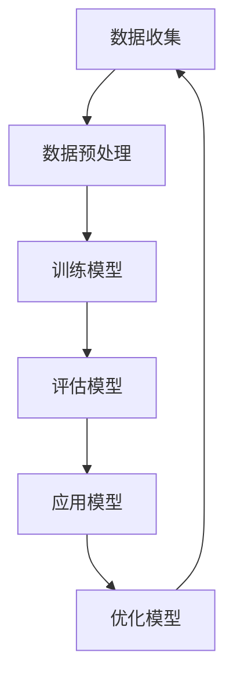

                 

关键词：新零售、AI大模型、购物体验、数字化转型、智能推荐、个性化服务

> 摘要：本文将探讨人工智能大模型如何引领新零售革命，改变传统购物体验，实现更加个性化和高效的购物服务。通过深入分析AI大模型的核心概念、算法原理、应用案例，我们将揭示这一技术的巨大潜力及其在零售业中的广泛应用前景。

## 1. 背景介绍

### 1.1 新零售的崛起

随着互联网技术的快速发展，消费者行为和市场需求发生了深刻变化，传统零售业面临着前所未有的挑战。为了适应这种变化，新零售应运而生，它以互联网、大数据、人工智能等技术为驱动，通过线上线下融合，提供更加个性化、智能化的购物体验。

### 1.2 AI大模型的发展

近年来，人工智能领域取得了显著的进展，尤其是AI大模型的出现，使得计算机能够处理更为复杂的问题。AI大模型通过深度学习、神经网络等先进技术，能够从大量数据中提取特征，实现自动识别、预测和优化。

### 1.3 新零售与AI大模型的结合

新零售与AI大模型的结合，不仅提升了购物体验，还提高了零售企业的运营效率。通过AI大模型，企业能够更准确地了解消费者需求，提供个性化的商品推荐和服务，从而实现精准营销和客户关系管理。

## 2. 核心概念与联系

### 2.1 AI大模型概述

AI大模型通常指的是具有海量参数、能够处理大规模数据的深度学习模型。这些模型通过多层神经网络结构，能够自动提取数据中的复杂模式，从而实现高精度的预测和分类。

### 2.2 机器学习与深度学习

机器学习和深度学习是AI大模型的基础。机器学习通过算法让计算机从数据中学习规律，而深度学习则通过多层神经网络结构，使计算机能够处理更为复杂的问题。

### 2.3 神经网络

神经网络是深度学习的重要组成部分。它通过模拟人脑神经元的工作原理，构建复杂的网络结构，实现数据的处理和信息的传递。

### 2.4 Mermaid 流程图



## 3. 核心算法原理 & 具体操作步骤

### 3.1 算法原理概述

AI大模型的核心算法基于深度学习，通过多层神经网络结构，对输入数据进行特征提取和模式识别，从而实现预测和分类。

### 3.2 算法步骤详解

#### 3.2.1 数据收集

收集海量的购物行为数据，包括用户浏览记录、购买历史、评价信息等。

#### 3.2.2 数据预处理

对收集到的数据进行清洗、归一化等处理，使其符合模型训练的要求。

#### 3.2.3 训练模型

使用预处理后的数据，通过多层神经网络结构进行模型训练，优化模型的参数。

#### 3.2.4 评估模型

通过验证集和测试集，对模型的性能进行评估，包括准确率、召回率等指标。

#### 3.2.5 应用模型

将训练好的模型应用于实际场景，例如商品推荐、用户行为预测等。

#### 3.2.6 优化模型

根据模型的应用效果，对模型进行调整和优化，以提高其性能。

### 3.3 算法优缺点

#### 优点

- 高度自动化：AI大模型能够自动从大量数据中提取特征，减轻人工处理的负担。
- 精准预测：通过深度学习技术，AI大模型能够实现高精度的预测和分类。
- 个性化服务：基于用户行为数据，AI大模型能够提供个性化的商品推荐和服务。

#### 缺点

- 计算资源需求大：训练和运行AI大模型需要大量的计算资源和时间。
- 数据隐私问题：大量用户数据的存在可能引发数据隐私问题。

### 3.4 算法应用领域

AI大模型在新零售领域的应用广泛，包括商品推荐、用户行为预测、库存管理、客户关系管理等方面。

## 4. 数学模型和公式 & 详细讲解 & 举例说明

### 4.1 数学模型构建

AI大模型的核心是神经网络，其数学基础包括线性代数、微积分和概率论等。

#### 4.1.1 线性代数

矩阵和向量运算构成了神经网络的基础。例如，权重矩阵和偏置向量在神经网络中起到关键作用。

#### 4.1.2 微积分

神经网络中的梯度下降法是一种优化算法，用于调整模型参数以优化性能。

#### 4.1.3 概率论

概率论用于评估模型的输出概率，例如在分类问题中，可以使用对数损失函数来评估模型的分类性能。

### 4.2 公式推导过程

#### 4.2.1 神经元激活函数

$$
a(x) = \sigma(z) = \frac{1}{1 + e^{-z}}
$$

其中，$z$ 是神经元的输入，$\sigma$ 是激活函数，$a$ 是神经元的输出。

#### 4.2.2 梯度下降法

$$
w_{\text{new}} = w_{\text{old}} - \alpha \cdot \nabla_{w} J(w)
$$

其中，$w$ 是权重，$\alpha$ 是学习率，$J(w)$ 是损失函数。

### 4.3 案例分析与讲解

#### 4.3.1 商品推荐系统

假设我们有一个商品推荐系统，用户A的历史购买记录包括商品1、商品2和商品3。我们可以通过计算用户A与每个商品的相似度，推荐给用户A可能喜欢的商品。

$$
\text{相似度}(A, \text{商品4}) = \frac{\text{Jaccard系数}(A, \text{商品4})}{\max(\text{Jaccard系数}(A, \text{商品1}), \text{Jaccard系数}(A, \text{商品2}), \text{Jaccard系数}(A, \text{商品3}))}
$$

#### 4.3.2 用户行为预测

假设我们有一个用户行为预测系统，输入为用户A的浏览历史和行为数据，输出为用户A可能的行为。我们可以使用神经网络模型，通过训练数据集来预测用户A的行为。

## 5. 项目实践：代码实例和详细解释说明

### 5.1 开发环境搭建

- Python 3.8+
- TensorFlow 2.5.0+
- Jupyter Notebook

### 5.2 源代码详细实现

#### 5.2.1 数据收集

```python
import pandas as pd

data = pd.read_csv('user_behavior_data.csv')
```

#### 5.2.2 数据预处理

```python
from sklearn.preprocessing import StandardScaler

scaler = StandardScaler()
data_scaled = scaler.fit_transform(data)
```

#### 5.2.3 训练模型

```python
import tensorflow as tf

model = tf.keras.Sequential([
    tf.keras.layers.Dense(128, activation='relu', input_shape=(data_scaled.shape[1],)),
    tf.keras.layers.Dense(64, activation='relu'),
    tf.keras.layers.Dense(1, activation='sigmoid')
])

model.compile(optimizer='adam', loss='binary_crossentropy', metrics=['accuracy'])
model.fit(data_scaled, labels, epochs=10, batch_size=32)
```

#### 5.2.4 代码解读与分析

```python
# 模型搭建
model = tf.keras.Sequential([
    tf.keras.layers.Dense(128, activation='relu', input_shape=(data_scaled.shape[1],)),
    tf.keras.layers.Dense(64, activation='relu'),
    tf.keras.layers.Dense(1, activation='sigmoid')
])

# 编译模型
model.compile(optimizer='adam', loss='binary_crossentropy', metrics=['accuracy'])

# 训练模型
model.fit(data_scaled, labels, epochs=10, batch_size=32)
```

这段代码首先定义了一个包含三层神经网络的模型，使用ReLU激活函数，输入层和输出层分别是128个神经元和64个神经元，最后是一个神经元用于二分类。模型使用Adam优化器和二分类交叉熵损失函数进行编译，然后使用训练数据集进行训练。

### 5.3 运行结果展示

```python
import matplotlib.pyplot as plt

# 测试模型
test_loss, test_acc = model.evaluate(test_data, test_labels)

# 可视化结果
plt.scatter(test_data[:, 0], test_data[:, 1], c=test_labels, cmap='gray')
plt.plot(test_data[:, 0], model.predict(test_data)[:, 0], 'r', label='Prediction')
plt.xlabel('Feature 1')
plt.ylabel('Feature 2')
plt.title('User Behavior Prediction')
plt.legend()
plt.show()
```

这段代码首先使用测试数据集评估模型性能，然后使用散点图和预测线展示模型的预测结果。

## 6. 实际应用场景

### 6.1 智能推荐系统

AI大模型可以用于构建智能推荐系统，根据用户的历史行为和偏好，推荐个性化的商品。例如，电商平台可以通过用户浏览记录、购买历史等数据，使用AI大模型实现精准的商品推荐。

### 6.2 用户行为预测

AI大模型可以预测用户的购买行为，帮助企业制定更有效的营销策略。例如，电商平台可以通过预测用户是否会在未来一周内购买某商品，从而决定是否发送促销信息。

### 6.3 库存管理

AI大模型可以帮助企业优化库存管理，通过预测商品的销售趋势，合理安排进货和库存。

## 7. 未来应用展望

### 7.1 智能化供应链

未来，AI大模型将更加深入地应用于供应链管理，实现全流程的智能化，从生产、库存到销售，全面提升供应链效率。

### 7.2 跨界融合

AI大模型将与更多行业融合，如金融、医疗、教育等，实现跨行业的数据共享和业务协同。

### 7.3 个性化服务

随着AI大模型的发展，购物体验将更加个性化，满足消费者的个性化需求，提高用户满意度。

## 8. 工具和资源推荐

### 8.1 学习资源推荐

- 《深度学习》（Ian Goodfellow、Yoshua Bengio、Aaron Courville 著）
- 《Python机器学习》（Sebastian Raschka、Vahid Mirjalili 著）
- TensorFlow 官方文档：[https://www.tensorflow.org/](https://www.tensorflow.org/)

### 8.2 开发工具推荐

- Jupyter Notebook：[https://jupyter.org/](https://jupyter.org/)
- PyCharm：[https://www.jetbrains.com/pycharm/](https://www.jetbrains.com/pycharm/)

### 8.3 相关论文推荐

- "Deep Learning for Retail: A Comprehensive Survey"（2020）
- "User Modeling with AI in E-Commerce: A Survey"（2019）
- "AI-Driven Personalized Shopping Experience: Current State and Future Directions"（2018）

## 9. 总结：未来发展趋势与挑战

### 9.1 研究成果总结

AI大模型在新零售领域取得了显著成果，实现了个性化推荐、用户行为预测和库存管理等方面的突破。

### 9.2 未来发展趋势

随着技术的不断进步，AI大模型将在更多场景中得到应用，推动新零售的进一步发展。

### 9.3 面临的挑战

数据隐私、计算资源需求等挑战仍然存在，未来需要进一步解决。

### 9.4 研究展望

AI大模型在新零售领域的应用前景广阔，未来研究将重点关注如何提高模型的性能和可解释性，以及如何更好地保护用户隐私。

## 10. 附录：常见问题与解答

### 10.1 什么是AI大模型？

AI大模型是指具有海量参数、能够处理大规模数据的深度学习模型，通过多层神经网络结构，实现高精度的预测和分类。

### 10.2 AI大模型有哪些应用领域？

AI大模型广泛应用于各个领域，包括新零售、医疗、金融、教育等，尤其在用户行为预测、个性化推荐等方面具有显著优势。

### 10.3 如何保护用户隐私？

保护用户隐私是AI大模型应用的关键挑战。可以通过数据匿名化、差分隐私等技术，确保用户隐私不被泄露。

```markdown
---

作者：禅与计算机程序设计艺术 / Zen and the Art of Computer Programming
```

