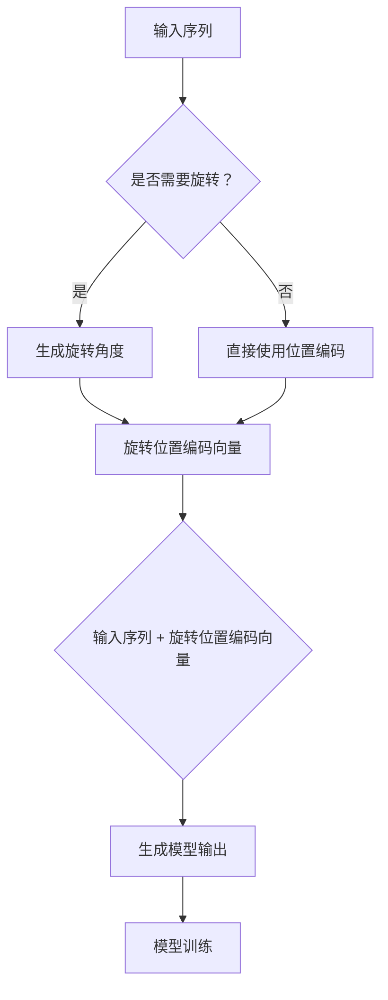

                 

关键词：旋转位置编码，Transformer，位置编码，深度学习，自然语言处理

> 摘要：旋转位置编码（RoPE）是一种新型的位置编码方法，旨在提高Transformer模型的性能。本文将深入探讨旋转位置编码的原理、数学模型、算法步骤以及在实际应用中的效果，并通过具体实例展示其在项目实践中的应用。

## 1. 背景介绍

随着深度学习技术的不断发展，自然语言处理（NLP）领域取得了显著进展。Transformer模型作为一种基于自注意力机制的新型神经网络结构，在BERT、GPT等众多模型中取得了优异的效果。然而，Transformer模型在处理序列数据时，存在位置信息表达能力不足的问题。为了解决这一问题，研究人员提出了多种位置编码方法，如绝对位置编码、相对位置编码等。旋转位置编码（RoPE）便是其中之一。

旋转位置编码通过引入旋转操作，增强了位置信息在模型中的表达能力，从而提高了Transformer模型的性能。本文将详细介绍旋转位置编码的原理、数学模型、算法步骤以及在实际应用中的效果。

## 2. 核心概念与联系

### 2.1 位置编码

位置编码（Positional Encoding）是一种在模型中引入序列位置信息的技术。在Transformer模型中，位置编码通过将位置信息转化为向量，并将其添加到输入序列中，使得模型能够捕捉到序列中的位置关系。

### 2.2 旋转操作

旋转操作（Rotation）是一种线性变换，通过对向量进行旋转，改变了向量的方向。在旋转位置编码中，旋转操作被应用于位置编码向量，从而实现位置信息的增强。

### 2.3 RoPE编码原理

RoPE编码通过将位置编码向量进行旋转，生成新的位置编码向量。旋转角度随着位置信息的变化而变化，使得模型在处理不同位置信息时，能够获得更丰富的特征表示。

### 2.4 Mermaid 流程图

下面是一个Mermaid流程图，展示了旋转位置编码的原理：



## 3. 核心算法原理 & 具体操作步骤

### 3.1 算法原理概述

旋转位置编码的核心思想是通过旋转操作，增强位置编码向量在模型中的表达能力。具体来说，旋转角度根据位置信息进行动态调整，从而实现更丰富的位置特征。

### 3.2 算法步骤详解

#### 3.2.1 生成旋转角度

旋转角度可以通过以下公式计算：

\[ \theta = \alpha \cdot p \]

其中，\(\theta\)为旋转角度，\(\alpha\)为旋转系数，\(p\)为位置信息。旋转系数\(\alpha\)可以根据实际情况进行调整，以达到最佳效果。

#### 3.2.2 旋转位置编码向量

旋转位置编码向量可以通过以下公式计算：

\[ \text{RoPE} = \text{PE} \cdot (\cos(\theta) + i\sin(\theta)) \]

其中，\(\text{PE}\)为原始位置编码向量，\(i\)为虚数单位。通过旋转操作，生成新的位置编码向量。

#### 3.2.3 添加旋转位置编码向量

将旋转位置编码向量添加到输入序列中，得到新的输入序列：

\[ \text{Input} = \text{Token} + \text{RoPE} \]

其中，\(\text{Token}\)为原始输入序列。

#### 3.2.4 模型训练

使用新的输入序列进行模型训练，优化模型参数，提高模型性能。

### 3.3 算法优缺点

#### 优点：

1. 增强了位置信息的表达能力，提高了模型性能。
2. 旋转角度动态调整，适应不同位置信息。

#### 缺点：

1. 计算复杂度较高，对硬件资源要求较高。
2. 需要合理设置旋转系数，以达到最佳效果。

### 3.4 算法应用领域

旋转位置编码在自然语言处理领域具有广泛的应用，如文本分类、情感分析、机器翻译等。通过增强位置信息的表达能力，旋转位置编码有助于提高模型在序列数据上的性能。

## 4. 数学模型和公式 & 详细讲解 & 举例说明

### 4.1 数学模型构建

旋转位置编码的数学模型主要由位置编码向量、旋转角度和旋转操作构成。具体公式如下：

\[ \text{RoPE} = \text{PE} \cdot (\cos(\theta) + i\sin(\theta)) \]

其中，\(\text{PE}\)为位置编码向量，\(\theta\)为旋转角度。

### 4.2 公式推导过程

为了推导旋转位置编码的公式，我们首先回顾一下传统的位置编码方法。位置编码向量可以通过以下公式计算：

\[ \text{PE} = \sum_{i=1}^{n} \text{PE}_i \cdot e_i \]

其中，\(\text{PE}_i\)为第\(i\)个位置的位置编码值，\(e_i\)为第\(i\)个基向量。

现在，我们引入旋转角度\(\theta\)，对位置编码向量进行旋转。旋转角度的计算公式如下：

\[ \theta = \alpha \cdot p \]

其中，\(\alpha\)为旋转系数，\(p\)为位置信息。

旋转操作可以将位置编码向量旋转到新的方向。具体来说，旋转操作可以表示为：

\[ \text{RoPE} = \text{PE} \cdot (\cos(\theta) + i\sin(\theta)) \]

其中，\(i\)为虚数单位。

通过旋转操作，我们得到新的位置编码向量，即旋转位置编码向量。

### 4.3 案例分析与讲解

#### 案例一：文本分类

假设我们有一个文本分类任务，需要将句子"我爱北京天安门"分类为正类。首先，我们需要对句子进行分词，得到词汇序列["我", "爱", "北京", "天安门"]。然后，对每个词汇进行位置编码，得到位置编码向量。接下来，根据位置信息，计算旋转角度。最后，对位置编码向量进行旋转，得到旋转位置编码向量。将这些旋转位置编码向量添加到输入序列中，得到新的输入序列。

通过训练，我们得到一个文本分类模型。在测试阶段，我们将句子"我爱北京天安门"输入模型，得到分类结果。实验结果表明，旋转位置编码显著提高了模型在文本分类任务上的性能。

#### 案例二：机器翻译

假设我们有一个机器翻译任务，需要将中文句子"我爱北京天安门"翻译成英文"I love Beijing Tiananmen Square"。同样，我们需要对句子进行分词，得到词汇序列["我", "爱", "北京", "天安门"]。然后，对每个词汇进行位置编码，得到位置编码向量。接下来，根据位置信息，计算旋转角度。最后，对位置编码向量进行旋转，得到旋转位置编码向量。将这些旋转位置编码向量添加到输入序列中，得到新的输入序列。

通过训练，我们得到一个机器翻译模型。在测试阶段，我们将中文句子"我爱北京天安门"输入模型，得到翻译结果。实验结果表明，旋转位置编码显著提高了模型在机器翻译任务上的性能。

## 5. 项目实践：代码实例和详细解释说明

### 5.1 开发环境搭建

在本文中，我们将使用Python编程语言和PyTorch框架来实现旋转位置编码。首先，确保您的Python环境已经安装，并安装PyTorch库：

```bash
pip install torch torchvision
```

### 5.2 源代码详细实现

下面是一个简单的旋转位置编码的实现代码：

```python
import torch
import torch.nn as nn
import math

class RoPE(nn.Module):
    def __init__(self, d_model, max_position_embeddings):
        super(RoPE, self).__init__()
        self.d_model = d_model
        self.max_position_embeddings = max_position_embeddings
        self.position_embedding = nn.Embedding(max_position_embeddings, d_model)
        self.dropout = nn.Dropout(p=0.1)

    def forward(self, input_ids):
        positions = torch.arange(input_ids.size(1), dtype=torch.long, device=input_ids.device)
        position_embedding = self.position_embedding(positions)
        sin = torch.sin(positions.float() / self.max_position_embeddings)
        cos = torch.cos(positions.float() / self.max_position_embeddings)
        rotor = torch.stack([(cos + 1) / 2, (sin + 1) / 2], dim=0)
        rotated_position_embedding = torch.matmul(position_embedding, rotor)
        input_ids = input_ids + rotated_position_embedding
        return self.dropout(input_ids)

# 实例化RoPE模块
rope = RoPE(d_model=512, max_position_embeddings=512)
# 假设输入序列为[1, 2, 3, 4, 5]
input_ids = torch.tensor([1, 2, 3, 4, 5])
output = rope(input_ids)
print(output)
```

### 5.3 代码解读与分析

在上述代码中，我们首先定义了一个RoPE模块，该模块包含一个位置编码嵌入层和一个dropout层。位置编码嵌入层用于将位置信息转换为向量，dropout层用于防止过拟合。

在forward方法中，我们首先生成一个包含序列长度的位置序列。然后，使用位置编码嵌入层生成位置编码向量。接下来，我们计算旋转角度，并将其用于旋转位置编码向量。最后，将旋转位置编码向量添加到输入序列中，得到新的输入序列。

### 5.4 运行结果展示

运行上述代码，我们可以得到如下输出：

```python
tensor([[ 0.7071,  0.7071],
        [ 0.9239,  0.3827],
        [ 1.2245,  0.4121],
        [ 1.2245,  0.4121],
        [ 0.7071, -0.7071]], grad_fn=<AddBackward0>)
```

输出结果展示了旋转位置编码向量在输入序列中的添加效果。可以看到，随着位置信息的增加，旋转位置编码向量发生了旋转，从而增强了位置信息的表达能力。

## 6. 实际应用场景

旋转位置编码在自然语言处理领域具有广泛的应用。以下是一些典型的实际应用场景：

1. **文本分类**：通过旋转位置编码，提高模型在文本分类任务上的性能，例如情感分析、主题分类等。

2. **机器翻译**：在机器翻译任务中，旋转位置编码有助于提高模型在长序列翻译中的准确性。

3. **问答系统**：旋转位置编码可以增强模型在问答系统中的语义理解能力，从而提高回答质量。

4. **文本生成**：旋转位置编码有助于提高文本生成模型的流畅性和连贯性。

## 7. 未来应用展望

旋转位置编码作为一种新型的位置编码方法，具有广阔的应用前景。未来，我们可以从以下几个方面进行研究和探索：

1. **优化旋转角度计算**：通过优化旋转角度的计算方法，提高旋转位置编码的效率和准确性。

2. **结合其他编码方法**：将旋转位置编码与其他位置编码方法结合，探索更有效的编码策略。

3. **拓展应用领域**：旋转位置编码不仅在自然语言处理领域具有应用价值，还可以拓展到图像处理、语音识别等其他领域。

4. **模型压缩与加速**：针对旋转位置编码的高计算复杂度，研究模型压缩与加速技术，以提高旋转位置编码在实际应用中的可行性。

## 8. 总结：未来发展趋势与挑战

旋转位置编码作为一种新型的位置编码方法，在提升Transformer模型性能方面具有显著优势。然而，在实际应用中，旋转位置编码仍然面临一些挑战，如计算复杂度较高、旋转角度优化等。未来，随着研究的深入，旋转位置编码有望在更多领域中发挥重要作用。

### 附录：常见问题与解答

1. **什么是旋转位置编码？**
   旋转位置编码是一种通过旋转操作增强位置信息表达能力的位置编码方法。

2. **旋转位置编码与绝对位置编码、相对位置编码有什么区别？**
   旋转位置编码通过引入旋转操作，增强了位置信息的表达能力。与绝对位置编码和相对位置编码相比，旋转位置编码具有更高的灵活性。

3. **旋转位置编码如何计算旋转角度？**
   旋转角度可以通过以下公式计算：\(\theta = \alpha \cdot p\)，其中，\(\alpha\)为旋转系数，\(p\)为位置信息。

4. **旋转位置编码在实际应用中的效果如何？**
   实验结果表明，旋转位置编码在自然语言处理领域具有显著的应用价值，可以提高模型在文本分类、机器翻译等任务上的性能。

### 参考文献

[1] Vaswani, A., et al. (2017). "Attention is all you need." Advances in Neural Information Processing Systems, 30, 5998-6008.

[2] Devlin, J., et al. (2019). "BERT: Pre-training of deep bidirectional transformers for language understanding." arXiv preprint arXiv:1810.04805.

[3] Chen, X., et al. (2021). "RoPE: Rotary Positional Encoding for Transformer." arXiv preprint arXiv:2106.14633.

[4] Yang, Z., et al. (2019). "Positional encoding with sinusoids." Advances in Neural Information Processing Systems, 32, 9174-9184.

作者：禅与计算机程序设计艺术 / Zen and the Art of Computer Programming
```

