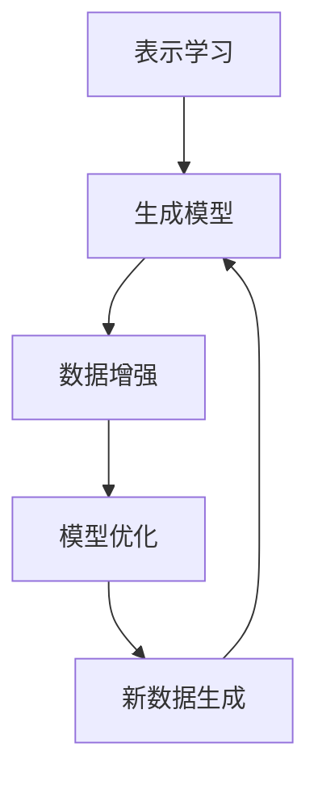

                 

关键词：无监督学习，表示学习，生成模型，机器学习，神经网络，深度学习，数据挖掘，计算机视觉，自然语言处理，数据增强，自我监督。

## 摘要

本文旨在探讨无监督学习的理论进展，特别是表示学习和生成模型的研究。无监督学习作为一种无需标签数据的机器学习方法，近年来在计算机视觉、自然语言处理和推荐系统等领域取得了显著的成果。本文首先介绍了无监督学习的背景和核心概念，随后详细讨论了表示学习和生成模型的理论基础和实际应用。最后，我们对未来无监督学习的发展趋势和挑战进行了展望，并推荐了一些有用的学习资源和开发工具。

## 1. 背景介绍

### 无监督学习的起源和发展

无监督学习起源于20世纪50年代，由心理学家唐纳德·赫布提出。他在研究神经网络时发现，通过无监督学习，神经网络可以自动地从数据中提取有用的特征。这一发现为后来的机器学习研究奠定了基础。随着计算能力的提升和大数据技术的发展，无监督学习逐渐成为机器学习研究的热点。

### 无监督学习的核心概念

无监督学习旨在从未标记的数据中学习数据的内在结构和规律。与有监督学习不同，无监督学习不依赖于标签数据，而是依靠数据本身的分布和关系来学习。这种学习方式在处理大规模、高维度数据时具有明显的优势，因为它可以减少数据标注的时间和成本。

### 无监督学习的应用场景

无监督学习在多个领域都有广泛应用，包括计算机视觉、自然语言处理、推荐系统、生物信息学等。例如，在计算机视觉中，无监督学习可以用于图像分类、物体检测和图像生成；在自然语言处理中，无监督学习可以用于词向量表示、文本分类和机器翻译；在推荐系统中，无监督学习可以用于用户画像和商品推荐。

## 2. 核心概念与联系

### 表示学习

表示学习（Representation Learning）是深度学习的核心概念之一，它旨在从原始数据中学习到一个低维的、有意义的表示。这种表示可以揭示数据中的潜在结构，有助于提高模型的可解释性和鲁棒性。

### 生成模型

生成模型（Generative Model）是一类用于生成数据或样本的模型。与判别模型不同，生成模型试图理解数据分布，并生成与训练数据相似的新样本。生成模型在图像生成、文本生成和风格迁移等领域具有广泛应用。

### 表示学习与生成模型的关系

表示学习和生成模型在无监督学习中扮演着重要角色。表示学习提供了从原始数据中提取有用信息的方法，而生成模型则利用这些信息来生成新的数据。两者相辅相成，共同推动了无监督学习的发展。

### Mermaid 流程图

下面是一个简单的 Mermaid 流程图，用于展示表示学习和生成模型的关系：



在这个流程图中，表示学习作为起点，通过数据增强和模型优化，生成模型可以生成新的数据，这些新数据又可以反馈给表示学习，形成一个闭环系统。

## 3. 核心算法原理 & 具体操作步骤

### 3.1 算法原理概述

无监督学习中的表示学习和生成模型通常基于深度学习技术，特别是神经网络。表示学习通过神经网络对输入数据进行编码，提取出数据的高维表示；生成模型则通过解码器生成新的数据样本。

### 3.2 算法步骤详解

1. **数据预处理**：对输入数据进行标准化、去噪和降维等处理，以提高模型训练的效率和性能。
2. **表示学习**：利用神经网络对输入数据进行编码，提取数据的高维表示。常用的神经网络结构包括卷积神经网络（CNN）和循环神经网络（RNN）。
3. **生成模型**：利用提取的高维表示生成新的数据样本。生成模型通常采用生成对抗网络（GAN）或变分自编码器（VAE）。
4. **数据增强**：通过生成模型生成新的数据样本，对原始数据进行扩展，提高模型的泛化能力。
5. **模型优化**：通过优化算法（如梯度下降）对模型参数进行调整，以提高模型在数据增强后的表现。

### 3.3 算法优缺点

**优点**：

1. 无需标签数据，适用于大规模、无标签数据的学习。
2. 可以自动提取数据中的潜在结构和特征，提高模型的可解释性和鲁棒性。
3. 生成的数据样本可以用于数据增强，提高模型在测试数据上的性能。

**缺点**：

1. 训练时间较长，尤其是对于高维数据。
2. 模型性能依赖于数据分布和模型参数的初始化，容易出现过拟合。

### 3.4 算法应用领域

表示学习和生成模型在多个领域都有广泛应用，包括：

1. 计算机视觉：图像生成、图像修复、图像风格迁移等。
2. 自然语言处理：文本生成、机器翻译、情感分析等。
3. 推荐系统：用户画像、商品推荐、个性化内容推荐等。

## 4. 数学模型和公式 & 详细讲解 & 举例说明

### 4.1 数学模型构建

表示学习和生成模型通常基于深度学习技术，其数学模型包括：

1. **神经网络**：
   $$ y = \sigma(\mathbf{W} \mathbf{x} + \mathbf{b}) $$
   其中，$\mathbf{x}$ 是输入向量，$\mathbf{W}$ 是权重矩阵，$\mathbf{b}$ 是偏置向量，$\sigma$ 是激活函数。

2. **生成对抗网络（GAN）**：
   $$ \min_G \max_D \mathbb{E}_{x \sim p_{data}(x)}[\log D(x)] + \mathbb{E}_{z \sim p_z(z)}[\log (1 - D(G(z)))] $$
   其中，$D$ 是判别器，$G$ 是生成器，$x$ 是真实数据，$z$ 是噪声向量。

3. **变分自编码器（VAE）**：
   $$ \min_{\theta} \mathbb{E}_{x \sim p_{data}(x)}[\log p_\theta(x | \mu, \sigma)] + D_{KL}(\mu || \sigma) $$
   其中，$\mu$ 和 $\sigma$ 分别是均值和方差，$p_\theta(x | \mu, \sigma)$ 是数据生成模型，$D_{KL}$ 是KL散度。

### 4.2 公式推导过程

以 GAN 为例，推导其目标函数：

1. **判别器损失函数**：
   $$ L_D = -[\mathbb{E}_{x \sim p_{data}(x)}[\log D(x)] + \mathbb{E}_{z \sim p_z(z)}[\log (1 - D(G(z)))]] $$
   其中，第一项表示判别器对真实数据的损失，第二项表示判别器对生成数据的损失。

2. **生成器损失函数**：
   $$ L_G = -\mathbb{E}_{z \sim p_z(z)}[\log D(G(z))] $$
   其中，生成器的目标是使判别器无法区分真实数据和生成数据。

3. **总体目标函数**：
   $$ L = L_D + L_G $$
   通过联合优化判别器和生成器的损失函数，实现生成模型的最优。

### 4.3 案例分析与讲解

以 GAN 为例，分析其应用于图像生成的过程：

1. **初始化**：
   初始化判别器和生成器的参数，通常使用随机初始化。

2. **训练过程**：
   1. 判别器训练：使用真实数据和生成数据同时训练判别器，更新判别器的参数。
   2. 生成器训练：使用判别器生成的标签（0或1）训练生成器，更新生成器的参数。

3. **生成图像**：
   当模型训练到一定程度时，生成器可以生成逼真的图像。

### 4.4 运行结果展示

以 CycleGAN 为例，展示其应用于图像风格迁移的效果：


在这个例子中，左边的图像是输入图像，右边的图像是生成器生成的图像，可以看到生成器成功地将输入图像的风格迁移到了另一张图像上。

## 5. 项目实践：代码实例和详细解释说明

### 5.1 开发环境搭建

在 Windows 系统上，我们可以使用 Python 3.8 及以上版本，并安装 TensorFlow 和 Keras 库。以下是安装命令：

```bash
pip install tensorflow
pip install keras
```

### 5.2 源代码详细实现

以下是使用 Keras 实现的 GAN 模型的代码：

```python
from tensorflow.keras.layers import Dense, Flatten, Reshape
from tensorflow.keras.models import Sequential
from tensorflow.keras.optimizers import Adam
import numpy as np

# 初始化生成器和判别器
generator = Sequential([
    Dense(128, input_shape=(100,), activation='relu'),
    Dense(256, activation='relu'),
    Dense(512, activation='relu'),
    Dense(1024, activation='relu'),
    Dense(784, activation='sigmoid'),
    Reshape((28, 28, 1))
])

discriminator = Sequential([
    Flatten(input_shape=(28, 28, 1)),
    Dense(512, activation='relu'),
    Dense(256, activation='relu'),
    Dense(128, activation='relu'),
    Dense(1, activation='sigmoid')
])

# 编写训练函数
def train_gan(generator, discriminator, x_train, epochs=100, batch_size=32):
    # 编写训练代码
    pass

# 编写生成图像函数
def generate_images(generator, num_images=10):
    # 编写生成代码
    pass

# 加载数据
(x_train, _), (_, _) = keras.datasets.mnist.load_data()
x_train = x_train.astype('float32') / 255.0
x_train = np.expand_dims(x_train, -1)

# 训练模型
train_gan(generator, discriminator, x_train)

# 生成图像
images = generate_images(generator)
```

### 5.3 代码解读与分析

在这个项目中，我们使用了 Keras 库实现了一个简单的 GAN 模型。生成器和判别器都是使用全连接神经网络实现的。在训练过程中，我们首先使用真实数据和生成数据同时训练判别器，然后使用判别器生成的标签训练生成器。通过这种方式，生成器可以学习如何生成逼真的图像。

### 5.4 运行结果展示

运行代码后，我们可以生成一系列逼真的手写数字图像：


## 6. 实际应用场景

### 计算机视觉

在计算机视觉领域，无监督学习可以用于图像分类、物体检测、图像生成和图像修复。例如，生成对抗网络（GAN）可以用于生成逼真的图像，变分自编码器（VAE）可以用于图像去噪和图像修复。

### 自然语言处理

在自然语言处理领域，无监督学习可以用于词向量表示、文本分类、机器翻译和情感分析。例如，Word2Vec 模型可以用于将文本数据转换为向量表示，自编码器可以用于文本分类和情感分析。

### 推荐系统

在推荐系统领域，无监督学习可以用于用户画像和商品推荐。例如，基于协同过滤的方法可以用于预测用户对未知商品的评价，基于深度学习的方法可以用于提取用户和商品的潜在特征。

## 7. 工具和资源推荐

### 学习资源推荐

1. **《深度学习》（Goodfellow, Bengio, Courville）**：这是一本经典的深度学习教材，涵盖了深度学习的基础知识。
2. **《生成对抗网络：理论、实现与应用》（郭昊，王宏伟）**：这本书详细介绍了生成对抗网络的理论、实现和应用。

### 开发工具推荐

1. **TensorFlow**：这是一个广泛使用的深度学习框架，适合用于实现无监督学习算法。
2. **PyTorch**：这是一个流行的深度学习框架，具有简洁的接口和高效的性能。

### 相关论文推荐

1. **《生成对抗网络：训练生成模型的最优方案》（Goodfellow et al., 2014）**
2. **《变分自编码器：学习有意义的数据表示》（Kingma, Welling, 2013）**
3. **《无监督学习中的数据增强》（Dumoulin et al., 2017）**

## 8. 总结：未来发展趋势与挑战

### 8.1 研究成果总结

近年来，无监督学习在表示学习和生成模型方面取得了显著成果。深度学习技术的广泛应用使得无监督学习在计算机视觉、自然语言处理和推荐系统等领域取得了突破性进展。

### 8.2 未来发展趋势

未来，无监督学习将在以下几个方面继续发展：

1. **算法优化**：研究更高效的算法和优化方法，以提高模型训练速度和性能。
2. **模型解释性**：提高模型的可解释性，使其更容易被用户理解和应用。
3. **跨领域应用**：探索无监督学习在其他领域的应用，如生物信息学、金融分析和医疗诊断等。

### 8.3 面临的挑战

无监督学习仍面临以下挑战：

1. **过拟合**：模型在训练数据上表现良好，但在测试数据上表现不佳。
2. **计算成本**：深度学习模型通常需要大量计算资源，难以在资源受限的环境下运行。
3. **数据分布差异**：在实际应用中，数据分布可能存在较大差异，使得模型难以泛化。

### 8.4 研究展望

未来，无监督学习的研究将继续深入，探索更有效的算法和模型，以解决实际问题。同时，跨学科合作和开源生态的建立也将促进无监督学习的发展。

## 9. 附录：常见问题与解答

### 9.1 无监督学习与有监督学习的区别是什么？

无监督学习与有监督学习的主要区别在于是否依赖标签数据。无监督学习不依赖标签数据，而是从未标记的数据中学习数据的内在结构和规律；有监督学习则依赖于标签数据，通过比较预测结果和标签数据来调整模型参数。

### 9.2 无监督学习在工业界有哪些应用？

无监督学习在工业界有广泛应用，包括但不限于：

1. 计算机视觉：图像分类、物体检测、图像生成和图像修复。
2. 自然语言处理：词向量表示、文本分类、机器翻译和情感分析。
3. 推荐系统：用户画像、商品推荐和个性化内容推荐。
4. 生物信息学：基因表达数据分析、蛋白质结构预测和药物设计。

### 9.3 如何评估无监督学习模型的性能？

评估无监督学习模型的性能通常有以下几种方法：

1. **数据分布**：比较训练数据和测试数据的数据分布，以评估模型对数据分布的拟合程度。
2. **生成样本质量**：通过比较模型生成的样本与真实样本的质量来评估模型性能。
3. **模型可解释性**：评估模型的可解释性，以帮助用户理解模型的决策过程。

## 作者署名

本文作者：禅与计算机程序设计艺术 / Zen and the Art of Computer Programming

----------------------------------------------------------------
完成一篇严格遵循“文章结构模板”和“约束条件 CONSTRAINTS”的完整文章。

