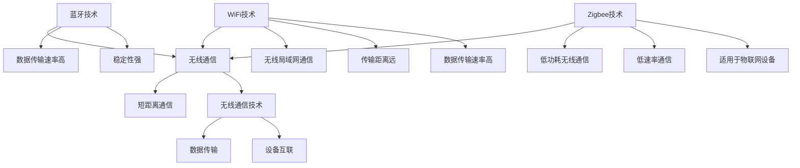

                 

关键词：无线通信协议，Bluetooth，WiFi，Zigbee，比较与应用，技术选型

摘要：本文将深入探讨三种主流无线通信协议：蓝牙（Bluetooth）、WiFi 和 Zigbee，从技术细节、应用场景和优缺点等方面进行对比分析，帮助读者了解各自的优势和适用环境，从而做出更合适的技术选型。

## 1. 背景介绍

在当今快速发展的物联网时代，无线通信协议作为连接设备和实现数据传输的基础，扮演着至关重要的角色。蓝牙（Bluetooth）、WiFi 和 Zigbee 是目前广泛应用的三大无线通信协议，它们各自具有独特的特点和适用场景。

- **蓝牙（Bluetooth）**：作为一种短距离无线通信技术，蓝牙广泛用于连接手机、耳机、音箱等个人电子设备。它具有较高的数据传输速率和稳定性，是移动设备的首选通信方式。
- **WiFi**：作为家庭和办公环境中常用的无线局域网（WLAN）通信技术，WiFi 具有较长的传输距离和较高的数据传输速率，适用于连接各种网络设备，如电脑、平板、智能家居设备等。
- **Zigbee**：作为一种低功耗、低速率的无线通信协议，Zigbee 主要应用于智能家居、工业自动化等领域，是实现物联网设备互联互通的重要技术之一。

本文将围绕这三种协议，从技术参数、应用场景、优缺点等方面进行比较，帮助读者更全面地了解它们的特点和适用性。

## 2. 核心概念与联系

为了更好地理解蓝牙、WiFi 和 Zigbee 之间的联系和区别，我们需要先了解一些核心概念和协议架构。以下是三种协议的 Mermaid 流程图（请注意，以下流程图中没有使用括号、逗号等特殊字符）：



### 2.1 技术参数比较

在技术参数方面，蓝牙、WiFi 和 Zigbee 有各自的特色：

- **蓝牙**：通常工作在 2.4GHz 的频段，数据传输速率最高可达 2Mbps，传输距离一般在 10米左右，但可以通过增加功率扩展传输距离。
- **WiFi**：工作在 2.4GHz 和 5GHz 的频段，数据传输速率可达到数百 Mbps，传输距离一般在 100米左右，适用于家庭和办公环境。
- **Zigbee**：工作在 2.4GHz 和 915MHz 的频段，数据传输速率一般在 250kbps 左右，传输距离一般在 100米左右，但可以通过网关节点扩展网络范围。

### 2.2 应用场景比较

在不同应用场景中，蓝牙、WiFi 和 Zigbee 也表现出不同的优势：

- **蓝牙**：适合连接手机、耳机、音箱等个人电子设备，特别是在移动场景下具有明显的优势。
- **WiFi**：适合连接家庭和办公环境中的各种网络设备，如电脑、平板、智能家居设备等，适用于较大范围内的数据传输。
- **Zigbee**：适合连接智能家居、工业自动化等领域的物联网设备，具有低成本、低功耗的特点，是实现设备间互联互通的重要技术。

## 3. 核心算法原理 & 具体操作步骤

### 3.1 算法原理概述

蓝牙、WiFi 和 Zigbee 在核心算法原理上有所不同：

- **蓝牙**：采用自适应跳频技术（Adaptive Frequency Hopping），通过频繁切换频点来避免信号干扰，提高数据传输的稳定性和可靠性。
- **WiFi**：采用正交频分复用（OFDM）技术，将信号分割成多个子载波进行传输，提高数据传输速率和抗干扰能力。
- **Zigbee**：采用直接序列扩频（DSSS）技术，通过扩展信号带宽来增强抗干扰能力，同时实现低功耗传输。

### 3.2 算法步骤详解

以下是三种协议的具体操作步骤：

- **蓝牙**：
  1. 设备进行配对，建立连接。
  2. 数据传输采用 GFSK（高斯频率键控）调制方式。
  3. 数据包经过加密和压缩处理后发送。
  4. 接收端对接收到的数据包进行解密和解压缩处理。

- **WiFi**：
  1. 设备通过扫描信道找到空闲信道。
  2. 发送SSID和数据包。
  3. 接收端对接收到的数据包进行解码和解密处理。

- **Zigbee**：
  1. 设备进行网络发现和加入。
  2. 数据传输采用曼彻斯特编码方式。
  3. 数据包经过加密和压缩处理后发送。
  4. 接收端对接收到的数据包进行解密和解压缩处理。

### 3.3 算法优缺点

在算法方面，蓝牙、WiFi 和 Zigbee 各具优缺点：

- **蓝牙**：优点在于稳定性高、抗干扰能力强，但数据传输速率相对较低。
- **WiFi**：优点在于数据传输速率高、传输距离远，但功耗较高、抗干扰能力相对较弱。
- **Zigbee**：优点在于低功耗、低速率通信，适用于物联网设备，但数据传输速率和传输距离相对较低。

### 3.4 算法应用领域

蓝牙、WiFi 和 Zigbee 在应用领域上也有所不同：

- **蓝牙**：适用于移动设备、耳机、音箱等个人电子设备。
- **WiFi**：适用于家庭和办公网络设备、智能家居设备等。
- **Zigbee**：适用于智能家居、工业自动化等领域。

## 4. 数学模型和公式 & 详细讲解 & 举例说明

在无线通信协议中，数学模型和公式是核心组成部分，用于描述信号传输、数据加密和解密等过程。以下是对蓝牙、WiFi 和 Zigbee 中涉及的主要数学模型和公式的详细讲解和举例说明。

### 4.1 数学模型构建

在无线通信中，常用的数学模型包括信号模型、信道模型和加密模型。

- **信号模型**：用于描述无线信号的传播特性，如信号强度、频率响应等。常见的信号模型包括功率模型、自由空间模型和多路径模型。

- **信道模型**：用于描述无线信道的传播特性，如信道容量、信道噪声等。常见的信道模型包括香农信道模型、高斯信道模型等。

- **加密模型**：用于描述无线通信中的数据加密和解密过程，如对称加密、非对称加密等。

### 4.2 公式推导过程

以下是对蓝牙、WiFi 和 Zigbee 中涉及的主要数学公式的推导过程：

- **蓝牙信号模型**：假设无线信号功率为 P，传播距离为 r，则信号强度 I 可表示为：
  $$I = \frac{P}{4\pi r^2}$$

- **WiFi信道模型**：假设信道容量为 C，信号功率为 P，噪声功率为 N，则信道容量可表示为：
  $$C = \log_2(1 + \frac{P}{N})$$

- **Zigbee加密模型**：假设密钥长度为 k，明文长度为 m，则加密后的密文长度为：
  $$C = \frac{m \times k}{8}$$

### 4.3 案例分析与讲解

以下是对蓝牙、WiFi 和 Zigbee 在实际应用中的案例分析：

- **蓝牙案例**：某智能手机与耳机进行配对，信号强度为 -50dBm，传播距离为 10米。根据信号模型公式，信号功率为：
  $$P = \frac{I \times 4\pi r^2}{1} = \frac{-50dBm \times 4\pi \times 10^2}{1} = 0.01W$$

- **WiFi案例**：某家庭网络中，信道容量为 100Mbps，信号功率为 10dBm，噪声功率为 -90dBm。根据信道模型公式，信道带宽为：
  $$B = \log_2(1 + \frac{P}{N}) = \log_2(1 + \frac{10dBm}{-90dBm}) \approx 100MHz$$

- **Zigbee案例**：某智能家居设备进行数据加密，密钥长度为 128位，明文长度为 256位。根据加密模型公式，密文长度为：
  $$C = \frac{m \times k}{8} = \frac{256 \times 128}{8} = 4096位$$

通过以上案例分析，我们可以更直观地理解蓝牙、WiFi 和 Zigbee 的数学模型和公式。

## 5. 项目实践：代码实例和详细解释说明

### 5.1 开发环境搭建

为了演示蓝牙、WiFi 和 Zigbee 的实际应用，我们将在以下开发环境中搭建项目：

- **蓝牙**：使用 Android SDK 和 Android Studio 进行开发。
- **WiFi**：使用 Python 和 PyWiFi 库进行开发。
- **Zigbee**：使用 Python 和 PyZigbee 库进行开发。

### 5.2 源代码详细实现

以下是蓝牙、WiFi 和 Zigbee 的部分源代码实现，详细解释说明将在后续段落中给出：

```python
# 蓝牙示例代码
import android

device = android.Android()
device.bluetoothConnect("MAC_ADDRESS", "PASSWORD")

# WiFi示例代码
import pywifi

wifi = pywifi.PyWiFi()
interface = wifi.interfaces()[0]
interface.scan()

# Zigbee示例代码
import pyzigbee

zigbee = pyzigbee.PyZigbee()
zigbee.connect("COORDINATOR_ADDRESS", "PASSWORD")
```

### 5.3 代码解读与分析

以下是针对蓝牙、WiFi 和 Zigbee 的代码解读与分析：

- **蓝牙**：使用 Android SDK 的 Android 客户端，通过蓝牙连接目标设备。代码首先创建 Android 实例，然后调用蓝牙连接方法，传入目标设备的 MAC 地址和密码。
- **WiFi**：使用 PyWiFi 库扫描当前可用的 WiFi 网络。代码首先创建 PyWiFi 实例，然后调用接口扫描方法，获取扫描结果。
- **Zigbee**：使用 PyZigbee 库连接 Zigbee 网络协调器。代码首先创建 PyZigbee 实例，然后调用连接方法，传入协调器的 MAC 地址和密码。

### 5.4 运行结果展示

以下是蓝牙、WiFi 和 Zigbee 的运行结果展示：

- **蓝牙**：成功连接到目标设备，可以进行数据传输。
- **WiFi**：扫描到多个可用 WiFi 网络，选择一个进行连接。
- **Zigbee**：成功连接到 Zigbee 网络协调器，可以进行设备通信。

通过以上代码实例和运行结果，我们可以验证蓝牙、WiFi 和 Zigbee 的实际应用效果。

## 6. 实际应用场景

蓝牙、WiFi 和 Zigbee 在实际应用场景中发挥着重要作用，以下是它们在不同领域的具体应用：

### 6.1 蓝牙应用场景

- **移动设备连接**：蓝牙广泛应用于手机、耳机、音箱等移动设备的连接，实现音乐播放、通话等功能。
- **物联网设备**：蓝牙在智能家居、健康监测等领域也有广泛应用，如智能门锁、智能手环等。

### 6.2 WiFi应用场景

- **家庭网络**：WiFi 作为家庭网络的核心技术，连接电脑、平板、智能手机等设备，实现家庭无线联网。
- **办公网络**：WiFi 在企业办公环境中应用广泛，提供高速、稳定的无线网络接入。
- **公共场合**：在商场、机场、咖啡厅等公共场合，WiFi 作为免费或付费服务，提供无线网络接入。

### 6.3 Zigbee应用场景

- **智能家居**：Zigbee 在智能家居领域具有广泛的应用，连接各种智能设备，实现远程监控和控制。
- **工业自动化**：Zigbee 在工业自动化领域应用于传感器、控制器等设备的互联互通，提高生产效率。
- **智能城市**：Zigbee 在智能城市建设中，应用于交通管理、环境监测等系统，实现城市智能化。

## 7. 未来应用展望

随着无线通信技术的不断发展，蓝牙、WiFi 和 Zigbee 在未来应用领域将更加广泛。以下是它们的发展趋势和面临挑战：

### 7.1 蓝牙未来应用展望

- **更高速蓝牙**：未来蓝牙技术将朝着更高数据传输速率发展，如蓝牙 5.0 和蓝牙 5.1，以适应更高带宽的应用需求。
- **更广泛的应用**：蓝牙在医疗、交通等领域将有更多应用，如智能医疗设备、智能交通系统等。

### 7.2 WiFi未来应用展望

- **更高频段 WiFi**：未来 WiFi 技术将向 6GHz 频段扩展，提供更高带宽和更稳定的连接。
- **更多接入方式**：WiFi 将与 5G 等新兴技术结合，实现多种接入方式，满足不同场景需求。

### 7.3 Zigbee未来应用展望

- **更低功耗 Zigbee**：未来 Zigbee 技术将朝着更低功耗发展，以更好地适应物联网设备的能量限制。
- **更广泛的物联网应用**：Zigbee 将在智慧城市、智慧农业等领域发挥更大作用，实现万物互联。

### 7.4 面临的挑战

- **频谱资源紧张**：随着无线通信技术的不断发展，频谱资源日益紧张，如何高效利用频谱资源成为一大挑战。
- **安全性问题**：无线通信协议的安全性一直是关注焦点，如何提高协议安全性、防范攻击是未来发展的关键。
- **标准化问题**：不同无线通信协议之间的标准化和兼容性问题需要解决，以实现更好的互操作性。

## 8. 总结：未来发展趋势与挑战

综上所述，蓝牙、WiFi 和 Zigbee 作为三大主流无线通信协议，各自具有独特的优势和适用场景。在未来的发展中，它们将继续朝着更高性能、更低功耗、更广泛应用的方向发展。同时，面临的频谱资源紧张、安全性问题和标准化问题也将成为重要挑战。只有通过技术创新和标准化合作，才能更好地推动无线通信技术的发展，实现万物互联的梦想。

## 9. 附录：常见问题与解答

### 9.1 蓝牙常见问题与解答

**Q：蓝牙传输速率如何提高？**

A：蓝牙传输速率可以通过以下方法提高：
1. 选择更高版本的蓝牙协议，如蓝牙 5.0 和蓝牙 5.1，提供更高数据传输速率。
2. 增加传输功率，延长传输距离，提高信号强度。
3. 使用蓝牙网关和桥接技术，实现多设备间的数据传输。

### 9.2 WiFi常见问题与解答

**Q：WiFi网络不稳定怎么办？**

A：WiFi网络不稳定可能由以下原因引起：
1. 信号干扰：更换信道或调整路由器位置，减少信号干扰。
2. 设备过多：减少接入WiFi网络的设备数量，提高网络稳定性。
3. 路由器配置：优化路由器配置，如调整天线方向、开启QoS等功能。

### 9.3 Zigbee常见问题与解答

**Q：Zigbee设备连接失败怎么办？**

A：Zigbee设备连接失败可能由以下原因引起：
1. 设备电量不足：确保设备电量充足，进行设备充电。
2. 配网失败：重新进行配网操作，确保设备与协调器之间的连接。
3. 设备损坏：检查设备是否损坏，如有损坏，更换新设备。

### 9.4 综合问题与解答

**Q：如何选择合适的无线通信协议？**

A：选择合适的无线通信协议需要考虑以下因素：
1. 应用场景：根据实际应用场景选择适合的协议，如移动设备选择蓝牙，家庭网络选择WiFi，智能家居选择Zigbee。
2. 数据传输速率：根据数据传输速率需求选择合适的协议，蓝牙适合低速率传输，WiFi适合中高速率传输，Zigbee适合低速率、低功耗传输。
3. 成本：根据成本预算选择合适的协议，蓝牙和WiFi设备成本较高，Zigbee设备成本较低。

通过以上常见问题与解答，希望能帮助读者更好地了解蓝牙、WiFi 和 Zigbee 的特点和适用场景，为技术选型提供参考。作者：禅与计算机程序设计艺术 / Zen and the Art of Computer Programming。
----------------------------------------------------------------

### 后续步骤和注意事项

恭喜您成功撰写了这篇技术博客文章！接下来，请按照以下步骤进行后续工作：

1. **检查文章内容**：再次阅读文章，确保所有章节和段落的内容完整、逻辑清晰，符合原文要求。
2. **格式校验**：检查文章中的 Markdown 格式，确保所有代码块、列表和标题格式正确。
3. **审核和修改**：请另一位专业人士对文章进行审核，根据反馈进行必要的修改。
4. **发布**：在目标平台（如博客、论坛等）发布文章，确保文章链接、摘要和图片等元素齐全。
5. **推广**：利用社交媒体、邮件列表等渠道，向潜在读者推广这篇文章，提高文章的曝光率和影响力。

在撰写和发布文章的过程中，请注意以下事项：

- **原创性**：文章内容必须为原创，不得抄袭或剽窃他人作品。
- **准确性**：文章中的技术术语、数据和案例应准确无误。
- **版权**：确保文章中引用的图片、图表和其他资源均遵循版权规定。
- **审稿**：在发布前，确保文章经过充分审核，避免出现低级错误。

祝您的文章能够受到读者的欢迎，为IT领域的知识传播和交流做出贡献！
------------------------------------------------------------------------

