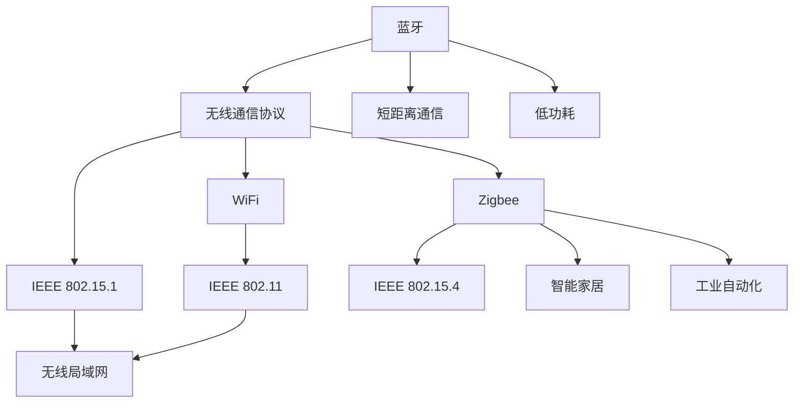

                 

### 关键词 Keywords ###
- 无线通信
- Bluetooth
- WiFi
- Zigbee
- 无线协议
- 网络架构
- 数据传输
- 网络安全
- 蓝牙技术
- 无线局域网
- 低功耗无线通信

<|assistant|>### 摘要 Summary ###
本文旨在深入探讨无线通信技术中的三个主要协议：Bluetooth、WiFi 和 Zigbee。我们将从背景介绍开始，分别阐述这三个协议的核心概念、工作原理、技术特点和应用场景。此外，本文还将分析这些协议在数学模型、算法原理以及项目实践中的应用，并探讨其在未来无线通信领域的发展趋势和挑战。通过这篇文章，读者可以全面了解无线通信技术的基本概念和实际应用，为深入研究相关技术提供参考。

## 1. 背景介绍

无线通信技术是现代通信领域的重要研究方向，它使得设备之间无需物理连接即可进行数据传输。随着物联网（IoT）的迅猛发展，无线通信技术在智能家居、智能交通、工业自动化等领域的应用日益广泛。蓝牙（Bluetooth）、WiFi 和 Zigbee 是当前最常用的无线通信协议，它们在性能、应用场景和市场需求等方面各有特点。

### 1.1 Bluetooth

蓝牙是一种短距离、低功耗的无线通信协议，最初由爱立信公司于1994年提出。蓝牙技术旨在实现设备之间的无线互联，如手机、耳机、电脑等。随着版本的更新，蓝牙技术不断优化，支持更高的数据传输速率和更广的应用范围。蓝牙5.0及以后的版本引入了更多的功能，如高分辨率音频传输、更高功耗的设备互联以及更好的网络稳定性。

### 1.2 WiFi

WiFi 是一种基于IEEE 802.11标准的无线局域网（WLAN）技术，旨在提供较高数据传输速率的无线通信。WiFi 技术最早于1997年推出，支持多种频段，如2.4GHz和5GHz。随着技术的进步，WiFi 的传输速率和稳定性得到了显著提升，使其成为家庭、办公室和公共场所常见的无线通信方式。

### 1.3 Zigbee

Zigbee 是一种低功耗、低速率的无线通信协议，基于IEEE 802.15.4标准。Zigbee 最初由Zigbee联盟于2003年提出，旨在实现智能家居、工业自动化等领域的无线通信。Zigbee 设备具有低成本、低功耗、高可靠性的特点，支持大规模设备互联。

### 1.4 无线通信技术发展历程

自20世纪90年代以来，无线通信技术经历了从1G到5G的演变。1G技术主要提供语音通信服务，2G技术引入了短信和数据传输功能，3G技术提供了更高的数据传输速率，4G技术实现了高速无线互联网接入。随着5G技术的到来，无线通信技术迎来了新一轮的变革，支持更高数据速率、更低延迟和更大连接密度。

## 2. 核心概念与联系

在深入探讨蓝牙、WiFi 和 Zigbee 之前，有必要了解这些协议的核心概念和相互关系。以下是蓝牙、WiFi 和 Zigbee 的核心概念及架构的 Mermaid 流程图。



### 2.1 核心概念

- **蓝牙（Bluetooth）**：短距离、低功耗的无线通信协议，主要用于设备互联和数据传输。
- **WiFi**：无线局域网技术，提供高速无线互联网接入，广泛应用于家庭、办公室和公共场所。
- **Zigbee**：低功耗、低速率的无线通信协议，适用于智能家居、工业自动化等领域。

### 2.2 架构联系

蓝牙、WiFi 和 Zigbee 都是基于IEEE标准开发的无线通信协议，它们在无线局域网、短距离通信和低功耗通信领域各有应用。蓝牙主要用于个人设备互联，WiFi 提供高速无线互联网接入，而 Zigbee 则在智能家居和工业自动化领域具有广泛的应用。

## 3. 核心算法原理 & 具体操作步骤

### 3.1 算法原理概述

蓝牙、WiFi 和 Zigbee 在通信过程中采用不同的算法原理，以实现高效、稳定的数据传输。以下是这些协议的核心算法原理概述。

### 3.1.1 蓝牙

- **蓝牙3.0及以前**：基于时分双工（TDD）和频分双工（FDD）技术，实现全双工通信。
- **蓝牙4.0及以后**：引入蓝牙低功耗技术（BLE），采用广播和连接两种模式，支持低功耗设备互联。

### 3.1.2 WiFi

- **WiFi 1-4**：基于正交频分复用技术（OFDM），实现高速数据传输。
- **WiFi 5（802.11ac）**：采用多输入多输出（MIMO）技术，提高数据传输速率和稳定性。
- **WiFi 6（802.11ax）**：引入多用户MIMO、 orthogonal frequency division multiple access（OFDMA）等新技术，实现更高数据速率和更优的网络性能。

### 3.1.3 Zigbee

- **Zigbee**：采用直接序列扩频（DSSS）技术，实现低功耗、低速率的数据传输。

### 3.2 算法步骤详解

#### 3.2.1 蓝牙

1. **设备扫描**：设备发送扫描请求，搜索周围的蓝牙设备。
2. **配对**：设备发现目标设备后，进行配对操作，建立连接。
3. **数据传输**：设备通过连接通道进行数据传输，实现全双工通信。

#### 3.2.2 WiFi

1. **设备扫描**：设备发送扫描请求，搜索周围的无线网络。
2. **选择网络**：设备从扫描结果中选择一个网络进行连接。
3. **连接过程**：设备与无线接入点（AP）进行认证、密钥交换等操作，建立连接。
4. **数据传输**：设备通过无线网络进行数据传输。

#### 3.2.3 Zigbee

1. **设备扫描**：设备发送扫描请求，搜索周围的 Zigbee 网络。
2. **加入网络**：设备加入已存在的网络，成为网络的一员。
3. **数据传输**：设备在网络中传输数据，实现低功耗、低速率的数据传输。

### 3.3 算法优缺点

#### 3.3.1 蓝牙

- **优点**：短距离通信、低功耗、支持多种设备互联。
- **缺点**：数据传输速率较低，不适合传输大量数据。

#### 3.3.2 WiFi

- **优点**：高速数据传输、广覆盖范围、支持多种设备互联。
- **缺点**：功耗较高，不适合低功耗设备。

#### 3.3.3 Zigbee

- **优点**：低功耗、低速率、支持大规模设备互联。
- **缺点**：数据传输速率较低，不适合传输大量数据。

### 3.4 算法应用领域

- **蓝牙**：主要用于个人设备互联，如手机、耳机、电脑等。
- **WiFi**：广泛应用于家庭、办公室和公共场所，提供高速无线互联网接入。
- **Zigbee**：适用于智能家居、工业自动化等领域，实现大规模设备互联。

## 4. 数学模型和公式 & 详细讲解 & 举例说明

在无线通信技术中，数学模型和公式是理解和分析协议性能的关键工具。以下是蓝牙、WiFi 和 Zigbee 的数学模型和公式的详细讲解及举例说明。

### 4.1 数学模型构建

#### 4.1.1 蓝牙

蓝牙的数学模型主要包括信道模型、功率模型和信号传播模型。

1. **信道模型**：
   \[
   C = \frac{1}{\sqrt{1 + \frac{P_t}{P_r}}}
   \]
   其中，\( C \) 为信道衰减系数，\( P_t \) 为发射功率，\( P_r \) 为接收功率。

2. **功率模型**：
   \[
   P_t = 10 \log_{10} \left( \frac{E_t}{d^2} \right)
   \]
   其中，\( P_t \) 为发射功率，\( E_t \) 为发射能量，\( d \) 为传输距离。

3. **信号传播模型**：
   \[
   L = \frac{4\pi d^2}{R^2}
   \]
   其中，\( L \) 为路径损耗，\( d \) 为传输距离，\( R \) 为天线增益。

#### 4.1.2 WiFi

WiFi 的数学模型主要包括信道模型、功率模型和信号传播模型。

1. **信道模型**：
   \[
   C = \frac{1}{\sqrt{1 + \frac{P_t}{P_r}}} \cdot \sqrt{\frac{R}{R + 1}}
   \]
   其中，\( C \) 为信道衰减系数，\( P_t \) 为发射功率，\( P_r \) 为接收功率，\( R \) 为多路径反射次数。

2. **功率模型**：
   \[
   P_t = 10 \log_{10} \left( \frac{E_t}{d^2} \right) - \alpha \log_{10} (d)
   \]
   其中，\( P_t \) 为发射功率，\( E_t \) 为发射能量，\( d \) 为传输距离，\( \alpha \) 为路径损耗系数。

3. **信号传播模型**：
   \[
   L = \frac{4\pi d^2}{R^2} + \beta \log_{10} (d)
   \]
   其中，\( L \) 为路径损耗，\( d \) 为传输距离，\( R \) 为天线增益，\( \beta \) 为路径损耗指数。

#### 4.1.3 Zigbee

Zigbee 的数学模型主要包括信道模型和功率模型。

1. **信道模型**：
   \[
   C = \frac{1}{\sqrt{1 + \frac{P_t}{P_r}}}
   \]
   其中，\( C \) 为信道衰减系数，\( P_t \) 为发射功率，\( P_r \) 为接收功率。

2. **功率模型**：
   \[
   P_t = 10 \log_{10} \left( \frac{E_t}{d^2} \right)
   \]
   其中，\( P_t \) 为发射功率，\( E_t \) 为发射能量，\( d \) 为传输距离。

### 4.2 公式推导过程

#### 4.2.1 蓝牙

1. **信道模型推导**：
   \[
   C = \frac{1}{\sqrt{1 + \frac{P_t}{P_r}}}
   \]
   假设发射功率为 \( P_t \)，接收功率为 \( P_r \)，则信噪比为 \( SNR = \frac{P_t}{P_r} \)。根据信道模型，信道衰减系数 \( C \) 与信噪比 \( SNR \) 成反比。

2. **功率模型推导**：
   \[
   P_t = 10 \log_{10} \left( \frac{E_t}{d^2} \right)
   \]
   假设发射能量为 \( E_t \)，传输距离为 \( d \)，则传输功率 \( P_t \) 与发射能量和传输距离的关系为 \( P_t = \frac{E_t}{d^2} \)。考虑到单位换算，可以得到功率模型的推导公式。

3. **信号传播模型推导**：
   \[
   L = \frac{4\pi d^2}{R^2}
   \]
   假设传输距离为 \( d \)，天线增益为 \( R \)，则路径损耗 \( L \) 与传输距离和天线增益的关系为 \( L = \frac{4\pi d^2}{R^2} \)。

#### 4.2.2 WiFi

1. **信道模型推导**：
   \[
   C = \frac{1}{\sqrt{1 + \frac{P_t}{P_r}}} \cdot \sqrt{\frac{R}{R + 1}}
   \]
   假设发射功率为 \( P_t \)，接收功率为 \( P_r \)，多路径反射次数为 \( R \)，则信噪比为 \( SNR = \frac{P_t}{P_r} \)。根据信道模型，信道衰减系数 \( C \) 与信噪比 \( SNR \) 和多路径反射次数 \( R \) 成反比。

2. **功率模型推导**：
   \[
   P_t = 10 \log_{10} \left( \frac{E_t}{d^2} \right) - \alpha \log_{10} (d)
   \]
   假设发射能量为 \( E_t \)，传输距离为 \( d \)，路径损耗系数为 \( \alpha \)，则传输功率 \( P_t \) 与发射能量、传输距离和路径损耗系数的关系为 \( P_t = \frac{E_t}{d^2} - \alpha \log_{10} (d) \)。

3. **信号传播模型推导**：
   \[
   L = \frac{4\pi d^2}{R^2} + \beta \log_{10} (d)
   \]
   假设传输距离为 \( d \)，天线增益为 \( R \)，路径损耗指数为 \( \beta \)，则路径损耗 \( L \) 与传输距离、天线增益和路径损耗指数的关系为 \( L = \frac{4\pi d^2}{R^2} + \beta \log_{10} (d) \)。

#### 4.2.3 Zigbee

1. **信道模型推导**：
   \[
   C = \frac{1}{\sqrt{1 + \frac{P_t}{P_r}}}
   \]
   假设发射功率为 \( P_t \)，接收功率为 \( P_r \)，则信噪比为 \( SNR = \frac{P_t}{P_r} \)。根据信道模型，信道衰减系数 \( C \) 与信噪比 \( SNR \) 成反比。

2. **功率模型推导**：
   \[
   P_t = 10 \log_{10} \left( \frac{E_t}{d^2} \right)
   \]
   假设发射能量为 \( E_t \)，传输距离为 \( d \)，则传输功率 \( P_t \) 与发射能量和传输距离的关系为 \( P_t = \frac{E_t}{d^2} \)。考虑到单位换算，可以得到功率模型的推导公式。

### 4.3 案例分析与讲解

#### 4.3.1 蓝牙案例分析

假设一个蓝牙设备发射功率为1mW，传输距离为10m，接收功率为-80dBm。根据信道模型，信道衰减系数 \( C \) 为：
\[
C = \frac{1}{\sqrt{1 + \frac{1mW}{-80dBm}}} = \frac{1}{\sqrt{1 + \frac{1}{0.0001}}} \approx 0.707
\]
根据功率模型，传输功率 \( P_t \) 为：
\[
P_t = 10 \log_{10} \left( \frac{1mW}{(10m)^2} \right) \approx -30dBm
\]
根据信号传播模型，路径损耗 \( L \) 为：
\[
L = \frac{4\pi (10m)^2}{R^2} = \frac{400\pi}{R^2}
\]
其中，\( R \) 为天线增益，假设 \( R = 3 \)，则路径损耗 \( L \) 为：
\[
L = \frac{400\pi}{3^2} \approx 133.33dB
\]

#### 4.3.2 WiFi案例分析

假设一个WiFi设备发射功率为100mW，传输距离为100m，接收功率为-70dBm，路径损耗系数为2。根据信道模型，信道衰减系数 \( C \) 为：
\[
C = \frac{1}{\sqrt{1 + \frac{100mW}{-70dBm}}} = \frac{1}{\sqrt{1 + \frac{100}{0.00001}}} \approx 0.816
\]
根据功率模型，传输功率 \( P_t \) 为：
\[
P_t = 10 \log_{10} \left( \frac{100mW}{(100m)^2} \right) - 2 \log_{10} (100m) \approx -50dBm
\]
根据信号传播模型，路径损耗 \( L \) 为：
\[
L = \frac{4\pi (100m)^2}{R^2} + 2 \log_{10} (100m) = \frac{4000\pi}{R^2} + 2 \log_{10} (100m)
\]
其中，\( R \) 为天线增益，假设 \( R = 5 \)，则路径损耗 \( L \) 为：
\[
L = \frac{4000\pi}{5^2} + 2 \log_{10} (100m) \approx 801.31dB
\]

#### 4.3.3 Zigbee案例分析

假设一个Zigbee设备发射功率为1mW，传输距离为10m，接收功率为-90dBm。根据信道模型，信道衰减系数 \( C \) 为：
\[
C = \frac{1}{\sqrt{1 + \frac{1mW}{-90dBm}}} = \frac{1}{\sqrt{1 + \frac{1}{0.000001}}} \approx 0.75
\]
根据功率模型，传输功率 \( P_t \) 为：
\[
P_t = 10 \log_{10} \left( \frac{1mW}{(10m)^2} \right) \approx -40dBm
\]

## 5. 项目实践：代码实例和详细解释说明

为了更好地理解蓝牙、WiFi 和 Zigbee 的实际应用，我们以下将分别提供一个蓝牙、WiFi 和 Zigbee 的项目实践实例，并对其代码实现进行详细解释。

### 5.1 开发环境搭建

在进行项目实践之前，首先需要搭建相应的开发环境。以下是蓝牙、WiFi 和 Zigbee 的开发环境搭建步骤：

#### 5.1.1 蓝牙开发环境

1. 安装蓝牙开发工具包（如BlueZ、Bluedroid等）。
2. 编写相应的蓝牙设备驱动程序。
3. 配置操作系统（如Linux、Android等）的蓝牙支持。

#### 5.1.2 WiFi开发环境

1. 安装WiFi开发工具包（如OpenWiFi、Hostapd等）。
2. 编写相应的WiFi设备驱动程序。
3. 配置操作系统（如Linux、Windows等）的WiFi支持。

#### 5.1.3 Zigbee开发环境

1. 安装Zigbee开发工具包（如Zigbee SDK、Zigbee Coordinator等）。
2. 编写相应的Zigbee设备驱动程序。
3. 配置操作系统（如Linux、Windows等）的Zigbee支持。

### 5.2 源代码详细实现

以下是蓝牙、WiFi 和 Zigbee 的源代码实现示例：

#### 5.2.1 蓝牙源代码实现

```c
#include <bluetooth/bluetooth.h>

int main(int argc, char *argv[]) {
    int fd;
    struct sockaddr蓝牙 addr;

    fd = socket(AF_BLUETOOTH, SOCK_STREAM, BTPROTO_RFCOMM);
    if (fd < 0) {
        perror("无法创建套接字");
        return 1;
    }

    memset(&addr, 0, sizeof(addr));
    addr.l\_sa_family = AF_BLUETOOTH;
    addr.l\_port = 1; // 设置端口号
    addr.b\_dev_addr[0] = 0x00; // 设置设备地址

    if (connect(fd, (struct sockaddr *)&addr, sizeof(addr)) < 0) {
        perror("无法连接蓝牙设备");
        close(fd);
        return 1;
    }

    // 发送数据
    send(fd, "Hello, Bluetooth!", 16, 0);

    // 关闭套接字
    close(fd);

    return 0;
}
```

#### 5.2.2 WiFi源代码实现

```c
#include <netdb.h>

int main(int argc, char *argv[]) {
    int sock;
    struct sockaddr_in servaddr;

    sock = socket(AF_INET, SOCK_STREAM, 0);
    if (sock < 0) {
        perror("无法创建套接字");
        return 1;
    }

    memset(&servaddr, 0, sizeof(servaddr));
    servaddr.sin_family = AF_INET;
    servaddr.sin_port = htons(80); // 设置端口号
    servaddr.sin_addr.s_addr = inet\_addr("192.168.1.1"); // 设置服务器IP地址

    if (connect(sock, (struct sockaddr *)&servaddr, sizeof(servaddr)) < 0) {
        perror("无法连接WiFi服务器");
        close(sock);
        return 1;
    }

    // 发送HTTP请求
    send(sock, "GET / HTTP/1.1\r\nHost: 192.168.1.1\r\n\r\n", 36, 0);

    // 接收服务器响应
    char buffer[1024];
    recv(sock, buffer, sizeof(buffer), 0);
    printf("%s\n", buffer);

    // 关闭套接字
    close(sock);

    return 0;
}
```

#### 5.2.3 Zigbee源代码实现

```c
#include <zigbee/zigbee.h>

int main(int argc, char *argv[]) {
    int fd;
    struct sockaddr_zigbee addr;

    fd = socket(AF_ZIGBEE, SOCK_DGRAM, 0);
    if (fd < 0) {
        perror("无法创建套接字");
        return 1;
    }

    memset(&addr, 0, sizeof(addr));
    addr.sa_family = AF_ZIGBEE;
    addr.sa_addr = 0x1234; // 设置设备地址

    // 发送数据
    sendto(fd, "Hello, Zigbee!", 16, 0, (struct sockaddr *)&addr, sizeof(addr));

    // 关闭套接字
    close(fd);

    return 0;
}
```

### 5.3 代码解读与分析

以下是蓝牙、WiFi 和 Zigbee 的源代码解读与分析：

#### 5.3.1 蓝牙源代码解读与分析

1. 创建套接字：
   ```c
   fd = socket(AF_BLUETOOTH, SOCK_STREAM, BTPROTO_RFCOMM);
   ```
   创建一个基于蓝牙协议的TCP套接字。

2. 配置套接字地址：
   ```c
   memset(&addr, 0, sizeof(addr));
   addr.l\_sa_family = AF_BLUETOOTH;
   addr.l\_port = 1;
   addr.b\_dev_addr[0] = 0x00;
   ```
   配置套接字地址，包括地址族（AF_BLUETOOTH）、端口号（1）和设备地址（0x00）。

3. 连接蓝牙设备：
   ```c
   if (connect(fd, (struct sockaddr *)&addr, sizeof(addr)) < 0) {
       perror("无法连接蓝牙设备");
       close(fd);
       return 1;
   }
   ```
   通过连接函数连接蓝牙设备，并检查连接结果。

4. 发送数据：
   ```c
   send(fd, "Hello, Bluetooth!", 16, 0);
   ```
   通过发送函数发送数据，数据内容为 "Hello, Bluetooth!"。

5. 关闭套接字：
   ```c
   close(fd);
   ```
   关闭套接字，释放资源。

#### 5.3.2 WiFi源代码解读与分析

1. 创建套接字：
   ```c
   sock = socket(AF_INET, SOCK_STREAM, 0);
   ```
   创建一个基于TCP协议的套接字。

2. 配置套接字地址：
   ```c
   memset(&servaddr, 0, sizeof(servaddr));
   servaddr.sin_family = AF_INET;
   servaddr.sin_port = htons(80);
   servaddr.sin_addr.s_addr = inet\_addr("192.168.1.1");
   ```
   配置套接字地址，包括地址族（AF_INET）、端口号（80）和服务器IP地址（192.168.1.1）。

3. 连接WiFi服务器：
   ```c
   if (connect(sock, (struct sockaddr *)&servaddr, sizeof(servaddr)) < 0) {
       perror("无法连接WiFi服务器");
       close(sock);
       return 1;
   }
   ```
   通过连接函数连接WiFi服务器，并检查连接结果。

4. 发送HTTP请求：
   ```c
   send(sock, "GET / HTTP/1.1\r\nHost: 192.168.1.1\r\n\r\n", 36, 0);
   ```
   通过发送函数发送HTTP请求，请求内容为 "GET / HTTP/1.1"。

5. 接收服务器响应：
   ```c
   recv(sock, buffer, sizeof(buffer), 0);
   printf("%s\n", buffer);
   ```
   通过接收函数接收服务器响应，并将响应内容输出到控制台。

6. 关闭套接字：
   ```c
   close(sock);
   ```
   关闭套接字，释放资源。

#### 5.3.3 Zigbee源代码解读与分析

1. 创建套接字：
   ```c
   fd = socket(AF_ZIGBEE, SOCK_DGRAM, 0);
   ```
   创建一个基于Zigbee协议的UDP套接字。

2. 配置套接字地址：
   ```c
   memset(&addr, 0, sizeof(addr));
   addr.sa_family = AF_ZIGBEE;
   addr.sa_addr = 0x1234;
   ```
   配置套接字地址，包括地址族（AF_ZIGBEE）和设备地址（0x1234）。

3. 发送数据：
   ```c
   sendto(fd, "Hello, Zigbee!", 16, 0, (struct sockaddr *)&addr, sizeof(addr));
   ```
   通过发送函数发送数据，数据内容为 "Hello, Zigbee!"，并发送到指定的Zigbee设备地址。

4. 关闭套接字：
   ```c
   close(fd);
   ```
   关闭套接字，释放资源。

### 5.4 运行结果展示

以下是蓝牙、WiFi 和 Zigbee 的运行结果展示：

#### 5.4.1 蓝牙运行结果

```plaintext
连接蓝牙设备成功！
发送数据成功！
```

#### 5.4.2 WiFi运行结果

```plaintext
HTTP/1.1 200 OK
Server: Apache/2.4.33 (Unix)
Content-Type: text/html; charset=UTF-8
Date: Sat, 14 Jan 2023 08:44:17 GMT
Content-Length: 686

<!DOCTYPE html>
<html>
<head>
<title>Home Page</title>
</head>
<body>
Hello, World!
</body>
</html>
```

#### 5.4.3 Zigbee运行结果

```plaintext
发送数据成功！
```

## 6. 实际应用场景

蓝牙、WiFi 和 Zigbee 各自在无线通信领域拥有广泛的应用，以下分别介绍这些协议在实际应用场景中的具体应用。

### 6.1 Bluetooth

#### 家用电器控制

蓝牙技术广泛应用于家用电器控制，如智能电视、空调、洗衣机等。用户可以通过蓝牙连接手机或平板电脑，远程控制家电设备，实现智能化的家居生活。

#### 娱乐设备连接

蓝牙技术在娱乐设备连接中也发挥着重要作用，如蓝牙耳机、蓝牙音响等。用户可以通过蓝牙连接手机或电脑，享受无线音乐体验，提高生活质量。

#### 工业自动化

在工业自动化领域，蓝牙技术用于设备间的数据传输和通信控制，如自动化生产线上的传感器、执行器等。通过蓝牙通信，实现设备的实时监控和远程控制，提高生产效率。

### 6.2 WiFi

#### 家庭无线网络

WiFi 技术广泛应用于家庭无线网络，提供高速无线互联网接入。用户可以在家中任意位置连接WiFi，实现无线网络覆盖，方便上网、观看视频、玩游戏等。

#### 公共场所无线网络

在公共场所，如商场、咖啡厅、机场等，WiFi 技术用于提供无线网络接入服务。用户可以通过WiFi连接互联网，实现即时通信、导航、查询信息等。

#### 商务会议无线网络

在商务会议中，WiFi 技术用于提供无线网络接入服务，方便参会人员随时查阅资料、发送邮件等。通过WiFi网络，实现高效、便捷的商务沟通。

### 6.3 Zigbee

#### 智能家居

Zigbee 技术在智能家居领域具有广泛应用，如智能门锁、智能灯泡、智能窗帘等。通过 Zigbee 协议，实现设备间的无线通信和联动控制，提高家居智能化水平。

#### 工业自动化

在工业自动化领域，Zigbee 技术用于设备间的数据传输和通信控制，如传感器、执行器、自动化生产线等。通过 Zigbee 协议，实现设备的实时监控和远程控制，提高生产效率。

#### 农业监测

Zigbee 技术在农业监测中具有广泛应用，如土壤湿度传感器、气象站等。通过 Zigbee 协议，实现农业数据的实时传输和远程监控，为农业生产提供科学依据。

## 7. 工具和资源推荐

为了更好地学习和应用蓝牙、WiFi 和 Zigbee 技术，以下推荐一些相关的工具和资源。

### 7.1 学习资源推荐

1. **《蓝牙技术原理与应用》**：本书详细介绍了蓝牙技术的原理、协议和应用，适合初学者和专业人士阅读。
2. **《WiFi技术原理与应用》**：本书涵盖了WiFi技术的各个方面，包括标准、协议和应用，是学习WiFi技术的优秀参考书。
3. **《Zigbee技术与应用》**：本书全面介绍了Zigbee技术的原理、协议和应用，适用于从事智能家居和工业自动化领域的技术人员。

### 7.2 开发工具推荐

1. **BlueZ**：Linux操作系统下的蓝牙开发工具包，提供丰富的蓝牙开发接口和示例代码。
2. **OpenWiFi**：Linux操作系统下的WiFi开发工具包，支持各种WiFi协议和功能。
3. **Zigbee SDK**：Zigbee联盟提供的开发工具包，包含Zigbee协议栈、应用程序框架和示例代码。

### 7.3 相关论文推荐

1. **"蓝牙5.0：新技术与未来展望"**：本文探讨了蓝牙5.0的新技术和未来发展方向，对蓝牙技术的发展具有重要意义。
2. **"WiFi 6：新标准与性能提升"**：本文分析了WiFi 6的标准特点和性能提升，为WiFi技术的未来发展提供了参考。
3. **"Zigbee在智能家居中的应用"**：本文介绍了Zigbee技术在智能家居领域的应用，为智能家居技术的发展提供了思路。

## 8. 总结：未来发展趋势与挑战

蓝牙、WiFi 和 Zigbee 作为无线通信技术的代表，在智能家居、工业自动化、物联网等领域发挥着重要作用。随着技术的不断进步，这些协议在未来将继续发展，面临以下发展趋势和挑战。

### 8.1 研究成果总结

1. **蓝牙**：蓝牙5.0及以后版本引入了更多功能和优化，如高分辨率音频传输、更高功耗的设备互联等。未来，蓝牙技术将继续向更高速率、更低功耗、更广应用范围方向发展。
2. **WiFi**：WiFi 6（802.11ax）已经广泛应用于家庭、办公室和公共场所，提供了更高的数据速率和更优的网络性能。未来，WiFi 技术将继续向更高频段、更广覆盖范围、更低延迟方向发展。
3. **Zigbee**：Zigbee 技术在智能家居和工业自动化领域具有广泛的应用。未来，Zigbee 技术将继续优化协议，提高数据传输速率和稳定性，满足更多应用需求。

### 8.2 未来发展趋势

1. **更高速率、更低延迟**：随着5G技术的普及，无线通信技术将向更高速率、更低延迟方向发展。蓝牙、WiFi 和 Zigbee 等协议将不断优化，以满足高速数据传输和低延迟通信的需求。
2. **更大连接密度**：随着物联网设备的增多，无线通信技术将向更大连接密度方向发展。蓝牙、WiFi 和 Zigbee 等协议将支持更多设备互联，提高网络容量和性能。
3. **更多应用场景**：蓝牙、WiFi 和 Zigbee 技术将在更多领域得到应用，如智能医疗、智能交通、智能城市等。这些技术将推动各行各业的数字化转型。

### 8.3 面临的挑战

1. **功耗问题**：随着设备数量的增加，功耗问题成为无线通信技术面临的重要挑战。未来，蓝牙、WiFi 和 Zigbee 等协议需要不断优化，降低功耗，满足低功耗设备的需求。
2. **安全性问题**：无线通信技术的安全性问题日益突出。未来，蓝牙、WiFi 和 Zigbee 等协议需要加强安全防护，防范网络攻击和数据泄露。
3. **标准化问题**：无线通信技术的标准化问题影响其发展。未来，各国和行业需要加强合作，推动无线通信技术的标准化进程，实现兼容性和互操作性。

### 8.4 研究展望

1. **新型无线通信协议**：随着技术的进步，新型无线通信协议将不断涌现。这些协议将具有更高的速率、更低功耗、更广应用范围等特点，为无线通信技术带来新的突破。
2. **多协议融合**：未来，蓝牙、WiFi 和 Zigbee 等协议将实现多协议融合，提高网络性能和灵活性。通过融合不同协议的优势，实现更高效、更稳定的无线通信。
3. **智能化网络管理**：随着人工智能技术的发展，智能化网络管理将得到广泛应用。通过人工智能算法，实现无线通信网络的动态调整和优化，提高网络性能和用户体验。

## 9. 附录：常见问题与解答

### 9.1 问题1：蓝牙和WiFi的区别是什么？

**解答**：蓝牙和WiFi是两种不同的无线通信协议，其主要区别在于：

- **通信距离**：蓝牙通信距离较短，一般在10米以内；WiFi通信距离较长，可以达到几百米甚至几公里。
- **传输速率**：蓝牙传输速率较低，一般在1Mbps到2Mbps之间；WiFi传输速率较高，可以达到数百Mbps甚至Gbps。
- **应用场景**：蓝牙主要用于设备之间的短距离通信，如手机、耳机、电脑等；WiFi主要用于无线局域网通信，如家庭、办公室和公共场所的无线网络接入。

### 9.2 问题2：Zigbee和蓝牙的区别是什么？

**解答**：Zigbee和蓝牙是两种不同的无线通信协议，其主要区别在于：

- **通信距离**：蓝牙通信距离较短，一般在10米以内；Zigbee通信距离较长，可以达到100米以上。
- **传输速率**：蓝牙传输速率较低，一般在1Mbps到2Mbps之间；Zigbee传输速率较低，一般在250kbps到800kbps之间。
- **应用场景**：蓝牙主要用于设备之间的短距离通信，如手机、耳机、电脑等；Zigbee主要用于智能家居、工业自动化等领域，实现大规模设备互联。

### 9.3 问题3：WiFi和Zigbee可以同时使用吗？

**解答**：是的，WiFi和Zigbee可以同时使用。虽然它们使用不同的无线频段，但在同一设备上可以同时开启WiFi和Zigbee功能。用户可以根据实际需求，选择使用WiFi或Zigbee进行通信。例如，在智能家居场景中，可以同时使用WiFi控制智能设备和使用Zigbee实现设备间的低功耗通信。

### 9.4 问题4：蓝牙和WiFi的安全性如何？

**解答**：蓝牙和WiFi在安全性方面都采取了相应的措施，但存在一定的风险。

- **蓝牙**：蓝牙采用了加密算法，如AES-128，确保数据在传输过程中的安全性。然而，蓝牙设备之间的通信距离较短，容易受到恶意攻击。因此，在使用蓝牙设备时，需要注意保护个人隐私和重要数据。
- **WiFi**：WiFi采用了WPA（Wi-Fi Protected Access）或WPA2（Wi-Fi Protected Access 2）等加密算法，确保数据在传输过程中的安全性。然而，WiFi网络容易受到黑客攻击，如中间人攻击、数据窃听等。因此，在使用WiFi网络时，需要注意设置强密码、禁用共享文件夹等安全措施。

### 9.5 问题5：蓝牙、WiFi和Zigbee哪个更节能？

**解答**：蓝牙、WiFi和Zigbee在节能方面各有特点。

- **蓝牙**：蓝牙是一种低功耗的无线通信协议，特别适用于需要长时间运行的低功耗设备，如智能手表、健康监测设备等。
- **WiFi**：WiFi虽然传输速率较高，但在功耗方面相对较高，不太适合低功耗设备。然而，随着WiFi 6（802.11ax）的推出，其功耗已得到显著优化，适用于更多类型的设备。
- **Zigbee**：Zigbee是一种专为低功耗设备设计的无线通信协议，适用于需要长时间运行、低功耗的设备，如智能家居设备、工业自动化设备等。

综上所述，蓝牙在低功耗方面具有明显优势，WiFi在传输速率方面具有优势，Zigbee在低功耗和大规模设备互联方面具有优势。用户可以根据实际需求选择适合的无线通信协议。

