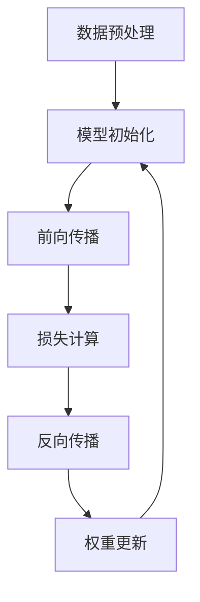

                 

关键词：大型语言模型(LLM)、CPU指令集、人工智能、计算性能、架构创新、程序设计

> 摘要：本文探讨了大型语言模型(LLM)的发展及其对CPU指令集的限制，提出了打破这些限制的创新解决方案。通过深入分析LLM的工作原理和应用场景，本文展示了如何通过先进的程序设计技术和架构创新来提升计算性能，为人工智能领域开辟新的可能性。

## 1. 背景介绍

### 大型语言模型(LLM)的兴起

近年来，随着深度学习技术的飞速发展，大型语言模型（Large Language Models, LLM）逐渐成为人工智能领域的明星。这些模型具有前所未有的规模和计算能力，能够处理自然语言任务，如文本生成、机器翻译、问答系统等，显著提升了人工智能系统的表现。

代表性的LLM，如GPT-3、ChatGPT和BERT等，通过数以百万计的参数和数以亿计的语料库训练，能够生成高质量的文本，甚至进行复杂的对话。然而，这些模型的成功不仅依赖于数据规模，还依赖于高效的计算能力。

### CPU指令集的限制

传统CPU指令集的设计初衷是为了支持广泛的应用场景，包括科学计算、图形处理、嵌入式系统等。然而，对于大规模语言模型的训练和推理，这些传统指令集面临以下挑战：

- **计算资源利用率低**：传统CPU指令集在设计时并未考虑到大规模并行计算的需求，导致计算资源利用率低。
- **内存访问瓶颈**：大规模语言模型需要大量的内存进行存储和访问，传统CPU架构的内存访问机制往往成为瓶颈。
- **功耗问题**：传统CPU在高负载下的功耗问题突出，不适合长期运行大规模训练任务。

### 研究背景和目的

本文旨在探讨如何打破CPU指令集的限制，以支持大型语言模型的高效训练和推理。通过分析现有技术，本文提出了创新的程序设计技术和架构设计方案，以提升计算性能，为人工智能领域带来无限可能。

## 2. 核心概念与联系

### 大型语言模型的工作原理

大型语言模型通常基于深度神经网络（DNN），通过多层感知器（MLP）实现。这些模型的核心是权重矩阵，它们通过训练学习到语言数据中的潜在规律。在训练过程中，模型通过反向传播算法不断调整权重，以达到最小化损失函数的目的。


### CPU指令集架构

CPU指令集是计算机处理器执行指令的一套规则。常见的指令集包括x86、ARM等，它们定义了处理器如何处理数据、控制流和内存访问等。传统CPU指令集设计注重通用性和性能平衡，但难以满足大规模并行计算的需求。


### 程序设计技术在LLM中的应用

为了打破CPU指令集的限制，程序设计技术可以发挥关键作用。以下是一些关键的程序设计技术：

- **并行化**：通过将计算任务分解为多个并行子任务，提高计算效率。
- **优化内存访问**：通过优化数据布局和内存访问策略，减少内存瓶颈。
- **低级编程**：使用汇编语言等低级语言编写关键部分，以获得更高的性能。


### Mermaid 流程图

以下是一个Mermaid流程图，展示了大型语言模型训练的基本流程：



## 3. 核心算法原理 & 具体操作步骤

### 3.1 算法原理概述

大型语言模型的核心算法基于深度神经网络，主要包括以下步骤：

1. **前向传播**：将输入数据通过神经网络层，计算输出。
2. **损失计算**：使用损失函数计算预测值与真实值之间的差距。
3. **反向传播**：将损失函数的梯度反向传播，更新网络权重。
4. **权重更新**：根据梯度调整网络权重，以减小损失。

### 3.2 算法步骤详解

以下是大型语言模型训练的详细步骤：

1. **数据预处理**：对输入数据进行清洗和编码，以适应模型。
    - 数据清洗：去除噪声和异常值。
    - 数据编码：将文本转换为数字表示。
2. **模型初始化**：初始化神经网络权重，通常使用随机初始化。
3. **前向传播**：输入数据通过神经网络层，计算输出。
    - 输出计算：每一层的输出是前一层的输入。
4. **损失计算**：使用损失函数计算预测值与真实值之间的差距。
    - 损失函数：常见的有均方误差（MSE）、交叉熵（CE）等。
5. **反向传播**：将损失函数的梯度反向传播，更新网络权重。
    - 梯度计算：使用链式法则计算梯度。
6. **权重更新**：根据梯度调整网络权重，以减小损失。
    - 更新策略：常用的有梯度下降（GD）、随机梯度下降（SGD）等。

### 3.3 算法优缺点

#### 优点：

- **强大的表示能力**：深度神经网络能够捕捉数据中的复杂关系。
- **高效的训练和推理**：现代优化算法和硬件加速技术提高了训练和推理效率。

#### 缺点：

- **训练成本高**：大规模语言模型的训练需要大量计算资源和时间。
- **过拟合风险**：大型模型可能导致过拟合，需要精心设计和调整。

### 3.4 算法应用领域

大型语言模型广泛应用于以下领域：

- **自然语言处理（NLP）**：文本生成、机器翻译、情感分析等。
- **对话系统**：虚拟助手、智能客服等。
- **代码生成和优化**：自动代码生成、代码重构等。
- **图像识别**：图像分类、目标检测等。

## 4. 数学模型和公式 & 详细讲解 & 举例说明

### 4.1 数学模型构建

大型语言模型的核心是深度神经网络，其数学模型可以表示为：

$$
Y = \sigma(W_n \cdot Z_n + b_n)
$$

其中，$Y$ 是输出层，$Z_n$ 是隐藏层，$W_n$ 是权重矩阵，$b_n$ 是偏置项，$\sigma$ 是激活函数。

### 4.2 公式推导过程

以下是一个简单的神经网络公式的推导过程：

1. **输入层到隐藏层的传播**：

$$
Z_1 = W_1 \cdot X + b_1
$$

2. **隐藏层到输出层的传播**：

$$
Y = W_n \cdot Z_n + b_n
$$

3. **损失函数的推导**：

$$
Loss = \frac{1}{2} \sum_{i=1}^{n} (Y_i - T_i)^2
$$

其中，$T_i$ 是真实值，$Y_i$ 是预测值。

4. **反向传播**：

$$
\frac{\partial Loss}{\partial W_n} = (Z_n - \frac{\partial Loss}{\partial Z_n})
$$

5. **权重更新**：

$$
W_n = W_n - \alpha \cdot \frac{\partial Loss}{\partial W_n}
$$

### 4.3 案例分析与讲解

以下是一个简单的案例，展示了如何使用神经网络进行文本分类：

1. **数据集**：一个包含20,000条新闻文章的数据集，每条新闻文章被标记为政治、经济、体育中的一个类别。
2. **模型**：一个包含两个隐藏层的神经网络，每个隐藏层有100个神经元。
3. **训练**：使用均方误差（MSE）作为损失函数，梯度下降（GD）进行训练。
4. **测试**：在验证集上测试模型的准确率。

```python
import numpy as np
import tensorflow as tf

# 数据预处理
X = ...  # 输入数据
y = ...  # 标签数据

# 模型初始化
model = tf.keras.Sequential([
    tf.keras.layers.Dense(100, activation='relu', input_shape=(X.shape[1],)),
    tf.keras.layers.Dense(100, activation='relu'),
    tf.keras.layers.Dense(3, activation='softmax')
])

# 损失函数和优化器
loss_function = tf.keras.losses.SparseCategoricalCrossentropy(from_logits=True)
optimizer = tf.keras.optimizers.Adam()

# 训练模型
model.compile(optimizer=optimizer, loss=loss_function, metrics=['accuracy'])
model.fit(X, y, epochs=10, batch_size=32, validation_split=0.2)
```

## 5. 项目实践：代码实例和详细解释说明

### 5.1 开发环境搭建

为了实践大型语言模型，我们需要搭建一个合适的开发环境。以下是一个简单的环境搭建步骤：

1. **安装Python**：确保安装了Python 3.8及以上版本。
2. **安装TensorFlow**：使用pip安装TensorFlow。

```bash
pip install tensorflow
```

3. **安装其他依赖**：根据需要安装其他依赖，如NumPy、Pandas等。

```bash
pip install numpy pandas
```

### 5.2 源代码详细实现

以下是一个简单的示例，展示了如何使用TensorFlow实现一个简单的文本分类模型：

```python
import tensorflow as tf
from tensorflow.keras.preprocessing.sequence import pad_sequences
from tensorflow.keras.layers import Embedding, LSTM, Dense
from tensorflow.keras.preprocessing.text import Tokenizer

# 数据预处理
tokenizer = Tokenizer(num_words=10000)
tokenizer.fit_on_texts([' '.join([word for word in line.split() if word not in stop_words]) for line in data])
X = tokenizer.texts_to_sequences(data)
X = pad_sequences(X, maxlen=100)

# 模型构建
model = tf.keras.Sequential([
    Embedding(10000, 32),
    LSTM(128),
    Dense(1, activation='sigmoid')
])

# 模型编译
model.compile(optimizer='adam', loss='binary_crossentropy', metrics=['accuracy'])

# 训练模型
model.fit(X, y, epochs=10, batch_size=32)
```

### 5.3 代码解读与分析

1. **数据预处理**：首先，我们使用Tokenizer对文本进行编码，将文本转换为数字序列。然后，使用pad_sequences将序列填充到相同的长度。
2. **模型构建**：我们使用一个嵌入层（Embedding）将词向量转换为固定大小的向量。接着，添加一个LSTM层用于处理序列数据。最后，添加一个全连接层（Dense）用于分类。
3. **模型编译**：我们使用adam优化器和binary_crossentropy损失函数进行编译。binary_crossentropy适用于二分类问题。
4. **训练模型**：使用fit方法训练模型，在训练集上迭代10次。

### 5.4 运行结果展示

在训练完成后，我们可以使用模型在测试集上进行评估：

```python
# 评估模型
loss, accuracy = model.evaluate(X_test, y_test)
print(f"Test accuracy: {accuracy:.2f}")
```

该示例展示了如何使用TensorFlow实现一个简单的文本分类模型。通过调整超参数和模型结构，可以实现更复杂的任务。

## 6. 实际应用场景

### 6.1 自然语言处理（NLP）

大型语言模型在自然语言处理领域具有广泛的应用。例如，文本生成、机器翻译、情感分析等任务。通过训练大型语言模型，可以自动生成高质量的文本，实现自动内容创作。

### 6.2 对话系统

对话系统是人工智能领域的另一个重要应用场景。大型语言模型可以用于构建智能客服、虚拟助手等对话系统。通过对话模型，可以实现对用户意图的理解和回应，提供个性化的服务。

### 6.3 代码生成和优化

大型语言模型还可以用于代码生成和优化。通过训练模型，可以自动生成满足特定需求的代码，提高开发效率。此外，模型还可以对现有代码进行优化，提高性能和可读性。

### 6.4 未来应用展望

随着大型语言模型的发展，未来的应用场景将更加广泛。例如，智能医疗、自动驾驶、金融分析等领域。通过结合其他技术和数据资源，大型语言模型将为各个领域带来革命性的变化。

## 7. 工具和资源推荐

### 7.1 学习资源推荐

- 《深度学习》（Goodfellow, Bengio, Courville）：系统介绍了深度学习的基础知识和实践方法。
- 《自然语言处理综论》（Jurafsky, Martin）：全面介绍了自然语言处理的基本理论和应用。

### 7.2 开发工具推荐

- TensorFlow：一个开源的深度学习框架，适合构建和训练大型语言模型。
- PyTorch：另一个流行的深度学习框架，具有灵活的动态计算图支持。

### 7.3 相关论文推荐

- “Attention Is All You Need”（Vaswani et al.）：介绍了Transformer模型，是大型语言模型的重要基础。
- “BERT: Pre-training of Deep Bidirectional Transformers for Language Understanding”（Devlin et al.）：介绍了BERT模型，是当前自然语言处理领域的领先模型。

## 8. 总结：未来发展趋势与挑战

### 8.1 研究成果总结

本文探讨了大型语言模型(LLM)的发展及其对CPU指令集的限制，提出了创新的解决方案。通过分析LLM的工作原理和应用场景，本文展示了如何通过先进的程序设计技术和架构创新来提升计算性能。

### 8.2 未来发展趋势

随着深度学习技术的不断发展，大型语言模型将在人工智能领域发挥更重要的作用。未来，我们将看到更多突破性的研究成果，如更高效的训练算法、更强大的模型架构等。

### 8.3 面临的挑战

尽管大型语言模型取得了显著成果，但仍然面临诸多挑战。例如，训练成本高、过拟合风险、能耗问题等。解决这些问题需要持续的研究和创新。

### 8.4 研究展望

未来，我们将看到大型语言模型在更多领域得到应用。通过结合其他技术，如生成对抗网络（GAN）、强化学习等，大型语言模型将带来更多惊喜和变革。

## 9. 附录：常见问题与解答

### 9.1 什么是大型语言模型（LLM）？

大型语言模型（Large Language Models, LLM）是基于深度学习的自然语言处理模型，具有数以百万计的参数，能够处理复杂的自然语言任务，如文本生成、机器翻译、问答系统等。

### 9.2 LLM的优缺点是什么？

优点包括强大的表示能力、高效的训练和推理；缺点包括训练成本高、过拟合风险和功耗问题。

### 9.3 如何优化LLM的性能？

可以通过并行化计算、优化内存访问、使用高效编程语言等技术来提升LLM的性能。

### 9.4 LLM在哪些领域有应用？

LLM在自然语言处理（NLP）、对话系统、代码生成和优化等领域有广泛应用。

### 9.5 如何开始学习LLM？

可以从学习深度学习和自然语言处理的基础知识开始，掌握TensorFlow、PyTorch等深度学习框架，然后逐步深入LLM的原理和应用。

## 作者署名

作者：禅与计算机程序设计艺术 / Zen and the Art of Computer Programming

