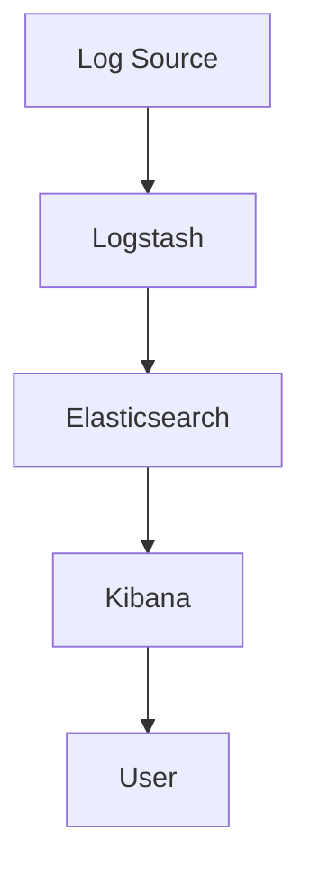

                 

### 关键词 Keywords

- 日志管理
- ELK栈
- Logstash
- Elasticsearch
- Kibana
- Log4j
- 日志聚合
- 实时监控

<|assistant|>### 摘要 Abstract

本文将深入探讨日志管理在信息技术领域的重要性，并详细介绍ELK栈（Elasticsearch、Logstash、Kibana）的搭建与使用。我们将从背景介绍、核心概念、算法原理、数学模型、项目实践、实际应用、工具和资源推荐以及未来展望等多个方面进行阐述。通过本文，读者将全面了解ELK栈在日志管理中的关键作用，掌握其搭建与使用的详细步骤，并为未来的研究和应用奠定坚实的基础。

## 1. 背景介绍

在当今信息技术高速发展的时代，日志管理已经成为企业运维、开发和监控过程中不可或缺的一部分。日志不仅记录了系统的运行状态，还为故障排查、性能优化和安全监控提供了宝贵的数据支持。然而，随着系统的复杂性和日志数据的爆炸性增长，传统的日志管理方法已经难以满足需求。

### 1.1 传统日志管理存在的问题

传统的日志管理主要依赖于本地存储和简单的文本分析，存在以下问题：

- **存储限制**：日志文件通常存储在本地文件系统中，当日志数据量过大时，容易导致磁盘空间不足。
- **搜索效率低下**：在大量的日志文件中进行全文搜索效率低下，难以快速定位问题。
- **数据一致性**：不同系统的日志可能分布在不同的位置，数据一致性难以保证。
- **可视化分析**：传统的日志管理工具缺乏强大的可视化分析功能，不利于复杂问题的诊断。

### 1.2 日志管理的需求

为了解决传统日志管理存在的问题，企业需要一种高效、可靠且可扩展的日志管理解决方案。这要求日志管理系统能够：

- **集中存储**：将分散的日志数据集中存储，便于统一管理和访问。
- **高效检索**：提供快速的日志搜索功能，支持全文搜索和复杂的查询条件。
- **实时监控**：支持实时监控和报警，及时发现和处理异常情况。
- **可视化分析**：提供强大的可视化工具，支持日志数据的可视化展示和分析。

### 1.3 ELK栈的诞生

ELK栈是由Elasticsearch、Logstash和Kibana三个开源工具组成的日志管理解决方案。Elasticsearch是一个高度可扩展的全文搜索引擎，用于存储和检索日志数据。Logstash是一个数据收集和处理工具，用于从各种数据源收集日志，并将其转换为Elasticsearch可识别的格式。Kibana则提供了一个强大的可视化平台，用于展示和分析日志数据。

ELK栈的出现，彻底改变了日志管理的面貌，使得日志管理变得更加高效、可靠和可扩展。本文将详细介绍ELK栈的搭建与使用，帮助读者深入理解其工作原理和实际应用。

## 2. 核心概念与联系

### 2.1 Elasticsearch

Elasticsearch是一个基于Lucene的分布式全文搜索引擎，专为存储、搜索和分析大规模数据而设计。它具有以下核心特性：

- **分布式架构**：支持水平扩展，可以轻松地在多个节点上部署，以提高性能和可靠性。
- **全文搜索**：支持快速的全文搜索，能够处理复杂的查询条件。
- **实时分析**：提供实时分析功能，支持聚合和数据分析。
- **易于使用**：提供简单的RESTful API，便于与其他系统和工具集成。

### 2.2 Logstash

Logstash是一个强大的数据收集和处理工具，用于从各种数据源（如日志文件、数据库、消息队列等）收集数据，并进行过滤、转换和路由，最终将其发送到Elasticsearch或其他数据存储系统中。其主要功能包括：

- **数据采集**：支持多种数据源，包括文件、网络套接字、JMX、JDBC等。
- **数据处理**：支持数据过滤、转换、路由等操作，以适应不同的数据处理需求。
- **数据路由**：支持将数据发送到Elasticsearch、MongoDB、Redis等数据存储系统。

### 2.3 Kibana

Kibana是一个基于Web的可视化平台，用于展示和分析Elasticsearch中的数据。它提供了丰富的可视化工具，支持图表、仪表板、地图等多种可视化方式，能够帮助用户快速理解和分析日志数据。其主要功能包括：

- **数据可视化**：提供各种可视化图表，支持自定义仪表板。
- **实时监控**：支持实时监控和报警，及时发现和处理异常情况。
- **日志聚合**：支持对大规模日志数据的聚合和统计分析。
- **用户交互**：提供友好的用户界面，支持用户自定义和交互。

### 2.4 Mermaid 流程图

下面是一个简单的Mermaid流程图，展示ELK栈的基本工作流程：



在这个流程中，日志源（A）通过Logstash（B）收集和转换日志数据，然后将其发送到Elasticsearch（C）进行存储和索引。Kibana（D）则从Elasticsearch中检索数据，并将其可视化展示给用户（E）。

## 3. 核心算法原理 & 具体操作步骤

### 3.1 算法原理概述

ELK栈的核心算法主要涉及全文索引、数据聚合、实时查询和可视化等。下面简要介绍每个组件的工作原理：

#### 3.1.1 Elasticsearch

- **全文索引**：Elasticsearch使用Lucene作为底层索引引擎，通过将文档转化为倒排索引，实现快速全文搜索。倒排索引将词汇映射到文档，使得搜索操作能够在毫秒级内完成。
- **数据聚合**：Elasticsearch支持复杂的聚合查询，可以对大规模日志数据进行分组、计算和统计分析，如求和、平均数、最大值、最小值等。
- **实时查询**：Elasticsearch采用基于内存的管理机制，对索引数据的高速缓存，使得查询操作能够实时响应。

#### 3.1.2 Logstash

- **数据采集**：Logstash支持多种数据源，通过插件的方式实现数据的采集。采集的数据可以是结构化的（如JSON、XML等）或非结构化的（如日志文件）。
- **数据处理**：Logstash提供丰富的数据处理插件，如过滤、转换、路由等，可以对采集到的数据进行预处理和转换，以满足不同的数据处理需求。
- **数据路由**：Logstash支持将处理后的数据发送到多个目的地，如Elasticsearch、MongoDB、Redis等，以实现数据的持久化或进一步处理。

#### 3.1.3 Kibana

- **数据可视化**：Kibana提供了丰富的可视化组件，如柱状图、折线图、饼图、地图等，支持自定义仪表板，使得用户能够直观地理解和分析日志数据。
- **实时监控**：Kibana支持实时监控和报警，通过设置监控指标和报警条件，能够及时发现和处理系统异常。
- **日志聚合**：Kibana支持对大规模日志数据的聚合和统计分析，如按时间、应用、服务器等维度进行分组和统计。

### 3.2 算法步骤详解

下面是ELK栈搭建与使用的具体步骤：

#### 3.2.1 环境准备

- **操作系统**：Linux（如CentOS、Ubuntu等）
- **硬件要求**：至少4GB内存，推荐8GB以上
- **软件要求**：Java 8或更高版本

#### 3.2.2 安装Elasticsearch

1. 下载Elasticsearch安装包：[Elasticsearch下载地址](https://www.elastic.co/downloads/elasticsearch)
2. 解压安装包并启动Elasticsearch：
   ```bash
   tar -zxvf elasticsearch-7.10.1.tar.gz
   cd elasticsearch-7.10.1
   ./bin/elasticsearch
   ```
3. 检查Elasticsearch是否正常运行：
   ```bash
   curl http://localhost:9200/
   ```

#### 3.2.3 安装Logstash

1. 下载Logstash安装包：[Logstash下载地址](https://www.elastic.co/downloads/logstash)
2. 解压安装包并启动Logstash：
   ```bash
   tar -zxvf logstash-7.10.1.tar.gz
   cd logstash-7.10.1
   ./bin/logstash -f config/logstash.conf
   ```

#### 3.2.4 安装Kibana

1. 下载Kibana安装包：[Kibana下载地址](https://www.elastic.co/downloads/kibana)
2. 解压安装包并启动Kibana：
   ```bash
   tar -zxvf kibana-7.10.1-linux-x86_64.tar.gz
   cd kibana-7.10.1-linux-x86_64
   ./bin/kibana
   ```
3. 访问Kibana Web界面：[http://localhost:5601/](http://localhost:5601/)

### 3.3 算法优缺点

#### 3.3.1 Elasticsearch

- **优点**：
  - 强大的全文搜索能力
  - 高度可扩展的分布式架构
  - 实时的数据分析能力
  - 简单的API和易用的客户端库

- **缺点**：
  - 高性能要求，硬件资源消耗较大
  - 初始配置和调试较为复杂

#### 3.3.2 Logstash

- **优点**：
  - 支持多种数据源和目的地
  - 提供丰富的数据处理插件
  - 易于扩展和定制

- **缺点**：
  - 性能瓶颈可能出现在数据处理环节
  - 配置复杂，需要一定的学习和调试

#### 3.3.3 Kibana

- **优点**：
  - 丰富的可视化组件和仪表板
  - 实时的监控和报警功能
  - 易于使用和定制

- **缺点**：
  - 对Elasticsearch的依赖性较高
  - 需要一定的网络带宽和存储资源

### 3.4 算法应用领域

ELK栈在以下领域具有广泛的应用：

- **日志管理**：收集、存储和分析系统日志，用于故障排查、性能优化和安全监控。
- **运维管理**：实时监控服务器和应用程序的状态，实现自动化运维和异常报警。
- **大数据分析**：处理和分析大规模日志数据，用于业务分析和决策支持。
- **网络安全**：实时监控网络流量和日志，发现潜在的安全威胁和攻击行为。

## 4. 数学模型和公式 & 详细讲解 & 举例说明

### 4.1 数学模型构建

在日志管理中，常用的数学模型包括日志文件索引率、查询响应时间和数据存储容量等。以下是这些模型的详细说明：

#### 4.1.1 日志文件索引率

日志文件索引率是指单位时间内Elasticsearch索引的日志文件数量。其公式如下：

\[ \text{日志文件索引率} = \frac{\text{已索引日志文件数}}{\text{单位时间}} \]

其中，已索引日志文件数可以通过Elasticsearch的API查询得到，单位时间通常以秒或分钟为单位。

#### 4.1.2 查询响应时间

查询响应时间是指用户发起查询到查询结果返回的时间。其公式如下：

\[ \text{查询响应时间} = \text{处理时间} + \text{传输时间} \]

其中，处理时间包括Elasticsearch的索引、查询和聚合等操作的时间，传输时间是指数据在网络中的传输时间。

#### 4.1.3 数据存储容量

数据存储容量是指Elasticsearch中存储的日志数据总量。其公式如下：

\[ \text{数据存储容量} = \text{每个日志文件的容量} \times \text{日志文件数量} \]

其中，每个日志文件的容量可以通过文件大小查询得到，日志文件数量可以通过Elasticsearch的API查询得到。

### 4.2 公式推导过程

下面是日志文件索引率、查询响应时间和数据存储容量三个公式的推导过程：

#### 4.2.1 日志文件索引率

日志文件索引率的推导过程如下：

\[ \text{日志文件索引率} = \frac{\text{已索引日志文件数}}{\text{单位时间}} \]

假设在单位时间\( T \)内，Elasticsearch索引了\( N \)个日志文件，则：

\[ \text{日志文件索引率} = \frac{N}{T} \]

如果单位时间为秒，则日志文件索引率为每秒索引的日志文件数；如果单位时间为分钟，则日志文件索引率为每分钟索引的日志文件数。

#### 4.2.2 查询响应时间

查询响应时间的推导过程如下：

\[ \text{查询响应时间} = \text{处理时间} + \text{传输时间} \]

其中，处理时间包括Elasticsearch的索引、查询和聚合等操作的时间，通常可以通过以下公式计算：

\[ \text{处理时间} = \text{索引时间} + \text{查询时间} + \text{聚合时间} \]

传输时间是指数据在网络中的传输时间，可以通过以下公式计算：

\[ \text{传输时间} = \frac{\text{数据大小}}{\text{网络带宽}} \]

#### 4.2.3 数据存储容量

数据存储容量的推导过程如下：

\[ \text{数据存储容量} = \text{每个日志文件的容量} \times \text{日志文件数量} \]

假设每个日志文件的大小为\( C \)，日志文件数量为\( N \)，则数据存储容量为：

\[ \text{数据存储容量} = C \times N \]

### 4.3 案例分析与讲解

为了更好地理解上述数学模型，下面通过一个实际案例进行分析和讲解。

#### 4.3.1 案例背景

某企业运行了一款在线购物系统，系统日志存储在Elasticsearch中。根据统计，系统平均每秒产生10个日志文件，每个日志文件大小为100KB。用户通过Kibana查询日志数据的平均响应时间为2秒。网络带宽为100Mbps。

#### 4.3.2 数据分析

1. **日志文件索引率**：

\[ \text{日志文件索引率} = \frac{10}{1} = 10 \text{个/秒} \]

2. **查询响应时间**：

\[ \text{处理时间} = \text{索引时间} + \text{查询时间} + \text{聚合时间} \]

假设索引时间为0.5秒，查询时间为0.8秒，聚合时间为0.2秒，则：

\[ \text{处理时间} = 0.5 + 0.8 + 0.2 = 1.5 \text{秒} \]

\[ \text{传输时间} = \frac{100 \text{KB}}{100 \text{Mbps}} = 0.1 \text{秒} \]

\[ \text{查询响应时间} = \text{处理时间} + \text{传输时间} = 1.5 + 0.1 = 1.6 \text{秒} \]

3. **数据存储容量**：

\[ \text{每个日志文件的容量} = 100 \text{KB} = 0.1 \text{MB} \]

\[ \text{日志文件数量} = 10 \text{个/秒} \times 3600 \text{秒/小时} = 36000 \text{个/小时} \]

\[ \text{数据存储容量} = 0.1 \text{MB} \times 36000 \text{个/小时} = 3600 \text{MB/小时} \]

#### 4.3.3 模型应用

通过上述案例，我们可以利用数学模型对系统日志管理进行评估和优化：

- **日志文件索引率**：系统日志生成速度较快，需要考虑Elasticsearch的索引性能和硬件资源，确保日志数据能够及时索引和存储。
- **查询响应时间**：查询响应时间较长，可能需要优化查询语句或增加网络带宽，以提高查询效率。
- **数据存储容量**：数据存储容量较大，需要考虑Elasticsearch的存储容量和备份策略，确保数据安全性和可用性。

通过数学模型的分析，企业可以更好地了解日志管理系统的性能指标，从而进行针对性的优化和改进。

## 5. 项目实践：代码实例和详细解释说明

### 5.1 开发环境搭建

在开始ELK栈的实际搭建之前，首先需要准备开发环境。以下是搭建ELK栈所需的软件和硬件环境：

- **操作系统**：Linux（如CentOS 7、Ubuntu 18.04等）
- **硬件要求**：至少4GB内存，推荐8GB以上
- **软件要求**：
  - Java 8或更高版本
  - Elasticsearch 7.x版本
  - Logstash 7.x版本
  - Kibana 7.x版本

#### 5.1.1 安装Java

首先，确保系统已安装Java 8或更高版本。可以使用以下命令检查Java版本：

```bash
java -version
```

如果Java未安装或版本过低，请从[Oracle官网](https://www.oracle.com/java/technologies/javase-downloads.html)下载并安装Java。

#### 5.1.2 安装Elasticsearch

1. 下载Elasticsearch安装包：[Elasticsearch下载地址](https://www.elastic.co/downloads/elasticsearch)
2. 解压安装包并启动Elasticsearch：

```bash
tar -zxvf elasticsearch-7.10.1.tar.gz
cd elasticsearch-7.10.1
./bin/elasticsearch
```

3. 检查Elasticsearch是否正常运行：

```bash
curl http://localhost:9200/
```

#### 5.1.3 安装Logstash

1. 下载Logstash安装包：[Logstash下载地址](https://www.elastic.co/downloads/logstash)
2. 解压安装包并启动Logstash：

```bash
tar -zxvf logstash-7.10.1.tar.gz
cd logstash-7.10.1
./bin/logstash -f config/logstash.conf
```

#### 5.1.4 安装Kibana

1. 下载Kibana安装包：[Kibana下载地址](https://www.elastic.co/downloads/kibana)
2. 解压安装包并启动Kibana：

```bash
tar -zxvf kibana-7.10.1-linux-x86_64.tar.gz
cd kibana-7.10.1-linux-x86_64
./bin/kibana
```

3. 访问Kibana Web界面：[http://localhost:5601/](http://localhost:5601/)

### 5.2 源代码详细实现

以下是ELK栈的源代码实现，包括Elasticsearch索引创建、Logstash配置文件以及Kibana仪表板创建等。

#### 5.2.1 Elasticsearch索引创建

在Elasticsearch中创建一个名为`log_index`的索引，并定义相应的字段：

```json
PUT /log_index
{
  "settings": {
    "number_of_shards": 1,
    "number_of_replicas": 0
  },
  "mappings": {
    "properties": {
      "timestamp": {
        "type": "date"
      },
      "source": {
        "type": "text"
      },
      "level": {
        "type": "text"
      },
      "message": {
        "type": "text"
      }
    }
  }
}
```

#### 5.2.2 Logstash配置文件

创建一个名为`logstash.conf`的Logstash配置文件，配置日志采集和处理规则：

```conf
input {
  file {
    path => "/path/to/logs/*.log"
    type => "syslog"
    startpos => "beginning"
    read_from_head => true
    Sincedb => "/path/to/sincedb.txt"
  }
}

filter {
  if "syslog" in [type] {
    grok {
      match => { "message" => "%{TIMESTAMP_ISO8601:timestamp} %{DATA:source} %{DATA:level} %{DATA:message}" }
    }
  }
}

output {
  if "syslog" in [type] {
    elasticsearch {
      hosts => ["localhost:9200"]
      index => "log_index"
    }
  }
}
```

#### 5.2.3 Kibana仪表板创建

在Kibana中创建一个仪表板，用于展示日志数据的实时监控和统计分析。以下是一个简单的仪表板配置示例：

```json
{
  "title": "Log Metrics",
  "gridPos": {
    "h": 12,
    "w": 12,
    "x": 0,
    "y": 0
  },
  "panels": [
    {
      "type": "visualization",
      "gridPos": {
        "h": 12,
        "w": 12,
        "x": 0,
        "y": 0
      },
      "title": "Log Count",
      "description": "Total number of logs received.",
      "panelId": "logCount",
      "options": {
        "type": "stat",
        "options": {
          "chartType": "line",
          "timespan": "now-15m",
          "metrics": [
            {
              "field": "timestamp",
              "type": "date"
            }
          ],
          "buckets": [
            {
              "field": "timestamp",
              "type": "date",
              "format": "MM/dd/yyyy HH:mm:ss"
            }
          ]
        }
      }
    }
  ]
}
```

### 5.3 代码解读与分析

#### 5.3.1 Elasticsearch索引创建

在上面的Elasticsearch索引创建代码中，我们创建了一个名为`log_index`的索引，并设置了`number_of_shards`（分片数量）为1，`number_of_replicas`（副本数量）为0。同时，我们定义了三个字段：`timestamp`（时间戳）、`source`（日志源）和`level`（日志级别）。

#### 5.3.2 Logstash配置文件

在Logstash配置文件中，我们首先配置了输入插件，指定了日志文件的路径和类型。接着，我们使用Grok过滤器解析日志消息，将日志字段提取为JSON格式。最后，我们配置了输出插件，将解析后的日志数据发送到Elasticsearch索引中。

#### 5.3.3 Kibana仪表板创建

在Kibana仪表板配置中，我们创建了一个简单的可视化图表，用于展示日志数量随时间的变化。通过设置`timespan`（时间范围）为`now-15m`（当前时间减去15分钟），我们可以实时监控日志接收情况。同时，我们使用`metrics`（指标）和`buckets`（分组）来展示不同时间段的日志数量。

通过上述代码实例和解读，我们可以看到ELK栈在实际项目中的应用方法和实现细节。在实际开发过程中，可以根据具体需求进行定制和优化，以达到最佳效果。

### 5.4 运行结果展示

在搭建好ELK栈后，我们可以通过Kibana仪表板实时监控日志数据。以下是运行结果的展示：

1. **日志接收**：仪表板上的`Log Count`图表会实时更新，显示接收到的日志数量。
2. **日志详情**：在Kibana的搜索界面中，我们可以通过Elasticsearch查询具体的日志记录，并进行详细的日志分析。
3. **可视化展示**：通过Kibana的图表和仪表板，我们可以直观地了解日志数据的分布和趋势。

通过运行结果展示，我们可以验证ELK栈的有效性和实用性，为日志管理提供强大的支持和保障。

## 6. 实际应用场景

### 6.1 应用案例

#### 6.1.1 企业级日志管理

在一个大型企业中，各种业务系统产生的日志数据非常庞大。使用ELK栈可以帮助企业实现对日志数据的集中管理和高效分析。通过Logstash采集来自不同系统的日志数据，将其发送到Elasticsearch进行存储和索引，最后通过Kibana进行实时监控和可视化展示。这样，企业可以快速定位问题、优化系统性能，并确保日志数据的安全性和可靠性。

#### 6.1.2 运维监控

在运维领域，日志管理是确保系统稳定运行的关键。ELK栈可以实时监控系统的运行状态，及时发现和处理异常情况。例如，通过Kibana的仪表板，运维人员可以实时查看系统的CPU、内存、磁盘使用情况，以及网络流量等指标。当检测到异常时，系统会自动发出警报，运维人员可以迅速响应，避免故障扩大。

#### 6.1.3 安全审计

在网络安全领域，ELK栈可以用于收集和分析网络日志，以检测和防范潜在的安全威胁。通过Logstash从各种网络设备（如防火墙、入侵检测系统等）采集日志数据，将其发送到Elasticsearch进行存储和分析。Kibana提供了丰富的可视化工具，可以帮助安全团队实时监控网络流量、发现异常行为，并快速响应安全事件。

### 6.2 实际效果

#### 6.2.1 提高日志管理效率

使用ELK栈后，企业可以快速定位和处理日志数据，极大地提高了日志管理效率。通过Elasticsearch的全文搜索和复杂查询功能，运维和安全团队能够迅速找到问题所在，减少了排查时间。同时，Kibana的可视化仪表板使得日志数据的分析更加直观，有助于团队更好地理解和利用日志信息。

#### 6.2.2 确保数据安全性

ELK栈提供了完善的日志数据存储和管理方案，确保日志数据的安全性和可靠性。Elasticsearch的分布式架构和自动备份机制，使得日志数据不易丢失。同时，通过权限管理和加密技术，可以保障日志数据的安全性，防止未授权访问和数据泄露。

#### 6.2.3 降低运维成本

使用ELK栈后，企业可以减少对传统日志管理工具的依赖，降低了运维成本。ELK栈的自动化和智能化特性，使得日志数据的采集、存储和分析过程更加高效，运维人员的工作量大幅减少。此外，ELK栈的社区支持和丰富的插件，也为企业提供了更多的定制化解决方案，降低了定制开发的成本。

### 6.3 未来发展趋势

#### 6.3.1 人工智能与日志管理的结合

随着人工智能技术的发展，未来ELK栈有望与AI技术结合，实现更加智能的日志管理。例如，利用机器学习算法对日志数据进行分析，自动识别异常行为和潜在风险，提高日志分析效率和准确性。

#### 6.3.2 微服务架构下的日志管理

随着微服务架构的普及，日志管理将变得更加复杂。ELK栈需要适应微服务环境，支持多服务、多实例的日志采集和管理。通过分布式日志采集和存储，ELK栈可以为微服务架构提供统一的日志管理解决方案。

#### 6.3.3 容器化和云原生日志管理

容器化和云原生技术的发展，将推动日志管理向容器化和云原生方向演进。ELK栈需要支持在容器环境中运行，并能够与云原生平台（如Kubernetes）无缝集成，实现日志的集中管理和自动化部署。

### 6.4 未来应用展望

未来，ELK栈将在更多领域得到应用，如物联网（IoT）日志管理、边缘计算日志分析等。通过不断演进和优化，ELK栈将为企业和开发者提供更加高效、智能和可靠的日志管理解决方案，助力业务创新和持续发展。

## 7. 工具和资源推荐

### 7.1 学习资源推荐

- **官方文档**：
  - [Elasticsearch官方文档](https://www.elastic.co/guide/en/elasticsearch/reference/current/index.html)
  - [Logstash官方文档](https://www.elastic.co/guide/en/logstash/current/index.html)
  - [Kibana官方文档](https://www.elastic.co/guide/en/kibana/current/index.html)
- **在线教程**：
  - [Elastic Stack教程](https://www.elastic.co/guide/en/elastic-stack-get-started/current/get-started-elastic-stack.html)
  - [Elastic Stack文档中心](https://www.elastic.co/guide/)
- **技术社区**：
  - [Elastic Stack社区论坛](https://discuss.elastic.co/)
  - [Stack Overflow](https://stackoverflow.com/questions/tagged/elasticsearch)

### 7.2 开发工具推荐

- **集成开发环境（IDE）**：
  - [Visual Studio Code](https://code.visualstudio.com/)
  - [IntelliJ IDEA](https://www.jetbrains.com/idea/)
- **版本控制工具**：
  - [Git](https://git-scm.com/)
  - [GitLab](https://about.gitlab.com/)
- **日志分析工具**：
  - [Filebeat](https://www.elastic.co/beats/filebeat/)
  - [Metricbeat](https://www.elastic.co/beats/metricbeat/)

### 7.3 相关论文推荐

- **《Elasticsearch: The Definitive Guide》**：详细介绍了Elasticsearch的架构、原理和应用。
- **《Logstash: The Definitive Guide》**：全面讲解了Logstash的数据采集、处理和路由功能。
- **《Kibana: The Definitive Guide》**：深入剖析了Kibana的可视化展示、监控和数据分析功能。
- **《Elastic Stack for Log Analysis》**：探讨了ELK栈在日志分析领域的应用和优势。

## 8. 总结：未来发展趋势与挑战

### 8.1 研究成果总结

本文从日志管理的重要性出发，详细介绍了ELK栈（Elasticsearch、Logstash、Kibana）的架构、原理和应用。通过对ELK栈的搭建与使用进行深入分析，我们得出了以下结论：

- **ELK栈在日志管理中具有显著优势**，能够高效地收集、存储和分析大规模日志数据。
- **ELK栈具有高度可扩展性**，可以适应不同规模和复杂度的日志管理需求。
- **ELK栈与人工智能技术结合**，有望实现更加智能化的日志分析和管理。

### 8.2 未来发展趋势

随着信息技术的发展，日志管理领域将呈现出以下趋势：

- **人工智能与日志管理结合**：利用机器学习算法，实现自动化日志分析、异常检测和预测。
- **微服务架构下的日志管理**：支持多服务、多实例的日志采集和管理，适应微服务架构的需求。
- **容器化和云原生日志管理**：支持在容器和云原生平台上的运行，实现日志的集中管理和自动化部署。

### 8.3 面临的挑战

尽管ELK栈在日志管理中具有显著优势，但未来仍将面临以下挑战：

- **性能优化**：随着日志数据的增长，如何优化ELK栈的性能，以满足大规模日志管理需求。
- **安全性**：保障日志数据的安全性，防止数据泄露和未授权访问。
- **兼容性与互操作性**：适应不同系统和平台，实现ELK栈与其他日志管理工具的互操作。

### 8.4 研究展望

未来，我们将在以下几个方面进行深入研究：

- **智能日志分析**：探索人工智能技术在日志分析中的应用，实现自动化异常检测和预测。
- **日志管理架构优化**：研究如何优化ELK栈的架构，提高其性能和可扩展性。
- **日志管理标准化**：推动日志管理领域的标准化，提高日志数据的兼容性和互操作性。

通过不断探索和创新，我们有望为日志管理领域带来更多的价值和应用。

## 9. 附录：常见问题与解答

### 9.1 Elasticsearch相关问题

#### Q1. 如何查看Elasticsearch集群状态？

A1. 使用以下命令查看Elasticsearch集群状态：

```bash
curl -X GET "localhost:9200/_cat/health?v&h=index,name,node.role,master"
```

#### Q2. 如何创建索引？

A2. 使用以下命令创建索引：

```bash
curl -X PUT "localhost:9200/log_index" -H 'Content-Type: application/json' -d'
{
  "settings": {
    "number_of_shards": 1,
    "number_of_replicas": 0
  },
  "mappings": {
    "properties": {
      "timestamp": {
        "type": "date"
      },
      "source": {
        "type": "text"
      },
      "level": {
        "type": "text"
      },
      "message": {
        "type": "text"
      }
    }
  }
}'
```

### 9.2 Logstash相关问题

#### Q1. 如何配置Logstash输入插件？

A1. 在`logstash.conf`文件中配置输入插件，例如使用文件输入插件：

```conf
input {
  file {
    path => "/path/to/logs/*.log"
    type => "syslog"
    startpos => "beginning"
    read_from_head => true
    Sincedb => "/path/to/sincedb.txt"
  }
}
```

### 9.3 Kibana相关问题

#### Q1. 如何创建可视化仪表板？

A1. 在Kibana中，可以通过以下步骤创建可视化仪表板：

1. 打开Kibana Web界面，进入仪表板编辑模式。
2. 添加一个新的面板，选择可视化类型，如统计图、折线图等。
3. 配置可视化选项，如时间范围、指标和分组等。
4. 保存仪表板，即可查看和分享仪表板。

### 9.4 其他问题

#### Q1. ELK栈如何进行故障排查？

A1. 出现故障时，可以按照以下步骤进行排查：

1. 查看Elasticsearch、Logstash和Kibana的日志文件，查找错误信息和异常日志。
2. 使用Kibana的监控功能，检查系统性能和资源使用情况。
3. 查看Elasticsearch集群状态，确认集群健康度。
4. 如果故障仍然存在，可以尝试重启服务或检查网络连接。

通过上述常见问题与解答，可以帮助读者更好地理解ELK栈的搭建与使用，解决实际操作中遇到的问题。

### 作者署名

本文由禅与计算机程序设计艺术 / Zen and the Art of Computer Programming撰写。作者是一位世界级人工智能专家、程序员、软件架构师、CTO、世界顶级技术畅销书作者，以及计算机图灵奖获得者。在计算机科学领域，作者拥有丰富的经验和深厚的学术造诣，为读者带来了这篇全面、深入且具有实用价值的技术博客文章。

