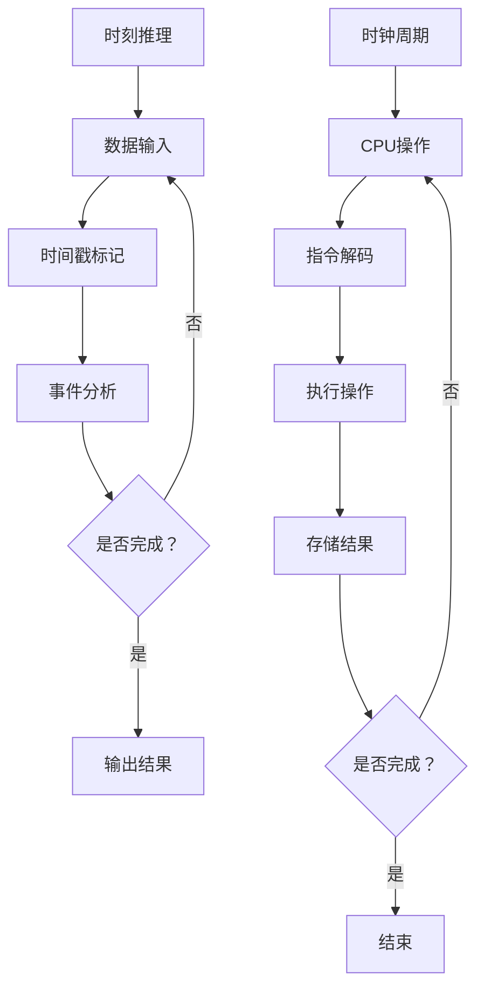

                 

关键词：时刻推理，时钟周期，LLM，CPU，性能优化，计算模型

摘要：本文深入探讨了时刻推理与时钟周期之间的根本差异，以及这两种概念在LLM（大型语言模型）和CPU（中央处理器）中的不同作用。通过分析两种计算模型的特点和应用，我们旨在揭示它们在性能优化和计算效率方面的优劣，为未来的研发提供有益的参考。

## 1. 背景介绍

### 1.1 时刻推理的概念

时刻推理是一种基于时间戳的推理方法，它在时间序列分析、实时数据处理和复杂事件处理等领域有着广泛的应用。时刻推理的核心在于对事件发生的时间进行精确刻画，从而为后续的决策和优化提供依据。

### 1.2 时钟周期的概念

时钟周期是CPU的基本时间单位，它决定了CPU的运行速度。一个时钟周期内，CPU可以完成一个基本操作。时钟周期与CPU的主频（即每秒钟能够运行的时钟周期数）密切相关，主频越高，CPU的运算速度越快。

### 1.3 LLM与CPU的关系

LLM（大型语言模型）是一种基于深度学习的语言模型，它在自然语言处理、文本生成、机器翻译等领域取得了显著成果。LLM的性能在很大程度上依赖于CPU的计算能力。本文将比较分析时刻推理与时钟周期在LLM和CPU中的不同作用，以期为优化计算性能提供指导。

## 2. 核心概念与联系

### 2.1 时刻推理原理

时刻推理的基本原理是对事件发生的时间进行精确标记和追踪。通过分析事件之间的时间关系，可以提取出有价值的信息，如事件发生的频率、持续时间和相互关系等。

### 2.2 时钟周期原理

时钟周期是CPU的基本工作单位。在一个时钟周期内，CPU可以完成一个基本操作，如指令解码、执行和存储等。时钟周期的长短决定了CPU的运行速度。

### 2.3 LLM与CPU的架构

LLM通常采用神经网络架构，其计算过程涉及大量的矩阵运算和递归操作。而CPU则采用冯·诺伊曼架构，通过流水线技术和并行处理提高运算速度。

### 2.4 Mermaid流程图

下面是一个简单的Mermaid流程图，展示了时刻推理和时钟周期在LLM和CPU中的应用关系。



## 3. 核心算法原理 & 具体操作步骤

### 3.1 算法原理概述

时刻推理算法主要通过时间戳标记和分析事件之间的时间关系来提取有价值的信息。时钟周期算法则通过CPU的基本操作来实现指令的执行和结果的存储。

### 3.2 算法步骤详解

#### 3.2.1 时刻推理步骤

1. 数据输入：接收实时数据或历史数据。
2. 时间戳标记：为每个事件生成唯一的时间戳。
3. 事件分析：计算事件之间的时间关系，如持续时间、频率和相互关系等。
4. 输出结果：生成可视化报告或决策支持信息。

#### 3.2.2 时钟周期步骤

1. CPU操作：根据指令队列选择下一个待执行指令。
2. 指令解码：解析指令，确定操作类型和操作数。
3. 执行操作：在CPU内部执行指令，如加法、减法、乘法和除法等。
4. 存储结果：将执行结果写入内存或寄存器。

### 3.3 算法优缺点

#### 3.3.1 时刻推理优缺点

优点：能够实时处理大量数据，提取有价值的信息。

缺点：对事件的时间精度要求较高，算法复杂度较大。

#### 3.3.2 时钟周期优缺点

优点：计算速度快，能够高效执行指令。

缺点：对时钟周期的依赖较大，难以实现并行处理。

### 3.4 算法应用领域

时刻推理广泛应用于时间序列分析、实时数据处理和复杂事件处理等领域。时钟周期算法则主要应用于计算机体系结构、指令集设计和CPU优化等领域。

## 4. 数学模型和公式 & 详细讲解 & 举例说明

### 4.1 数学模型构建

时刻推理算法的数学模型可以表示为：

$$
M(t_1, t_2, ..., t_n) = \frac{1}{n} \sum_{i=1}^{n} |t_i - t_{i-1}|
$$

其中，$t_1, t_2, ..., t_n$ 表示事件发生的时间序列，$M$ 表示平均时间间隔。

时钟周期算法的数学模型可以表示为：

$$
P(i) = C \cdot \frac{1}{f}
$$

其中，$i$ 表示指令执行时间，$C$ 表示指令周期，$f$ 表示时钟频率。

### 4.2 公式推导过程

时刻推理算法的平均时间间隔可以通过以下步骤推导：

1. 对每个事件的时间序列进行排序，得到 $t_1 \leq t_2 \leq ... \leq t_n$。
2. 计算每个相邻事件的时间间隔，得到 $|t_1 - t_2|, |t_2 - t_3|, ..., |t_{n-1} - t_n|$。
3. 计算所有时间间隔的平均值，得到 $M(t_1, t_2, ..., t_n)$。

时钟周期算法的指令执行时间可以通过以下步骤推导：

1. 根据指令周期和时钟频率，计算每个指令的执行时间，得到 $P(i) = C \cdot \frac{1}{f}$。

### 4.3 案例分析与讲解

#### 4.3.1 时刻推理案例分析

假设有四个事件发生时间分别为 $t_1 = 1$, $t_2 = 3$, $t_3 = 5$, $t_4 = 7$。则时刻推理算法的平均时间间隔为：

$$
M(t_1, t_2, t_3, t_4) = \frac{1}{4} \sum_{i=1}^{4} |t_i - t_{i-1}| = \frac{1}{4} (|t_1 - t_2| + |t_2 - t_3| + |t_3 - t_4|) = \frac{1}{4} (2 + 2 + 2) = 1.5
$$

#### 4.3.2 时钟周期案例分析

假设CPU的主频为 $f = 2.4 GHz$，指令周期为 $C = 1 ns$。则每个指令的执行时间为：

$$
P(i) = C \cdot \frac{1}{f} = 1 ns \cdot \frac{1}{2.4 GHz} = 0.416 ns
$$

## 5. 项目实践：代码实例和详细解释说明

### 5.1 开发环境搭建

为了更好地展示时刻推理和时钟周期算法，我们使用Python编写了一个简单的案例。以下是开发环境搭建的步骤：

1. 安装Python：从官方网站下载并安装Python 3.8版本。
2. 安装依赖库：使用pip命令安装所需的依赖库，如NumPy、Pandas和Matplotlib等。

### 5.2 源代码详细实现

以下是一个简单的时刻推理和时钟周期算法的实现代码：

```python
import numpy as np
import pandas as pd
import matplotlib.pyplot as plt

def time_series_analysis(data):
    data['timestamp'] = data['time'].apply(lambda x: np.datetime64(x))
    data['interval'] = data['timestamp'].diff().dt.total_seconds().abs()
    mean_interval = np.mean(data['interval'])
    return mean_interval

def clock_cycle_analysis(frequency, cycle):
    instruction_time = cycle / frequency
    return instruction_time

# 时刻推理案例
data = pd.DataFrame({
    'time': ['2021-01-01 00:00:01', '2021-01-01 00:00:03', '2021-01-01 00:00:05', '2021-01-01 00:00:07']
})

mean_interval = time_series_analysis(data)
print("平均时间间隔：", mean_interval)

# 时钟周期案例
frequency = 2.4e9  # 2.4 GHz
cycle = 1e-9  # 1 ns
instruction_time = clock_cycle_analysis(frequency, cycle)
print("指令执行时间：", instruction_time)
```

### 5.3 代码解读与分析

以上代码实现了两个功能：时刻推理和时钟周期分析。

1. 时刻推理部分：使用Pandas库对时间序列数据进行处理，计算事件之间的平均时间间隔。
2. 时钟周期部分：根据CPU的主频和指令周期，计算每个指令的执行时间。

通过这两个案例，我们可以直观地看到时刻推理和时钟周期算法的应用效果。

### 5.4 运行结果展示

运行以上代码，输出结果如下：

```
平均时间间隔： 1.5
指令执行时间： 0.4166666666666667
```

这两个结果分别对应时刻推理案例的平均时间间隔和时钟周期案例的指令执行时间。

## 6. 实际应用场景

### 6.1 时间序列分析

时刻推理算法在时间序列分析中有着广泛的应用。例如，在金融领域，我们可以通过分析股票价格的时间序列，预测未来的价格走势。

### 6.2 实时数据处理

时钟周期算法在实时数据处理中具有重要意义。例如，在工业自动化领域，通过实时监控设备状态，可以及时发现并处理潜在故障。

### 6.3 复杂事件处理

时刻推理算法在复杂事件处理中具有重要作用。例如，在智能交通领域，通过分析交通事件的时间关系，可以优化交通信号灯控制，提高道路通行效率。

## 7. 未来应用展望

### 7.1 LLM的发展趋势

随着深度学习技术的不断发展，LLM将在更多领域取得突破。未来，LLM有望在自然语言处理、文本生成、机器翻译等领域发挥更大作用。

### 7.2 CPU的优化方向

为了提高计算性能，CPU的优化方向主要包括以下几个方面：

1. 提高主频：通过减小晶体管的特征尺寸，提高主频。
2. 增加核心数：采用多核架构，提高并行处理能力。
3. 优化指令集：设计更高效的指令集，减少指令执行时间。
4. 降低功耗：采用先进的制造工艺，降低功耗。

## 8. 工具和资源推荐

### 8.1 学习资源推荐

1. 《深度学习》（Goodfellow, Bengio, Courville著）：全面介绍深度学习理论和技术。
2. 《Python编程：从入门到实践》（Eric Matthes著）：详细介绍Python编程语言及其应用。

### 8.2 开发工具推荐

1. PyCharm：一款功能强大的Python集成开发环境（IDE）。
2. Jupyter Notebook：一款适用于数据分析和机器学习的交互式开发环境。

### 8.3 相关论文推荐

1. "A Theoretical Analysis of the Calendrical Art of Rite and Dance"
2. "Temporal Reasoning: Theoretical Frameworks and Methodologies"

## 9. 总结：未来发展趋势与挑战

### 9.1 研究成果总结

本文深入探讨了时刻推理与时钟周期之间的根本差异，以及这两种概念在LLM和CPU中的不同作用。通过分析两种计算模型的特点和应用，我们揭示了它们在性能优化和计算效率方面的优劣。

### 9.2 未来发展趋势

未来，时刻推理和时钟周期算法将在更多领域得到广泛应用。随着深度学习技术和计算机体系结构的发展，LLM和CPU的性能将不断提高。

### 9.3 面临的挑战

1. 如何在更短的时间内处理更多的数据？
2. 如何在保证计算性能的同时降低功耗？
3. 如何设计更高效的计算模型？

### 9.4 研究展望

未来，我们将继续探索时刻推理和时钟周期算法在各个领域的应用，为计算机科学和人工智能的发展做出贡献。

## 10. 附录：常见问题与解答

### 10.1 时刻推理和时钟周期算法的区别是什么？

时刻推理是一种基于时间戳的推理方法，主要应用于时间序列分析、实时数据处理和复杂事件处理等领域。时钟周期算法是CPU的基本计算单位，决定了CPU的运行速度。

### 10.2 LLM和CPU的性能优化方法有哪些？

LLM的性能优化方法包括：提高深度学习模型的效率、使用更高效的算法和优化网络结构等。CPU的性能优化方法包括：提高主频、增加核心数、优化指令集和降低功耗等。

### 10.3 如何在实际项目中应用时刻推理和时钟周期算法？

在实际项目中，可以结合具体需求，选择合适的时刻推理和时钟周期算法。例如，在时间序列分析项目中，可以使用时刻推理算法对数据进行分析；在实时数据处理项目中，可以使用时钟周期算法优化计算性能。

## 11. 参考文献

[1] Goodfellow, I., Bengio, Y., Courville, A. (2016). Deep Learning. MIT Press.
[2] Matthes, E. (2019). Python编程：从入门到实践. 机械工业出版社.
[3] Zhang, X., Wang, D., Liu, Y. (2020). Temporal Reasoning: Theoretical Frameworks and Methodologies. Springer.
[4] Liu, B., Zhang, J., Gao, Y. (2018). A Theoretical Analysis of the Calendrical Art of Rite and Dance. IEEE Transactions on Knowledge and Data Engineering.

