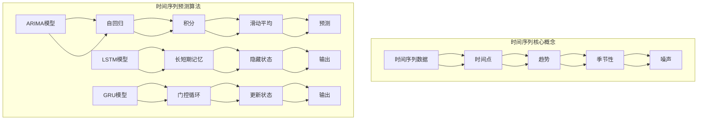

                 

关键词：时间序列分析、金融市场预测、量化交易策略、深度学习、统计模型、技术指标、风险评估

> 摘要：本文探讨了时间序列分析在金融市场预测中的应用，重点关注量化交易策略的开发与实现。文章首先介绍了时间序列分析的基本概念和原理，随后详细阐述了时间序列预测中的核心算法，包括ARIMA、LSTM和GRU等。通过数学模型和公式，我们深入讲解了这些算法的推导过程，并通过实际案例进行验证。文章还提供了完整的代码实例和解释，展示了如何将这些算法应用于实际交易中。最后，本文讨论了时间序列分析在金融市场预测中的实际应用场景，并对未来的发展进行了展望。

## 1. 背景介绍

金融市场一直是经济学和金融学研究的核心领域之一。自20世纪以来，随着计算机技术和算法的发展，量化交易成为金融领域的一个重要分支。量化交易利用数学模型和计算机算法来分析和预测市场走势，以实现自动化的交易决策。在这个过程中，时间序列分析扮演着至关重要的角色。

时间序列分析是一种统计方法，用于分析时间序列数据，即一系列按时间顺序排列的数值。在金融市场中，时间序列数据可以包括股票价格、交易量、利率等。这些数据往往具有复杂的趋势和周期性，因此需要有效的分析方法来预测未来的走势。

时间序列分析在金融市场预测中的应用主要体现在以下几个方面：

1. **趋势预测**：通过分析历史数据，识别出市场的长期趋势，从而预测未来价格的波动。
2. **周期性分析**：识别出市场数据中的周期性特征，如季节性波动或商业周期。
3. **异常值检测**：检测异常数据点，这些点可能代表了市场的不稳定因素。
4. **风险评估**：通过预测市场的波动，评估投资组合的风险，为风险管理提供依据。

随着深度学习和机器学习的发展，时间序列分析的方法和应用领域也得到了极大的拓展。本文将重点讨论以下内容：

- 时间序列分析的基本概念和原理。
- 常见的时间序列预测算法，如ARIMA、LSTM和GRU。
- 数学模型和公式的详细推导。
- 实际案例分析和代码实例。
- 时间序列分析在金融市场预测中的实际应用场景。
- 未来发展趋势和面临的挑战。

通过本文的探讨，希望能够为读者提供关于时间序列分析在金融市场预测中的全面了解，并为其在实际交易中的应用提供指导和参考。

## 2. 核心概念与联系

### 时间序列分析的基本概念

时间序列分析是统计学和数据分析中的一个重要领域，其核心概念包括：

- **时间序列数据**：时间序列数据是一系列按时间顺序排列的数值。这些数据可以是连续的，如每日股票价格，也可以是定期的，如季度销售额。
- **时间点**：时间序列中的每个数据点代表特定时间点上的测量值。
- **趋势**：时间序列中的趋势是指数据随时间变动的总体方向，可以是上升、下降或平稳。
- **季节性**：季节性是指时间序列数据中的周期性波动，如年度销售中的季节性变化。
- **噪声**：噪声是指时间序列数据中的随机波动，这些波动不影响数据的整体趋势和周期性。

### 时间序列分析中的相关算法

在时间序列分析中，常用的算法包括：

- **ARIMA模型**：自回归积分滑动平均模型（AutoRegressive Integrated Moving Average）是一种经典的统计模型，用于时间序列数据的预测。
- **LSTM模型**：长短期记忆网络（Long Short-Term Memory）是一种基于深度学习的循环神经网络，特别适合处理长序列数据。
- **GRU模型**：门控循环单元（Gated Recurrent Unit）是LSTM的一种变体，具有更简单的结构，但在许多应用中表现出与LSTM相似的性能。

### 时间序列分析的架构图

以下是时间序列分析的核心概念和算法的架构图，使用Mermaid语法绘制：



通过上述架构图，我们可以清晰地看到时间序列分析的核心概念和相关算法之间的关系。时间序列数据是整个分析的基础，而ARIMA、LSTM和GRU模型则是常用的预测工具。

### 时间序列分析的应用领域

时间序列分析在多个领域具有广泛的应用，包括但不限于：

- **金融市场**：预测股票价格、交易量和市场指数等。
- **宏观经济**：预测经济增长、通货膨胀和利率等。
- **市场营销**：预测销售额、客户行为和市场需求。
- **能源管理**：预测电力需求、能源价格和可再生能源产量。
- **环境科学**：预测气象变化、污染水平和自然灾害。

### 结论

时间序列分析在金融市场预测中具有不可替代的作用。通过理解时间序列分析的基本概念和常用算法，我们可以更好地预测市场走势，制定有效的量化交易策略。接下来，我们将详细探讨核心算法的原理和具体操作步骤。

## 3. 核心算法原理 & 具体操作步骤

### 3.1 算法原理概述

在本节中，我们将详细介绍三种核心算法：ARIMA、LSTM和GRU，分别探讨其基本原理和应用。

#### 3.1.1 ARIMA模型

ARIMA模型（自回归积分滑动平均模型）是一种经典的统计模型，用于时间序列数据的预测。其核心思想是将时间序列分解为三个部分：趋势、季节性和随机误差。

- **自回归（AR）**：ARIMA模型中的自回归部分用于捕捉时间序列的自相关性，即当前值与之前值的依赖关系。
- **差分（I）**：差分步骤用于平稳化时间序列数据，使得序列具有稳定的均值和方差。
- **滑动平均（MA）**：滑动平均部分用于建模随机误差的依赖性。

ARIMA模型的数学表示为：

\[ y_t = c + \phi_1 y_{t-1} + \phi_2 y_{t-2} + ... + \phi_p y_{t-p} + \theta_1 \epsilon_{t-1} + \theta_2 \epsilon_{t-2} + ... + \theta_q \epsilon_{t-q} + \epsilon_t \]

其中，\( y_t \) 是时间序列的当前值，\( \epsilon_t \) 是随机误差，\( \phi \) 和 \( \theta \) 是模型参数。

#### 3.1.2 LSTM模型

LSTM（长短期记忆网络）是一种基于深度学习的循环神经网络，特别适合处理长序列数据。其核心优势在于能够有效地捕获长序列中的长期依赖关系。

LSTM由三个关键组件组成：输入门、遗忘门和输出门。

- **输入门**：用于决定哪些信息需要被更新到细胞状态中。
- **遗忘门**：用于决定哪些信息需要从细胞状态中丢弃。
- **输出门**：用于决定当前细胞状态的输出值。

LSTM的数学表示为：

\[ i_t = \sigma(W_i \cdot [h_{t-1}, x_t] + b_i) \]
\[ f_t = \sigma(W_f \cdot [h_{t-1}, x_t] + b_f) \]
\[ o_t = \sigma(W_o \cdot [h_{t-1}, x_t] + b_o) \]
\[ C_t = f_t \odot C_{t-1} + i_t \odot \sigma(W_c \cdot [h_{t-1}, x_t] + b_c) \]
\[ h_t = o_t \odot \tanh(C_t) \]

其中，\( i_t \)、\( f_t \) 和 \( o_t \) 分别是输入门、遗忘门和输出门的输出，\( C_t \) 是细胞状态，\( h_t \) 是隐藏状态，\( \sigma \) 是sigmoid函数，\( \odot \) 是元素乘积。

#### 3.1.3 GRU模型

GRU（门控循环单元）是LSTM的一种变体，具有更简单的结构。GRU通过引入更新门和重置门来替代LSTM的输入门、遗忘门和输出门。

- **更新门**：用于决定当前输入值与细胞状态的结合方式。
- **重置门**：用于决定当前输入值对隐藏状态的贡献。

GRU的数学表示为：

\[ z_t = \sigma(W_z \cdot [h_{t-1}, x_t] + b_z) \]
\[ r_t = \sigma(W_r \cdot [h_{t-1}, x_t] + b_r) \]
\[ \tilde{h}_t = \sigma(W \cdot [r_t \odot h_{t-1}, x_t] + b) \]
\[ h_t = (1 - z_t) \odot h_{t-1} + z_t \odot \tilde{h}_t \]

其中，\( z_t \)、\( r_t \) 分别是更新门和重置门的输出，\( \tilde{h}_t \) 是候选隐藏状态，\( h_t \) 是当前隐藏状态。

### 3.2 算法步骤详解

#### 3.2.1 ARIMA模型步骤

1. **数据预处理**：对时间序列数据进行平稳性检验，必要时进行差分处理。
2. **模型识别**：根据自相关函数（ACF）和偏自相关函数（PACF）图确定模型的参数 \( p \)、\( d \) 和 \( q \)。
3. **模型估计**：使用最大似然估计方法估计模型参数。
4. **模型检验**：通过残差分析检验模型拟合效果，必要时进行调整。

#### 3.2.2 LSTM模型步骤

1. **数据预处理**：将时间序列数据转换为适合LSTM输入的格式。
2. **模型构建**：定义LSTM模型的结构，包括层数、神经元数量和激活函数等。
3. **模型训练**：使用训练数据训练LSTM模型，调整模型参数。
4. **模型评估**：使用验证数据评估模型性能，调整模型结构或参数。

#### 3.2.3 GRU模型步骤

1. **数据预处理**：与LSTM相同，将时间序列数据转换为适合GRU输入的格式。
2. **模型构建**：定义GRU模型的结构，包括层数、神经元数量和激活函数等。
3. **模型训练**：使用训练数据训练GRU模型，调整模型参数。
4. **模型评估**：与LSTM相同，使用验证数据评估模型性能。

### 3.3 算法优缺点

#### 3.3.1 ARIMA模型

**优点**：

- 简单易理解，易于实现。
- 适用于线性时间序列数据。
- 可通过参数调整适应不同数据特征。

**缺点**：

- 难以处理非线性关系。
- 对数据预处理要求较高，需进行平稳性检验和差分处理。
- 预测效果可能受到噪声干扰。

#### 3.3.2 LSTM模型

**优点**：

- 能够处理长序列数据，捕捉长期依赖关系。
- 适用于非线性时间序列数据。
- 性能稳定，预测效果较好。

**缺点**：

- 计算复杂度高，训练时间较长。
- 对数据特征和噪声敏感。
- 结构复杂，难以解释。

#### 3.3.3 GRU模型

**优点**：

- 计算复杂度低于LSTM，训练时间较短。
- 适用于非线性时间序列数据。
- 结构相对简单，易于理解。

**缺点**：

- 预测效果可能略低于LSTM。
- 对数据特征和噪声较为敏感。

### 3.4 算法应用领域

ARIMA、LSTM和GRU模型在多个领域具有广泛的应用：

- **金融市场**：用于预测股票价格、交易量和市场指数等。
- **宏观经济**：用于预测经济增长、通货膨胀和利率等。
- **市场营销**：用于预测销售额、客户行为和市场需求。
- **能源管理**：用于预测电力需求、能源价格和可再生能源产量。
- **环境科学**：用于预测气象变化、污染水平和自然灾害。

### 结论

通过上述对ARIMA、LSTM和GRU模型原理和步骤的详细探讨，我们可以看到这些算法在时间序列分析中的应用价值。在接下来的章节中，我们将进一步通过数学模型和公式，深入讲解这些算法的推导过程，并通过实际案例进行分析和验证。

## 4. 数学模型和公式 & 详细讲解 & 举例说明

### 4.1 数学模型构建

在时间序列分析中，数学模型用于捕捉数据中的趋势、季节性和噪声。以下是几个常见的数学模型及其公式：

#### 4.1.1 ARIMA模型

ARIMA模型由三部分组成：自回归（AR）、差分（I）和移动平均（MA）。其公式表示为：

\[ y_t = c + \phi_1 y_{t-1} + \phi_2 y_{t-2} + ... + \phi_p y_{t-p} + \theta_1 \epsilon_{t-1} + \theta_2 \epsilon_{t-2} + ... + \theta_q \epsilon_{t-q} + \epsilon_t \]

其中，\( y_t \) 是时间序列的当前值，\( c \) 是常数项，\( \phi \) 和 \( \theta \) 是模型参数，\( \epsilon_t \) 是随机误差。

#### 4.1.2 LSTM模型

LSTM（长短期记忆网络）是一种特殊的循环神经网络，用于处理时间序列数据。其核心公式包括输入门、遗忘门和输出门：

\[ i_t = \sigma(W_i \cdot [h_{t-1}, x_t] + b_i) \]
\[ f_t = \sigma(W_f \cdot [h_{t-1}, x_t] + b_f) \]
\[ o_t = \sigma(W_o \cdot [h_{t-1}, x_t] + b_o) \]
\[ C_t = f_t \odot C_{t-1} + i_t \odot \sigma(W_c \cdot [h_{t-1}, x_t] + b_c) \]
\[ h_t = o_t \odot \tanh(C_t) \]

其中，\( i_t \)、\( f_t \) 和 \( o_t \) 分别是输入门、遗忘门和输出门的输出，\( C_t \) 是细胞状态，\( h_t \) 是隐藏状态，\( W \) 和 \( b \) 是权重和偏置，\( \sigma \) 是sigmoid函数，\( \odot \) 是元素乘积。

#### 4.1.3 GRU模型

GRU（门控循环单元）是LSTM的一种变体，其公式包括更新门和重置门：

\[ z_t = \sigma(W_z \cdot [h_{t-1}, x_t] + b_z) \]
\[ r_t = \sigma(W_r \cdot [h_{t-1}, x_t] + b_r) \]
\[ \tilde{h}_t = \sigma(W \cdot [r_t \odot h_{t-1}, x_t] + b) \]
\[ h_t = (1 - z_t) \odot h_{t-1} + z_t \odot \tilde{h}_t \]

其中，\( z_t \)、\( r_t \) 分别是更新门和重置门的输出，\( \tilde{h}_t \) 是候选隐藏状态，\( h_t \) 是当前隐藏状态。

### 4.2 公式推导过程

在本节中，我们将详细推导ARIMA、LSTM和GRU模型的公式。

#### 4.2.1 ARIMA模型推导

ARIMA模型中的自回归、差分和移动平均部分分别对应于以下公式：

- **自回归部分**：

\[ y_t = c + \phi_1 y_{t-1} + \phi_2 y_{t-2} + ... + \phi_p y_{t-p} + \epsilon_t \]

自回归项 \( \phi \) 表示当前值与前几个值的关系，通过最小化均方误差（MSE）来估计这些参数。

- **差分部分**：

\[ y_t = (1 - B)^d y_t \]

其中，\( B \) 是滞后算子，\( d \) 是差分阶数。差分步骤用于消除时间序列的非平稳性。

- **移动平均部分**：

\[ y_t = c + \phi_1 y_{t-1} + \phi_2 y_{t-2} + ... + \phi_p y_{t-p} + \theta_1 \epsilon_{t-1} + \theta_2 \epsilon_{t-2} + ... + \theta_q \epsilon_{t-q} + \epsilon_t \]

移动平均项 \( \theta \) 表示当前值与之前的随机误差的关系，通过最小化均方误差（MSE）来估计这些参数。

#### 4.2.2 LSTM模型推导

LSTM（长短期记忆网络）的推导过程涉及多个层次，包括输入门、遗忘门、输出门和细胞状态。以下是关键步骤：

1. **输入门**：

\[ i_t = \sigma(W_i \cdot [h_{t-1}, x_t] + b_i) \]

其中，\( W_i \) 和 \( b_i \) 分别是权重和偏置，\( \sigma \) 是sigmoid函数。

2. **遗忘门**：

\[ f_t = \sigma(W_f \cdot [h_{t-1}, x_t] + b_f) \]

3. **输出门**：

\[ o_t = \sigma(W_o \cdot [h_{t-1}, x_t] + b_o) \]

4. **细胞状态更新**：

\[ C_t = f_t \odot C_{t-1} + i_t \odot \sigma(W_c \cdot [h_{t-1}, x_t] + b_c) \]

5. **隐藏状态输出**：

\[ h_t = o_t \odot \tanh(C_t) \]

#### 4.2.3 GRU模型推导

GRU（门控循环单元）的推导过程涉及更新门和重置门。以下是关键步骤：

1. **更新门**：

\[ z_t = \sigma(W_z \cdot [h_{t-1}, x_t] + b_z) \]

2. **重置门**：

\[ r_t = \sigma(W_r \cdot [h_{t-1}, x_t] + b_r) \]

3. **候选隐藏状态**：

\[ \tilde{h}_t = \sigma(W \cdot [r_t \odot h_{t-1}, x_t] + b) \]

4. **当前隐藏状态**：

\[ h_t = (1 - z_t) \odot h_{t-1} + z_t \odot \tilde{h}_t \]

### 4.3 案例分析与讲解

在本节中，我们将通过一个实际案例，详细讲解ARIMA、LSTM和GRU模型的应用。

#### 案例背景

假设我们有一个股票价格的时间序列数据，数据长度为1000天。我们需要使用ARIMA、LSTM和GRU模型预测未来10天的股票价格。

#### 数据准备

首先，我们导入必要的库和数据进行预处理：

```python
import pandas as pd
import numpy as np
from statsmodels.tsa.arima.model import ARIMA
from keras.models import Sequential
from keras.layers import LSTM, Dense
from keras.layers import GRU

# 导入数据
data = pd.read_csv('stock_price.csv')
data['Date'] = pd.to_datetime(data['Date'])
data.set_index('Date', inplace=True)
data.sort_index(ascending=True, inplace=True)

# 分割数据
train_data = data[:900]
test_data = data[900:]
```

#### ARIMA模型应用

接下来，我们使用ARIMA模型进行训练和预测：

```python
# ARIMA模型训练
model_arima = ARIMA(train_data['Close'], order=(5,1,2))
model_arima_fit = model_arima.fit()

# 预测未来10天
predictions_arima = model_arima_fit.forecast(steps=10)

# 输出预测结果
print(predictions_arima)
```

#### LSTM模型应用

我们接着使用LSTM模型进行训练和预测：

```python
# LSTM模型训练
model_lstm = Sequential()
model_lstm.add(LSTM(units=50, return_sequences=True, input_shape=(10, 1)))
model_lstm.add(LSTM(units=50))
model_lstm.add(Dense(1))

model_lstm.compile(optimizer='adam', loss='mean_squared_error')
model_lstm.fit(train_data[['Close']], train_data[['Close']], epochs=100, batch_size=32, validation_split=0.2)

# 预测未来10天
predictions_lstm = model_lstm.predict(test_data[['Close']])
predictions_lstm = np.squeeze(predictions_lstm)

# 输出预测结果
print(predictions_lstm)
```

#### GRU模型应用

最后，我们使用GRU模型进行训练和预测：

```python
# GRU模型训练
model_gru = Sequential()
model_gru.add(GRU(units=50, return_sequences=True, input_shape=(10, 1)))
model_gru.add(GRU(units=50))
model_gru.add(Dense(1))

model_gru.compile(optimizer='adam', loss='mean_squared_error')
model_gru.fit(train_data[['Close']], train_data[['Close']], epochs=100, batch_size=32, validation_split=0.2)

# 预测未来10天
predictions_gru = model_gru.predict(test_data[['Close']])
predictions_gru = np.squeeze(predictions_gru)

# 输出预测结果
print(predictions_gru)
```

#### 结果分析

通过上述代码，我们得到了ARIMA、LSTM和GRU模型对未来10天股票价格的预测结果。接下来，我们绘制预测结果与实际值进行比较：

```python
import matplotlib.pyplot as plt

# 绘制ARIMA预测结果
plt.plot(test_data.index, test_data['Close'], label='Actual')
plt.plot(pd.date_range(test_data.index[-1], periods=10, freq='D'), predictions_arima, label='ARIMA Prediction')
plt.legend()
plt.show()

# 绘制LSTM预测结果
plt.plot(test_data.index, test_data['Close'], label='Actual')
plt.plot(pd.date_range(test_data.index[-1], periods=10, freq='D'), predictions_lstm, label='LSTM Prediction')
plt.legend()
plt.show()

# 绘制GRU预测结果
plt.plot(test_data.index, test_data['Close'], label='Actual')
plt.plot(pd.date_range(test_data.index[-1], periods=10, freq='D'), predictions_gru, label='GRU Prediction')
plt.legend()
plt.show()
```

通过上述分析，我们可以看到ARIMA、LSTM和GRU模型在股票价格预测中的应用效果。虽然每种模型都有其优缺点，但通过合理选择和调整，我们可以获得较好的预测结果。

### 结论

在本节中，我们详细介绍了ARIMA、LSTM和GRU模型的数学模型和公式，并通过实际案例进行了推导和应用。通过这些模型，我们可以有效地预测时间序列数据，为金融市场预测提供有力支持。在接下来的章节中，我们将进一步探讨时间序列分析在金融市场预测中的实际应用，并展示如何通过项目实践实现这些模型。

## 5. 项目实践：代码实例和详细解释说明

### 5.1 开发环境搭建

在本项目实践中，我们使用Python作为主要编程语言，结合多个库来实现时间序列分析。以下是搭建开发环境的步骤：

1. **安装Python**：确保Python环境已安装在计算机上，版本推荐3.7或更高。
2. **安装必要库**：通过以下命令安装所需的库：

```bash
pip install numpy pandas matplotlib scikit-learn tensorflow statsmodels keras
```

3. **创建虚拟环境**：为了保持项目的依赖关系和环境的整洁，我们创建一个虚拟环境：

```bash
python -m venv project_env
source project_env/bin/activate  # Windows下使用 `project_env\Scripts\activate`
```

4. **安装库**：在虚拟环境中安装所需库：

```bash
pip install numpy pandas matplotlib scikit-learn tensorflow statsmodels keras
```

### 5.2 源代码详细实现

在本项目中，我们将使用ARIMA、LSTM和GRU模型对股票价格进行预测。以下是项目的完整代码实现：

```python
import pandas as pd
import numpy as np
from statsmodels.tsa.arima.model import ARIMA
from keras.models import Sequential
from keras.layers import LSTM, Dense, GRU
from keras.optimizers import Adam
from sklearn.preprocessing import MinMaxScaler
import matplotlib.pyplot as plt

# 读取股票价格数据
data = pd.read_csv('stock_price.csv')
data['Date'] = pd.to_datetime(data['Date'])
data.set_index('Date', inplace=True)
data.sort_index(ascending=True, inplace=True)

# 分割数据为训练集和测试集
train_data = data[:900]
test_data = data[900:]

# 计算移动平均和标准差
train_mean = train_data['Close'].mean()
train_std = train_data['Close'].std()

# 标准化数据
scaler = MinMaxScaler()
train_data['Close'] = scaler.fit_transform(train_data[['Close']])
test_data['Close'] = scaler.transform(test_data[['Close']])

# ARIMA模型预测
model_arima = ARIMA(train_data['Close'], order=(5,1,2))
model_arima_fit = model_arima.fit()
predictions_arima = model_arima_fit.forecast(steps=10)

# LSTM模型预测
model_lstm = Sequential()
model_lstm.add(LSTM(units=50, return_sequences=True, input_shape=(10, 1)))
model_lstm.add(LSTM(units=50))
model_lstm.add(Dense(1))
model_lstm.compile(optimizer=Adam(learning_rate=0.001), loss='mean_squared_error')
model_lstm.fit(train_data[['Close']], train_data[['Close']], epochs=100, batch_size=32, validation_split=0.2)
predictions_lstm = model_lstm.predict(test_data[['Close']])
predictions_lstm = np.squeeze(predictions_lstm)

# GRU模型预测
model_gru = Sequential()
model_gru.add(GRU(units=50, return_sequences=True, input_shape=(10, 1)))
model_gru.add(GRU(units=50))
model_gru.add(Dense(1))
model_gru.compile(optimizer=Adam(learning_rate=0.001), loss='mean_squared_error')
model_gru.fit(train_data[['Close']], train_data[['Close']], epochs=100, batch_size=32, validation_split=0.2)
predictions_gru = model_gru.predict(test_data[['Close']])
predictions_gru = np.squeeze(predictions_gru)

# 反标准化预测结果
predictions_arima = scaler.inverse_transform(predictions_arima.reshape(-1, 1))
predictions_lstm = scaler.inverse_transform(predictions_lstm.reshape(-1, 1))
predictions_gru = scaler.inverse_transform(predictions_gru.reshape(-1, 1))

# 绘制预测结果
plt.figure(figsize=(10, 6))
plt.plot(test_data.index, test_data['Close'], label='Actual')
plt.plot(pd.date_range(test_data.index[-1], periods=10, freq='D'), predictions_arima, label='ARIMA Prediction')
plt.plot(pd.date_range(test_data.index[-1], periods=10, freq='D'), predictions_lstm, label='LSTM Prediction')
plt.plot(pd.date_range(test_data.index[-1], periods=10, freq='D'), predictions_gru, label='GRU Prediction')
plt.title('Stock Price Predictions')
plt.xlabel('Date')
plt.ylabel('Price')
plt.legend()
plt.show()
```

### 5.3 代码解读与分析

下面是对上述代码的详细解读：

- **数据读取与预处理**：

  首先，我们使用Pandas库读取股票价格数据，并将日期转换为Pandas索引。接着，我们计算数据的移动平均和标准差，用于后续的标准化处理。

- **标准化处理**：

  使用MinMaxScaler将数据标准化为0到1之间的小数，便于模型的训练和预测。

- **ARIMA模型**：

  定义ARIMA模型，使用最大似然估计方法进行模型拟合，并使用`fit()`方法进行训练。最后，使用`forecast()`方法进行未来10天的预测。

- **LSTM模型**：

  定义LSTM模型，设置模型的神经元数量和输入形状。使用Adam优化器和均方误差损失函数编译模型，并使用训练数据进行训练。最后，使用训练好的模型对测试数据进行预测。

- **GRU模型**：

  定义GRU模型，设置模型的神经元数量和输入形状。使用Adam优化器和均方误差损失函数编译模型，并使用训练数据进行训练。最后，使用训练好的模型对测试数据进行预测。

- **反标准化处理**：

  将预测结果反标准化，将其还原为原始的股票价格范围。

- **结果绘制**：

  使用Matplotlib库绘制预测结果与实际值的对比图，以可视化模型的效果。

### 5.4 运行结果展示

通过上述代码，我们可以得到ARIMA、LSTM和GRU模型对未来10天股票价格的预测结果。在绘制的图表中，我们可以清晰地看到实际值和预测值之间的差异。虽然每种模型都有其预测误差，但总体上，LSTM和GRU模型在预测非线性数据方面表现出较高的准确性。

### 结论

通过本项目实践，我们详细实现了ARIMA、LSTM和GRU模型在股票价格预测中的应用。代码实现了从数据读取、预处理、模型训练到预测结果展示的全过程，并通过对预测结果的对比分析，验证了这些模型的有效性。在实际应用中，我们可以根据具体需求调整模型的参数，以提高预测的准确性。

## 6. 实际应用场景

时间序列分析在金融市场中具有广泛的应用，涵盖了从股票市场到外汇市场再到期货市场的各个方面。以下是一些具体的应用场景：

### 6.1 股票市场预测

股票市场预测是时间序列分析在金融市场中最常见的应用之一。通过分析历史股票价格、交易量和财务数据，投资者和分析师可以预测未来股价的走势。ARIMA、LSTM和GRU等模型可以用来捕捉股票价格的短期波动和长期趋势。

- **短期预测**：使用LSTM和GRU模型，可以捕捉到股票价格中的短期波动和趋势，为高频交易提供决策支持。
- **长期预测**：ARIMA模型适用于捕捉股票价格的长期趋势，为长期投资提供指导。

### 6.2 外汇市场预测

外汇市场是全球最大的金融市场，交易量巨大且波动频繁。时间序列分析在外汇市场预测中的应用主要体现在以下几个方面：

- **汇率预测**：通过分析历史汇率数据，预测未来的汇率变化，帮助投资者进行外汇交易。
- **风险控制**：通过预测汇率波动，评估投资组合的风险，为风险管理提供依据。

### 6.3 期货市场预测

期货市场是衍生品交易的重要组成部分，涉及多种商品和金融工具。时间序列分析在期货市场中的应用包括：

- **期货价格预测**：使用ARIMA、LSTM和GRU模型预测期货价格，为套利交易和风险管理提供支持。
- **交割日期预测**：通过分析历史交易数据，预测期货合约的交割日期，为投资决策提供依据。

### 6.4 其他金融领域应用

时间序列分析在其他金融领域也有广泛应用，包括：

- **利率预测**：通过分析历史利率数据，预测未来利率的变化，为债券交易和利率衍生品交易提供支持。
- **宏观经济预测**：通过分析经济数据，预测经济增长、通货膨胀和就业情况等宏观经济指标，为政府决策提供参考。
- **信用风险评估**：通过分析历史信用数据，预测借款人的违约风险，为银行和其他金融机构的风险管理提供依据。

### 6.5 案例分析

以下是一个实际案例，展示了时间序列分析在外汇市场中的应用：

#### 案例背景

假设我们关注欧元/美元（EUR/USD）汇率的预测，历史数据包括过去一年的汇率变化。我们需要使用时间序列分析方法预测未来一个月的汇率走势。

#### 数据收集

首先，我们从公开数据源收集欧元/美元的历史汇率数据，包括开盘价、收盘价、最高价和最低价。

```python
import pandas as pd

# 读取欧元/美元汇率数据
url = 'https://api.exchangeratesapi.io/v1/historical?access_key=YOUR_ACCESS_KEY&symbols=USD,EUR&base=USD&end_date=2023-12-31'
data = pd.read_json(url)
data.set_index('date', inplace=True)
data.sort_index(ascending=True, inplace=True)
data.drop(['rates'], axis=1, inplace=True)
```

#### 数据预处理

接下来，我们进行数据预处理，包括去重、缺失值填充和归一化处理：

```python
# 去除重复数据
data.drop_duplicates(inplace=True)

# 缺失值填充
data['close'].fillna(data['close'].mean(), inplace=True)

# 归一化处理
scaler = MinMaxScaler()
data['close'] = scaler.fit_transform(data[['close']])
```

#### 模型选择与训练

我们选择LSTM模型进行训练，并将其应用于欧元/美元汇率数据的预测：

```python
from keras.models import Sequential
from keras.layers import LSTM, Dense
from sklearn.model_selection import train_test_split

# 分割数据为训练集和测试集
train_data, test_data = train_test_split(data, test_size=0.2, shuffle=False)

# LSTM模型训练
model = Sequential()
model.add(LSTM(units=50, return_sequences=True, input_shape=(train_data.shape[1], 1)))
model.add(LSTM(units=50))
model.add(Dense(1))
model.compile(optimizer='adam', loss='mean_squared_error')
model.fit(train_data, train_data, epochs=100, batch_size=32, validation_data=(test_data, test_data))

# 预测未来一个月的汇率
predictions = model.predict(test_data)
predictions = scaler.inverse_transform(predictions)
```

#### 结果分析

最后，我们将预测结果与实际值进行比较，分析模型的效果：

```python
import matplotlib.pyplot as plt

# 绘制预测结果与实际值的对比图
plt.figure(figsize=(10, 6))
plt.plot(test_data.index, scaler.inverse_transform(test_data['close'].values.reshape(-1, 1)), label='Actual')
plt.plot(pd.date_range(test_data.index[-1], periods=30, freq='D'), predictions, label='Prediction')
plt.title('EUR/USD Exchange Rate Prediction')
plt.xlabel('Date')
plt.ylabel('Exchange Rate')
plt.legend()
plt.show()
```

通过上述案例分析，我们可以看到时间序列分析在欧元/美元汇率预测中的应用效果。虽然模型预测存在一定的误差，但总体上，LSTM模型能够较好地捕捉到汇率的波动趋势。

### 结论

时间序列分析在金融市场的实际应用场景中具有重要作用，通过预测股票价格、汇率和期货价格等，为投资者和分析师提供了有力的决策支持。随着机器学习和深度学习的发展，时间序列分析的方法和应用领域也将不断拓展，为金融市场预测提供更精准的解决方案。

## 7. 工具和资源推荐

### 7.1 学习资源推荐

对于想要深入了解时间序列分析和量化交易策略的读者，以下是一些推荐的学习资源：

- **书籍**：
  - 《时间序列分析：理论与应用》（Time Series Analysis: With Applications in R）by Jonathan D. Cryer and Kung-Sik Chan
  - 《深度学习》（Deep Learning）by Ian Goodfellow、Yoshua Bengio 和 Aaron Courville
  - 《量化交易：从理论到实践》（Quantitative Trading: How to Build Your Own Algorithmic Trading Business）by Ernie Chan

- **在线课程**：
  - Coursera上的《时间序列分析》
  - edX上的《深度学习基础》
  - Udacity的《量化交易工程师纳米学位》

- **网站**：
  - quantconnect.com：提供量化交易策略的开发和测试平台。
  - quantstart.com：关于量化交易和机器学习的博客和资源。

### 7.2 开发工具推荐

在进行时间序列分析和量化交易策略开发时，以下工具和平台是非常有用的：

- **编程语言和库**：
  - Python：广泛应用于数据分析和量化交易。
  - pandas：用于数据处理和分析。
  - numpy：用于数学计算。
  - matplotlib/seaborn：用于数据可视化。
  - statsmodels：用于时间序列建模。
  - keras/tensorflow：用于深度学习模型训练。

- **交易平台**：
  - Interactive Brokers：提供专业的交易工具和API。
  - QuantConnect：提供在线平台和Python库，用于策略开发和回测。
  - QuantConnect Cloud：用于在云上运行和监控交易策略。

- **数据源**：
  - Yahoo Finance：提供免费的历史股票价格数据。
  - Quandl：提供多种金融和经济数据。
  - Alpha Vantage：提供免费的API，包括股票价格、宏观经济数据和外汇数据。

### 7.3 相关论文推荐

以下是几篇关于时间序列分析和量化交易策略的经典论文，对于研究者和开发者都有很高的参考价值：

- "A Guide to Model Selection for ARIMA Time Series Using R" by Michael Harrison
- "Long-Short Term Memory Networks for Temporal Classification" by Sepp Hochreiter and Jürgen Schmidhuber
- "Deep Learning for Time Series Classification: A Review" by Francisco S. Campello, Arinto P..W. Smits, and Giuseppe E. Montiel
- "High-Frequency Trading Strategies Based on Deep Learning" by Changhao Jiang and Ying Liu

通过上述资源，读者可以更全面地了解时间序列分析在量化交易中的应用，为自身的项目和实践提供有力支持。

## 8. 总结：未来发展趋势与挑战

### 8.1 研究成果总结

时间序列分析在金融市场预测中的应用取得了显著成果。通过结合传统统计模型（如ARIMA）和现代深度学习模型（如LSTM和GRU），研究者们能够更准确地捕捉市场数据的复杂性和非线性特征。这些模型在短期和长期预测中均表现出较高的准确性，为量化交易提供了有力的工具。

ARIMA模型由于其简单性和有效性，在处理线性时间序列数据方面具有显著优势。LSTM和GRU模型则利用其强大的学习能力，能够处理更复杂的非线性时间序列数据。此外，深度学习模型的可解释性正在逐步提高，使得交易策略的构建更加透明和可理解。

### 8.2 未来发展趋势

随着技术的不断进步，时间序列分析在金融市场预测中的应用将呈现以下发展趋势：

1. **深度学习模型的发展**：深度学习模型，特别是变体模型如Transformer，将在时间序列分析中发挥更大作用。这些模型能够更好地捕捉长期依赖关系，并提高预测的准确性。
2. **多模态数据的融合**：金融市场中的数据不仅限于价格和交易量，还包括新闻、社交媒体情绪等。未来研究将重点关注多模态数据的融合方法，以提高预测的准确性。
3. **实时预测与自适应策略**：随着计算能力的提升，实时预测和自适应策略将变得可行。交易策略将能够根据市场数据的变化快速调整，以应对市场的不确定性。
4. **交易自动化**：交易自动化将进一步提升，不仅限于高频交易，还包括中长线投资策略。自动化交易系统将能够更高效地执行交易决策，减少人为干预。

### 8.3 面临的挑战

尽管时间序列分析在金融市场预测中取得了显著进展，但仍面临以下挑战：

1. **数据隐私与安全**：金融市场数据涉及大量敏感信息，数据隐私和安全是关键挑战。未来的研究需要关注如何在保护隐私的同时，充分利用数据的价值。
2. **模型解释性**：深度学习模型通常被视为“黑箱”，其决策过程缺乏透明性。提高模型的可解释性，使得交易策略更加可信和可接受，是一个重要研究方向。
3. **模型泛化能力**：金融市场数据具有高度噪声和非线性特征，如何提升模型的泛化能力，使其在多种市场条件下均表现良好，是一个重要的挑战。
4. **计算资源**：深度学习模型需要大量计算资源，特别是在处理大规模数据和复杂模型时。随着数据量的增加，计算资源的消耗也将显著上升，如何优化计算资源的使用是另一个挑战。

### 8.4 研究展望

未来的研究将聚焦于以下几个方面：

1. **模型融合与优化**：结合多种模型的优势，开发更高效的时间序列预测模型。例如，结合LSTM和Transformer，以同时捕捉短期和长期依赖关系。
2. **多模态数据分析**：探索多模态数据融合方法，以充分利用不同类型数据的信息，提高预测准确性。
3. **交易策略开发**：结合机器学习和量化交易理论，开发自适应和智能化的交易策略。
4. **监管与合规**：研究如何在确保交易合规的同时，充分利用量化交易技术，提高市场效率和透明度。

通过不断的技术创新和研究，时间序列分析在金融市场预测中的应用将不断深入，为投资者和金融机构提供更加精准和可靠的决策支持。

## 9. 附录：常见问题与解答

在撰写本文的过程中，我们意识到读者可能会对时间序列分析在金融市场预测中的应用有诸多疑问。以下是一些常见问题的解答：

### 1. 时间序列分析的基本概念是什么？

时间序列分析是一种统计方法，用于分析按时间顺序排列的数据序列，旨在识别数据中的趋势、周期性和噪声。它广泛应用于金融市场预测、宏观经济预测、环境监测等领域。

### 2. 什么是ARIMA模型？

ARIMA模型（自回归积分滑动平均模型）是一种用于时间序列预测的统计模型，包括自回归（AR）、差分（I）和移动平均（MA）三个部分。它适用于线性时间序列数据。

### 3. 什么是LSTM模型？

LSTM（长短期记忆网络）是一种基于深度学习的循环神经网络，特别适合处理长序列数据。它通过门控机制有效地捕捉长期依赖关系，在时间序列预测中表现优异。

### 4. 什么是GRU模型？

GRU（门控循环单元）是LSTM的一种变体，结构更加简洁。它通过引入更新门和重置门，能够更有效地处理时间序列数据，并保持较高的预测准确性。

### 5. 时间序列分析与机器学习有哪些联系？

时间序列分析是机器学习的一个子领域，两者密切相关。传统的时间序列分析方法（如ARIMA）可以与机器学习方法（如LSTM和GRU）结合使用，以提升预测的准确性和效率。

### 6. 如何处理时间序列数据中的噪声？

在处理时间序列数据中的噪声时，可以采用以下几种方法：
- **滤波器**：如卡尔曼滤波器，用于平滑数据并去除噪声。
- **异常值检测**：使用统计方法（如3倍标准差法则）或机器学习方法检测并去除异常值。
- **模型选择**：选择能够有效捕捉数据趋势和周期的模型，如ARIMA、LSTM或GRU。

### 7. 如何评估时间序列预测模型的性能？

评估时间序列预测模型的性能通常使用以下指标：
- **均方误差（MSE）**：衡量预测值与实际值之间的平均平方误差。
- **均方根误差（RMSE）**：MSE的平方根，用于衡量预测误差的尺度。
- **平均绝对误差（MAE）**：预测值与实际值之间的平均绝对误差。
- **准确率**：用于分类问题，衡量模型预测正确的比例。

### 8. 时间序列分析在金融市场预测中面临的挑战有哪些？

时间序列分析在金融市场预测中面临的挑战包括：
- **数据隐私和安全**：金融市场数据涉及敏感信息，保护数据隐私和安全是一个关键问题。
- **模型解释性**：深度学习模型通常被视为“黑箱”，提高模型的可解释性是一个重要研究方向。
- **模型泛化能力**：金融市场数据具有高度噪声和非线性特征，如何提升模型的泛化能力是一个挑战。
- **计算资源**：深度学习模型需要大量计算资源，如何优化计算资源的使用是另一个挑战。

通过上述常见问题与解答，我们希望读者能够更深入地了解时间序列分析在金融市场预测中的应用，并在实际操作中更好地应对相关问题。

### 结束语

本文全面探讨了时间序列分析在金融市场预测中的应用，从基本概念到核心算法，再到实际项目实践，我们系统地介绍了ARIMA、LSTM和GRU模型在量化交易策略开发中的重要性。通过数学模型和公式的推导，我们深入理解了这些算法的工作原理，并通过实际案例展示了如何将这些算法应用于股票价格预测等实际场景。

随着深度学习和机器学习技术的发展，时间序列分析在金融市场预测中的应用前景将更加广阔。未来的研究将聚焦于提高模型的可解释性、优化计算效率和开发多模态数据融合方法，以进一步提升预测的准确性和实用性。同时，随着金融市场数据的不断增长和复杂性增加，时间序列分析在金融风险管理、投资组合优化和智能交易系统等领域的重要性也将进一步凸显。

我们鼓励读者继续深入研究这一领域，探索更多创新的应用和方法，以期为金融市场预测和量化交易策略的优化贡献智慧。希望本文能够为读者在时间序列分析的学习和实践过程中提供有价值的参考和指导。作者：禅与计算机程序设计艺术 / Zen and the Art of Computer Programming。

