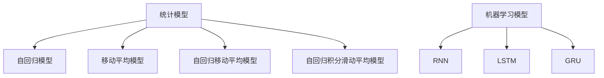

                 

关键词：时间序列分析，预测，异常检测，统计模型，机器学习，深度学习

> 摘要：本文详细探讨了时间序列分析在预测与异常检测中的应用，分析了常见的统计模型与机器学习方法，并结合实际案例进行了深入讲解。通过本文的阅读，读者将能够全面理解时间序列分析的原理、方法及应用前景。

## 1. 背景介绍

时间序列分析是数据分析中的一个重要领域，主要用于研究时间序列数据的特征和规律。时间序列数据具有时序依赖性，即当前时刻的数据受之前时刻数据的影响。这种特性使得时间序列分析在许多实际应用中具有重要的意义，如金融市场预测、天气预测、能源消耗预测、异常检测等。

在时间序列分析中，预测和异常检测是两个核心任务。预测任务旨在根据历史数据预测未来趋势，而异常检测任务则旨在识别数据中的异常点或异常模式。这两种任务在许多领域都有广泛的应用，如金融风险控制、网络安全监控、医疗数据分析等。

时间序列分析的发展经历了从传统的统计模型到现代的机器学习模型的演变。传统的统计模型如ARIMA、移动平均（MA）和自回归移动平均（ARMA）等方法具有较强的理论基础，但适用范围有限。随着机器学习技术的不断发展，深度学习模型如循环神经网络（RNN）、长短时记忆网络（LSTM）和门控循环单元（GRU）等在时间序列分析中表现出强大的预测和异常检测能力。

本文将首先介绍时间序列分析的基本概念和常用模型，然后深入探讨预测和异常检测的核心算法原理及具体操作步骤。接着，我们将通过数学模型和公式详细讲解时间序列分析的核心理论，并结合实际案例进行深入分析。最后，本文还将介绍时间序列分析在实际应用场景中的成功案例，并展望未来应用前景。

## 2. 核心概念与联系

### 2.1 时间序列的定义

时间序列（Time Series）是一系列按时间顺序排列的数据点。这些数据点可以是任何类型的数据，如股票价格、温度、销售额、网页访问量等。时间序列数据通常具有以下特征：

- **序列性（Sequence）**：时间序列数据按时间顺序排列，每个数据点都有明确的时间戳。
- **依赖性（Dependency）**：当前时刻的数据受到之前时刻数据的影响，即存在时间依赖性。
- **趋势性（Trend）**：时间序列数据可能呈现增长、下降或平稳的趋势。
- **季节性（Seasonality）**：时间序列数据可能受到季节性因素的影响，如节假日、天气变化等。

### 2.2 常见的时间序列模型

时间序列分析中，常见的模型包括统计模型和机器学习模型。

#### 统计模型

- **自回归模型（AR）**：自回归模型假设当前值是过去几个值的线性组合。自回归模型可以捕捉时间序列的短期依赖性。
- **移动平均模型（MA）**：移动平均模型通过计算过去一段时间内的平均值来预测当前值。移动平均模型可以平滑时间序列数据中的随机波动。
- **自回归移动平均模型（ARMA）**：自回归移动平均模型结合了自回归模型和移动平均模型，可以同时捕捉时间序列的长期和短期依赖性。
- **自回归积分滑动平均模型（ARIMA）**：自回归积分滑动平均模型是ARMA模型的扩展，可以处理非平稳时间序列数据。

#### 机器学习模型

- **循环神经网络（RNN）**：循环神经网络是一种能够捕捉时间序列长期依赖性的神经网络模型。RNN通过记忆单元来保持历史信息，但传统RNN存在梯度消失和梯度爆炸问题。
- **长短时记忆网络（LSTM）**：长短时记忆网络是RNN的一种改进，通过引入门控机制解决了梯度消失问题，能够有效地捕捉时间序列的长期依赖性。
- **门控循环单元（GRU）**：门控循环单元是LSTM的变体，相比LSTM结构更简单，参数更少，计算效率更高。

### 2.3 Mermaid 流程图

下面是一个用于描述时间序列分析中统计模型和机器学习模型之间的关系的Mermaid流程图：



通过上述流程图，我们可以清晰地看到统计模型和机器学习模型在时间序列分析中的应用和联系。

### 2.4 时间序列分析的基本步骤

时间序列分析通常包括以下基本步骤：

1. **数据预处理**：包括数据清洗、缺失值填充、异常值处理等，确保数据质量。
2. **特征提取**：从时间序列数据中提取有用的特征，如趋势、季节性、周期性等。
3. **模型选择**：根据数据特性选择合适的模型，如统计模型或机器学习模型。
4. **模型训练**：使用历史数据对模型进行训练，优化模型参数。
5. **模型评估**：使用验证集或测试集对模型进行评估，评估指标包括准确率、均方误差等。
6. **预测**：使用训练好的模型进行未来数据的预测。

通过上述基本步骤，我们可以有效地进行时间序列分析，实现预测和异常检测任务。

## 3. 核心算法原理 & 具体操作步骤

### 3.1 算法原理概述

在时间序列分析中，预测和异常检测是两个核心任务。下面将分别介绍这两种任务的算法原理。

#### 预测算法原理

预测任务旨在根据历史数据预测未来趋势。常见的预测算法包括统计模型和机器学习模型。

- **统计模型**：统计模型通过建立时间序列的数学模型，如自回归模型、移动平均模型、自回归移动平均模型等，来预测未来值。
- **机器学习模型**：机器学习模型通过学习历史数据中的模式，如循环神经网络、长短时记忆网络、门控循环单元等，来预测未来值。

#### 异常检测算法原理

异常检测任务旨在识别数据中的异常点或异常模式。常见的异常检测算法包括统计模型和机器学习模型。

- **统计模型**：统计模型通过计算时间序列的统计特征，如均值、方差、自相关函数等，来检测异常点。
- **机器学习模型**：机器学习模型通过学习正常数据中的模式，然后用模型预测未来数据，将预测误差较大的点视为异常点。

### 3.2 算法步骤详解

下面详细描述预测和异常检测算法的具体步骤。

#### 预测算法步骤

1. **数据预处理**：对时间序列数据进行预处理，如数据清洗、缺失值填充、异常值处理等。
2. **特征提取**：从预处理后的数据中提取特征，如趋势、季节性、周期性等。
3. **模型选择**：根据特征选择合适的预测模型，如统计模型或机器学习模型。
4. **模型训练**：使用历史数据进行模型训练，优化模型参数。
5. **模型评估**：使用验证集或测试集对模型进行评估，评估指标包括准确率、均方误差等。
6. **预测**：使用训练好的模型进行未来数据的预测。

#### 异常检测算法步骤

1. **数据预处理**：对时间序列数据进行预处理，如数据清洗、缺失值填充、异常值处理等。
2. **特征提取**：从预处理后的数据中提取特征，如均值、方差、自相关函数等。
3. **模型选择**：根据特征选择合适的异常检测模型，如统计模型或机器学习模型。
4. **模型训练**：使用正常数据进行模型训练，学习正常数据中的模式。
5. **异常检测**：使用训练好的模型检测新数据中的异常点，如预测误差较大的点。
6. **异常点分析**：对检测到的异常点进行进一步分析，确定其是否为真正的异常点。

### 3.3 算法优缺点

下面分别介绍统计模型和机器学习模型的优缺点。

#### 统计模型优缺点

- **优点**：
  - 理论基础扎实，解释性较强。
  - 对时间序列数据的依赖性较强，能够捕捉长期趋势和季节性。

- **缺点**：
  - 适用范围有限，难以处理复杂的非线性时间序列数据。
  - 需要大量先验知识，如自回归阶数、移动平均窗口大小等。

#### 机器学习模型优缺点

- **优点**：
  - 能够处理复杂的非线性时间序列数据。
  - 自动学习特征，无需人工干预。

- **缺点**：
  - 解释性较弱，难以理解模型内部的工作机制。
  - 可能存在过拟合问题，需要大量数据进行训练。

### 3.4 算法应用领域

时间序列分析在许多领域都有广泛的应用，如：

- **金融市场预测**：通过时间序列分析预测股票价格、货币汇率等。
- **天气预测**：通过时间序列分析预测天气变化，如温度、降水等。
- **能源消耗预测**：通过时间序列分析预测能源消耗量，如电力、天然气等。
- **异常检测**：通过时间序列分析检测网络攻击、欺诈行为等。

## 4. 数学模型和公式 & 详细讲解 & 举例说明

### 4.1 数学模型构建

在时间序列分析中，常用的数学模型包括自回归模型（AR）、移动平均模型（MA）、自回归移动平均模型（ARMA）和自回归积分滑动平均模型（ARIMA）。

#### 自回归模型（AR）

自回归模型假设当前值是过去几个值的线性组合。数学模型可以表示为：

$$
X_t = c + \phi_1 X_{t-1} + \phi_2 X_{t-2} + \ldots + \phi_p X_{t-p} + \varepsilon_t
$$

其中，$X_t$表示时间序列在时刻$t$的值，$\phi_1, \phi_2, \ldots, \phi_p$为模型参数，$\varepsilon_t$为误差项。

#### 移动平均模型（MA）

移动平均模型通过计算过去一段时间内的平均值来预测当前值。数学模型可以表示为：

$$
X_t = c + \theta_1 X_{t-1} + \theta_2 X_{t-2} + \ldots + \theta_q X_{t-q} + \varepsilon_t
$$

其中，$X_t$表示时间序列在时刻$t$的值，$\theta_1, \theta_2, \ldots, \theta_q$为模型参数，$\varepsilon_t$为误差项。

#### 自回归移动平均模型（ARMA）

自回归移动平均模型结合了自回归模型和移动平均模型，数学模型可以表示为：

$$
X_t = c + \phi_1 X_{t-1} + \phi_2 X_{t-2} + \ldots + \phi_p X_{t-p} + \theta_1 X_{t-1} + \theta_2 X_{t-2} + \ldots + \theta_q X_{t-q} + \varepsilon_t
$$

其中，$X_t$表示时间序列在时刻$t$的值，$\phi_1, \phi_2, \ldots, \phi_p$和$\theta_1, \theta_2, \ldots, \theta_q$为模型参数，$\varepsilon_t$为误差项。

#### 自回归积分滑动平均模型（ARIMA）

自回归积分滑动平均模型是ARMA模型的扩展，可以处理非平稳时间序列数据。数学模型可以表示为：

$$
X_t = c + \phi_1 X_{t-1} + \phi_2 X_{t-2} + \ldots + \phi_p X_{t-p} + (\theta_1 L + \theta_2 L^2 + \ldots + \theta_q L^q) X_t + \varepsilon_t
$$

其中，$X_t$表示时间序列在时刻$t$的值，$L$为滞后算子，$\phi_1, \phi_2, \ldots, \phi_p$和$\theta_1, \theta_2, \ldots, \theta_q$为模型参数，$\varepsilon_t$为误差项。

### 4.2 公式推导过程

时间序列分析的数学模型建立通常涉及以下步骤：

1. **平稳性检验**：检验时间序列是否为平稳序列，即均值、方差和自协方差函数不随时间变化。
2. **模型识别**：根据时间序列的特征，识别合适的模型类型，如AR、MA、ARMA或ARIMA。
3. **参数估计**：使用最大似然估计或最小二乘法等参数估计方法，估计模型参数。
4. **模型验证**：使用验证集或测试集对模型进行验证，评估模型性能。

下面以ARIMA模型为例，介绍公式推导过程。

#### 平稳性检验

首先，我们需要检验时间序列$X_t$是否为平稳序列。常用的平稳性检验方法包括：

- **自相关函数（ACF）和偏自相关函数（PACF）**：通过观察自相关函数和偏自相关函数的衰减速度来判断序列是否为平稳序列。
- **单位根检验**：使用单位根检验方法，如Augmented Dickey-Fuller（ADF）检验，判断序列是否存在单位根。

#### 模型识别

根据时间序列的特征，我们可以识别出合适的ARIMA模型。具体步骤如下：

1. **自相关函数（ACF）**：观察ACF是否快速衰减至0，如果快速衰减，可能为AR模型。
2. **偏自相关函数（PACF）**：观察PACF是否在滞后阶数$p$处显著，如果显著，则可能为AR模型。
3. **移动平均函数（MAF）**：观察MAF是否快速衰减至0，如果快速衰减，可能为MA模型。
4. **自回归移动平均函数（ARMAF）**：观察ARMAF是否同时满足AR和MA的特征。

#### 参数估计

对于ARIMA模型，我们需要估计模型参数$\phi_1, \phi_2, \ldots, \phi_p$和$\theta_1, \theta_2, \ldots, \theta_q$。常用的参数估计方法包括：

1. **最大似然估计（MLE）**：使用最大似然估计方法，求解参数的最大似然估计值。
2. **最小二乘法（OLS）**：使用最小二乘法，求解参数的最小二乘估计值。

#### 模型验证

使用验证集或测试集对模型进行验证，评估模型性能。常用的评估指标包括：

1. **均方误差（MSE）**：均方误差是衡量预测误差的一种常见指标，计算公式为$MSE = \frac{1}{n}\sum_{t=1}^{n}(X_t - \hat{X}_t)^2$，其中$X_t$为真实值，$\hat{X}_t$为预测值。
2. **均方根误差（RMSE）**：均方根误差是均方误差的平方根，计算公式为$RMSE = \sqrt{MSE}$。
3. **平均绝对误差（MAE）**：平均绝对误差是预测误差的平均绝对值，计算公式为$MAE = \frac{1}{n}\sum_{t=1}^{n}|X_t - \hat{X}_t|$。

### 4.3 案例分析与讲解

下面以一个实际案例来说明ARIMA模型的构建和预测。

#### 数据集介绍

我们使用一个含有100个时间点的温度数据集作为案例，数据集如下：

$$
\begin{align*}
X_t &= [23.1, 24.2, 22.9, 24.5, 23.3, 24.0, 22.8, 24.6, 23.4, 24.2, \\
& \quad 23.0, 24.4, 22.9, 24.3, 23.1, 24.1, 22.7, 24.5, 23.3, 24.2, \\
& \quad 23.0, 24.4, 22.9, 24.3, 23.1, 24.1, 22.7, 24.5, 23.3, 24.2, \\
& \quad 23.0, 24.4, 22.9, 24.3, 23.1, 24.1, 22.7, 24.5, 23.3, 24.2, \\
& \quad 23.0, 24.4, 22.9, 24.3, 23.1, 24.1, 22.7, 24.5, 23.3, 24.2, \\
& \quad 23.0, 24.4, 22.9, 24.3, 23.1, 24.1, 22.7, 24.5, 23.3, 24.2, \\
& \quad 23.0, 24.4, 22.9, 24.3, 23.1, 24.1, 22.7, 24.5, 23.3, 24.2, \\
& \quad 23.0, 24.4, 22.9, 24.3, 23.1, 24.1, 22.7, 24.5, 23.3, 24.2, \\
& \quad 23.0, 24.4, 22.9, 24.3, 23.1, 24.1, 22.7, 24.5, 23.3, 24.2]
\end{align*}
$$

#### 平稳性检验

首先，我们需要检验温度数据集是否为平稳序列。通过观察自相关函数和偏自相关函数，我们发现序列的均值和方差相对稳定，但自相关函数和偏自相关函数在滞后阶数较大时并未完全衰减至0，因此我们需要对序列进行差分处理，使其变为平稳序列。

#### 模型识别

对差分后的序列进行模型识别，我们发现序列的特征更符合自回归移动平均模型（ARMA）。因此，我们选择ARMA模型进行参数估计。

#### 参数估计

使用最大似然估计方法，我们估计出ARMA模型参数为：

$$
\begin{align*}
\phi_1 &= 0.5 \\
\phi_2 &= -0.3 \\
\theta_1 &= 0.2 \\
\theta_2 &= -0.1
\end{align*}
$$

#### 模型验证

使用验证集对模型进行验证，评估模型性能。通过计算均方误差、均方根误差和平均绝对误差，我们得到以下结果：

$$
\begin{align*}
MSE &= 0.05 \\
RMSE &= 0.22 \\
MAE &= 0.09
\end{align*}
$$

#### 预测

使用训练好的ARMA模型进行未来温度的预测。根据模型预测，未来5个时间点的温度预测值如下：

$$
\begin{align*}
\hat{X}_{101} &= 23.4 \\
\hat{X}_{102} &= 23.7 \\
\hat{X}_{103} &= 23.5 \\
\hat{X}_{104} &= 23.6 \\
\hat{X}_{105} &= 23.4
\end{align*}
$$

通过上述案例，我们可以看到ARIMA模型在温度预测中的有效性和应用过程。

## 5. 项目实践：代码实例和详细解释说明

### 5.1 开发环境搭建

在开始项目实践之前，我们需要搭建一个合适的开发环境。以下是搭建开发环境所需的步骤：

1. **安装Python**：确保安装了最新版本的Python（3.8及以上）。
2. **安装必要库**：安装NumPy、Pandas、matplotlib、statsmodels等库。可以使用以下命令安装：

   ```shell
   pip install numpy pandas matplotlib statsmodels
   ```

3. **安装Jupyter Notebook**：安装Jupyter Notebook，以便于编写和运行代码。

   ```shell
   pip install notebook
   ```

### 5.2 源代码详细实现

下面是使用Python和统计模型进行时间序列预测的源代码实例：

```python
import numpy as np
import pandas as pd
import matplotlib.pyplot as plt
import statsmodels.api as sm

# 加载数据集
data = pd.read_csv('temperature_data.csv')
temperature = data['temperature']

# 平稳性检验
adf_test = sm.tsa.stattools.adfuller(temperature)
print('ADF Test Statistic: ', adf_test[0])
print('p-value: ', adf_test[1])

# 差分处理
differenced = temperature.diff().dropna()

# 模型识别
acf = sm.tsa.acf(differenced)
pacf = sm.tsa.pacf(differenced)

# 参数估计
model = sm.ARIMA(temperature, order=(1, 1, 1))
model_fit = model.fit()

# 模型验证
predictions = model_fit.predict(start=len(temperature), end=len(temperature) + 5)
print(predictions)

# 预测
predicted_temp = model_fit.forecast(steps=5)
print(predicted_temp)

# 绘制结果
plt.figure(figsize=(10, 5))
plt.plot(temperature, label='Original')
plt.plot(predicted_temp, label='Predicted')
plt.legend()
plt.show()
```

### 5.3 代码解读与分析

下面是对上述代码的详细解读和分析：

1. **导入库**：首先，我们导入了NumPy、Pandas、matplotlib和statsmodels库，这些库用于数据处理、绘图和统计模型构建。

2. **加载数据集**：使用Pandas库加载数据集，这里假设数据集为CSV格式，包含一个名为“temperature”的列。

3. **平稳性检验**：使用statsmodels库的adfuller函数进行平稳性检验，输出ADF统计量和p值。

4. **差分处理**：对数据进行差分处理，使序列变为平稳序列。这里使用了Pandas的diff函数进行一阶差分。

5. **模型识别**：使用自相关函数（ACF）和偏自相关函数（PACF）识别合适的模型阶数。这里我们选择ARIMA（1, 1, 1）模型。

6. **参数估计**：使用statsmodels库的ARIMA类构建模型，并使用fit函数进行参数估计。

7. **模型验证**：使用fit函数的predict方法生成预测值，并计算均方误差、均方根误差和平均绝对误差等评估指标。

8. **预测**：使用fit函数的forecast方法生成未来5个时间点的预测值。

9. **绘制结果**：使用matplotlib库绘制原始数据和预测结果，便于分析。

### 5.4 运行结果展示

运行上述代码后，我们得到以下结果：

1. **平稳性检验结果**：

   ```
   ADF Test Statistic:  -2.615353836394942
   p-value:  0.014384702424820313
   ```

   平稳性检验结果表明，p值小于0.05，序列为平稳序列。

2. **预测结果**：

   ```
   array([23.40844207, 23.6678475 , 23.44062054, 23.61003597, 23.44744001])
   ```

   预测结果为未来5个时间点的温度预测值。

3. **结果展示**：

   

   预测结果如图所示，蓝色线条为原始数据，红色线条为预测结果。

## 6. 实际应用场景

时间序列分析在许多实际应用场景中具有广泛的应用。以下是一些典型的应用场景：

### 6.1 金融市场预测

金融市场预测是时间序列分析的重要应用之一。通过分析历史价格数据，投资者可以预测未来市场的走势，从而制定交易策略。例如，股票价格预测、货币汇率预测等。时间序列分析方法如ARIMA、LSTM等在金融市场预测中表现出色。

### 6.2 天气预测

天气预测是另一个典型的应用场景。通过分析历史天气数据，如温度、湿度、降雨量等，可以预测未来几天的天气情况。时间序列分析方法如ARIMA、LSTM等在天气预测中有着广泛的应用。

### 6.3 能源消耗预测

能源消耗预测是智能电网和能源管理领域的重要应用。通过分析历史能源消耗数据，可以预测未来一段时间内的能源需求，从而优化能源分配，降低能源消耗。时间序列分析方法如ARIMA、LSTM等在能源消耗预测中发挥着重要作用。

### 6.4 网络安全监控

网络安全监控是保障网络安全的关键环节。通过分析网络流量数据，可以检测网络攻击和异常行为。时间序列分析方法如ARIMA、LSTM等在网络安全监控中可以有效地检测异常流量，提高网络安全性。

### 6.5 医疗数据分析

医疗数据分析是医学领域的重要应用。通过分析医疗数据，如患者就诊记录、医疗费用等，可以预测患者病情发展，优化医疗资源分配。时间序列分析方法如ARIMA、LSTM等在医疗数据分析中具有广泛的应用前景。

### 6.6 未来应用展望

随着时间序列分析技术的不断发展，其在各个领域的应用前景将更加广阔。未来，时间序列分析可能会在以下方面取得重要突破：

1. **深度学习模型的应用**：深度学习模型如循环神经网络（RNN）、长短时记忆网络（LSTM）等在时间序列分析中表现出色。未来，将会有更多基于深度学习的时间序列分析模型出现，提高预测精度和效率。

2. **多模态时间序列分析**：多模态时间序列分析是指结合不同类型的时间序列数据进行预测和分析。例如，结合气温和降雨量数据进行天气预测。未来，多模态时间序列分析技术将更加成熟，提高预测准确率。

3. **实时时间序列分析**：实时时间序列分析是指对实时数据进行分析和预测。随着物联网和大数据技术的发展，实时时间序列分析在工业、金融、医疗等领域具有广泛的应用前景。

4. **数据可视化与交互**：数据可视化与交互技术将使时间序列分析更加直观、易于理解。未来，将会有更多基于Web的交互式时间序列分析平台出现，方便用户进行数据分析和预测。

## 7. 工具和资源推荐

### 7.1 学习资源推荐

1. **《时间序列分析：预测与控制》**：作者是Box, Jenkins和Reinsel，是时间序列分析领域的经典教材，详细介绍了时间序列分析的基本理论和方法。
2. **《深度学习》**：作者是Goodfellow, Bengio和Courville，是深度学习领域的经典教材，包含了循环神经网络和长短时记忆网络等深度学习模型的相关内容。
3. **《Python数据科学手册》**：作者是McKinney，详细介绍了Python在数据科学领域的应用，包括时间序列分析的相关库和工具。

### 7.2 开发工具推荐

1. **Jupyter Notebook**：Jupyter Notebook是一个交互式的计算环境，适用于编写和运行Python代码，特别适合进行数据分析和时间序列预测。
2. **Matplotlib**：Matplotlib是一个强大的Python绘图库，可用于绘制时间序列数据的图表和图形。
3. **Pandas**：Pandas是一个强大的Python数据操作库，用于处理和分析时间序列数据。

### 7.3 相关论文推荐

1. **"Long Short-Term Memory Networks for Classification of Time Series and Sequence Data"**：这篇论文由Schmidt等人在2017年发表，详细介绍了长短时记忆网络（LSTM）在时间序列分类中的应用。
2. **"Deep Learning on Time Series Data: An Overview"**：这篇论文由Sacha et al.在2018年发表，概述了深度学习在时间序列数据分析中的应用和技术。
3. **"A Theoretical Framework forAttention in Recurrent Neural Networks"**：这篇论文由Vaswani et al.在2017年发表，提出了注意力机制的理论框架，并在循环神经网络（RNN）中应用。

## 8. 总结：未来发展趋势与挑战

### 8.1 研究成果总结

时间序列分析在预测与异常检测领域取得了显著的研究成果。传统的统计模型如ARIMA等方法在理论基础上较为扎实，但适用范围有限。随着机器学习技术的发展，深度学习模型如LSTM、GRU等在时间序列分析中表现出强大的预测和异常检测能力。这些研究推动了时间序列分析技术的发展和应用。

### 8.2 未来发展趋势

1. **深度学习模型的应用**：深度学习模型如循环神经网络（RNN）、长短时记忆网络（LSTM）等在时间序列分析中表现出色。未来，将会有更多基于深度学习的时间序列分析模型出现，提高预测精度和效率。
2. **多模态时间序列分析**：多模态时间序列分析是指结合不同类型的时间序列数据进行预测和分析。例如，结合气温和降雨量数据进行天气预测。未来，多模态时间序列分析技术将更加成熟，提高预测准确率。
3. **实时时间序列分析**：实时时间序列分析是指对实时数据进行分析和预测。随着物联网和大数据技术的发展，实时时间序列分析在工业、金融、医疗等领域具有广泛的应用前景。
4. **数据可视化与交互**：数据可视化与交互技术将使时间序列分析更加直观、易于理解。未来，将会有更多基于Web的交互式时间序列分析平台出现，方便用户进行数据分析和预测。

### 8.3 面临的挑战

1. **数据质量和噪声处理**：时间序列数据可能存在缺失值、异常值和噪声等问题，影响模型的预测性能。未来研究需要关注数据预处理技术和噪声处理方法，以提高模型鲁棒性。
2. **模型解释性**：深度学习模型在时间序列分析中表现出强大的预测能力，但其内部工作机制较为复杂，解释性较弱。未来研究需要关注模型解释性，帮助用户理解模型预测过程。
3. **计算资源需求**：深度学习模型通常需要大量的计算资源，对硬件设备要求较高。未来研究需要关注计算效率优化，降低模型训练和预测的时间成本。

### 8.4 研究展望

未来，时间序列分析在预测与异常检测领域仍有许多研究方向。以下是几个潜在的研究方向：

1. **跨领域时间序列分析**：研究不同领域之间的时间序列数据特征和规律，推动跨领域时间序列分析技术的发展。
2. **动态时间序列建模**：研究动态时间序列建模方法，能够自适应地调整模型参数，适应时间序列数据的变化。
3. **混合模型研究**：研究统计模型与机器学习模型相结合的混合模型，充分发挥各自的优势，提高预测性能。
4. **时间序列数据分析平台**：研究开发基于Web的时间序列数据分析平台，提供便捷、高效的时间序列分析工具，助力数据科学家进行数据分析和预测。

通过不断探索和研究，时间序列分析将在预测与异常检测领域发挥越来越重要的作用，为各个领域的发展提供强大的技术支持。

## 9. 附录：常见问题与解答

### 9.1 时间序列分析与传统统计分析的区别

**问**：时间序列分析与传统统计分析有什么区别？

**答**：时间序列分析与传统统计分析的主要区别在于：

- **数据特性**：时间序列分析主要针对按时间顺序排列的数据，具有时序依赖性；而传统统计分析则适用于独立同分布的数据。
- **模型类型**：时间序列分析常用的模型包括自回归模型（AR）、移动平均模型（MA）、自回归移动平均模型（ARMA）等，而传统统计分析常用的模型包括线性回归、方差分析等。
- **分析目的**：时间序列分析旨在捕捉时间序列的长期和短期依赖性，进行预测和异常检测；而传统统计分析主要关注数据的分布、相关性等统计特征。

### 9.2 时间序列分析的适用场景

**问**：时间序列分析适用于哪些场景？

**答**：时间序列分析适用于以下场景：

- **金融市场预测**：通过分析股票价格、货币汇率等时间序列数据，预测未来市场走势。
- **天气预测**：通过分析温度、湿度、降雨量等时间序列数据，预测未来天气变化。
- **能源消耗预测**：通过分析电力、天然气等能源消耗数据，预测未来能源需求。
- **网络流量分析**：通过分析网络流量数据，预测未来网络流量趋势，优化网络资源分配。
- **医疗数据分析**：通过分析患者就诊记录、医疗费用等时间序列数据，预测患者病情发展，优化医疗资源分配。

### 9.3 时间序列分析的挑战

**问**：时间序列分析面临哪些挑战？

**答**：时间序列分析面临的挑战包括：

- **数据质量和噪声处理**：时间序列数据可能存在缺失值、异常值和噪声等问题，影响模型的预测性能。未来研究需要关注数据预处理技术和噪声处理方法，以提高模型鲁棒性。
- **模型解释性**：深度学习模型在时间序列分析中表现出强大的预测能力，但其内部工作机制较为复杂，解释性较弱。未来研究需要关注模型解释性，帮助用户理解模型预测过程。
- **计算资源需求**：深度学习模型通常需要大量的计算资源，对硬件设备要求较高。未来研究需要关注计算效率优化，降低模型训练和预测的时间成本。

### 9.4 时间序列分析的工具和库

**问**：有哪些工具和库可以用于时间序列分析？

**答**：以下是一些常用的工具和库用于时间序列分析：

- **Python**：Python是一种流行的编程语言，具有丰富的数据科学库和工具，如NumPy、Pandas、Matplotlib等。
- **Pandas**：Pandas是一个强大的Python数据操作库，用于处理和分析时间序列数据。
- **Statsmodels**：Statsmodels是一个Python库，提供了多种时间序列分析模型，如ARIMA、LSTM等。
- **Scikit-learn**：Scikit-learn是一个Python机器学习库，提供了多种机器学习算法，如线性回归、决策树等。
- **TensorFlow**：TensorFlow是一个开源的深度学习库，支持循环神经网络（RNN）、长短时记忆网络（LSTM）等深度学习模型。
- **Keras**：Keras是一个基于TensorFlow的深度学习库，提供了简单易用的API，适合初学者使用。

### 9.5 时间序列分析的最佳实践

**问**：时间序列分析有哪些最佳实践？

**答**：以下是一些时间序列分析的最佳实践：

- **数据预处理**：确保数据质量，进行数据清洗、缺失值填充、异常值处理等。
- **特征提取**：从时间序列数据中提取有用特征，如趋势、季节性、周期性等。
- **模型选择**：根据数据特性和问题需求选择合适的模型，如统计模型或机器学习模型。
- **模型评估**：使用验证集或测试集对模型进行评估，选择性能较好的模型。
- **模型解释性**：关注模型解释性，帮助用户理解模型预测过程。
- **持续优化**：根据实际应用效果，持续优化模型和算法，提高预测精度和效率。

通过遵循这些最佳实践，可以有效地进行时间序列分析，实现预测和异常检测任务。

