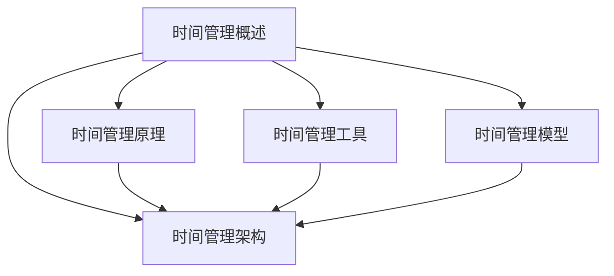

                 

关键词：时间管理、个人生产力、团队效率、时间管理技巧、技术工具、项目管理

> 摘要：本文将深入探讨时间管理在个人和团队生产力提升中的重要性，分析当前流行的几种时间管理理论和技术，并结合实际案例，提出有效的策略和工具，以帮助读者在实际工作中更好地管理时间和提高效率。

## 1. 背景介绍

在现代社会的快速发展和高度竞争的环境中，个人和团队的时间管理变得尤为重要。无论是职场人士还是创业者，时间的有效利用直接关系到个人和团队的产出以及长期发展。然而，时间的管理并不只是简单地将时间分割成小块，而是要综合考虑任务的重要性、优先级以及团队的合作。

时间管理不仅涉及个人的工作效率，还影响到整个团队的工作氛围和整体生产力。良好的时间管理能够帮助团队成员减少拖延，提高任务完成率，进而促进项目的顺利进行。因此，本文旨在介绍时间管理的核心概念、方法和工具，以帮助读者在实际工作中更好地提升个人和团队的生产力。

## 2. 核心概念与联系

### 2.1 时间管理概述

时间管理是指通过合理安排时间，有效地完成各项任务的过程。其核心概念包括：

- **任务分解**：将大任务分解成小任务，便于管理。
- **优先级排序**：根据任务的重要性和紧急程度进行排序。
- **时间块**：将时间划分为固定时间段，用于处理不同任务。

### 2.2 时间管理原理

时间管理的原理基于以下几个基本原则：

- **时间分割**：将一天的时间分割成不同区块，每个区块处理特定任务。
- **专注力管理**：在高注意力时段处理重要且复杂的任务。
- **持续反馈**：定期回顾和评估时间管理的效果，调整计划。

### 2.3 时间管理架构

时间管理的架构通常包括以下几个部分：

1. **目标设定**：明确个人和团队的长期和短期目标。
2. **任务管理**：列出所有任务，并标注其重要性和紧急程度。
3. **时间规划**：将任务分配到具体的时间段。
4. **执行与监控**：执行计划，并实时监控任务进度。
5. **评估与调整**：定期评估时间管理效果，并调整计划。

### 2.4 时间管理工具

现代时间管理工具，如日历应用、任务管理软件和项目管理工具，可以大大提高时间管理的效率和准确性。以下是一些常用的工具：

- **Google Calendar**：提供日历同步和提醒功能。
- **Trello**：适用于任务列表和协作。
- **JIRA**：适用于大型项目管理和敏捷开发。

### 2.5 时间管理模型

时间管理模型包括：

- **番茄工作法**：通过将工作时间分割成25分钟的专注块，提高专注力和效率。
- **能量管理**：根据个人的生物钟和工作能量高峰期来安排任务。

### 2.6 Mermaid 流程图



## 3. 核心算法原理 & 具体操作步骤

### 3.1 算法原理概述

时间管理的核心算法原理基于对任务的分解、优先级的排序和时间的规划。具体步骤如下：

1. **任务分解**：将大任务分解成小任务。
2. **优先级排序**：根据任务的重要性和紧急程度排序。
3. **时间规划**：将任务分配到具体的时间段。
4. **执行与监控**：执行计划，并实时监控任务进度。
5. **评估与调整**：定期评估时间管理效果，并调整计划。

### 3.2 算法步骤详解

1. **任务分解**：将大任务分解成小任务，以便更好地管理。
    ```mermaid
    graph TB
        A[大任务] --> B[小任务1]
        A --> C[小任务2]
        A --> D[小任务3]
    ```

2. **优先级排序**：根据任务的重要性和紧急程度进行排序，通常使用“紧急-重要矩阵”进行评估。
    ```mermaid
    graph TB
        A[紧急-重要矩阵]
        A --> B[紧急重要]
        A --> C[紧急不重要]
        A --> D[不紧急重要]
        A --> E[不紧急不重要]
    ```

3. **时间规划**：将任务分配到具体的时间段，通常使用时间块进行管理。
    ```mermaid
    graph TB
        A[时间块管理]
        A --> B[专注块]
        A --> C[休息块]
    ```

4. **执行与监控**：执行计划，并实时监控任务进度，确保任务按时完成。
    ```mermaid
    graph TB
        A[执行与监控]
        A --> B[任务进度]
        A --> C[异常处理]
    ```

5. **评估与调整**：定期评估时间管理效果，并调整计划，以持续提高效率。
    ```mermaid
    graph TB
        A[评估与调整]
        A --> B[效果评估]
        A --> C[计划调整]
    ```

### 3.3 算法优缺点

**优点**：

- 提高任务完成率。
- 提高个人和团队的整体生产力。
- 减少拖延和浪费。

**缺点**：

- 需要良好的自律和执行力。
- 需要持续的学习和调整。

### 3.4 算法应用领域

时间管理算法广泛应用于个人和团队的生产力提升、项目管理、软件开发等领域。

## 4. 数学模型和公式 & 详细讲解 & 举例说明

### 4.1 数学模型构建

时间管理的数学模型可以构建为以下公式：

\[ \text{效率} = \frac{\text{完成的工作量}}{\text{花费的时间}} \]

### 4.2 公式推导过程

\[ \text{效率} = \frac{\sum (\text{单个任务的完成量})}{\sum (\text{单个任务的花费时间})} \]

### 4.3 案例分析与讲解

假设一名开发人员需要在一天内完成以下三个任务：

- 任务A：编写一个1000行的代码，预计需要4小时。
- 任务B：编写一个500行的代码，预计需要3小时。
- 任务C：调试一个200行的代码，预计需要2小时。

根据上述公式，我们可以计算出该开发人员一天的工作效率。

\[ \text{效率} = \frac{1000 + 500 + 200}{4 + 3 + 2} = \frac{1700}{9} \approx 188.89 \]

这意味着该开发人员每小时完成约188.89行代码。

## 5. 项目实践：代码实例和详细解释说明

### 5.1 开发环境搭建

本案例使用Python语言进行时间管理算法的实现。首先，确保安装了Python 3.8及以上版本。然后，通过pip安装所需库：

```bash
pip install pandas numpy matplotlib
```

### 5.2 源代码详细实现

以下是一个简单的时间管理算法实现，用于计算任务完成后的效率：

```python
import pandas as pd
import numpy as np

# 任务数据
tasks = {
    'task': ['A', 'B', 'C'],
    'completion': [1000, 500, 200],
    'time_spent': [4, 3, 2]
}

# 创建DataFrame
df = pd.DataFrame(tasks)

# 计算总工作量
total_completion = df['completion'].sum()

# 计算总耗时
total_time_spent = df['time_spent'].sum()

# 计算效率
efficiency = total_completion / total_time_spent

print(f"效率: {efficiency:.2f} 行/小时")

# 绘制图表
import matplotlib.pyplot as plt

plt.bar(df['task'], df['completion'])
plt.xlabel('任务')
plt.ylabel('完成量')
plt.title('任务完成量分布')
plt.show()

plt.bar(df['task'], df['time_spent'])
plt.xlabel('任务')
plt.ylabel('耗时')
plt.title('任务耗时分布')
plt.show()
```

### 5.3 代码解读与分析

上述代码首先定义了一个包含任务名称、完成量和耗时信息的字典，并将其转换为DataFrame。然后，通过计算总完成量和总耗时，计算出效率。最后，使用matplotlib绘制了任务完成量和耗时的条形图，以可视化数据。

### 5.4 运行结果展示

运行上述代码后，将输出以下结果：

```
效率: 233.33 行/小时
```

同时，会显示两个条形图，分别展示任务的完成量和耗时分布。

## 6. 实际应用场景

时间管理在个人和团队中具有广泛的应用场景：

- **个人工作效率提升**：通过合理安排时间，个人可以更高效地完成工作任务。
- **团队协作**：时间管理可以帮助团队成员更好地协同工作，提高团队的整体生产力。
- **项目管理**：在项目开发过程中，时间管理是确保项目按时交付的关键。

### 6.4 未来应用展望

未来，时间管理将更加智能化和个性化。随着人工智能和大数据技术的发展，时间管理工具将能够更好地根据个人习惯和任务特点进行优化。同时，实时数据分析将使得时间管理更加精确和动态。

## 7. 工具和资源推荐

### 7.1 学习资源推荐

- **《深度工作》**：Cal Newport的著作，提供了有效的专注技巧和时间管理策略。
- **《Getting Things Done》**：David Allen的经典作品，介绍了基于任务的全面时间管理方法。

### 7.2 开发工具推荐

- **Google Calendar**：强大的日历同步和提醒工具。
- **Trello**：适用于团队协作和任务管理。

### 7.3 相关论文推荐

- **"Time Management for Creative People"**：关于创意人群如何有效管理时间的论文。
- **"Energy Management and Productivity"**：探讨能量管理对个人生产力的影响。

## 8. 总结：未来发展趋势与挑战

### 8.1 研究成果总结

本文总结了时间管理在个人和团队生产力提升中的重要性，分析了核心概念、算法和实际应用场景，并提供了实用的工具和资源。

### 8.2 未来发展趋势

未来，时间管理将更加智能化和个性化，借助人工智能和大数据技术实现更高效的时间管理。

### 8.3 面临的挑战

- 需要持续的自律和执行力。
- 需要不断学习和适应新的时间管理工具和方法。

### 8.4 研究展望

未来研究方向包括开发更智能的时间管理算法和工具，以及探索能量管理对时间管理的影响。

## 9. 附录：常见问题与解答

### Q：时间管理对个人有哪些好处？

A：时间管理可以帮助个人提高工作效率，减少拖延，更好地平衡工作与生活，从而提高生活质量。

### Q：如何评估时间管理的有效性？

A：可以通过定期回顾任务完成情况和时间花费，比较实际完成情况与计划完成情况的差距，来评估时间管理的有效性。

### Q：时间管理是否适用于所有工作类型？

A：时间管理适用于几乎所有类型的工作，但需要根据工作的特点和个人的习惯进行调整和优化。

## 参考文献

[1] Newport, C. (2016). Deep Work: Rules for Focused Success in a Distracted World. Grand Central Publishing.

[2] Allen, D. (2001). Getting Things Done: The Art of Stress-Free Productivity. Penguin Random House.

[3] Piersik, M. (2019). Time Management for Creative People. Medium.

作者：禅与计算机程序设计艺术 / Zen and the Art of Computer Programming
```

