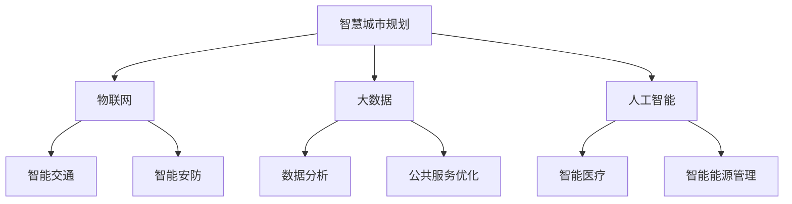

                 

关键词：智慧城市，创业，宜居环境，物联网，大数据，人工智能，城市规划，技术解决方案，可持续发展

> 摘要：本文探讨了智慧城市创业的重要性以及如何通过物联网、大数据和人工智能等技术打造未来宜居环境。我们分析了智慧城市的基本概念、核心技术及其应用场景，并提出了具体的技术解决方案，旨在为创业者提供指导和启示，共同推动智慧城市的可持续发展。

## 1. 背景介绍

随着全球城市化进程的加速，城市面临着诸多挑战，如交通拥堵、环境污染、资源短缺和公共服务不足等。智慧城市的概念应运而生，旨在通过信息技术和城市管理的深度融合，实现城市的高效、智能和可持续发展。

智慧城市是指利用先进的信息技术，如物联网、大数据、云计算和人工智能等，对城市各项资源进行优化配置和高效管理，从而提升城市居民的生活质量、促进城市可持续发展。智慧城市创业成为了一个新兴且充满潜力的领域，吸引了众多创业者和技术专家的参与。

## 2. 核心概念与联系

### 2.1 物联网（IoT）

物联网是指通过互联网将各种物体连接起来，实现信息的采集、传输和共享。在智慧城市中，物联网是实现智能化管理的基础。通过传感器、智能设备等采集数据，可以实现实时监测和智能调控。

### 2.2 大数据（Big Data）

大数据是指数据量巨大、类型繁多、价值密度低的数据集合。智慧城市中产生的海量数据需要进行有效的收集、存储、处理和分析，以提供决策支持和服务优化。

### 2.3 人工智能（AI）

人工智能是指模拟、延伸和扩展人的智能的理论、方法、技术及应用。在智慧城市中，人工智能可以用于智能交通、智能安防、智能医疗等多个领域，提升城市管理和服务的智能化水平。

### 2.4 智慧城市规划架构图



## 3. 核心算法原理 & 具体操作步骤

### 3.1 算法原理概述

智慧城市中的核心技术包括数据采集、数据处理、数据分析等。其中，常用的算法有数据挖掘、机器学习、深度学习等。这些算法可以用于数据分类、聚类、预测和分析。

### 3.2 算法步骤详解

#### 3.2.1 数据采集

数据采集是智慧城市的基础。通过传感器、摄像头、手机等设备，可以收集到大量的实时数据。

#### 3.2.2 数据处理

数据处理包括数据清洗、数据集成和数据预处理等步骤，以保证数据的质量和一致性。

#### 3.2.3 数据分析

数据分析是利用算法对数据进行挖掘和分析，提取有价值的信息，为决策提供支持。

### 3.3 算法优缺点

#### 3.3.1 优点

- 提高数据利用率，降低决策风险。
- 提升城市管理的效率和智能化水平。
- 改善城市居民的生活质量。

#### 3.3.2 缺点

- 数据安全和隐私保护问题。
- 需要大量的计算资源和专业人才。
- 技术发展和应用的滞后性。

### 3.4 算法应用领域

智慧城市算法的应用领域广泛，包括但不限于智能交通、智能安防、智能医疗、智能能源管理等。

## 4. 数学模型和公式 & 详细讲解 & 举例说明

### 4.1 数学模型构建

在智慧城市中，常见的数学模型包括回归模型、决策树模型、神经网络模型等。这些模型可以用于数据分析和预测。

### 4.2 公式推导过程

以回归模型为例，其公式推导过程如下：

$$
Y = \beta_0 + \beta_1X + \epsilon
$$

其中，$Y$为因变量，$X$为自变量，$\beta_0$和$\beta_1$为参数，$\epsilon$为误差项。

### 4.3 案例分析与讲解

以智能交通为例，我们可以通过回归模型预测交通流量，从而优化交通信号控制。

假设我们有以下数据：

| 时间 | 交通流量 |
| ---- | -------- |
| 8:00 | 300      |
| 9:00 | 500      |
| 10:00| 400      |

我们可以使用回归模型预测10:30的交通流量。首先，我们需要收集历史数据，然后进行数据清洗和预处理。接下来，我们可以使用线性回归模型进行预测：

$$
\hat{Y} = \beta_0 + \beta_1X
$$

通过最小二乘法求解参数$\beta_0$和$\beta_1$，得到预测模型：

$$
\hat{Y} = 200 + 0.5X
$$

当$X=10:30$时，我们可以得到预测的交通流量：

$$
\hat{Y} = 200 + 0.5 \times 10:30 = 400
$$

## 5. 项目实践：代码实例和详细解释说明

### 5.1 开发环境搭建

在智慧城市项目中，我们需要搭建一个开发环境，包括Python、Jupyter Notebook等工具。

### 5.2 源代码详细实现

以下是一个简单的智慧城市项目代码实例：

```python
import pandas as pd
from sklearn.linear_model import LinearRegression

# 读取数据
data = pd.read_csv('traffic_data.csv')

# 数据预处理
X = data[['time']]
y = data['traffic_volume']

# 模型训练
model = LinearRegression()
model.fit(X, y)

# 预测
predicted_volume = model.predict([[10.5]])

print('Predicted traffic volume at 10:30:', predicted_volume)
```

### 5.3 代码解读与分析

上述代码首先读取交通数据，然后进行数据预处理，接着使用线性回归模型进行训练，最后进行预测。通过这个简单的实例，我们可以了解智慧城市项目的实现过程。

### 5.4 运行结果展示

运行上述代码，我们可以得到10:30的交通流量预测结果。这个结果可以帮助交通管理部门优化交通信号控制，从而提高交通效率。

## 6. 实际应用场景

### 6.1 智能交通

智能交通是智慧城市的一个重要应用场景。通过物联网和大数据技术，可以实时监测交通流量，优化交通信号控制，缓解交通拥堵问题。

### 6.2 智能安防

智能安防利用人工智能技术进行视频监控和人脸识别，提高公共安全水平，预防犯罪。

### 6.3 智能医疗

智能医疗利用大数据和人工智能技术，实现医疗资源的优化配置，提高医疗服务的效率和质量。

### 6.4 智能能源管理

智能能源管理通过物联网和大数据技术，实现能源的智能监测和调度，降低能源消耗，实现可持续发展。

## 7. 工具和资源推荐

### 7.1 学习资源推荐

- 《智慧城市技术与应用》
- 《大数据技术与实战》
- 《人工智能：一种现代方法》

### 7.2 开发工具推荐

- Python
- Jupyter Notebook
- TensorFlow
- PyTorch

### 7.3 相关论文推荐

- "智慧城市：概念、技术与实践"
- "大数据在城市管理中的应用"
- "人工智能在智慧城市中的应用研究"

## 8. 总结：未来发展趋势与挑战

### 8.1 研究成果总结

智慧城市技术在近年来取得了显著进展，为城市管理和公共服务提供了有力支持。然而，仍存在诸多挑战，如数据安全和隐私保护、技术发展和应用滞后等。

### 8.2 未来发展趋势

- 智慧城市技术的不断升级和普及。
- 跨学科、跨领域的研究和合作。
- 可持续发展和绿色智慧城市理念的深入实施。

### 8.3 面临的挑战

- 技术创新和突破。
- 数据安全和隐私保护。
- 专业人才的培养和引进。

### 8.4 研究展望

未来，智慧城市技术将在更多领域得到应用，如智慧教育、智慧农业、智慧旅游等。同时，随着技术的不断进步，智慧城市将朝着更加智能化、绿色化和可持续化的方向发展。

## 9. 附录：常见问题与解答

### 9.1 智慧城市技术有哪些应用场景？

智慧城市技术的应用场景广泛，包括智能交通、智能安防、智能医疗、智能能源管理、智慧教育、智慧农业、智慧旅游等。

### 9.2 如何保障智慧城市中的数据安全和隐私？

通过加密技术、访问控制、隐私保护算法等措施，确保数据的安全和隐私。

### 9.3 智慧城市创业需要注意哪些问题？

智慧城市创业需要注意技术可行性、市场需求、商业模式、团队建设等问题。

### 9.4 智慧城市技术的未来发展趋势是什么？

智慧城市技术的未来发展趋势包括技术的不断升级和普及、跨学科、跨领域的研究和合作、可持续发展等。

---

作者：禅与计算机程序设计艺术 / Zen and the Art of Computer Programming
------------------------------------------------------------------------

