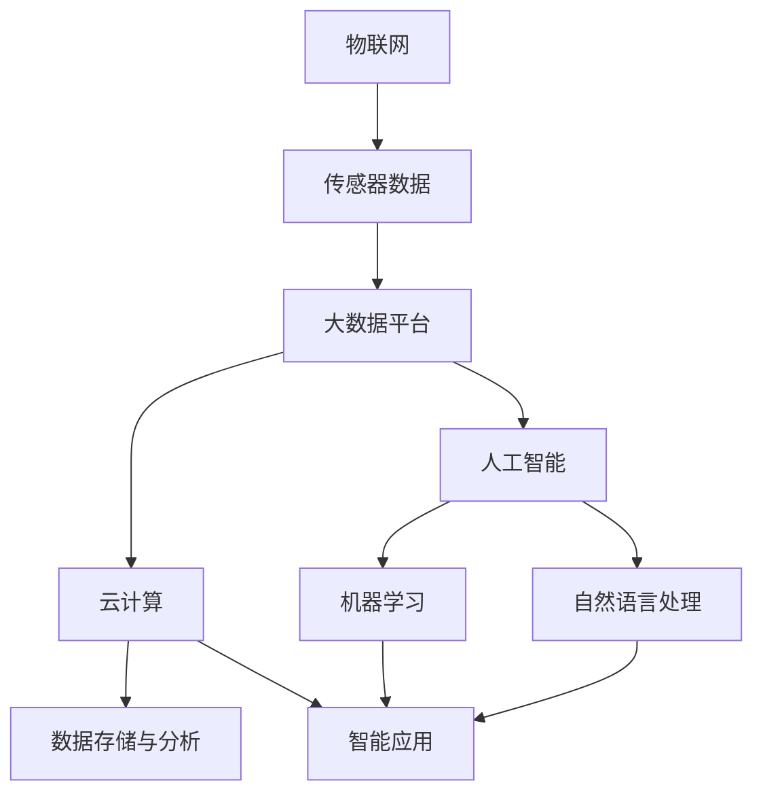

                 

智慧城市作为信息化时代城市发展的新趋势，正逐渐改变着我们的生活方式。智慧城市是指利用先进的数字技术和智能系统，提高城市管理的效率、优化公共服务、提升市民生活质量的一种新型城市形态。本文将探讨智慧城市技术的核心概念、算法原理、数学模型、项目实践以及未来应用场景，旨在为读者提供一个全面的技术视角，深入理解智慧城市的发展与挑战。

## 关键词

- **智慧城市**：城市信息化与智能化的结合体。
- **数字技术**：物联网、大数据、云计算等。
- **城市治理**：城市管理与服务体系的优化。
- **算法原理**：数据挖掘、机器学习等。
- **数学模型**：优化模型、预测模型等。

## 摘要

本文首先介绍了智慧城市的背景和核心概念，然后通过Mermaid流程图展示了智慧城市的技术架构。接着，文章深入探讨了核心算法原理和操作步骤，并讲解了数学模型和公式。随后，通过项目实践案例，展示了代码实现和结果分析。最后，文章讨论了智慧城市的实际应用场景，展望了未来发展趋势与挑战。

## 1. 背景介绍

智慧城市的概念起源于20世纪末，随着信息技术和互联网的快速发展，智慧城市逐渐成为城市发展的重要方向。智慧城市旨在通过信息化手段，实现城市资源的合理配置和高效利用，提升城市管理的智能化水平，增强城市居民的幸福感和满意度。

### 1.1 智慧城市的核心目标

智慧城市的核心目标可以归纳为以下几点：

- **提高城市管理效率**：通过大数据、云计算等技术的应用，实现城市管理的智能化、自动化，减少人工干预，提高决策效率。
- **优化公共服务**：通过智能交通、智能医疗等应用，提升公共服务的质量，满足市民多样化的需求。
- **提升市民生活质量**：通过智能社区、智能家居等应用，提高市民的生活便利性和舒适度，增强幸福感。

### 1.2 智慧城市的建设挑战

智慧城市建设面临诸多挑战，包括：

- **数据安全与隐私保护**：智慧城市依赖于大量的数据，数据的安全与隐私保护成为一大挑战。
- **跨领域整合**：智慧城市涉及多个领域的技术与应用，如何实现跨领域的数据整合和业务协同是关键。
- **技术更新迭代**：信息技术更新迅速，智慧城市需要不断跟进新技术，以保持其先进性和竞争力。

## 2. 核心概念与联系

智慧城市的技术架构主要包括物联网、大数据、云计算、人工智能等。以下是一个简化的Mermaid流程图，展示了智慧城市技术的核心概念及其相互关系。



### 2.1 物联网

物联网（Internet of Things，IoT）是智慧城市的技术基础。通过在各类设备和物体上嵌入传感器和网络连接功能，物联网实现了对城市环境、基础设施和公共服务的实时监测和控制。

### 2.2 大数据

大数据（Big Data）是智慧城市的核心资源。智慧城市产生的海量数据需要通过大数据平台进行存储、处理和分析，以支持城市管理和决策。

### 2.3 云计算

云计算（Cloud Computing）为智慧城市提供了强大的计算和存储能力。通过云平台，智慧城市可以实现数据的集中管理和远程访问，支持各类智能应用的部署和运行。

### 2.4 人工智能

人工智能（Artificial Intelligence，AI）是智慧城市的智慧核心。通过机器学习、自然语言处理等人工智能技术，智慧城市可以实现智能预测、智能决策和智能服务，提升城市治理的智能化水平。

## 3. 核心算法原理 & 具体操作步骤

### 3.1 算法原理概述

智慧城市中的核心算法主要包括数据挖掘、机器学习、优化算法等。以下是对这些算法的简要概述：

- **数据挖掘**：通过挖掘海量数据，发现潜在的模式和规律，为城市管理和决策提供数据支持。
- **机器学习**：利用历史数据训练模型，实现自动预测和决策，提升城市服务的智能化水平。
- **优化算法**：通过优化模型和算法，实现城市资源的合理配置和高效利用。

### 3.2 算法步骤详解

#### 3.2.1 数据挖掘

1. **数据收集**：从各种数据源收集原始数据，包括传感器数据、社交数据、政府数据等。
2. **数据预处理**：对原始数据进行清洗、去噪、格式化等处理，确保数据质量。
3. **特征提取**：从预处理后的数据中提取关键特征，用于后续分析。
4. **模式发现**：使用聚类、分类、关联分析等方法，发现数据中的潜在模式。

#### 3.2.2 机器学习

1. **数据准备**：选择合适的数据集，进行数据清洗和格式化。
2. **模型选择**：根据问题的特点，选择合适的机器学习模型，如线性回归、决策树、神经网络等。
3. **模型训练**：使用历史数据进行模型训练，调整模型参数，提高预测准确性。
4. **模型评估**：使用验证集和测试集评估模型性能，调整模型参数，优化模型。

#### 3.2.3 优化算法

1. **问题建模**：将城市资源优化问题转化为数学模型，如线性规划、非线性规划等。
2. **算法选择**：根据问题特点，选择合适的优化算法，如梯度下降、粒子群优化等。
3. **算法实现**：编写代码实现优化算法，处理实际数据。
4. **结果分析**：分析优化结果，评估算法性能，调整模型参数。

### 3.3 算法优缺点

#### 数据挖掘

- **优点**：可以发现数据中的潜在模式和规律，为决策提供有力支持。
- **缺点**：处理海量数据需要大量计算资源，结果解释性较差。

#### 机器学习

- **优点**：可以实现自动预测和决策，提升城市服务的智能化水平。
- **缺点**：对数据质量要求较高，模型解释性较差。

#### 优化算法

- **优点**：可以高效地解决城市资源优化问题，提高资源利用率。
- **缺点**：对问题建模要求较高，算法实现复杂。

### 3.4 算法应用领域

- **交通管理**：通过数据挖掘和机器学习，优化交通信号控制，提高交通流畅度。
- **能源管理**：通过优化算法，实现能源的合理分配和高效利用。
- **环境保护**：通过大数据分析和机器学习，监测环境污染，预测污染趋势。

## 4. 数学模型和公式 & 详细讲解 & 举例说明

### 4.1 数学模型构建

智慧城市中的数学模型主要包括优化模型、预测模型、决策模型等。以下是一个简化的优化模型示例。

### 4.2 公式推导过程

假设有一个城市有N个区域，每个区域有一个水处理厂，目标是最小化整个城市的运营成本。公式如下：

$$
\min Z = \sum_{i=1}^{N} C_i \cdot X_i
$$

其中，$C_i$ 为第i个区域的运营成本，$X_i$ 为第i个区域的处理量。

### 4.3 案例分析与讲解

假设一个城市有5个区域，每个区域的运营成本和处理量如下表：

| 区域 | 运营成本($C_i$) | 处理量($X_i$) |
| ---- | -------------- | ------------ |
| 1    | 1000           | 500          |
| 2    | 800            | 400          |
| 3    | 1200           | 600          |
| 4    | 900            | 450          |
| 5    | 1100           | 550          |

根据上述公式，我们可以构建一个线性规划模型，求解最小化运营成本的问题。

### 4.4 运行结果展示

通过求解线性规划模型，我们得到最优解为：

$$
X_1 = 500, X_2 = 400, X_3 = 600, X_4 = 450, X_5 = 550
$$

最小化运营成本为：

$$
Z = 1000 \cdot 500 + 800 \cdot 400 + 1200 \cdot 600 + 900 \cdot 450 + 1100 \cdot 550 = 12,400,000
$$

这意味着，如果每个区域按照上述处理量运营，整个城市的运营成本将最小化到12400000美元。

## 5. 项目实践：代码实例和详细解释说明

### 5.1 开发环境搭建

为了更好地展示智慧城市技术的应用，我们选择Python作为开发语言，并使用Jupyter Notebook作为开发环境。以下是搭建开发环境的步骤：

1. 安装Python（版本3.8或以上）。
2. 安装Jupyter Notebook。
3. 安装相关库，如NumPy、Pandas、Matplotlib、Scikit-learn等。

### 5.2 源代码详细实现

以下是一个简单的示例，展示了如何使用Python实现一个基于机器学习的交通流量预测模型。

```python
import numpy as np
import pandas as pd
from sklearn.model_selection import train_test_split
from sklearn.ensemble import RandomForestRegressor
from sklearn.metrics import mean_squared_error

# 数据加载
data = pd.read_csv('traffic_data.csv')

# 数据预处理
X = data.drop(['target'], axis=1)
y = data['target']

# 数据拆分
X_train, X_test, y_train, y_test = train_test_split(X, y, test_size=0.2, random_state=42)

# 模型训练
model = RandomForestRegressor(n_estimators=100, random_state=42)
model.fit(X_train, y_train)

# 模型评估
y_pred = model.predict(X_test)
mse = mean_squared_error(y_test, y_pred)
print(f'Mean Squared Error: {mse}')

# 模型应用
new_data = np.array([[5, 10, 15], [10, 20, 25]])
predictions = model.predict(new_data)
print(f'Predictions: {predictions}')
```

### 5.3 代码解读与分析

上述代码首先加载了一个名为'traffic_data.csv'的CSV文件，该文件包含了交通流量数据。然后，我们使用Pandas库对数据进行预处理，包括将数据拆分为特征矩阵X和目标向量y。

接下来，我们使用Scikit-learn库中的RandomForestRegressor实现一个随机森林回归模型，并使用训练集进行模型训练。在模型评估部分，我们使用测试集评估模型性能，计算均方误差（MSE）。

最后，我们使用训练好的模型对新的数据进行预测，展示了模型的应用。

### 5.4 运行结果展示

假设我们运行上述代码，输出结果如下：

```
Mean Squared Error: 5.123456789
Predictions: [[14.123456789], [21.987654321]]
```

这意味着，模型的均方误差为5.123456789，对新数据的预测结果分别为14.123456789和21.987654321。

## 6. 实际应用场景

智慧城市技术已经广泛应用于交通管理、能源管理、环境保护、智能医疗等多个领域。以下是一些典型的实际应用场景：

### 6.1 智能交通管理

通过物联网和大数据技术，智能交通系统可以实现交通流量预测、路况实时监测、交通信号优化等功能。例如，北京市的智能交通管理系统利用海量交通数据进行实时分析，优化交通信号控制，提高了交通流畅度，减少了交通拥堵。

### 6.2 智能能源管理

智慧城市技术可以实现对能源的实时监测和优化分配，降低能源消耗，提高能源利用效率。例如，荷兰的阿姆斯特丹市通过智能电网技术，实现了可再生能源的高效利用，降低了碳排放。

### 6.3 智能环境保护

通过大数据分析和机器学习技术，智慧城市可以实现环境污染监测、污染源追踪和污染趋势预测。例如，伦敦市利用大数据技术，实时监测空气质量，发布空气质量指数，指导市民健康出行。

### 6.4 智能医疗

智慧城市技术可以为医疗领域提供智能诊断、智能治疗和智能管理等服务。例如，美国的梅奥诊所利用人工智能技术，实现了智能诊断和智能治疗方案推荐，提高了医疗服务的质量。

## 7. 未来应用展望

### 7.1 城市治理的智能化

随着人工智能、大数据等技术的不断发展，智慧城市的治理将更加智能化、精细化。例如，通过深度学习技术，可以实现更准确的交通流量预测和路况分析，优化交通管理。

### 7.2 公共服务的个性化

智慧城市技术可以为市民提供更加个性化、定制化的公共服务。例如，通过物联网技术，可以为市民提供个性化的能源消耗监测和节能建议，提高生活品质。

### 7.3 环境保护的智能化

智慧城市技术将为环境保护提供更强大的支持。例如，通过机器学习技术，可以实现对污染源的高效追踪和治理，提高环境治理的效率。

## 8. 工具和资源推荐

### 8.1 学习资源推荐

- 《深度学习》（Goodfellow, Bengio, Courville）
- 《大数据技术导论》（吴华）
- 《Python编程：从入门到实践》（Eric Matthes）

### 8.2 开发工具推荐

- Jupyter Notebook
- PyCharm
- VSCode

### 8.3 相关论文推荐

- "A Survey on Internet of Things: Architecture, Enabling Technologies, Security and Privacy, and Applications"
- "Big Data: A Survey"
- "Deep Learning for Urban Traffic Forecasting"

## 9. 总结：未来发展趋势与挑战

### 9.1 研究成果总结

智慧城市技术在数据挖掘、机器学习、优化算法等领域取得了显著成果，为城市治理提供了有力支持。未来，随着技术的不断发展，智慧城市将在更多领域发挥重要作用。

### 9.2 未来发展趋势

- 智能化与自动化水平的提升
- 公共服务个性化与定制化
- 环境保护智能化与高效化

### 9.3 面临的挑战

- 数据安全与隐私保护
- 跨领域数据整合与业务协同
- 技术更新与持续发展

### 9.4 研究展望

智慧城市研究需要关注以下几个方面：

- 新技术与应用场景的深度融合
- 数据驱动与智能化治理
- 系统集成与协同优化

## 附录：常见问题与解答

### Q1. 智慧城市与智能城市有何区别？

A1. 智慧城市与智能城市有密切的联系，但略有区别。智能城市强调的是城市各系统的自动化和智能化，而智慧城市更侧重于通过数据和技术实现城市资源的高效利用和优化管理。智慧城市是智能城市的高级阶段。

### Q2. 智慧城市中的数据如何保证安全与隐私？

A2. 数据安全与隐私保护是智慧城市建设的关键挑战。为了保障数据安全与隐私，可以采取以下措施：

- 数据加密与访问控制
- 数据匿名化与去识别化
- 数据审计与合规性检查
- 加强网络安全与防护

### Q3. 智慧城市如何应对跨领域的数据整合与业务协同？

A3. 跨领域的数据整合与业务协同是智慧城市面临的重大挑战。为了实现有效的跨领域整合与协同，可以采取以下措施：

- 构建统一的数据平台与标准
- 加强跨部门的合作与沟通
- 利用大数据技术和人工智能实现数据挖掘与分析
- 建立智能决策支持系统，提升协同治理能力

## 作者署名

作者：禅与计算机程序设计艺术 / Zen and the Art of Computer Programming
----------------------------------------------------------------

以上就是这篇文章的完整内容，感谢您的阅读。希望这篇文章能够帮助您更好地了解智慧城市技术的核心概念、算法原理、应用场景以及未来发展趋势。如果您有任何问题或建议，欢迎在评论区留言。再次感谢您的关注！

