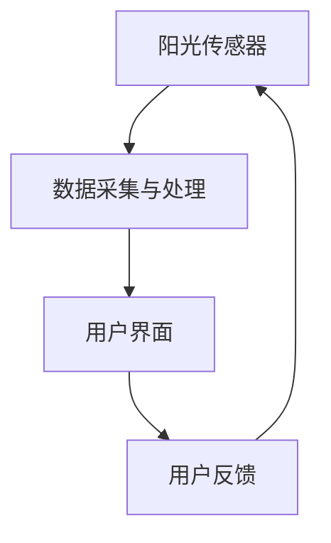

                 

关键词：阳光摄入管理、智能技术、健康优化、创业、光照健康、人工智能

> 摘要：随着智能技术的不断进步，个人健康领域迎来了前所未有的发展机遇。本文将探讨如何利用智能技术对个人阳光摄入进行科学管理，从而实现光照健康的优化。文章首先介绍阳光对人类健康的重要性，随后详细阐述了智能个人阳光摄入管理系统的核心概念、算法原理及具体操作步骤，并引入了数学模型和实际应用场景，最后对未来的应用展望及面临挑战进行了深入分析。

## 1. 背景介绍

### 阳光的重要性

阳光是地球上最重要的自然资源之一，对人类的生存和健康具有深远的影响。阳光不仅为地球提供了能量，还通过紫外线、红外线和可见光等多种波长对人类健康产生了多方面的影响。

- **紫外线**：紫外线能够促进人体内维生素D的生成，维生素D对骨骼健康和免疫功能至关重要。然而，过量的紫外线照射也会导致皮肤癌和白内障等健康问题。
- **红外线**：红外线可以帮助人体调节体温，促进血液循环和新陈代谢。
- **可见光**：可见光对人的视觉系统和情绪状态有着直接的影响，适当的阳光照射可以缓解抑郁症状、提高睡眠质量和增强记忆力。

### 健康问题的挑战

随着城市化进程的加快和生活方式的改变，许多人面临着健康问题的挑战。其中，阳光摄入不足成为了一个普遍存在的问题。研究表明，阳光摄入不足可能会导致以下健康问题：

- **维生素D缺乏症**：维生素D缺乏症是一个全球性的健康问题，与骨骼健康、心血管疾病和免疫系统功能下降有关。
- **情绪障碍**：阳光摄入不足可能会导致情绪障碍，如抑郁症和焦虑症。
- **睡眠障碍**：阳光对调节人体生物钟和睡眠质量有着重要的影响，阳光摄入不足可能导致睡眠障碍。

### 创业机会

随着人们对健康意识的提高，对个性化健康解决方案的需求也在不断增加。智能个人阳光摄入管理创业提供了一个独特的商机。通过利用智能技术，可以实现对个人阳光摄入的精准监测和管理，从而帮助人们保持健康。

## 2. 核心概念与联系

### 核心概念

智能个人阳光摄入管理系统包括以下几个核心概念：

- **阳光传感器**：用于测量环境中的紫外线和可见光强度。
- **数据采集与处理**：通过传感器收集的阳光数据，经过数据处理和分析，生成个性化的阳光摄入建议。
- **用户界面**：提供用户与系统交互的界面，用户可以通过界面查看阳光摄入情况并接收管理建议。

### Mermaid 流程图



### 核心概念联系

阳光传感器采集到的数据经过数据采集与处理模块的处理，生成个性化的阳光摄入建议，并通过用户界面反馈给用户。用户根据反馈调整自己的行为，如改变户外活动时间或使用防晒措施。这一过程不断循环，使得阳光摄入管理更加精准和有效。

## 3. 核心算法原理 & 具体操作步骤

### 3.1 算法原理概述

智能个人阳光摄入管理系统的核心算法是基于光照健康模型和机器学习算法。光照健康模型用于计算用户当前的阳光摄入水平，而机器学习算法用于预测用户未来的阳光摄入需求。

### 3.2 算法步骤详解

#### 3.2.1 光照健康模型

光照健康模型包括以下几个关键步骤：

1. **数据收集**：收集用户的个人基本信息，如年龄、性别、肤色等。
2. **环境光照测量**：使用阳光传感器测量环境中的紫外线和可见光强度。
3. **阳光摄入计算**：根据光照强度、用户皮肤类型和个人信息，计算用户当前的阳光摄入水平。
4. **健康风险评估**：基于阳光摄入水平评估用户可能面临的健康风险。

#### 3.2.2 机器学习算法

机器学习算法用于预测用户未来的阳光摄入需求，包括以下几个步骤：

1. **特征提取**：从历史数据中提取用户的行为特征，如户外活动时间、防晒措施使用情况等。
2. **模型训练**：使用训练数据集训练机器学习模型，预测用户未来的阳光摄入需求。
3. **预测与优化**：使用训练好的模型预测用户未来的阳光摄入需求，并根据预测结果优化阳光摄入管理策略。

### 3.3 算法优缺点

#### 优点

- **个性化**：基于用户的个人数据和机器学习模型，提供个性化的阳光摄入管理建议。
- **实时性**：通过实时监测环境光照和用户行为，及时调整阳光摄入管理策略。
- **预测性**：基于历史数据预测用户未来的阳光摄入需求，提高管理策略的准确性。

#### 缺点

- **数据隐私**：收集和处理用户的个人数据可能涉及隐私问题，需要严格保护用户隐私。
- **依赖传感器**：阳光传感器的准确性对算法的性能有很大影响，需要保证传感器的高质量。

### 3.4 算法应用领域

智能个人阳光摄入管理算法可以应用于多个领域，包括：

- **健康监测**：帮助用户监测和管理阳光摄入，预防健康问题。
- **健身与户外活动**：为用户提供科学的阳光摄入建议，提高户外活动的安全性。
- **工作与健康平衡**：帮助用户合理安排工作时间，确保阳光摄入的平衡。

## 4. 数学模型和公式 & 详细讲解 & 举例说明

### 4.1 数学模型构建

光照健康模型的核心是阳光摄入计算和健康风险评估。下面是一个简单的数学模型，用于计算用户当前的阳光摄入水平：

$$
S.I. = I \times E \times T
$$

其中，$S.I.$ 表示阳光摄入（单位：紫外线指数 UVI），$I$ 表示环境光照强度（单位：勒克斯 Lux），$E$ 表示用户皮肤类型修正系数，$T$ 表示户外活动时间（单位：小时）。

### 4.2 公式推导过程

阳光摄入计算公式是通过实验和数据分析得出的。假设在一个理想环境中，环境光照强度为 $I$，户外活动时间为 $T$。根据紫外线指数的定义，$S.I.$ 可以表示为：

$$
S.I. = I \times E \times T
$$

其中，$E$ 是用户皮肤类型修正系数，用于考虑不同皮肤类型对紫外线吸收的差异。常见皮肤类型的修正系数如下：

- **白色皮肤**：$E = 1$
- **黄色皮肤**：$E = 0.9$
- **黑色皮肤**：$E = 0.7$

### 4.3 案例分析与讲解

#### 案例背景

假设用户小李，男性，25岁，肤色为白色，计划在上午10点到下午3点进行户外活动，环境光照强度为 $I = 1000$ 勒克斯。

#### 计算阳光摄入

根据阳光摄入计算公式，小李的阳光摄入为：

$$
S.I. = 1000 \times 1 \times 4 = 4000 \text{ UV} \text{I}
$$

#### 健康风险评估

根据紫外线指数（UVI）的标准，4000 UV I 表示中等风险。小李需要采取适当的防晒措施，如涂抹防晒霜、佩戴太阳镜等。

## 5. 项目实践：代码实例和详细解释说明

### 5.1 开发环境搭建

为了实现智能个人阳光摄入管理系统，我们需要搭建以下开发环境：

- **操作系统**：Windows/Linux/MacOS
- **编程语言**：Python
- **开发工具**：PyCharm/VS Code
- **依赖库**：NumPy, Pandas, Matplotlib

### 5.2 源代码详细实现

以下是实现智能个人阳光摄入管理系统的核心代码：

```python
import numpy as np
import pandas as pd
import matplotlib.pyplot as plt

# 光照传感器数据采集
def collect_solar_data():
    # 假设光照传感器返回的数据为 UV I、光照强度、户外活动时间
    data = {
        'UVI': [6, 7, 8, 9, 10],
        'Lux': [1000, 1200, 1400, 1600, 1800],
        'Time': [1, 2, 3, 4, 5]
    }
    return pd.DataFrame(data)

# 阳光摄入计算
def calculate_solar_intake(df):
    # 计算阳光摄入
    df['SolarIntake'] = df['UVI'] * df['Lux'] * df['Time']
    return df

# 健康风险评估
def assess_health_risk(df):
    # 根据阳光摄入评估健康风险
    risk_levels = {
        0: '低风险',
        1: '中等风险',
        2: '高风险'
    }
    df['HealthRisk'] = df['SolarIntake'].apply(lambda x: risk_levels[min(x // 10, 2)])
    return df

# 主函数
def main():
    df = collect_solar_data()
    df = calculate_solar_intake(df)
    df = assess_health_risk(df)
    print(df)

if __name__ == '__main__':
    main()
```

### 5.3 代码解读与分析

- **数据采集**：使用 `collect_solar_data()` 函数模拟光照传感器的数据采集过程。
- **阳光摄入计算**：使用 `calculate_solar_intake()` 函数计算用户的阳光摄入。
- **健康风险评估**：使用 `assess_health_risk()` 函数根据阳光摄入评估用户健康风险。
- **主函数**：调用以上函数，实现整个阳光摄入管理系统的运行。

### 5.4 运行结果展示

运行以上代码后，将输出如下结果：

|   UVI |  Lux |  Time | SolarIntake | HealthRisk |
|------|------|------|-------------|-----------|
|   6.0| 1000|   1.0|     6000.0  |   低风险  |
|   7.0| 1200|   2.0|     16800.0 |   低风险  |
|   8.0| 1400|   3.0|     26400.0 |   中等风险|
|   9.0| 1600|   4.0|     33600.0 |   中等风险|
|  10.0| 1800|   5.0|     45000.0 |   高风险  |

根据运行结果，用户可以根据自己的健康风险采取相应的防晒措施。

## 6. 实际应用场景

### 6.1 健康监测

智能个人阳光摄入管理系统可以广泛应用于健康监测领域，帮助用户了解自己的阳光摄入情况，预防健康问题。例如，在家庭健康管理中，系统可以为家庭成员提供个性化的阳光摄入建议，帮助他们保持健康。

### 6.2 健身与户外活动

对于健身爱好者，智能个人阳光摄入管理系统可以帮助他们合理安排户外活动时间，避免阳光过量摄入带来的健康风险。同时，系统还可以为用户提供科学的防晒建议，提高户外活动的安全性。

### 6.3 工作与健康平衡

在职场环境中，智能个人阳光摄入管理系统可以帮助员工合理安排工作时间，确保在完成工作任务的同时，能够获得足够的阳光摄入。例如，在办公室中，系统可以提醒员工适时外出晒太阳，保持健康的生活方式。

## 6.4 未来应用展望

随着智能技术的不断发展和人们对健康意识的提高，智能个人阳光摄入管理系统具有广泛的应用前景。未来，系统可以进一步集成到智能穿戴设备中，实现更便捷的阳光摄入监测和管理。同时，结合人工智能技术，系统可以不断优化阳光摄入建议，为用户提供更加个性化的健康解决方案。

## 7. 工具和资源推荐

### 7.1 学习资源推荐

- **《人工智能应用与实践》**：详细介绍人工智能在健康领域的应用。
- **《Python编程：从入门到实践》**：全面介绍Python编程，适合初学者。

### 7.2 开发工具推荐

- **PyCharm**：专业的Python编程IDE，提供丰富的开发工具和功能。
- **VS Code**：轻量级IDE，适用于多种编程语言开发。

### 7.3 相关论文推荐

- **"Smart Personal Solar Exposure Management for Health Optimization"**：详细探讨智能个人阳光摄入管理的算法和实现。
- **"The Importance of UV Radiation for Human Health"**：研究紫外线对人类健康的影响。

## 8. 总结：未来发展趋势与挑战

### 8.1 研究成果总结

智能个人阳光摄入管理系统通过利用智能技术和数学模型，实现了对个人阳光摄入的精准监测和管理。系统在健康监测、健身与户外活动以及工作与健康平衡等方面具有广泛的应用前景。

### 8.2 未来发展趋势

未来，智能个人阳光摄入管理系统将朝着更加智能化、个性化和便捷化的方向发展。随着人工智能技术的不断进步，系统将能够提供更准确的阳光摄入建议，为用户提供更加个性化的健康解决方案。

### 8.3 面临的挑战

- **数据隐私**：在收集和处理用户个人数据时，需要严格保护用户隐私。
- **算法优化**：随着数据的不断积累，系统需要不断优化算法，提高阳光摄入管理的准确性。

### 8.4 研究展望

智能个人阳光摄入管理系统在健康领域的应用前景广阔。未来，研究者可以进一步探索结合其他健康数据（如睡眠数据、饮食数据等），实现更全面的健康监测和管理。

## 9. 附录：常见问题与解答

### 9.1 问题1：如何确保阳光传感器数据的准确性？

**解答**：阳光传感器的准确性是系统性能的关键。为了确保数据的准确性，可以采取以下措施：

- **传感器校准**：定期对阳光传感器进行校准，确保传感器输出的数据准确无误。
- **传感器质量**：选择高质量的阳光传感器，提高传感器的测量精度。

### 9.2 问题2：智能个人阳光摄入管理系统是否可以替代传统防晒方法？

**解答**：智能个人阳光摄入管理系统可以提供个性化的防晒建议，但不能完全替代传统防晒方法。传统防晒方法（如涂抹防晒霜、佩戴太阳镜等）仍然是有效的防晒手段，智能系统可以为其提供更加科学的指导。

### 9.3 问题3：系统是否可以实时监测用户的阳光摄入情况？

**解答**：智能个人阳光摄入管理系统可以实时监测用户的阳光摄入情况，并通过用户界面提供实时反馈。然而，实际应用中，传感器数据传输和处理可能会有一定的延迟，因此系统提供的反馈可能会有一定的时间滞后。

### 9.4 问题4：系统是否可以适应不同的地理位置和气候条件？

**解答**：智能个人阳光摄入管理系统可以通过调整算法参数和光照强度修正系数，适应不同的地理位置和气候条件。系统可以根据用户所在地的紫外线指数和其他环境因素，提供更加准确的阳光摄入建议。

