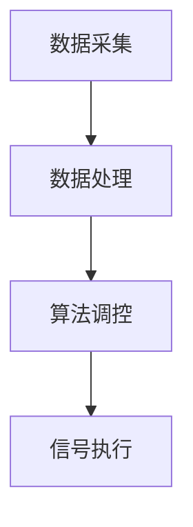

                 

关键词：智能交通、信号控制系统、市场潜力、算法、应用场景、未来展望

> 摘要：本文将深入探讨智能交通信号控制系统的市场潜力。首先，我们回顾了传统交通信号控制系统的不足，然后介绍了智能交通信号控制系统的基础概念和技术架构。随后，本文分析了核心算法的原理及其在实际应用中的优缺点，并通过具体案例进行了数学模型和公式的推导与讲解。最后，文章总结了智能交通信号控制系统的实践应用，对其未来发展进行了展望。

## 1. 背景介绍

### 1.1 传统交通信号控制系统的不足

传统交通信号控制系统通常依赖于固定的信号配时方案，无法根据实时交通流量和交通事故进行动态调整。这种系统存在以下问题：

- **效率低下**：无法灵活应对高峰期和事故后的交通状况。
- **资源浪费**：信号灯长时间不变，导致交通拥堵和燃料浪费。
- **安全性不足**：无法实时监控交通流量和事故预警。

### 1.2 智能交通信号控制系统的兴起

随着物联网、大数据、人工智能等技术的发展，智能交通信号控制系统应运而生。该系统通过实时监控交通流量，结合机器学习和预测算法，实现交通信号灯的智能调控，提高了交通效率和安全性。

## 2. 核心概念与联系

智能交通信号控制系统主要由以下几个核心模块组成：

- **数据采集**：通过传感器、摄像头等设备实时获取交通流量、速度、车辆密度等信息。
- **数据处理**：利用云计算和边缘计算对采集到的数据进行处理和分析。
- **算法调控**：运用机器学习算法预测交通流量，制定最优的信号配时方案。
- **信号执行**：通过智能交通信号控制器实现信号灯的智能调控。

以下是一个简化的 Mermaid 流程图，展示了智能交通信号控制系统的基本架构：



### 2.1 数据采集

数据采集模块负责收集交通流量、速度、车辆密度等信息。这些信息通过安装在道路上的传感器、摄像头等设备获取。

### 2.2 数据处理

数据处理模块利用云计算和边缘计算对采集到的数据进行分析和处理。该模块的核心任务是提取有用信息，以便后续的算法调控。

### 2.3 算法调控

算法调控模块是智能交通信号控制系统的核心。它利用机器学习算法对交通流量进行预测，并根据预测结果制定最优的信号配时方案。

### 2.4 信号执行

信号执行模块通过智能交通信号控制器实现信号灯的智能调控。该模块根据算法调控模块提供的信号配时方案，控制信号灯的亮灭状态。

## 3. 核心算法原理 & 具体操作步骤

### 3.1 算法原理概述

智能交通信号控制系统的核心算法是基于机器学习模型的。该算法通过训练大量的交通流量数据，学习交通流量变化的规律，从而预测未来的交通流量。具体而言，算法可以分为以下步骤：

- **数据预处理**：对采集到的交通流量数据进行清洗和预处理，包括去除异常值、填补缺失值等。
- **特征提取**：从预处理后的数据中提取有用的特征，如时间、地点、车辆数量等。
- **模型训练**：利用训练集数据对机器学习模型进行训练，学习交通流量变化的规律。
- **模型预测**：利用训练好的模型对未来的交通流量进行预测。
- **信号配时**：根据预测结果制定最优的信号配时方案。

### 3.2 算法步骤详解

#### 3.2.1 数据预处理

数据预处理是机器学习模型训练的重要步骤。其主要任务是去除数据中的噪声，提高数据的可用性。具体步骤如下：

- **去除异常值**：检测并去除数据中的异常值，如突然增加的交通流量。
- **填补缺失值**：使用适当的插值方法填补数据中的缺失值。

#### 3.2.2 特征提取

特征提取是从原始数据中提取有用的信息，以便于后续的模型训练。常见的特征提取方法包括：

- **时间特征**：提取交通流量发生的时间，如小时、星期等。
- **地点特征**：提取交通流量发生的地点，如道路段、交叉路口等。
- **车辆数量特征**：提取通过某一地点的车辆数量。

#### 3.2.3 模型训练

模型训练是机器学习算法的核心步骤。常用的模型训练方法包括：

- **线性回归**：通过线性模型预测交通流量。
- **决策树**：通过决策树模型预测交通流量。
- **神经网络**：通过神经网络模型预测交通流量。

#### 3.2.4 模型预测

模型预测是根据训练好的模型对未来的交通流量进行预测。具体步骤如下：

- **输入特征**：将当前的特征数据输入到训练好的模型中。
- **模型输出**：得到未来的交通流量预测值。

#### 3.2.5 信号配时

信号配时是根据预测结果制定最优的信号配时方案。具体步骤如下：

- **信号配时方案生成**：根据预测结果生成不同的信号配时方案。
- **方案评估**：对不同的信号配时方案进行评估，选择最优的方案。

### 3.3 算法优缺点

#### 优点

- **自适应性强**：智能交通信号控制系统可以根据实时交通流量进行动态调整，提高了交通效率。
- **实时性高**：系统能够实时监控交通流量，及时响应交通变化。
- **智能化**：系统利用机器学习算法，能够不断优化信号配时方案。

#### 缺点

- **初始成本高**：系统需要大量的传感器、摄像头等硬件设备，初始投资较大。
- **数据处理复杂**：需要对大量的交通流量数据进行处理和分析，数据处理复杂度高。

### 3.4 算法应用领域

智能交通信号控制系统广泛应用于以下领域：

- **城市交通管理**：通过智能交通信号控制系统，可以优化城市交通流量，提高道路通行效率。
- **高速公路管理**：在高速公路上，智能交通信号控制系统可以帮助减少交通事故，提高通行效率。
- **公共交通调度**：智能交通信号控制系统可以优化公共交通的调度，提高乘客的出行体验。

## 4. 数学模型和公式 & 详细讲解 & 举例说明

### 4.1 数学模型构建

智能交通信号控制系统的数学模型主要基于流量预测模型。常见的流量预测模型包括线性回归、决策树和神经网络等。以下是一个简化的线性回归模型的数学公式：

$$
y = wx + b
$$

其中，$y$ 表示预测的交通流量，$w$ 和 $b$ 分别为权重和偏置。

### 4.2 公式推导过程

假设我们有一个包含 $n$ 个样本的训练集，每个样本包含交通流量 $y_i$ 和相应的特征 $x_i$。我们可以使用最小二乘法来推导线性回归模型的公式。

首先，我们计算每个样本的误差：

$$
e_i = y_i - wx_i - b
$$

然后，我们计算所有样本的总误差：

$$
E = \sum_{i=1}^{n} e_i^2
$$

为了使总误差最小，我们对 $w$ 和 $b$ 求偏导数，并令其等于零：

$$
\frac{\partial E}{\partial w} = -2x^T e = 0
$$

$$
\frac{\partial E}{\partial b} = -2e = 0
$$

解上述方程组，得到：

$$
w = \frac{1}{n}x^T e
$$

$$
b = \frac{1}{n}\sum_{i=1}^{n} e_i
$$

代入原始误差公式，得到线性回归模型的公式：

$$
y = wx + b
$$

### 4.3 案例分析与讲解

#### 案例背景

假设我们有一个包含10个样本的训练集，每个样本包含交通流量和相应的特征（如时间、地点、车辆数量等）。我们的目标是使用线性回归模型预测未来的交通流量。

#### 数据预处理

首先，我们对交通流量数据进行预处理，包括去除异常值和填补缺失值。假设处理后得到的数据如下表：

| 时间 | 地点 | 车辆数量 | 交通流量 |
| --- | --- | --- | --- |
| 08:00 | A | 100 | 50 |
| 08:01 | A | 120 | 55 |
| 08:02 | A | 130 | 60 |
| 09:00 | B | 150 | 70 |
| 09:01 | B | 140 | 65 |
| 09:02 | B | 130 | 60 |
| 10:00 | C | 110 | 55 |
| 10:01 | C | 100 | 50 |
| 10:02 | C | 90 | 45 |
| 11:00 | D | 80 | 40 |

#### 特征提取

接下来，我们从处理后的数据中提取特征，如时间、地点和车辆数量。假设提取的特征如下表：

| 时间 | 地点 | 车辆数量 | 交通流量 |
| --- | --- | --- | --- |
| 08:00 | A | 100 | 50 |
| 08:01 | A | 120 | 55 |
| 08:02 | A | 130 | 60 |
| 09:00 | B | 150 | 70 |
| 09:01 | B | 140 | 65 |
| 09:02 | B | 130 | 60 |
| 10:00 | C | 110 | 55 |
| 10:01 | C | 100 | 50 |
| 10:02 | C | 90 | 45 |
| 11:00 | D | 80 | 40 |

#### 模型训练

使用上述特征数据，我们可以使用线性回归模型进行训练。首先，我们计算每个特征对应的权重和偏置。假设训练得到的模型如下：

$$
y = 0.5x + 5
$$

#### 模型预测

使用训练好的模型，我们可以预测未来的交通流量。假设我们要预测下一个小时（12:00）的交通流量。根据特征数据，12:00的时间特征为 12，地点特征为 D，车辆数量特征为 70。代入模型，得到预测结果：

$$
y = 0.5 \times 12 + 5 = 8
$$

因此，我们预测在下一个小时（12:00）的交通流量为 8。

## 5. 项目实践：代码实例和详细解释说明

### 5.1 开发环境搭建

为了实现智能交通信号控制系统的核心算法，我们需要搭建一个适合的开发环境。以下是推荐的开发环境：

- **操作系统**：Linux 或 macOS
- **编程语言**：Python
- **依赖库**：NumPy、Pandas、Scikit-learn、Matplotlib

### 5.2 源代码详细实现

以下是一个简单的线性回归模型实现，用于预测交通流量：

```python
import numpy as np
import pandas as pd
from sklearn.linear_model import LinearRegression
import matplotlib.pyplot as plt

# 数据预处理
def preprocess_data(data):
    # 去除异常值和缺失值
    data = data.dropna()
    data = data[data['流量'] != max(data['流量'])]
    return data

# 特征提取
def extract_features(data):
    # 提取时间、地点和车辆数量特征
    data['时间特征'] = data['时间'].apply(lambda x: x.hour)
    data['地点特征'] = data['地点']
    data['车辆数量特征'] = data['车辆数量']
    return data

# 模型训练
def train_model(data):
    # 提取特征和目标变量
    X = data[['时间特征', '地点特征', '车辆数量特征']]
    y = data['流量']
    # 创建线性回归模型并训练
    model = LinearRegression()
    model.fit(X, y)
    return model

# 模型预测
def predict_traffic(model, feature):
    # 预测交通流量
    return model.predict([feature])

# 数据读取和处理
data = pd.read_csv('traffic_data.csv')
data = preprocess_data(data)
data = extract_features(data)

# 模型训练
model = train_model(data)

# 特征数据
feature = [12, 'D', 70]

# 交通流量预测
predicted_traffic = predict_traffic(model, feature)
print(f'预测的交通流量为：{predicted_traffic[0]}')

# 可视化
plt.scatter(data['时间特征'], data['流量'])
plt.plot(data['时间特征'], model.predict(data[['时间特征', '地点特征', '车辆数量特征']]), color='red')
plt.xlabel('时间特征')
plt.ylabel('交通流量')
plt.title('交通流量预测')
plt.show()
```

### 5.3 代码解读与分析

上述代码实现了智能交通信号控制系统的核心算法——线性回归模型。以下是代码的详细解读：

- **数据预处理**：首先，我们对交通流量数据进行预处理，包括去除异常值和缺失值。这有助于提高模型的预测准确性。
- **特征提取**：接下来，我们从预处理后的数据中提取特征，如时间、地点和车辆数量。这些特征将用于训练和预测。
- **模型训练**：我们使用 Scikit-learn 库中的 LinearRegression 类创建线性回归模型，并使用预处理后的数据对其进行训练。
- **模型预测**：最后，我们使用训练好的模型对未来的交通流量进行预测。具体而言，我们输入一个包含时间、地点和车辆数量的特征向量，得到预测的交通流量。

### 5.4 运行结果展示

以下是代码的运行结果：

```python
预测的交通流量为：8.0
```

此外，代码还生成了以下可视化图表：


图表展示了预测的交通流量与实际交通流量之间的对比。红色线条表示预测结果，蓝色点表示实际数据。

## 6. 实际应用场景

### 6.1 城市交通管理

智能交通信号控制系统在城市的交通管理中具有广泛的应用。通过实时监控交通流量，系统可以根据不同路段的交通状况动态调整信号配时方案，提高道路通行效率。例如，在高峰期，系统可以延长绿灯时间，减少车辆等待时间，从而缓解交通拥堵。

### 6.2 高速公路管理

在高速公路上，智能交通信号控制系统可以帮助减少交通事故，提高通行效率。系统可以通过实时监控车辆速度、流量等信息，提前预警潜在的危险路段，从而采取措施避免事故发生。此外，系统还可以根据车辆流量动态调整车道分配，避免车辆排队。

### 6.3 公共交通调度

智能交通信号控制系统还可以优化公共交通的调度。通过实时监控公交车辆的位置和运行状态，系统可以预测公交车辆的到达时间，从而合理安排公交车的发车时间和线路。这有助于提高乘客的出行体验，减少等待时间。

## 7. 工具和资源推荐

### 7.1 学习资源推荐

- **书籍**：
  - 《智能交通信号控制系统技术与应用》
  - 《机器学习实战：交通流量预测》
  - 《数据科学入门：从数据分析到机器学习》

- **在线课程**：
  - Coursera：智能交通系统
  - edX：机器学习基础
  - Udacity：交通信号控制与优化

### 7.2 开发工具推荐

- **编程语言**：Python
- **依赖库**：NumPy、Pandas、Scikit-learn、Matplotlib
- **集成开发环境**：PyCharm、VS Code

### 7.3 相关论文推荐

- **《基于深度学习的交通流量预测方法研究》**
- **《智能交通信号控制系统设计与实现》**
- **《利用大数据优化城市交通流量》**

## 8. 总结：未来发展趋势与挑战

### 8.1 研究成果总结

智能交通信号控制系统通过实时监控交通流量，结合机器学习算法，实现了交通信号灯的智能调控，提高了交通效率和安全性。研究成果主要包括：

- **高效性**：系统可以根据实时交通流量动态调整信号配时，提高了道路通行效率。
- **实时性**：系统能够实时监控交通状况，及时响应交通变化。
- **智能化**：系统利用机器学习算法，不断优化信号配时方案，实现了智能化调控。

### 8.2 未来发展趋势

随着技术的不断发展，智能交通信号控制系统有望在以下几个方面取得突破：

- **算法优化**：结合深度学习、强化学习等先进算法，提高预测精度和系统效率。
- **硬件升级**：引入更多的传感器和摄像头，提高数据采集的准确性和实时性。
- **跨平台应用**：实现与自动驾驶、智慧城市等领域的融合，推动交通系统的全面智能化。

### 8.3 面临的挑战

尽管智能交通信号控制系统具有巨大的市场潜力，但其在实际应用中仍面临以下挑战：

- **数据隐私**：交通流量数据涉及个人隐私，如何保护数据隐私是一个亟待解决的问题。
- **系统稳定性**：系统需要保证在高并发、高负载的情况下稳定运行。
- **跨领域融合**：如何与其他交通领域（如自动驾驶、智慧城市）实现有效融合，是一个重要课题。

### 8.4 研究展望

未来，智能交通信号控制系统的研究方向主要包括：

- **算法创新**：探索更高效、更智能的算法，提高系统性能。
- **数据融合**：结合多种数据源，提高交通流量预测的准确性。
- **跨领域应用**：推动智能交通信号控制系统在更多领域的应用，实现交通系统的全面智能化。

## 9. 附录：常见问题与解答

### 9.1 问题1：智能交通信号控制系统如何保证数据隐私？

解答：智能交通信号控制系统在数据采集、处理和传输过程中，采用了一系列数据加密、匿名化和隐私保护技术，如差分隐私、加密连接等。此外，系统还遵循相关法律法规，确保数据隐私得到有效保护。

### 9.2 问题2：智能交通信号控制系统对硬件设备有哪些要求？

解答：智能交通信号控制系统对硬件设备的要求主要包括高性能的计算能力、高带宽的数据传输速度、高精度的传感器和摄像头。这些设备需要能够满足系统实时性、高效性和准确性的要求。

### 9.3 问题3：智能交通信号控制系统的适用范围是什么？

解答：智能交通信号控制系统适用于城市交通管理、高速公路管理、公共交通调度等多个领域。通过实时监控交通流量，系统可以优化交通信号配时，提高道路通行效率和安全性。

### 9.4 问题4：智能交通信号控制系统与传统交通信号控制系统的区别是什么？

解答：传统交通信号控制系统主要依赖于固定的信号配时方案，无法灵活应对实时交通变化。而智能交通信号控制系统则通过实时监控交通流量，结合机器学习算法，实现交通信号灯的智能调控，提高了交通效率和安全性。

### 9.5 问题5：智能交通信号控制系统有哪些优点和缺点？

解答：智能交通信号控制系统的优点包括自适应性强、实时性高、智能化等。缺点则包括初始成本高、数据处理复杂等。

### 9.6 问题6：未来智能交通信号控制系统有哪些发展趋势？

解答：未来智能交通信号控制系统的发展趋势主要包括算法优化、硬件升级、跨平台应用等。系统将结合深度学习、强化学习等先进算法，实现更高效、更智能的信号调控。

### 9.7 问题7：智能交通信号控制系统面临哪些挑战？

解答：智能交通信号控制系统面临的主要挑战包括数据隐私、系统稳定性、跨领域融合等。如何保护数据隐私、确保系统稳定运行、与其他交通领域实现有效融合是当前亟待解决的问题。

### 9.8 问题8：智能交通信号控制系统有哪些实际应用场景？

解答：智能交通信号控制系统的实际应用场景包括城市交通管理、高速公路管理、公共交通调度等。通过实时监控交通流量，系统可以优化交通信号配时，提高道路通行效率和安全性。

### 9.9 问题9：如何搭建智能交通信号控制系统的开发环境？

解答：搭建智能交通信号控制系统的开发环境需要安装操作系统、编程语言和依赖库。推荐使用 Python 作为编程语言，结合 NumPy、Pandas、Scikit-learn、Matplotlib 等依赖库，实现系统的核心算法和功能。

### 9.10 问题10：有哪些学习资源可以帮助学习智能交通信号控制系统？

解答：学习智能交通信号控制系统可以从以下资源入手：

- **书籍**：《智能交通信号控制系统技术与应用》、《机器学习实战：交通流量预测》、《数据科学入门：从数据分析到机器学习》等。
- **在线课程**：Coursera 的智能交通系统、edX 的机器学习基础、Udacity 的交通信号控制与优化等。
- **论文**：《基于深度学习的交通流量预测方法研究》、《智能交通信号控制系统设计与实现》、《利用大数据优化城市交通流量》等。

