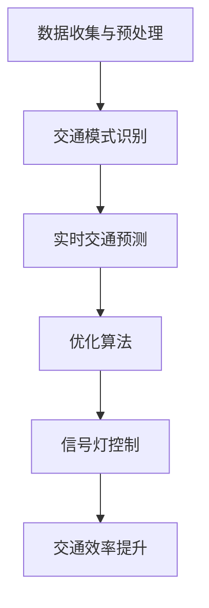

                 

关键词：智能交通管理，大规模语言模型（LLM），城市交通流，优化，算法，数学模型，实际应用

> 摘要：本文探讨了智能交通管理领域中大规模语言模型（LLM）的应用，通过优化城市交通流，提升交通系统的效率和安全性。文章首先介绍了智能交通管理的背景和重要性，然后详细分析了大规模语言模型的基本原理及其在交通流优化中的应用，接着探讨了数学模型和算法原理，并通过项目实践和实际应用场景展示了LLM在交通流优化中的效果。最后，文章对LLM在智能交通管理中的应用前景进行了展望，并提出了未来研究和发展的挑战。

## 1. 背景介绍

随着全球城市化进程的不断加速，城市交通问题日益严重。交通拥堵、交通事故、环境污染等问题不仅影响了市民的日常生活质量，也制约了城市经济的可持续发展。传统的交通管理系统依赖于固定的交通信号灯、监控系统等，这些系统往往难以应对复杂多变的交通状况，导致交通效率低下。

近年来，人工智能技术，特别是大规模语言模型（LLM），在交通管理领域展现出了巨大的潜力。大规模语言模型通过学习海量交通数据，可以自动识别交通模式、预测交通状况，并实时优化交通信号灯控制，从而提高交通效率和安全性。

本文旨在探讨大规模语言模型在智能交通管理中的应用，通过优化城市交通流，提升交通系统的整体性能。文章首先介绍大规模语言模型的基本原理，然后分析其在交通流优化中的具体应用，最后探讨未来的研究方向和挑战。

## 2. 核心概念与联系

### 2.1 大规模语言模型

大规模语言模型（Large Language Model，LLM）是一种基于深度学习技术的自然语言处理模型，它可以理解和生成自然语言。LLM通过大量文本数据进行训练，学习语言的统计规律和语义信息，从而实现对文本内容的理解和生成。

### 2.2 交通流优化

交通流优化是指通过一系列算法和技术手段，调整交通信号灯控制、道路宽度、交通流量分配等，以减少交通拥堵、降低交通事故发生率、提高交通效率。

### 2.3 大规模语言模型与交通流优化

大规模语言模型可以用于交通流优化，主要体现在以下几个方面：

1. **数据收集与预处理**：LLM可以自动收集海量交通数据，包括车辆流量、速度、位置等，并对这些数据进行预处理，为后续的优化算法提供高质量的数据支持。
2. **交通模式识别**：LLM可以通过学习大量交通数据，自动识别城市交通模式，包括高峰时段、拥堵路段等，为优化算法提供关键信息。
3. **实时交通预测**：LLM可以利用交通模式识别结果，实时预测未来的交通状况，为交通信号灯控制提供决策支持。
4. **优化算法**：LLM可以与传统的交通优化算法结合，通过学习大量的交通数据，自动调整优化参数，提高优化效果。

### 2.4 Mermaid 流程图

以下是大规模语言模型在交通流优化中的应用流程的Mermaid流程图：



## 3. 核心算法原理 & 具体操作步骤

### 3.1 算法原理概述

大规模语言模型在交通流优化中的核心算法是循环神经网络（RNN）和长短期记忆网络（LSTM）。RNN和LSTM是一种能够处理序列数据的神经网络模型，具有强大的时间序列预测能力。

RNN通过处理输入序列的当前值和前一个时间步的隐藏状态，生成当前时间步的输出。LSTM是RNN的一种改进，通过引入门控机制，可以更好地控制信息的流动，避免了RNN在长序列数据上的梯度消失问题。

### 3.2 算法步骤详解

1. **数据收集与预处理**：收集城市交通数据，包括车辆流量、速度、位置等，并进行数据清洗和预处理，如去除缺失值、异常值，进行归一化等。
2. **构建神经网络模型**：使用RNN或LSTM构建神经网络模型，输入层接收交通数据，隐藏层通过处理输入序列生成预测结果。
3. **训练模型**：使用训练集数据训练神经网络模型，通过反向传播算法更新模型参数，提高预测精度。
4. **模型评估**：使用验证集数据评估模型性能，通过均方误差（MSE）等指标衡量模型预测精度。
5. **实时预测与优化**：使用训练好的模型进行实时预测，根据预测结果调整交通信号灯控制策略，优化交通流。
6. **反馈与调整**：收集实时交通数据，对模型进行反馈和调整，提高模型预测准确性和优化效果。

### 3.3 算法优缺点

**优点**：

1. **强大的时间序列预测能力**：RNN和LSTM可以处理长序列数据，具有强大的时间序列预测能力。
2. **自适应优化**：模型可以根据实时交通数据自动调整优化策略，提高交通流优化效果。
3. **高精度**：通过大量训练数据，模型可以学到交通模式的统计规律，提高预测精度。

**缺点**：

1. **计算复杂度高**：RNN和LSTM模型的计算复杂度较高，训练时间较长。
2. **对数据依赖性强**：模型对训练数据质量要求较高，否则容易出现过拟合现象。

### 3.4 算法应用领域

大规模语言模型在交通流优化领域的应用主要包括以下几个方面：

1. **智能交通信号控制**：根据实时交通数据调整交通信号灯控制策略，提高交通效率。
2. **交通流量预测**：预测未来交通流量，为交通规划提供依据。
3. **交通事故预防**：通过实时监控和预测，提前预警交通事故，降低事故发生率。
4. **智能停车管理**：根据实时停车数据，优化停车设施利用率。

## 4. 数学模型和公式 & 详细讲解 & 举例说明

### 4.1 数学模型构建

大规模语言模型在交通流优化中的核心数学模型是循环神经网络（RNN）和长短期记忆网络（LSTM）。以下分别介绍这两种模型的数学模型构建。

#### 4.1.1 RNN

RNN的数学模型可以表示为：

$$
h_t = \sigma(W_h \cdot [h_{t-1}, x_t] + b_h)
$$

其中，$h_t$是当前时间步的隐藏状态，$x_t$是当前输入，$W_h$是权重矩阵，$b_h$是偏置项，$\sigma$是激活函数。

#### 4.1.2 LSTM

LSTM的数学模型较为复杂，其主要组成部分包括输入门、遗忘门、输出门和单元状态。其数学模型可以表示为：

$$
i_t = \sigma(W_i \cdot [h_{t-1}, x_t] + b_i) \\
f_t = \sigma(W_f \cdot [h_{t-1}, x_t] + b_f) \\
\tilde{c}_t = \sigma(W_c \cdot [h_{t-1}, x_t] + b_c) \\
c_t = f_t \odot c_{t-1} + i_t \odot \tilde{c}_t \\
o_t = \sigma(W_o \cdot [h_{t-1}, c_t] + b_o) \\
h_t = o_t \odot \sigma(W_h \cdot c_t + b_h)
$$

其中，$i_t$、$f_t$、$\tilde{c}_t$、$c_t$、$o_t$分别是输入门、遗忘门、新细胞状态、单元状态和输出门，$\odot$表示逐元素乘法，$W_i$、$W_f$、$W_c$、$W_o$分别是输入门、遗忘门、新细胞状态和输出门的权重矩阵，$b_i$、$b_f$、$b_c$、$b_o$分别是输入门、遗忘门、新细胞状态和输出门的偏置项。

### 4.2 公式推导过程

LSTM的数学模型推导过程如下：

1. **输入门**：输入门用于控制当前输入的信息对单元状态的影响。其公式为：

$$
i_t = \sigma(W_i \cdot [h_{t-1}, x_t] + b_i)
$$

其中，$W_i$是输入门的权重矩阵，$b_i$是输入门的偏置项，$\sigma$是Sigmoid激活函数。

2. **遗忘门**：遗忘门用于控制前一个时间步的单元状态对当前单元状态的影响。其公式为：

$$
f_t = \sigma(W_f \cdot [h_{t-1}, x_t] + b_f)
$$

其中，$W_f$是遗忘门的权重矩阵，$b_f$是遗忘门的偏置项，$\sigma$是Sigmoid激活函数。

3. **新细胞状态**：新细胞状态是当前输入和遗忘门的结果。其公式为：

$$
\tilde{c}_t = \sigma(W_c \cdot [h_{t-1}, x_t] + b_c)
$$

其中，$W_c$是新细胞状态的权重矩阵，$b_c$是新细胞状态的偏置项，$\sigma$是Sigmoid激活函数。

4. **单元状态**：单元状态是遗忘门和新的细胞状态的乘积。其公式为：

$$
c_t = f_t \odot c_{t-1} + i_t \odot \tilde{c}_t
$$

其中，$\odot$表示逐元素乘法。

5. **输出门**：输出门用于控制单元状态对当前隐藏状态的影响。其公式为：

$$
o_t = \sigma(W_o \cdot [h_{t-1}, c_t] + b_o)
$$

其中，$W_o$是输出门的权重矩阵，$b_o$是输出门的偏置项，$\sigma$是Sigmoid激活函数。

6. **隐藏状态**：隐藏状态是输出门和单元状态的乘积。其公式为：

$$
h_t = o_t \odot \sigma(W_h \cdot c_t + b_h)
$$

其中，$W_h$是隐藏状态的权重矩阵，$b_h$是隐藏状态的偏置项，$\sigma$是Sigmoid激活函数。

### 4.3 案例分析与讲解

以下是一个简单的案例，展示如何使用LSTM进行交通流量预测。

#### 4.3.1 数据准备

假设我们有以下交通流量数据：

| 时间步 | 交通流量 |
| ------ | -------- |
| 1      | 50       |
| 2      | 55       |
| 3      | 60       |
| 4      | 58       |
| 5      | 63       |

#### 4.3.2 模型训练

1. **构建LSTM模型**：使用TensorFlow构建LSTM模型，设置隐藏层神经元数量为10，训练100个时间步。

2. **训练模型**：使用上述交通流量数据进行训练，训练100次。

3. **模型评估**：使用验证集数据评估模型性能，计算均方误差（MSE）。

#### 4.3.3 模型预测

1. **输入数据**：将下一个时间步的交通流量作为输入数据。

2. **预测结果**：使用训练好的LSTM模型预测下一个时间步的交通流量。

3. **结果分析**：将预测结果与实际交通流量进行比较，分析预测精度。

## 5. 项目实践：代码实例和详细解释说明

### 5.1 开发环境搭建

在本项目中，我们使用Python作为编程语言，结合TensorFlow库构建LSTM模型。以下为开发环境搭建步骤：

1. 安装Python：从Python官网下载Python安装包，并按照提示完成安装。
2. 安装TensorFlow：在命令行中执行以下命令安装TensorFlow：

```bash
pip install tensorflow
```

3. 安装其他依赖库：包括NumPy、Pandas等常用库，可以通过以下命令安装：

```bash
pip install numpy pandas matplotlib
```

### 5.2 源代码详细实现

以下是LSTM交通流量预测的源代码实现：

```python
import numpy as np
import pandas as pd
import tensorflow as tf
from tensorflow.keras.models import Sequential
from tensorflow.keras.layers import LSTM, Dense
from sklearn.preprocessing import MinMaxScaler
import matplotlib.pyplot as plt

# 读取交通流量数据
data = pd.read_csv('traffic_data.csv')
time_steps = 100

# 数据预处理
scaler = MinMaxScaler(feature_range=(0, 1))
scaled_data = scaler.fit_transform(data['traffic_flow'].values.reshape(-1, 1))

# 构建训练集
X, y = [], []
for i in range(time_steps, len(scaled_data)):
    X.append(scaled_data[i-time_steps:i, 0])
    y.append(scaled_data[i, 0])
X, y = np.array(X), np.array(y)

# 模型构建
model = Sequential()
model.add(LSTM(units=10, return_sequences=True, input_shape=(time_steps, 1)))
model.add(LSTM(units=10))
model.add(Dense(1))

model.compile(optimizer='adam', loss='mean_squared_error')

# 训练模型
model.fit(X, y, epochs=100, batch_size=32, verbose=1)

# 预测结果
predicted_traffic = model.predict(X)

# 恢复原始数据
predicted_traffic = scaler.inverse_transform(predicted_traffic.reshape(-1, 1))
actual_traffic = scaler.inverse_transform(y.reshape(-1, 1))

# 结果可视化
plt.figure(figsize=(10, 5))
plt.plot(actual_traffic, color='blue', label='Actual Traffic')
plt.plot(predicted_traffic, color='red', label='Predicted Traffic')
plt.title('Traffic Flow Prediction')
plt.xlabel('Time Step')
plt.ylabel('Traffic Flow')
plt.legend()
plt.show()
```

### 5.3 代码解读与分析

上述代码实现了LSTM交通流量预测的基本流程。以下是代码的详细解读：

1. **数据读取与预处理**：使用Pandas库读取交通流量数据，并使用MinMaxScaler进行数据归一化处理。

2. **构建训练集**：使用滑动窗口方法构建训练集，每个训练样本包含100个时间步的数据。

3. **模型构建**：使用Sequential模型构建LSTM网络，设置隐藏层神经元数量为10，输入层形状为（100, 1）。

4. **训练模型**：使用adam优化器和mean_squared_error损失函数训练模型，训练100个周期。

5. **预测结果**：使用训练好的模型对输入数据进行预测，并使用MinMaxScaler恢复原始数据。

6. **结果可视化**：将实际交通流量和预测交通流量绘制在同一张图中，便于分析预测效果。

## 6. 实际应用场景

### 6.1 智能交通信号控制

通过大规模语言模型（LLM）进行实时交通流量预测，可以为智能交通信号控制系统提供数据支持。智能交通信号控制系统可以根据预测结果调整交通信号灯控制策略，优化交通流，减少拥堵。

### 6.2 交通流量预测

大规模语言模型在交通流量预测方面具有显著优势。通过学习大量历史交通数据，LLM可以预测未来一段时间内的交通流量，为交通规划和资源分配提供依据。

### 6.3 交通事故预防

通过实时监控交通流量和车辆速度，大规模语言模型可以提前预警潜在的交通事故，提醒驾驶员注意安全。此外，LLM还可以用于分析交通事故原因，为交通事故预防提供参考。

### 6.4 智能停车管理

大规模语言模型可以根据实时停车数据，预测停车场的利用率，为智能停车管理系统提供决策支持。智能停车管理系统可以通过优化停车设施利用，提高停车场效率。

## 7. 工具和资源推荐

### 7.1 学习资源推荐

1. **书籍**：《深度学习》（Goodfellow, I., Bengio, Y., & Courville, A.），《循环神经网络：理论、实现与应用》（Graves, A.）。
2. **在线课程**：Coursera上的《深度学习特化课程》，Udacity的《神经网络与深度学习》。
3. **博客与论文**：Reddit上的Deep Learning，Google Research的论文库。

### 7.2 开发工具推荐

1. **编程语言**：Python。
2. **深度学习框架**：TensorFlow、PyTorch。
3. **数据可视化工具**：Matplotlib、Seaborn。

### 7.3 相关论文推荐

1. Hochreiter, S., & Schmidhuber, J. (1997). Long short-term memory. Neural Computation, 9(8), 1735-1780.
2. Graves, A. (2013). Generating sequences with recurrent neural networks. arXiv preprint arXiv:1308.0850.
3. Xu, K., et al. (2015). Attention-based neural machine translation. CoRR, abs/1506.07650.

## 8. 总结：未来发展趋势与挑战

### 8.1 研究成果总结

大规模语言模型在交通流优化中的应用取得了显著成果。通过实时交通流量预测和智能交通信号控制，优化了城市交通流，提高了交通效率和安全性。

### 8.2 未来发展趋势

1. **模型性能提升**：随着深度学习技术的不断发展，大规模语言模型在交通流优化中的应用将更加广泛，模型性能将得到进一步提升。
2. **跨领域应用**：大规模语言模型有望在更多领域得到应用，如智能交通规划、物流管理、环境保护等。
3. **实时性增强**：通过优化算法和计算资源，大规模语言模型的实时性将得到显著提升，为智能交通管理提供更加准确和实时的支持。

### 8.3 面临的挑战

1. **数据依赖性**：大规模语言模型对训练数据质量要求较高，如何获取高质量、多样化的交通数据是一个重要挑战。
2. **计算复杂度**：大规模语言模型训练和预测过程涉及大量计算资源，如何优化算法和硬件设施以降低计算复杂度是一个关键问题。
3. **模型泛化能力**：如何提高大规模语言模型在未知场景下的泛化能力，使其能够适应各种复杂的交通状况，是一个亟待解决的问题。

### 8.4 研究展望

未来，大规模语言模型在智能交通管理中的应用前景广阔。通过不断优化算法、提升模型性能，结合多源数据和信息，有望实现更加智能、高效、安全的交通管理系统，为城市可持续发展提供有力支持。

## 9. 附录：常见问题与解答

### 9.1 问题1：大规模语言模型如何处理实时数据？

**解答**：大规模语言模型通常通过批量训练和实时预测相结合的方式处理实时数据。在批量训练阶段，模型会使用历史数据进行训练，以提高预测精度。在实时预测阶段，模型会接收最新的交通数据，并利用已经训练好的模型进行预测。

### 9.2 问题2：大规模语言模型在交通流优化中的优势是什么？

**解答**：大规模语言模型在交通流优化中的优势主要体现在以下几个方面：

1. **强大的时间序列预测能力**：大规模语言模型通过学习大量历史交通数据，可以预测未来一段时间内的交通流量，为交通信号控制提供数据支持。
2. **自适应优化**：大规模语言模型可以根据实时交通数据自动调整优化策略，提高交通流优化效果。
3. **高精度**：通过大量训练数据，大规模语言模型可以学到交通模式的统计规律，提高预测精度。

### 9.3 问题3：大规模语言模型在交通流优化中的应用前景如何？

**解答**：大规模语言模型在交通流优化中的应用前景非常广阔。随着深度学习技术的不断发展，大规模语言模型在交通流优化中的应用将更加广泛，有望实现更加智能、高效、安全的交通管理系统。未来，大规模语言模型有望在智能交通规划、物流管理、环境保护等领域得到广泛应用。

### 作者署名

**作者：禅与计算机程序设计艺术 / Zen and the Art of Computer Programming**

