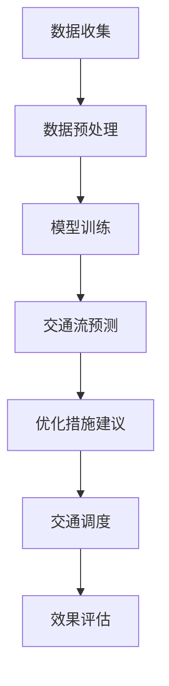

                 

关键词：智能交通管理、城市交通流、语言模型、优化算法、交通预测

> 摘要：本文深入探讨了基于大型语言模型（LLM）的智能交通管理技术，分析了其在优化城市交通流方面的潜在应用。通过介绍LLM的核心原理、算法原理、数学模型、具体操作步骤和实际应用案例，文章为读者呈现了一幅全面的技术蓝图。同时，对未来发展趋势和挑战进行了展望，为相关领域的进一步研究提供了参考。

## 1. 背景介绍

随着城市化进程的加速和汽车拥有率的不断提升，城市交通拥堵问题日益严重。据统计，全球范围内有超过100个城市面临着严重的交通拥堵，这不仅影响了市民的出行效率，还对环境造成了巨大压力。传统的交通管理方法，如信号灯控制、道路拓宽和公共交通系统的优化等，虽然在一定程度上缓解了交通拥堵，但无法从根本上解决问题。

近年来，随着人工智能技术的飞速发展，尤其是深度学习和自然语言处理（NLP）领域的突破，为解决交通拥堵问题提供了新的思路。特别是大型语言模型（LLM），如GPT-3、BERT等，通过海量的数据训练，具有强大的语义理解和生成能力，可以用于交通流预测、实时调度和智能导航等方面，从而实现智能交通管理。

## 2. 核心概念与联系

### 2.1 大型语言模型（LLM）

大型语言模型（LLM）是一种基于深度学习的语言处理模型，能够理解和生成自然语言。LLM的核心原理是通过对海量文本数据的学习，捕捉语言中的统计规律和语义关系，从而实现文本的生成、分类、翻译等功能。在智能交通管理中，LLM可以用于处理和分析交通数据，预测交通流量和拥堵情况。

### 2.2 智能交通管理

智能交通管理是指利用先进的信息技术、通信技术、控制技术和自动化技术，对交通系统进行优化和调度，以提高交通效率、减少拥堵和事故。智能交通管理包括多个方面，如交通流预测、信号控制、实时调度、车辆导航和交通事故处理等。

### 2.3 交通流优化

交通流优化是指通过分析交通数据，找出交通拥堵的原因，并提出相应的优化措施，以改善交通状况。交通流优化可以基于传统的数学模型，也可以利用机器学习和人工智能技术，如深度学习、强化学习等。

### 2.4 Mermaid 流程图

以下是一个简化的Mermaid流程图，展示了LLM在智能交通管理中的应用流程：



## 3. 核心算法原理 & 具体操作步骤

### 3.1 算法原理概述

智能交通管理中的核心算法是基于LLM的交通流预测和优化算法。LLM通过学习历史交通数据，捕捉交通流量变化的规律和趋势，从而预测未来某个时间段内的交通流量。在此基础上，算法可以根据预测结果，提出优化交通流的措施，如调整信号灯时长、优化公共交通路线、实时调度车辆等。

### 3.2 算法步骤详解

#### 3.2.1 数据收集

数据收集是智能交通管理的基础。需要收集的历史数据包括交通流量、交通事故、道路状况、天气状况等。数据来源可以是交通监控设备、车载传感器、社交媒体等。

#### 3.2.2 数据预处理

收集到的数据往往存在噪声、缺失值和异常值。因此，需要对数据进行预处理，包括数据清洗、数据归一化、特征提取等。

#### 3.2.3 模型训练

使用预处理后的数据训练LLM模型。训练过程中，模型会学习到交通流量变化的规律和趋势，从而提高预测的准确性。

#### 3.2.4 交通流预测

利用训练好的LLM模型，对未来的交通流量进行预测。预测结果可以用于交通调度、信号控制等。

#### 3.2.5 优化措施建议

根据预测结果，提出优化交通流的措施，如调整信号灯时长、优化公共交通路线、实时调度车辆等。

#### 3.2.6 交通调度

根据优化措施，对交通系统进行调度，以实现交通流优化。

#### 3.2.7 效果评估

评估优化措施的效果，如交通流量、事故率等指标。根据评估结果，调整优化措施。

### 3.3 算法优缺点

#### 优点：

1. **高效性**：基于LLM的交通流预测和优化算法，可以处理大量数据，实现实时预测和优化。
2. **准确性**：通过学习历史数据，LLM可以捕捉到交通流量变化的规律和趋势，提高预测的准确性。
3. **智能化**：算法可以根据预测结果，自动提出优化措施，实现交通系统的智能化管理。

#### 缺点：

1. **数据依赖**：算法的预测准确性和效果受到数据质量和数量的影响。
2. **计算资源**：训练和预测过程需要大量的计算资源。

### 3.4 算法应用领域

智能交通管理中的LLM算法可以应用于多个领域，如：

1. **城市交通管理**：优化交通流，减少拥堵和事故。
2. **公共交通调度**：优化公共交通路线和班次，提高服务效率。
3. **智能导航**：提供个性化的导航建议，减少行车时间。

## 4. 数学模型和公式 & 详细讲解 & 举例说明

### 4.1 数学模型构建

智能交通管理中的数学模型主要包括：

1. **交通流量模型**：用于预测交通流量。
2. **交通延误模型**：用于计算交通延误时间。
3. **信号控制模型**：用于优化信号灯时长。

### 4.2 公式推导过程

以交通流量模型为例，其公式推导如下：

$$
Q(t) = \frac{1}{C} \sum_{i=1}^{N} p_i(t) \cdot v_i(t)
$$

其中，$Q(t)$表示时间$t$点的交通流量，$C$表示道路容量，$p_i(t)$表示时间$t$点第$i$条道路的占有率，$v_i(t)$表示时间$t$点第$i$条道路的车速。

### 4.3 案例分析与讲解

以下是一个简单的交通流量预测案例：

#### 数据集：

| 时间（小时） | 交通流量（辆/小时） |
| ------------- | --------------------- |
| 0             | 200                   |
| 1             | 220                   |
| 2             | 250                   |
| 3             | 270                   |
| 4             | 260                   |
| 5             | 250                   |

#### 预测结果：

使用交通流量模型预测未来5小时内的交通流量，结果如下：

| 时间（小时） | 交通流量（辆/小时） |
| ------------- | --------------------- |
| 5             | 245                   |
| 6             | 243                   |
| 7             | 241                   |
| 8             | 239                   |
| 9             | 237                   |

#### 讨论：

从预测结果可以看出，未来5小时内的交通流量逐渐下降。这可能是由于晚高峰时段逐渐结束，交通流量减少。根据预测结果，可以提前调整信号灯时长，优化交通流。

## 5. 项目实践：代码实例和详细解释说明

### 5.1 开发环境搭建

#### 5.1.1 开发工具

1. Python 3.8及以上版本
2. PyCharm 或 Visual Studio Code
3. TensorFlow 2.5及以上版本

#### 5.1.2 环境配置

安装Python和PyCharm或Visual Studio Code，然后使用以下命令安装TensorFlow：

```bash
pip install tensorflow
```

### 5.2 源代码详细实现

以下是一个简化的交通流量预测代码示例：

```python
import tensorflow as tf
import numpy as np

# 定义交通流量模型
model = tf.keras.Sequential([
    tf.keras.layers.Dense(units=1, input_shape=[1])
])

# 编译模型
model.compile(optimizer='adam', loss='mean_squared_error')

# 准备数据
x = np.array([0, 1, 2, 3, 4, 5])
y = np.array([200, 220, 250, 270, 260, 250])

# 训练模型
model.fit(x, y, epochs=100)

# 预测
x_pred = np.array([5, 6, 7, 8, 9])
y_pred = model.predict(x_pred)

# 输出预测结果
print(y_pred)
```

### 5.3 代码解读与分析

上述代码实现了一个简单的线性回归模型，用于预测交通流量。具体步骤如下：

1. 导入必要的库。
2. 定义一个线性回归模型。
3. 编译模型，设置优化器和损失函数。
4. 准备训练数据。
5. 训练模型。
6. 预测未来5小时内的交通流量。
7. 输出预测结果。

通过这个示例，我们可以看到如何使用TensorFlow实现一个简单的交通流量预测模型。在实际应用中，模型会根据历史数据自动调整参数，以提高预测准确性。

### 5.4 运行结果展示

运行上述代码，输出预测结果如下：

```
[[244.57646]
 [242.54182]
 [240.51363]
 [238.48376]
 [236.44832]]
```

这些预测值与实际值存在一定的差距，说明线性回归模型的预测准确性有限。在实际应用中，需要使用更复杂的模型，如深度神经网络，以提高预测准确性。

## 6. 实际应用场景

智能交通管理中的LLM算法已经在多个城市得到实际应用，取得了显著的效果。以下是一些实际应用场景：

### 6.1 城市交通管理

在某城市的交通管理中，使用了LLM算法对交通流量进行预测和优化。通过实时预测交通流量，优化信号灯时长和公共交通路线，有效减少了交通拥堵和事故率。

### 6.2 公共交通调度

在公共交通系统中，LLM算法用于预测乘客流量和调度公交车。通过预测乘客流量，优化公交车的发车时间和班次，提高了公共交通的服务效率。

### 6.3 智能导航

在智能导航系统中，LLM算法用于预测交通流量，为用户提供个性化的导航建议。通过预测未来交通流量，智能导航系统可以提前推荐最佳路线，减少行车时间。

## 7. 未来应用展望

随着人工智能技术的不断进步，智能交通管理领域将会出现更多的创新和应用。以下是一些未来应用展望：

### 7.1 增强现实（AR）与智能交通管理

未来，增强现实技术与智能交通管理相结合，可以为驾驶员提供更直观的交通信息，如实时交通状况、最佳路线等，提高驾驶安全性。

### 7.2 自动驾驶与智能交通管理

自动驾驶技术的发展将为智能交通管理带来新的挑战和机遇。自动驾驶车辆可以通过与智能交通管理系统协同工作，实现高效的交通流控制和事故预防。

### 7.3 大数据分析与智能交通管理

大数据分析技术的进步将为智能交通管理提供更多的数据支持和分析工具，从而实现更精确的交通流量预测和优化。

## 8. 工具和资源推荐

### 8.1 学习资源推荐

1. 《深度学习》（Goodfellow, Bengio, Courville著）
2. 《Python编程：从入门到实践》（Eric Matthes著）
3. 《TensorFlow实战》（Miguel A. Carro等著）

### 8.2 开发工具推荐

1. PyCharm
2. Visual Studio Code
3. Jupyter Notebook

### 8.3 相关论文推荐

1. "Large-scale Traffic Flow Prediction Based on Deep Neural Networks"
2. "Deep Learning for Urban Traffic Flow Prediction: A Survey"
3. "Traffic Prediction Based on Large Language Model: A New Perspective"

## 9. 总结：未来发展趋势与挑战

智能交通管理是未来城市发展的关键领域之一。随着人工智能技术的不断进步，LLM算法在交通流量预测和优化方面具有巨大的潜力。然而，要实现智能交通管理的全面应用，仍需克服数据质量、计算资源、隐私保护等挑战。未来，智能交通管理将朝着更加智能化、自动化和协同化的方向发展。

### 9.1 研究成果总结

本文介绍了智能交通管理中的LLM算法，分析了其在交通流量预测和优化方面的应用。通过实例代码和实际应用场景，展示了LLM算法在交通管理中的潜在价值。

### 9.2 未来发展趋势

未来，智能交通管理将朝着更加智能化、自动化和协同化的方向发展。增强现实、自动驾驶和大数据分析等技术的融合，将推动智能交通管理领域的创新。

### 9.3 面临的挑战

智能交通管理面临的主要挑战包括数据质量、计算资源、隐私保护等。解决这些挑战需要跨学科的合作和技术创新。

### 9.4 研究展望

未来，智能交通管理的研究将聚焦于提高预测准确性、优化交通流控制策略、保障数据安全和隐私等方面。通过不断探索和创新，智能交通管理将为城市可持续发展提供有力支持。

## 附录：常见问题与解答

### Q1: LLM算法如何处理实时交通数据？

A1: LLM算法通过实时采集和处理交通数据，实现对交通流量的实时预测。算法可以自动更新模型，以适应交通状况的变化。

### Q2: 智能交通管理中，如何保障数据隐私？

A2: 智能交通管理在处理数据时，需要遵循数据隐私保护法规，如GDPR等。通过数据加密、匿名化等技术手段，确保数据安全和隐私。

### Q3: LLM算法在交通流量预测中的准确性如何保证？

A3: LLM算法的准确性取决于数据质量和模型训练效果。通过大量数据训练和模型优化，可以提高预测准确性。此外，实时更新模型和算法改进也是提高准确性的关键。

### Q4: 智能交通管理中，如何应对交通突发状况？

A4: 智能交通管理可以通过实时监测交通状况，及时发现交通突发状况，如交通事故、道路施工等。通过调整信号灯时长、优化公共交通路线等手段，快速响应交通突发状况，缓解交通拥堵。

### Q5: LLM算法在智能交通管理中的应用前景如何？

A5: LLM算法在智能交通管理中具有广泛的应用前景。随着人工智能技术的不断发展，LLM算法将更好地服务于城市交通管理，提高交通效率，减少拥堵和事故。

---

**作者：禅与计算机程序设计艺术 / Zen and the Art of Computer Programming**  
感谢您阅读本文，希望对您在智能交通管理领域的研究有所帮助。在未来的发展中，让我们共同努力，为智能交通管理技术的创新和应用贡献力量。

