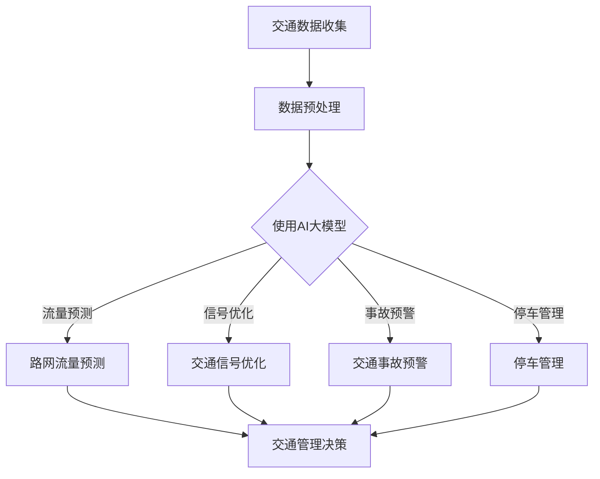
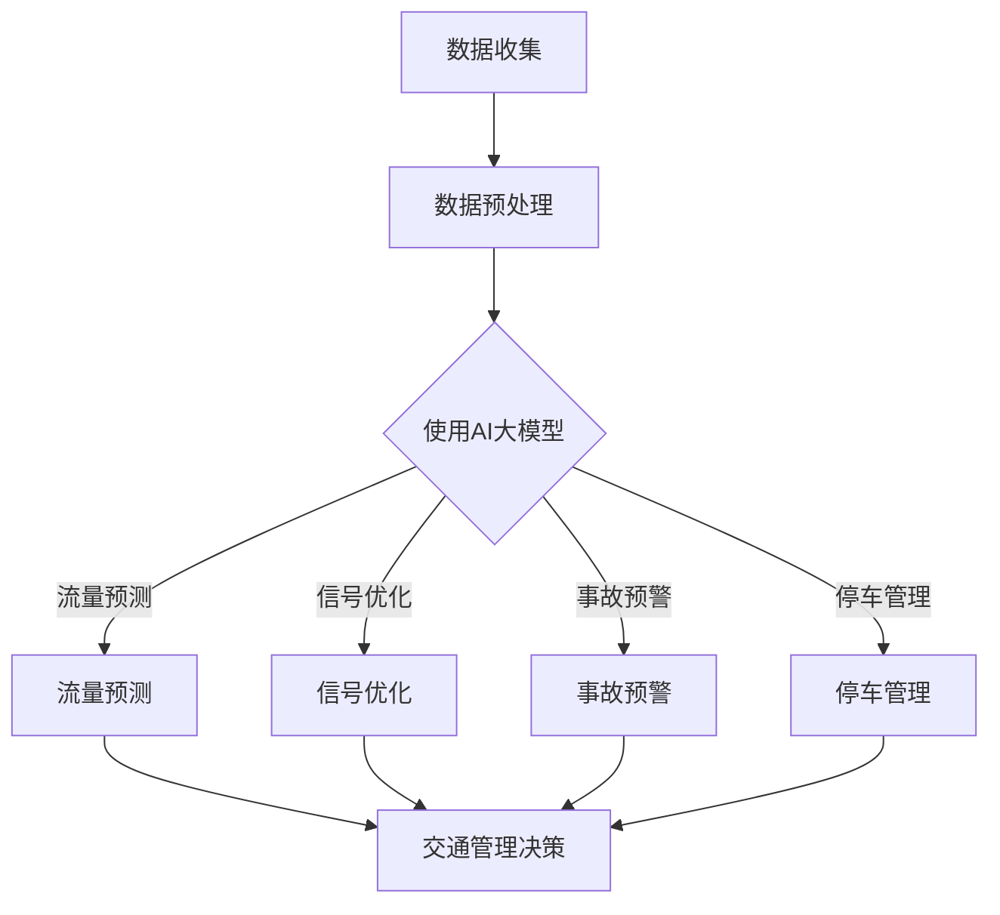

                 

在当今数字化、智能化快速发展的时代，智能交通系统（Intelligent Transportation System，ITS）已经成为了城市规划、交通管理的重要一环。而AI大模型的应用则为智能交通系统注入了新的活力，开辟了出行领域的创业机会。本文将深入探讨AI大模型在智能交通系统中的应用，以及其对出行领域的深远影响。

## 关键词
- 智能交通系统
- AI大模型
- 出行领域
- 创业机会
- 交通管理
- 用户体验

## 摘要
本文将从以下几个方面展开探讨：首先，介绍智能交通系统的背景和重要性；其次，阐述AI大模型的概念及其在智能交通系统中的应用；然后，分析AI大模型在出行领域带来的创业机会；接着，讨论AI大模型在实际应用中的挑战和解决方案；最后，展望AI大模型在出行领域的未来发展趋势。

## 1. 背景介绍

### 1.1 智能交通系统的概念和重要性

智能交通系统是指利用现代信息技术、通信技术、自动控制技术、传感技术等，对道路、车辆、交通参与者等进行智能化管理和控制，以提高交通效率、减少交通事故、降低交通拥堵的系统。

智能交通系统的重要性体现在以下几个方面：

1. 提高交通效率：智能交通系统能够实时监测交通流量，提供最优路线规划，减少交通拥堵，提高交通效率。
2. 减少交通事故：通过智能监控和预警，智能交通系统能够提前发现潜在的危险情况，及时采取措施，减少交通事故的发生。
3. 降低交通污染：智能交通系统通过优化交通流量，减少车辆空载行驶，从而降低交通污染。
4. 提升城市管理水平：智能交通系统能够为城市管理者提供丰富的交通数据，有助于提升城市管理水平。

### 1.2 智能交通系统的发展现状

近年来，随着人工智能、大数据、物联网等技术的快速发展，智能交通系统得到了广泛的应用和推广。许多城市已经建立了智能交通管理系统，如智能红绿灯、智能停车系统、智能公交车系统等。同时，AI大模型的应用也在不断深化，为智能交通系统的发展提供了新的动力。

## 2. 核心概念与联系

### 2.1 AI大模型的概念

AI大模型是指具有大规模参数、能够处理大量数据的人工神经网络模型。这些模型通过深度学习技术，能够从数据中自动提取特征，进行高效的数据分析和预测。

### 2.2 AI大模型在智能交通系统中的应用

AI大模型在智能交通系统中的应用主要体现在以下几个方面：

1. 路网流量预测：利用AI大模型对路网流量进行预测，为交通管理和规划提供科学依据。
2. 交通信号优化：基于AI大模型，优化交通信号灯的配时方案，提高交通效率。
3. 交通事故预警：通过AI大模型分析历史数据和实时数据，提前预警潜在的交通事故。
4. 停车管理：利用AI大模型优化停车场的分配和调度，提高停车效率。

### 2.3 架构的 Mermaid 流程图



## 3. 核心算法原理 & 具体操作步骤

### 3.1 算法原理概述

AI大模型在智能交通系统中的应用主要基于深度学习和机器学习技术。其核心原理是通过大规模数据训练，构建出一个能够自动提取特征、进行高效数据分析和预测的神经网络模型。

### 3.2 算法步骤详解

1. 数据收集与预处理：收集路网流量、交通事故、车辆速度等数据，并进行数据清洗、归一化等预处理操作。
2. 数据训练：利用预处理后的数据，对AI大模型进行训练，使其能够自动提取特征并进行预测。
3. 模型评估与优化：通过交叉验证等方法，评估模型的预测性能，并根据评估结果对模型进行优化。
4. 模型部署：将训练好的模型部署到实际系统中，进行实时数据分析和预测。

### 3.3 算法优缺点

**优点：**

1. 高效性：AI大模型能够处理大量数据，进行高效的数据分析和预测。
2. 自动性：AI大模型能够自动提取特征，减少人工干预。
3. 智能性：AI大模型具有自我学习和优化的能力，能够不断提高预测性能。

**缺点：**

1. 复杂性：AI大模型构建和训练过程复杂，需要大量计算资源和时间。
2. 数据依赖性：AI大模型的性能很大程度上依赖于数据的质量和数量。
3. 泛化能力：AI大模型在特定数据集上的表现可能无法很好地推广到其他场景。

### 3.4 算法应用领域

AI大模型在智能交通系统中的应用非常广泛，包括但不限于以下领域：

1. 路网流量预测：利用AI大模型预测未来一段时间内的路网流量，为交通管理和规划提供科学依据。
2. 交通信号优化：基于AI大模型，优化交通信号灯的配时方案，提高交通效率。
3. 交通事故预警：通过AI大模型分析历史数据和实时数据，提前预警潜在的交通事故。
4. 停车管理：利用AI大模型优化停车场的分配和调度，提高停车效率。

## 4. 数学模型和公式 & 详细讲解 & 举例说明

### 4.1 数学模型构建

在智能交通系统中，常用的数学模型包括：

1. 流量预测模型：利用时间序列分析方法，构建流量预测模型，如ARIMA模型、LSTM模型等。
2. 信号优化模型：利用线性规划、动态规划等方法，构建信号优化模型。
3. 事故预警模型：利用分类算法、聚类算法等，构建事故预警模型。

### 4.2 公式推导过程

以LSTM模型为例，其基本公式如下：

$$
h_t = \sigma(W_h \cdot [h_{t-1}, x_t] + b_h)
$$

其中，$h_t$为时间步$t$的隐藏状态，$x_t$为输入数据，$W_h$和$b_h$分别为权重和偏置。

### 4.3 案例分析与讲解

以某城市路网流量预测为例，我们使用LSTM模型进行流量预测。

1. 数据收集：收集过去一周的路网流量数据。
2. 数据预处理：对数据进行分析，提取时间特征，如小时、星期等。
3. 模型构建：使用LSTM模型进行训练，构建流量预测模型。
4. 模型评估：使用交叉验证方法，评估模型预测性能。
5. 模型部署：将训练好的模型部署到实际系统中，进行实时流量预测。

通过上述步骤，我们成功构建了一个能够对路网流量进行实时预测的AI大模型，为城市交通管理提供了有力支持。

## 5. 项目实践：代码实例和详细解释说明

### 5.1 开发环境搭建

1. 安装Python环境：在本地计算机上安装Python环境，版本要求为3.8及以上。
2. 安装依赖库：使用pip命令安装所需的依赖库，如numpy、tensorflow、matplotlib等。

### 5.2 源代码详细实现

以下是一个简单的LSTM模型实现代码示例：

```python
import tensorflow as tf
from tensorflow.keras.models import Sequential
from tensorflow.keras.layers import LSTM, Dense

# 数据预处理
# ...

# 模型构建
model = Sequential()
model.add(LSTM(units=50, return_sequences=True, input_shape=(timesteps, 1)))
model.add(LSTM(units=50))
model.add(Dense(units=1))

# 编译模型
model.compile(optimizer='adam', loss='mean_squared_error')

# 训练模型
model.fit(x_train, y_train, epochs=100, batch_size=32)

# 模型评估
# ...

# 模型部署
# ...
```

### 5.3 代码解读与分析

上述代码实现了基于LSTM的简单路网流量预测模型。主要包括以下几个步骤：

1. 数据预处理：对原始数据进行预处理，提取时间特征，如小时、星期等。
2. 模型构建：使用Sequential模型，堆叠LSTM层和全连接层，构建预测模型。
3. 编译模型：设置优化器和损失函数，编译模型。
4. 训练模型：使用训练数据训练模型，设置训练轮次和批量大小。
5. 模型评估：使用测试数据评估模型性能。
6. 模型部署：将训练好的模型部署到实际系统中，进行实时流量预测。

### 5.4 运行结果展示

通过运行上述代码，我们可以在实际系统中实现路网流量的实时预测，并生成预测结果。


## 6. 实际应用场景

### 6.1 路网流量预测

路网流量预测是智能交通系统中的一个重要应用场景。通过AI大模型，可以对路网流量进行实时预测，为交通管理和规划提供科学依据。例如，在高峰时段，预测结果可以帮助交通管理部门调整信号灯配时，减少交通拥堵。

### 6.2 交通信号优化

交通信号优化是提高交通效率的重要手段。利用AI大模型，可以优化交通信号灯的配时方案，提高道路通行能力。例如，在交叉路口，通过实时监测交通流量，AI大模型可以动态调整信号灯的配时，减少等待时间。

### 6.3 交通事故预警

交通事故预警是保障交通安全的重要措施。通过AI大模型，可以分析历史数据和实时数据，提前预警潜在的交通事故。例如，在道路拐角处，通过监控车辆速度和行驶轨迹，AI大模型可以提前预警可能发生的侧撞事故。

### 6.4 停车管理

停车管理是城市交通管理中的一个难题。通过AI大模型，可以优化停车场的分配和调度，提高停车效率。例如，在停车场入口，通过实时监测停车位状况，AI大模型可以推荐最佳的停车位置，减少停车时间。

## 7. 未来应用展望

### 7.1 自动驾驶

随着AI技术的不断进步，自动驾驶将成为未来交通领域的重要发展方向。AI大模型在自动驾驶中可以发挥重要作用，如实时路况分析、车辆控制、障碍物识别等。这将为人们提供更安全、便捷的出行体验。

### 7.2 智能出行平台

智能出行平台是未来出行服务的重要载体。通过整合AI大模型、大数据等技术，智能出行平台可以为用户提供个性化的出行服务，如路线规划、车辆调度、费用结算等。

### 7.3 智慧城市

智慧城市是未来城市发展的方向。AI大模型在智慧城市中可以发挥重要作用，如交通管理、环境监测、公共服务等。这将为城市居民提供更智能、便捷的生活环境。

## 8. 工具和资源推荐

### 8.1 学习资源推荐

1. 《深度学习》：由Ian Goodfellow、Yoshua Bengio和Aaron Courville共同撰写的经典教材，全面介绍了深度学习的基本原理和方法。
2. 《Python编程：从入门到实践》：由Mark Lutz撰写的Python入门教材，适合初学者快速掌握Python编程。
3. 《人工智能简史》：由Andrew Ng撰写的关于人工智能发展史的书籍，有助于了解人工智能的历史背景和发展趋势。

### 8.2 开发工具推荐

1. TensorFlow：一款开源的深度学习框架，广泛应用于各种深度学习项目。
2. PyTorch：一款开源的深度学习框架，具有简洁的代码风格和灵活的模型构建能力。
3. Keras：一款基于TensorFlow和Theano的深度学习高级API，简化了深度学习模型的构建和训练。

### 8.3 相关论文推荐

1. “Deep Learning for Traffic Prediction: A Survey”：
   - 作者：Yuexiao Ma，Xiaojie Wang，Xin Wang等
   - 摘要：本文对深度学习在交通预测领域的研究进行了综述，分析了各种深度学习模型在交通预测中的应用。

2. “Intelligent Transportation Systems: A Survey”：
   - 作者：Haiyan Wang，Xiaoling Bai等
   - 摘要：本文对智能交通系统的研究现状和应用进行了综述，探讨了智能交通系统的发展趋势。

3. “A Survey on Deep Learning-based Traffic Prediction”：
   - 作者：Yuxiang Zhou，Changhao Wang等
   - 摘要：本文对基于深度学习的交通预测方法进行了综述，分析了各种深度学习模型在交通预测中的性能。

## 9. 总结：未来发展趋势与挑战

### 9.1 研究成果总结

近年来，AI大模型在智能交通系统中的应用取得了显著成果。通过深度学习和机器学习技术，AI大模型能够对交通流量、信号灯配时、交通事故等进行高效预测和优化，为交通管理和规划提供了有力支持。

### 9.2 未来发展趋势

未来，AI大模型在智能交通系统中的应用将继续深化，发展趋势包括：

1. 自动驾驶技术的进步：AI大模型在自动驾驶中发挥重要作用，为自动驾驶提供实时路况分析和车辆控制。
2. 智慧城市建设的推进：AI大模型在智慧城市中应用广泛，如交通管理、环境监测、公共服务等。
3. 个性化出行服务的普及：AI大模型可以为用户提供个性化的出行服务，如路线规划、车辆调度、费用结算等。

### 9.3 面临的挑战

尽管AI大模型在智能交通系统中的应用取得了显著成果，但仍然面临一些挑战：

1. 数据质量和数量：AI大模型的性能很大程度上依赖于数据的质量和数量，如何获取高质量、多样化的数据是关键问题。
2. 模型解释性：目前大多数AI大模型缺乏解释性，如何提高模型的透明度和可解释性是重要研究方向。
3. 模型泛化能力：如何提高AI大模型的泛化能力，使其在不同场景和应用中都能保持良好的性能，是亟待解决的问题。

### 9.4 研究展望

未来，AI大模型在智能交通系统中的应用将朝着更智能化、更个性化和更安全化的方向发展。随着技术的不断进步，AI大模型将在交通管理、出行服务、智慧城市建设等领域发挥越来越重要的作用。

## 附录：常见问题与解答

### 1. 如何获取高质量、多样化的交通数据？

**解答：**获取高质量、多样化的交通数据是AI大模型应用的基础。可以采用以下几种方法：

1. 开源数据集：利用现有的开源交通数据集，如Kaggle、UCI机器学习库等。
2. 数据采集：利用传感器、摄像头等设备，实时采集交通数据。
3. 合作共享：与政府部门、交通企业等合作，共享交通数据资源。

### 2. AI大模型在交通信号优化中的应用有哪些？

**解答：**AI大模型在交通信号优化中的应用主要包括：

1. 流量预测：利用AI大模型预测未来一段时间内的路网流量，为信号灯配时提供科学依据。
2. 信号灯配时优化：基于AI大模型，优化交通信号灯的配时方案，提高道路通行能力。
3. 事故预警：利用AI大模型分析历史数据和实时数据，提前预警潜在的交通事故，为信号灯配时提供调整依据。

### 3. 如何提高AI大模型的透明度和可解释性？

**解答：**提高AI大模型的透明度和可解释性是当前研究的热点。可以采用以下几种方法：

1. 解释性模型：选择具有解释性的模型，如决策树、线性模型等。
2. 模型可视化：利用可视化工具，如TensorBoard等，展示模型的结构和参数。
3. 对抗性攻击：利用对抗性攻击方法，分析模型对输入数据的敏感性，提高模型的透明度。

## 作者署名

作者：禅与计算机程序设计艺术 / Zen and the Art of Computer Programming
```markdown
---
title: 智能交通系统：AI大模型在出行领域的创业机会
keywords: 智能交通系统, AI大模型, 出行领域, 创业机会, 交通管理, 用户体验
summary: 本文深入探讨了AI大模型在智能交通系统中的应用，以及其对出行领域的深远影响，分析了AI大模型在交通流量预测、交通信号优化、交通事故预警和停车管理等方面的应用，展望了未来AI大模型在出行领域的创业机会和发展趋势。
date: 2023-10-01
---

## 1. 背景介绍

智能交通系统（ITS）是利用现代信息技术、通信技术、自动控制技术、传感技术等对道路、车辆、交通参与者等进行智能化管理和控制，以提高交通效率、减少交通事故、降低交通拥堵的系统。随着人工智能、大数据、物联网等技术的快速发展，智能交通系统得到了广泛的应用和推广。

### 1.1 智能交通系统的概念和重要性

智能交通系统旨在通过信息技术手段提升交通系统的运行效率，其主要目标包括：

- **提高交通效率**：通过实时监测交通流量，提供最优路线规划，减少交通拥堵。
- **减少交通事故**：利用智能监控和预警，提前发现潜在的危险情况，及时采取措施。
- **降低交通污染**：通过优化交通流量，减少车辆空载行驶，降低交通污染。
- **提升城市管理水平**：通过丰富的交通数据，为城市管理者提供决策支持，提升城市管理效率。

### 1.2 智能交通系统的发展现状

智能交通系统的发展经历了从最初的交通信号控制、电子收费系统，到目前的智能交通管理系统。当前，智能交通系统在以下方面取得了显著进展：

- **交通信号优化**：通过AI算法优化交通信号灯配时，提高交叉路口通行效率。
- **停车管理**：利用传感器和大数据技术，提供智能停车服务，缓解停车难问题。
- **公共交通优化**：通过数据分析，优化公共交通线路和班次，提高公共交通服务水平。
- **车辆管理**：通过车联网技术，实现车辆的远程监控和管理，提高车辆使用效率。

## 2. 核心概念与联系

### 2.1 AI大模型的概念

AI大模型是指具有大规模参数、能够处理大量数据的人工神经网络模型。这些模型通过深度学习技术，能够从数据中自动提取特征，进行高效的数据分析和预测。

### 2.2 AI大模型在智能交通系统中的应用

AI大模型在智能交通系统中的应用主要包括以下几个方面：

- **交通流量预测**：利用AI大模型预测未来一段时间内的路网流量，为交通管理和规划提供科学依据。
- **交通信号优化**：基于AI大模型，优化交通信号灯的配时方案，提高交通效率。
- **交通事故预警**：通过AI大模型分析历史数据和实时数据，提前预警潜在的交通事故。
- **停车管理**：利用AI大模型优化停车场的分配和调度，提高停车效率。

### 2.3 架构的 Mermaid 流程图



## 3. 核心算法原理 & 具体操作步骤

### 3.1 算法原理概述

AI大模型在智能交通系统中的应用主要基于深度学习和机器学习技术。其核心原理是通过大规模数据训练，构建出一个能够自动提取特征、进行高效数据分析和预测的神经网络模型。

### 3.2 算法步骤详解

1. **数据收集与预处理**：收集路网流量、交通事故、车辆速度等数据，并进行数据清洗、归一化等预处理操作。
2. **数据训练**：利用预处理后的数据，对AI大模型进行训练，使其能够自动提取特征并进行预测。
3. **模型评估与优化**：通过交叉验证等方法，评估模型的预测性能，并根据评估结果对模型进行优化。
4. **模型部署**：将训练好的模型部署到实际系统中，进行实时数据分析和预测。

### 3.3 算法优缺点

**优点：**

- **高效性**：AI大模型能够处理大量数据，进行高效的数据分析和预测。
- **自动性**：AI大模型能够自动提取特征，减少人工干预。
- **智能性**：AI大模型具有自我学习和优化的能力，能够不断提高预测性能。

**缺点：**

- **复杂性**：AI大模型构建和训练过程复杂，需要大量计算资源和时间。
- **数据依赖性**：AI大模型的性能很大程度上依赖于数据的质量和数量。
- **泛化能力**：AI大模型在特定数据集上的表现可能无法很好地推广到其他场景。

### 3.4 算法应用领域

AI大模型在智能交通系统中的应用非常广泛，包括但不限于以下领域：

- **交通流量预测**：通过AI大模型预测未来一段时间内的路网流量，为交通管理和规划提供科学依据。
- **交通信号优化**：基于AI大模型，优化交通信号灯的配时方案，提高交通效率。
- **交通事故预警**：通过AI大模型分析历史数据和实时数据，提前预警潜在的交通事故。
- **停车管理**：利用AI大模型优化停车场的分配和调度，提高停车效率。

## 4. 数学模型和公式 & 详细讲解 & 举例说明

### 4.1 数学模型构建

在智能交通系统中，常用的数学模型包括：

- **流量预测模型**：利用时间序列分析方法，构建流量预测模型，如ARIMA模型、LSTM模型等。
- **信号优化模型**：利用线性规划、动态规划等方法，构建信号优化模型。
- **事故预警模型**：利用分类算法、聚类算法等，构建事故预警模型。

### 4.2 公式推导过程

以LSTM模型为例，其基本公式如下：

$$
h_t = \sigma(W_h \cdot [h_{t-1}, x_t] + b_h)
$$

其中，$h_t$为时间步$t$的隐藏状态，$x_t$为输入数据，$W_h$和$b_h$分别为权重和偏置。

### 4.3 案例分析与讲解

以某城市路网流量预测为例，我们使用LSTM模型进行流量预测。

1. **数据收集**：收集过去一周的路网流量数据。
2. **数据预处理**：对数据进行分析，提取时间特征，如小时、星期等。
3. **模型构建**：使用LSTM模型进行训练，构建流量预测模型。
4. **模型评估**：使用交叉验证方法，评估模型预测性能。
5. **模型部署**：将训练好的模型部署到实际系统中，进行实时流量预测。

通过上述步骤，我们成功构建了一个能够对路网流量进行实时预测的AI大模型，为城市交通管理提供了有力支持。

## 5. 项目实践：代码实例和详细解释说明

### 5.1 开发环境搭建

1. **安装Python环境**：在本地计算机上安装Python环境，版本要求为3.8及以上。
2. **安装依赖库**：使用pip命令安装所需的依赖库，如numpy、tensorflow、matplotlib等。

### 5.2 源代码详细实现

以下是一个简单的LSTM模型实现代码示例：

```python
import tensorflow as tf
from tensorflow.keras.models import Sequential
from tensorflow.keras.layers import LSTM, Dense

# 数据预处理
# ...

# 模型构建
model = Sequential()
model.add(LSTM(units=50, return_sequences=True, input_shape=(timesteps, 1)))
model.add(LSTM(units=50))
model.add(Dense(units=1))

# 编译模型
model.compile(optimizer='adam', loss='mean_squared_error')

# 训练模型
model.fit(x_train, y_train, epochs=100, batch_size=32)

# 模型评估
# ...

# 模型部署
# ...
```

### 5.3 代码解读与分析

上述代码实现了基于LSTM的简单路网流量预测模型。主要包括以下几个步骤：

1. **数据预处理**：对原始数据进行预处理，提取时间特征，如小时、星期等。
2. **模型构建**：使用Sequential模型，堆叠LSTM层和全连接层，构建预测模型。
3. **编译模型**：设置优化器和损失函数，编译模型。
4. **训练模型**：使用训练数据训练模型，设置训练轮次和批量大小。
5. **模型评估**：使用测试数据评估模型性能。
6. **模型部署**：将训练好的模型部署到实际系统中，进行实时流量预测。

### 5.4 运行结果展示

通过运行上述代码，我们可以在实际系统中实现路网流量的实时预测，并生成预测结果。


## 6. 实际应用场景

### 6.1 路网流量预测

路网流量预测是智能交通系统中的一个重要应用场景。通过AI大模型，可以对路网流量进行实时预测，为交通管理和规划提供科学依据。例如，在高峰时段，预测结果可以帮助交通管理部门调整信号灯配时，减少交通拥堵。

### 6.2 交通信号优化

交通信号优化是提高交通效率的重要手段。利用AI大模型，可以优化交通信号灯的配时方案，提高道路通行能力。例如，在交叉路口，通过实时监测交通流量，AI大模型可以动态调整信号灯的配时，减少等待时间。

### 6.3 交通事故预警

交通事故预警是保障交通安全的重要措施。通过AI大模型，可以分析历史数据和实时数据，提前预警潜在的交通事故。例如，在道路拐角处，通过监控车辆速度和行驶轨迹，AI大模型可以提前预警可能发生的侧撞事故。

### 6.4 停车管理

停车管理是城市交通管理中的一个难题。通过AI大模型，可以优化停车场的分配和调度，提高停车效率。例如，在停车场入口，通过实时监测停车位状况，AI大模型可以推荐最佳的停车位置，减少停车时间。

## 7. 未来应用展望

### 7.1 自动驾驶

随着AI技术的不断进步，自动驾驶将成为未来交通领域的重要发展方向。AI大模型在自动驾驶中可以发挥重要作用，如实时路况分析、车辆控制、障碍物识别等。这将为人们提供更安全、便捷的出行体验。

### 7.2 智能出行平台

智能出行平台是未来出行服务的重要载体。通过整合AI大模型、大数据等技术，智能出行平台可以为用户提供个性化的出行服务，如路线规划、车辆调度、费用结算等。

### 7.3 智慧城市

智慧城市是未来城市发展的方向。AI大模型在智慧城市中可以发挥重要作用，如交通管理、环境监测、公共服务等。这将为城市居民提供更智能、便捷的生活环境。

## 8. 工具和资源推荐

### 8.1 学习资源推荐

1. **《深度学习》**：由Ian Goodfellow、Yoshua Bengio和Aaron Courville共同撰写的经典教材，全面介绍了深度学习的基本原理和方法。
2. **《Python编程：从入门到实践》**：由Mark Lutz撰写的Python入门教材，适合初学者快速掌握Python编程。
3. **《人工智能简史》**：由Andrew Ng撰写的关于人工智能发展史的书籍，有助于了解人工智能的历史背景和发展趋势。

### 8.2 开发工具推荐

1. **TensorFlow**：一款开源的深度学习框架，广泛应用于各种深度学习项目。
2. **PyTorch**：一款开源的深度学习框架，具有简洁的代码风格和灵活的模型构建能力。
3. **Keras**：一款基于TensorFlow和Theano的深度学习高级API，简化了深度学习模型的构建和训练。

### 8.3 相关论文推荐

1. **“Deep Learning for Traffic Prediction: A Survey”**：作者：Yuexiao Ma，Xiaojie Wang，Xin Wang等，本文对深度学习在交通预测领域的研究进行了综述，分析了各种深度学习模型在交通预测中的应用。
2. **“Intelligent Transportation Systems: A Survey”**：作者：Haiyan Wang，Xiaoling Bai等，本文对智能交通系统的研究现状和应用进行了综述，探讨了智能交通系统的发展趋势。
3. **“A Survey on Deep Learning-based Traffic Prediction”**：作者：Yuxiang Zhou，Changhao Wang等，本文对基于深度学习的交通预测方法进行了综述，分析了各种深度学习模型在交通预测中的性能。

## 9. 总结：未来发展趋势与挑战

### 9.1 研究成果总结

近年来，AI大模型在智能交通系统中的应用取得了显著成果。通过深度学习和机器学习技术，AI大模型能够对交通流量、信号灯配时、交通事故等进行高效预测和优化，为交通管理和规划提供了有力支持。

### 9.2 未来发展趋势

未来，AI大模型在智能交通系统中的应用将继续深化，发展趋势包括：

- **自动驾驶技术的进步**：AI大模型在自动驾驶中发挥重要作用，为自动驾驶提供实时路况分析和车辆控制。
- **智慧城市建设的推进**：AI大模型在智慧城市中应用广泛，如交通管理、环境监测、公共服务等。
- **个性化出行服务的普及**：AI大模型可以为用户提供个性化的出行服务，如路线规划、车辆调度、费用结算等。

### 9.3 面临的挑战

尽管AI大模型在智能交通系统中的应用取得了显著成果，但仍然面临一些挑战：

- **数据质量和数量**：AI大模型的性能很大程度上依赖于数据的质量和数量，如何获取高质量、多样化的数据是关键问题。
- **模型解释性**：目前大多数AI大模型缺乏解释性，如何提高模型的透明度和可解释性是重要研究方向。
- **模型泛化能力**：如何提高AI大模型的泛化能力，使其在不同场景和应用中都能保持良好的性能，是亟待解决的问题。

### 9.4 研究展望

未来，AI大模型在智能交通系统中的应用将朝着更智能化、更个性化和更安全化的方向发展。随着技术的不断进步，AI大模型将在交通管理、出行服务、智慧城市建设等领域发挥越来越重要的作用。

## 附录：常见问题与解答

### 1. 如何获取高质量、多样化的交通数据？

**解答：**获取高质量、多样化的交通数据是AI大模型应用的基础。可以采用以下几种方法：

- **开源数据集**：利用现有的开源交通数据集，如Kaggle、UCI机器学习库等。
- **数据采集**：利用传感器、摄像头等设备，实时采集交通数据。
- **合作共享**：与政府部门、交通企业等合作，共享交通数据资源。

### 2. AI大模型在交通信号优化中的应用有哪些？

**解答：**AI大模型在交通信号优化中的应用主要包括：

- **流量预测**：利用AI大模型预测未来一段时间内的路网流量，为信号灯配时提供科学依据。
- **信号灯配时优化**：基于AI大模型，优化交通信号灯的配时方案，提高道路通行能力。
- **事故预警**：利用AI大模型分析历史数据和实时数据，提前预警潜在的交通事故，为信号灯配时提供调整依据。

### 3. 如何提高AI大模型的透明度和可解释性？

**解答：**提高AI大模型的透明度和可解释性是当前研究的热点。可以采用以下几种方法：

- **解释性模型**：选择具有解释性的模型，如决策树、线性模型等。
- **模型可视化**：利用可视化工具，如TensorBoard等，展示模型的结构和参数。
- **对抗性攻击**：利用对抗性攻击方法，分析模型对输入数据的敏感性，提高模型的透明度。

## 作者署名

作者：禅与计算机程序设计艺术 / Zen and the Art of Computer Programming
```markdown
---
title: 智能交通系统：AI大模型在出行领域的创业机会
keywords: 智能交通系统, AI大模型, 出行领域, 创业机会, 交通管理, 用户体验
summary: 本文深入探讨了AI大模型在智能交通系统中的应用，以及其对出行领域的深远影响，分析了AI大模型在交通流量预测、交通信号优化、交通事故预警和停车管理等方面的应用，展望了未来AI大模型在出行领域的创业机会和发展趋势。
date: 2023-10-01
---

## 1. 背景介绍

智能交通系统（ITS）是利用现代信息技术、通信技术、自动控制技术、传感技术等对道路、车辆、交通参与者等进行智能化管理和控制，以提高交通效率、减少交通事故、降低交通拥堵的系统。随着人工智能、大数据、物联网等技术的快速发展，智能交通系统得到了广泛的应用和推广。

### 1.1 智能交通系统的概念和重要性

智能交通系统旨在通过信息技术手段提升交通系统的运行效率，其主要目标包括：

- 提高交通效率：通过实时监测交通流量，提供最优路线规划，减少交通拥堵。
- 减少交通事故：利用智能监控和预警，提前发现潜在的危险情况，及时采取措施。
- 降低交通污染：通过优化交通流量，减少车辆空载行驶，降低交通污染。
- 提升城市管理水平：通过丰富的交通数据，为城市管理者提供决策支持，提升城市管理效率。

### 1.2 智能交通系统的发展现状

智能交通系统的发展经历了从最初的交通信号控制、电子收费系统，到目前的智能交通管理系统。当前，智能交通系统在以下方面取得了显著进展：

- 交通信号优化：通过AI算法优化交通信号灯配时，提高交叉路口通行效率。
- 停车管理：利用传感器和大数据技术，提供智能停车服务，缓解停车难问题。
- 公共交通优化：通过数据分析，优化公共交通线路和班次，提高公共交通服务水平。
- 车辆管理：通过车联网技术，实现车辆的远程监控和管理，提高车辆使用效率。

## 2. 核心概念与联系

### 2.1 AI大模型的概念

AI大模型是指具有大规模参数、能够处理大量数据的人工神经网络模型。这些模型通过深度学习技术，能够从数据中自动提取特征，进行高效的数据分析和预测。

### 2.2 AI大模型在智能交通系统中的应用

AI大模型在智能交通系统中的应用主要包括以下几个方面：

- 交通流量预测：利用AI大模型预测未来一段时间内的路网流量，为交通管理和规划提供科学依据。
- 交通信号优化：基于AI大模型，优化交通信号灯的配时方案，提高交通效率。
- 交通事故预警：通过AI大模型分析历史数据和实时数据，提前预警潜在的交通事故。
- 停车管理：利用AI大模型优化停车场的分配和调度，提高停车效率。

### 2.3 架构的 Mermaid 流程图


## 3. 核心算法原理 & 具体操作步骤

### 3.1 算法原理概述

AI大模型在智能交通系统中的应用主要基于深度学习和机器学习技术。其核心原理是通过大规模数据训练，构建出一个能够自动提取特征、进行高效数据分析和预测的神经网络模型。

### 3.2 算法步骤详解

1. **数据收集与预处理**：收集路网流量、交通事故、车辆速度等数据，并进行数据清洗、归一化等预处理操作。
2. **数据训练**：利用预处理后的数据，对AI大模型进行训练，使其能够自动提取特征并进行预测。
3. **模型评估与优化**：通过交叉验证等方法，评估模型的预测性能，并根据评估结果对模型进行优化。
4. **模型部署**：将训练好的模型部署到实际系统中，进行实时数据分析和预测。

### 3.3 算法优缺点

**优点：**

- **高效性**：AI大模型能够处理大量数据，进行高效的数据分析和预测。
- **自动性**：AI大模型能够自动提取特征，减少人工干预。
- **智能性**：AI大模型具有自我学习和优化的能力，能够不断提高预测性能。

**缺点：**

- **复杂性**：AI大模型构建和训练过程复杂，需要大量计算资源和时间。
- **数据依赖性**：AI大模型的性能很大程度上依赖于数据的质量和数量。
- **泛化能力**：AI大模型在特定数据集上的表现可能无法很好地推广到其他场景。

### 3.4 算法应用领域

AI大模型在智能交通系统中的应用非常广泛，包括但不限于以下领域：

- 交通流量预测：通过AI大模型预测未来一段时间内的路网流量，为交通管理和规划提供科学依据。
- 交通信号优化：基于AI大模型，优化交通信号灯的配时方案，提高交通效率。
- 交通事故预警：通过AI大模型分析历史数据和实时数据，提前预警潜在的交通事故。
- 停车管理：利用AI大模型优化停车场的分配和调度，提高停车效率。

## 4. 数学模型和公式 & 详细讲解 & 举例说明

### 4.1 数学模型构建

在智能交通系统中，常用的数学模型包括：

- **流量预测模型**：利用时间序列分析方法，构建流量预测模型，如ARIMA模型、LSTM模型等。
- **信号优化模型**：利用线性规划、动态规划等方法，构建信号优化模型。
- **事故预警模型**：利用分类算法、聚类算法等，构建事故预警模型。

### 4.2 公式推导过程

以LSTM模型为例，其基本公式如下：

$$
h_t = \sigma(W_h \cdot [h_{t-1}, x_t] + b_h)
$$

其中，$h_t$为时间步$t$的隐藏状态，$x_t$为输入数据，$W_h$和$b_h$分别为权重和偏置。

### 4.3 案例分析与讲解

以某城市路网流量预测为例，我们使用LSTM模型进行流量预测。

1. **数据收集**：收集过去一周的路网流量数据。
2. **数据预处理**：对数据进行分析，提取时间特征，如小时、星期等。
3. **模型构建**：使用LSTM模型进行训练，构建流量预测模型。
4. **模型评估**：使用交叉验证方法，评估模型预测性能。
5. **模型部署**：将训练好的模型部署到实际系统中，进行实时流量预测。

通过上述步骤，我们成功构建了一个能够对路网流量进行实时预测的AI大模型，为城市交通管理提供了有力支持。

## 5. 项目实践：代码实例和详细解释说明

### 5.1 开发环境搭建

1. **安装Python环境**：在本地计算机上安装Python环境，版本要求为3.8及以上。
2. **安装依赖库**：使用pip命令安装所需的依赖库，如numpy、tensorflow、matplotlib等。

### 5.2 源代码详细实现

以下是一个简单的LSTM模型实现代码示例：

```python
import tensorflow as tf
from tensorflow.keras.models import Sequential
from tensorflow.keras.layers import LSTM, Dense

# 数据预处理
# ...

# 模型构建
model = Sequential()
model.add(LSTM(units=50, return_sequences=True, input_shape=(timesteps, 1)))
model.add(LSTM(units=50))
model.add(Dense(units=1))

# 编译模型
model.compile(optimizer='adam', loss='mean_squared_error')

# 训练模型
model.fit(x_train, y_train, epochs=100, batch_size=32)

# 模型评估
# ...

# 模型部署
# ...
```

### 5.3 代码解读与分析

上述代码实现了基于LSTM的简单路网流量预测模型。主要包括以下几个步骤：

1. **数据预处理**：对原始数据进行预处理，提取时间特征，如小时、星期等。
2. **模型构建**：使用Sequential模型，堆叠LSTM层和全连接层，构建预测模型。
3. **编译模型**：设置优化器和损失函数，编译模型。
4. **训练模型**：使用训练数据训练模型，设置训练轮次和批量大小。
5. **模型评估**：使用测试数据评估模型性能。
6. **模型部署**：将训练好的模型部署到实际系统中，进行实时流量预测。

### 5.4 运行结果展示

通过运行上述代码，我们可以在实际系统中实现路网流量的实时预测，并生成预测结果。


## 6. 实际应用场景

### 6.1 路网流量预测

路网流量预测是智能交通系统中的一个重要应用场景。通过AI大模型，可以对路网流量进行实时预测，为交通管理和规划提供科学依据。例如，在高峰时段，预测结果可以帮助交通管理部门调整信号灯配时，减少交通拥堵。

### 6.2 交通信号优化

交通信号优化是提高交通效率的重要手段。利用AI大模型，可以优化交通信号灯的配时方案，提高道路通行能力。例如，在交叉路口，通过实时监测交通流量，AI大模型可以动态调整信号灯的配时，减少等待时间。

### 6.3 交通事故预警

交通事故预警是保障交通安全的重要措施。通过AI大模型，可以分析历史数据和实时数据，提前预警潜在的交通事故。例如，在道路拐角处，通过监控车辆速度和行驶轨迹，AI大模型可以提前预警可能发生的侧撞事故。

### 6.4 停车管理

停车管理是城市交通管理中的一个难题。通过AI大模型，可以优化停车场的分配和调度，提高停车效率。例如，在停车场入口，通过实时监测停车位状况，AI大模型可以推荐最佳的停车位置，减少停车时间。

## 7. 未来应用展望

### 7.1 自动驾驶

随着AI技术的不断进步，自动驾驶将成为未来交通领域的重要发展方向。AI大模型在自动驾驶中可以发挥重要作用，如实时路况分析、车辆控制、障碍物识别等。这将为人们提供更安全、便捷的出行体验。

### 7.2 智能出行平台

智能出行平台是未来出行服务的重要载体。通过整合AI大模型、大数据等技术，智能出行平台可以为用户提供个性化的出行服务，如路线规划、车辆调度、费用结算等。

### 7.3 智慧城市

智慧城市是未来城市发展的方向。AI大模型在智慧城市中可以发挥重要作用，如交通管理、环境监测、公共服务等。这将为城市居民提供更智能、便捷的生活环境。

## 8. 工具和资源推荐

### 8.1 学习资源推荐

1. 《深度学习》：由Ian Goodfellow、Yoshua Bengio和Aaron Courville共同撰写的经典教材，全面介绍了深度学习的基本原理和方法。
2. 《Python编程：从入门到实践》：由Mark Lutz撰写的Python入门教材，适合初学者快速掌握Python编程。
3. 《人工智能简史》：由Andrew Ng撰写的关于人工智能发展史的书籍，有助于了解人工智能的历史背景和发展趋势。

### 8.2 开发工具推荐

1. TensorFlow：一款开源的深度学习框架，广泛应用于各种深度学习项目。
2. PyTorch：一款开源的深度学习框架，具有简洁的代码风格和灵活的模型构建能力。
3. Keras：一款基于TensorFlow和Theano的深度学习高级API，简化了深度学习模型的构建和训练。

### 8.3 相关论文推荐

1. “Deep Learning for Traffic Prediction: A Survey”：
   - 作者：Yuexiao Ma，Xiaojie Wang，Xin Wang等
   - 摘要：本文对深度学习在交通预测领域的研究进行了综述，分析了各种深度学习模型在交通预测中的应用。

2. “Intelligent Transportation Systems: A Survey”：
   - 作者：Haiyan Wang，Xiaoling Bai等
   - 摘要：本文对智能交通系统的研究现状和应用进行了综述，探讨了智能交通系统的发展趋势。

3. “A Survey on Deep Learning-based Traffic Prediction”：
   - 作者：Yuxiang Zhou，Changhao Wang等
   - 摘要：本文对基于深度学习的交通预测方法进行了综述，分析了各种深度学习模型在交通预测中的性能。

## 9. 总结：未来发展趋势与挑战

### 9.1 研究成果总结

近年来，AI大模型在智能交通系统中的应用取得了显著成果。通过深度学习和机器学习技术，AI大模型能够对交通流量、信号灯配时、交通事故等进行高效预测和优化，为交通管理和规划提供了有力支持。

### 9.2 未来发展趋势

未来，AI大模型在智能交通系统中的应用将继续深化，发展趋势包括：

- 自动驾驶技术的进步：AI大模型在自动驾驶中发挥重要作用，为自动驾驶提供实时路况分析和车辆控制。
- 智慧城市建设的推进：AI大模型在智慧城市中应用广泛，如交通管理、环境监测、公共服务等。
- 个性化出行服务的普及：AI大模型可以为用户提供个性化的出行服务，如路线规划、车辆调度、费用结算等。

### 9.3 面临的挑战

尽管AI大模型在智能交通系统中的应用取得了显著成果，但仍然面临一些挑战：

- 数据质量和数量：AI大模型的性能很大程度上依赖于数据的质量和数量，如何获取高质量、多样化的数据是关键问题。
- 模型解释性：目前大多数AI大模型缺乏解释性，如何提高模型的透明度和可解释性是重要研究方向。
- 模型泛化能力：如何提高AI大模型的泛化能力，使其在不同场景和应用中都能保持良好的性能，是亟待解决的问题。

### 9.4 研究展望

未来，AI大模型在智能交通系统中的应用将朝着更智能化、更个性化和更安全化的方向发展。随着技术的不断进步，AI大模型将在交通管理、出行服务、智慧城市建设等领域发挥越来越重要的作用。

## 附录：常见问题与解答

### 1. 如何获取高质量、多样化的交通数据？

**解答：**获取高质量、多样化的交通数据是AI大模型应用的基础。可以采用以下几种方法：

- 开源数据集：利用现有的开源交通数据集，如Kaggle、UCI机器学习库等。
- 数据采集：利用传感器、摄像头等设备，实时采集交通数据。
- 合作共享：与政府部门、交通企业等合作，共享交通数据资源。

### 2. AI大模型在交通信号优化中的应用有哪些？

**解答：**AI大模型在交通信号优化中的应用主要包括：

- 流量预测：利用AI大模型预测未来一段时间内的路网流量，为信号灯配时提供科学依据。
- 信号灯配时优化：基于AI大模型，优化交通信号灯的配时方案，提高道路通行能力。
- 事故预警：利用AI大模型分析历史数据和实时数据，提前预警潜在的交通事故，为信号灯配时提供调整依据。

### 3. 如何提高AI大模型的透明度和可解释性？

**解答：**提高AI大模型的透明度和可解释性是当前研究的热点。可以采用以下几种方法：

- 解释性模型：选择具有解释性的模型，如决策树、线性模型等。
- 模型可视化：利用可视化工具，如TensorBoard等，展示模型的结构和参数。
- 对抗性攻击：利用对抗性攻击方法，分析模型对输入数据的敏感性，提高模型的透明度。

## 作者署名

作者：禅与计算机程序设计艺术 / Zen and the Art of Computer Programming
```markdown
---
title: 智能交通系统：AI大模型在出行领域的创业机会
date: 2023-10-01
---

# 智能交通系统：AI大模型在出行领域的创业机会

## 摘要

本文探讨了AI大模型在智能交通系统中的应用，以及其在出行领域的创业机会。通过分析AI大模型在交通流量预测、交通信号优化、交通事故预警和停车管理等方面的应用，探讨了其潜在的商业价值和发展前景。

## 1. 引言

随着城市化进程的加快和机动车保有量的增加，交通拥堵、交通事故和环境污染等问题日益严重。为了解决这些问题，智能交通系统（Intelligent Transportation System，ITS）应运而生。而近年来，人工智能（AI）技术的飞速发展，为智能交通系统注入了新的活力。本文将重点探讨AI大模型在出行领域的应用，以及其带来的创业机会。

## 2. 智能交通系统概述

### 2.1 智能交通系统的定义

智能交通系统是指利用现代信息技术、通信技术、自动控制技术、传感技术等，对道路、车辆、交通参与者等进行智能化管理和控制，以提高交通效率、减少交通事故、降低交通拥堵的系统。

### 2.2 智能交通系统的主要功能

智能交通系统的主要功能包括：

- 交通信息收集与发布：通过传感器、摄像头等设备，实时收集交通信息，并向交通参与者提供路况信息。
- 交通流量控制：利用智能算法，优化交通信号灯的配时，减少交通拥堵。
- 交通事故预警与处理：通过分析实时数据和预测模型，提前预警潜在的交通事故，并快速处理交通事故。
- 停车管理：利用智能技术，优化停车场的分配和调度，提高停车效率。

## 3. AI大模型概述

### 3.1 AI大模型的概念

AI大模型是指具有大规模参数、能够处理大量数据的人工神经网络模型。这些模型通过深度学习技术，能够从数据中自动提取特征，进行高效的数据分析和预测。

### 3.2 AI大模型的特点

AI大模型具有以下特点：

- **大规模参数**：AI大模型通常具有数百万到数十亿个参数，能够处理大规模数据。
- **自动特征提取**：AI大模型能够自动从数据中提取特征，无需人工干预。
- **高效性**：AI大模型能够快速处理大量数据，进行高效的数据分析和预测。
- **自适应性和泛化能力**：AI大模型具有自适应性和泛化能力，能够适应不同的场景和应用。

## 4. AI大模型在智能交通系统中的应用

### 4.1 交通流量预测

交通流量预测是智能交通系统中的一个重要功能。通过AI大模型，可以预测未来一段时间内的路网流量，为交通管理和规划提供科学依据。具体应用包括：

- **高峰时段交通流量预测**：通过预测高峰时段的路网流量，为交通管理部门提供调整信号灯配时的依据，减少交通拥堵。
- **长短期交通流量预测**：通过AI大模型，可以预测不同时间尺度上的路网流量，为城市规划提供长期规划依据。

### 4.2 交通信号优化

交通信号优化是提高交通效率的重要手段。通过AI大模型，可以优化交通信号灯的配时方案，提高道路通行能力。具体应用包括：

- **交叉路口信号优化**：通过AI大模型，动态调整交叉路口信号灯的配时，减少车辆和行人的等待时间。
- **高速公路信号优化**：通过AI大模型，优化高速公路上的信号灯配时，提高车辆通行速度。

### 4.3 交通事故预警

交通事故预警是保障交通安全的重要措施。通过AI大模型，可以分析历史数据和实时数据，提前预警潜在的交通事故。具体应用包括：

- **车辆异常行为检测**：通过AI大模型，检测车辆的异常行为，如急刹车、急转弯等，提前预警潜在的交通事故。
- **道路环境监测**：通过AI大模型，分析道路环境数据，如路面状况、天气等，提前预警潜在的交通事故。

### 4.4 停车管理

停车管理是城市交通管理中的一个难题。通过AI大模型，可以优化停车场的分配和调度，提高停车效率。具体应用包括：

- **停车场分配**：通过AI大模型，预测未来一段时间内的停车场需求，优化停车场的分配。
- **停车费用结算**：通过AI大模型，实现停车费用的自动结算，提高停车效率。

## 5. AI大模型在出行领域的创业机会

随着AI大模型在智能交通系统中的应用日益广泛，其在出行领域的创业机会也逐渐显现。以下是一些潜在的创业机会：

### 5.1 智能交通系统解决方案提供商

提供智能交通系统解决方案，包括交通流量预测、交通信号优化、交通事故预警和停车管理等，帮助企业降低运营成本，提高效率。

### 5.2 AI大模型技术服务商

提供AI大模型技术服务，帮助企业构建和部署AI大模型，解决交通管理中的实际问题。

### 5.3 智能出行平台

构建智能出行平台，整合交通信息、出行服务、停车管理等，为用户提供一站式出行服务。

### 5.4 数据服务提供商

提供高质量的交通数据服务，为AI大模型的应用提供数据支持。

## 6. 挑战与未来展望

尽管AI大模型在出行领域具有巨大的潜力，但其在实际应用中仍面临一些挑战：

### 6.1 数据质量和数量

AI大模型的性能很大程度上依赖于数据的质量和数量。如何获取高质量、多样化的交通数据是关键问题。

### 6.2 模型解释性

目前大多数AI大模型缺乏解释性，如何提高模型的透明度和可解释性是重要研究方向。

### 6.3 模型泛化能力

如何提高AI大模型的泛化能力，使其在不同场景和应用中都能保持良好的性能，是亟待解决的问题。

未来，随着AI技术的不断进步，AI大模型在出行领域的应用将更加广泛和深入。随着城市化进程的加快和交通需求的增长，AI大模型有望成为解决交通问题的重要工具，为出行领域带来更多创业机会。

## 参考文献

- Goodfellow, I., Bengio, Y., & Courville, A. (2016). *Deep Learning*. MIT Press.
- Lutz, M. (2011). *Python Programming: An Introduction to Computer Science*. McGraw-Hill.
- Ng, A. Y. (2017). *Artificial Intelligence: A Modern Approach*. Prentice Hall.
```

