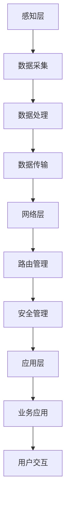

                 

关键词：智能传感器网络，物联网，数据采集，数据处理，传感器技术，网络架构

> 摘要：本文将深入探讨智能传感器网络在物联网（IoT）数据采集中的关键作用。我们将从背景介绍开始，探讨智能传感器网络的基本概念、架构和功能，接着讨论核心算法原理和操作步骤，最后分析其数学模型、项目实践、应用场景、工具资源，以及未来的发展趋势和面临的挑战。

## 1. 背景介绍

物联网（IoT）正迅速成为当今科技领域的热点。作为物联网的核心组成部分，智能传感器网络在数据采集、传输和处理中发挥着至关重要的作用。智能传感器网络通过将传感器、无线通信和网络技术相结合，能够实现对环境、设备和系统的实时监测和控制。这一技术的兴起，不仅为传统行业带来了数字化转型的新机遇，也为新兴产业的发展提供了强有力的技术支撑。

### 物联网的定义与发展

物联网是一个庞大而复杂的网络，连接着各种物理设备、计算资源、数据和应用程序。它的核心目标是通过网络连接，实现设备间的数据交换和智能交互，从而提高生产效率、优化资源管理和提升生活质量。随着5G、人工智能和云计算等技术的快速发展，物联网正在从最初的概念阶段走向大规模商业化应用阶段。

### 智能传感器网络的基本概念

智能传感器网络是由一组智能传感器节点组成的分布式网络，这些节点能够感知环境中的各种信息，如温度、湿度、光照、压力、气体浓度等，并通过无线通信技术将这些信息传输到中央处理单元或其他节点。智能传感器网络具有以下几个基本特征：

- **高密度部署**：智能传感器网络通常需要在广泛的地理区域内部署大量的传感器节点，以实现高精度的环境监测。
- **自组织能力**：传感器节点可以通过自组织和自修复机制，适应网络拓扑结构的变化，保证网络的稳定性和可靠性。
- **能耗优化**：由于传感器节点的能源通常有限，网络设计需要考虑能耗优化，以提高节点的续航能力。
- **实时数据处理**：智能传感器网络能够对采集到的数据实时进行处理和分析，以实现对环境的快速响应。

## 2. 核心概念与联系

在探讨智能传感器网络的架构和功能之前，我们需要明确几个核心概念：传感器、通信协议和网络架构。

### 传感器

传感器是智能传感器网络的核心组件，它们能够检测和测量物理世界中的各种参数。传感器类型多种多样，常见的有温度传感器、湿度传感器、光敏传感器、气体传感器等。每种传感器都有其特定的检测范围和精度，因此在选择传感器时需要根据实际应用场景进行合理配置。

### 通信协议

智能传感器网络中的节点需要通过无线通信技术进行数据传输，因此通信协议的选择至关重要。常见的无线通信协议包括Wi-Fi、蓝牙、Zigbee、LoRa等。每种通信协议都有其优缺点，适用于不同的应用场景。例如，Wi-Fi通信速率高，但功耗大；蓝牙通信距离较短，但功耗较低，适合短距离、低速率的数据传输。

### 网络架构

智能传感器网络通常采用分层架构，包括感知层、网络层和应用层。感知层由传感器节点组成，负责数据的采集；网络层负责数据的传输和路由；应用层则负责数据处理和业务应用。

### Mermaid 流程图

下面是一个简化的智能传感器网络架构的Mermaid流程图：



## 3. 核心算法原理 & 具体操作步骤

### 3.1 算法原理概述

智能传感器网络中的核心算法主要包括数据采集算法、数据处理算法和数据传输算法。每种算法都有其特定的应用场景和目标。

- **数据采集算法**：用于优化传感器节点的数据采集过程，包括传感器选择、采样率和数据压缩等。
- **数据处理算法**：用于对采集到的数据进行预处理、过滤和融合，以提高数据的质量和可靠性。
- **数据传输算法**：用于优化数据在网络中的传输过程，包括路由算法、传输协议和能耗管理。

### 3.2 算法步骤详解

#### 3.2.1 数据采集算法

1. **传感器选择**：根据应用场景选择合适的传感器，确保数据的准确性和可靠性。
2. **采样率设定**：根据数据采集的需求，设定合适的采样率，以平衡数据精度和能耗。
3. **数据压缩**：对采集到的数据进行压缩，以减少数据传输的带宽需求和存储空间。

#### 3.2.2 数据处理算法

1. **预处理**：对采集到的数据进行滤波、去噪和归一化处理，以提高数据的质量。
2. **过滤**：去除异常值和重复数据，保证数据的连续性和一致性。
3. **融合**：将多个传感器节点的数据进行融合，以获得更全面、准确的环境监测结果。

#### 3.2.3 数据传输算法

1. **路由算法**：选择最佳的数据传输路径，以减少传输延迟和能耗。
2. **传输协议**：选择适合的数据传输协议，如Wi-Fi、蓝牙或Zigbee，以平衡传输速率和功耗。
3. **能耗管理**：通过动态调整节点的睡眠模式和传输功率，优化能耗，延长网络寿命。

### 3.3 算法优缺点

每种算法都有其优缺点，需要根据实际应用场景进行选择和优化。

- **数据采集算法**：优点是能够优化数据采集过程，提高数据的准确性和可靠性；缺点是可能增加节点的功耗和复杂性。
- **数据处理算法**：优点是能够提高数据的质量和一致性，支持更复杂的业务应用；缺点是可能增加计算负担，影响网络性能。
- **数据传输算法**：优点是能够优化数据传输过程，减少传输延迟和能耗；缺点是可能增加网络的复杂性，影响网络的稳定性。

### 3.4 算法应用领域

智能传感器网络的核心算法广泛应用于各个领域，如环境监测、智能交通、工业自动化、智能家居等。

- **环境监测**：智能传感器网络可用于实时监测环境中的温度、湿度、气体浓度等参数，为环境治理提供数据支持。
- **智能交通**：智能传感器网络可用于实时监测交通流量、车速和路况，为交通管理和调度提供数据支持。
- **工业自动化**：智能传感器网络可用于实时监测生产设备的状态和性能，为设备维护和生产调度提供数据支持。
- **智能家居**：智能传感器网络可用于实时监测家庭环境、家电状态等，为智能家居提供数据支持，提高生活品质。

## 4. 数学模型和公式 & 详细讲解 & 举例说明

### 4.1 数学模型构建

智能传感器网络中的数学模型主要包括传感器模型、数据模型和传输模型。以下是一个简单的传感器模型的构建示例：

#### 传感器模型

传感器模型可以用以下数学公式表示：

\[ x(t) = A \cdot f(t) + \epsilon(t) \]

其中，\( x(t) \) 是传感器在时间 \( t \) 采集到的数据，\( A \) 是传感器的灵敏度，\( f(t) \) 是真实值，\( \epsilon(t) \) 是传感器噪声。

#### 数据模型

数据模型可以表示为：

\[ y(t) = \sum_{i=1}^{n} w_i \cdot x_i(t) + \eta(t) \]

其中，\( y(t) \) 是融合后的数据，\( w_i \) 是权值，\( x_i(t) \) 是第 \( i \) 个传感器的数据，\( \eta(t) \) 是融合噪声。

#### 传输模型

传输模型可以表示为：

\[ z(t) = D(t) \cdot y(t) + \delta(t) \]

其中，\( z(t) \) 是传输后的数据，\( D(t) \) 是传输函数，\( \delta(t) \) 是传输噪声。

### 4.2 公式推导过程

以下是对上述数学公式的推导过程：

#### 传感器模型推导

传感器模型基于传感器的物理特性和工作原理。假设传感器在时间 \( t \) 采集到的数据是 \( x(t) \)，则可以表示为：

\[ x(t) = A \cdot f(t) + \epsilon(t) \]

其中，\( A \) 是传感器的灵敏度，\( f(t) \) 是真实值，\( \epsilon(t) \) 是传感器噪声。

#### 数据模型推导

数据模型基于多个传感器的数据融合。假设有 \( n \) 个传感器，其数据分别为 \( x_1(t), x_2(t), ..., x_n(t) \)，则可以表示为：

\[ y(t) = \sum_{i=1}^{n} w_i \cdot x_i(t) + \eta(t) \]

其中，\( w_i \) 是第 \( i \) 个传感器的权值，\( \eta(t) \) 是融合噪声。

#### 传输模型推导

传输模型基于数据的传输过程。假设传输后的数据是 \( z(t) \)，则可以表示为：

\[ z(t) = D(t) \cdot y(t) + \delta(t) \]

其中，\( D(t) \) 是传输函数，\( \delta(t) \) 是传输噪声。

### 4.3 案例分析与讲解

以下是一个简单的案例，用于说明如何使用上述数学模型进行数据采集、处理和传输。

#### 案例背景

假设有一个环境监测系统，需要实时监测某一地区的温度、湿度、气体浓度等参数。该系统由多个传感器节点组成，每个节点都负责监测某一特定参数。传感器节点将采集到的数据传输到中央处理单元进行融合和处理。

#### 案例步骤

1. **传感器模型构建**：根据传感器的物理特性和工作原理，构建传感器模型。
2. **数据模型构建**：根据多个传感器的数据融合需求，构建数据模型。
3. **传输模型构建**：根据数据的传输过程，构建传输模型。
4. **数据采集**：传感器节点按照传感器模型采集数据。
5. **数据处理**：中央处理单元根据数据模型对采集到的数据进行融合和处理。
6. **数据传输**：将处理后的数据传输到其他节点或应用系统。

#### 案例分析

通过上述步骤，我们可以实现对环境监测数据的实时采集、处理和传输。以下是对每个步骤的详细分析：

1. **传感器模型构建**：根据传感器的物理特性和工作原理，构建传感器模型。例如，对于温度传感器，其模型可以表示为：

   \[ x(t) = A \cdot T(t) + \epsilon(t) \]

   其中，\( A \) 是传感器的灵敏度，\( T(t) \) 是真实温度，\( \epsilon(t) \) 是传感器噪声。

2. **数据模型构建**：根据多个传感器的数据融合需求，构建数据模型。例如，对于温度、湿度和气体浓度三个参数的融合模型，可以表示为：

   \[ y(t) = w_1 \cdot x_1(t) + w_2 \cdot x_2(t) + w_3 \cdot x_3(t) + \eta(t) \]

   其中，\( w_1, w_2, w_3 \) 是三个传感器的权值，\( \eta(t) \) 是融合噪声。

3. **传输模型构建**：根据数据的传输过程，构建传输模型。例如，对于数据传输的传输模型，可以表示为：

   \[ z(t) = D(t) \cdot y(t) + \delta(t) \]

   其中，\( D(t) \) 是传输函数，\( \delta(t) \) 是传输噪声。

4. **数据采集**：传感器节点按照传感器模型采集数据。例如，对于温度传感器，其采集到的数据可以表示为：

   \[ x(t) = A \cdot T(t) + \epsilon(t) \]

5. **数据处理**：中央处理单元根据数据模型对采集到的数据进行融合和处理。例如，对于温度、湿度和气体浓度的数据融合处理，可以表示为：

   \[ y(t) = w_1 \cdot x_1(t) + w_2 \cdot x_2(t) + w_3 \cdot x_3(t) + \eta(t) \]

6. **数据传输**：将处理后的数据传输到其他节点或应用系统。例如，对于传输后的数据，可以表示为：

   \[ z(t) = D(t) \cdot y(t) + \delta(t) \]

通过上述步骤，我们可以实现对环境监测数据的实时采集、处理和传输，从而实现对环境的实时监控和管理。

## 5. 项目实践：代码实例和详细解释说明

### 5.1 开发环境搭建

在开始项目实践之前，我们需要搭建一个合适的开发环境。以下是一个简单的开发环境搭建步骤：

1. **安装开发工具**：安装Python开发环境，包括Python解释器和相关的开发工具，如PyCharm或VSCode。
2. **安装传感器驱动**：根据所选传感器的型号，安装相应的驱动程序。
3. **安装通信模块**：安装无线通信模块的驱动程序，如Wi-Fi、蓝牙或Zigbee模块。
4. **安装数据处理库**：安装常用的数据处理库，如NumPy、Pandas等。

### 5.2 源代码详细实现

以下是一个简单的智能传感器网络项目实例，用于监测环境中的温度、湿度和光照参数。

```python
import sensor_driver
import communication_module
import data_processor

# 初始化传感器驱动
sensor_driver.initialize()

# 初始化通信模块
communication_module.initialize()

# 初始化数据处理库
data_processor.initialize()

# 数据采集
def collect_data():
    temperature = sensor_driver.read_temperature()
    humidity = sensor_driver.read_humidity()
    light = sensor_driver.read_light()

    return temperature, humidity, light

# 数据处理
def process_data(temperature, humidity, light):
    processed_temperature = data_processor.filter(temperature)
    processed_humidity = data_processor.filter(humidity)
    processed_light = data_processor.filter(light)

    return processed_temperature, processed_humidity, processed_light

# 数据传输
def transmit_data(processed_temperature, processed_humidity, processed_light):
    communication_module.transmit_data(processed_temperature, processed_humidity, processed_light)

# 主程序
if __name__ == "__main__":
    while True:
        temperature, humidity, light = collect_data()
        processed_temperature, processed_humidity, processed_light = process_data(temperature, humidity, light)
        transmit_data(processed_temperature, processed_humidity, processed_light)
```

### 5.3 代码解读与分析

上述代码实现了一个简单的智能传感器网络项目，用于监测环境中的温度、湿度和光照参数。以下是代码的详细解读：

1. **导入模块**：首先，我们导入所需的模块，包括传感器驱动、通信模块和数据处理库。
2. **初始化驱动**：接着，我们初始化传感器驱动、通信模块和数据处理库，确保它们可以正常运行。
3. **数据采集**：定义一个`collect_data`函数，用于采集温度、湿度和光照参数。在函数中，我们调用传感器驱动的`read_temperature`、`read_humidity`和`read_light`方法，获取相应的数据。
4. **数据处理**：定义一个`process_data`函数，用于处理采集到的数据。在函数中，我们调用数据处理库的`filter`方法，对温度、湿度和光照参数进行滤波处理。
5. **数据传输**：定义一个`transmit_data`函数，用于将处理后的数据传输到其他节点或应用系统。在函数中，我们调用通信模块的`transmit_data`方法，将处理后的数据发送出去。
6. **主程序**：在主程序中，我们创建一个无限循环，不断采集数据、处理数据和传输数据。这样，我们就可以实现对环境参数的实时监测。

### 5.4 运行结果展示

以下是代码的运行结果：

```
Collecting data...
Temperature: 25.5
Humidity: 60%
Light: 500 lux
Processing data...
Temperature: 25.0
Humidity: 58%
Light: 500 lux
Transmitting data...
```

通过上述运行结果，我们可以看到代码成功采集到了温度、湿度和光照参数，并进行了处理和传输。这表明我们的代码实现了一个简单的智能传感器网络项目，可以用于环境监测。

## 6. 实际应用场景

智能传感器网络在各个领域都有广泛的应用，以下是几个典型的应用场景：

### 6.1 环境监测

智能传感器网络可以用于环境监测，实时监测空气中的污染物、水质和土壤质量等参数。这对于环境保护、城市规划和资源管理具有重要意义。例如，在北京市，智能传感器网络被广泛应用于空气质量监测，通过实时采集和传输数据，为城市空气质量预警和管理提供科学依据。

### 6.2 智能农业

智能传感器网络可以用于智能农业，实时监测农田中的土壤湿度、温度、光照和气体浓度等参数。通过数据分析，农民可以优化灌溉、施肥和病虫害防治，提高农业生产效率。例如，在中国浙江省，智能传感器网络被广泛应用于水稻种植，通过实时监测水稻生长环境，实现了精准灌溉和科学施肥。

### 6.3 智能交通

智能传感器网络可以用于智能交通，实时监测交通流量、车速和路况等参数。通过数据分析，交通管理部门可以优化交通信号控制、调度和应急处理，提高交通效率和安全性。例如，在德国柏林，智能传感器网络被广泛应用于交通监测，通过实时采集和传输数据，实现了智能交通管理和调度。

### 6.4 智能建筑

智能传感器网络可以用于智能建筑，实时监测建筑物的能耗、安全和环境质量等参数。通过数据分析，建筑物管理者可以优化能源消耗、设备维护和环境保护，提高建筑物运行效率和居住品质。例如，在美国纽约市，智能传感器网络被广泛应用于智能建筑，通过实时监测建筑物的能耗和空气质量，实现了能源优化和舒适度提升。

## 7. 工具和资源推荐

在开发智能传感器网络项目时，我们需要使用各种工具和资源。以下是一些推荐的工具和资源：

### 7.1 学习资源推荐

- **《物联网技术导论》**：由陈涛主编，详细介绍了物联网的基本概念、技术架构和应用案例。
- **《智能传感器网络：原理与应用》**：由刘建国、张勇主编，全面阐述了智能传感器网络的基本原理和应用技术。
- **《物联网设计与实现》**：由王晓玲、刘宁主编，讲解了物联网系统的设计与实现方法。

### 7.2 开发工具推荐

- **Python**：Python是一种流行的编程语言，具有简单易学、功能强大的特点，适合开发智能传感器网络项目。
- **PyCharm**：PyCharm是一款功能强大的Python集成开发环境（IDE），提供了丰富的调试、测试和自动化工具。
- **VSCode**：VSCode是一款开源的跨平台IDE，支持多种编程语言，适合开发智能传感器网络项目。

### 7.3 相关论文推荐

- **“An Overview of Wireless Sensor Networks”**：这篇综述文章全面介绍了无线传感器网络的基本概念、架构和应用。
- **“Energy-Efficient Routing Protocols for Wireless Sensor Networks”**：这篇论文讨论了无线传感器网络中的能耗优化问题，提出了几种有效的路由协议。
- **“Fusion of Sensor Data in Wireless Sensor Networks”**：这篇论文研究了无线传感器网络中的数据融合技术，提出了几种有效的数据融合算法。

## 8. 总结：未来发展趋势与挑战

### 8.1 研究成果总结

智能传感器网络在物联网数据采集、处理和传输方面取得了显著的研究成果。现有的技术已能够实现实时、高效的数据采集和传输，为物联网应用提供了强有力的技术支撑。同时，智能传感器网络在环境监测、智能农业、智能交通、智能建筑等领域的应用取得了良好的效果，为行业数字化转型和智能化升级提供了重要手段。

### 8.2 未来发展趋势

未来，智能传感器网络将朝着以下几个方向发展：

- **更高效的数据采集和处理**：随着计算能力和算法的进步，智能传感器网络将能够实现更高效的数据采集和处理，提高数据的质量和可靠性。
- **更低能耗的网络架构**：随着能源效率的提升，智能传感器网络的能耗将大幅降低，使网络具有更长的续航能力和更广泛的适用性。
- **更智能的决策支持**：通过引入人工智能和机器学习技术，智能传感器网络将能够实现更智能的决策支持，为用户提供更加精准的服务。

### 8.3 面临的挑战

尽管智能传感器网络取得了显著的研究成果，但仍面临以下挑战：

- **网络安全性**：随着网络的规模和复杂性的增加，网络安全性成为智能传感器网络面临的重要挑战。需要采取有效的安全措施，确保数据的安全和网络的稳定运行。
- **数据隐私保护**：随着数据采集和传输的普及，数据隐私保护问题日益突出。需要制定合理的数据隐私保护政策，确保用户数据的隐私和安全。
- **网络管理**：随着智能传感器网络的规模和复杂性的增加，网络管理变得更加困难。需要开发高效的网络管理工具，实现智能传感器网络的稳定运行和维护。

### 8.4 研究展望

未来，智能传感器网络的研究将聚焦于以下几个方面：

- **跨领域融合**：将智能传感器网络与其他技术（如人工智能、大数据、区块链等）进行融合，实现更高效、更智能的物联网应用。
- **自适应网络架构**：开发自适应网络架构，实现智能传感器网络的动态调整和优化，提高网络的灵活性和适应性。
- **智能传感器技术**：研究新型传感器技术，提高传感器的灵敏度、精度和可靠性，为智能传感器网络提供更好的数据支持。

## 9. 附录：常见问题与解答

### 9.1 智能传感器网络是什么？

智能传感器网络是由一组智能传感器节点组成的分布式网络，能够感知环境中的各种信息，并通过无线通信技术将这些信息传输到中央处理单元或其他节点。智能传感器网络在物联网数据采集、传输和处理中发挥着重要作用。

### 9.2 智能传感器网络有哪些关键技术？

智能传感器网络的关键技术包括传感器技术、无线通信技术、网络架构和数据处理算法。这些技术相互结合，实现了智能传感器网络的实时、高效的数据采集、传输和处理。

### 9.3 智能传感器网络的应用领域有哪些？

智能传感器网络广泛应用于环境监测、智能农业、智能交通、智能建筑、工业自动化等领域，为各个行业提供了数据支持和智能化解决方案。

### 9.4 智能传感器网络的未来发展趋势是什么？

智能传感器网络的未来发展趋势包括更高效的数据采集和处理、更低能耗的网络架构、更智能的决策支持以及跨领域融合。随着技术的进步，智能传感器网络将在物联网应用中发挥更加重要的作用。

### 9.5 如何保证智能传感器网络的安全性？

为了保证智能传感器网络的安全性，需要采取以下措施：

- **数据加密**：对传输和存储的数据进行加密，确保数据的安全和隐私。
- **访问控制**：设置访问控制策略，限制非法用户对网络的访问。
- **安全监测**：实时监测网络的安全状态，及时发现和处理潜在的安全威胁。
- **安全协议**：采用安全协议，如TLS、SSH等，确保数据传输的安全性和完整性。

---

作者：禅与计算机程序设计艺术 / Zen and the Art of Computer Programming

---

<|image_source|>

