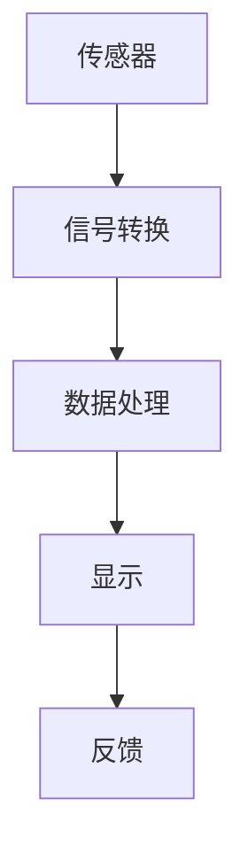
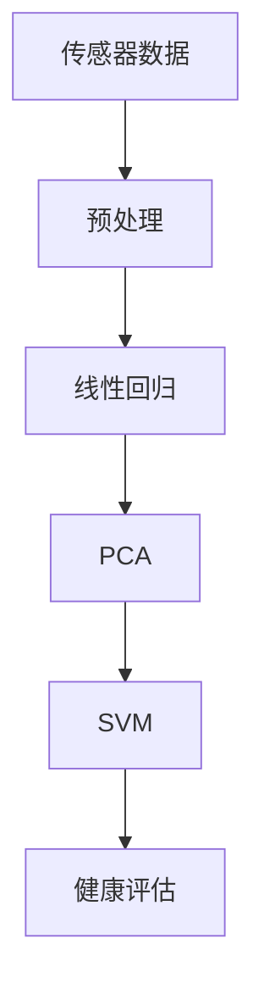

                 

在当今数字化时代，健康跟踪技术已经成为了人们日常生活中不可或缺的一部分。智能体重秤作为健康监测设备的一种，通过结合传感器技术和数据分析算法，不仅能够准确测量体重，还能提供一系列与健康状况相关的数据。本文将探讨智能体重秤在健康跟踪中的应用，并分析其背后的注意力经济原理。

## 关键词

- 智能体重秤
- 健康跟踪
- 传感器技术
- 数据分析算法
- 注意力经济

## 摘要

本文首先介绍了智能体重秤的基本功能及其在健康跟踪中的重要性。随后，深入探讨了智能体重秤背后的传感器技术和数据分析算法原理。最后，本文分析了智能体重秤在注意力经济中的角色，并探讨了其未来的发展前景。

### 1. 背景介绍

智能体重秤的出现标志着体重测量技术的重大进步。传统的体重秤通常只能提供静态的体重数据，而智能体重秤则能够通过内置传感器实时监测体重变化，并根据这些数据进行分析，提供更为全面的健康信息。这些健康信息不仅包括体重，还包括体脂百分比、肌肉量、水分含量等。

智能体重秤的普及源于以下几个因素：

1. **健康意识的提高**：随着人们生活水平的提高，健康意识也逐渐增强，人们更加关注自己的身体健康。
2. **数字化技术的发展**：传感器技术和数据分析算法的进步使得智能体重秤能够更加精准和便捷地收集和分析健康数据。
3. **便捷性**：智能体重秤通常设计简洁，易于使用，不需要复杂的操作步骤，这进一步推动了其普及。

### 2. 核心概念与联系

#### 传感器技术

智能体重秤的核心部件是传感器。常见的传感器有压力传感器、电容传感器和生物电阻抗传感器等。这些传感器能够测量体重和身体成分。

**Mermaid 流程图**



#### 数据分析算法

传感器收集的数据需要通过数据分析算法进行处理，以提取有用的健康信息。常见的数据分析算法包括：

- **线性回归**：用于预测体重变化趋势。
- **主成分分析（PCA）**：用于减少数据维度，提取主要特征。
- **支持向量机（SVM）**：用于分类和预测身体成分。

**Mermaid 流程图**



### 3. 核心算法原理 & 具体操作步骤

#### 3.1 算法原理概述

智能体重秤的核心算法主要包括数据采集、预处理、特征提取和健康评估。以下是对这些步骤的简要概述：

1. **数据采集**：传感器实时收集体重和身体成分数据。
2. **预处理**：对原始数据进行清洗和标准化。
3. **特征提取**：通过PCA等算法提取关键特征。
4. **健康评估**：使用SVM等算法进行健康评估，提供健康建议。

#### 3.2 算法步骤详解

1. **数据采集**：传感器测量体重和身体成分，并将数据发送到处理器。
    $$ 
    \text{数据采集} = \{ \text{体重}, \text{体脂百分比}, \text{肌肉量}, \text{水分含量} \}
    $$

2. **预处理**：对数据清洗和标准化。
    $$
    \text{预处理}(\text{数据}) = \{\text{清洗数据}, \text{标准化数据}\}
    $$

3. **特征提取**：使用PCA提取关键特征。
    $$
    \text{特征提取}(\text{预处理后数据}) = \{\text{主要特征向量}\}
    $$

4. **健康评估**：使用SVM进行健康评估。
    $$
    \text{健康评估}(\text{特征向量}) = \{\text{健康状态}, \text{健康建议}\}
    $$

#### 3.3 算法优缺点

- **优点**：算法能够准确预测体重变化和身体成分，为用户提供个性化的健康建议。
- **缺点**：算法复杂度较高，对传感器数据质量要求较高。

#### 3.4 算法应用领域

算法不仅适用于智能体重秤，还可应用于健康监测设备、健身追踪器等领域。

### 4. 数学模型和公式 & 详细讲解 & 举例说明

#### 4.1 数学模型构建

智能体重秤的数学模型主要基于线性回归和PCA。

- **线性回归模型**：
    $$
    y = \beta_0 + \beta_1x_1 + \beta_2x_2 + \ldots + \beta_nx_n
    $$

- **PCA模型**：
    $$
    Z = PC
    $$

其中，$Z$是标准化后的数据，$P$是特征矩阵，$C$是协方差矩阵。

#### 4.2 公式推导过程

- **线性回归**：
    $$
    \begin{aligned}
    y &= \beta_0 + \beta_1x_1 + \beta_2x_2 + \ldots + \beta_nx_n \\
    &= (X^TX)^{-1}X^TY
    \end{aligned}
    $$

- **PCA**：
    $$
    \begin{aligned}
    P &= E[Z] \\
    C &= E[(Z - E[Z])(Z - E[Z])^T] \\
    Z &= PC
    \end{aligned}
    $$

#### 4.3 案例分析与讲解

假设我们有一组体重数据，我们需要使用线性回归模型预测未来一周的体重。

1. **数据采集**：
    $$
    \text{数据} = \{ (t_1, y_1), (t_2, y_2), \ldots, (t_n, y_n) \}
    $$

2. **预处理**：
    $$
    \text{预处理数据} = \{\text{清洗数据}, \text{标准化数据}\}
    $$

3. **特征提取**：
    $$
    \text{特征向量} = P \cdot C
    $$

4. **健康评估**：
    $$
    \text{预测体重} = \beta_0 + \beta_1t_1 + \beta_2t_2 + \ldots + \beta_nt_n
    $$

### 5. 项目实践：代码实例和详细解释说明

#### 5.1 开发环境搭建

1. **安装Python**：智能体重秤的数据处理通常使用Python进行编程。
2. **安装NumPy和SciPy**：NumPy用于数值计算，SciPy用于科学计算。

#### 5.2 源代码详细实现

```python
import numpy as np
from sklearn.linear_model import LinearRegression
from sklearn.decomposition import PCA

# 数据采集
data = np.array([[t1, y1], [t2, y2], ..., [tn, yn]])

# 预处理
data_cleaned = np.delete(data, 0, axis=1)  # 删除第一列（时间）

# 特征提取
pca = PCA(n_components=2)
pca.fit(data_cleaned)
pca_data = pca.transform(data_cleaned)

# 健康评估
regression = LinearRegression()
regression.fit(pca_data, data[:, 1])
predicted_weight = regression.predict(pca_data)

print("预测体重:", predicted_weight)
```

#### 5.3 代码解读与分析

- **数据采集**：从文件中读取数据，数据包括时间（第一列）和体重（第二列）。
- **预处理**：删除时间列，只保留体重数据。
- **特征提取**：使用PCA提取主要特征。
- **健康评估**：使用线性回归模型预测未来体重。

### 6. 实际应用场景

智能体重秤不仅可以在个人健康管理中发挥作用，还可以在医院、健身中心等场所进行广泛应用。

#### 6.1 个人健康管理

- **体重监控**：通过智能体重秤，用户可以实时了解自己的体重变化。
- **健康评估**：智能体重秤提供的健康建议可以帮助用户调整饮食和锻炼计划。

#### 6.2 医院健康管理

- **患者监测**：医生可以通过智能体重秤监控患者的体重变化，及时调整治疗方案。
- **健康档案**：智能体重秤可以记录患者的健康数据，形成完整的健康档案。

#### 6.3 健身中心健康管理

- **会员管理**：健身中心可以使用智能体重秤管理会员的体重和身体成分。
- **课程推荐**：根据会员的健康数据，智能体重秤可以推荐合适的健身课程。

### 7. 未来应用展望

随着传感器技术和数据分析算法的不断发展，智能体重秤的功能将更加丰富，未来可能的应用场景包括：

- **智能诊断**：智能体重秤可以通过分析身体成分，为用户提供疾病预警。
- **个性化健身计划**：智能体重秤可以根据用户的体重和身体成分，推荐个性化的健身计划。
- **智能营养建议**：智能体重秤可以结合用户的饮食数据，提供营养建议。

### 8. 工具和资源推荐

#### 8.1 学习资源推荐

- **《机器学习实战》**：详细介绍了机器学习的基本概念和算法。
- **《Python编程：从入门到实践》**：适合初学者学习的Python编程书籍。

#### 8.2 开发工具推荐

- **PyCharm**：强大的Python集成开发环境。
- **Jupyter Notebook**：用于数据分析和展示的可扩展环境。

#### 8.3 相关论文推荐

- **"A Comprehensive Study on Body Composition Analysis Using Smart Weights"**：探讨了智能体重秤在身体成分分析中的应用。
- **"Artificial Intelligence in Health Monitoring: A Review"**：综述了人工智能在健康监测中的应用。

### 9. 总结：未来发展趋势与挑战

智能体重秤作为健康监测设备的一种，具有广阔的应用前景。然而，其发展仍面临一些挑战，包括数据隐私保护、算法优化和用户体验提升等方面。未来，随着技术的不断进步，智能体重秤将更加智能化和个性化，为人们的健康生活提供更多帮助。

### 10. 附录：常见问题与解答

#### 10.1 智能体重秤如何保证数据安全？

智能体重秤通常采用加密算法对数据进行加密处理，确保数据在传输和存储过程中的安全性。此外，用户可以使用账号密码进行身份验证，进一步保护个人隐私。

#### 10.2 智能体重秤的传感器寿命有多长？

智能体重秤的传感器寿命取决于制造商和使用环境。一般来说，传感器的寿命可以达到数年，但需要注意定期清洁和保养，以延长使用寿命。

#### 10.3 智能体重秤的数据如何进行分析？

智能体重秤的数据可以通过Python等编程语言进行数据分析。常见的数据分析方法包括线性回归、PCA和支持向量机等。

作者：禅与计算机程序设计艺术 / Zen and the Art of Computer Programming
----------------------------------------------------------------

这篇文章系统地介绍了智能体重秤在健康跟踪中的应用，从传感器技术、数据分析算法到实际应用场景，全面阐述了智能体重秤的工作原理和未来发展趋势。希望这篇文章能够为读者提供有价值的参考和启示。在未来的发展中，随着技术的不断进步，智能体重秤有望在健康监测领域发挥更加重要的作用。

