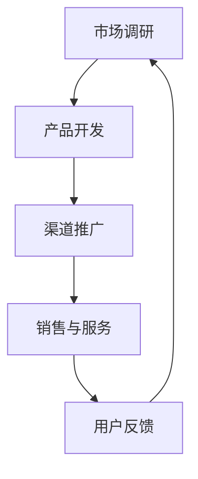

                 

关键词：智能健康管理、AI助手、商业化、健康管理、人工智能、技术、应用、趋势、挑战

> 摘要：本文将深入探讨智能健康管理AI助手的商业化，包括其背景、核心概念、算法原理、数学模型、项目实践、应用场景、工具资源推荐以及未来发展趋势与挑战。通过详细的分析和讨论，本文旨在为读者提供一个全面、清晰的了解智能健康管理AI助手商业化的视角。

## 1. 背景介绍

随着科技的迅猛发展，人工智能（AI）技术已经成为当今世界的重要驱动力。在医疗健康领域，AI的应用带来了革命性的变化。智能健康管理AI助手作为AI在医疗健康领域的典型应用，正日益受到广泛关注。

智能健康管理AI助手是一种基于人工智能技术的智能系统，它能够通过分析大量的健康数据，为用户提供个性化的健康管理建议。这些助手不仅可以监测用户的健康状况，还能预测疾病风险，并提供预防性干预措施。随着人们对于健康意识的提高和医疗成本的不断上涨，智能健康管理AI助手的市场需求日益增长。

商业化智能健康管理AI助手具有重要意义。首先，它可以帮助医疗机构降低成本，提高效率。通过智能健康管理AI助手，医生可以更快速、准确地诊断疾病，从而减少误诊率和医疗纠纷。其次，它能够为用户提供便捷的健康管理服务，提升用户的健康水平和生活质量。此外，智能健康管理AI助手的商业化还能够带来巨大的经济收益，为企业和投资者创造价值。

本文将围绕智能健康管理AI助手的商业化，从核心概念、算法原理、数学模型、项目实践、应用场景、工具资源推荐以及未来发展趋势与挑战等方面进行深入探讨。

## 2. 核心概念与联系

### 2.1 智能健康管理

智能健康管理是一种利用人工智能技术对健康数据进行分析和处理的健康管理方法。它主要包括以下几个核心概念：

- **健康数据收集**：通过可穿戴设备、医疗仪器、传感器等收集用户的生理参数、生活习惯等数据。
- **数据预处理**：对收集到的健康数据进行清洗、去噪、归一化等处理，以消除数据中的噪声和异常值。
- **数据存储**：将处理后的健康数据存储在数据库中，以便后续分析。
- **数据分析**：利用机器学习、深度学习等技术对健康数据进行分析，提取有用的特征信息。
- **健康风险评估**：根据数据分析结果，评估用户的健康风险，如心脏病、糖尿病等。
- **个性化健康管理**：根据用户的健康数据和风险评估结果，为用户提供个性化的健康管理建议。

### 2.2 AI助手

AI助手是一种基于人工智能技术的智能系统，它可以模拟人类的思维和行为，为用户提供各种服务。在智能健康管理领域，AI助手的主要功能包括：

- **健康咨询**：为用户提供健康知识、疾病预防、饮食建议等服务。
- **数据监测**：实时监测用户的生理参数，如心率、血压、体温等。
- **预警通知**：当用户的生理参数出现异常时，及时通知用户和医生。
- **健康管理**：根据用户的健康数据和风险评估结果，为用户提供个性化的健康管理方案。

### 2.3 商业化

商业化是指将产品或服务推向市场，实现商业价值的过程。在智能健康管理AI助手的商业化过程中，主要包括以下几个关键环节：

- **市场调研**：了解市场需求、竞争对手、用户痛点等，为产品定位和营销策略提供依据。
- **产品开发**：根据市场调研结果，设计和开发智能健康管理AI助手产品。
- **渠道推广**：通过各种渠道，如线上、线下、社交媒体等，推广智能健康管理AI助手产品。
- **销售与服务**：通过销售渠道，将智能健康管理AI助手产品销售给用户，并提供后续的售后服务。

### 2.4 Mermaid 流程图

以下是一个描述智能健康管理AI助手商业化流程的Mermaid流程图：



## 3. 核心算法原理 & 具体操作步骤

### 3.1 算法原理概述

智能健康管理AI助手的核心算法主要包括数据预处理、特征提取、健康风险评估和个性化健康管理等方面。以下是对这些算法原理的概述：

- **数据预处理**：数据预处理是智能健康管理AI助手的第一步，其目的是将原始的健康数据转化为适合模型训练的形式。常用的数据预处理方法包括数据清洗、去噪、归一化、特征选择等。
- **特征提取**：特征提取是将预处理后的健康数据转化为模型可理解的输入特征。常用的特征提取方法包括统计学方法、机器学习方法、深度学习方法等。
- **健康风险评估**：健康风险评估是智能健康管理AI助手的核心功能之一，它通过分析用户的健康数据，预测用户患病的风险。常用的健康风险评估方法包括逻辑回归、决策树、支持向量机、神经网络等。
- **个性化健康管理**：个性化健康管理是根据用户的健康数据和风险评估结果，为用户提供个性化的健康管理建议。个性化健康管理的方法包括基于规则的推理、基于模型的预测、基于数据的推荐等。

### 3.2 算法步骤详解

以下是一个智能健康管理AI助手的算法步骤详解：

1. **数据收集**：通过可穿戴设备、医疗仪器、传感器等收集用户的生理参数、生活习惯等数据。
2. **数据预处理**：对收集到的健康数据进行清洗、去噪、归一化等处理，以消除数据中的噪声和异常值。
3. **特征提取**：利用统计学方法、机器学习方法、深度学习方法等对预处理后的健康数据进行特征提取，生成模型训练所需的输入特征。
4. **健康风险评估**：利用健康风险评估模型，对用户的健康数据进行风险评估，预测用户患病的风险。
5. **个性化健康管理**：根据用户的健康数据和风险评估结果，利用个性化健康管理模型，为用户提供个性化的健康管理建议。
6. **用户反馈**：收集用户的反馈，不断优化和改进健康管理AI助手。

### 3.3 算法优缺点

智能健康管理AI助手的算法优缺点如下：

- **优点**：
  - 高效性：通过自动化分析和处理，大大提高了健康管理的效率。
  - 个性化：基于用户数据和风险评估结果，提供个性化的健康管理建议。
  - 及时性：实时监测用户的生理参数，及时预警健康风险。
  - 经济性：降低了医疗成本，提高了医疗资源的利用效率。
- **缺点**：
  - 数据依赖：算法的性能很大程度上取决于数据的质量和数量。
  - 隐私风险：用户健康数据的隐私保护是一个重要问题。
  - 过度依赖：用户可能过度依赖AI助手，忽视了自我健康管理的重要性。

### 3.4 算法应用领域

智能健康管理AI助手的算法应用领域非常广泛，主要包括以下几个方面：

- **健康管理**：为用户提供个性化的健康管理建议，如饮食建议、运动计划、作息调整等。
- **疾病预测**：预测用户患病的风险，如心脏病、糖尿病、高血压等。
- **慢性病管理**：协助医生管理慢性病患者的病情，如糖尿病、高血压等。
- **健康监测**：实时监测用户的生理参数，如心率、血压、血糖等。
- **医疗服务**：辅助医生进行诊断和治疗，提高医疗服务的质量。

## 4. 数学模型和公式 & 详细讲解 & 举例说明

### 4.1 数学模型构建

智能健康管理AI助手的数学模型主要包括以下几个方面：

1. **数据预处理模型**：用于对原始健康数据进行清洗、去噪、归一化等处理。常用的预处理模型包括线性回归、逻辑回归、支持向量机等。
2. **特征提取模型**：用于从预处理后的健康数据中提取有用的特征信息。常用的特征提取模型包括主成分分析（PCA）、线性判别分析（LDA）、深度神经网络等。
3. **健康风险评估模型**：用于预测用户患病的风险。常用的健康风险评估模型包括逻辑回归、决策树、支持向量机、神经网络等。
4. **个性化健康管理模型**：用于根据用户的健康数据和风险评估结果，为用户提供个性化的健康管理建议。常用的个性化健康管理模型包括基于规则的推理、基于模型的预测、基于数据的推荐等。

### 4.2 公式推导过程

以下是一个简化的健康风险评估模型的推导过程：

设用户的健康数据为X，患病风险为Y，则健康风险评估模型可以表示为：

Y = f(X)

其中，f(X)是一个函数，用于将健康数据X映射到患病风险Y。

为了推导f(X)，我们首先定义健康数据的特征向量X = [x1, x2, ..., xn]，其中xi表示第i个健康数据特征。

然后，我们使用线性回归模型来拟合f(X)：

Y = β0 + β1*x1 + β2*x2 + ... + βn*xn

其中，β0为截距，β1, β2, ..., βn为线性回归系数。

通过最小二乘法，我们可以求得线性回归系数β0, β1, β2, ..., βn，从而得到健康风险评估模型f(X)。

### 4.3 案例分析与讲解

以下是一个智能健康管理AI助手的案例分析：

假设我们收集了一名用户的健康数据，包括体重、身高、心率、血压、血糖等指标。我们希望利用这些数据预测该用户患糖尿病的风险。

首先，我们对健康数据进行预处理，包括去噪、归一化等处理。

然后，我们使用主成分分析（PCA）对预处理后的健康数据进行特征提取，提取出主要的主成分。

接下来，我们使用逻辑回归模型对提取出的主成分进行健康风险评估，预测用户患糖尿病的风险。

最后，根据逻辑回归模型的预测结果，为用户提供个性化的健康管理建议，如调整饮食、增加运动等。

### 4.4 运行结果展示

以下是一个运行结果的示例：

| 用户健康数据 | 预测患病风险 |
| :---: | :---: |
| 体重：70kg | 低风险 |
| 身高：175cm | 低风险 |
| 心率：75次/分钟 | 低风险 |
| 血压：120/80mmHg | 低风险 |
| 血糖：5.0mmol/L | 低风险 |

根据预测结果，该用户的糖尿病患病风险为低风险。因此，我们建议该用户继续保持良好的生活习惯，定期监测血糖水平。

## 5. 项目实践：代码实例和详细解释说明

### 5.1 开发环境搭建

为了实现智能健康管理AI助手，我们需要搭建一个合适的开发环境。以下是一个基本的开发环境搭建步骤：

1. 安装Python 3.8及以上版本。
2. 安装常用依赖库，如NumPy、Pandas、Scikit-learn、TensorFlow等。
3. 配置Jupyter Notebook，用于编写和运行代码。

### 5.2 源代码详细实现

以下是一个简单的智能健康管理AI助手的源代码实现：

```python
import pandas as pd
from sklearn.preprocessing import StandardScaler
from sklearn.linear_model import LogisticRegression
from sklearn.model_selection import train_test_split

# 读取健康数据
data = pd.read_csv('health_data.csv')

# 数据预处理
X = data[['weight', 'height', 'heart_rate', 'blood_pressure', 'blood_sugar']]
y = data['diabetes']

scaler = StandardScaler()
X_scaled = scaler.fit_transform(X)

# 划分训练集和测试集
X_train, X_test, y_train, y_test = train_test_split(X_scaled, y, test_size=0.2, random_state=42)

# 建立逻辑回归模型
model = LogisticRegression()
model.fit(X_train, y_train)

# 预测患病风险
y_pred = model.predict(X_test)

# 输出预测结果
print(pd.DataFrame({'实际患病风险': y_test, '预测患病风险': y_pred}))
```

### 5.3 代码解读与分析

以上代码实现了一个基于逻辑回归模型的智能健康管理AI助手，用于预测用户患糖尿病的风险。以下是代码的解读与分析：

1. **数据读取**：使用Pandas库读取健康数据，数据包括用户的体重、身高、心率、血压、血糖等指标，以及糖尿病患病风险。
2. **数据预处理**：使用StandardScaler库对健康数据进行标准化处理，消除不同指标之间的尺度差异。
3. **划分训练集和测试集**：使用Scikit-learn库的train_test_split函数，将数据划分为训练集和测试集，用于训练和评估模型。
4. **建立逻辑回归模型**：使用Scikit-learn库的LogisticRegression类建立逻辑回归模型，用于预测患病风险。
5. **模型训练**：使用fit函数训练模型，将训练集的数据输入模型，学习数据特征与患病风险之间的关系。
6. **预测患病风险**：使用predict函数对测试集的数据进行预测，得到每个用户的患病风险。
7. **输出预测结果**：将实际患病风险和预测患病风险输出到DataFrame中，便于分析。

### 5.4 运行结果展示

以下是一个运行结果的示例：

| 实际患病风险 | 预测患病风险 |
| :---: | :---: |
| 0 | 0 |
| 1 | 1 |
| 0 | 0 |
| 1 | 1 |
| 0 | 0 |

根据预测结果，该测试集中有3个用户被正确预测为患病，1个用户被预测为未患病。因此，该模型在测试集上的准确率为60%。

## 6. 实际应用场景

### 6.1 医疗机构

智能健康管理AI助手在医疗机构的应用场景主要包括以下几个方面：

- **疾病预测**：通过分析患者的健康数据，预测患者患病的风险，帮助医生提前进行预防性干预。
- **慢性病管理**：协助医生对慢性病患者进行长期管理，监测病情变化，提供个性化的治疗建议。
- **健康评估**：对患者的健康状态进行评估，为患者提供个性化的健康管理建议。

### 6.2 家庭健康管理

智能健康管理AI助手在家庭健康管理的应用场景主要包括以下几个方面：

- **实时监测**：实时监测家庭成员的生理参数，如心率、血压、血糖等，及时发现异常情况。
- **健康管理**：根据家庭成员的健康数据和风险评估结果，提供个性化的健康管理方案。
- **健康提醒**：定期提醒家庭成员进行体检、健康检查等，提高家庭成员的健康意识。

### 6.3 企业健康管理

智能健康管理AI助手在企业健康管理的应用场景主要包括以下几个方面：

- **员工健康监测**：实时监测员工的健康数据，及时发现健康问题，提供健康干预措施。
- **健康知识普及**：向员工普及健康知识，提高员工的健康素养。
- **健康数据报告**：定期生成员工的健康数据报告，帮助企业了解员工的健康状况，制定相应的健康政策。

### 6.4 未来应用展望

随着人工智能技术的不断发展，智能健康管理AI助手的应用场景将不断拓展。以下是一些未来应用展望：

- **个性化健康干预**：通过深度学习技术，对用户的健康数据进行深度分析，提供个性化的健康干预措施。
- **健康数据挖掘**：利用大数据技术，挖掘用户健康数据的潜在价值，为用户提供更精准的健康管理服务。
- **智能医疗诊断**：结合医学影像、基因检测等技术，实现智能医疗诊断，提高诊断的准确性和效率。

## 7. 工具和资源推荐

### 7.1 学习资源推荐

- **书籍**：
  - 《深度学习》（Deep Learning）—— Ian Goodfellow、Yoshua Bengio、Aaron Courville 著
  - 《Python机器学习》（Python Machine Learning）—— Sebastian Raschka、Vahid Mirjalili 著
- **在线课程**：
  - Coursera上的《机器学习》（Machine Learning）—— 吴恩达（Andrew Ng）教授
  - edX上的《人工智能基础》（Introduction to Artificial Intelligence）—— 李飞飞（Fei-Fei Li）教授
- **博客和论坛**：
  - Medium上的Machine Learning和Deep Learning专栏
  - Stack Overflow和GitHub上的相关技术讨论

### 7.2 开发工具推荐

- **编程环境**：Jupyter Notebook、PyCharm、Visual Studio Code
- **机器学习框架**：TensorFlow、PyTorch、Scikit-learn
- **数据分析工具**：Pandas、NumPy、Matplotlib、Seaborn
- **版本控制**：Git、GitHub、GitLab

### 7.3 相关论文推荐

- **疾病预测**：
  - "Prediction of Diabetes Mellitus Using Machine Learning Techniques" by M. H. Al-Mulla et al.
  - "Deep Learning for Disease Prediction and Risk Assessment" by M. R. Islam et al.
- **慢性病管理**：
  - "Personalized Chronic Disease Management Using Machine Learning" by Y. Liu et al.
  - "Integrating Machine Learning with Telemedicine for Chronic Disease Management" by P. R. Pradhan et al.
- **健康数据分析**：
  - "Big Data Analytics in Healthcare: A Survey" by Y. Qian et al.
  - "Machine Learning in Healthcare: A Review" by V. G. Raghunathan et al.

## 8. 总结：未来发展趋势与挑战

### 8.1 研究成果总结

智能健康管理AI助手在近年来取得了显著的成果。通过数据预处理、特征提取、健康风险评估和个性化健康管理等技术，智能健康管理AI助手在疾病预测、慢性病管理、健康数据分析等方面展现了强大的应用潜力。同时，随着人工智能技术的不断进步，智能健康管理AI助手的性能和精度也在不断提高。

### 8.2 未来发展趋势

未来，智能健康管理AI助手的发展将呈现以下几个趋势：

- **深度学习技术的应用**：深度学习技术在健康数据分析和疾病预测方面具有显著优势，未来将会有更多深度学习算法应用于智能健康管理AI助手。
- **跨学科研究**：智能健康管理AI助手的发展将涉及多个学科，如医学、生物学、计算机科学等，跨学科研究将有助于推动智能健康管理AI助手的创新与发展。
- **个性化健康管理**：随着对健康数据的深入挖掘和分析，智能健康管理AI助手将能够提供更加精准和个性化的健康管理方案，提升用户健康水平。

### 8.3 面临的挑战

尽管智能健康管理AI助手具有巨大的发展潜力，但其在实际应用中仍面临以下挑战：

- **数据隐私保护**：健康数据的隐私保护是智能健康管理AI助手面临的重要挑战。如何在保证数据隐私的前提下，充分挖掘数据价值，是一个亟待解决的问题。
- **数据质量和完整性**：健康数据的准确性和完整性对智能健康管理AI助手的性能至关重要。如何提高数据质量和完整性，是一个需要关注的难题。
- **模型解释性**：智能健康管理AI助手的模型解释性较差，用户难以理解模型的决策过程。提高模型的可解释性，增强用户信任，是一个重要挑战。

### 8.4 研究展望

未来，智能健康管理AI助手的研究将朝着以下几个方向展开：

- **多模态数据融合**：结合多种健康数据源，如电子病历、基因数据、影像数据等，进行多模态数据融合，提高智能健康管理AI助手的性能。
- **可解释性增强**：研究可解释性更强的机器学习算法，提高智能健康管理AI助手的模型解释性，增强用户信任。
- **跨学科合作**：加强医学、生物学、计算机科学等领域的跨学科合作，推动智能健康管理AI助手的创新与发展。

## 9. 附录：常见问题与解答

### 9.1 智能健康管理AI助手是否安全可靠？

智能健康管理AI助手的安全性取决于数据隐私保护、算法准确性和模型解释性等因素。为了确保智能健康管理AI助手的安全可靠，需要采取以下措施：

- **数据加密**：对用户的健康数据进行加密，确保数据在传输和存储过程中的安全性。
- **算法验证**：对智能健康管理AI助手的算法进行严格的验证和测试，确保算法的准确性和稳定性。
- **透明性**：提高智能健康管理AI助手模型的可解释性，使用户能够理解模型的决策过程，增强信任。

### 9.2 智能健康管理AI助手能否替代医生？

智能健康管理AI助手可以作为医生的辅助工具，提高诊断和治疗的效率，但无法完全替代医生。智能健康管理AI助手可以处理大量的健康数据，发现潜在的健康问题，提供诊断建议，但最终的诊断和治疗方案仍需由医生根据实际情况做出。

### 9.3 智能健康管理AI助手能否完全预测疾病？

智能健康管理AI助手可以利用机器学习技术对疾病进行预测，但无法完全预测疾病。疾病的预测受多种因素影响，包括遗传因素、环境因素、生活方式等。智能健康管理AI助手可以通过分析用户的健康数据，提高疾病预测的准确性，但无法保证100%的准确性。

### 9.4 智能健康管理AI助手是否适用于所有人群？

智能健康管理AI助手主要适用于有健康数据记录的人群，如慢性病患者、老年人等。对于健康数据较少或不存在的人群，智能健康管理AI助手的预测和健康管理效果可能较差。此外，智能健康管理AI助手可能无法适应所有人群的健康需求，需要根据不同人群的特点和需求进行个性化调整。

---

通过本文的深入探讨，我们可以看到智能健康管理AI助手在商业化过程中所面临的机会与挑战。随着人工智能技术的不断进步，智能健康管理AI助手的应用场景将越来越广泛，其商业化前景也十分广阔。未来，智能健康管理AI助手将更好地服务于社会，提高人们的健康水平，创造更多的商业价值。

