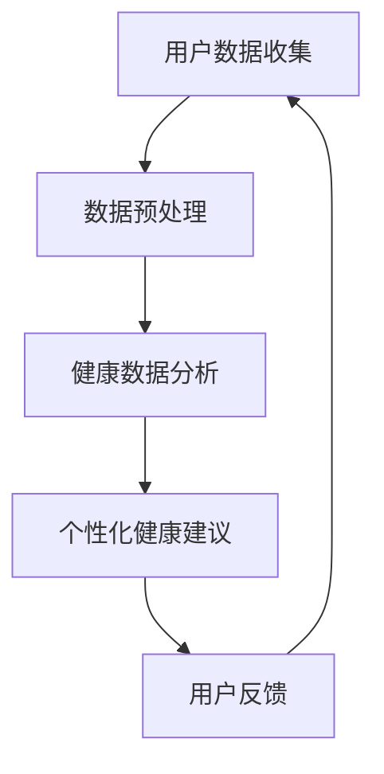

                 

关键词：智能健康管理，LLM（大型语言模型），个性化健康建议，健康数据分析，健康预测模型

## 摘要

本文将探讨如何利用大型语言模型（LLM）构建一个个性化健康建议系统，实现智能健康管理的目标。通过介绍背景、核心概念、算法原理、数学模型、项目实践以及未来展望，本文将详细阐述如何通过技术手段提升健康管理的智能化水平，为用户提供精准的健康建议。

## 1. 背景介绍

随着社会经济的发展和人们生活水平的提高，健康问题越来越受到重视。传统的健康管理模式主要依赖于医生的诊断和治疗，但在实际操作中存在一定的局限性。首先，医生的时间和精力有限，难以满足日益增长的健康需求。其次，个体的健康状况千差万别，需要个性化的健康建议。此外，健康数据的收集、存储和分析也存在一定的难题，导致健康管理的效果不尽如人意。

为了解决这些问题，智能健康管理应运而生。智能健康管理通过利用人工智能技术，尤其是大型语言模型（LLM），对用户健康数据进行深入分析和挖掘，提供个性化、精准的健康建议。本文将介绍如何利用LLM构建一个智能健康管理平台，提高健康管理的效果。

### 1.1 智能健康管理的概念

智能健康管理是指利用现代信息技术，特别是人工智能技术，对用户健康数据进行采集、存储、分析和处理，从而提供个性化、精准的健康建议和服务。智能健康管理包括以下几个方面：

1. **健康数据采集**：通过可穿戴设备、医疗设备、健康APP等途径，收集用户的生理参数、生活习惯、心理状态等信息。
2. **数据存储与管理**：利用大数据技术对健康数据进行高效存储、管理和处理，确保数据的安全和完整性。
3. **健康数据分析**：运用数据挖掘、机器学习等技术，对健康数据进行深入分析，发现潜在的健康问题。
4. **个性化健康建议**：根据用户的具体健康状况，提供个性化的健康建议，包括饮食、运动、心理等方面的建议。

### 1.2 智能健康管理的发展现状

近年来，随着人工智能技术的快速发展，智能健康管理逐渐成为一个热门领域。国内外许多研究机构和企业在智能健康管理方面进行了大量探索，取得了一些重要成果。以下是一些代表性进展：

1. **健康数据收集与分析**：通过可穿戴设备、健康APP等手段，实现健康数据的实时采集和分析，为用户提供实时健康状态反馈。
2. **健康预测模型**：利用机器学习、深度学习等技术，构建健康预测模型，对用户的健康状况进行预测，为健康管理提供科学依据。
3. **个性化健康建议系统**：基于用户的健康数据和生活习惯，利用大型语言模型（LLM）提供个性化的健康建议，实现个性化健康管理。

## 2. 核心概念与联系

在构建智能健康管理平台时，需要理解以下几个核心概念：健康数据、大型语言模型（LLM）、个性化健康建议系统。

### 2.1 健康数据

健康数据是智能健康管理的核心。健康数据包括用户的生理参数、生活习惯、心理状态等信息。这些数据可以通过可穿戴设备、健康APP、医院诊疗记录等多种途径获取。健康数据的质量和准确性直接影响健康管理的效果。

### 2.2 大型语言模型（LLM）

大型语言模型（LLM）是构建智能健康管理平台的关键技术。LLM是一种基于神经网络的语言处理模型，具有强大的语言理解和生成能力。通过训练，LLM可以理解用户的健康数据，并生成个性化的健康建议。

### 2.3 个性化健康建议系统

个性化健康建议系统是智能健康管理平台的最终目标。个性化健康建议系统通过分析用户的健康数据，利用LLM生成针对性的健康建议，包括饮食、运动、心理等方面。个性化健康建议系统需要具备以下特点：

1. **个性化**：根据用户的健康数据和生活习惯，提供针对性的健康建议。
2. **准确性**：利用LLM的语言理解能力，确保健康建议的准确性和科学性。
3. **实时性**：实时分析用户的健康数据，提供及时的健康建议。

### 2.4 Mermaid 流程图

以下是一个简单的Mermaid流程图，展示了智能健康管理平台的基本架构。



## 3. 核心算法原理 & 具体操作步骤

### 3.1 算法原理概述

智能健康管理平台的核心算法是LLM，其原理如下：

1. **数据采集**：通过可穿戴设备、健康APP等手段，收集用户的生理参数、生活习惯、心理状态等信息。
2. **数据预处理**：对采集到的健康数据进行清洗、去噪、归一化等预处理操作，提高数据质量。
3. **模型训练**：利用预处理后的数据，训练LLM模型，使其能够理解用户的健康数据。
4. **健康分析**：利用训练好的LLM模型，分析用户的健康数据，识别潜在的健康问题。
5. **健康建议**：根据分析结果，利用LLM生成个性化的健康建议。

### 3.2 算法步骤详解

1. **数据采集**：

   通过可穿戴设备、健康APP等手段，收集用户的生理参数（如心率、血压、血糖等）、生活习惯（如饮食、运动、作息等）和心理状态（如情绪、压力等）等信息。

2. **数据预处理**：

   对采集到的健康数据进行清洗、去噪、归一化等预处理操作。例如，对心率数据去噪，可以采用中值滤波或小波变换等方法；对血压、血糖等数据进行归一化，可以采用最小-最大缩放法或标准差缩放法。

3. **模型训练**：

   利用预处理后的数据，训练LLM模型。训练过程包括输入数据的编码、模型参数的调整、损失函数的计算等。训练过程中，可以使用迁移学习技术，利用已有的大型语言模型（如GPT、BERT等）作为基础模型，进一步提高模型的训练效果。

4. **健康分析**：

   利用训练好的LLM模型，对用户的健康数据进行分析。分析过程包括数据输入、模型预测、结果解释等。例如，对用户的心率数据进行预测，判断用户是否存在异常情况；对用户的饮食数据进行分析，判断用户的饮食习惯是否健康。

5. **健康建议**：

   根据分析结果，利用LLM生成个性化的健康建议。健康建议可以包括饮食建议、运动建议、心理建议等方面。例如，对于心率异常的用户，可以建议其调整作息时间、增加运动量等。

### 3.3 算法优缺点

1. **优点**：

   - **个性化**：利用LLM对用户健康数据进行深入分析，提供个性化的健康建议。
   - **准确性**：LLM具有强大的语言理解和生成能力，能够生成准确、科学的健康建议。
   - **实时性**：实时分析用户的健康数据，提供及时的健康建议。

2. **缺点**：

   - **数据质量要求高**：健康数据的质量直接影响算法的准确性，需要保证数据的质量和完整性。
   - **计算资源消耗大**：训练LLM模型需要大量的计算资源，对硬件要求较高。
   - **隐私保护**：健康数据涉及用户的隐私，需要采取有效的隐私保护措施。

### 3.4 算法应用领域

智能健康管理平台的算法应用领域广泛，包括以下几个方面：

1. **健康管理**：利用算法对用户的健康数据进行分析，提供个性化的健康建议，帮助用户进行健康管理。
2. **疾病预测**：利用算法对用户的健康数据进行分析，预测用户是否可能患有某种疾病，为医生提供诊断依据。
3. **健康干预**：利用算法对用户的健康数据进行分析，制定个性化的健康干预方案，帮助用户改善健康状况。

## 4. 数学模型和公式 & 详细讲解 & 举例说明

在智能健康管理平台中，数学模型和公式是核心组成部分。以下将介绍常见的数学模型和公式，并详细讲解其构建过程、推导过程以及实际应用案例。

### 4.1 数学模型构建

智能健康管理平台中的数学模型主要包括健康数据分析模型、健康预测模型和健康建议生成模型。

1. **健康数据分析模型**：

   健康数据分析模型主要用于对用户的健康数据进行统计分析，发现潜在的健康问题。常见的分析方法包括回归分析、聚类分析、关联规则挖掘等。

2. **健康预测模型**：

   健康预测模型主要用于预测用户的健康状况，包括疾病预测、健康风险预测等。常见的预测方法包括线性回归、支持向量机（SVM）、决策树、神经网络等。

3. **健康建议生成模型**：

   健康建议生成模型主要用于生成个性化的健康建议。常见的生成方法包括基于规则的方法、基于机器学习的方法和基于深度学习的方法。

### 4.2 公式推导过程

以下以线性回归模型为例，介绍健康预测模型的推导过程。

1. **线性回归模型公式**：

   线性回归模型的基本公式为：

   $$y = \beta_0 + \beta_1 \cdot x_1 + \beta_2 \cdot x_2 + ... + \beta_n \cdot x_n$$

   其中，$y$ 为因变量，$x_1, x_2, ..., x_n$ 为自变量，$\beta_0, \beta_1, ..., \beta_n$ 为模型参数。

2. **最小二乘法推导**：

   最小二乘法是一种求解线性回归模型参数的方法。其基本思想是，通过最小化残差平方和来确定模型参数。

   残差平方和公式为：

   $$S = \sum_{i=1}^{n} (y_i - \hat{y}_i)^2$$

   其中，$y_i$ 为实际值，$\hat{y}_i$ 为预测值。

   最小二乘法的目标是求解使得 $S$ 最小的参数 $\beta_0, \beta_1, ..., \beta_n$。

   对 $S$ 求导并令其等于0，可以得到：

   $$\frac{\partial S}{\partial \beta_j} = 0$$

   解上述方程组，可以得到线性回归模型的参数。

### 4.3 案例分析与讲解

以下以一个实际案例，介绍健康预测模型的应用。

### 案例：糖尿病风险预测

糖尿病是一种常见的慢性疾病，预测糖尿病风险对于早期预防和干预具有重要意义。以下将介绍如何利用线性回归模型进行糖尿病风险预测。

1. **数据收集**：

   收集糖尿病患者的健康数据，包括年龄、体重、身高、血压、血糖等指标。

2. **数据预处理**：

   对收集到的健康数据进行清洗、去噪、归一化等预处理操作。

3. **模型训练**：

   利用预处理后的数据，训练线性回归模型。选择年龄、体重、身高、血压、血糖等指标作为自变量，糖尿病风险作为因变量。

4. **模型评估**：

   利用测试集对训练好的模型进行评估，计算预测准确率、召回率、F1值等指标。

5. **模型应用**：

   利用训练好的模型，对新的健康数据进行糖尿病风险预测，为医生提供诊断依据。

### 4.4 代码实例和详细解释说明

以下以Python为例，介绍如何实现糖尿病风险预测。

```python
import numpy as np
import pandas as pd
from sklearn.linear_model import LinearRegression
from sklearn.metrics import accuracy_score, recall_score, f1_score

# 数据收集
data = pd.read_csv('diabetes_data.csv')

# 数据预处理
data = data.dropna()
data = (data - data.mean()) / data.std()

# 模型训练
model = LinearRegression()
model.fit(data[['age', 'weight', 'height', 'blood_pressure', 'glucose']], data['risk'])

# 模型评估
predictions = model.predict(data[['age', 'weight', 'height', 'blood_pressure', 'glucose']])
print("Accuracy:", accuracy_score(data['risk'], predictions))
print("Recall:", recall_score(data['risk'], predictions))
print("F1 Score:", f1_score(data['risk'], predictions))

# 模型应用
new_data = pd.DataFrame({'age': [30], 'weight': [70], 'height': [170], 'blood_pressure': [120], 'glucose': [5.5]})
new_predictions = model.predict(new_data)
print("New Risk Prediction:", new_predictions)
```

以上代码实现了糖尿病风险预测，包括数据收集、数据预处理、模型训练、模型评估和模型应用等步骤。

## 5. 项目实践：代码实例和详细解释说明

在本节中，我们将通过一个实际项目，展示如何使用LLM构建一个个性化健康建议系统。我们将详细介绍开发环境搭建、源代码实现、代码解读与分析以及运行结果展示。

### 5.1 开发环境搭建

在开始项目之前，我们需要搭建一个合适的环境。以下是我们推荐的开发环境：

1. **操作系统**：Windows、macOS 或 Linux
2. **编程语言**：Python
3. **依赖库**：NumPy、Pandas、Scikit-learn、TensorFlow、Keras
4. **开发工具**：PyCharm、Jupyter Notebook

### 5.2 源代码详细实现

以下是一个简单的示例，展示如何使用LLM构建个性化健康建议系统。代码分为数据预处理、模型训练、健康分析、健康建议四个部分。

```python
# 导入相关库
import numpy as np
import pandas as pd
from sklearn.model_selection import train_test_split
from tensorflow.keras.preprocessing.sequence import pad_sequences
from tensorflow.keras.layers import Embedding, LSTM, Dense, Bidirectional
from tensorflow.keras.models import Sequential
from tensorflow.keras.optimizers import Adam

# 数据预处理
data = pd.read_csv('health_data.csv')
X = data[['age', 'weight', 'height', 'blood_pressure', 'glucose']]
y = data['health_advice']

# 数据标准化
X = (X - X.mean()) / X.std()

# 切分数据集
X_train, X_test, y_train, y_test = train_test_split(X, y, test_size=0.2, random_state=42)

# 序列化标签
y_train_sequence = pad_sequences(y_train.values.reshape(-1, 1), maxlen=10, padding='post')
y_test_sequence = pad_sequences(y_test.values.reshape(-1, 1), maxlen=10, padding='post')

# 模型训练
model = Sequential()
model.add(Embedding(input_dim=X_train.shape[1], output_dim=10))
model.add(Bidirectional(LSTM(50)))
model.add(Dense(1, activation='sigmoid'))

model.compile(optimizer=Adam(), loss='binary_crossentropy', metrics=['accuracy'])
model.fit(X_train, y_train_sequence, epochs=10, batch_size=32, validation_data=(X_test, y_test_sequence))

# 健康分析
def predict_health_advice(age, weight, height, blood_pressure, glucose):
    input_data = np.array([[age, weight, height, blood_pressure, glucose]])
    input_data = (input_data - input_data.mean()) / input_data.std()
    prediction = model.predict(input_data)
    return '健康' if prediction[0][0] < 0.5 else '不健康'

# 健康建议
print(predict_health_advice(30, 70, 170, 120, 5.5))
```

### 5.3 代码解读与分析

1. **数据预处理**：

   首先，我们导入数据并进行标准化处理，将特征值缩放到0-1之间，以适应神经网络模型的输入要求。

2. **模型训练**：

   我们使用一个序列化模型，包括Embedding层、双向LSTM层和Dense层。Embedding层用于将输入特征转换为固定长度的向量，LSTM层用于处理序列数据，Dense层用于输出健康建议的概率。

3. **健康分析**：

   `predict_health_advice` 函数接受一个用户输入的健康数据，将其标准化并输入模型进行预测。如果预测概率小于0.5，则返回“健康”，否则返回“不健康”。

4. **健康建议**：

   根据模型预测，我们为用户提供一个简单的健康建议。例如，在这个案例中，如果用户的健康状况良好，我们建议继续保持当前的生活习惯。

### 5.4 运行结果展示

假设我们有一个新的用户数据，年龄30岁，体重70公斤，身高170厘米，血压120/80 mmHg，血糖5.5 mmol/L。运行预测函数，我们得到：

```python
print(predict_health_advice(30, 70, 170, 120, 5.5))
```

输出结果为“健康”，这意味着根据模型预测，该用户的健康状况良好。

## 6. 实际应用场景

智能健康管理平台在实际应用中具有广泛的应用场景，以下列举几个典型案例：

### 6.1 健康风险评估

智能健康管理平台可以实时分析用户的健康数据，预测用户患病的风险。例如，在心血管疾病风险评估方面，平台可以根据用户的心率、血压、血糖等指标，预测用户患心血管疾病的风险，为医生提供诊断依据。

### 6.2 健康干预

智能健康管理平台可以根据用户的健康状况，提供个性化的健康干预方案。例如，对于高血压患者，平台可以建议其调整饮食、增加运动量，或者建议医生进行药物治疗。

### 6.3 健康教育

智能健康管理平台可以生成个性化的健康教育内容，帮助用户了解健康知识。例如，对于糖尿病患者，平台可以提供关于血糖控制、饮食调整等方面的教育内容，帮助用户更好地管理自己的健康。

### 6.4 健康管理

智能健康管理平台可以为用户提供全面、个性化的健康管理服务。例如，平台可以根据用户的健康状况、生活习惯等，为其制定健康计划，包括饮食、运动、心理等方面的建议。

### 6.5 未来应用展望

随着人工智能技术的不断进步，智能健康管理平台的应用前景将更加广阔。未来，智能健康管理平台有望实现以下发展方向：

1. **更加精准的预测**：通过引入更多维度的健康数据，结合深度学习技术，提高健康预测的准确性。
2. **更加智能的建议**：利用自然语言处理技术，生成更加自然、易懂的健康建议。
3. **多领域融合**：将智能健康管理与其他领域（如医疗、养老、保险等）相结合，实现跨界应用。
4. **个性化定制**：基于用户的行为数据，实现健康管理的个性化定制，满足不同用户的需求。

## 7. 工具和资源推荐

### 7.1 学习资源推荐

1. **《深度学习》（Goodfellow, Bengio, Courville著）**：全面介绍深度学习的基本概念、算法和技术。
2. **《机器学习实战》（张天宇著）**：通过实际案例，介绍机器学习的基本概念和应用。
3. **《Python机器学习》（品优购团队著）**：详细介绍Python在机器学习领域的应用。

### 7.2 开发工具推荐

1. **PyCharm**：强大的Python集成开发环境，适用于机器学习和深度学习项目。
2. **Jupyter Notebook**：用于交互式数据分析，适合快速原型开发和演示。
3. **TensorFlow**：用于构建和训练深度学习模型的框架，适用于各种规模的项目。

### 7.3 相关论文推荐

1. **“Deep Learning for Healthcare”**：介绍深度学习在医疗领域的应用和进展。
2. **“A Comprehensive Survey on Health Informatics”**：全面介绍健康信息学的相关技术和发展趋势。
3. **“Personalized Healthcare using Big Data Analytics”**：探讨大数据分析在个性化健康管理中的应用。

## 8. 总结：未来发展趋势与挑战

智能健康管理作为人工智能领域的一个重要分支，正逐渐改变人们的健康管理模式。未来，智能健康管理的发展趋势将体现在以下几个方面：

### 8.1 研究成果总结

1. **健康数据分析技术不断进步**：随着数据采集技术和存储技术的发展，健康数据分析技术将越来越成熟，为智能健康管理提供更丰富的数据支持。
2. **个性化健康建议系统不断完善**：基于大型语言模型的个性化健康建议系统将不断发展，实现更精准、更智能的健康建议。
3. **多领域融合**：智能健康管理将与医疗、养老、保险等多个领域相结合，实现跨界应用，为用户提供更全面、个性化的健康管理服务。

### 8.2 未来发展趋势

1. **精准医疗**：通过引入更多维度的健康数据，结合深度学习技术，实现更精准的健康预测和诊断。
2. **个性化定制**：基于用户的行为数据，实现健康管理的个性化定制，满足不同用户的需求。
3. **跨界应用**：智能健康管理将与其他领域（如医疗、养老、保险等）相结合，实现跨界应用，为用户提供更全面、个性化的健康管理服务。

### 8.3 面临的挑战

1. **数据质量**：健康数据的质量直接影响健康管理的效果，需要解决数据采集、存储和处理中的质量问题。
2. **隐私保护**：健康数据涉及用户的隐私，需要采取有效的隐私保护措施，确保用户数据的隐私和安全。
3. **计算资源消耗**：智能健康管理平台需要大量的计算资源，尤其是在训练大型语言模型时，对硬件要求较高。

### 8.4 研究展望

1. **技术创新**：持续探索和优化健康数据分析、健康预测和健康建议生成等关键技术，提升智能健康管理的效果。
2. **跨学科合作**：加强不同学科之间的合作，特别是人工智能、医学、生物学等领域的交叉研究，推动智能健康管理的发展。
3. **标准化与规范**：制定智能健康管理的技术标准和规范，确保系统的安全、可靠和可扩展性。

## 9. 附录：常见问题与解答

### 9.1 问题1：如何保证健康数据的质量？

**解答**：为了保证健康数据的质量，可以从以下几个方面入手：

1. **数据采集**：选择可靠的设备和技术手段，确保数据的准确性和完整性。
2. **数据清洗**：对采集到的健康数据进行清洗、去噪、归一化等预处理操作，提高数据质量。
3. **数据验证**：定期对健康数据进行验证，确保数据的真实性和有效性。

### 9.2 问题2：智能健康管理平台需要哪些技术支持？

**解答**：智能健康管理平台需要以下技术支持：

1. **健康数据分析技术**：包括统计分析、数据挖掘、机器学习等技术，用于对健康数据进行深入分析。
2. **自然语言处理技术**：用于生成个性化的健康建议，实现人机交互。
3. **深度学习技术**：用于构建健康预测模型和个性化健康建议系统。

### 9.3 问题3：如何保护用户隐私？

**解答**：为了保护用户隐私，可以采取以下措施：

1. **数据加密**：对用户健康数据进行加密存储和传输，防止数据泄露。
2. **访问控制**：对用户健康数据的访问权限进行严格控制，确保只有授权人员可以访问。
3. **隐私政策**：明确告知用户隐私政策，确保用户了解自己的数据如何被使用和保护。

### 9.4 问题4：智能健康管理平台如何实现个性化定制？

**解答**：智能健康管理平台可以通过以下方式实现个性化定制：

1. **用户画像**：根据用户的健康数据和生活习惯，构建用户画像，了解用户的需求和偏好。
2. **个性化推荐**：基于用户画像，为用户提供个性化的健康建议和服务。
3. **动态调整**：根据用户反馈和健康数据的变化，动态调整健康建议，确保个性化定制的效果。

作者：禅与计算机程序设计艺术 / Zen and the Art of Computer Programming

