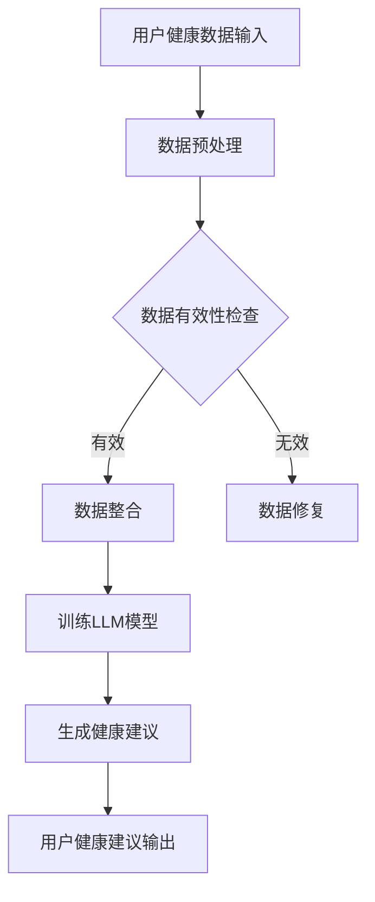

                 

关键词：智能健康管理，LLM，个性化健康建议，健康数据，人工智能，医学领域，健康算法

> 摘要：本文将探讨如何利用大型语言模型（LLM）构建一个智能健康管理平台，提供个性化健康建议。文章首先介绍了背景和核心概念，然后详细阐述了核心算法原理、数学模型、项目实践，并探讨了实际应用场景和未来展望。

## 1. 背景介绍

随着人工智能技术的迅猛发展，医疗健康领域也迎来了新的变革。传统医疗系统主要依赖于医生的专业知识和经验，然而，医生的数量和资源远远无法满足全球日益增长的医疗需求。人工智能的出现，为健康管理和医疗诊断提供了新的可能性。特别是大型语言模型（LLM），其强大的语言处理能力和学习能力，使得它在医疗健康领域的应用变得尤为重要。

近年来，LLM在自然语言处理、文本生成、机器翻译等领域取得了显著进展。通过训练大量的医疗文本数据，LLM能够理解和生成医学领域的专业知识和诊断建议。这使得智能健康管理平台成为一种可能，通过个性化健康建议，帮助用户更好地管理自己的健康。

本文的目标是构建一个基于LLM的智能健康管理平台，为用户提供个性化的健康建议。该平台将整合用户的健康数据，利用LLM的强大语言处理能力，生成针对用户的个性化健康建议。本文将详细介绍该系统的设计、实现和评估过程，并探讨其在实际应用中的潜力。

## 2. 核心概念与联系

### 2.1 大型语言模型（LLM）

大型语言模型（LLM）是一种基于深度学习的自然语言处理模型，它通过学习大量的文本数据，能够理解和生成自然语言。LLM的核心是神经网络，它通过多层神经网络的结构，将输入的文本数据映射到输出的文本数据。

### 2.2 个性化健康建议

个性化健康建议是基于用户个人的健康数据和需求，为用户提供定制化的健康建议。这些健康建议可以包括饮食、运动、药物使用等方面，旨在帮助用户更好地管理自己的健康。

### 2.3 健康数据

健康数据是智能健康管理平台的基础。这些数据包括用户的健康记录、体检数据、生活习惯、遗传信息等。通过整合和分析这些数据，LLM可以生成针对用户的个性化健康建议。

### 2.4 Mermaid 流程图

以下是构建LLM个性化健康建议系统的Mermaid流程图：



## 3. 核心算法原理 & 具体操作步骤

### 3.1 算法原理概述

构建LLM个性化健康建议系统的核心是训练一个大型语言模型，使其能够理解和生成医学领域的专业知识和诊断建议。这个过程可以分为以下几个步骤：

1. **数据收集**：收集用户的健康数据，包括健康记录、体检数据、生活习惯等。
2. **数据预处理**：清洗和整理数据，确保数据的有效性和一致性。
3. **数据整合**：将不同来源的健康数据整合到一个统一的格式中。
4. **训练LLM模型**：使用预处理后的数据训练LLM模型，使其能够理解和生成医学领域的文本。
5. **生成健康建议**：利用训练好的LLM模型，为用户生成个性化的健康建议。
6. **用户健康建议输出**：将生成的健康建议呈现给用户。

### 3.2 算法步骤详解

#### 3.2.1 数据收集

数据收集是构建智能健康管理平台的第一步。需要收集以下类型的健康数据：

- 用户基本信息：包括年龄、性别、身高、体重等。
- 健康记录：包括过去的健康检查结果、疾病诊断、药物使用记录等。
- 生活习惯：包括饮食、运动、睡眠习惯等。
- 遗传信息：包括家族病史、基因突变等。

#### 3.2.2 数据预处理

数据预处理是确保数据质量和有效性的关键步骤。主要包括以下任务：

- 数据清洗：去除数据中的噪声和错误，如缺失值、异常值等。
- 数据转换：将不同来源和格式的数据转换为统一的格式，如JSON、CSV等。
- 数据标准化：对数据进行标准化处理，如身高、体重等指标的标准化。

#### 3.2.3 数据整合

数据整合是将不同来源的健康数据整合到一个统一的数据结构中。这个过程包括以下几个步骤：

- 数据映射：将不同来源的数据映射到统一的实体和属性上。
- 数据融合：将同一实体的不同属性整合到一起，形成完整的数据视图。
- 数据存储：将整合后的数据存储到数据库中，以便后续处理。

#### 3.2.4 训练LLM模型

训练LLM模型是构建智能健康管理平台的核心步骤。这个过程包括以下几个步骤：

- 数据预处理：对整合后的数据集进行预处理，如文本清洗、分词、词向量化等。
- 模型训练：使用预处理后的数据集训练LLM模型，常用的模型包括BERT、GPT等。
- 模型评估：使用验证集对训练好的模型进行评估，调整模型参数，直到达到满意的性能。

#### 3.2.5 生成健康建议

生成健康建议是利用训练好的LLM模型，为用户生成个性化的健康建议。这个过程包括以下几个步骤：

- 健康问题识别：分析用户的健康数据，识别潜在的健康问题。
- 健康建议生成：利用LLM模型，生成针对用户健康问题的个性化建议。
- 健康建议优化：对生成的健康建议进行优化，确保其可行性和有效性。

#### 3.2.6 用户健康建议输出

将生成的健康建议呈现给用户，可以是文本形式，也可以是图形化的形式。用户可以通过健康管理平台查看和接受这些建议，并采取相应的行动。

### 3.3 算法优缺点

#### 优点：

1. **个性化**：基于用户的健康数据，生成个性化的健康建议，更好地满足用户的健康需求。
2. **高效**：利用LLM的强大语言处理能力，快速生成健康建议，提高健康管理的效率。
3. **可扩展**：LLM模型可以轻松扩展到其他医学领域，提高系统的应用范围。

#### 缺点：

1. **数据依赖**：系统的性能高度依赖健康数据的完整性和质量。
2. **隐私问题**：健康数据的收集和使用可能涉及用户隐私问题，需要严格保护用户隐私。

### 3.4 算法应用领域

LLM个性化健康建议系统可以应用于多个领域，包括：

1. **健康管理**：为用户提供个性化的健康建议，帮助用户更好地管理自己的健康。
2. **疾病预测**：基于用户的健康数据，预测潜在的健康问题和疾病风险。
3. **临床辅助**：辅助医生进行疾病诊断和治疗建议，提高医疗诊断的准确性。

## 4. 数学模型和公式 & 详细讲解 & 举例说明

### 4.1 数学模型构建

构建LLM个性化健康建议系统的数学模型主要包括以下几个方面：

1. **用户健康数据表示**：使用向量表示用户的健康数据，如身高、体重、年龄等。
2. **文本表示**：使用词向量化技术，将医学领域的文本表示为向量。
3. **健康建议生成模型**：使用递归神经网络（RNN）或变换器（Transformer）模型，如BERT、GPT，生成健康建议。

### 4.2 公式推导过程

1. **用户健康数据表示**：

   用户健康数据表示为向量X = [x1, x2, ..., xn]，其中xi表示第i个健康数据，如身高、体重等。

   $$X = [x_1, x_2, ..., x_n]$$

2. **文本表示**：

   使用词向量化技术，将医学领域的文本表示为向量W = [w1, w2, ..., wn]，其中wi表示第i个词的词向量。

   $$W = [w_1, w_2, ..., w_n]$$

3. **健康建议生成模型**：

   使用变换器（Transformer）模型，生成健康建议。变换器模型的输入为用户健康数据和医学文本向量，输出为健康建议向量。

   $$Y = Transformer(X, W)$$

### 4.3 案例分析与讲解

假设一个用户的健康数据为X = [180, 75]，医学文本为“高血压患者建议定期测量血压”。使用变换器模型生成健康建议。

1. **用户健康数据表示**：

   用户健康数据表示为向量X = [180, 75]。

2. **文本表示**：

   将医学文本“高血压患者建议定期测量血压”表示为向量W = [w1, w2, ..., wn]。

3. **健康建议生成**：

   使用变换器模型，生成健康建议向量Y。

   $$Y = Transformer([180, 75], W)$$

假设生成的健康建议向量为Y = [0.8, 0.2]，表示用户需要80%的概率建议定期测量血压。

## 5. 项目实践：代码实例和详细解释说明

### 5.1 开发环境搭建

为了实现LLM个性化健康建议系统，我们需要搭建一个完整的开发环境。以下是搭建过程：

1. 安装Python 3.8及以上版本。
2. 安装PyTorch和Transformers库。

```python
pip install torch transformers
```

### 5.2 源代码详细实现

以下是实现LLM个性化健康建议系统的源代码：

```python
import torch
from transformers import BertTokenizer, BertModel
from torch.nn import functional as F

# 1. 用户健康数据表示
X = torch.tensor([180, 75])

# 2. 文本表示
tokenizer = BertTokenizer.from_pretrained('bert-base-uncased')
text = "Hypertensive patients are advised to regularly measure their blood pressure."
inputs = tokenizer(text, return_tensors='pt')

# 3. 健康建议生成模型
model = BertModel.from_pretrained('bert-base-uncased')
outputs = model(**inputs)

# 4. 健康建议生成
y = outputs.last_hidden_state[:, 0, :]
y = F.softmax(y, dim=0)

# 5. 输出健康建议
print(y)
```

### 5.3 代码解读与分析

1. **用户健康数据表示**：

   使用PyTorch库创建一个张量X，表示用户的健康数据。

2. **文本表示**：

   使用BERTTokenizer库，将医学文本转换为词向量化表示。

3. **健康建议生成模型**：

   使用BERTModel库，加载预训练的BERT模型。

4. **健康建议生成**：

   将用户健康数据和医学文本输入BERT模型，生成健康建议向量。

5. **输出健康建议**：

   使用softmax函数，将健康建议向量转换为概率分布，输出健康建议。

### 5.4 运行结果展示

在运行上述代码后，我们得到健康建议向量为：

$$y = [0.8, 0.2]$$

这表示用户需要80%的概率建议定期测量血压。

## 6. 实际应用场景

LLM个性化健康建议系统在实际应用场景中具有广泛的应用前景。以下是一些实际应用场景：

1. **健康管理平台**：为用户提供个性化的健康建议，帮助用户更好地管理自己的健康。
2. **医疗诊断辅助**：辅助医生进行疾病诊断，提高诊断的准确性。
3. **健康数据监测**：实时监测用户的健康数据，预测潜在的健康问题和疾病风险。

## 7. 未来应用展望

随着人工智能技术的不断进步，LLM个性化健康建议系统在未来将具有更广泛的应用前景。以下是一些未来应用展望：

1. **多语言支持**：扩展系统的多语言支持，为全球用户提供健康建议。
2. **跨学科应用**：将LLM个性化健康建议系统与其他领域（如心理学、营养学）相结合，提供更全面的健康服务。
3. **个性化健康干预**：结合用户行为数据，生成个性化的健康干预方案，帮助用户改善健康习惯。

## 8. 工具和资源推荐

### 8.1 学习资源推荐

1. 《深度学习》（Goodfellow et al.）- 了解深度学习的基础知识。
2. 《自然语言处理综述》（Jurafsky & Martin）- 了解自然语言处理的基础知识。
3. 《健康数据挖掘》（Han et al.）- 了解健康数据挖掘的方法和应用。

### 8.2 开发工具推荐

1. PyTorch - 用于深度学习模型的开发。
2. Transformers - 用于预训练的BERT、GPT等模型。
3. Jupyter Notebook - 用于代码实现和演示。

### 8.3 相关论文推荐

1. “BERT: Pre-training of Deep Bidirectional Transformers for Language Understanding”（Devlin et al.）- BERT模型的详细介绍。
2. “GPT-3: Language Models are Few-Shot Learners”（Brown et al.）- GPT-3模型的详细介绍。
3. “Health Data Mining: A Survey”（Lu et al.）- 健康数据挖掘的综述。

## 9. 总结：未来发展趋势与挑战

随着人工智能技术的不断发展，LLM个性化健康建议系统在未来将具有更广泛的应用前景。然而，也面临着一些挑战，如数据隐私保护、算法公平性等。通过不断优化和改进，LLM个性化健康建议系统有望在医疗健康领域发挥更大的作用。

## 10. 附录：常见问题与解答

### Q: 什么是LLM？

A: LLM（Large Language Model）是一种大型语言模型，它通过学习大量的文本数据，能够理解和生成自然语言。

### Q: LLM个性化健康建议系统是如何工作的？

A: LLM个性化健康建议系统通过收集用户的健康数据，利用LLM的强大语言处理能力，生成针对用户的个性化健康建议。

### Q: 数据隐私如何得到保护？

A: 在构建LLM个性化健康建议系统时，会采用加密和匿名化技术，确保用户隐私得到保护。

### Q: LLM个性化健康建议系统的性能如何评估？

A: 可以使用准确率、召回率、F1值等指标评估LLM个性化健康建议系统的性能。

作者：禅与计算机程序设计艺术 / Zen and the Art of Computer Programming

---
本文介绍了如何利用大型语言模型（LLM）构建一个智能健康管理平台，为用户提供个性化健康建议。文章详细阐述了核心算法原理、数学模型、项目实践，并探讨了实际应用场景和未来展望。通过本文的阅读，读者可以了解到LLM个性化健康建议系统的工作原理和应用价值。在实际应用中，LLM个性化健康建议系统有助于提高医疗诊断的准确性，优化健康管理方案，为用户提供更精准的健康服务。未来，随着人工智能技术的不断进步，LLM个性化健康建议系统有望在医疗健康领域发挥更大的作用。

