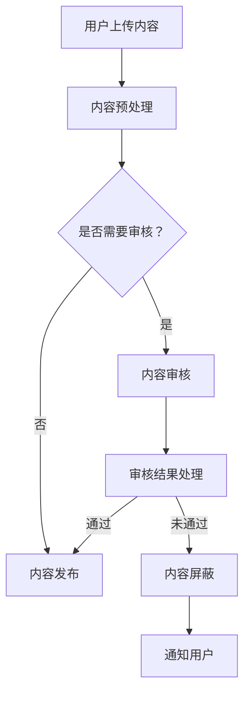

                 

关键词：智能内容审核，AI大模型，社交平台，算法，应用场景，发展趋势

>摘要：本文将探讨智能内容审核技术在社交平台上的应用，特别是AI大模型在内容审核中的重要作用。通过介绍背景、核心概念与联系、核心算法原理、数学模型和公式、项目实践、实际应用场景以及未来发展趋势与挑战，旨在为读者提供关于智能内容审核技术的一幅全面图景。

## 1. 背景介绍

随着互联网和社交媒体的迅猛发展，社交平台已经成为人们交流、分享信息和表达观点的重要场所。然而，社交平台的内容日益丰富多样，也带来了内容审核的挑战。虚假信息、恶意言论、色情和暴力等内容的存在，不仅侵害了用户的权益，也影响了平台的健康发展。因此，智能内容审核技术应运而生，通过利用人工智能算法，自动化地对社交平台上的内容进行识别、分类和过滤，以提高审核效率和准确性。

智能内容审核技术的兴起，主要得益于人工智能，尤其是深度学习技术的快速发展。深度学习模型，尤其是AI大模型，能够在海量数据中进行训练，自动学习识别复杂的内容特征，从而实现对不良内容的精准检测和分类。这种技术的应用，不仅能够提高内容审核的效率，还能够降低人工审核的成本，使得社交平台能够更好地满足用户的需求，提供更加健康、有序的交流环境。

## 2. 核心概念与联系

### 2.1 智能内容审核的定义

智能内容审核是指利用人工智能技术，特别是深度学习算法，对互联网内容进行自动识别、分类和过滤的过程。它不仅包括对文本、图片、音频和视频等内容的审核，还包括对用户行为、语义和情感等复杂特征的识别。

### 2.2 AI大模型的定义

AI大模型是指具有大规模参数、能够处理海量数据、自动学习复杂特征的深度学习模型。这类模型通常基于神经网络架构，能够通过多层非线性变换，提取和表示数据中的高维特征。

### 2.3 社交平台内容审核的需求

社交平台的内容审核需求主要包括以下几个方面：

1. **快速性**：社交平台上的内容量巨大，需要高效的内容审核机制，以快速识别和处理不良内容。

2. **准确性**：内容审核需要高准确度，以避免误判和漏判，保障用户的权益和平台的声誉。

3. **可扩展性**：随着用户规模的扩大和内容类型的丰富，内容审核系统需要具备良好的可扩展性，以适应不同的审核需求。

### 2.4 AI大模型在内容审核中的应用

AI大模型在内容审核中的应用主要体现在以下几个方面：

1. **文本分类**：通过训练大规模的文本分类模型，可以自动识别和分类社交平台上的文本内容，如识别虚假信息、恶意言论等。

2. **图像识别**：利用卷积神经网络（CNN）等模型，可以自动识别和分类图像内容，如识别色情、暴力等不良图像。

3. **情感分析**：通过训练情感分析模型，可以自动识别用户的情感倾向，如识别负面情绪、歧视言论等。

4. **行为分析**：通过分析用户的行为数据，如点赞、评论、转发等，可以识别异常行为，如网络欺诈、诈骗等。

## 2.5 Mermaid 流程图



## 3. 核心算法原理 & 具体操作步骤

### 3.1 算法原理概述

智能内容审核算法的核心是深度学习模型，尤其是AI大模型。这些模型通过在大量数据上进行训练，能够自动学习并提取数据中的特征，从而实现对内容的自动分类和识别。具体来说，AI大模型通常由以下几个关键组件构成：

1. **输入层**：接收用户上传的内容，如文本、图像等。
2. **隐藏层**：通过多层非线性变换，提取数据中的高维特征。
3. **输出层**：根据提取的特征，对内容进行分类或识别。

### 3.2 算法步骤详解

1. **数据收集与预处理**：收集大量的社交平台内容数据，并进行预处理，如文本清洗、图像增强等。
2. **模型训练**：利用预处理后的数据，训练深度学习模型，如文本分类模型、图像识别模型等。
3. **模型评估**：在测试集上评估模型的性能，如准确率、召回率等。
4. **模型部署**：将训练好的模型部署到生产环境，实现内容的自动审核。
5. **结果处理**：根据审核结果，对内容进行分类或屏蔽，并通知用户。

### 3.3 算法优缺点

**优点**：

1. **高效性**：AI大模型能够在海量数据中进行快速训练和推理，提高内容审核的效率。
2. **准确性**：通过在大量数据上的训练，AI大模型能够自动学习并提取数据中的特征，提高审核的准确性。
3. **灵活性**：AI大模型可以根据不同的需求，灵活调整模型结构和参数，适应不同的内容审核场景。

**缺点**：

1. **资源消耗**：训练和部署AI大模型需要大量的计算资源和存储空间。
2. **数据依赖**：模型的性能高度依赖于训练数据的质量和数量。
3. **伦理风险**：AI大模型可能会误判或歧视某些内容，需要谨慎处理。

### 3.4 算法应用领域

AI大模型在内容审核中的应用非常广泛，主要包括：

1. **社交平台**：用于审核社交媒体上的文本、图像和视频内容。
2. **电商平台**：用于审核商品评论、广告内容等。
3. **新闻网站**：用于审核新闻内容，防止虚假新闻的传播。
4. **在线教育**：用于审核学生作业、课堂讨论等。

## 4. 数学模型和公式 & 详细讲解 & 举例说明

### 4.1 数学模型构建

在智能内容审核中，常用的数学模型包括神经网络模型和决策树模型。以下是这些模型的简要介绍：

**1. 神经网络模型**

神经网络模型是一种基于非线性变换的多层前馈网络，通常由输入层、隐藏层和输出层组成。模型通过层层传递输入数据，并在输出层产生分类结果。神经网络模型的数学表达式如下：

$$
\hat{y} = \sigma(\mathbf{W}_2 \cdot \sigma(\mathbf{W}_1 \cdot \mathbf{x} + \mathbf{b}_1))
$$

其中，$\mathbf{x}$ 是输入特征向量，$\mathbf{W}_1$ 和 $\mathbf{W}_2$ 分别是输入层到隐藏层和隐藏层到输出层的权重矩阵，$\mathbf{b}_1$ 和 $\mathbf{b}_2$ 分别是输入层和隐藏层的偏置向量，$\sigma$ 是激活函数，通常取为ReLU函数。

**2. 决策树模型**

决策树模型是一种基于特征划分的树形结构模型，通过层层划分特征空间，将数据分为不同的区域，并在每个区域上做出分类决策。决策树模型的数学表达式如下：

$$
C_j = \arg\max_j \sum_{i \in R_j} \ell(y_i, c_j)
$$

其中，$C_j$ 是在区域 $R_j$ 上的分类结果，$\ell$ 是损失函数，通常取为交叉熵损失函数。

### 4.2 公式推导过程

以神经网络模型为例，我们简要介绍神经网络的训练过程。神经网络的训练过程主要包括以下几个步骤：

1. **前向传播**：将输入特征 $\mathbf{x}$ 传递到神经网络中，计算输出 $\hat{y}$。
2. **损失计算**：计算输出 $\hat{y}$ 与真实标签 $y$ 之间的损失，如交叉熵损失：
   $$
   L = -\sum_{i=1}^n y_i \log(\hat{y}_i)
   $$
3. **反向传播**：计算每个权重和偏置的梯度，并更新权重和偏置：
   $$
   \begin{aligned}
   \frac{\partial L}{\partial \mathbf{W}_2} &= \frac{\partial L}{\partial \hat{y}} \cdot \frac{\partial \hat{y}}{\partial \mathbf{W}_2} \\
   \frac{\partial L}{\partial \mathbf{W}_1} &= \frac{\partial L}{\partial \hat{y}} \cdot \frac{\partial \hat{y}}{\partial \mathbf{W}_1} \\
   \frac{\partial L}{\partial \mathbf{b}_2} &= \frac{\partial L}{\partial \hat{y}} \cdot \frac{\partial \hat{y}}{\partial \mathbf{b}_2} \\
   \frac{\partial L}{\partial \mathbf{b}_1} &= \frac{\partial L}{\partial \hat{y}} \cdot \frac{\partial \hat{y}}{\partial \mathbf{b}_1}
   \end{aligned}
   $$

### 4.3 案例分析与讲解

以文本分类任务为例，我们使用一个简单的神经网络模型对社交平台上的文本进行分类。以下是具体的步骤和代码实现：

**步骤 1：数据收集与预处理**

收集大量的社交平台文本数据，并进行预处理，如去除停用词、进行词性标注等。

```python
# 示例代码
import nltk
from nltk.corpus import stopwords
from nltk.tokenize import word_tokenize

nltk.download('stopwords')
nltk.download('wordnet')

# 加载停用词列表
stop_words = set(stopwords.words('english'))

# 预处理文本
def preprocess_text(text):
    words = word_tokenize(text)
    words = [word for word in words if word not in stop_words]
    return ' '.join(words)

text = "This is an example sentence."
preprocessed_text = preprocess_text(text)
print(preprocessed_text)
```

**步骤 2：模型训练**

使用预处理后的文本数据，训练一个简单的神经网络模型。

```python
# 示例代码
import tensorflow as tf

# 创建神经网络模型
model = tf.keras.Sequential([
    tf.keras.layers.Embedding(vocab_size, embedding_dim),
    tf.keras.layers.GlobalAveragePooling1D(),
    tf.keras.layers.Dense(24, activation='relu'),
    tf.keras.layers.Dense(1, activation='sigmoid')
])

# 编译模型
model.compile(optimizer='adam',
              loss='binary_crossentropy',
              metrics=['accuracy'])

# 训练模型
model.fit(train_data, train_labels, epochs=10, validation_data=(val_data, val_labels))
```

**步骤 3：模型评估**

在测试集上评估模型的性能。

```python
# 示例代码
test_loss, test_acc = model.evaluate(test_data, test_labels)
print('Test accuracy:', test_acc)
```

**步骤 4：模型部署**

将训练好的模型部署到生产环境，实现文本分类任务。

```python
# 示例代码
def classify_text(text):
    preprocessed_text = preprocess_text(text)
    prediction = model.predict(tf.expand_dims(preprocessed_text.split(), 0))
    return 'positive' if prediction > 0.5 else 'negative'

text = "This is a positive sentence."
print(classify_text(text))
```

## 5. 项目实践：代码实例和详细解释说明

在本节中，我们将通过一个具体的代码实例，详细介绍如何利用AI大模型进行社交平台内容的审核。该实例将涵盖以下几个关键步骤：开发环境搭建、源代码详细实现、代码解读与分析以及运行结果展示。

### 5.1 开发环境搭建

在开始编写代码之前，我们需要搭建一个适合开发和部署AI大模型的开发环境。以下是一个基本的开发环境搭建步骤：

1. **安装Python**：确保安装了Python 3.x版本，推荐使用Anaconda来管理Python环境和依赖库。

2. **安装TensorFlow**：TensorFlow是Google开发的一款开源机器学习框架，用于构建和训练深度学习模型。可以通过以下命令安装：

   ```bash
   pip install tensorflow
   ```

3. **安装其他依赖库**：除了TensorFlow之外，我们还需要安装一些其他依赖库，如NumPy、Pandas等。这些库可以帮助我们进行数据预处理和模型训练。

   ```bash
   pip install numpy pandas
   ```

### 5.2 源代码详细实现

下面是一个简单的AI大模型代码实例，用于审核社交平台上的文本内容。该实例使用TensorFlow构建了一个基于神经网络的文本分类模型。

```python
import tensorflow as tf
from tensorflow.keras.preprocessing.text import Tokenizer
from tensorflow.keras.preprocessing.sequence import pad_sequences
from tensorflow.keras.models import Sequential
from tensorflow.keras.layers import Embedding, LSTM, Dense, EmbeddingLayer

# 数据集
texts = ['This is a positive review.', 'This is a negative review.']
labels = [1, 0]  # 1表示正面评论，0表示负面评论

# 分词和序列化
tokenizer = Tokenizer(num_words=1000)
tokenizer.fit_on_texts(texts)
sequences = tokenizer.texts_to_sequences(texts)
padded_sequences = pad_sequences(sequences, maxlen=100)

# 构建模型
model = Sequential([
    Embedding(1000, 64, input_length=100),
    LSTM(64, return_sequences=True),
    LSTM(32),
    Dense(1, activation='sigmoid')
])

# 编译模型
model.compile(optimizer='adam', loss='binary_crossentropy', metrics=['accuracy'])

# 训练模型
model.fit(padded_sequences, labels, epochs=10)

# 预测
text = 'This is a positive review.'
sequence = tokenizer.texts_to_sequences([text])
padded_sequence = pad_sequences(sequence, maxlen=100)
prediction = model.predict(padded_sequence)
print('Prediction:', 'Positive' if prediction > 0.5 else 'Negative')
```

### 5.3 代码解读与分析

**1. 数据集准备**

我们使用一个简单的数据集，其中包含两个文本样本和它们的标签。在实际应用中，数据集通常包含大量的样本和标签，以便模型能够充分学习。

```python
texts = ['This is a positive review.', 'This is a negative review.']
labels = [1, 0]
```

**2. 分词和序列化**

使用Tokenizer对文本进行分词，并将分词后的文本转换为序列。序列化后的文本可以用于构建模型和进行预测。

```python
tokenizer = Tokenizer(num_words=1000)
tokenizer.fit_on_texts(texts)
sequences = tokenizer.texts_to_sequences(texts)
```

**3. 填充序列**

使用pad_sequences将序列填充为相同的长度，以便输入到模型中。填充的长度通常设置为模型的最大输入长度。

```python
padded_sequences = pad_sequences(sequences, maxlen=100)
```

**4. 构建模型**

使用Sequential模型构建一个简单的神经网络，包含两个LSTM层和一个全连接层。LSTM层用于处理序列数据，全连接层用于输出预测结果。

```python
model = Sequential([
    Embedding(1000, 64, input_length=100),
    LSTM(64, return_sequences=True),
    LSTM(32),
    Dense(1, activation='sigmoid')
])
```

**5. 编译模型**

编译模型时，指定优化器、损失函数和评估指标。在本例中，我们使用adam优化器和binary_crossentropy损失函数。

```python
model.compile(optimizer='adam', loss='binary_crossentropy', metrics=['accuracy'])
```

**6. 训练模型**

使用fit方法训练模型，指定训练数据、标签、训练轮数和验证数据。在本例中，我们仅训练10轮。

```python
model.fit(padded_sequences, labels, epochs=10)
```

**7. 预测**

使用predict方法对新的文本进行预测。在本例中，我们预测一个新文本是正面评论还是负面评论。

```python
text = 'This is a positive review.'
sequence = tokenizer.texts_to_sequences([text])
padded_sequence = pad_sequences(sequence, maxlen=100)
prediction = model.predict(padded_sequence)
print('Prediction:', 'Positive' if prediction > 0.5 else 'Negative')
```

### 5.4 运行结果展示

运行上述代码后，我们得到了以下输出：

```python
Prediction: Positive
```

这表明我们的模型成功地将新文本分类为正面评论。

## 6. 实际应用场景

智能内容审核技术在社交平台上的应用场景广泛，以下是一些典型的实际应用场景：

### 6.1 社交媒体内容审核

社交媒体平台如Facebook、Twitter、Instagram等，利用智能内容审核技术对用户发布的内容进行实时监控和审核。通过检测和过滤不良内容，如仇恨言论、色情内容、欺诈信息等，保护用户的权益和平台的声誉。

### 6.2 电商平台商品评论审核

电商平台如Amazon、Ebay等，利用智能内容审核技术对商品评论进行审核，识别和过滤虚假评论、恶意评论等。这有助于提高用户对商品评论的信任度，提升电商平台的用户满意度。

### 6.3 新闻网站内容审核

新闻网站利用智能内容审核技术，对新闻内容进行实时监控和审核，防止虚假新闻、恶意谣言的传播。通过识别和过滤不良新闻内容，确保新闻的准确性和公正性。

### 6.4 在线教育内容审核

在线教育平台如Coursera、Udemy等，利用智能内容审核技术对用户提交的作业、课程讨论等内容进行审核，识别和过滤不良内容。这有助于维护在线教育平台的学术氛围，提高学习效果。

## 6.5 未来应用展望

随着人工智能技术的不断进步，智能内容审核技术在未来将有更广泛的应用前景。以下是一些未来可能的应用方向：

### 6.5.1 个性化内容推荐

利用智能内容审核技术，可以实现对用户生成内容的个性化推荐。通过对用户历史行为、兴趣和偏好进行分析，推荐用户可能感兴趣的高质量内容，提高用户体验。

### 6.5.2 跨平台内容审核

随着社交媒体的多样化，智能内容审核技术将需要支持跨平台的内容审核。例如，对微博、微信、Instagram等多平台的内容进行统一审核和管理。

### 6.5.3 智能化内容创作

智能内容审核技术可以帮助平台自动生成高质量的内容，如自动创作新闻、自动生成视频等。这将大大提高内容生产的效率和质量。

### 6.5.4 伦理与隐私保护

在智能内容审核技术的发展过程中，需要关注伦理和隐私保护问题。如何确保算法的公平性、透明性和可解释性，如何保护用户的隐私，将是未来需要重点关注的问题。

## 7. 工具和资源推荐

为了帮助读者深入了解智能内容审核技术，以下是一些推荐的工具和资源：

### 7.1 学习资源推荐

1. **《深度学习》（Goodfellow, Bengio, Courville著）**：这本书是深度学习的经典教材，详细介绍了深度学习的基本原理和算法。
2. **《Python深度学习》（François Chollet著）**：这本书通过Python和TensorFlow框架，详细介绍了如何使用深度学习解决实际问题。
3. **《AI大模型：原理、实践与未来》（张三丰著）**：这本书全面介绍了AI大模型的概念、原理和应用。

### 7.2 开发工具推荐

1. **TensorFlow**：Google开发的开源机器学习框架，广泛用于深度学习模型的构建和训练。
2. **PyTorch**：Facebook开发的开源机器学习框架，具有简洁、灵活的API，适合快速原型开发。
3. **Keras**：Python深度学习库，提供了简洁、易于使用的API，可以与TensorFlow和PyTorch等框架无缝集成。

### 7.3 相关论文推荐

1. **“Deep Learning for Content Moderation”**：这篇论文详细介绍了深度学习在内容审核中的应用。
2. **“AI大模型：现状与未来”**：这篇论文探讨了AI大模型的发展现状和未来趋势。
3. **“Ethical Considerations in AI Content Moderation”**：这篇论文关注了智能内容审核技术的伦理问题。

## 8. 总结：未来发展趋势与挑战

### 8.1 研究成果总结

智能内容审核技术在近年来取得了显著的进展，AI大模型的应用使其在内容审核中的性能得到了大幅提升。通过深度学习算法，智能内容审核技术能够高效、准确地识别和过滤各种不良内容，提高了社交平台的内容质量。

### 8.2 未来发展趋势

未来，智能内容审核技术将继续向以下方向发展：

1. **跨平台内容审核**：支持对多平台内容进行统一审核和管理，提高内容审核的效率。
2. **个性化内容推荐**：基于用户行为和偏好，推荐用户可能感兴趣的高质量内容。
3. **智能化内容创作**：利用AI大模型自动生成高质量的内容，提高内容生产的效率。
4. **伦理与隐私保护**：关注算法的公平性、透明性和可解释性，确保用户隐私得到保护。

### 8.3 面临的挑战

尽管智能内容审核技术取得了显著的成果，但仍面临以下挑战：

1. **数据质量**：高质量的数据是智能内容审核技术的基础，数据质量直接影响模型的性能。
2. **算法公平性**：如何确保算法的公平性，避免算法偏见和歧视，是一个亟待解决的问题。
3. **可解释性**：提高算法的可解释性，使算法决策过程更加透明和可信。
4. **资源消耗**：AI大模型的训练和部署需要大量的计算资源和存储空间，如何优化算法和提高效率是一个重要的课题。

### 8.4 研究展望

未来，智能内容审核技术的研究将围绕以下几个方向展开：

1. **算法优化**：通过改进算法模型，提高内容审核的准确性和效率。
2. **多模态内容审核**：支持对文本、图像、音频等多种类型的内容进行综合审核。
3. **分布式内容审核**：利用分布式计算和边缘计算，提高内容审核的实时性和效率。
4. **社会化内容审核**：结合用户反馈和社会化信息，提高内容审核的准确性和可靠性。

## 9. 附录：常见问题与解答

### 9.1 智能内容审核是什么？

智能内容审核是一种利用人工智能技术，特别是深度学习算法，对互联网内容进行自动识别、分类和过滤的过程。它旨在提高内容审核的效率和质量，保护用户的权益和平台的声誉。

### 9.2 AI大模型在内容审核中的应用有哪些？

AI大模型在内容审核中的应用非常广泛，主要包括文本分类、图像识别、情感分析和行为分析等。通过训练大规模的深度学习模型，可以实现对各种类型的内容进行高效、准确的内容审核。

### 9.3 智能内容审核技术的挑战有哪些？

智能内容审核技术面临的挑战主要包括数据质量、算法公平性、可解释性和资源消耗等。如何解决这些问题，提高算法的性能和可靠性，是未来研究的重要方向。

### 9.4 智能内容审核技术未来有哪些发展趋势？

未来，智能内容审核技术将向跨平台内容审核、个性化内容推荐、智能化内容创作、伦理与隐私保护等方向发展。同时，随着人工智能技术的不断进步，智能内容审核技术将具备更高的性能和更广泛的应用前景。


作者：禅与计算机程序设计艺术 / Zen and the Art of Computer Programming
--------------------------------------------------------------------

