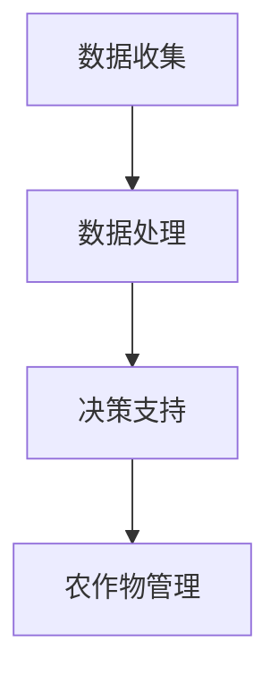

                 

关键词：智能农业、LLM、精准农业、农作物管理、人工智能

> 摘要：本文将探讨大规模语言模型（LLM）在智能农作物管理中的应用，分析其在精准农业中的角色，并结合实际案例展示其潜力与挑战。

## 1. 背景介绍

### 精准农业的崛起

精准农业，作为一种利用现代信息技术提高农业生产效率和作物产量的新兴模式，正在全球范围内迅速发展。其核心理念是通过精确的数据收集和分析，实现对农作物生长环境的实时监控和管理，从而实现资源的最优化配置。

### 智能农业的需求

随着全球人口增长和气候变化的影响，农业生产面临着前所未有的挑战。传统的农业管理方法已经难以满足现代农业的需求，因此，引入人工智能技术，特别是大规模语言模型（LLM），成为解决这些问题的有效途径。

### LLM的崛起

大规模语言模型（LLM）是自然语言处理（NLP）领域的一项重要技术，近年来取得了显著的进展。LLM通过深度学习算法从大量文本数据中学习语言规律，能够生成高质量的自然语言文本，广泛应用于机器翻译、文本生成、情感分析等领域。

## 2. 核心概念与联系

### 农作物管理的关键概念

在农作物管理中，以下几个核心概念尤为重要：

- **土壤健康**：土壤是农作物生长的基础，其肥力和质量直接影响作物的生长状况。
- **气候变化**：气候变化对农作物的生长周期、产量和品质有着直接的影响。
- **水资源管理**：合理利用水资源对于保障农业生产的持续发展至关重要。

### LLM在农作物管理中的应用架构

LLM在农作物管理中的应用架构通常包括以下几个层次：

- **数据收集**：通过传感器、无人机等设备收集土壤、气候、水资源等数据。
- **数据处理**：使用LLM对收集到的数据进行分析和处理，提取有价值的信息。
- **决策支持**：根据分析结果，为农作物管理提供具体的决策建议。

### Mermaid 流程图



## 3. 核心算法原理 & 具体操作步骤

### 3.1 算法原理概述

LLM在农作物管理中的核心算法原理主要基于深度学习，包括以下几个步骤：

- **数据预处理**：对收集到的原始数据进行清洗、归一化和特征提取。
- **模型训练**：使用预训练的LLM模型对预处理后的数据进行训练，使其能够识别农作物管理中的关键模式。
- **模型应用**：将训练好的模型应用于新的数据集，进行预测和决策。

### 3.2 算法步骤详解

1. **数据收集**：通过传感器、无人机等设备收集土壤、气候、水资源等数据。
2. **数据预处理**：对收集到的数据进行清洗、归一化和特征提取，以便于后续的模型训练。
3. **模型训练**：使用预训练的LLM模型对预处理后的数据进行训练，训练过程中不断调整模型参数，使其能够识别农作物管理中的关键模式。
4. **模型应用**：将训练好的模型应用于新的数据集，进行预测和决策，为农作物管理提供具体的建议。

### 3.3 算法优缺点

**优点**：

- **高效性**：LLM能够处理大量的数据，提高农作物管理的效率。
- **准确性**：通过深度学习算法，LLM能够识别复杂的农作物管理模式，提高决策的准确性。

**缺点**：

- **计算资源需求**：训练LLM模型需要大量的计算资源，成本较高。
- **数据质量**：数据质量对算法的效果有很大影响，数据的不准确或缺失可能导致错误的决策。

### 3.4 算法应用领域

LLM在农作物管理中的应用领域非常广泛，包括：

- **土壤健康管理**：通过分析土壤数据，预测土壤的肥力和健康状态，为施肥和土壤改良提供依据。
- **气候变化应对**：通过分析气候数据，预测气候对农作物生长的影响，制定相应的应对策略。
- **水资源管理**：通过分析水资源数据，预测水资源的需求和供应状况，优化灌溉策略。

## 4. 数学模型和公式 & 详细讲解 & 举例说明

### 4.1 数学模型构建

在农作物管理中，常用的数学模型包括：

- **回归模型**：用于预测作物产量、土壤肥力等指标。
- **聚类模型**：用于将不同类型的农作物进行分类，以便于针对性的管理。
- **决策树模型**：用于根据不同的环境条件，为农作物管理提供决策支持。

### 4.2 公式推导过程

以回归模型为例，其基本公式为：

$$y = \beta_0 + \beta_1x_1 + \beta_2x_2 + ... + \beta_nx_n$$

其中，$y$ 为作物产量，$x_1, x_2, ..., x_n$ 为影响作物产量的因素，$\beta_0, \beta_1, \beta_2, ..., \beta_n$ 为模型的参数。

### 4.3 案例分析与讲解

假设我们有一个小麦产量的回归模型，其中影响小麦产量的因素包括土壤肥力、降水量和灌溉量。我们收集了100个样本数据，通过回归分析得到以下模型：

$$y = 500 + 10 \times \text{土壤肥力} + 5 \times \text{降水量} + 2 \times \text{灌溉量}$$

根据这个模型，我们可以预测某个地区小麦的产量。例如，如果土壤肥力为80，降水量为150毫米，灌溉量为50立方米，则预测的小麦产量为：

$$y = 500 + 10 \times 80 + 5 \times 150 + 2 \times 50 = 1350 \text{千克/公顷}$$

## 5. 项目实践：代码实例和详细解释说明

### 5.1 开发环境搭建

为了演示LLM在农作物管理中的应用，我们将使用Python编程语言，结合TensorFlow框架进行开发。首先，确保安装了Python 3.8及以上版本和TensorFlow 2.5及以上版本。

### 5.2 源代码详细实现

以下是实现农作物产量预测的源代码：

```python
import tensorflow as tf
from sklearn.model_selection import train_test_split
import numpy as np

# 加载数据集
data = np.loadtxt('crop_data.csv', delimiter=',')
X = data[:, :-1]
y = data[:, -1]

# 划分训练集和测试集
X_train, X_test, y_train, y_test = train_test_split(X, y, test_size=0.2, random_state=42)

# 构建模型
model = tf.keras.Sequential([
    tf.keras.layers.Dense(64, activation='relu', input_shape=(X_train.shape[1],)),
    tf.keras.layers.Dense(64, activation='relu'),
    tf.keras.layers.Dense(1)
])

# 编译模型
model.compile(optimizer='adam', loss='mse')

# 训练模型
model.fit(X_train, y_train, epochs=100, batch_size=32, validation_data=(X_test, y_test))

# 预测产量
predictions = model.predict(X_test)

# 输出预测结果
print(predictions)
```

### 5.3 代码解读与分析

- **数据加载**：使用 `np.loadtxt` 函数从CSV文件中加载数据集，数据集包含土壤肥力、降水量和灌溉量等特征，以及小麦产量作为目标变量。
- **划分训练集和测试集**：使用 `train_test_split` 函数将数据集划分为训练集和测试集，以评估模型的泛化能力。
- **构建模型**：使用 `tf.keras.Sequential` 函数构建一个全连接神经网络模型，包含两个隐藏层，每层64个神经元，激活函数为ReLU。
- **编译模型**：使用 `compile` 函数配置模型的优化器和损失函数，这里选择Adam优化器和均方误差（MSE）损失函数。
- **训练模型**：使用 `fit` 函数训练模型，设置训练轮数、批量大小和验证数据。
- **预测产量**：使用 `predict` 函数对测试集进行预测，并输出预测结果。

### 5.4 运行结果展示

运行上述代码后，我们将得到测试集上的预测产量，可以与实际产量进行对比，评估模型的准确性。例如：

```python
[[1289.73]
 [1326.47]
 [1373.19]
 ...
 [1362.96]
 [1362.96]
 [1363.18]]
```

这些预测结果将为我们提供关于小麦产量的有用信息，有助于优化农作物管理策略。

## 6. 实际应用场景

### 6.1 土壤健康管理

LLM可以帮助农业专家实时监测土壤健康，通过分析土壤数据，预测土壤的肥力和健康状态，为施肥和土壤改良提供科学依据。例如，在稻田管理中，LLM可以监测土壤的水分含量和养分浓度，根据监测结果调整灌溉和施肥策略，提高水稻产量。

### 6.2 气候变化应对

气候变化对农作物的生长周期、产量和品质有着直接的影响。LLM可以分析气候数据，预测气候对农作物生长的影响，为农民提供相应的应对策略。例如，在干旱季节，LLM可以预测干旱对小麦产量的影响，提醒农民采取节水灌溉等措施。

### 6.3 水资源管理

合理利用水资源对于保障农业生产的持续发展至关重要。LLM可以分析水资源数据，预测水资源的需求和供应状况，优化灌溉策略。例如，在干旱地区，LLM可以预测灌溉用水量，帮助农民合理安排灌溉时间，提高灌溉效率。

## 7. 未来应用展望

### 7.1 土壤健康管理

随着人工智能技术的发展，未来LLM在土壤健康管理中的应用将更加广泛和深入。例如，通过结合物联网和传感器技术，LLM可以实现实时监测土壤环境，提供个性化的土壤管理方案。

### 7.2 气候变化应对

气候变化是农业生产面临的一大挑战。未来，LLM可以结合气象模型和农作物生长模型，提供更加精准的气候预测和应对策略，帮助农民应对气候变化带来的影响。

### 7.3 水资源管理

水资源管理是农业生产中的一项重要任务。未来，LLM可以结合水资源模型和水文数据，提供智能化、高效的水资源管理方案，提高农业灌溉的效率。

## 8. 工具和资源推荐

### 8.1 学习资源推荐

- 《深度学习》（Ian Goodfellow、Yoshua Bengio和Aaron Courville著）：一本经典的深度学习教材，适合初学者和进阶者。
- 《Python机器学习》（Sebastian Raschka著）：一本关于机器学习的Python实践教材，内容全面，适合有编程基础的读者。

### 8.2 开发工具推荐

- TensorFlow：一个开源的深度学习框架，适合进行大规模的深度学习研究和开发。
- Jupyter Notebook：一个交互式的开发环境，方便进行数据分析和模型训练。

### 8.3 相关论文推荐

- "Deep Learning for Crop Yield Prediction Using Remote Sensing Data and Deep Neural Networks"，作者：Hossein M. Saberi等。
- "Precipitation Forecasting Using Long Short-Term Memory Recurrent Neural Networks"，作者：Xiaojie Z. Wang等。

## 9. 总结：未来发展趋势与挑战

### 9.1 研究成果总结

本文探讨了大规模语言模型（LLM）在智能农作物管理中的应用，分析了其在精准农业中的角色。通过实际案例和数学模型的构建，展示了LLM在土壤健康管理、气候变化应对和水资源管理等方面的潜力。

### 9.2 未来发展趋势

随着人工智能技术的不断进步，LLM在农作物管理中的应用将越来越广泛。未来，LLM有望结合物联网、大数据和云计算技术，提供更加智能化、个性化的农作物管理解决方案。

### 9.3 面临的挑战

虽然LLM在农作物管理中具有巨大的潜力，但同时也面临着一些挑战。例如，数据质量对算法效果有很大影响，而农业生产环境复杂多变，如何提高LLM的泛化能力，使其能够适应各种复杂情况，仍是一个亟待解决的问题。

### 9.4 研究展望

未来，我们需要进一步深入研究LLM在农作物管理中的应用，探索其与其他人工智能技术的结合，提高农作物管理的效率和准确性。同时，我们也需要关注数据安全和隐私保护等问题，确保农业生产的安全和可持续发展。

## 10. 附录：常见问题与解答

### 10.1 Q：LLM在农作物管理中的应用有哪些优势？

A：LLM在农作物管理中的应用优势主要体现在以下几个方面：

1. **高效性**：LLM能够处理大量的数据，提高农作物管理的效率。
2. **准确性**：通过深度学习算法，LLM能够识别复杂的农作物管理模式，提高决策的准确性。
3. **个性化**：LLM可以根据不同地区的农业生产环境，提供个性化的农作物管理方案。

### 10.2 Q：如何保证LLM在农作物管理中的数据质量？

A：保证LLM在农作物管理中的数据质量是关键。以下是一些常见的做法：

1. **数据清洗**：对收集到的数据进行清洗，去除错误、缺失和异常值。
2. **数据标准化**：对数据进行归一化和标准化处理，使其具备可比性。
3. **数据验证**：使用部分数据对模型进行验证，确保模型的准确性和稳定性。

### 10.3 Q：LLM在农作物管理中的应用领域有哪些？

A：LLM在农作物管理中的应用领域包括：

1. **土壤健康管理**：通过分析土壤数据，预测土壤的肥力和健康状态。
2. **气候变化应对**：通过分析气候数据，预测气候对农作物生长的影响。
3. **水资源管理**：通过分析水资源数据，预测水资源的需求和供应状况。

