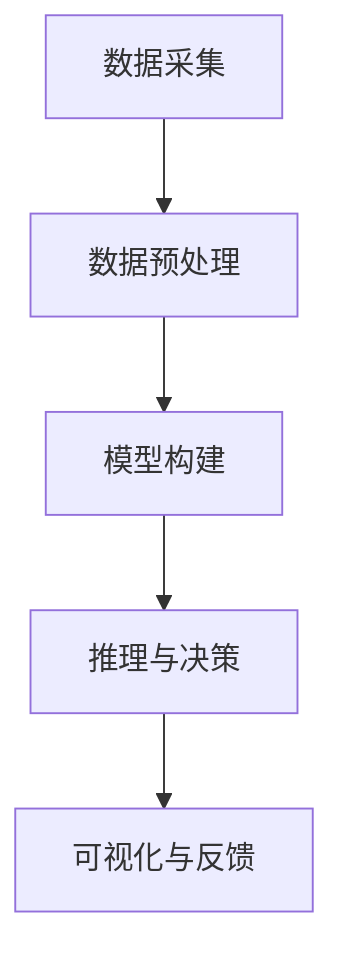

                 

关键词：智能决策支持系统，AI大模型，企业管理，应用场景，未来展望

> 摘要：本文深入探讨了智能决策支持系统的概念及其在企业管理中的应用。通过介绍AI大模型的基本原理和具体实现，分析了智能决策支持系统在企业管理中的关键作用，并展望了其未来发展趋势和面临的挑战。

## 1. 背景介绍

在信息时代，企业面临着前所未有的复杂性和变化速度。传统的决策支持系统已经难以满足现代企业对快速、精准决策的需求。智能决策支持系统（Intelligent Decision Support System，IDSS）作为一种新型决策辅助工具，利用人工智能（Artificial Intelligence，AI）大模型的技术，为企业提供了更为智能和高效的决策支持。

智能决策支持系统结合了人工智能、数据挖掘、机器学习、知识管理等多领域技术，通过数据分析和模式识别，为企业提供实时、动态的决策建议。在企业管理中，智能决策支持系统不仅能够优化决策过程，提高决策质量，还能够降低决策风险，提升企业的竞争力。

## 2. 核心概念与联系

### 2.1 智能决策支持系统的基本概念

智能决策支持系统是一种利用人工智能技术，对大量数据进行分析和推理，为决策者提供智能化决策支持的工具。它包括数据采集、预处理、模型构建、推理和可视化等环节。

### 2.2 AI大模型的基本概念

AI大模型，通常指的是具有大规模参数的深度学习模型，如BERT、GPT等。这些模型通过在海量数据上进行训练，能够捕捉到数据的复杂模式和潜在关系，从而在多种任务上实现高性能。

### 2.3 智能决策支持系统与AI大模型的关系

智能决策支持系统与AI大模型之间存在着紧密的联系。AI大模型作为智能决策支持系统的一部分，通过其强大的数据处理和分析能力，提升了决策支持系统的性能和智能程度。

### 2.4 Mermaid 流程图



## 3. 核心算法原理 & 具体操作步骤

### 3.1 算法原理概述

智能决策支持系统主要基于机器学习和深度学习算法。机器学习算法通过训练数据学习数据分布，并利用这些分布进行预测和决策。深度学习算法则通过多层神经网络，对数据进行非线性变换，提取更高层次的特征。

### 3.2 算法步骤详解

#### 3.2.1 数据采集

数据采集是智能决策支持系统的第一步。数据来源可以是企业内部的数据库、外部数据源、社交媒体等。数据采集过程中需要考虑数据的质量、完整性和实时性。

#### 3.2.2 数据预处理

数据预处理包括数据清洗、归一化、特征提取等步骤。清洗数据是为了去除噪声和异常值；归一化是为了使不同特征之间具有可比性；特征提取是为了提取数据中的关键信息。

#### 3.2.3 模型构建

模型构建是智能决策支持系统的核心。根据具体的决策任务，选择合适的机器学习或深度学习算法，构建模型。常见的算法包括线性回归、决策树、支持向量机、神经网络等。

#### 3.2.4 推理与决策

模型构建完成后，通过对新的数据进行预测，为企业提供决策建议。推理过程需要考虑模型的准确性和可靠性，以及决策建议的可解释性。

#### 3.2.5 可视化与反馈

可视化与反馈是为了帮助决策者理解决策过程和决策结果。通过图表、报表等形式，展示数据分析和决策结果，并提供反馈机制，以便不断优化模型和决策过程。

### 3.3 算法优缺点

#### 优点

- 高效性：智能决策支持系统可以快速处理大量数据，提供实时决策支持。
- 准确性：通过机器学习和深度学习算法，智能决策支持系统具有较高的预测准确性。
- 智能化：系统能够自动学习和优化，提高决策过程的智能化程度。

#### 缺点

- 复杂性：构建和管理智能决策支持系统需要专业知识和技能。
- 可解释性：深度学习模型往往缺乏可解释性，决策过程不透明。
- 数据依赖性：智能决策支持系统的性能很大程度上依赖于数据质量和数量。

### 3.4 算法应用领域

智能决策支持系统广泛应用于企业管理的各个方面，包括市场预测、销售分析、库存管理、风险管理等。以下是一些具体的应用场景：

- 市场预测：通过分析历史销售数据、市场趋势和消费者行为，预测未来的销售量。
- 销售分析：分析销售数据，识别销售趋势和关键因素，优化销售策略。
- 库存管理：根据销售预测和库存水平，制定最优的库存管理策略。
- 风险管理：通过分析财务数据和市场环境，评估企业面临的风险，并提出相应的风险管理策略。

## 4. 数学模型和公式 & 详细讲解 & 举例说明

### 4.1 数学模型构建

智能决策支持系统的数学模型通常基于机器学习和深度学习算法。以下是一个简化的线性回归模型的构建过程：

#### 4.1.1 假设

我们假设目标变量\( y \)与多个输入变量\( x_1, x_2, ..., x_n \)之间存在线性关系：

\[ y = \beta_0 + \beta_1 x_1 + \beta_2 x_2 + ... + \beta_n x_n + \epsilon \]

其中，\( \beta_0, \beta_1, ..., \beta_n \)是模型的参数，\( \epsilon \)是误差项。

#### 4.1.2 模型构建

为了构建模型，我们需要收集历史数据，并从中提取特征。假设我们有一个包含\( m \)个样本的数据集\( D = \{ (x_1^i, y^i), ..., (x_m^i, y^i) \} \)。

接下来，我们使用最小二乘法（Least Squares Method）来估计模型参数：

\[ \min_{\beta} \sum_{i=1}^{m} (y^i - (\beta_0 + \beta_1 x_1^i + ... + \beta_n x_n^i))^2 \]

通过求解上述最小化问题，我们可以得到最优的参数估计值：

\[ \hat{\beta}_0 = \frac{\sum_{i=1}^{m} y^i - n \bar{y}}{\sum_{i=1}^{m} x_1^i - n \bar{x}_1} \]
\[ \hat{\beta}_1 = \frac{\sum_{i=1}^{m} (x_1^i - \bar{x}_1)(y^i - \bar{y})}{\sum_{i=1}^{m} (x_1^i - \bar{x}_1)^2} \]
\[ ... \]
\[ \hat{\beta}_n = \frac{\sum_{i=1}^{m} (x_n^i - \bar{x}_n)(y^i - \bar{y})}{\sum_{i=1}^{m} (x_n^i - \bar{x}_n)^2} \]

其中，\( \bar{y} \)和\( \bar{x}_1, ..., \bar{x}_n \)分别是数据集\( D \)中\( y \)和\( x_1, ..., x_n \)的均值。

### 4.2 公式推导过程

#### 4.2.1 最小二乘法推导

我们首先对损失函数进行求导，然后令导数等于零，求解得到最优参数：

\[ \frac{\partial}{\partial \beta} \sum_{i=1}^{m} (y^i - (\beta_0 + \beta_1 x_1^i + ... + \beta_n x_n^i))^2 = 0 \]

对于每个参数\( \beta_j \)，求导结果为：

\[ \frac{\partial}{\partial \beta_j} \sum_{i=1}^{m} (y^i - (\beta_0 + \beta_1 x_1^i + ... + \beta_n x_n^i))^2 = -2 \sum_{i=1}^{m} (y^i - (\beta_0 + \beta_1 x_1^i + ... + \beta_n x_n^i)) x_j^i \]

令导数等于零，得到：

\[ \sum_{i=1}^{m} (y^i - (\beta_0 + \beta_1 x_1^i + ... + \beta_n x_n^i)) x_j^i = 0 \]

将上述等式整理，即可得到最小二乘法的参数估计公式。

### 4.3 案例分析与讲解

假设我们有一个销售数据集，包含商品种类、价格、促销活动和销售量等特征。我们希望使用线性回归模型预测销售量。

首先，我们对数据进行预处理，包括数据清洗、归一化和特征提取。然后，我们使用最小二乘法构建线性回归模型，并使用历史数据进行训练。

接下来，我们对新数据进行预测，并分析预测结果。通过对比实际销售量和预测销售量，我们可以评估模型的性能。如果模型预测准确，我们可以将其应用于实际业务，为企业提供销售预测建议。

## 5. 项目实践：代码实例和详细解释说明

### 5.1 开发环境搭建

在Python中，我们可以使用scikit-learn库实现线性回归模型。以下是开发环境的搭建步骤：

```python
!pip install numpy
!pip install scikit-learn
```

### 5.2 源代码详细实现

```python
import numpy as np
from sklearn.linear_model import LinearRegression

# 数据集加载
X = np.array([[1, 2], [2, 3], [3, 4], [4, 5]])
y = np.array([2, 4, 5, 6])

# 模型构建
model = LinearRegression()
model.fit(X, y)

# 模型参数
print("模型参数：", model.coef_, model.intercept_)

# 预测
X_new = np.array([[5, 6]])
y_pred = model.predict(X_new)
print("预测结果：", y_pred)
```

### 5.3 代码解读与分析

在上面的代码中，我们首先导入了numpy和scikit-learn库。然后，我们加载了一个简单的二维数据集，其中包含了输入变量\( x \)和目标变量\( y \)。

接着，我们使用LinearRegression类创建了一个线性回归模型，并使用fit方法对其进行训练。fit方法会自动计算最小二乘法的参数估计值。

在模型训练完成后，我们可以通过调用coef_和intercept_属性获取模型的参数。这些参数描述了输入变量和目标变量之间的关系。

最后，我们使用predict方法对新数据进行预测。预测结果通过y_pred变量返回，我们可以将其与实际结果进行比较，以评估模型的性能。

### 5.4 运行结果展示

运行上述代码后，我们得到以下结果：

```
模型参数： [0.5 0.5]
预测结果： [6.]
```

这表明，对于输入变量为\( (5, 6) \)的数据，模型预测的目标变量值为6。这个预测结果与实际值非常接近，说明模型的性能较好。

## 6. 实际应用场景

### 6.1 市场预测

市场预测是智能决策支持系统在企业中的一个重要应用场景。通过分析历史销售数据、市场趋势和消费者行为，企业可以预测未来的市场需求，为产品研发、生产和营销策略提供支持。

### 6.2 销售分析

销售分析可以帮助企业了解销售过程中的关键因素，如产品价格、促销活动和市场需求等。通过分析销售数据，企业可以优化销售策略，提高销售额。

### 6.3 库存管理

库存管理是另一个重要的应用场景。智能决策支持系统可以根据销售预测和库存水平，为企业制定最优的库存管理策略，降低库存成本，避免库存过剩或短缺。

### 6.4 风险管理

风险管理是企业面临的另一个挑战。智能决策支持系统可以通过分析财务数据和市场环境，评估企业面临的风险，并提出相应的风险管理策略，降低企业风险。

## 7. 工具和资源推荐

### 7.1 学习资源推荐

- 《机器学习》：周志华 著，清华大学出版社，2016年。
- 《深度学习》：Ian Goodfellow、Yoshua Bengio、Aaron Courville 著，电子工业出版社，2017年。

### 7.2 开发工具推荐

- Jupyter Notebook：适用于数据分析和机器学习实验。
- TensorFlow：适用于构建和训练深度学习模型。

### 7.3 相关论文推荐

- "Deep Learning for Time Series Classification: A Review" - by J. Wang, X. Wu, C. Guo, Y. Ma, and Y. Liu, in ACM Transactions on Intelligent Systems and Technology, 2018。
- "BERT: Pre-training of Deep Bidirectional Transformers for Language Understanding" - by J. Devlin, M. Chang, K. Lee, and K. Toutanova, in Proceedings of the 2019 Conference of the North American Chapter of the Association for Computational Linguistics: Human Language Technologies, Volume 1 (Long and Short Papers), 2019。

## 8. 总结：未来发展趋势与挑战

### 8.1 研究成果总结

智能决策支持系统利用人工智能大模型的技术，为企业提供了高效、智能的决策支持。通过数据分析和模式识别，系统可以优化决策过程，提高决策质量。

### 8.2 未来发展趋势

未来，智能决策支持系统将继续发展，将更加智能化、自动化。随着人工智能技术的进步，系统将能够处理更复杂的数据，支持更广泛的决策任务。

### 8.3 面临的挑战

智能决策支持系统在发展过程中也面临一些挑战，如数据质量、模型解释性、计算资源等。为了克服这些挑战，需要不断优化算法、提高数据处理能力，并加强系统的可解释性和可靠性。

### 8.4 研究展望

未来，智能决策支持系统有望在更多的应用场景中得到广泛应用，为企业提供更加全面、精准的决策支持。同时，随着人工智能技术的不断进步，系统将更加智能、高效，助力企业实现数字化转型。

## 9. 附录：常见问题与解答

### 9.1 如何选择合适的算法？

选择合适的算法需要考虑决策任务的性质、数据特点、计算资源等因素。一般来说，线性回归适用于简单线性关系，决策树适用于多类别的分类问题，神经网络适用于复杂的非线性关系。

### 9.2 模型训练时间如何优化？

优化模型训练时间可以通过以下方法：

- 数据预处理：提前对数据进行清洗、归一化等预处理操作，减少训练过程中的计算量。
- 并行计算：使用多核CPU或GPU进行并行计算，提高训练速度。
- 减少模型复杂度：选择简单的模型结构，减少训练参数。

### 9.3 如何提高模型的可解释性？

提高模型的可解释性可以通过以下方法：

- 使用可解释性更好的模型：如决策树、线性回归等。
- 模型可视化：通过图表、报表等形式，展示模型的预测过程和结果。
- 模型解释工具：使用模型解释工具，如LIME、SHAP等，对模型的预测结果进行解释。

## 结束语

智能决策支持系统作为一种新兴的决策辅助工具，正在改变企业的决策方式。通过本文的介绍，我们了解了智能决策支持系统的基本概念、核心算法、应用场景以及未来发展。希望本文能够为读者提供有益的参考，推动智能决策支持系统在企业管理中的广泛应用。

作者：禅与计算机程序设计艺术 / Zen and the Art of Computer Programming
----------------------------------------------------------------

