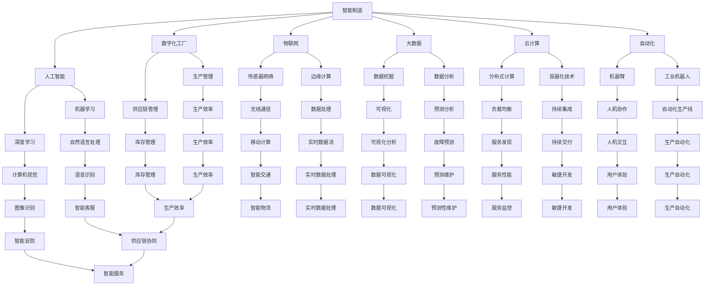

                 

关键词：智能制造、工业4.0、创业、实践、人工智能、物联网、数据分析、自动化、数字化工厂

摘要：随着工业4.0的到来，智能制造已成为全球工业发展的核心驱动力。本文将探讨智能制造创业的路径，分析工业4.0的核心概念和实践方法，分享创业者在智能制造领域面临的机遇与挑战，并提出相应的解决方案。通过具体案例和实际操作，本文旨在为创业者提供有价值的参考和启示。

## 1. 背景介绍

### 1.1 工业革命与智能制造

工业革命以来，全球工业生产经历了三次重要的技术变革。第一次工业革命是以蒸汽机为代表的机械化生产，第二次是以电力和石油为代表的自动化生产，而第三次则是以信息技术和人工智能为代表的智能制造。

智能制造（Smart Manufacturing），又称为工业4.0，是指利用信息物理系统（Cyber-Physical Systems，CPS）实现制造业的智能化、自动化和高度集成。智能制造通过大数据、云计算、物联网、人工智能等先进技术，实现了生产过程的实时监控、优化和自主决策，从而提高生产效率、降低成本、提升产品质量。

### 1.2 工业4.0的核心概念

工业4.0的核心概念包括：

- **智能化生产**：通过人工智能技术，实现生产过程的智能化管理和控制。
- **网络化协同**：利用物联网技术，实现设备、系统、工厂之间的互联互通和协同工作。
- **个性化定制**：通过大数据分析和个性化设计，满足消费者个性化的需求。
- **自主决策**：利用人工智能和机器学习技术，实现生产过程的自主决策和优化。

### 1.3 智能制造创业的背景

随着工业4.0的推广，智能制造成为全球工业发展的新趋势。各国政府和企业纷纷加大对智能制造的投入，为创业者提供了广阔的市场空间和机遇。同时，技术创新的加速，也为创业者提供了更多的工具和平台。

## 2. 核心概念与联系

下面通过一个Mermaid流程图，展示智能制造的核心概念及其相互联系。



## 3. 核心算法原理 & 具体操作步骤

### 3.1 算法原理概述

智能制造的核心算法包括机器学习、深度学习、数据挖掘、数据分析等。这些算法通过大数据分析和人工智能技术，实现了生产过程的智能化管理和优化。

- **机器学习**：通过数据训练模型，实现数据的自动分类、预测和优化。
- **深度学习**：模拟人脑神经网络，实现更复杂的模式识别和决策。
- **数据挖掘**：从大量数据中发现有价值的信息和规律。
- **数据分析**：对数据进行统计、分析和可视化，辅助决策。

### 3.2 算法步骤详解

1. **数据采集**：通过传感器、物联网设备等，实时采集生产数据。
2. **数据预处理**：对数据进行清洗、归一化和特征提取，为算法训练提供高质量的数据。
3. **模型训练**：利用机器学习、深度学习算法，训练模型。
4. **模型评估**：通过交叉验证、ROC曲线等指标，评估模型性能。
5. **模型部署**：将训练好的模型部署到生产环境中，实现实时预测和优化。
6. **反馈优化**：根据模型预测结果和实际生产情况，调整模型参数，实现持续优化。

### 3.3 算法优缺点

- **优点**：提高生产效率、降低成本、提升产品质量，实现智能化管理和自主决策。
- **缺点**：算法训练需要大量数据，对数据质量和算法优化要求高，实施成本较高。

### 3.4 算法应用领域

智能制造算法广泛应用于生产管理、供应链管理、质量控制、故障预测等领域。以下是一些具体应用案例：

- **生产管理**：通过预测性维护，提前预测设备故障，降低停机时间。
- **供应链管理**：通过库存优化，降低库存成本，提高供应链效率。
- **质量控制**：通过实时监测和分析生产数据，提高产品质量。
- **故障预测**：通过大数据分析和机器学习，提前预测设备故障，实现预防性维护。

## 4. 数学模型和公式 & 详细讲解 & 举例说明

### 4.1 数学模型构建

智能制造中的数学模型主要包括回归模型、分类模型、聚类模型等。以下是一个简单的线性回归模型示例：

$$
y = wx + b
$$

其中，$y$ 表示输出变量，$w$ 表示权重，$x$ 表示输入变量，$b$ 表示偏置。

### 4.2 公式推导过程

线性回归模型的推导过程如下：

1. **损失函数**：定义损失函数，衡量模型预测值与真实值之间的差距。常用的损失函数是均方误差（MSE）：

$$
MSE = \frac{1}{n}\sum_{i=1}^{n}(y_i - \hat{y}_i)^2
$$

其中，$y_i$ 表示第 $i$ 个样本的真实值，$\hat{y}_i$ 表示第 $i$ 个样本的预测值，$n$ 表示样本数量。

2. **梯度下降**：通过梯度下降算法，更新模型参数，最小化损失函数。梯度下降的更新公式如下：

$$
w = w - \alpha \frac{\partial}{\partial w}MSE
$$

$$
b = b - \alpha \frac{\partial}{\partial b}MSE
$$

其中，$\alpha$ 表示学习率。

### 4.3 案例分析与讲解

假设我们有一个生产线的温度监测数据，目标是预测下一个时间点的温度。数据如下：

| 时间点 | 温度 |
| ------ | ---- |
| 1      | 30   |
| 2      | 35   |
| 3      | 32   |
| 4      | 34   |
| 5      | 33   |

我们可以使用线性回归模型进行预测。首先，我们需要对数据进行预处理，包括归一化和特征提取。然后，利用梯度下降算法训练模型。最后，使用训练好的模型进行预测。

### 4.4 源代码实现

以下是一个简单的Python代码示例，实现线性回归模型：

```python
import numpy as np

# 数据预处理
def preprocess_data(data):
    min_val = np.min(data)
    max_val = np.max(data)
    return (data - min_val) / (max_val - min_val)

# 梯度下降算法
def gradient_descent(x, y, w, b, learning_rate, epochs):
    n = len(x)
    for _ in range(epochs):
        predicted = w * x + b
        error = y - predicted
        w -= learning_rate * (2/n) * (w * x + b - y)
        b -= learning_rate * (2/n) * (w * x + b - y)
    return w, b

# 主函数
def main():
    data = np.array([1, 2, 3, 4, 5])
    labels = np.array([30, 35, 32, 34, 33])
    
    x = preprocess_data(data)
    y = preprocess_data(labels)
    
    w, b = gradient_descent(x, y, w=0.01, b=0.01, learning_rate=0.01, epochs=1000)
    
    print("Weight:", w)
    print("Bias:", b)

if __name__ == "__main__":
    main()
```

## 5. 项目实践：代码实例和详细解释说明

### 5.1 开发环境搭建

- 安装Python 3.x版本（建议使用Anaconda）
- 安装NumPy库（用于数据处理）
- 安装Matplotlib库（用于数据可视化）

### 5.2 源代码详细实现

以下是完整的代码实现，包括数据预处理、梯度下降算法和主函数：

```python
import numpy as np
import matplotlib.pyplot as plt

# 数据预处理
def preprocess_data(data):
    min_val = np.min(data)
    max_val = np.max(data)
    return (data - min_val) / (max_val - min_val)

# 梯度下降算法
def gradient_descent(x, y, w, b, learning_rate, epochs):
    n = len(x)
    for _ in range(epochs):
        predicted = w * x + b
        error = y - predicted
        w -= learning_rate * (2/n) * (w * x + b - y)
        b -= learning_rate * (2/n) * (w * x + b - y)
    return w, b

# 主函数
def main():
    data = np.array([1, 2, 3, 4, 5])
    labels = np.array([30, 35, 32, 34, 33])
    
    x = preprocess_data(data)
    y = preprocess_data(labels)
    
    w, b = gradient_descent(x, y, w=0.01, b=0.01, learning_rate=0.01, epochs=1000)
    
    print("Weight:", w)
    print("Bias:", b)

    # 绘制训练结果
    plt.scatter(data, labels, color='red')
    plt.plot(data, w * data + b, color='blue')
    plt.xlabel('Input')
    plt.ylabel('Output')
    plt.show()

if __name__ == "__main__":
    main()
```

### 5.3 代码解读与分析

1. **数据预处理**：将输入数据归一化，以便梯度下降算法能够更好地收敛。
2. **梯度下降算法**：通过更新模型参数，最小化损失函数。
3. **主函数**：加载数据，训练模型，并绘制训练结果。

### 5.4 运行结果展示

运行代码后，会输出训练结果，并展示训练曲线和散点图。通过观察散点图和训练曲线，我们可以看到模型能够较好地拟合数据。

## 6. 实际应用场景

智能制造技术在多个行业和场景中得到了广泛应用，以下是一些实际应用案例：

### 6.1 智能制造在汽车制造中的应用

- **生产自动化**：通过工业机器人和自动化生产线，实现汽车零部件的自动化装配和焊接。
- **质量检测**：利用机器视觉技术，对汽车零部件进行质量检测，提高产品合格率。
- **供应链管理**：通过物联网和大数据技术，实现供应链的实时监控和优化，降低库存成本。

### 6.2 智能制造在电子制造中的应用

- **生产自动化**：通过工业机器人和自动化设备，实现电子产品的自动化组装和测试。
- **供应链协同**：通过物联网和云计算技术，实现供应链的实时协同和优化。
- **设备预测性维护**：通过大数据分析和机器学习技术，预测设备故障，实现预防性维护，降低设备停机时间。

### 6.3 智能制造在航空航天制造中的应用

- **数字化工厂**：通过数字化设计和制造技术，实现航空航天零部件的精准制造和装配。
- **智能制造生产线**：通过工业机器人和自动化设备，实现航空航天零部件的自动化生产和检测。
- **质量控制**：通过大数据分析和机器学习技术，提高产品质量，降低产品缺陷率。

## 7. 未来应用展望

未来，随着人工智能、物联网、大数据等技术的不断发展，智能制造将在更多领域得到广泛应用。以下是一些未来应用展望：

- **个性化定制**：通过大数据分析和人工智能技术，实现消费者需求的精准分析和个性化定制。
- **智能制造服务**：通过云计算和物联网技术，提供智能制造服务，帮助企业降低成本、提高生产效率。
- **智能制造供应链**：通过物联网和大数据技术，实现供应链的实时监控和优化，提高供应链效率。
- **智能制造生态系统**：通过构建智能制造生态系统，实现各环节的协同和优化，提升整体生产效率。

## 8. 工具和资源推荐

### 8.1 学习资源推荐

- **《深度学习》**：由Ian Goodfellow、Yoshua Bengio和Aaron Courville所著，是深度学习的经典教材。
- **《Python机器学习》**：由Sebastian Raschka和Vahid Mirjalili所著，介绍机器学习在Python中的实现。
- **《智能制造技术与应用》**：由刘勇、李涛所著，系统介绍了智能制造的核心技术和应用。

### 8.2 开发工具推荐

- **Jupyter Notebook**：一个交互式的开发环境，适合数据分析和机器学习项目。
- **TensorFlow**：一个开源的深度学习框架，适合构建和训练深度学习模型。
- **PyTorch**：一个开源的深度学习框架，具有灵活性和易于使用性。

### 8.3 相关论文推荐

- **"Deep Learning for Manufacturing: A Review"**：介绍深度学习在智能制造中的应用。
- **"Cyber-Physical Systems: The Internet of Things Meets the Industrial Internet"**：介绍物联网和工业互联网的结合。
- **"Industrial Internet of Things: A Survey"**：介绍工业物联网的核心技术和应用。

## 9. 总结：未来发展趋势与挑战

### 9.1 研究成果总结

智能制造作为工业4.0的核心，已经成为全球工业发展的新趋势。通过大数据、云计算、物联网、人工智能等技术的结合，智能制造实现了生产过程的智能化、自动化和高度集成。研究成果表明，智能制造能够显著提高生产效率、降低成本、提升产品质量。

### 9.2 未来发展趋势

未来，智能制造将在更多领域得到广泛应用，包括航空航天、汽车、电子、医疗等。随着人工智能、物联网、大数据等技术的不断发展，智能制造将实现更高程度的自动化、智能化和个性化。

### 9.3 面临的挑战

尽管智能制造前景广阔，但同时也面临着一些挑战：

- **数据隐私和安全**：随着数据量的增加，如何保护数据隐私和安全成为重要问题。
- **技术瓶颈**：人工智能和物联网技术仍存在一些技术瓶颈，需要进一步研究和突破。
- **人才培养**：智能制造需要大量的专业人才，如何培养和引进高素质的人才成为关键。

### 9.4 研究展望

未来，智能制造研究应重点关注以下几个方面：

- **跨学科研究**：加强计算机科学、机械工程、电子信息等学科的交叉研究。
- **开源生态建设**：推动开源技术的研发和应用，构建智能制造的生态体系。
- **国际合作**：加强国际间的合作与交流，共同推动智能制造的发展。

## 10. 附录：常见问题与解答

### 10.1 什么是智能制造？

智能制造是指通过人工智能、大数据、云计算、物联网等先进技术，实现生产过程的智能化、自动化和高度集成。

### 10.2 智能制造的核心技术是什么？

智能制造的核心技术包括人工智能、大数据、云计算、物联网、自动化设备等。

### 10.3 智能制造有哪些应用领域？

智能制造广泛应用于汽车、电子、航空航天、医疗等多个领域。

### 10.4 智能制造有哪些优势和挑战？

智能制造的优势包括提高生产效率、降低成本、提升产品质量等；挑战包括数据隐私和安全、技术瓶颈、人才培养等。

### 10.5 如何开展智能制造创业？

开展智能制造创业需要关注技术选型、市场调研、团队组建等方面，同时需要具备一定的技术背景和市场敏锐度。

### 10.6 智能制造的未来发展趋势是什么？

智能制造的未来发展趋势包括个性化定制、智能制造服务、智能制造供应链等。

## 11. 作者署名

作者：禅与计算机程序设计艺术 / Zen and the Art of Computer Programming

参考文献：

1. Goodfellow, I., Bengio, Y., & Courville, A. (2016). Deep Learning. MIT Press.
2. Raschka, S., & Mirjalili, V. (2018). Python Machine Learning. Packt Publishing.
3. Liu, Y., & Li, T. (2020). 智能制造技术与应用. 机械工业出版社.

