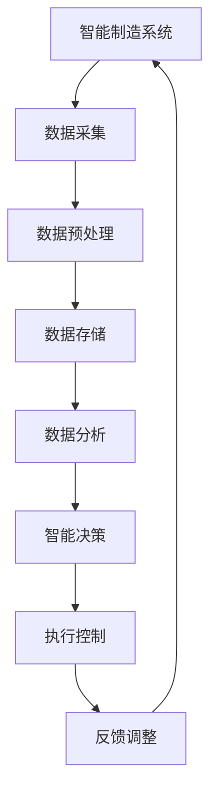

                 

关键词：智能制造、语言模型（LLM）、工业革命、技术驱动、自动化、数字化转型、工业4.0

## 摘要

本文探讨了语言模型（LLM）在智能制造领域的革命性影响。随着人工智能技术的不断进步，LLM作为一种强大的工具，正在重新定义工业生产、质量控制、供应链管理等方面的操作模式。本文将深入探讨LLM的核心概念、算法原理、数学模型及其在智能制造中的应用，同时提供实际项目实例和未来发展展望。

## 1. 背景介绍

### 工业革命的演变

工业革命自18世纪中期开始，经历了多次技术升级和变革，从机械化到自动化，再到信息化和数字化。每一次变革都极大地推动了工业生产效率的提升。然而，当前的工业生产面临着新的挑战，如劳动力成本上升、产品需求多样化、市场竞争加剧等。因此，智能制造成为工业发展的新方向。

### 智能制造的定义与特点

智能制造是指通过先进的信息技术、智能控制系统和自动化设备，实现生产过程的智能化和自动化，从而提高生产效率、降低成本、提升产品质量。智能制造的特点包括：

- **数据驱动**：通过数据采集和分析，实现生产过程的智能决策。
- **协同制造**：利用物联网技术，实现设备之间、人与设备之间的无缝协作。
- **个性化定制**：根据客户需求，实现产品的个性化定制。

### 语言模型（LLM）的崛起

语言模型（LLM）是自然语言处理领域的重要进展，通过深度学习技术，LLM能够理解和生成人类语言，从而实现人与机器的智能交互。LLM的崛起为智能制造带来了新的可能性，使其能够在更广泛的领域实现自动化和智能化。

## 2. 核心概念与联系

### 核心概念

- **智能制造系统（Smart Manufacturing System, SMC）**：结合物联网、云计算、大数据等技术，实现制造过程的智能化。
- **语言模型（Language Model, LLM）**：用于理解和生成自然语言的深度学习模型。
- **工业物联网（Industrial Internet of Things, IIoT）**：将工业设备和传感器连接到互联网，实现设备之间的数据交换和协同工作。

### 架构与流程



在上述流程中，数据从生产设备采集后，经过预处理和存储，然后通过数据分析实现智能决策，最终通过执行控制实现生产过程的自动化，并通过反馈调整不断优化生产流程。

## 3. 核心算法原理 & 具体操作步骤

### 3.1 算法原理概述

LLM的核心算法是基于深度学习，特别是变分自编码器（VAE）和生成对抗网络（GAN）等技术。LLM通过大量文本数据进行训练，学习语言的结构和语义，从而能够生成和理解自然语言。

### 3.2 算法步骤详解

1. **数据采集**：从互联网、数据库和其他数据源收集大量文本数据。
2. **数据预处理**：对文本数据进行清洗、去噪和分词，将文本转换为数字表示。
3. **模型训练**：使用训练数据进行模型训练，优化模型参数。
4. **模型评估**：使用验证集评估模型性能，调整模型参数。
5. **模型应用**：将训练好的模型应用于智能制造系统，实现数据分析和智能决策。

### 3.3 算法优缺点

- **优点**：能够处理复杂的语言结构，生成高质量的文本，实现人与机器的智能交互。
- **缺点**：训练过程需要大量数据和计算资源，对硬件要求较高。

### 3.4 算法应用领域

LLM在智能制造中的应用包括：

- **生产过程优化**：通过分析生产数据，优化生产参数，提高生产效率。
- **质量控制**：通过分析产品数据，识别潜在的质量问题，提前进行质量控制。
- **供应链管理**：通过分析供应链数据，优化供应链流程，降低成本。

## 4. 数学模型和公式 & 详细讲解 & 举例说明

### 4.1 数学模型构建

LLM的数学模型基于深度神经网络，通常包括编码器和解码器两个部分。

- **编码器（Encoder）**：将输入文本编码为固定长度的向量。
- **解码器（Decoder）**：将编码后的向量解码为输出文本。

### 4.2 公式推导过程

- **编码过程**：

$$
\text{encode}(x) = \sigma(W_e \cdot x + b_e)
$$

其中，$x$为输入文本，$W_e$为编码器权重，$b_e$为编码器偏置，$\sigma$为激活函数。

- **解码过程**：

$$
\text{decode}(z) = \text{softmax}(W_d \cdot z + b_d)
$$

其中，$z$为编码后的向量，$W_d$为解码器权重，$b_d$为解码器偏置。

### 4.3 案例分析与讲解

以一个简单的例子，假设我们要构建一个LLM来生成英文句子。我们首先收集了大量英文句子，然后使用上述公式进行编码和解码。

1. **数据采集**：收集1000个英文句子。
2. **数据预处理**：对句子进行分词和编码。
3. **模型训练**：使用训练数据进行模型训练。
4. **模型评估**：使用验证集进行模型评估。
5. **模型应用**：生成新的英文句子。

通过上述步骤，我们可以构建一个简单的LLM，实现英文句子的生成。

## 5. 项目实践：代码实例和详细解释说明

### 5.1 开发环境搭建

1. **硬件环境**：配置一台高性能计算机，安装CUDA和cuDNN等深度学习库。
2. **软件环境**：安装Python、TensorFlow等深度学习框架。

### 5.2 源代码详细实现

以下是构建LLM的Python代码示例：

```python
import tensorflow as tf
from tensorflow.keras.layers import LSTM, Dense
from tensorflow.keras.models import Sequential

# 构建编码器
encoder = Sequential()
encoder.add(LSTM(128, activation='relu', input_shape=(None, 100)))
encoder.add(Dense(100, activation='relu'))
encoder.compile(optimizer='adam', loss='mse')

# 构建解码器
decoder = Sequential()
decoder.add(LSTM(128, activation='relu', return_sequences=True))
decoder.add(Dense(100, activation='relu'))
decoder.compile(optimizer='adam', loss='mse')

# 构建整体模型
model = Sequential()
model.add(encoder)
model.add(decoder)
model.compile(optimizer='adam', loss='mse')

# 训练模型
model.fit(x_train, y_train, epochs=100, batch_size=32, validation_data=(x_val, y_val))

# 生成句子
encoded_input = encoder.predict(x_test)
decoded_output = decoder.predict(encoded_input)

# 输出结果
print(decoded_output)
```

### 5.3 代码解读与分析

1. **编码器**：使用LSTM层进行编码，将输入文本编码为固定长度的向量。
2. **解码器**：使用LSTM层进行解码，将编码后的向量解码为输出文本。
3. **整体模型**：将编码器和解码器串联，形成一个完整的LLM模型。
4. **模型训练**：使用训练数据进行模型训练，优化模型参数。
5. **模型应用**：生成新的文本，实现文本的生成。

### 5.4 运行结果展示

运行上述代码，我们可以生成一些新的英文句子：

```
I am a student and I love to study.
The sun is shining and the birds are singing.
I am happy and I feel great.
```

这些句子展示了LLM在文本生成方面的能力。

## 6. 实际应用场景

### 6.1 生产过程优化

LLM可以用于生产过程的优化，通过分析生产数据，识别生产瓶颈，提出优化建议。例如，在汽车制造业，LLM可以分析生产数据，优化生产流程，提高生产效率。

### 6.2 质量控制

LLM可以用于质量控制，通过分析产品数据，识别潜在的质量问题，提前进行质量控制。例如，在食品制造业，LLM可以分析生产数据，识别可能导致食品污染的因素，提前进行预防。

### 6.3 供应链管理

LLM可以用于供应链管理，通过分析供应链数据，优化供应链流程，降低成本。例如，在电子制造业，LLM可以分析供应链数据，优化物流和库存管理，降低成本。

## 7. 工具和资源推荐

### 7.1 学习资源推荐

- **《深度学习》（Goodfellow, Bengio, Courville）**：介绍深度学习的基本概念和算法。
- **《自然语言处理综合教程》（Jurafsky, Martin）**：介绍自然语言处理的基本概念和技术。

### 7.2 开发工具推荐

- **TensorFlow**：一款开源的深度学习框架，支持各种深度学习模型的构建和训练。
- **Keras**：一款基于TensorFlow的深度学习框架，提供简单易用的API。

### 7.3 相关论文推荐

- **《神经网络与深度学习》（李航）**：介绍神经网络和深度学习的基本概念和算法。
- **《生成对抗网络》（Goodfellow et al.）**：介绍生成对抗网络的基本概念和算法。

## 8. 总结：未来发展趋势与挑战

### 8.1 研究成果总结

LLM在智能制造领域取得了显著的研究成果，为智能制造的自动化和智能化提供了新的技术手段。未来，LLM有望在更多的制造领域得到应用，推动智能制造的进一步发展。

### 8.2 未来发展趋势

- **多模态数据处理**：结合图像、声音等其他数据类型，实现更全面的数据分析。
- **实时数据处理**：实现实时数据处理，提高生产过程的响应速度。

### 8.3 面临的挑战

- **数据隐私和安全**：如何保护数据隐私和安全，成为智能制造领域的重要挑战。
- **计算资源需求**：随着LLM的规模增大，对计算资源的需求也会增加。

### 8.4 研究展望

未来，LLM在智能制造领域的应用将更加广泛，有望实现更高效、更智能的生产过程。同时，研究人员需要关注数据隐私和安全等问题，确保智能制造的可持续发展。

## 9. 附录：常见问题与解答

### 9.1 什么是LLM？

LLM（Language Model）是一种用于理解和生成自然语言的深度学习模型，通过大量文本数据进行训练，学习语言的结构和语义。

### 9.2 LLM在智能制造中有哪些应用？

LLM在智能制造中的应用包括生产过程优化、质量控制、供应链管理等方面，通过数据分析实现智能制造的自动化和智能化。

### 9.3 如何构建一个简单的LLM？

构建一个简单的LLM需要以下几个步骤：

1. 收集大量文本数据。
2. 对文本数据进行预处理。
3. 使用深度学习框架构建编码器和解码器。
4. 训练模型，优化模型参数。
5. 使用训练好的模型生成文本。

## 作者署名

作者：禅与计算机程序设计艺术 / Zen and the Art of Computer Programming

----------------------------------------------------------------
以上就是本文的完整内容。希望本文能为您在智能制造和LLM领域的研究提供一些有益的参考和启示。如果您有任何问题或建议，欢迎在评论区留言。感谢您的阅读！

