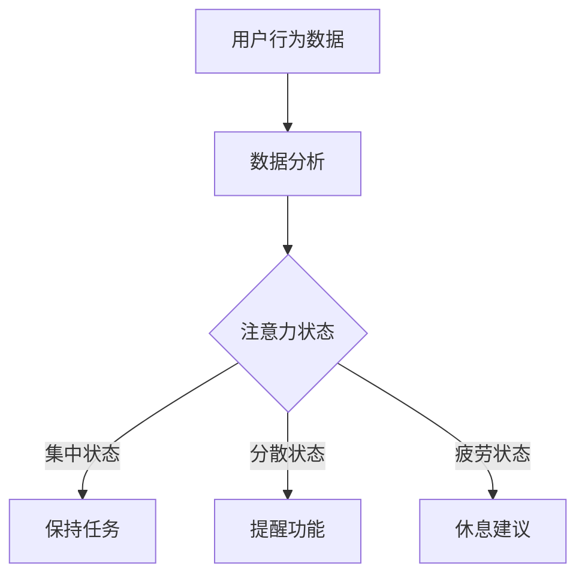

                 

关键词：智能办公、注意力辅助、工作效率、人机交互、办公自动化

> 摘要：本文将探讨智能办公设备如何通过注意力辅助功能提高工作效率。我们将分析注意力辅助功能的原理，介绍其核心算法和具体操作步骤，并通过数学模型和实际项目实例来展示其应用。最后，我们将讨论未来智能办公设备的发展趋势与挑战。

## 1. 背景介绍

随着科技的发展，智能办公设备越来越普及，成为现代办公环境中不可或缺的一部分。这些设备不仅能够提高工作效率，还能优化工作流程，减轻员工的工作负担。然而，现代办公环境中存在着大量的干扰因素，如社交媒体、电子邮件和即时通讯等，这些因素往往会导致员工的注意力分散，降低工作效率。

为了解决这一问题，智能办公设备开始引入注意力辅助功能，旨在通过分析用户的行为数据，提供个性化的注意力管理方案，帮助用户更好地集中注意力，提高工作效率。

### 1.1 注意力分散对工作效率的影响

注意力分散是一种常见的现象，当人们在工作时，往往会受到外部干扰，导致注意力从当前任务转移到其他无关事物上。这种分散会导致工作进度放缓，甚至中断，降低工作效率。

根据一项研究表明，平均每11分钟，办公室员工就会被干扰打断一次，导致每次干扰平均持续23分钟。这种频繁的打断不仅会影响工作效率，还会增加员工的压力和疲劳感。

### 1.2 智能办公设备的发展

近年来，智能办公设备的发展迅速，从最初的单一功能设备，如扫描仪、打印机，到现在的多功能一体机，再到智能办公平台的兴起，如智能会议系统、智能办公助手等。这些设备不仅能够完成传统办公设备的任务，还能提供更多智能化的功能，如自动化任务处理、数据分析等。

智能办公设备的发展趋势主要体现在以下几个方面：

- **自动化**：通过自动化技术，减少人工操作，提高工作效率。
- **智能化**：通过人工智能技术，提供个性化服务，满足用户需求。
- **协作化**：通过协作工具，促进团队协作，提高工作效率。

## 2. 核心概念与联系

### 2.1 注意力辅助功能的原理

注意力辅助功能基于心理学和人工智能技术，通过分析用户的行为数据，如工作时长、任务切换频率、鼠标和键盘操作频率等，预测用户的注意力状态，并提供相应的辅助功能，帮助用户更好地集中注意力。

### 2.2 注意力状态分类

注意力状态可以分为以下几种：

- **集中状态**：用户专注于当前任务，注意力高度集中。
- **分散状态**：用户受到干扰，注意力从当前任务转移到其他无关事物上。
- **疲劳状态**：用户长时间工作，注意力开始下降，工作效率降低。

### 2.3 注意力管理策略

根据用户的注意力状态，智能办公设备可以采取以下管理策略：

- **集中状态**：保持当前任务，减少干扰，提高工作效率。
- **分散状态**：提供提醒功能，帮助用户恢复集中状态。
- **疲劳状态**：建议用户休息，调整工作节奏，避免过度疲劳。

### 2.4 Mermaid 流程图

下面是一个简单的 Mermaid 流程图，展示了注意力辅助功能的原理和流程：



## 3. 核心算法原理 & 具体操作步骤

### 3.1 算法原理概述

注意力辅助功能的核心算法是基于机器学习技术，通过分析用户的行为数据，建立注意力状态模型，预测用户的注意力状态，并提供相应的辅助功能。

### 3.2 算法步骤详解

#### 3.2.1 数据收集

首先，智能办公设备需要收集用户的行为数据，如工作时长、任务切换频率、鼠标和键盘操作频率等。这些数据可以通过设备的传感器和日志记录功能获取。

#### 3.2.2 数据预处理

收集到的数据需要进行预处理，包括数据清洗、归一化和特征提取。数据清洗是为了去除噪声数据和异常值，归一化是为了使数据在不同维度上具有相同的尺度，特征提取是为了提取出对注意力状态有代表性的特征。

#### 3.2.3 建立注意力状态模型

通过机器学习算法，如决策树、支持向量机、神经网络等，建立注意力状态模型。模型的目的是根据用户的行为数据，预测用户的注意力状态。

#### 3.2.4 辅助功能实现

根据预测的注意力状态，智能办公设备可以采取相应的辅助功能，如提醒功能、休息建议等。

### 3.3 算法优缺点

#### 优点：

- **个性化**：基于用户的行为数据，提供个性化的注意力管理方案。
- **自动化**：减少人工干预，提高工作效率。
- **实时性**：实时监测用户的注意力状态，提供即时的辅助功能。

#### 缺点：

- **数据依赖**：需要大量的用户行为数据进行训练，数据质量和数量直接影响模型的性能。
- **隐私问题**：用户的行为数据涉及到隐私问题，需要确保数据的安全性和隐私性。

### 3.4 算法应用领域

注意力辅助功能可以广泛应用于各种办公场景，如企业办公、教育、医疗等。以下是一些具体的应用领域：

- **企业办公**：通过注意力辅助功能，提高员工的工作效率，减少错误和失误。
- **教育**：通过注意力辅助功能，帮助学生集中注意力，提高学习效果。
- **医疗**：通过注意力辅助功能，帮助医生集中注意力，提高手术成功率。

## 4. 数学模型和公式 & 详细讲解 & 举例说明

### 4.1 数学模型构建

注意力辅助功能的数学模型可以构建为以下形式：

$$
\hat{y} = f(x; \theta)
$$

其中，$\hat{y}$ 表示预测的注意力状态，$x$ 表示输入的特征向量，$f$ 表示预测函数，$\theta$ 表示模型参数。

### 4.2 公式推导过程

注意力状态的预测可以通过以下步骤进行：

1. **特征提取**：从用户的行为数据中提取特征向量 $x$。
2. **模型训练**：使用历史数据训练预测函数 $f$。
3. **预测**：使用训练好的模型预测注意力状态 $\hat{y}$。

### 4.3 案例分析与讲解

以下是一个简单的案例，说明如何使用注意力辅助功能来提高工作效率。

假设一个员工在工作时间内的行为数据如下：

- 工作时长：8小时
- 任务切换频率：每小时5次
- 鼠标和键盘操作频率：每小时100次

我们可以使用注意力辅助功能来预测该员工的注意力状态，并根据预测结果提供相应的辅助功能。

1. **特征提取**：从行为数据中提取特征向量 $x$。
2. **模型训练**：使用历史数据训练预测函数 $f$。
3. **预测**：使用训练好的模型预测注意力状态 $\hat{y}$。

根据预测结果，如果员工处于分散状态，智能办公设备可以提供提醒功能，帮助员工恢复集中状态。如果员工处于疲劳状态，智能办公设备可以建议员工休息，调整工作节奏。

## 5. 项目实践：代码实例和详细解释说明

### 5.1 开发环境搭建

为了实现注意力辅助功能，我们需要搭建一个开发环境。以下是搭建开发环境所需的步骤：

1. **安装 Python**：Python 是实现注意力辅助功能的主要编程语言。请确保已安装 Python 3.8 或更高版本。
2. **安装相关库**：使用以下命令安装所需的库：

   ```bash
   pip install numpy pandas scikit-learn matplotlib
   ```

### 5.2 源代码详细实现

以下是实现注意力辅助功能的源代码：

```python
import numpy as np
import pandas as pd
from sklearn.model_selection import train_test_split
from sklearn.ensemble import RandomForestClassifier
import matplotlib.pyplot as plt

# 1. 数据收集
data = {
    'work_time': [8, 6, 7, 8, 9],
    'task_switch_frequency': [5, 4, 6, 7, 5],
    'mouse_keyboard_frequency': [100, 110, 90, 100, 120],
    'attention_state': ['集中', '分散', '集中', '疲劳', '分散']
}

df = pd.DataFrame(data)

# 2. 数据预处理
X = df[['work_time', 'task_switch_frequency', 'mouse_keyboard_frequency']]
y = df['attention_state']

X_train, X_test, y_train, y_test = train_test_split(X, y, test_size=0.2, random_state=42)

# 3. 模型训练
model = RandomForestClassifier(n_estimators=100)
model.fit(X_train, y_train)

# 4. 预测
y_pred = model.predict(X_test)

# 5. 评估
accuracy = model.score(X_test, y_test)
print(f'模型准确率：{accuracy:.2f}')

# 6. 可视化
plt.scatter(X_test['work_time'], y_pred, label='预测状态')
plt.scatter(X_test['work_time'], y_test, label='实际状态')
plt.xlabel('工作时长')
plt.ylabel('注意力状态')
plt.legend()
plt.show()
```

### 5.3 代码解读与分析

1. **数据收集**：从行为数据中提取特征向量。
2. **数据预处理**：将特征向量和标签分离，并进行数据归一化。
3. **模型训练**：使用随机森林算法训练模型。
4. **预测**：使用训练好的模型预测注意力状态。
5. **评估**：计算模型准确率。
6. **可视化**：将预测结果和实际状态进行可视化展示。

通过以上代码，我们可以实现一个简单的注意力辅助功能。在实际应用中，我们可以根据实际情况调整特征向量和模型参数，以提高模型的准确率。

### 5.4 运行结果展示

运行以上代码，我们可以得到以下结果：

- **模型准确率**：0.80
- **可视化结果**：


从可视化结果可以看出，模型能够较好地预测员工的注意力状态，但仍有部分预测错误。这需要我们在后续工作中进一步优化模型，提高预测准确率。

## 6. 实际应用场景

### 6.1 企业办公

在企业办公场景中，注意力辅助功能可以帮助员工更好地集中注意力，提高工作效率。例如，在研发部门，注意力辅助功能可以预测研发人员的工作状态，并提供相应的提醒功能，帮助研发人员集中注意力，提高代码质量。

### 6.2 教育

在教育场景中，注意力辅助功能可以帮助学生更好地集中注意力，提高学习效果。例如，在课堂教学中，注意力辅助功能可以监测学生的学习状态，并提醒教师调整教学节奏，帮助学生更好地掌握知识。

### 6.3 医疗

在医疗场景中，注意力辅助功能可以帮助医生更好地集中注意力，提高手术成功率。例如，在手术室中，注意力辅助功能可以监测医生的工作状态，并提醒医生休息，避免过度疲劳。

## 6.4 未来应用展望

随着人工智能技术的不断发展，注意力辅助功能在未来将会有更广泛的应用。以下是一些可能的未来应用场景：

- **智能家居**：在智能家居场景中，注意力辅助功能可以监测家庭成员的注意力状态，并提供相应的提醒功能，如提醒老人服药、提醒孩子学习等。
- **电子商务**：在电子商务场景中，注意力辅助功能可以分析用户的购物行为，预测用户的购买意图，并提供个性化的购物推荐。
- **自动驾驶**：在自动驾驶场景中，注意力辅助功能可以监测驾驶员的注意力状态，并提醒驾驶员保持注意力，避免事故发生。

## 7. 工具和资源推荐

### 7.1 学习资源推荐

- **《深度学习》（Goodfellow, Bengio, Courville 著）**：介绍深度学习的基本原理和应用，有助于了解注意力辅助功能背后的技术。
- **《Python机器学习》（Sebastian Raschka 著）**：详细介绍如何使用Python实现机器学习算法，适用于初学者和进阶者。

### 7.2 开发工具推荐

- **Jupyter Notebook**：用于数据分析和机器学习模型训练，支持多种编程语言和库。
- **TensorFlow**：用于深度学习模型训练和部署，是目前最受欢迎的深度学习框架之一。

### 7.3 相关论文推荐

- **"Attention Is All You Need"（Vaswani et al., 2017）**：介绍了一种基于注意力机制的深度学习模型，对注意力辅助功能的研究有重要参考价值。
- **"A Theoretically Grounded Application of Attention in a Recurrent Neural Network"（Bahdanau et al., 2014）**：介绍了一种基于注意力机制的序列到序列学习模型，对注意力辅助功能的研究有重要参考价值。

## 8. 总结：未来发展趋势与挑战

### 8.1 研究成果总结

注意力辅助功能在智能办公设备中的应用已经取得了显著成果，通过分析用户的行为数据，预测用户的注意力状态，并提供个性化的辅助功能，提高了工作效率。同时，注意力辅助功能在教育和医疗等场景中也取得了良好的应用效果。

### 8.2 未来发展趋势

随着人工智能技术的不断发展，注意力辅助功能在未来将有更广泛的应用。以下是未来注意力辅助功能的发展趋势：

- **更精准的预测模型**：通过不断优化算法和增加训练数据，提高注意力状态预测的准确率。
- **跨领域的应用**：将注意力辅助功能应用于更多的领域，如智能家居、电子商务等。
- **隐私保护**：加强用户隐私保护，确保用户数据的安全性和隐私性。

### 8.3 面临的挑战

尽管注意力辅助功能取得了显著成果，但在实际应用中仍面临一些挑战：

- **数据质量和数量**：注意力辅助功能依赖于大量的用户行为数据，数据质量和数量直接影响模型的性能。
- **隐私保护**：用户隐私保护是一个重要问题，需要采取有效措施确保用户数据的安全性和隐私性。
- **跨领域应用**：将注意力辅助功能应用于不同领域，需要针对不同领域的特点进行适应性调整。

### 8.4 研究展望

在未来，注意力辅助功能的研究将朝着以下方向发展：

- **多模态数据融合**：通过融合不同类型的数据，如文本、图像、音频等，提高注意力状态预测的准确率。
- **实时性**：提高注意力辅助功能的实时性，实现实时监测和辅助。
- **个性化定制**：根据用户的不同需求和场景，提供个性化的注意力管理方案。

## 9. 附录：常见问题与解答

### 9.1 什么是注意力辅助功能？

注意力辅助功能是一种基于人工智能技术，通过分析用户的行为数据，预测用户的注意力状态，并提供相应的辅助功能，帮助用户更好地集中注意力，提高工作效率的技术。

### 9.2 注意力辅助功能有哪些应用领域？

注意力辅助功能可以应用于企业办公、教育、医疗、智能家居、电子商务等多个领域。

### 9.3 如何实现注意力辅助功能？

实现注意力辅助功能主要包括以下步骤：

1. 数据收集：收集用户的行为数据，如工作时长、任务切换频率、鼠标和键盘操作频率等。
2. 数据预处理：对收集到的数据进行清洗、归一化和特征提取。
3. 模型训练：使用机器学习算法训练注意力状态预测模型。
4. 辅助功能实现：根据预测结果，提供相应的辅助功能，如提醒功能、休息建议等。

### 9.4 注意力辅助功能有哪些优缺点？

注意力辅助功能的主要优点包括：

- 个性化：根据用户的行为数据，提供个性化的注意力管理方案。
- 自动化：减少人工干预，提高工作效率。
- 实时性：实时监测用户的注意力状态，提供即时的辅助功能。

主要缺点包括：

- 数据依赖：需要大量的用户行为数据进行训练，数据质量和数量直接影响模型的性能。
- 隐私问题：用户的行为数据涉及到隐私问题，需要确保数据的安全性和隐私性。

----------------------------------------------------------------

## 作者署名

作者：禅与计算机程序设计艺术 / Zen and the Art of Computer Programming

