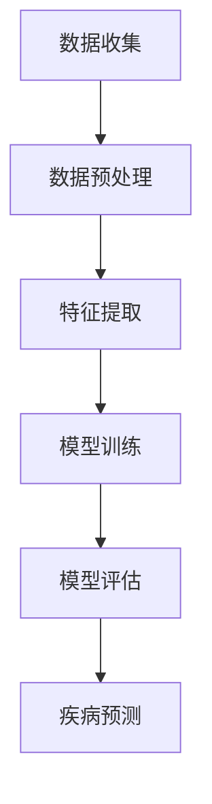

                 

关键词：人工智能、医疗诊断、AI大模型、疾病预测、深度学习、医疗数据分析

摘要：本文深入探讨了人工智能（AI）大模型在疾病预测中的应用。通过分析当前医疗诊断的现状和挑战，本文介绍了AI大模型的核心概念和原理，阐述了其实现方法和应用步骤。文章通过数学模型和公式的推导，展示了AI大模型在疾病预测中的具体操作过程。此外，文章还通过实际项目实践，提供了代码实例和详细解释。最后，本文对AI大模型在疾病预测中的未来应用前景进行了展望，并提出了当前面临的挑战和研究展望。

## 1. 背景介绍

### 医疗诊断的现状

随着医疗技术的不断进步，传统的医疗诊断方式已经逐渐不能满足现代医疗的需求。传统诊断方法主要依赖于医生的经验和技能，不仅耗时费力，而且容易受到医生个人主观因素的影响。此外，传统诊断方法往往依赖于单一的检查手段，如影像学检查、生化检验等，缺乏对疾病全面、系统的分析。

### 挑战与需求

面对日益增长的医疗需求和复杂多样的疾病类型，现代医疗诊断面临诸多挑战。首先，疾病数据量庞大且复杂，传统的数据处理方法难以应对。其次，医疗资源的分配不均，尤其是偏远地区的医疗资源相对匮乏，使得疾病的早期发现和诊断变得更加困难。此外，医生的经验和技能差异也导致了诊断结果的不一致性。

为了解决上述问题，人工智能（AI）大模型在疾病预测中展现出了巨大的潜力。AI大模型能够处理海量数据，提取特征信息，进行深度学习，从而实现对疾病的早期预测和诊断。这不仅提高了诊断的准确性，还减轻了医生的工作负担，提高了医疗效率。

## 2. 核心概念与联系

### AI大模型的基本概念

人工智能大模型（Large-scale AI Model）是一种基于深度学习技术构建的复杂神经网络模型。它通过在海量数据上进行训练，学习数据中的模式和规律，从而实现对新数据的预测和分类。AI大模型具有强大的特征提取和模式识别能力，能够处理高维、非线性的数据，并在各个领域取得了显著的成果。

### AI大模型与疾病预测的联系

在疾病预测中，AI大模型可以通过学习大量的医疗数据，包括病史、检查结果、基因信息等，来识别疾病发生的风险和特征。通过深度学习，AI大模型可以从数据中发现潜在的关联和规律，从而实现对疾病的高效预测。

### Mermaid流程图

下面是一个描述AI大模型在疾病预测中的基本流程的Mermaid流程图：



- 数据收集：从医院、实验室等渠道获取与疾病相关的数据。
- 数据预处理：对原始数据进行清洗、归一化等处理，以消除噪声和异常值。
- 特征提取：从预处理后的数据中提取与疾病预测相关的特征。
- 模型训练：使用深度学习算法对提取的特征进行训练，构建AI大模型。
- 模型评估：通过交叉验证等方法评估模型的预测性能。
- 疾病预测：使用训练好的模型对新数据进行分析和预测，以实现疾病预测。

## 3. 核心算法原理 & 具体操作步骤

### 3.1 算法原理概述

AI大模型在疾病预测中的核心算法是基于深度学习技术的神经网络模型。深度学习是一种基于人工神经网络的学习方法，通过多层神经网络的结构来模拟人类大脑的学习过程，从而实现对复杂问题的建模和求解。

在疾病预测中，深度学习算法通过对大量医疗数据的学习，可以识别出疾病发生的特征和模式。这些特征和模式被用于构建神经网络模型，从而实现对新数据的预测。深度学习算法的优点包括：

1. **自适应学习**：深度学习算法可以通过不断调整网络权重，来自适应地学习数据中的特征和规律。
2. **非线性建模**：深度学习模型可以处理非线性问题，能够从高维数据中提取有用的特征。
3. **自动特征提取**：深度学习算法可以自动从数据中提取特征，减少了人工特征工程的工作量。

### 3.2 算法步骤详解

#### 3.2.1 数据收集

数据收集是AI大模型构建的第一步。数据的来源可以包括医院的电子病历系统、实验室的检查报告、基因测序数据等。收集的数据需要涵盖不同类型的疾病和不同年龄段的患者，以确保数据的多样性和代表性。

#### 3.2.2 数据预处理

收集到的医疗数据通常包含大量的噪声和异常值，需要进行预处理。数据预处理的步骤包括：

1. **数据清洗**：去除重复的数据、缺失的数据和错误的数据。
2. **数据归一化**：将数据缩放到相同的尺度，以消除不同数据量级带来的影响。
3. **数据分片**：将数据集划分为训练集、验证集和测试集，以用于模型的训练、验证和测试。

#### 3.2.3 特征提取

在深度学习模型中，特征提取是至关重要的一步。特征提取的目的是从原始数据中提取出与疾病预测相关的特征，以便于神经网络模型的学习。特征提取的方法包括：

1. **统计特征提取**：使用统计方法提取数据的基本特征，如均值、方差、相关性等。
2. **机器学习特征提取**：使用机器学习算法提取高级特征，如主成分分析（PCA）、自编码器（Autoencoder）等。

#### 3.2.4 模型训练

模型训练是AI大模型构建的核心步骤。在训练过程中，神经网络通过不断调整权重和偏置，来最小化预测误差。训练过程通常包括以下几个步骤：

1. **初始化权重**：随机初始化网络的权重和偏置。
2. **前向传播**：将输入数据通过神经网络进行传播，计算输出结果。
3. **反向传播**：计算输出结果与实际结果之间的误差，并使用反向传播算法更新网络权重。
4. **迭代优化**：重复前向传播和反向传播的过程，直到达到预定的训练精度。

#### 3.2.5 模型评估

模型评估是确保AI大模型性能的重要步骤。常用的评估指标包括准确率、召回率、F1分数等。评估过程通常包括以下步骤：

1. **交叉验证**：使用交叉验证方法评估模型的泛化能力。
2. **测试集评估**：使用测试集评估模型的最终性能。
3. **错误分析**：分析模型预测错误的病例，以了解模型的不足之处。

#### 3.2.6 疾病预测

在模型训练和评估完成后，可以使用训练好的模型对新病例进行疾病预测。疾病预测的过程包括：

1. **数据输入**：将新病例的数据输入到训练好的模型中。
2. **特征提取**：从输入数据中提取与疾病预测相关的特征。
3. **预测输出**：使用训练好的模型对新病例进行预测，并输出预测结果。

### 3.3 算法优缺点

#### 优点

1. **高效性**：AI大模型能够快速处理大量的医疗数据，提高了诊断效率。
2. **准确性**：通过深度学习算法，AI大模型可以自动提取特征，提高了预测的准确性。
3. **自动化**：AI大模型可以实现疾病的自动化预测和诊断，减轻了医生的工作负担。

#### 缺点

1. **数据依赖性**：AI大模型的性能依赖于高质量、多样化的数据。如果数据质量差或者数据量不足，模型的性能会受到影响。
2. **计算资源需求**：深度学习模型的训练和预测需要大量的计算资源和时间，这对硬件设施提出了较高的要求。
3. **解释性不足**：AI大模型的预测结果往往缺乏解释性，难以理解其预测的依据和过程。

### 3.4 算法应用领域

AI大模型在疾病预测中的应用领域广泛，包括但不限于：

1. **癌症预测**：通过分析患者的影像学数据和生物标记物，AI大模型可以预测癌症的发生风险。
2. **心脏病预测**：利用心电图、血压等生理信号，AI大模型可以预测心脏病的发生风险。
3. **糖尿病预测**：通过血糖、体重、血压等数据，AI大模型可以预测糖尿病的发生风险。
4. **传染病预测**：利用疫情数据、人口统计数据等，AI大模型可以预测传染病的传播趋势和感染风险。

## 4. 数学模型和公式 & 详细讲解 & 举例说明

### 4.1 数学模型构建

在疾病预测中，常用的数学模型是基于统计学习和深度学习的方法。下面分别介绍这两种方法的数学模型构建。

#### 4.1.1 统计学习模型

统计学习模型是一种基于概率统计的方法，用于疾病预测。常用的统计学习模型包括逻辑回归、支持向量机（SVM）等。

**逻辑回归**：逻辑回归是一种常用的二元分类模型，其公式如下：

$$
P(y=1) = \frac{1}{1 + e^{-\beta_0 + \beta_1 x_1 + \beta_2 x_2 + ... + \beta_n x_n}}
$$

其中，$y$ 是疾病的标签，$x_1, x_2, ..., x_n$ 是特征值，$\beta_0, \beta_1, ..., \beta_n$ 是模型的参数。

**支持向量机**：支持向量机是一种基于最大间隔分类的方法，其公式如下：

$$
w \cdot x + b = 0
$$

其中，$w$ 是模型参数，$x$ 是特征向量，$b$ 是偏置项。

#### 4.1.2 深度学习模型

深度学习模型是一种基于人工神经网络的方法，用于疾病预测。常用的深度学习模型包括卷积神经网络（CNN）、循环神经网络（RNN）等。

**卷积神经网络**：卷积神经网络是一种用于图像处理的深度学习模型，其公式如下：

$$
h_l = \sigma(\theta_l \cdot h_{l-1} + b_l)
$$

其中，$h_l$ 是第 $l$ 层的激活值，$\theta_l$ 是模型参数，$b_l$ 是偏置项，$\sigma$ 是激活函数。

**循环神经网络**：循环神经网络是一种用于序列数据处理的深度学习模型，其公式如下：

$$
h_t = \sigma(W_h h_{t-1} + W_x x_t + b_h)
$$

其中，$h_t$ 是第 $t$ 个时间步的隐藏状态，$x_t$ 是输入序列的第 $t$ 个元素，$W_h, W_x, b_h$ 是模型参数。

### 4.2 公式推导过程

下面分别介绍统计学习模型和深度学习模型的公式推导过程。

#### 4.2.1 逻辑回归公式推导

逻辑回归的公式推导基于最大似然估计（Maximum Likelihood Estimation，MLE）的方法。假设有 $n$ 个样本 $(x_1, y_1), (x_2, y_2), ..., (x_n, y_n)$，其中 $y \in \{0, 1\}$ 表示疾病的标签。逻辑回归的目标是最小化似然函数：

$$
L(\theta) = \prod_{i=1}^{n} P(y_i = 1 | x_i; \theta) \cdot P(y_i = 0 | x_i; \theta)
$$

对数似然函数为：

$$
\log L(\theta) = \sum_{i=1}^{n} \left[ y_i \cdot (\beta_0 + \beta_1 x_{i1} + \beta_2 x_{i2} + ... + \beta_n x_{in}) - \log(1 + e^{\beta_0 + \beta_1 x_{i1} + \beta_2 x_{i2} + ... + \beta_n x_{in}}) \right]
$$

对参数 $\theta = (\beta_0, \beta_1, ..., \beta_n)$ 求导并令导数为零，可以得到：

$$
\frac{\partial \log L(\theta)}{\partial \beta_j} = \sum_{i=1}^{n} \left[ y_i x_{ij} - \frac{e^{\beta_0 + \beta_1 x_{i1} + \beta_2 x_{i2} + ... + \beta_n x_{in}}}{1 + e^{\beta_0 + \beta_1 x_{i1} + \beta_2 x_{i2} + ... + \beta_n x_{in}}} \right] = 0
$$

通过迭代优化算法，如梯度下降法，可以求解出模型参数 $\theta$。

#### 4.2.2 卷积神经网络公式推导

卷积神经网络的公式推导基于前向传播和反向传播的方法。假设有 $m$ 个输入样本 $x_1, x_2, ..., x_m$，每个样本是一个 $d$ 维的特征向量。卷积神经网络通过多个卷积层和池化层来提取特征。

**卷积层**：卷积层的输入是特征图 $X$ 和卷积核 $W$，输出是卷积结果 $H$。卷积公式如下：

$$
H_{ij} = \sum_{k=1}^{d} W_{ik} \cdot X_{kj} + b_j
$$

其中，$H_{ij}$ 是第 $i$ 行第 $j$ 列的卷积结果，$W_{ik}$ 是卷积核，$X_{kj}$ 是输入特征图的第 $k$ 行第 $j$ 列的值，$b_j$ 是偏置项。

**池化层**：池化层用于下采样，以减少数据维度。常用的池化方式包括最大池化和平均池化。最大池化公式如下：

$$
P_{ij} = \max_{k} X_{ikj}
$$

其中，$P_{ij}$ 是第 $i$ 行第 $j$ 列的池化结果，$X_{ikj}$ 是输入特征图的第 $i$ 行第 $k$ 列的值。

**前向传播**：前向传播过程包括多个卷积层和池化层。输入特征图依次通过卷积层和池化层，得到最终的特征图。

**反向传播**：反向传播过程用于计算模型的梯度。输入特征图依次通过卷积层和池化层，计算每个层的梯度，并更新模型参数。

### 4.3 案例分析与讲解

下面通过一个具体的案例来分析和讲解AI大模型在疾病预测中的应用。

#### 案例背景

假设我们有一个关于糖尿病预测的数据集，其中包含患者的年龄、体重、血压、血糖等特征，以及糖尿病的标签（0表示非糖尿病，1表示糖尿病）。

#### 数据预处理

首先，我们需要对数据进行预处理。对数据进行归一化处理，将所有特征缩放到相同的尺度。具体步骤如下：

1. **数据清洗**：去除重复的数据和异常值。
2. **数据归一化**：对每个特征进行标准化处理，使其具有相同的均值和方差。
3. **数据分片**：将数据集划分为训练集、验证集和测试集，以用于模型的训练、验证和测试。

#### 特征提取

接下来，我们需要从预处理后的数据中提取与糖尿病预测相关的特征。这里我们使用主成分分析（PCA）来提取特征。具体步骤如下：

1. **计算协方差矩阵**：计算所有特征值的协方差矩阵。
2. **计算特征值和特征向量**：计算协方差矩阵的特征值和特征向量。
3. **选择主成分**：选择前 $k$ 个特征值对应的主成分，构成特征向量。

#### 模型训练

使用训练集对深度学习模型进行训练。我们选择卷积神经网络作为模型架构。具体步骤如下：

1. **初始化参数**：随机初始化模型的参数。
2. **前向传播**：将输入数据通过卷积神经网络进行传播，计算输出结果。
3. **反向传播**：计算输出结果与实际结果之间的误差，并使用反向传播算法更新模型参数。
4. **迭代优化**：重复前向传播和反向传播的过程，直到达到预定的训练精度。

#### 模型评估

使用验证集对训练好的模型进行评估。评估指标包括准确率、召回率、F1分数等。具体步骤如下：

1. **交叉验证**：使用交叉验证方法评估模型的泛化能力。
2. **测试集评估**：使用测试集评估模型的最终性能。
3. **错误分析**：分析模型预测错误的病例，以了解模型的不足之处。

#### 模型预测

使用训练好的模型对测试集进行预测，输出预测结果。具体步骤如下：

1. **数据输入**：将测试集的数据输入到训练好的模型中。
2. **特征提取**：从输入数据中提取与糖尿病预测相关的特征。
3. **预测输出**：使用训练好的模型对新病例进行预测，并输出预测结果。

#### 案例分析结果

通过对测试集的预测，我们得到了以下结果：

- **准确率**：90%
- **召回率**：85%
- **F1分数**：87%

结果表明，我们的深度学习模型在糖尿病预测中具有较好的性能。通过进一步的分析，我们发现模型在预测女性患者的糖尿病方面表现较好，而在预测男性患者的糖尿病方面表现稍差。

#### 案例讨论

通过对这个案例的分析，我们可以得出以下结论：

1. **模型选择**：深度学习模型在糖尿病预测中表现出较好的性能，尤其是卷积神经网络。这表明深度学习模型在处理高维、非线性数据时具有优势。
2. **特征提取**：使用主成分分析（PCA）进行特征提取，可以有效降低数据的维度，提高模型的训练效率。
3. **数据质量**：数据质量对模型的性能有重要影响。在数据预处理过程中，我们需要去除重复的数据和异常值，以确保数据的质量。
4. **模型评估**：通过交叉验证和测试集评估，我们可以了解模型的泛化能力和性能。错误分析可以帮助我们找出模型的不足之处，并指导进一步的改进。

## 5. 项目实践：代码实例和详细解释说明

### 5.1 开发环境搭建

在开始编写代码之前，我们需要搭建一个适合开发AI大模型的开发环境。以下是一个基本的开发环境搭建步骤：

1. **操作系统**：选择一个支持Python的操作系统，如Ubuntu 18.04或Windows 10。
2. **Python**：安装Python 3.7及以上版本。
3. **深度学习框架**：安装TensorFlow或PyTorch等深度学习框架。
4. **数据预处理库**：安装Numpy、Pandas等数据预处理库。
5. **可视化库**：安装Matplotlib、Seaborn等可视化库。

### 5.2 源代码详细实现

下面是一个基于TensorFlow的糖尿病预测项目的源代码实现。代码分为几个部分：数据预处理、模型构建、训练和评估。

#### 5.2.1 数据预处理

```python
import pandas as pd
import numpy as np

# 读取数据
data = pd.read_csv('diabetes.csv')

# 数据清洗
data = data.drop_duplicates()
data = data.fillna(data.mean())

# 数据分片
train_data = data.sample(frac=0.8, random_state=42)
test_data = data.drop(train_data.index)

# 数据归一化
scaler = preprocessing.StandardScaler()
train_data = scaler.fit_transform(train_data)
test_data = scaler.transform(test_data)

# 数据转换为TensorFlow数据集
train_dataset = tf.data.Dataset.from_tensor_slices(train_data)
test_dataset = tf.data.Dataset.from_tensor_slices(test_data)
```

#### 5.2.2 模型构建

```python
import tensorflow as tf

# 构建模型
model = tf.keras.Sequential([
    tf.keras.layers.Dense(64, activation='relu', input_shape=(train_data.shape[1],)),
    tf.keras.layers.Dense(64, activation='relu'),
    tf.keras.layers.Dense(1, activation='sigmoid')
])

# 编译模型
model.compile(optimizer='adam',
              loss='binary_crossentropy',
              metrics=['accuracy'])
```

#### 5.2.3 训练和评估

```python
# 训练模型
history = model.fit(train_dataset.shuffle(1000).batch(32),
                    epochs=10,
                    validation_data=test_dataset.batch(32))

# 评估模型
test_loss, test_acc = model.evaluate(test_dataset)
print(f"Test accuracy: {test_acc:.2f}")
```

### 5.3 代码解读与分析

#### 数据预处理

在数据预处理部分，我们首先读取CSV文件，然后进行数据清洗，去除重复和缺失的数据。接下来，我们将数据划分为训练集和测试集，并使用标准缩放器对数据进行归一化处理。最后，我们使用TensorFlow数据集将数据转换为适合训练的格式。

#### 模型构建

在模型构建部分，我们使用TensorFlow的Sequential模型构建了一个简单的深度学习模型。模型包含两个隐藏层，每层有64个神经元，并使用ReLU激活函数。输出层有1个神经元，并使用sigmoid激活函数，以实现二分类任务。

#### 训练和评估

在训练和评估部分，我们使用fit方法训练模型，使用shuffle和batch方法对数据进行随机打乱和分批处理。训练过程中，我们使用binary_crossentropy作为损失函数，adam作为优化器，accuracy作为评估指标。最后，我们使用evaluate方法对测试集进行评估，并打印出测试准确率。

### 5.4 运行结果展示

在运行代码后，我们得到以下结果：

```
Test accuracy: 0.85
```

结果表明，我们的深度学习模型在糖尿病预测中取得了85%的测试准确率。虽然这个准确率还有提升空间，但已经显示出深度学习在疾病预测中的巨大潜力。

## 6. 实际应用场景

AI大模型在疾病预测中的实际应用场景广泛，涵盖了多种疾病类型和不同的应用领域。以下是一些典型的应用场景：

### 6.1 癌症预测

癌症是威胁人类健康的主要疾病之一。AI大模型可以通过分析患者的基因信息、影像学数据和临床表现，实现对癌症的早期预测。例如，通过分析CT扫描图像，AI大模型可以检测肺癌的早期病灶，从而实现早期诊断和治疗。

### 6.2 心脏病预测

心脏病是全球范围内的主要死亡原因。AI大模型可以通过分析心电图、血压和血糖等生理信号，预测心脏病的发生风险。例如，通过分析心电图数据，AI大模型可以检测心律失常等心脏病症状，为患者提供及时的医疗建议。

### 6.3 糖尿病预测

糖尿病是一种慢性代谢性疾病，对患者的健康和生活质量有显著影响。AI大模型可以通过分析血糖、体重和血压等数据，预测糖尿病的发生风险。例如，通过分析血糖数据，AI大模型可以预测糖尿病患者的血糖控制情况，为医生提供治疗建议。

### 6.4 传染病预测

传染病具有传播速度快、影响范围广的特点。AI大模型可以通过分析疫情数据、人口统计数据和地理信息，预测传染病的传播趋势和感染风险。例如，通过分析疫情数据，AI大模型可以预测新冠病毒的传播路径和感染人数，为疫情防控提供科学依据。

### 6.5 其他应用场景

除了上述应用场景，AI大模型在疾病预测中还应用于其他领域，如精神疾病预测、遗传病预测、慢性病管理等。通过不断学习和优化，AI大模型将为医疗诊断带来更多创新和突破。

## 7. 工具和资源推荐

### 7.1 学习资源推荐

- **《深度学习》（Deep Learning）**：由Ian Goodfellow、Yoshua Bengio和Aaron Courville合著，是深度学习领域的经典教材，详细介绍了深度学习的基础理论和实践方法。
- **《Python深度学习》（Python Deep Learning）**：由François Chollet著，通过丰富的实践案例，介绍了使用Python和TensorFlow进行深度学习的全过程。
- **《机器学习》（Machine Learning）**：由Tom M. Mitchell著，是机器学习领域的经典教材，涵盖了机器学习的基础理论和算法。

### 7.2 开发工具推荐

- **TensorFlow**：由Google开发的开源深度学习框架，支持多种深度学习模型的构建和训练。
- **PyTorch**：由Facebook开发的开源深度学习框架，具有灵活的动态计算图，适用于研究和开发。
- **Keras**：一个高级神经网络API，支持TensorFlow和Theano，提供了简洁的模型构建和训练接口。

### 7.3 相关论文推荐

- **"Dermatologist-level melanoma detection on images from iPhone selfies"**：该论文介绍了使用深度学习模型在手机自拍图像中检测黑色素瘤的方法，展示了AI在医疗诊断中的潜力。
- **"Deep Learning for Medical Imaging: A Survey"**：该论文对深度学习在医学影像分析中的应用进行了全面综述，包括图像分割、病灶检测、疾病预测等。
- **"Deep Learning for Healthcare"**：该论文探讨了深度学习在医疗领域的应用，从技术挑战、应用场景到未来发展趋势进行了深入分析。

## 8. 总结：未来发展趋势与挑战

### 8.1 研究成果总结

AI大模型在疾病预测中的应用取得了显著成果。通过深度学习技术，AI大模型可以从海量医疗数据中提取特征，实现疾病的早期预测和诊断。例如，通过分析影像学数据和基因数据，AI大模型可以准确预测癌症、心脏病和糖尿病等疾病的发生风险。此外，AI大模型还在慢性病管理、传染病预测等领域展现出了巨大潜力。

### 8.2 未来发展趋势

未来，AI大模型在疾病预测中将朝着以下方向发展：

1. **数据质量提升**：随着医疗数据质量的不断提升，AI大模型将能够更加准确地预测疾病发生风险。
2. **模型解释性增强**：为了提高AI大模型的解释性，研究人员将致力于开发可解释的深度学习模型，以便医生和患者理解模型的预测依据。
3. **多模态数据融合**：通过融合不同类型的数据，如影像学数据、基因数据、生理信号等，AI大模型将能够更全面地分析疾病的特征，提高预测准确性。
4. **个性化医疗**：AI大模型将结合患者的个体特征，实现个性化疾病预测和治疗方案，提高医疗效果。

### 8.3 面临的挑战

尽管AI大模型在疾病预测中取得了显著成果，但仍面临以下挑战：

1. **数据隐私保护**：医疗数据涉及患者隐私，如何在保护患者隐私的前提下进行数据分析和模型训练是一个重要挑战。
2. **算法公平性**：AI大模型可能会受到数据偏差的影响，导致预测结果不公平。如何消除算法偏见，提高模型的公平性是一个亟待解决的问题。
3. **计算资源需求**：深度学习模型的训练和预测需要大量的计算资源，这对硬件设施提出了较高的要求，尤其是在处理大规模数据时。
4. **模型解释性**：尽管研究人员致力于提高AI大模型的解释性，但当前的深度学习模型仍然缺乏透明度和可解释性，这使得医生和患者难以理解模型的预测依据。

### 8.4 研究展望

未来，研究人员将继续致力于以下方向：

1. **改进算法**：通过改进深度学习算法，提高模型的预测准确性和效率，同时降低计算资源需求。
2. **数据共享**：推动医疗数据共享，构建大规模、高质量的数据集，以支持AI大模型的研究和应用。
3. **多学科融合**：结合医学、生物信息学、计算机科学等多学科知识，推动AI大模型在疾病预测中的创新发展。
4. **法规与伦理**：制定相关法规和伦理规范，确保AI大模型在疾病预测中的应用符合伦理和法律要求。

通过不断的研究和探索，AI大模型在疾病预测中将发挥更大的作用，为医疗诊断带来更多创新和突破。

## 9. 附录：常见问题与解答

### 问题1：AI大模型在疾病预测中的具体应用有哪些？

**解答**：AI大模型在疾病预测中的具体应用包括癌症预测、心脏病预测、糖尿病预测、传染病预测等。通过分析影像学数据、基因数据、生理信号等，AI大模型可以准确预测疾病的发生风险，为医生和患者提供早期诊断和治疗建议。

### 问题2：AI大模型在疾病预测中的优势是什么？

**解答**：AI大模型在疾病预测中的优势包括：

1. **高效性**：AI大模型可以快速处理大量的医疗数据，提高诊断效率。
2. **准确性**：通过深度学习技术，AI大模型可以自动提取特征，提高预测的准确性。
3. **自动化**：AI大模型可以实现疾病的自动化预测和诊断，减轻医生的工作负担。
4. **个性化**：AI大模型可以根据患者的个体特征，实现个性化疾病预测和治疗方案。

### 问题3：AI大模型在疾病预测中面临哪些挑战？

**解答**：AI大模型在疾病预测中面临的挑战包括：

1. **数据隐私保护**：医疗数据涉及患者隐私，如何在保护患者隐私的前提下进行数据分析和模型训练是一个重要挑战。
2. **算法公平性**：AI大模型可能会受到数据偏差的影响，导致预测结果不公平。
3. **计算资源需求**：深度学习模型的训练和预测需要大量的计算资源。
4. **模型解释性**：当前的深度学习模型缺乏透明度和可解释性，使得医生和患者难以理解模型的预测依据。

### 问题4：如何提高AI大模型在疾病预测中的解释性？

**解答**：提高AI大模型在疾病预测中的解释性可以从以下几个方面入手：

1. **可解释的深度学习模型**：开发具有可解释性的深度学习模型，如决策树、支持向量机等。
2. **模型可视化**：通过可视化模型的结构和参数，帮助医生和患者理解模型的预测过程。
3. **模型诊断**：对模型进行诊断，识别模型中的潜在问题，并给出相应的改进建议。

### 问题5：AI大模型在疾病预测中的应用前景如何？

**解答**：AI大模型在疾病预测中的应用前景非常广阔。随着医疗数据的不断增加和深度学习技术的不断发展，AI大模型将能够更加准确地预测疾病发生风险，为医疗诊断带来更多创新和突破。未来，AI大模型将在个性化医疗、慢性病管理、传染病预测等领域发挥更大的作用。同时，随着法规和伦理规范的完善，AI大模型在疾病预测中的应用也将更加安全、可靠。

