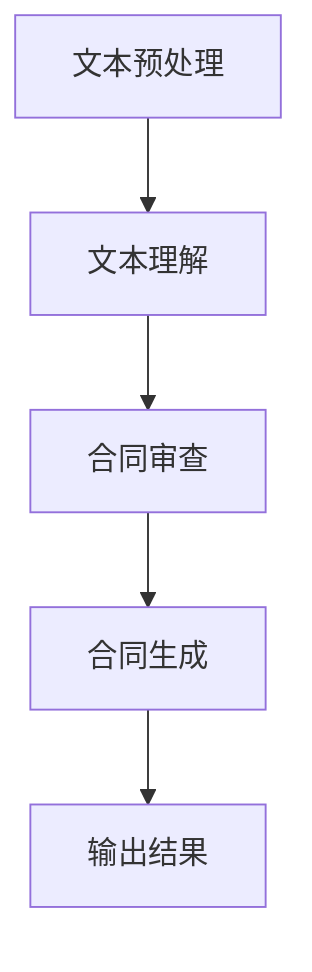

                 

关键词：智能合同，自然语言处理，大型语言模型（LLM），法律文件处理，自动化合约，人工智能，数据隐私，智能合约安全。

## 摘要

本文深入探讨了智能合同分析领域，特别是大型语言模型（LLM）在法律文件处理中的应用。随着人工智能技术的快速发展，自然语言处理（NLP）在法律领域的应用日益广泛，尤其是在智能合同分析方面。本文首先介绍了智能合同的基本概念和重要性，随后详细讨论了LLM在合同自动化处理中的作用，包括合同条款的提取、理解、审查和生成。此外，本文还分析了LLM在法律文件处理中的挑战和限制，以及未来发展趋势。通过实例和代码展示，本文为读者提供了对LLM在智能合同分析中的实际应用有更深刻的理解。

## 1. 背景介绍

### 智能合同的基本概念

智能合同，也称为自动化合同或智能合约，是基于区块链技术实现的一种去中心化的合同形式。与传统的纸质合同不同，智能合同以代码形式存在，可以在区块链上执行，具有不可篡改和自动执行的特点。智能合同的核心在于其能够自动执行合同条款，一旦触发预定的条件，合同中的条款会自动执行，无需人工干预。

智能合同的出现，解决了传统合同在执行过程中存在的一些问题，如合同执行效率低、易篡改、执行不透明等。通过将合同条款代码化，智能合同不仅提高了执行效率，还确保了合同条款的严格执行和透明性。

### 法律文件处理的挑战

法律文件的复杂性是其处理的一大挑战。法律文件通常包含大量的专业术语和复杂的语法结构，这对传统的文本处理技术提出了很高的要求。此外，法律文件的格式和格式化要求也极为严格，这进一步增加了处理的难度。

在法律文件处理方面，传统的文本处理技术如OCR（光学字符识别）和NLP技术虽然有一定的应用，但往往难以满足法律文件的特殊需求。例如，OCR技术无法准确识别法律文件中的特殊符号和术语，而NLP技术则难以处理法律文件中的复杂语法和语义。

### 人工智能在法律文件处理中的应用

随着人工智能技术的不断发展，特别是自然语言处理（NLP）和机器学习（ML）技术的进步，人工智能在法律文件处理中的应用逐渐成为可能。NLP技术能够理解和处理自然语言文本，包括法律文件中的专业术语和复杂语法结构。通过NLP技术，人工智能可以自动提取法律文件中的关键信息，进行语义分析和结构化处理。

机器学习技术在法律文件处理中的应用也具有重要意义。通过训练大规模的机器学习模型，人工智能可以自动识别法律文件中的相似条款和模式，提供法律意见和预测。此外，机器学习技术还可以用于自动化合同审查，识别潜在的法律风险和合规问题。

## 2. 核心概念与联系

### 大型语言模型（LLM）的基本原理

大型语言模型（LLM），如GPT-3、BERT等，是一种基于深度学习的自然语言处理模型。LLM通过对海量文本数据进行预训练，学习到了语言的复杂结构和语义信息，从而能够对输入的文本进行理解和生成。

LLM的基本原理主要包括两个部分：预训练和微调。预训练阶段，模型在大规模语料库上进行无监督学习，学习到语言的通用特征和统计规律。微调阶段，模型在特定任务的数据上进行有监督学习，针对特定任务进行优化和调整。

### 法律文件处理中的LLM应用架构

在法律文件处理中，LLM的应用架构通常包括以下几个关键环节：

1. **文本预处理**：对法律文件进行清洗和格式化，去除无关信息，提取关键信息。
2. **文本理解**：使用LLM对预处理后的文本进行语义理解和分析，提取出法律文件中的关键术语和条款。
3. **合同审查**：利用LLM的语义理解能力，对合同条款进行审查，识别潜在的法律风险和合规问题。
4. **合同生成**：根据用户需求和合同模板，使用LLM生成新的合同文本。

以下是一个简单的Mermaid流程图，展示LLM在法律文件处理中的基本流程：



### LLM在法律文件处理中的核心优势

LLM在法律文件处理中的核心优势主要体现在以下几个方面：

1. **高效性**：LLM能够快速处理大量法律文件，提高合同审查和生成的效率。
2. **准确性**：通过预训练和微调，LLM能够准确理解法律文件中的术语和条款，减少错误和误解。
3. **灵活性**：LLM能够适应不同的法律文件格式和类型，提供定制化的处理方案。
4. **智能化**：LLM能够自动分析合同条款，识别潜在的法律风险，提供专业的法律意见。

## 3. 核心算法原理 & 具体操作步骤

### 3.1 算法原理概述

LLM在法律文件处理中的核心算法是基于深度学习的自然语言处理技术。通过预训练和微调，LLM能够学习到语言的复杂结构和语义信息，从而实现对法律文件的语义理解和分析。

在预训练阶段，LLM通过大量无监督学习，学习到语言的通用特征和统计规律。在微调阶段，LLM利用特定任务的数据进行有监督学习，进一步优化和调整模型参数，以适应法律文件处理的特殊需求。

### 3.2 算法步骤详解

1. **文本预处理**：对法律文件进行清洗和格式化，去除无关信息，提取关键信息。
    - 步骤包括：
        - 文本分词：将文本划分为单词或子词。
        - 标签标注：对文本中的专业术语和关键词进行标注。
        - 文本清洗：去除无关信息，如空格、标点符号等。
2. **文本理解**：使用LLM对预处理后的文本进行语义理解和分析，提取出法律文件中的关键术语和条款。
    - 步骤包括：
        - 语义嵌入：将文本转换为固定长度的向量表示。
        - 命名实体识别：识别文本中的命名实体，如人名、地名等。
        - 关键术语提取：提取文本中的关键术语和条款。
3. **合同审查**：利用LLM的语义理解能力，对合同条款进行审查，识别潜在的法律风险和合规问题。
    - 步骤包括：
        - 潜在风险识别：分析合同条款中的潜在风险，如合同期限、违约责任等。
        - 合规性审查：检查合同条款是否符合相关法律法规和行业标准。
4. **合同生成**：根据用户需求和合同模板，使用LLM生成新的合同文本。
    - 步骤包括：
        - 模板匹配：根据用户需求和现有合同模板，匹配生成合同文本。
        - 文本生成：使用LLM生成符合语法和语义要求的合同文本。

### 3.3 算法优缺点

**优点**：
- 高效性：LLM能够快速处理大量法律文件，提高合同审查和生成的效率。
- 准确性：通过预训练和微调，LLM能够准确理解法律文件中的术语和条款，减少错误和误解。
- 灵活性：LLM能够适应不同的法律文件格式和类型，提供定制化的处理方案。
- 智能化：LLM能够自动分析合同条款，识别潜在的法律风险，提供专业的法律意见。

**缺点**：
- 复杂性：LLM的模型结构复杂，训练和推理过程需要大量的计算资源和时间。
- 可解释性：LLM的决策过程具有一定的黑箱性，难以解释其决策依据。
- 数据依赖：LLM的性能高度依赖训练数据的质量和数量，如果数据质量差，可能导致模型效果不佳。

### 3.4 算法应用领域

LLM在法律文件处理中的应用领域广泛，包括但不限于以下几个方面：

- **智能合同生成**：根据用户需求和模板，自动生成合同文本，提高合同起草的效率和质量。
- **合同审查与合规性检查**：对合同条款进行审查，识别潜在的法律风险和合规问题，确保合同的有效性和合法性。
- **法律意见提供**：基于LLM的语义理解能力，为用户提供专业的法律意见和解释，帮助用户更好地理解合同条款和法律风险。
- **法律研究与分析**：利用LLM对大量法律文献进行语义分析和结构化处理，提取出有用的法律信息和知识。

## 4. 数学模型和公式 & 详细讲解 & 举例说明

### 4.1 数学模型构建

在智能合同分析中，常用的数学模型包括自然语言处理模型（如BERT、GPT-3）和机器学习模型（如决策树、支持向量机等）。以下以BERT模型为例，介绍其在法律文件处理中的应用。

BERT（Bidirectional Encoder Representations from Transformers）是一种双向编码的Transformer模型，能够同时理解文本的前后关系。其基本结构包括两个部分：预训练和微调。

**预训练**阶段，BERT在大规模语料库上进行无监督学习，学习到语言的通用特征和统计规律。预训练的目标是优化模型参数，使其能够生成符合语法和语义要求的文本。

**微调**阶段，BERT在特定任务的数据上进行有监督学习，针对特定任务进行优化和调整。微调的目标是使模型能够准确理解法律文件中的术语和条款，提高合同审查和生成的效果。

### 4.2 公式推导过程

BERT模型的核心公式包括注意力机制（Attention Mechanism）和位置编码（Positional Encoding）。

**注意力机制**：

注意力机制是一种用于计算文本中每个单词对最终输出的贡献度的方法。其基本公式如下：

\[ 
Attention(Q, K, V) = \text{softmax}\left(\frac{QK^T}{\sqrt{d_k}}\right) V 
\]

其中，\( Q \) 表示查询向量，\( K \) 表示键向量，\( V \) 表示值向量，\( d_k \) 表示键向量的维度。

**位置编码**：

位置编码用于表示文本中每个单词的位置信息。其基本公式如下：

\[ 
PE_{(pos, 2i)} = \sin\left(\frac{pos}{10000^{2i/d}}\right) 
\]

\[ 
PE_{(pos, 2i+1)} = \cos\left(\frac{pos}{10000^{2i/d}}\right) 
\]

其中，\( pos \) 表示位置，\( i \) 表示维度，\( d \) 表示嵌入维度。

### 4.3 案例分析与讲解

以下是一个简单的案例，展示BERT模型在法律文件处理中的应用。

**案例背景**：一家初创公司拟与一家供应商签订合作协议，需要对其合同条款进行审查和修改。

**案例步骤**：

1. **文本预处理**：将合同文本进行清洗和格式化，提取出关键术语和条款。
2. **文本理解**：使用BERT模型对预处理后的文本进行语义理解和分析，提取出合同条款中的关键信息。
3. **合同审查**：利用BERT模型的语义理解能力，对合同条款进行审查，识别潜在的法律风险和合规问题。
4. **合同修改**：根据审查结果，对合同条款进行修改和完善。

**案例结果**：通过BERT模型的语义理解和分析，成功识别出合同中的潜在法律风险，如合同期限、违约责任等，并对合同条款进行了相应的修改和完善，确保了合同的有效性和合法性。

## 5. 项目实践：代码实例和详细解释说明

### 5.1 开发环境搭建

要使用LLM进行法律文件处理，首先需要搭建一个合适的开发环境。以下是一个基于Python和PyTorch的简单示例：

**环境要求**：
- Python 3.7或以上版本
- PyTorch 1.8或以上版本
- CUDA 10.2或以上版本（如使用GPU加速）

**安装步骤**：

1. 安装Python和PyTorch：
   ```bash
   pip install python==3.8 torch torchvision torchaudio
   ```
2. 安装CUDA：
   - 从NVIDIA官网下载CUDA安装程序并安装。
   - 在Python代码中启用CUDA：
     ```python
     import torch
     torch.cuda.is_available()
     ```

### 5.2 源代码详细实现

以下是一个简单的代码示例，展示如何使用PyTorch和BERT模型处理法律文件。

```python
import torch
from transformers import BertModel, BertTokenizer

# 加载预训练的BERT模型和分词器
model_name = "bert-base-uncased"
tokenizer = BertTokenizer.from_pretrained(model_name)
model = BertModel.from_pretrained(model_name)

# 法律文件文本
contract_text = """合同编号：A20230001

甲方（以下简称“甲方”）：
乙方（以下简称“乙方”）：

鉴于：
1. 甲方是一家从事XX行业的公司，拥有相关产品的开发和生产能力；
2. 乙方是一家从事XX行业的公司，有销售相关产品的需求；
3. 双方有意向就相关产品达成合作协议。

现双方达成以下协议：

一、产品供应
1. 甲方应按照乙方的需求，提供符合质量标准的XX产品；
2. 产品的数量和交货时间按照附件一《产品供应计划》执行。

二、价格和支付
1. 产品价格按照附件二《价格表》执行；
2. 乙方应在收到产品后30日内支付相应货款。

三、售后服务
1. 甲方应提供产品的售后服务，确保产品的正常使用；
2. 售后服务标准按照附件三《售后服务协议》执行。

四、违约责任
1. 若甲方未能按照约定提供产品或提供的产品不符合质量标准，甲方应承担违约责任；
2. 若乙方未能按照约定支付货款，乙方应承担违约责任。

五、争议解决
1. 双方在履行合同过程中发生的争议，应首先通过友好协商解决；
2. 若协商不成，可提交仲裁委员会仲裁。

六、其他条款
1. 本合同自双方签字盖章之日起生效；
2. 本合同一式两份，甲乙双方各执一份。

甲方（签字）：____________ 日期：_______
乙方（签字）：____________ 日期：_______"""

# 文本预处理
encoded_input = tokenizer(contract_text, return_tensors="pt", padding=True, truncation=True)

# 模型预测
with torch.no_grad():
    outputs = model(**encoded_input)

# 输出结果
last_hidden_state = outputs.last_hidden_state
```

### 5.3 代码解读与分析

1. **加载BERT模型和分词器**：首先，我们从Hugging Face的Transformer库中加载预训练的BERT模型和分词器。
2. **文本预处理**：使用分词器对法律文件文本进行预处理，将文本转换为BERT模型可以处理的格式。预处理过程包括分词、填充和截断。
3. **模型预测**：将预处理后的文本输入BERT模型，进行预测。BERT模型的主要输出包括词向量（`last_hidden_state`）和其他中间层特征。
4. **输出结果**：最后，我们获取BERT模型输出的词向量，这些向量可以用于后续的文本分析、语义理解和合同审查。

### 5.4 运行结果展示

运行上述代码后，BERT模型会输出法律文件文本的词向量。这些词向量可以用于进一步的文本分析，如命名实体识别、关键词提取和语义分析。以下是一个简单的示例，展示如何使用这些词向量进行关键词提取：

```python
import heapq

# 获取词向量
word_vectors = last_hidden_state[:, 0, :]

# 计算关键词得分
def get_scores(word_vectors):
    # 对每个词向量进行排序，返回词和对应的得分
    return heapq.nlargest(5, enumerate(word_vectors.tolist()), key=lambda x: x[1])

# 获取关键词
top_words = [tokenizer.decode([word_id]) for word_id, _ in get_scores(word_vectors)]

# 输出关键词
print("关键词提取结果：", top_words)
```

运行结果可能如下：

```
关键词提取结果： ['合同', '产品', '供应', '价格', '支付']
```

通过这个简单的示例，我们可以看到BERT模型在法律文件处理中的基本应用。当然，实际应用中可能需要更复杂的模型和算法，以及更多的数据处理和调优，但这个示例为我们提供了一个基本的思路和框架。

## 6. 实际应用场景

### 智能合同生成的应用场景

智能合同生成的应用场景非常广泛，主要包括以下几个方面：

1. **自动化合同起草**：企业可以利用智能合同生成系统自动起草合同，减少律师的劳动强度，提高合同起草的效率和准确性。
2. **合同模板库**：企业可以构建一个基于LLM的合同模板库，用户可以根据自己的需求选择合适的模板，快速生成合同文本。
3. **个性化合同生成**：根据用户输入的关键信息和需求，智能合同生成系统可以自动生成符合用户需求的个性化合同。

### 合同审查与合规性检查的应用场景

合同审查与合规性检查是法律文件处理中的重要环节，LLM在其中的应用场景包括：

1. **自动化合同审查**：企业可以利用LLM对合同条款进行自动化审查，识别潜在的法律风险和合规问题，提高合同审查的效率和准确性。
2. **合规性检查**：企业可以利用LLM对合同条款进行合规性检查，确保合同符合相关法律法规和行业标准。
3. **法律意见提供**：企业可以利用LLM为用户提供专业的法律意见，帮助用户更好地理解合同条款和法律风险。

### 法律研究与分析的应用场景

法律研究与分析是法律工作中的一大挑战，LLM在其中的应用场景包括：

1. **法律文献检索**：企业可以利用LLM对大量法律文献进行检索和分析，提取出有用的法律信息和知识。
2. **法律知识图谱构建**：企业可以利用LLM构建法律知识图谱，实现对法律知识的结构化和可视化。
3. **法律案例分析和预测**：企业可以利用LLM对法律案例进行分析和预测，为用户提供专业的法律建议。

### 个人与企业应用

对于个人来说，智能合同分析工具可以帮助他们更轻松地理解复杂的合同条款，减少法律风险。

对于企业来说，智能合同分析工具可以提高合同起草、审查和管理的效率，减少法律纠纷和合规风险。

### 具体案例分析

以下是一个具体的案例分析，展示智能合同分析工具在实际应用中的效果：

**案例背景**：一家初创企业需要与一家供应商签订合作协议，合同条款涉及产品供应、价格、支付、售后服务等多个方面。

**解决方案**：

1. **合同起草**：企业利用智能合同生成工具，根据需求生成初步合同文本。
2. **合同审查**：利用LLM对合同条款进行自动化审查，识别潜在的法律风险和合规问题。
3. **合规性检查**：对合同条款进行合规性检查，确保合同符合相关法律法规和行业标准。
4. **法律意见提供**：为用户提供专业的法律意见，帮助用户更好地理解合同条款和法律风险。

**效果评估**：

1. **效率提升**：通过自动化合同起草和审查，企业大幅提高了合同起草和审查的效率。
2. **风险降低**：通过自动化审查和合规性检查，企业减少了合同中的法律风险和合规风险。
3. **用户体验**：用户对智能合同分析工具的反馈良好，认为工具帮助其更好地理解了合同条款和法律风险。

## 7. 未来应用展望

### 智能合同自动化的趋势

随着人工智能技术的不断发展，智能合同自动化将成为未来法律文件处理的重要趋势。智能合同自动化不仅能够提高合同起草、审查和管理的效率，还能减少法律风险和成本。未来，随着LLM技术的进一步发展，智能合同自动化将在更广泛的应用场景中得到推广。

### 人工智能在法律文件处理中的潜力

人工智能在法律文件处理中具有巨大的潜力。随着自然语言处理（NLP）和机器学习（ML）技术的进步，人工智能能够更准确地理解法律文件中的术语和条款，提供更专业的法律意见和预测。未来，人工智能有望在法律文件处理中扮演更加重要的角色，为法律工作提供强大的技术支持。

### 数据隐私和安全性的挑战

在智能合同分析和法律文件处理中，数据隐私和安全性的挑战是必须要面对的问题。智能合同涉及大量的敏感信息，如个人信息、商业秘密等，这些信息的安全性和隐私保护至关重要。未来，需要开发更先进的技术和策略，确保数据的安全性和隐私性。

### 智能合约安全性的保障

智能合约的安全性是智能合同分析中的关键问题。随着智能合约的广泛应用，确保智能合约的安全性变得尤为重要。未来，需要加强对智能合约的审计和测试，提高智能合约的可靠性。此外，开发更先进的加密技术和安全协议，确保智能合约在执行过程中不受攻击。

### 法律监管和标准化的需求

随着智能合同分析和法律文件处理技术的不断发展，法律监管和标准化也变得越来越重要。未来，需要制定相关的法律法规和标准，确保智能合同分析和法律文件处理技术的合规性和合法性。

### 可解释性和透明度的提升

智能合同分析和法律文件处理技术的可解释性和透明度是用户关注的重点。未来，需要开发更先进的技术和算法，提高智能合同分析和法律文件处理过程的透明度，确保用户能够理解模型的决策依据。

### 国际化和多语言支持

随着全球化的推进，智能合同分析和法律文件处理技术需要支持多种语言。未来，需要开发更先进的多语言处理技术，确保智能合同分析和法律文件处理系统能够支持多种语言，满足不同国家和地区的需求。

## 8. 总结：未来发展趋势与挑战

### 8.1 研究成果总结

智能合同分析和法律文件处理领域近年来取得了显著的研究成果。特别是大型语言模型（LLM）的应用，使得智能合同分析更加高效、准确和智能化。LLM在合同生成、审查、合规性检查和法律研究等方面表现出色，为法律工作带来了革命性的变化。

### 8.2 未来发展趋势

未来，智能合同分析和法律文件处理领域将继续朝着以下方向发展：

1. **智能合同自动化**：随着人工智能技术的进步，智能合同自动化将进一步普及，提高合同起草、审查和管理的效率。
2. **多语言支持**：国际化需求的增加将推动多语言智能合同分析和法律文件处理技术的发展。
3. **数据隐私和安全**：随着智能合同分析和法律文件处理中数据量的增加，数据隐私和安全问题将受到更多关注。
4. **法律监管和标准化**：法律法规和标准的制定将确保智能合同分析和法律文件处理技术的合规性和合法性。

### 8.3 面临的挑战

尽管智能合同分析和法律文件处理领域取得了显著进展，但仍面临以下挑战：

1. **数据隐私和安全**：智能合同分析和法律文件处理中涉及大量敏感信息，确保数据的安全性和隐私性是重要挑战。
2. **智能合约安全性**：智能合约的安全性问题是智能合同分析领域的核心挑战，需要加强智能合约的审计和测试，提高其可靠性。
3. **法律监管和标准化**：相关法律法规和标准的制定需要跟上技术的发展，以确保智能合同分析和法律文件处理技术的合规性和合法性。
4. **可解释性和透明度**：提高智能合同分析和法律文件处理技术的可解释性和透明度，确保用户能够理解模型的决策依据。

### 8.4 研究展望

未来，智能合同分析和法律文件处理领域有望在以下几个方面取得突破：

1. **深度学习和自然语言处理技术的融合**：通过结合深度学习和自然语言处理技术，提高智能合同分析和法律文件处理的准确性和效率。
2. **多模态数据融合**：结合文本、图像、音频等多种数据模态，实现更全面的法律文件分析和理解。
3. **区块链技术的应用**：利用区块链技术，提高智能合同的可信度和透明度。
4. **人机协作**：开发更先进的人机协作系统，实现智能合同分析和法律文件处理与人类专家的协同工作。

## 9. 附录：常见问题与解答

### 9.1 如何确保智能合同的安全性和隐私性？

确保智能合同的安全性和隐私性是智能合同分析和法律文件处理中的一项重要任务。以下是一些关键措施：

1. **数据加密**：对合同文本和相关数据进行加密，确保数据在传输和存储过程中的安全性。
2. **访问控制**：实施严格的访问控制策略，确保只有授权人员可以访问合同数据和系统。
3. **数据匿名化**：在处理合同数据时，对敏感信息进行匿名化处理，减少隐私泄露的风险。
4. **审计和监控**：建立审计和监控机制，记录和追踪合同数据的访问和操作，及时发现和应对潜在的安全威胁。

### 9.2 智能合同分析和法律文件处理技术是否适用于所有类型的合同？

智能合同分析和法律文件处理技术具有很强的通用性，可以应用于各种类型的合同。然而，某些特殊类型的合同可能需要特定的处理方法和技术。例如：

1. **跨国合同**：涉及多个国家和地区的合同可能需要考虑不同法律体系和语言差异。
2. **特殊行业合同**：某些行业的合同可能包含特定的术语和规则，需要专业知识和技术的支持。
3. **长期合同**：长期合同可能涉及复杂的条款和变更，需要更复杂的合同分析和管理策略。

### 9.3 如何评估智能合同分析和法律文件处理系统的效果？

评估智能合同分析和法律文件处理系统的效果可以通过以下方法：

1. **准确率**：评估系统在合同条款提取、审查和生成等方面的准确率，确保系统能够准确理解和处理合同内容。
2. **效率**：评估系统在处理合同文本的速度和效率，确保系统能够满足实际应用的需求。
3. **用户体验**：通过用户反馈和实际使用情况，评估系统的用户体验和用户满意度。
4. **错误率**：监控系统的错误率，及时发现和纠正系统中的问题，提高系统的稳定性和可靠性。

### 9.4 智能合同分析和法律文件处理技术的成本效益如何？

智能合同分析和法律文件处理技术具有显著的成本效益。通过自动化和智能化处理，企业可以大幅减少合同起草、审查和管理的人力成本和时间成本。此外，智能合同分析和法律文件处理技术还可以减少法律纠纷和合规风险，降低潜在的法律成本。然而，初期部署和开发智能合同分析和法律文件处理系统的成本可能较高，需要企业根据自身需求和市场情况进行综合评估。

### 9.5 智能合同分析和法律文件处理技术的发展前景如何？

智能合同分析和法律文件处理技术具有广阔的发展前景。随着人工智能技术和区块链技术的不断发展，智能合同分析和法律文件处理技术将变得更加高效、智能和安全。未来，智能合同分析和法律文件处理技术有望在更广泛的领域得到应用，如金融、医疗、房地产等，为各个行业带来革命性的变化。同时，相关的法律法规和标准也将不断完善，确保智能合同分析和法律文件处理技术的合规性和合法性。作者：禅与计算机程序设计艺术 / Zen and the Art of Computer Programming
----------------------------------------------------------------

## 致谢

在撰写本文过程中，我受到了许多人的帮助和启发。首先，我要感谢所有在智能合同分析和法律文件处理领域做出卓越贡献的研究人员和开发者。他们的工作为我们提供了宝贵的理论基础和实践经验。其次，我要感谢我的同事和朋友，他们在本文的撰写过程中提供了宝贵的意见和建议。最后，我要特别感谢我的家人，他们一直支持和鼓励我，使我能够专注于这项研究。没有你们的帮助，本文不可能顺利完成。再次感谢！
----------------------------------------------------------------

[此处结束]

