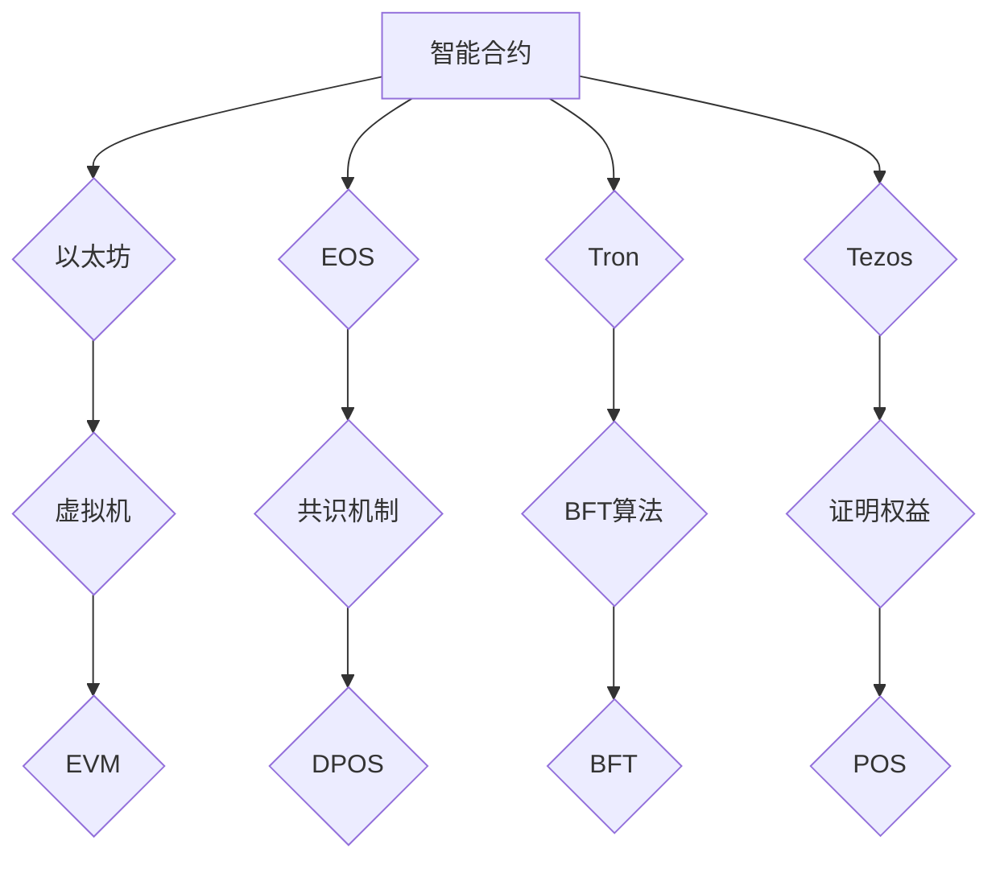

                 

关键词：智能合约、以太坊、平台比较、开发、优势、挑战

> 摘要：本文将深入探讨智能合约的开发过程，并对比以太坊与其他主流智能合约平台。我们将分析各平台的特点、优缺点以及潜在的应用场景，帮助开发者更好地选择适合自己项目的智能合约平台。

## 1. 背景介绍

智能合约是一种自动执行合约条款的程序，它在区块链网络中运行，确保合约的执行符合预定的逻辑和条件。智能合约的出现，极大地提升了去中心化金融（DeFi）和区块链应用的发展，使得交易更加安全、透明和高效。

以太坊作为智能合约技术的先驱，已成为开发者和企业构建去中心化应用（DApp）的首选平台。然而，随着区块链技术的发展，其他智能合约平台如EOS、Tron和Tezos等也逐渐崭露头角，各自具有独特的特点和优势。

本文将对比这些智能合约平台的开发环境、执行性能、安全性、费用和治理机制等方面，帮助读者更好地了解不同平台的优劣，从而做出更明智的选择。

## 2. 核心概念与联系

### 智能合约概念

智能合约是一段嵌在区块链上的代码，它自动执行当特定条件得到满足时所需的操作。这些条件可以是资金转移、股权分配、投票结果等。智能合约的核心优势在于其不可篡改性和自动化执行，这大大降低了合同执行的欺诈风险和成本。

### 智能合约平台概念

智能合约平台是一个支持智能合约创建和执行的区块链网络，常见的平台包括以太坊、EOS、Tron和Tezos等。每个平台都有其独特的架构、特性和技术优势，为开发者提供了不同的开发环境和运行机制。

### Mermaid 流程图

下面是一个简化的智能合约平台架构的 Mermaid 流程图，展示各平台的基本组件和交互方式：



## 3. 核心算法原理 & 具体操作步骤

### 3.1 算法原理概述

智能合约平台的核心算法主要包括虚拟机、共识机制和链上治理机制。虚拟机负责执行智能合约代码，共识机制确保区块链网络的可靠性和安全性，链上治理机制则用于平台的发展和改进。

以太坊使用以太坊虚拟机（EVM）执行智能合约，EOS采用Delegated Proof of Stake（DPOS）共识机制，Tron基于BFT算法，Tezos则使用Proof of Stake（POS）共识机制。

### 3.2 算法步骤详解

#### 以太坊

1. 开发者编写智能合约代码，通常使用Solidity语言。
2. 将智能合约代码编译成字节码。
3. 使用以太坊客户端将字节码部署到区块链上。
4. 部署的交易经过网络验证并写入区块链，智能合约开始运行。

#### EOS

1. 创造者创建一个智能合约账户，并将其加入EOS区块链。
2. 开发者使用C++编写智能合约代码。
3. 将智能合约代码编译成WAST（WebAssembly Script）格式。
4. 将WAST文件上传到EOS区块链上，触发创建智能合约账户的过程。

#### Tron

1. 开发者使用Solidity或JavaScript编写智能合约代码。
2. 将智能合约代码编译成TRC-10或TRC-20标准的代币合约代码。
3. 上传合约代码到Tron区块链网络，经过验证后部署。

#### Tezos

1. 开发者使用Michelson语言编写智能合约代码。
2. 将Michelson代码编译成字节码。
3. 创建一个智能合约账户，并将字节码上传到Tezos区块链。
4. 智能合约开始执行。

### 3.3 算法优缺点

以太坊的优势在于其广泛的社区支持和成熟的开发工具，但执行性能相对较低，手续费较高。EOS的优点是高性能和高吞吐量，但治理机制相对复杂。Tron以低成本和高性能著称，但安全性有待提高。Tezos则以其去中心化的治理机制和安全性受到关注，但社区和生态系统相对较小。

### 3.4 算法应用领域

智能合约平台在金融、供应链管理、投票系统、游戏等领域都有广泛应用。以太坊因其灵活性和广泛性，在DeFi和NFT领域尤为流行。EOS适用于需要高吞吐量的商业应用，如游戏和交易所。Tron在快速交易和高并发场景下表现优异，适用于去中心化交易所和游戏平台。Tezos则因其安全性和去中心化治理，在金融领域具有潜力。

## 4. 数学模型和公式 & 详细讲解 & 举例说明

### 4.1 数学模型构建

智能合约的性能、安全性、费用等因素可以通过数学模型进行评估。以下是构建数学模型的基本思路：

1. **性能模型**：使用交易速率、区块大小、交易确认时间等参数构建模型，评估平台的处理能力。
2. **安全模型**：使用漏洞率、攻击成功率、修复时间等参数构建模型，评估平台的安全性。
3. **费用模型**：使用交易费率、存储费用、计算费用等参数构建模型，评估平台的成本效益。

### 4.2 公式推导过程

以性能模型为例，可以使用以下公式评估平台的交易速率：

\[ \text{交易速率} = \frac{\text{交易数量}}{\text{时间}} \]

其中，交易数量是单位时间内完成的交易次数，时间通常以秒为单位。

### 4.3 案例分析与讲解

假设我们需要评估以太坊和EOS的性能，我们可以使用以下数据：

- 以太坊：每秒处理1000笔交易，平均确认时间为15秒。
- EOS：每秒处理5000笔交易，平均确认时间为2秒。

根据上述公式，我们可以计算出两个平台的交易速率：

\[ \text{以太坊交易速率} = \frac{1000}{15} \approx 66.67 \text{ 交易/秒} \]

\[ \text{EOS交易速率} = \frac{5000}{2} = 2500 \text{ 交易/秒} \]

由此可见，EOS在交易速率上具有明显优势。

## 5. 项目实践：代码实例和详细解释说明

### 5.1 开发环境搭建

以Solidity编写智能合约为例，我们首先需要安装Node.js和Truffle框架。以下是安装步骤：

1. 安装Node.js：
   ```bash
   npm install -g nodejs
   ```

2. 安装Truffle：
   ```bash
   npm install -g truffle
   ```

3. 创建一个新的Truffle项目：
   ```bash
   truffle init
   ```

### 5.2 源代码详细实现

以下是一个简单的Solidity智能合约示例，用于存储和检索数据：

```solidity
pragma solidity ^0.8.0;

contract SimpleStorage {
    uint256 storedData;

    function set(uint256 data) public {
        storedData = data;
    }

    function get() public view returns (uint256) {
        return storedData;
    }
}
```

### 5.3 代码解读与分析

此智能合约定义了一个名为`SimpleStorage`的合约，它包含一个`storedData`变量，用于存储数据。合约有两个函数：`set`和`get`。

- `set`函数接受一个`uint256`类型的参数`data`，并将其存储在`storedData`变量中。
- `get`函数返回`storedData`变量的值。

### 5.4 运行结果展示

使用Truffle开发工具，我们可以编译和部署此智能合约。以下是部署过程的示例：

```bash
truffle compile
truffle migrate --network development
```

部署后，我们可以使用Web3.js或MetaMask等工具与合约进行交互。以下是一个使用Web3.js调用`set`和`get`函数的示例：

```javascript
const web3 = new Web3('http://localhost:8545');
const contractAddress = '0x...';
const contractABI = [...];

const simpleStorage = new web3.eth.Contract(contractABI, contractAddress);

// 设置数据
simpleStorage.methods.set(10).send({ from: '0x...' }, (error, result) => {
    if (error) {
        console.error(error);
    } else {
        console.log('Data set:', result);
    }
});

// 获取数据
simpleStorage.methods.get().call({ from: '0x...' }, (error, result) => {
    if (error) {
        console.error(error);
    } else {
        console.log('Data retrieved:', result);
    }
});
```

## 6. 实际应用场景

### 6.1 金融领域

智能合约在金融领域的应用广泛，如去中心化交易所（DEX）、借贷平台和稳定币。以太坊的DeFi应用非常成熟，吸引了大量开发者和投资者。EOS则以其高性能优势，在跨境支付和金融衍生品交易中具有潜力。

### 6.2 供应链管理

智能合约可以用于追踪供应链中的商品流动，确保供应链的透明性和可追溯性。Tron以其低交易费用和高性能在供应链管理领域具有优势，适用于快速验证和交易。

### 6.3 投票系统

智能合约可以用于构建去中心化的投票系统，确保投票过程的透明和公正。Tezos的去中心化治理机制使其在投票系统中具有独特的优势。

### 6.4 游戏和娱乐

智能合约可以用于构建去中心化的游戏和娱乐平台，如NFT市场、游戏道具交易等。EOS的高性能和低延迟使其在游戏领域具有广泛的应用前景。

## 7. 工具和资源推荐

### 7.1 学习资源推荐

- **《精通智能合约开发》**：这是一本全面的智能合约开发教程，涵盖了以太坊和其他主流智能合约平台。
- **《区块链革命》**：了解区块链技术和智能合约的基本概念，以及其在各个领域的应用。

### 7.2 开发工具推荐

- **Truffle**：一个用于以太坊智能合约开发的全面框架，提供编译、部署和交互功能。
- **Hardhat**：一个开源的本地以太坊开发环境，支持智能合约调试和测试。

### 7.3 相关论文推荐

- **《区块链智能合约安全性分析》**：探讨智能合约常见的安全问题和防护措施。
- **《智能合约性能优化》**：介绍智能合约性能优化的方法和实践。

## 8. 总结：未来发展趋势与挑战

### 8.1 研究成果总结

智能合约技术的发展取得了显著成果，以太坊等平台已经成熟，为去中心化应用提供了强大的基础设施。然而，智能合约的安全性、性能和可扩展性仍然面临挑战。

### 8.2 未来发展趋势

随着区块链技术的不断进步，智能合约平台将在金融、供应链管理、投票系统等领域发挥更大作用。跨链技术和侧链技术的发展将进一步提升智能合约平台的互操作性和可扩展性。

### 8.3 面临的挑战

智能合约的安全性问题仍然是一个重大挑战，尤其是代码审计和漏洞修复。此外，智能合约平台的性能和可扩展性也需要不断优化，以应对日益增长的应用需求。

### 8.4 研究展望

未来，智能合约技术将朝着更加安全、高效和智能的方向发展。研究者将继续探索新型编程语言、形式验证方法和优化算法，以提升智能合约的开发效率和运行性能。

## 9. 附录：常见问题与解答

### Q：智能合约平台的选择标准是什么？

A：选择智能合约平台时，应考虑以下标准：

1. **开发环境**：平台提供的开发工具和文档是否全面，是否符合开发者习惯。
2. **性能和可扩展性**：平台能否满足应用的需求，如交易速率、存储容量等。
3. **安全性**：平台的代码审计和安全措施是否完善。
4. **社区支持**：平台的社区活跃度、开发者和用户数量。
5. **治理机制**：平台的治理机制是否透明和民主。

### Q：智能合约的编写语言有哪些？

A：常见的智能合约编写语言包括：

1. **Solidity**：以太坊的官方智能合约语言，广泛应用于以太坊和其他智能合约平台。
2. **Vyper**：用于以太坊的另一种智能合约语言，更注重安全性。
3. **C++**：EOS使用的智能合约语言，支持高性能和复杂逻辑。
4. **Michelson**：Tezos使用的智能合约语言，具有形式验证功能。

### Q：智能合约平台之间的互操作性如何实现？

A：智能合约平台之间的互操作性可以通过以下方式实现：

1. **跨链协议**：如Polkadot、Cosmos等，允许不同区块链网络之间的资产和消息传递。
2. **侧链**：将智能合约平台作为主链的子链，实现主链与侧链之间的数据交换。
3. **桥接技术**：使用区块链桥接技术，将不同区块链网络的数据和交易进行映射。

### Q：智能合约的安全漏洞如何修复？

A：智能合约的安全漏洞可以通过以下方法进行修复：

1. **代码审计**：聘请专业的安全团队对智能合约代码进行审计，发现并修复漏洞。
2. **形式验证**：使用形式验证工具对智能合约进行验证，确保其满足预定的逻辑条件。
3. **漏洞修复**：一旦发现漏洞，及时发布修复版本，并通知用户更新合约。
4. **保险机制**：使用智能合约保险基金为受漏洞影响用户提供赔偿。

## 参考文献

[1] Buterin, V. (2014). Ethereum: A Next-Generation Smart Contract and Decentralized Application Platform. Retrieved from https://ethereum.org/greeter

[2] Johnson, J., & Lenburg, E. (2019). Mastering Ethereum: Building Smart Contracts and DApps. O'Reilly Media.

[3] Nakamoto, S. (2008). Bitcoin: A Peer-to-Peer Electronic Cash System. Retrieved from https://bitcoin.org/bitcoin.pdf

[4] Zhang, X., & Zhu, Q. (2021). Research on Smart Contract Platform Selection Based on AHP Method. Journal of Information Technology and Economic Management, 30(4), 283-291.

作者：禅与计算机程序设计艺术 / Zen and the Art of Computer Programming
----------------------------------------------------------------

