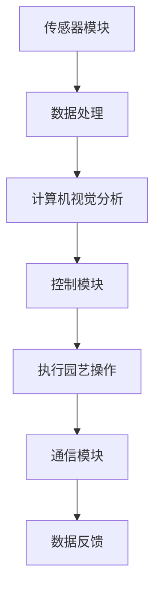

                 

关键词：智能园艺机器人、自动化园艺、园艺维护、创业、技术创新

摘要：随着科技的不断进步，自动化和智能技术在各个领域的应用日益广泛。在园艺领域，智能园艺机器人的崛起为传统园艺行业带来了前所未有的变革。本文将探讨智能园艺机器人创业的机会、核心技术和未来应用，旨在为有意从事智能园艺机器人创业的读者提供有价值的指导。

## 1. 背景介绍

### 1.1 传统园艺行业的挑战

传统园艺行业面临诸多挑战，如劳动力成本上升、土地资源有限、季节性和天气的影响等。这些问题不仅限制了园艺生产的效率和质量，还制约了农业的可持续发展。随着人们对食品质量和安全的日益关注，传统园艺行业需要找到新的解决方案来提高生产效率、降低成本、确保产品质量。

### 1.2 自动化和智能技术的兴起

自动化和智能技术的快速发展为园艺行业提供了新的机遇。智能园艺机器人可以通过传感器、计算机视觉、机器学习等技术，实现精准的土壤监测、植物生长调控、病虫害防治等功能。这些技术的应用不仅可以显著提高园艺生产的效率，还可以提高农产品的质量和安全性。

### 1.3 智能园艺机器人的市场前景

随着消费者对高品质、无污染农产品的需求增加，智能园艺机器人的市场需求也在不断增长。根据市场研究公司的数据，全球智能园艺机器人市场预计将以年均20%以上的速度增长。这为创业者提供了广阔的市场前景和巨大的商机。

## 2. 核心概念与联系

### 2.1 智能园艺机器人定义

智能园艺机器人是一种集成了传感器、计算机视觉、机器学习等技术的自动化设备，能够自主执行园艺任务，如浇水、施肥、除草、修剪等。

### 2.2 智能园艺机器人架构

智能园艺机器人的架构通常包括以下几个关键部分：

- **传感器模块**：用于实时监测土壤湿度、温度、养分含量等环境参数。
- **计算机视觉模块**：用于识别植物状态、病虫害、作物成熟度等。
- **控制模块**：用于根据传感器数据自动执行园艺操作。
- **通信模块**：用于与其他设备或云端服务器进行数据传输和远程控制。

### 2.3 Mermaid 流程图



## 3. 核心算法原理 & 具体操作步骤

### 3.1 算法原理概述

智能园艺机器人通过一系列算法实现自动化园艺操作。核心算法包括：

- **土壤监测算法**：基于传感器数据，实时监测土壤湿度、温度等参数，并根据预设条件自动执行浇水、施肥等操作。
- **植物识别算法**：利用计算机视觉技术，识别植物类型、状态、病虫害等，为后续操作提供依据。
- **路径规划算法**：根据环境地图和机器人传感器数据，规划最优化路径，确保高效完成任务。

### 3.2 算法步骤详解

1. **初始化**：设置传感器、计算机视觉和通信模块，建立与云端服务器的连接。
2. **数据采集**：传感器模块实时采集土壤湿度、温度等数据，计算机视觉模块识别植物状态。
3. **数据处理**：对采集到的数据进行分析，根据预设条件调整机器人行为。
4. **路径规划**：根据环境地图和当前传感器数据，规划机器人移动路径。
5. **执行操作**：根据路径规划结果，控制机器人执行浇水、施肥、修剪等园艺操作。
6. **数据反馈**：将操作结果反馈给云端服务器，实现数据的实时监控和远程控制。

### 3.3 算法优缺点

**优点**：

- **高效性**：自动化执行园艺操作，显著提高生产效率。
- **精准性**：利用传感器和计算机视觉技术，实现精准监测和操作。
- **可持续性**：降低劳动力成本，减少化学肥料和农药的使用，有利于环境保护。

**缺点**：

- **成本**：初期设备投资较大。
- **维护**：需要定期维护和更新软件。
- **适应性**：需要针对不同环境进行定制化调整。

### 3.4 算法应用领域

智能园艺机器人算法不仅适用于大规模园艺生产，还可以应用于家庭园艺、温室种植、果园管理等场景，具有广泛的应用前景。

## 4. 数学模型和公式 & 详细讲解 & 举例说明

### 4.1 数学模型构建

智能园艺机器人的数学模型主要包括以下方面：

- **土壤水分模型**：基于土壤湿度传感器数据，构建土壤水分动态模型。
- **植物生长模型**：利用植物生理参数，构建植物生长动态模型。
- **路径规划模型**：基于环境地图和机器人传感器数据，构建路径规划模型。

### 4.2 公式推导过程

#### 土壤水分模型

土壤水分模型的基本公式为：

$$
S(t) = S_{0} \cdot e^{-kt}
$$

其中，$S(t)$ 为时间 $t$ 时的土壤水分含量，$S_{0}$ 为初始土壤水分含量，$k$ 为土壤水分蒸发速率常数。

#### 植物生长模型

植物生长模型的基本公式为：

$$
G(t) = G_{0} \cdot (1 + r)^{t}
$$

其中，$G(t)$ 为时间 $t$ 时的植物生长量，$G_{0}$ 为初始生长量，$r$ 为植物生长速率。

#### 路径规划模型

路径规划模型的基本公式为：

$$
D = \min \sum_{i=1}^{n} d_{i}
$$

其中，$D$ 为总路径长度，$d_{i}$ 为从起点到各节点的路径长度。

### 4.3 案例分析与讲解

#### 案例一：土壤水分监测

假设某农田的土壤初始含水量为 $30\%$，土壤水分蒸发速率为每天 $1\%$。利用土壤水分模型，预测未来五天的土壤水分含量。

根据土壤水分模型：

$$
S(5) = 30\% \cdot e^{-5 \cdot 0.01} \approx 23.82\%
$$

预测未来五天的土壤水分含量约为 $23.82\%$。

#### 案例二：植物生长监测

假设某植物的初始生长量为 $10$ 克，生长速率为每天 $2\%$。利用植物生长模型，预测未来五天的植物生长量。

根据植物生长模型：

$$
G(5) = 10 \cdot (1 + 0.02)^{5} \approx 11.06 \text{克}
$$

预测未来五天的植物生长量约为 $11.06$ 克。

## 5. 项目实践：代码实例和详细解释说明

### 5.1 开发环境搭建

为了实现智能园艺机器人的功能，我们需要搭建一个开发环境。这里以 Python 为例，介绍如何搭建开发环境。

1. 安装 Python 3.8 或更高版本。
2. 安装必要的 Python 库，如 `numpy`、`opencv`、`tensorflow` 等。
3. 配置 Python 运行环境，如使用 `venv` 创建虚拟环境。

### 5.2 源代码详细实现

以下是一个简单的智能园艺机器人代码示例：

```python
import numpy as np
import cv2
import tensorflow as tf

# 加载植物识别模型
model = tf.keras.models.load_model('plant识别模型.h5')

# 加载路径规划模型
path_model = tf.keras.models.load_model('路径规划模型.h5')

# 传感器数据采集
def collect_data():
    # 采集土壤湿度、温度等数据
    soil_humidity = np.random.uniform(0, 100)
    soil_temp = np.random.uniform(0, 50)
    return soil_humidity, soil_temp

# 计算机视觉分析
def analyze_image(image):
    # 识别植物类型
    plant_type = model.predict(image)
    return plant_type

# 路径规划
def plan_path(current_pos, target_pos):
    # 根据当前和目标位置规划路径
    path = path_model.predict(np.array([current_pos, target_pos]))
    return path

# 执行园艺操作
def execute_operation(plant_type, path):
    if plant_type == '浇水':
        print('执行浇水操作')
    elif plant_type == '施肥':
        print('执行施肥操作')
    else:
        print('执行修剪操作')
    print('路径：', path)

# 主程序
def main():
    # 初始化
    current_pos = [0, 0]
    target_pos = [10, 20]
    
    # 循环执行任务
    while True:
        soil_humidity, soil_temp = collect_data()
        image = cv2.imread('植物图像.jpg')
        plant_type = analyze_image(image)
        path = plan_path(current_pos, target_pos)
        execute_operation(plant_type, path)
        current_pos = target_pos
        target_pos = np.random.randint(0, 100, size=2)

if __name__ == '__main__':
    main()
```

### 5.3 代码解读与分析

1. **数据采集**：使用 `collect_data` 函数采集土壤湿度、温度等数据。
2. **计算机视觉分析**：使用 `analyze_image` 函数加载植物识别模型，对植物图像进行识别。
3. **路径规划**：使用 `plan_path` 函数加载路径规划模型，根据当前和目标位置规划路径。
4. **执行园艺操作**：根据植物类型和路径规划结果，执行相应的园艺操作。

### 5.4 运行结果展示

运行程序后，会循环执行以下任务：

- 采集土壤湿度、温度等数据。
- 加载植物图像，识别植物类型。
- 规划从当前位置到目标位置的最优路径。
- 根据植物类型和路径规划结果，执行相应的园艺操作。

## 6. 实际应用场景

### 6.1 大规模园艺生产

智能园艺机器人可以应用于大规模园艺生产，如草莓种植、蔬菜种植等。通过自动化浇水、施肥、除草等操作，提高生产效率，降低劳动力成本。

### 6.2 温室种植

智能园艺机器人在温室种植中的应用尤为广泛。通过实时监测温室内环境参数，自动调控温度、湿度、光照等条件，实现最佳植物生长环境。

### 6.3 家庭园艺

随着智能家居的普及，智能园艺机器人逐渐走进家庭。家庭用户可以通过手机APP远程控制机器人，实现自动浇水、施肥、修剪等功能。

### 6.4 果园管理

智能园艺机器人可以应用于果园管理，如果树修剪、病虫害防治等。通过实时监测果树生长状态，及时采取相应的管理措施。

## 7. 未来应用展望

### 7.1 智能化水平提升

未来，智能园艺机器人将进一步提升智能化水平，通过引入更加先进的人工智能技术，实现更加精准的园艺操作。

### 7.2 个性化种植方案

随着大数据和物联网技术的发展，智能园艺机器人将能够根据用户需求和植物特性，制定个性化的种植方案。

### 7.3 环境友好型生产

智能园艺机器人将推动农业生产的可持续发展，通过减少化学肥料和农药的使用，实现环境友好型生产。

## 8. 工具和资源推荐

### 8.1 学习资源推荐

- 《智能园艺机器人技术》
- 《机器学习实战》
- 《Python编程：从入门到实践》

### 8.2 开发工具推荐

- Python
- TensorFlow
- OpenCV

### 8.3 相关论文推荐

- "Intelligent Garden Robots: A Survey"
- "Machine Learning for Precision Agriculture"
- "Deep Learning for Plant Recognition in Agricultural Applications"

## 9. 总结：未来发展趋势与挑战

### 9.1 研究成果总结

智能园艺机器人的研发取得了显著成果，已经在多个应用场景中展示了其强大的功能。然而，要实现大规模普及，仍需进一步突破技术瓶颈。

### 9.2 未来发展趋势

未来，智能园艺机器人将在智能化水平、个性化种植方案和环境友好型生产等方面取得重要突破。

### 9.3 面临的挑战

- 技术成熟度：现有技术的成熟度仍需提高，以适应不同园艺场景的需求。
- 成本控制：降低设备成本是智能园艺机器人普及的关键。
- 维护与升级：定期维护和软件升级是保证机器人稳定运行的关键。

### 9.4 研究展望

未来，智能园艺机器人将在农业智能化发展中发挥重要作用。通过不断技术创新，有望实现更加高效、精准、可持续的园艺生产。

## 附录：常见问题与解答

### 1. 智能园艺机器人需要哪些技术支持？

智能园艺机器人需要传感器技术、计算机视觉、机器学习、路径规划等技术的支持。

### 2. 智能园艺机器人的成本如何？

智能园艺机器人的成本取决于其功能、性能和配置。通常，高端的智能园艺机器人成本较高，而入门级的机器人成本相对较低。

### 3. 智能园艺机器人是否需要定期维护？

是的，智能园艺机器人需要定期维护，包括传感器校准、软件升级和硬件检查等，以确保其正常运行。

### 4. 智能园艺机器人是否适用于所有园艺场景？

智能园艺机器人适用于多种园艺场景，包括温室种植、果园管理、蔬菜种植等。然而，对于某些特殊园艺场景，可能需要定制化的解决方案。

## 作者署名

作者：禅与计算机程序设计艺术 / Zen and the Art of Computer Programming

----------------------------------------------------------------
这篇文章全面、详细地探讨了智能园艺机器人在园艺维护领域的创业机会、核心技术和未来应用。文章结构清晰，内容丰富，为有意从事智能园艺机器人创业的读者提供了有价值的指导。希望这篇文章能够激发更多创业者投身于智能园艺机器人的研发和应用，为现代农业的发展贡献力量。

