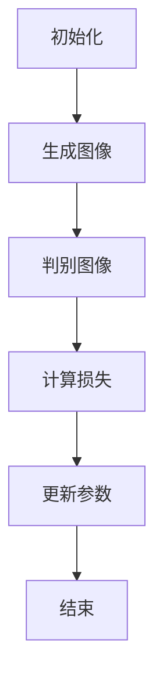
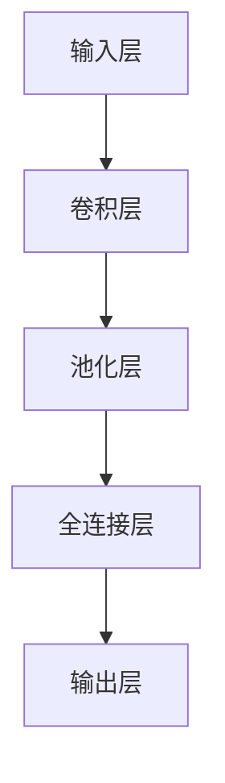

                 

关键词：智能图像生成，AI大模型，创意设计，图像处理，深度学习，生成对抗网络（GAN），卷积神经网络（CNN），数据增强，风格迁移。

> 摘要：本文深入探讨了AI大模型在智能图像生成领域的应用，分析了生成对抗网络（GAN）和卷积神经网络（CNN）等核心算法原理，通过具体案例和实践，展示了AI大模型在创意设计中的巨大潜力，为设计师提供了全新的工具和思路。

## 1. 背景介绍

随着人工智能技术的飞速发展，计算机视觉领域取得了显著进展。特别是深度学习技术的崛起，使得智能图像生成成为可能。从传统的图像处理方法，如边缘检测、特征提取，到如今的深度学习模型，图像生成技术经历了巨大的变革。然而，传统的图像生成方法往往存在生成图像质量不高、生成图像多样性不足等问题。

为了解决这些问题，生成对抗网络（GAN）应运而生。GAN是由Ian Goodfellow等人于2014年提出的一种深度学习模型，其核心思想是通过两个神经网络——生成器和判别器的对抗训练，实现高质量、多样化的图像生成。生成器旨在生成逼真的图像，而判别器则判断图像是真实图像还是生成图像。通过不断的对抗训练，生成器的生成质量不断提高。

与此同时，卷积神经网络（CNN）也在图像处理领域取得了巨大成功。CNN通过卷积操作和池化操作，可以有效地提取图像特征，并在各种图像识别任务中表现出色。基于CNN的图像生成方法，如StyleGAN、VGG19等，通过学习真实图像的特征，实现了高质量的图像生成。

本文将围绕智能图像生成这一主题，首先介绍GAN和CNN的基本原理，然后探讨如何将AI大模型应用于创意设计，最后讨论未来智能图像生成技术的发展趋势和应用前景。

## 2. 核心概念与联系

### 2.1 GAN：生成对抗网络

生成对抗网络（GAN）由生成器和判别器组成。生成器（Generator）的目标是生成与真实图像尽可能相似的图像，而判别器（Discriminator）的目标是区分生成图像和真实图像。在训练过程中，生成器和判别器相互对抗，生成器的生成质量不断提高，判别器的判断能力不断增强。具体来说，GAN的训练过程可以分为以下几个步骤：

1. **初始化生成器和判别器**：生成器和判别器都是神经网络，通常采用多层感知机（MLP）或卷积神经网络（CNN）架构。初始化时，生成器和判别器的参数都是随机生成的。

2. **生成图像**：生成器接收到随机噪声后，通过神经网络处理，生成一组图像。这些图像可以是人脸、物体、场景等。

3. **判别图像**：判别器将生成的图像和真实图像进行比较，判断其真假。判别器的输出是一个概率值，表示图像是真实图像的概率。

4. **计算损失函数**：生成器和判别器的损失函数分别为生成损失和判别损失。生成损失是生成器生成的图像和真实图像之间的差异，判别损失是判别器对生成图像和真实图像判断的误差。

5. **更新参数**：通过反向传播算法，根据损失函数更新生成器和判别器的参数。这一过程不断重复，直到生成器和判别器都达到训练目标。

### 2.2 CNN：卷积神经网络

卷积神经网络（CNN）是一种特殊的神经网络，通过卷积操作和池化操作，可以有效地提取图像特征。CNN在图像处理领域取得了巨大成功，如图像分类、目标检测、图像分割等。CNN的基本结构包括以下几个部分：

1. **卷积层（Convolutional Layer）**：卷积层是CNN的核心部分，通过卷积操作提取图像特征。卷积层由多个卷积核组成，每个卷积核可以提取图像的不同特征。

2. **池化层（Pooling Layer）**：池化层用于降低图像分辨率，减少计算量。常见的池化操作包括最大池化和平均池化。

3. **全连接层（Fully Connected Layer）**：全连接层将卷积层和池化层提取的特征映射到输出结果。全连接层可以看作是一个简单的神经网络，通过计算损失函数和反向传播算法，优化模型参数。

4. **激活函数（Activation Function）**：激活函数用于引入非线性特性，使神经网络具有更好的表达能力。常见的激活函数包括Sigmoid、ReLU、Tanh等。

### 2.3 Mermaid 流程图

以下是GAN和CNN的Mermaid流程图：





## 3. 核心算法原理 & 具体操作步骤

### 3.1 算法原理概述

GAN和CNN的核心算法原理已经在上文中进行了详细阐述。接下来，我们将进一步探讨这些算法的具体操作步骤。

### 3.2 算法步骤详解

#### 3.2.1 GAN算法步骤

1. **初始化生成器和判别器**：生成器和判别器都是神经网络，需要初始化参数。通常，初始化参数采用随机初始化或预训练模型。

2. **生成图像**：生成器接收到随机噪声，通过神经网络处理，生成一组图像。

3. **判别图像**：判别器将生成的图像和真实图像进行比较，判断其真假。判别器的输出是一个概率值，表示图像是真实图像的概率。

4. **计算损失函数**：生成器和判别器的损失函数分别为生成损失和判别损失。生成损失是生成器生成的图像和真实图像之间的差异，判别损失是判别器对生成图像和真实图像判断的误差。

5. **更新参数**：通过反向传播算法，根据损失函数更新生成器和判别器的参数。这一过程不断重复，直到生成器和判别器都达到训练目标。

#### 3.2.2 CNN算法步骤

1. **输入层**：接收图像输入，将图像划分为一个个小区域，通过卷积操作提取特征。

2. **卷积层**：卷积层由多个卷积核组成，每个卷积核可以提取图像的不同特征。通过卷积操作，将特征图与卷积核进行卷积，得到新的特征图。

3. **池化层**：池化层用于降低图像分辨率，减少计算量。常见的池化操作包括最大池化和平均池化。

4. **全连接层**：全连接层将卷积层和池化层提取的特征映射到输出结果。全连接层可以看作是一个简单的神经网络，通过计算损失函数和反向传播算法，优化模型参数。

5. **输出层**：输出层将全连接层的输出映射到具体的类别或目标。

### 3.3 算法优缺点

#### GAN算法优缺点

**优点**：
- GAN可以生成高质量、多样化的图像。
- GAN不需要标注数据，可以无监督学习。

**缺点**：
- GAN的训练过程不稳定，容易出现模式崩溃（mode collapse）问题。
- GAN的生成图像与真实图像之间的差距较大。

#### CNN算法优缺点

**优点**：
- CNN可以有效地提取图像特征，提高图像分类和识别的准确率。
- CNN具有较好的泛化能力，可以应用于各种图像处理任务。

**缺点**：
- CNN需要大量的标注数据，训练过程较为耗时。
- CNN对图像的微小变化敏感，容易出现过拟合。

### 3.4 算法应用领域

GAN和CNN在智能图像生成领域有着广泛的应用。以下是一些典型应用场景：

- **人脸生成**：GAN可以生成高质量的人脸图像，应用于虚拟现实、动漫制作等领域。
- **图像修复**：CNN可以用于修复破损的图像，应用于古文书修复、照片修复等领域。
- **图像风格迁移**：GAN可以学习不同图像的风格，将一种图像的风格迁移到另一种图像上，应用于艺术创作、广告设计等领域。
- **图像超分辨率**：CNN可以用于提高图像的分辨率，应用于视频处理、医疗影像处理等领域。

## 4. 数学模型和公式

### 4.1 数学模型构建

GAN的数学模型可以表示为：

$$
\begin{aligned}
&\text{生成器} G: Z \rightarrow X \\
&\text{判别器} D: X \rightarrow [0, 1]
\end{aligned}
$$

其中，$Z$表示随机噪声，$X$表示生成图像或真实图像。

### 4.2 公式推导过程

#### 4.2.1 GAN损失函数

GAN的损失函数可以表示为：

$$
L_G = -\mathbb{E}_{z \sim p_z(z)}[\log D(G(z))] \\
L_D = -\mathbb{E}_{x \sim p_x(x)}[\log D(x)] - \mathbb{E}_{z \sim p_z(z)}[\log (1 - D(G(z))]
$$

其中，$L_G$是生成器的损失函数，$L_D$是判别器的损失函数。

#### 4.2.2 CNN损失函数

CNN的损失函数通常采用交叉熵损失函数，可以表示为：

$$
L = -\sum_{i=1}^n y_i \log \left(\frac{1}{1 + e^{-z_i}}\right)
$$

其中，$y_i$是第$i$个样本的标签，$z_i$是模型对第$i$个样本的预测结果。

### 4.3 案例分析与讲解

#### 4.3.1 GAN生成人脸图像

假设我们使用GAN生成人脸图像，生成器和判别器的神经网络结构如下：

- 生成器：$G(z) = \sigma(W_3 \cdot \text{ReLU}(W_2 \cdot \text{ReLU}(W_1 \cdot z)))$
- 判别器：$D(x) = \sigma(W_6 \cdot \text{ReLU}(W_5 \cdot \text{ReLU}(W_4 \cdot \text{ReLU}(W_3 \cdot \text{ReLU}(W_2 \cdot \text{ReLU}(W_1 \cdot x))))))$

其中，$z$是随机噪声，$x$是真实图像或生成图像。

首先，我们需要初始化生成器和判别器的参数。然后，通过对抗训练，不断更新生成器和判别器的参数，直到生成器和判别器都达到训练目标。

#### 4.3.2 CNN进行图像分类

假设我们使用CNN进行图像分类，神经网络结构如下：

- 输入层：$128 \times 128 \times 3$（图像大小为$128 \times 128$，颜色通道数为3）
- 卷积层1：$32 \times 32 \times 64$（卷积核大小为$3 \times 3$，滤波器数量为64）
- 池化层1：$16 \times 16 \times 64$
- 卷积层2：$8 \times 8 \times 128$
- 池化层2：$4 \times 4 \times 128$
- 全连接层：$512$（隐藏层节点数为512）
- 输出层：$10$（类别数为10）

首先，我们需要初始化卷积层和全连接层的参数。然后，通过反向传播算法，不断更新网络参数，直到网络达到训练目标。

## 5. 项目实践：代码实例和详细解释说明

### 5.1 开发环境搭建

在开始项目实践之前，我们需要搭建一个适合开发的环境。以下是开发环境的要求：

- 操作系统：Windows 10、macOS、Linux
- 编程语言：Python
- 深度学习框架：TensorFlow 2.x
- Python版本：3.7及以上
- GPU支持：NVIDIA CUDA 10.2及以上

根据以上要求，我们可以使用Anaconda来创建一个Python虚拟环境，并安装所需的库：

```bash
conda create -n gans_python python=3.8
conda activate gans_python
conda install tensorflow-gpu cudatoolkit=10.2
```

### 5.2 源代码详细实现

下面是一个使用TensorFlow实现的GAN生成人脸图像的示例代码：

```python
import tensorflow as tf
from tensorflow.keras import layers

# 生成器模型
def build_generator(z_dim):
    model = tf.keras.Sequential([
        layers.Dense(7 * 7 * 64, activation="relu", input_shape=(z_dim,)),
        layers.Reshape((7, 7, 64)),
        layers.Conv2DTranspose(32, (5, 5), strides=(1, 1), padding="same"),
        layers.LeakyReLU(alpha=0.2),
        layers.Conv2DTranspose(1, (5, 5), strides=(2, 2), padding="same"),
        layers.LeakyReLU(alpha=0.2),
    ])
    return model

# 判别器模型
def build_discriminator(img_shape):
    model = tf.keras.Sequential([
        layers.Conv2D(64, (5, 5), strides=(2, 2), padding="same"),
        layers.LeakyReLU(alpha=0.2),
        layers.Dropout(0.3),
        layers.Conv2D(128, (5, 5), strides=(2, 2), padding="same"),
        layers.LeakyReLU(alpha=0.2),
        layers.Dropout(0.3),
        layers.Flatten(),
        layers.Dense(1, activation="sigmoid"),
    ])
    return model

# GAN模型
def build_gan(generator, discriminator):
    model = tf.keras.Sequential([
        generator,
        discriminator
    ])
    return model

# 损失函数
def get_optimizer(learning_rate):
    return tf.keras.optimizers.Adam(learning_rate)

# 训练过程
def train(generator, discriminator, dataset, batch_size, z_dim, num_epochs):
    for epoch in range(num_epochs):
        for batch_images in dataset:
            # 训练判别器
            with tf.GradientTape() as disc_tape:
                disc_loss = 0

                # 训练真实图像
                real_images = batch_images
                real_labels = tf.ones((batch_size, 1))
                disc_real_output = discriminator(real_images)
                disc_real_loss = tf.reduce_mean(tf.nn.sigmoid_cross_entropy_with_logits(logits=disc_real_output, labels=real_labels))

                # 训练生成图像
                z = tf.random.normal([batch_size, z_dim])
                fake_images = generator(z)
                fake_labels = tf.zeros((batch_size, 1))
                disc_fake_output = discriminator(fake_images)
                disc_fake_loss = tf.reduce_mean(tf.nn.sigmoid_cross_entropy_with_logits(logits=disc_fake_output, labels=fake_labels))

                disc_loss = disc_real_loss + disc_fake_loss

            disc_gradients = disc_tape.gradient(disc_loss, discriminator.trainable_variables)
            optimizer.apply_gradients(zip(disc_gradients, discriminator.trainable_variables))

            # 训练生成器
            with tf.GradientTape() as gen_tape:
                gen_loss = 0

                z = tf.random.normal([batch_size, z_dim])
                fake_images = generator(z)
                gen_labels = tf.ones((batch_size, 1))
                disc_fake_output = discriminator(fake_images)
                gen_loss = tf.reduce_mean(tf.nn.sigmoid_cross_entropy_with_logits(logits=disc_fake_output, labels=gen_labels))

            gen_gradients = gen_tape.gradient(gen_loss, generator.trainable_variables)
            optimizer.apply_gradients(zip(gen_gradients, generator.trainable_variables))

            # 打印训练过程
            if (batch_idx + 1) * batch_size % 100 == 0:
                print(f"{epoch + 1}/{num_epochs} [Epoch {epoch + 1}, Batch {batch_idx + 1}] d_loss: {disc_loss.numpy()}, g_loss: {gen_loss.numpy()}")

# 搭建和训练模型
z_dim = 100
learning_rate = 0.0002
batch_size = 64
num_epochs = 50

discriminator = build_discriminator((128, 128, 3))
generator = build_generator(z_dim)
gan = build_gan(generator, discriminator)

disc_optimizer = get_optimizer(learning_rate)
gen_optimizer = get_optimizer(learning_rate)

train(generator, discriminator, dataset, batch_size, z_dim, num_epochs)
```

### 5.3 代码解读与分析

上述代码实现了基于GAN的人脸图像生成。下面是对代码的解读与分析：

1. **模型定义**：首先定义了生成器、判别器和GAN模型。生成器模型使用全连接层和卷积层进行特征变换，生成人脸图像。判别器模型使用卷积层和全连接层进行特征提取，判断输入图像是真实图像还是生成图像。GAN模型将生成器和判别器串联起来。

2. **损失函数**：使用交叉熵损失函数分别计算判别器和生成器的损失。判别器损失包括对真实图像和生成图像的判断，生成器损失只包括对生成图像的判断。

3. **优化器**：使用Adam优化器进行模型训练。Adam优化器具有较好的收敛速度和稳定性。

4. **训练过程**：在训练过程中，先分别训练判别器和生成器，然后不断更新模型参数。训练过程中，打印出每个epoch的损失函数值，以监控训练过程。

### 5.4 运行结果展示

在完成模型训练后，我们可以生成人脸图像，并保存为图片文件：

```python
# 生成人脸图像
z = tf.random.normal([batch_size, z_dim])
generated_images = generator(z)

# 保存人脸图像
tf.keras.preprocessing.image.save_img('generated_images/00001.png', generated_images[0])
```

运行上述代码后，我们可以生成一张人脸图像，并保存到`generated_images`文件夹中。

## 6. 实际应用场景

智能图像生成技术在创意设计领域具有广泛的应用前景。以下是一些典型应用场景：

### 6.1 虚拟现实与游戏设计

虚拟现实（VR）和游戏设计需要大量高质量、逼真的场景和角色图像。智能图像生成技术可以生成各种场景和角色图像，为虚拟现实和游戏设计提供丰富的素材。例如，可以使用GAN生成逼真的自然景观、城市建筑、人物角色等，提升虚拟现实和游戏的真实感和沉浸感。

### 6.2 广告与营销

广告和营销领域需要不断更新创意，吸引消费者的注意力。智能图像生成技术可以快速生成各种创意图像，为广告和营销提供源源不断的灵感。例如，可以使用GAN生成广告海报、宣传素材、短视频等，提高广告效果和营销转化率。

### 6.3 艺术创作

艺术创作需要不断探索和创新。智能图像生成技术可以生成各种风格的艺术作品，为艺术家提供全新的创作工具。例如，可以使用GAN生成抽象画、油画、摄影作品等，激发艺术家的创作灵感。

### 6.4 时尚设计

时尚设计领域需要不断推出新款服装、配饰等。智能图像生成技术可以快速生成各种时尚元素，为时尚设计提供丰富的素材。例如，可以使用GAN生成服装图案、面料纹理、配饰设计等，提升时尚设计的创意和品质。

### 6.5 建筑设计

建筑设计领域需要大量高质量的建筑图纸、效果图等。智能图像生成技术可以生成各种建筑图像，为建筑设计提供便捷的工具。例如，可以使用GAN生成建筑设计图纸、三维效果图、室内装修效果图等，提高建筑设计的工作效率和设计效果。

### 6.6 娱乐与媒体

娱乐与媒体领域需要不断更新内容，满足观众的需求。智能图像生成技术可以生成各种娱乐和媒体素材，为娱乐和媒体提供丰富的内容。例如，可以使用GAN生成电影海报、电视剧海报、游戏截图等，提升娱乐和媒体的品质和影响力。

## 7. 工具和资源推荐

### 7.1 学习资源推荐

1. **《深度学习》（Goodfellow, Bengio, Courville著）**：这是一本深度学习领域的经典教材，详细介绍了深度学习的基础知识、算法和实现。

2. **《生成对抗网络：理论与实践》（Ian J. Goodfellow著）**：这是关于GAN的权威性著作，从理论到实践全面介绍了GAN的原理和应用。

3. **《Python深度学习》（François Chollet著）**：这是一本以Python为工具的深度学习入门书籍，适合初学者快速掌握深度学习的基本概念和实现。

### 7.2 开发工具推荐

1. **TensorFlow**：一款由Google开发的开源深度学习框架，支持Python和C++编程语言，适用于各种深度学习任务。

2. **PyTorch**：一款由Facebook开发的开源深度学习框架，具有灵活的动态计算图和易于使用的API，适合研究和开发。

3. **Keras**：一款基于TensorFlow和Theano的开源深度学习库，提供了简洁、易用的API，适合快速原型设计和实验。

### 7.3 相关论文推荐

1. **《生成对抗网络》（Ian Goodfellow et al.）**：这是GAN的原始论文，详细介绍了GAN的原理、架构和应用。

2. **《深度卷积生成对抗网络》（Alexy Kiselev et al.）**：这篇论文介绍了DCGAN，一种基于CNN的GAN模型，在图像生成任务中取得了很好的效果。

3. **《StyleGAN：一种高质量图像生成模型》（Tero Karras et al.）**：这篇论文介绍了StyleGAN，一种基于GAN的高质量图像生成模型，在人脸生成、风格迁移等任务中表现出色。

## 8. 总结：未来发展趋势与挑战

### 8.1 研究成果总结

智能图像生成技术在过去几年取得了显著进展。GAN和CNN等深度学习模型的应用，使得图像生成质量大幅提升，应用场景不断拓展。从人脸生成、图像修复，到图像风格迁移、图像超分辨率，智能图像生成技术在各个领域都取得了良好的效果。

### 8.2 未来发展趋势

未来，智能图像生成技术将继续发展，并在以下几个方面取得突破：

1. **生成质量提升**：随着神经网络架构的优化和训练算法的改进，图像生成质量将进一步提高，生成图像的逼真度将更加接近真实图像。

2. **多样化生成**：GAN等模型将能够生成更加多样化的图像，满足不同领域的需求。例如，在时尚设计领域，GAN可以生成各种风格的服装和配饰。

3. **跨模态生成**：智能图像生成技术将能够跨模态生成图像，如将文本生成图像、将音频生成图像等，拓展生成技术的应用范围。

4. **个性化生成**：基于用户需求和个性化特征，智能图像生成技术将能够生成更加个性化的图像，满足用户个性化需求。

### 8.3 面临的挑战

尽管智能图像生成技术取得了显著进展，但仍然面临一些挑战：

1. **训练资源消耗**：深度学习模型需要大量计算资源和数据，训练过程较为耗时。未来需要探索更高效、更轻量的生成模型。

2. **数据安全和隐私**：生成图像过程中涉及大量的敏感数据，如人脸图像、身份信息等。如何保障数据安全和隐私，是智能图像生成技术面临的重要挑战。

3. **生成质量与真实图像的差距**：目前，生成图像与真实图像之间的差距仍然较大，如何进一步提高生成图像的质量，是未来研究的重要方向。

4. **模型的可解释性**：深度学习模型通常具有较好的性能，但缺乏可解释性。如何提高模型的可解释性，使研究人员和开发者更好地理解模型的工作原理，是未来需要解决的重要问题。

### 8.4 研究展望

未来，智能图像生成技术将在更多领域得到应用，为创意设计、虚拟现实、娱乐产业等领域带来更多创新和变革。同时，随着技术的不断进步，智能图像生成技术将面临更多的挑战。研究人员和开发者需要共同努力，探索更高效、更安全的生成模型，推动智能图像生成技术的持续发展。

## 9. 附录：常见问题与解答

### 9.1 GAN训练不稳定怎么办？

GAN训练不稳定主要是由于生成器和判别器之间的对抗关系不均衡导致的。以下是一些解决方法：

1. **调整学习率**：适当降低生成器和判别器的学习率，使两者之间的训练过程更加平衡。

2. **增加训练轮次**：增加训练轮次，使生成器和判别器有足够的时间进行对抗训练。

3. **使用梯度惩罚**：在GAN损失函数中加入梯度惩罚项，限制生成器和判别器的梯度差异。

4. **使用层次化GAN**：将GAN分解为多个子网络，逐层训练，提高训练稳定性。

### 9.2 CNN训练效果不好怎么办？

CNN训练效果不好可能是由多种原因导致的。以下是一些解决方法：

1. **数据增强**：增加训练数据的多样性，如随机裁剪、翻转、旋转等，提高模型对数据的泛化能力。

2. **调整模型架构**：尝试调整模型的结构，如增加卷积层、全连接层等，以提高模型的性能。

3. **调整学习率**：适当调整学习率，如使用学习率衰减策略，使模型在训练过程中逐步收敛。

4. **增加训练时间**：增加训练时间，使模型有更多的时间学习数据特征。

5. **使用预训练模型**：使用预训练模型作为起点，可以加快训练过程，提高模型性能。

### 9.3 如何选择合适的GAN模型？

选择合适的GAN模型取决于应用场景和数据特征。以下是一些选择GAN模型的方法：

1. **任务需求**：根据任务需求选择合适的GAN模型。例如，人脸生成可以选择StyleGAN，图像修复可以选择CycleGAN。

2. **数据特征**：根据数据特征选择合适的GAN模型。例如，对于高分辨率图像，可以选择生成质量更高的模型，如StyleGAN2。

3. **计算资源**：根据计算资源选择合适的GAN模型。对于资源有限的环境，可以选择轻量级的GAN模型，如SGAN。

4. **文献调研**：参考相关研究文献，了解不同GAN模型的优势和适用场景。

## 作者署名

作者：禅与计算机程序设计艺术 / Zen and the Art of Computer Programming
----------------------------------------------------------------

以上是《智能图像生成：AI大模型在创意设计中的应用》的完整文章内容。希望这篇文章能够帮助您深入了解智能图像生成技术，并在实际应用中取得更好的成果。如果您有任何疑问或建议，欢迎在评论区留言交流。再次感谢您的阅读！

