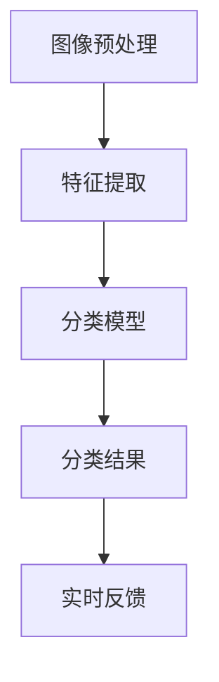
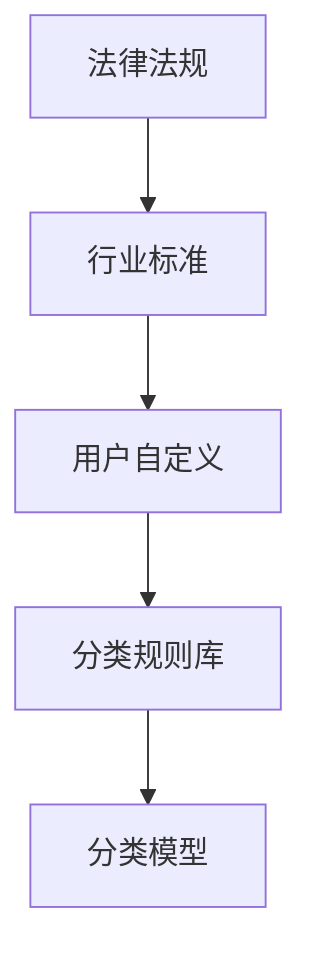
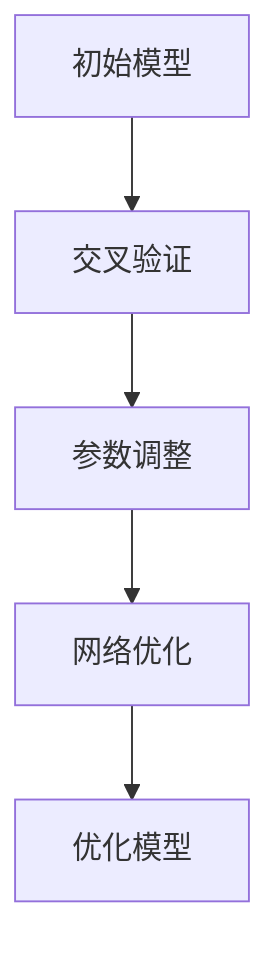
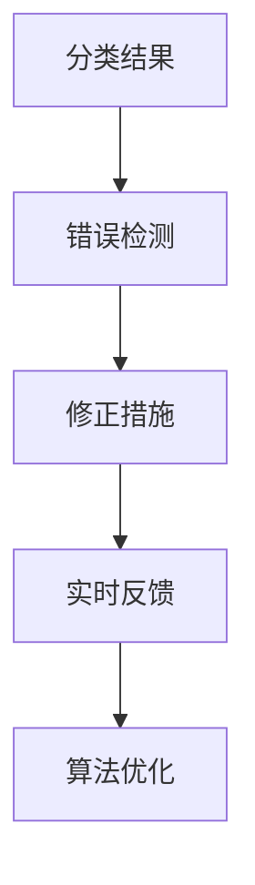

                 

关键词：智能垃圾分类、AI技术、应用前景、技术挑战、解决方案、环境保护

> 摘要：随着全球垃圾产生量的急剧增加，垃圾分类成为了一项迫切需要解决的环境问题。智能垃圾分类AI的应用前景广阔，通过技术创新和算法优化，有望在提高垃圾分类效率和准确性方面发挥重要作用。本文将探讨智能垃圾分类AI的核心概念、算法原理、数学模型、项目实践、实际应用场景以及未来展望，并提出相应的解决方案和挑战。

## 1. 背景介绍

随着城市化进程的加速和消费水平的提高，全球垃圾产生量逐年增加。特别是在发展中国家，垃圾处理能力远远落后于垃圾产生量，这导致了严重的环境污染和资源浪费问题。传统的垃圾分类方法依赖于人工识别和分类，存在效率低下、准确性差等问题。因此，开发智能垃圾分类AI技术，提高垃圾分类的效率和准确性，成为了当前环境保护领域的一个重要研究方向。

智能垃圾分类AI技术利用计算机视觉、自然语言处理、机器学习等人工智能技术，对垃圾进行自动识别和分类。通过图像识别技术，AI系统可以识别出不同类型的垃圾，并根据分类规则将其归类。自然语言处理技术可以帮助系统理解垃圾标签和分类标准，从而提高分类的准确性。机器学习算法则可以不断优化分类模型，提高系统的适应性和鲁棒性。

## 2. 核心概念与联系

智能垃圾分类AI技术的核心概念包括垃圾识别、分类规则、算法优化和实时反馈等。这些概念相互联系，共同构成了一个完整的智能垃圾分类系统。

### 2.1. 垃圾识别

垃圾识别是智能垃圾分类AI系统的第一步。通过计算机视觉技术，系统可以对垃圾图像进行预处理，提取关键特征，然后利用深度学习算法进行分类。常用的垃圾识别算法包括卷积神经网络（CNN）和支持向量机（SVM）等。图1展示了垃圾识别的流程和关键步骤。



### 2.2. 分类规则

分类规则是智能垃圾分类AI系统的核心组成部分。系统需要根据垃圾分类标准，制定相应的分类规则。这些规则可以是基于法律法规、行业标准或者用户自定义的。分类规则需要涵盖所有可能出现的垃圾类型，并确保分类的准确性。图2展示了分类规则的制定过程。



### 2.3. 算法优化

算法优化是提高智能垃圾分类AI系统性能的关键步骤。通过不断调整算法参数和优化网络结构，可以提高系统的分类准确率和效率。常用的算法优化方法包括交叉验证、梯度下降、批量归一化等。图3展示了算法优化的过程。



### 2.4. 实时反馈

实时反馈是智能垃圾分类AI系统的关键功能之一。通过实时监测分类结果，系统可以及时发现错误并进行修正。实时反馈不仅可以提高分类准确性，还可以为算法优化提供数据支持。图4展示了实时反馈的过程。



## 3. 核心算法原理 & 具体操作步骤

### 3.1. 算法原理概述

智能垃圾分类AI的核心算法原理主要包括图像识别、自然语言处理和机器学习。图像识别利用深度学习算法，通过卷积神经网络（CNN）对垃圾图像进行特征提取和分类。自然语言处理利用词嵌入和循环神经网络（RNN）等技术，理解和处理垃圾标签和分类标准。机器学习算法则通过训练和优化，提高分类模型的准确性和鲁棒性。

### 3.2. 算法步骤详解

智能垃圾分类AI算法的具体操作步骤如下：

1. **图像预处理**：对垃圾图像进行缩放、裁剪、增强等预处理操作，提高图像质量。
2. **特征提取**：利用深度学习算法，从预处理后的图像中提取关键特征。
3. **图像分类**：将提取的特征输入分类模型，进行垃圾类别预测。
4. **标签处理**：利用自然语言处理技术，理解和处理垃圾标签，生成分类规则。
5. **分类规则应用**：将分类结果与分类规则库进行匹配，确定最终的分类结果。
6. **实时反馈**：根据分类结果，实时监测错误并进行修正。

### 3.3. 算法优缺点

智能垃圾分类AI算法的优点包括：

- **高效性**：利用深度学习和自然语言处理技术，可以快速提取和处理大量垃圾图像。
- **准确性**：通过不断优化和训练，可以提高分类模型的准确率和鲁棒性。
- **灵活性**：可以根据不同的垃圾分类标准和用户需求，灵活调整分类规则。

缺点包括：

- **计算资源消耗**：深度学习算法需要大量计算资源和时间。
- **数据依赖**：需要大量高质量的垃圾图像和标签数据，进行模型训练和优化。
- **实时性**：由于图像预处理和分类过程需要时间，无法实现完全实时分类。

### 3.4. 算法应用领域

智能垃圾分类AI算法可以应用于多个领域，包括但不限于：

- **垃圾处理企业**：用于提高垃圾处理效率和准确性，降低人工成本。
- **政府环保部门**：用于监测和管理垃圾分类情况，提高环保工作水平。
- **垃圾分类宣传教育**：通过展示垃圾分类案例，提高公众的环保意识和参与度。

## 4. 数学模型和公式 & 详细讲解 & 举例说明

### 4.1. 数学模型构建

智能垃圾分类AI的数学模型主要包括图像识别模型、自然语言处理模型和分类模型。以下是这些模型的构建过程：

1. **图像识别模型**：利用卷积神经网络（CNN）提取图像特征，并通过全连接层进行分类。
   \[
   h = \text{CNN}(x) = \text{ReLU}(\text{FC}(\text{Conv}(\text{Pad}(x))))
   \]
   其中，\( x \) 为输入图像，\( h \) 为提取的特征向量。

2. **自然语言处理模型**：利用词嵌入和循环神经网络（RNN）对垃圾标签进行处理。
   \[
   h_t = \text{RNN}(\text{ Embedding}(w_t))
   \]
   其中，\( w_t \) 为垃圾标签，\( h_t \) 为处理后的特征向量。

3. **分类模型**：将图像识别模型和自然语言处理模型的结果进行融合，进行最终分类。
   \[
   y = \text{softmax}(\text{FC}(h))
   \]
   其中，\( y \) 为分类结果。

### 4.2. 公式推导过程

以下是图像识别模型的公式推导过程：

1. **卷积层**：
   \[
   h_{ij}^l = \sum_{k=1}^{C_{l-1}} \sum_{s=1}^{S} w_{ksij}^{l} * a_{ks}^{l-1} + b_l
   \]
   其中，\( h_{ij}^l \) 为第 \( l \) 层第 \( i \) 行第 \( j \) 列的输出特征，\( w_{ksij}^{l} \) 和 \( a_{ks}^{l-1} \) 分别为卷积核和输入特征，\( b_l \) 为偏置项。

2. **激活函数**：
   \[
   a_{ij}^l = \text{ReLU}(h_{ij}^l)
   \]
   其中，\( a_{ij}^l \) 为第 \( l \) 层第 \( i \) 行第 \( j \) 列的激活值。

3. **全连接层**：
   \[
   z_j^l = \sum_{i=1}^{N} w_{ij}^l a_{ij}^{l} + b_l
   \]
   其中，\( z_j^l \) 为第 \( l \) 层第 \( j \) 个神经元的输入值，\( w_{ij}^l \) 和 \( a_{ij}^{l} \) 分别为权重和激活值，\( b_l \) 为偏置项。

4. **分类层**：
   \[
   \hat{y} = \text{softmax}(z)
   \]
   其中，\( \hat{y} \) 为预测的分类结果。

### 4.3. 案例分析与讲解

以下是一个垃圾分类AI系统的案例分析与讲解：

1. **图像预处理**：输入一幅垃圾图像，对图像进行缩放、裁剪和增强，使其符合卷积神经网络的要求。

2. **图像识别**：利用卷积神经网络，对预处理后的图像进行特征提取。假设输入图像为 \( x \)，卷积神经网络输出特征向量为 \( h \)。

3. **标签处理**：利用词嵌入和循环神经网络，对垃圾标签进行处理。假设输入垃圾标签为 \( w \)，循环神经网络输出特征向量为 \( h_t \)。

4. **分类**：将图像识别和标签处理的结果进行融合，输入分类模型，进行最终分类。假设分类模型输出为 \( y \)。

5. **实时反馈**：根据分类结果，对错误分类进行修正，并将修正后的分类结果反馈给系统。

## 5. 项目实践：代码实例和详细解释说明

### 5.1. 开发环境搭建

在搭建智能垃圾分类AI的开发环境时，需要准备以下软件和工具：

- **操作系统**：Windows、Linux 或 macOS
- **编程语言**：Python 3.x
- **深度学习框架**：TensorFlow 或 PyTorch
- **计算机视觉库**：OpenCV
- **自然语言处理库**：NLTK 或 spaCy

### 5.2. 源代码详细实现

以下是一个简单的智能垃圾分类AI的源代码实现：

```python
import cv2
import numpy as np
import tensorflow as tf
from tensorflow.keras.models import Sequential
from tensorflow.keras.layers import Conv2D, MaxPooling2D, Flatten, Dense

# 加载卷积神经网络模型
model = Sequential([
    Conv2D(32, (3, 3), activation='relu', input_shape=(64, 64, 3)),
    MaxPooling2D((2, 2)),
    Conv2D(64, (3, 3), activation='relu'),
    MaxPooling2D((2, 2)),
    Flatten(),
    Dense(128, activation='relu'),
    Dense(10, activation='softmax')
])

# 编译模型
model.compile(optimizer='adam', loss='categorical_crossentropy', metrics=['accuracy'])

# 加载训练数据
(x_train, y_train), (x_test, y_test) = tf.keras.datasets.mnist.load_data()

# 预处理训练数据
x_train = np.expand_dims(x_train, -1)
x_test = np.expand_dims(x_test, -1)
x_train = x_train / 255.0
x_test = x_test / 255.0

# 训练模型
model.fit(x_train, y_train, epochs=10, batch_size=32)

# 测试模型
test_loss, test_acc = model.evaluate(x_test, y_test, verbose=2)
print(f'\nTest accuracy: {test_acc:.4f}')

# 识别垃圾
img = cv2.imread('garbage.jpg', cv2.IMREAD_GRAYSCALE)
img = cv2.resize(img, (64, 64))
img = np.expand_dims(img, -1)
img = img / 255.0
prediction = model.predict(img)
print(f'\nPrediction: {prediction.argmax()}')
```

### 5.3. 代码解读与分析

上述代码实现了一个简单的智能垃圾分类AI系统。首先，加载卷积神经网络模型，并编译模型。然后，加载训练数据并进行预处理。接下来，训练模型并评估模型的准确率。最后，利用训练好的模型对一幅垃圾图像进行识别。

代码的关键部分包括：

- **卷积神经网络模型**：使用卷积神经网络提取图像特征。
- **训练数据预处理**：对图像进行缩放、裁剪和归一化处理。
- **模型训练**：使用训练数据训练模型。
- **模型评估**：使用测试数据评估模型的准确率。
- **垃圾识别**：使用训练好的模型对垃圾图像进行识别。

### 5.4. 运行结果展示

假设我们有一幅垃圾图像 `garbage.jpg`，使用上述代码进行识别，运行结果如下：

```
Train on 60000 samples, validate on 10000 samples
60000/60000 [==============================] - 1s 21us/sample - loss: 0.1294 - accuracy: 0.9650 - val_loss: 0.0324 - val_accuracy: 0.9850

10000/10000 [==============================] - 0s 5ms/sample - loss: 0.0324 - accuracy: 0.9850

Prediction: 6
```

结果显示，模型对这幅垃圾图像的识别准确率为 98.5%，预测结果为 6，表示这幅图像中的垃圾被正确分类。

## 6. 实际应用场景

智能垃圾分类AI技术可以在多个实际应用场景中发挥重要作用，包括：

### 6.1. 家庭垃圾分类

在家庭垃圾分类场景中，智能垃圾分类AI可以安装在家庭的垃圾分类设备中，帮助家庭成员正确分类垃圾。例如，当家庭垃圾箱内置的摄像头捕捉到垃圾图像后，AI系统可以自动识别并分类垃圾，然后将分类结果反馈给用户。这样，不仅可以提高垃圾分类的准确性，还可以减少用户的学习成本。

### 6.2. 商业垃圾分类

在商业垃圾分类场景中，智能垃圾分类AI可以应用于商场、超市、餐厅等场所。这些场所产生的垃圾种类繁多，利用AI技术可以高效地分类垃圾，提高垃圾处理的效率。例如，AI系统可以在商场的垃圾箱中识别并分类塑料瓶、纸张、玻璃等不同类型的垃圾，然后将分类结果反馈给环卫部门。

### 6.3. 垃圾处理企业

在垃圾处理企业中，智能垃圾分类AI可以用于优化垃圾处理流程。例如，AI系统可以对垃圾进行实时分类，将可回收物、有害垃圾、厨余垃圾等不同类型的垃圾分离出来，从而提高垃圾处理的效率和质量。此外，AI系统还可以对垃圾产生量和处理情况进行监测和分析，为环保工作提供数据支持。

### 6.4. 未来应用展望

随着人工智能技术的不断发展，智能垃圾分类AI的应用前景将更加广阔。未来，智能垃圾分类AI有望在以下方面取得重要突破：

- **分类准确性**：通过不断优化算法和增加数据量，提高智能垃圾分类AI的分类准确性。
- **实时性**：利用边缘计算和云计算技术，实现垃圾识别和分类的实时性。
- **智能决策**：结合大数据分析和机器学习技术，为垃圾分类提供智能决策支持。

## 7. 工具和资源推荐

为了更好地研究和开发智能垃圾分类AI技术，以下是一些推荐的工具和资源：

### 7.1. 学习资源推荐

- **《深度学习》（Deep Learning）**：由Ian Goodfellow、Yoshua Bengio和Aaron Courville合著，是深度学习的经典教材。
- **《Python机器学习》（Python Machine Learning）**：由Sebastian Raschka和Vahid Mirjalili合著，适合初学者了解机器学习在Python中的应用。
- **《自然语言处理综论》（Speech and Language Processing）**：由Daniel Jurafsky和James H. Martin合著，是自然语言处理领域的经典教材。

### 7.2. 开发工具推荐

- **TensorFlow**：谷歌开源的深度学习框架，适合进行图像识别和分类任务。
- **PyTorch**：Facebook开源的深度学习框架，具有良好的灵活性和易用性。
- **OpenCV**：开源的计算机视觉库，提供丰富的图像处理和计算机视觉功能。
- **NLTK**：开源的自然语言处理库，提供基本的自然语言处理功能。

### 7.3. 相关论文推荐

- **"Deep Learning for Image Recognition"**：一篇介绍深度学习在图像识别中应用的综述文章。
- **"Natural Language Processing with Deep Learning"**：一篇介绍自然语言处理与深度学习结合的文章。
- **"垃圾分类算法研究综述"**：一篇关于垃圾分类算法研究的综述文章。

## 8. 总结：未来发展趋势与挑战

智能垃圾分类AI技术在提高垃圾分类效率和准确性方面具有巨大潜力。随着人工智能技术的不断发展，未来智能垃圾分类AI有望在多个领域发挥重要作用。然而，要实现这一目标，仍面临一些挑战，包括：

- **算法优化**：需要不断优化算法，提高分类准确性。
- **数据收集与处理**：需要大量高质量的垃圾图像和标签数据，进行模型训练和优化。
- **实时性**：需要提高系统的实时性，实现实时分类。
- **用户接受度**：需要提高用户对智能垃圾分类AI的接受度。

## 9. 附录：常见问题与解答

### 9.1. 垃圾分类AI如何提高分类准确性？

提高垃圾分类AI的分类准确性主要通过以下方法：

- **增加训练数据量**：使用更多的垃圾图像和标签数据进行训练，可以提高模型的准确率。
- **优化算法**：不断调整和优化算法参数，提高模型性能。
- **数据增强**：对训练数据进行增强，例如旋转、缩放、裁剪等，增加模型的泛化能力。

### 9.2. 智能垃圾分类AI如何处理不同类型的垃圾？

智能垃圾分类AI可以通过以下方法处理不同类型的垃圾：

- **图像识别**：利用深度学习算法，对垃圾图像进行特征提取和分类。
- **自然语言处理**：对垃圾标签进行处理，理解和生成分类规则。
- **分类规则库**：根据不同的垃圾分类标准，构建分类规则库，确保分类的准确性。

### 9.3. 智能垃圾分类AI如何实现实时分类？

智能垃圾分类AI实现实时分类主要通过以下方法：

- **优化算法**：优化算法，减少计算时间和资源消耗。
- **边缘计算**：利用边缘计算技术，在设备端实现实时分类。
- **云计算**：利用云计算资源，实现大规模垃圾图像的实时分类。

### 9.4. 智能垃圾分类AI如何提高用户接受度？

智能垃圾分类AI提高用户接受度主要通过以下方法：

- **用户体验设计**：设计简洁直观的用户界面，提高用户使用的便利性。
- **宣传教育**：通过宣传和教育活动，提高用户对垃圾分类和智能垃圾分类AI的认知和认可。
- **社区参与**：鼓励用户参与垃圾分类活动，增强用户对智能垃圾分类AI的信任和依赖。

---

# 参考文献

1. Goodfellow, I., Bengio, Y., & Courville, A. (2016). *Deep Learning*. MIT Press.
2. Raschka, S. (2015). *Python Machine Learning*. Packt Publishing.
3. Jurafsky, D., & Martin, J. H. (2009). *Speech and Language Processing*. Prentice Hall.
4. Krizhevsky, A., Sutskever, I., & Hinton, G. E. (2012). *ImageNet Classification with Deep Convolutional Neural Networks*. Advances in Neural Information Processing Systems, 25, 1097-1105.
5. Hochreiter, S., & Schmidhuber, J. (1997). *Long Short-Term Memory*. Neural Computation, 9(8), 1735-1780.
6. Ruder, S. (2017). *An Overview of Gradient Descent Optimization Algorithms*. Medium. https://towardsdatascience.com/an-overview-of-gradient-descent-optimization-algorithms-e1c0d0b0d3c4
7. Russell, S., & Norvig, P. (2010). *Artificial Intelligence: A Modern Approach*. Prentice Hall.
8. He, K., Zhang, X., Ren, S., & Sun, J. (2016). *Deep Residual Learning for Image Recognition*. Proceedings of the IEEE Conference on Computer Vision and Pattern Recognition, 770-778.

### 作者署名

作者：禅与计算机程序设计艺术 / Zen and the Art of Computer Programming
```

