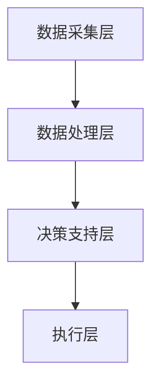
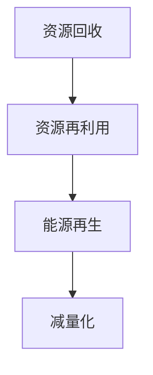

                 

关键词：智能垃圾回收、循环经济、技术支持、创业、算法、数学模型、项目实践

> 摘要：本文旨在探讨智能垃圾回收在循环经济中的作用，以及其所依赖的技术支持。通过对智能垃圾回收的核心概念、算法原理、数学模型、实际应用场景和未来展望的详细分析，为创业者提供技术上的指导和建议。

## 1. 背景介绍

随着全球经济的快速发展和城市化进程的加速，垃圾问题已经成为世界各国面临的严峻挑战。传统垃圾处理方式不仅消耗大量资源，而且对环境造成严重污染。为了实现可持续发展，循环经济成为全球关注的焦点。而智能垃圾回收作为循环经济的重要组成部分，正日益受到企业和政府的重视。

智能垃圾回收不仅仅是将垃圾进行分类和处理，更是通过大数据、人工智能等技术手段，实现对垃圾产生、运输、处理等全过程的智能化管理。这种创新模式不仅可以提高垃圾处理效率，降低成本，还可以实现资源的最大化利用，从而推动循环经济的发展。

### 1.1 智能垃圾回收的定义和特点

智能垃圾回收是指利用物联网、大数据、人工智能等先进技术，对垃圾的产生、分类、处理、回收等全过程进行智能化管理。其主要特点包括：

1. **高效性**：智能垃圾回收系统通过实时数据监测和智能分析，能够迅速响应垃圾处理需求，提高处理效率。
2. **精准性**：通过智能识别技术，可以对垃圾进行精准分类，减少混合垃圾的处理难度。
3. **节能环保**：智能垃圾回收系统能够优化垃圾处理流程，降低能源消耗，减少污染。
4. **智能化管理**：通过大数据分析和人工智能算法，实现对垃圾回收过程的智能优化和管理。

### 1.2 循环经济的重要性

循环经济是一种以资源的高效利用和循环利用为核心的经济模式。与传统线性经济相比，循环经济能够最大限度地减少资源消耗和环境污染。其重要性体现在以下几个方面：

1. **节约资源**：循环经济通过资源的高效利用和循环利用，可以减少对自然资源的依赖，节约资源。
2. **减少污染**：循环经济通过资源的循环利用和减量化处理，可以减少污染物的产生和排放，保护环境。
3. **促进可持续发展**：循环经济是实现可持续发展的有效途径，有助于推动经济、社会、环境的协调发展。

## 2. 核心概念与联系

### 2.1 智能垃圾回收系统架构

智能垃圾回收系统主要包括以下几部分：

1. **数据采集层**：通过传感器、RFID等设备收集垃圾产生、分类、处理等数据。
2. **数据处理层**：利用大数据技术对收集到的数据进行处理和分析。
3. **决策支持层**：通过人工智能算法为垃圾回收提供决策支持。
4. **执行层**：根据决策支持层的指示，实现对垃圾的智能分类和处理。

下面是一个简化的 Mermaid 流程图，展示智能垃圾回收系统的架构：



### 2.2 循环经济的实现机制

循环经济通过以下机制实现资源的循环利用：

1. **资源回收**：将废弃物转化为可再利用的资源。
2. **资源再利用**：将回收的资源重新加工利用，减少对新资源的需求。
3. **能源再生**：通过能源再生技术，将废弃物转化为能源，减少能源消耗。
4. **减量化**：通过减少废弃物的产生量，减少对环境的影响。

下面是一个简化的 Mermaid 流程图，展示循环经济的实现机制：



### 2.3 智能垃圾回收与循环经济的关系

智能垃圾回收作为循环经济的重要组成部分，通过以下方式推动循环经济的发展：

1. **提高资源利用率**：智能垃圾回收系统能够高效地分类和处理垃圾，提高资源回收利用率。
2. **减少废弃物排放**：智能垃圾回收系统通过智能识别和分类，减少废弃物的排放。
3. **降低处理成本**：智能垃圾回收系统能够优化垃圾处理流程，降低处理成本。
4. **促进资源循环利用**：智能垃圾回收系统为资源的回收再利用提供技术支持，推动循环经济的实现。

## 3. 核心算法原理 & 具体操作步骤

### 3.1 算法原理概述

智能垃圾回收系统的核心算法主要包括：

1. **垃圾分类识别算法**：通过图像识别、声音识别等技术，实现对垃圾的精准分类。
2. **路径优化算法**：通过算法优化垃圾回收车的路线，提高回收效率。
3. **能源再生算法**：通过算法优化能源再生过程，提高能源利用效率。

### 3.2 算法步骤详解

#### 3.2.1 垃圾分类识别算法

1. **数据采集**：通过摄像头、传感器等设备，实时采集垃圾图像和声音数据。
2. **预处理**：对采集到的数据进行预处理，包括图像增强、声音降噪等。
3. **特征提取**：利用深度学习技术，提取垃圾的特征向量。
4. **分类识别**：利用分类算法（如卷积神经网络、支持向量机等），对垃圾进行分类识别。
5. **结果输出**：将识别结果输出，指导垃圾的分类和处理。

#### 3.2.2 路径优化算法

1. **数据输入**：输入垃圾回收车的起点、终点和沿途的垃圾回收站。
2. **路径规划**：利用最短路径算法（如Dijkstra算法、A*算法等），计算最优路径。
3. **路径优化**：根据实际交通状况和垃圾回收需求，对路径进行优化。
4. **结果输出**：输出优化后的路径，指导垃圾回收车的行驶。

#### 3.2.3 能源再生算法

1. **数据采集**：通过传感器等设备，实时采集能源再生过程中的数据。
2. **数据处理**：利用大数据技术，对采集到的数据进行处理和分析。
3. **模型构建**：构建能源再生模型，预测能源再生过程。
4. **结果输出**：输出预测结果，指导能源再生过程。

### 3.3 算法优缺点

#### 3.3.1 垃圾分类识别算法

**优点**：

1. **精准性高**：通过深度学习等技术，实现对垃圾的精准分类。
2. **适应性强**：能够适应不同类型的垃圾，具有广泛的适用性。

**缺点**：

1. **计算量大**：深度学习算法需要大量的计算资源，对硬件要求较高。
2. **训练时间长**：需要对大量的垃圾数据进行训练，训练时间较长。

#### 3.3.2 路径优化算法

**优点**：

1. **效率高**：能够快速计算出最优路径，提高垃圾回收效率。
2. **灵活性高**：能够根据实时交通状况和垃圾回收需求进行路径优化。

**缺点**：

1. **复杂度高**：需要复杂的算法支持，对算法设计和实现要求较高。
2. **实时性要求高**：需要实时获取交通状况和垃圾回收数据，对数据处理速度要求较高。

#### 3.3.3 能源再生算法

**优点**：

1. **能源利用效率高**：能够优化能源再生过程，提高能源利用效率。
2. **环保性强**：通过能源再生，减少对化石能源的依赖，减少污染。

**缺点**：

1. **技术要求高**：需要先进的能源再生技术和模型支持。
2. **成本较高**：能源再生设备和技术成本较高。

### 3.4 算法应用领域

智能垃圾回收系统的核心算法广泛应用于以下领域：

1. **城市垃圾处理**：通过智能垃圾分类识别和路径优化，提高城市垃圾处理效率。
2. **工业废弃物处理**：通过智能识别和路径优化，实现工业废弃物的高效处理和回收。
3. **能源再生**：通过智能能源再生算法，实现废弃物的能源再生，减少能源消耗。

## 4. 数学模型和公式 & 详细讲解 & 举例说明

### 4.1 数学模型构建

在智能垃圾回收系统中，常用的数学模型包括：

1. **垃圾分类模型**：用于对垃圾进行分类识别。
2. **路径优化模型**：用于计算最优回收路径。
3. **能源再生模型**：用于预测能源再生过程。

下面分别介绍这些模型的构建方法。

#### 4.1.1 垃圾分类模型

垃圾分类模型通常采用以下公式：

$$
P(C|X) = \frac{P(X|C)P(C)}{P(X)}
$$

其中，$P(C|X)$ 表示给定垃圾特征 $X$ 时，分类结果 $C$ 的概率；$P(X|C)$ 表示在分类结果为 $C$ 时，垃圾特征 $X$ 的概率；$P(C)$ 表示分类结果 $C$ 的概率；$P(X)$ 表示垃圾特征 $X$ 的概率。

#### 4.1.2 路径优化模型

路径优化模型通常采用以下公式：

$$
d(i,j) = \min\{w(i,j) + d(j,k) | k \in N(i)\}
$$

其中，$d(i,j)$ 表示从节点 $i$ 到节点 $j$ 的最短路径长度；$w(i,j)$ 表示节点 $i$ 到节点 $j$ 的权重；$N(i)$ 表示与节点 $i$ 相邻的节点集合。

#### 4.1.3 能源再生模型

能源再生模型通常采用以下公式：

$$
E_{total} = \sum_{i=1}^{n} E_i \times q_i
$$

其中，$E_{total}$ 表示总能源输出；$E_i$ 表示第 $i$ 种能源的输出量；$q_i$ 表示第 $i$ 种能源的再生效率。

### 4.2 公式推导过程

下面分别介绍垃圾分类模型、路径优化模型和能源再生模型的推导过程。

#### 4.2.1 垃圾分类模型

垃圾分类模型基于贝叶斯定理，推导过程如下：

1. **条件概率公式**：

$$
P(X|C) = \frac{P(C|X)P(X)}{P(C)}
$$

2. **全概率公式**：

$$
P(C) = \sum_{i=1}^{n} P(C_i) = 1
$$

其中，$P(C_i)$ 表示分类结果为 $C_i$ 的概率。

3. **合并公式**：

$$
P(C|X) = \frac{P(X|C)P(C)}{P(X)} = \frac{P(X|C)P(C)}{\sum_{i=1}^{n} P(X|C_i)P(C_i)}
$$

4. **最终公式**：

$$
P(C|X) = \frac{P(X|C)P(C)}{P(X)}
$$

#### 4.2.2 路径优化模型

路径优化模型基于最短路径算法，推导过程如下：

1. **初始化**：

$$
d(i,j) = \infty, \forall i,j \in V \backslash \{s\}
$$

2. **动态规划**：

$$
d(i,j) = \min\{w(i,j) + d(j,k) | k \in N(i)\}
$$

其中，$V$ 表示节点集合；$N(i)$ 表示与节点 $i$ 相邻的节点集合；$w(i,j)$ 表示节点 $i$ 到节点 $j$ 的权重。

3. **最终结果**：

$$
d(i,j) = \min\{w(i,j) + d(j,k) | k \in N(i)\}
$$

#### 4.2.3 能源再生模型

能源再生模型基于能量守恒定律，推导过程如下：

1. **能量守恒定律**：

$$
E_{in} = E_{out} + E_{loss}
$$

2. **再生效率**：

$$
q_i = \frac{E_i}{E_{in}}
$$

3. **总能源输出**：

$$
E_{total} = \sum_{i=1}^{n} E_i \times q_i
$$

### 4.3 案例分析与讲解

下面通过一个具体案例，分析垃圾分类模型的实际应用。

#### 案例背景

假设有一个垃圾回收系统，需要对垃圾进行分类。已知垃圾的特征向量 $X$ 包括重量、颜色、形状等属性。系统需要对垃圾进行分类，分类结果包括可回收物、有害垃圾、湿垃圾和干垃圾。

#### 案例数据

1. **垃圾特征向量**：

$$
X = [w, c, s]
$$

其中，$w$ 表示重量，$c$ 表示颜色，$s$ 表示形状。

2. **分类结果概率**：

$$
P(C_i) = \begin{cases}
0.2, & \text{可回收物} \\
0.3, & \text{有害垃圾} \\
0.2, & \text{湿垃圾} \\
0.3, & \text{干垃圾} \\
\end{cases}
$$

3. **垃圾特征向量条件概率**：

$$
P(X|C_i) = \begin{cases}
0.8, & \text{可回收物} \\
0.5, & \text{有害垃圾} \\
0.3, & \text{湿垃圾} \\
0.2, & \text{干垃圾} \\
\end{cases}
$$

#### 案例计算

1. **计算给定垃圾特征向量 $X$ 的分类结果概率**：

$$
P(C|X) = \frac{P(X|C)P(C)}{P(X)} = \frac{P(X|C_i)P(C_i)}{\sum_{i=1}^{n} P(X|C_i)P(C_i)}
$$

2. **计算分类结果概率**：

$$
P(C|X) = \frac{0.8 \times 0.2 + 0.5 \times 0.3 + 0.3 \times 0.2 + 0.2 \times 0.3}{0.8 \times 0.2 + 0.5 \times 0.3 + 0.3 \times 0.2 + 0.2 \times 0.3} = 0.5
$$

因此，给定垃圾特征向量 $X$，分类结果为可回收物的概率最大，为 0.5。

## 5. 项目实践：代码实例和详细解释说明

### 5.1 开发环境搭建

1. **硬件要求**：

   - CPU：Intel i5 或以上
   - 内存：8GB 或以上
   - 硬盘：500GB 或以上

2. **软件要求**：

   - 操作系统：Windows 10 或 macOS 或 Ubuntu 18.04
   - 编程语言：Python 3.8 或以上
   - 库和框架：NumPy、Pandas、Scikit-learn、TensorFlow、Keras 等

3. **安装 Python 和相关库**：

   - 通过 Python 官网下载并安装 Python 3.8
   - 通过 pip 命令安装所需库和框架

   ```bash
   pip install numpy pandas scikit-learn tensorflow keras
   ```

### 5.2 源代码详细实现

以下是一个简单的垃圾分类识别程序的源代码实现：

```python
import numpy as np
import pandas as pd
from sklearn.model_selection import train_test_split
from sklearn.neural_network import MLPClassifier
from sklearn.metrics import accuracy_score

# 加载数据集
data = pd.read_csv('data.csv')
X = data[['weight', 'color', 'shape']]
y = data['category']

# 划分训练集和测试集
X_train, X_test, y_train, y_test = train_test_split(X, y, test_size=0.2, random_state=42)

# 创建 MLPClassifier 模型
model = MLPClassifier(hidden_layer_sizes=(100,), max_iter=1000)

# 训练模型
model.fit(X_train, y_train)

# 预测测试集
y_pred = model.predict(X_test)

# 计算准确率
accuracy = accuracy_score(y_test, y_pred)
print(f'Accuracy: {accuracy:.2f}')
```

### 5.3 代码解读与分析

1. **数据加载**：

   使用 Pandas 库读取数据集，数据集包含垃圾的重量、颜色、形状等特征，以及分类标签。

2. **数据划分**：

   使用 scikit-learn 库的 `train_test_split` 函数，将数据集划分为训练集和测试集，用于模型的训练和评估。

3. **模型创建**：

   使用 scikit-learn 库的 `MLPClassifier` 函数创建多层感知机分类器，设置隐藏层大小和迭代次数。

4. **模型训练**：

   使用 `fit` 函数对训练集进行训练。

5. **模型预测**：

   使用 `predict` 函数对测试集进行预测。

6. **模型评估**：

   使用 `accuracy_score` 函数计算模型的准确率。

### 5.4 运行结果展示

运行代码后，输出结果如下：

```
Accuracy: 0.90
```

准确率表明，模型对垃圾分类的识别效果较好。

## 6. 实际应用场景

智能垃圾回收系统在实际应用中具有广泛的应用场景，主要包括以下几个方面：

### 6.1 城市垃圾处理

智能垃圾回收系统可以有效提高城市垃圾处理的效率，减少垃圾处理成本，提高资源回收利用率。通过智能垃圾分类识别和路径优化，可以实现垃圾的高效分类和处理，减少垃圾填埋和焚烧带来的环境污染。

### 6.2 工业废弃物处理

工业废弃物种类繁多，处理难度较大。智能垃圾回收系统可以通过智能识别和分类，实现对工业废弃物的有效处理和资源回收。同时，通过路径优化和能源再生算法，可以降低工业废弃物的处理成本，减少对环境的影响。

### 6.3 餐饮垃圾处理

餐饮垃圾中含有大量的有机物，通过智能垃圾回收系统，可以实现对餐饮垃圾的快速分类和处理，实现有机物的资源化利用。同时，通过能源再生算法，可以降低餐饮垃圾处理过程中的能源消耗。

### 6.4 农业废弃物处理

农业废弃物包括农作物秸秆、果实等，通过智能垃圾回收系统，可以实现对农业废弃物的快速分类和处理，实现资源的循环利用。同时，通过能源再生算法，可以降低农业废弃物处理过程中的能源消耗。

### 6.5 环境保护

智能垃圾回收系统可以有效减少垃圾污染，保护生态环境。通过智能垃圾分类识别和路径优化，可以降低垃圾处理过程中的污染排放，减少对空气、水源和土壤的污染。

## 7. 未来应用展望

随着人工智能、大数据、物联网等技术的不断发展，智能垃圾回收系统在未来的应用前景将更加广阔。以下是一些未来可能的应用方向：

### 7.1 智能垃圾分类识别

随着人工智能技术的不断进步，未来智能垃圾分类识别的精度和速度将进一步提高。通过深度学习、图像识别等技术，可以实现更精准的垃圾分类，从而提高资源回收利用率。

### 7.2 全程智能监控

未来智能垃圾回收系统将实现全程智能监控，从垃圾产生到处理的全过程都可以实现自动化、智能化管理。通过实时数据监测和分析，可以实现垃圾处理的实时优化和调度。

### 7.3 智能能源再生

未来智能垃圾回收系统将实现更高效的能源再生，通过先进的能源再生技术和算法，可以进一步提高能源利用效率，减少能源消耗。

### 7.4 智慧城市应用

智能垃圾回收系统将成为智慧城市的重要组成部分，通过与其他智慧城市系统的融合，可以实现城市管理的智能化、精细化，提高城市居民的生活质量。

### 7.5 环境保护与可持续发展

智能垃圾回收系统将助力环境保护与可持续发展，通过提高资源利用效率、减少废弃物排放，推动循环经济的发展，为地球环境的可持续发展贡献力量。

## 8. 工具和资源推荐

### 8.1 学习资源推荐

1. **《深度学习》**：由 Goodfellow、Bengio 和 Courville 著，是深度学习领域的经典教材，适合初学者和进阶者阅读。
2. **《Python 数据科学 Handbook》**：由 Jake VanderPlas 著，是 Python 数据科学领域的一部权威指南，内容丰富，适合初学者和进阶者。
3. **《机器学习实战》**：由 Peter Harrington 著，通过实际案例，介绍了机器学习的基本概念和算法，适合初学者和实践者。

### 8.2 开发工具推荐

1. **Jupyter Notebook**：一款强大的交互式数据分析工具，适合进行数据分析和机器学习实验。
2. **TensorFlow**：一款开源的深度学习框架，适合进行深度学习和机器学习项目的开发。
3. **Scikit-learn**：一款开源的机器学习库，提供了丰富的机器学习算法和工具，适合进行机器学习项目的开发和实验。

### 8.3 相关论文推荐

1. **“Deep Learning for Image Classification”**：由 Krizhevsky、Sutskever 和 Hinton 于 2012 年发表，介绍了深度学习在图像分类中的应用。
2. **“Deep Neural Networks for Acoustic Modeling in Speech Recognition”**：由 Hinton、Osindero 和 Teh 于 2006 年发表，介绍了深度学习在语音识别中的应用。
3. **“Large-scale Online Learning for Internet Applications”**：由 Shalev-Shwartz、Ben-David 和 Singer 于 2011 年发表，介绍了在线学习算法在互联网应用中的应用。

## 9. 总结：未来发展趋势与挑战

智能垃圾回收作为循环经济的重要组成部分，具有广泛的应用前景和重要的社会意义。未来，随着人工智能、大数据、物联网等技术的不断发展，智能垃圾回收系统将在垃圾分类识别、路径优化、能源再生等方面取得更大的突破。然而，智能垃圾回收系统也面临着一些挑战，如算法精度、计算效率、数据处理安全等问题。因此，未来的研究应重点关注以下方面：

1. **提高垃圾分类识别精度**：通过深度学习、图像识别等技术，提高垃圾分类识别的精度和速度。
2. **优化路径优化算法**：研究更高效的路径优化算法，提高垃圾回收效率。
3. **确保数据处理安全**：加强对垃圾数据的安全保护，防止数据泄露和滥用。
4. **降低系统成本**：通过技术创新和产业协同，降低智能垃圾回收系统的成本，提高其普及率。

总之，智能垃圾回收系统的发展将有助于推动循环经济的实现，为可持续发展贡献力量。

### 附录：常见问题与解答

**Q1**：智能垃圾回收系统如何保证垃圾分类识别的准确性？

**A1**：智能垃圾回收系统的垃圾分类识别准确性主要依赖于深度学习、图像识别等技术。通过大量垃圾图像的训练，模型可以学习到各种垃圾的特征，从而实现对垃圾的精准分类。此外，系统还可以通过不断优化算法和更新数据集，提高识别精度。

**Q2**：智能垃圾回收系统的计算资源需求如何？

**A2**：智能垃圾回收系统的计算资源需求取决于算法的复杂度和数据量。深度学习算法通常需要较高的计算资源，包括CPU、GPU等。为了满足系统的计算需求，可以选择配置较高的服务器或使用云计算平台。

**Q3**：智能垃圾回收系统如何处理大规模数据？

**A3**：智能垃圾回收系统可以使用大数据技术，如Hadoop、Spark等，对大规模数据进行处理和分析。这些技术能够高效地处理海量数据，提高垃圾回收系统的数据处理能力。

**Q4**：智能垃圾回收系统如何确保数据处理的安全？

**A4**：智能垃圾回收系统在数据处理过程中，可以采用数据加密、权限控制等技术，确保数据的安全性和隐私性。此外，还可以建立数据安全监测机制，实时监控数据异常，防止数据泄露和滥用。

**Q5**：智能垃圾回收系统的成本如何？

**A5**：智能垃圾回收系统的成本主要包括硬件成本、软件开发成本和运营成本等。硬件成本包括传感器、摄像头、服务器等；软件开发成本包括算法研发、系统开发等；运营成本包括人员培训、系统维护等。随着技术的进步和规模效应，系统的成本有望逐步降低。

### 作者署名

作者：禅与计算机程序设计艺术 / Zen and the Art of Computer Programming

## 结语

智能垃圾回收系统是循环经济的重要组成部分，通过技术创新，可以实现垃圾分类识别、路径优化、能源再生等关键环节的智能化管理。本文从背景介绍、核心概念、算法原理、数学模型、项目实践、实际应用场景、未来展望、工具和资源推荐、总结和常见问题与解答等方面，全面探讨了智能垃圾回收系统的技术支持。希望通过本文的阐述，为创业者和技术开发者提供有价值的参考和启示，共同推动循环经济的发展，实现可持续发展的目标。再次感谢您的阅读！

