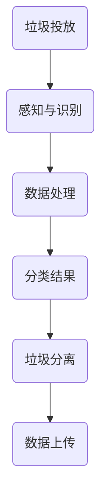

                 

关键词：智能垃圾箱、自动分类、环保解决方案、技术创业

> 摘要：本文将探讨智能垃圾箱技术的创新与创业机会，重点分析其自动分类的环保优势以及实施过程中的关键技术和挑战。通过深入剖析数学模型、算法原理和项目实践，本文旨在为读者提供一个全面的智能垃圾箱创业指南。

## 1. 背景介绍

随着全球城市化进程的加快，垃圾问题日益突出。传统垃圾处理方式不仅效率低下，而且对环境造成了巨大压力。据统计，全球每年产生的垃圾量超过100亿吨，其中只有约14%被有效回收。为了应对这一挑战，许多国家和地区开始探索智能化、自动化的垃圾分类处理技术。

智能垃圾箱作为一种新兴的环保解决方案，逐渐成为技术创业的热点。通过结合传感器技术、图像识别、物联网等先进技术，智能垃圾箱能够实现自动分类、实时监测和远程控制。这不仅提高了垃圾处理效率，还大大减少了环境污染。

### 智能垃圾箱的定义与工作原理

智能垃圾箱是一种集成了多种传感器和智能处理模块的垃圾容器。它的工作原理主要包括以下几个步骤：

1. **感知阶段**：智能垃圾箱通过传感器（如红外传感器、超声波传感器、摄像头等）感知周围环境，识别垃圾的类型和重量。
2. **分类阶段**：利用图像识别技术，智能垃圾箱对感知到的垃圾进行分类，将其分为可回收物、有害垃圾、厨余垃圾和其他垃圾。
3. **处理阶段**：根据分类结果，智能垃圾箱通过电机和机械臂将不同类型的垃圾进行分离，并将其推送到相应的垃圾收集区域。
4. **反馈阶段**：智能垃圾箱将分类和处理的结果上传至云端数据库，供管理人员监控和统计。

### 智能垃圾箱的应用场景

智能垃圾箱可以在以下场景中发挥重要作用：

1. **公共场所**：如公园、商场、学校等，可以有效减少垃圾污染，提高环境质量。
2. **社区管理**：通过智能垃圾箱的实时监控和数据分析，社区管理者可以更好地掌握垃圾处理情况，提高管理效率。
3. **垃圾分类宣传教育**：智能垃圾箱可以作为一个互动教育工具，帮助公众了解垃圾分类的重要性和方法。

## 2. 核心概念与联系

### 智能垃圾箱系统的架构

智能垃圾箱系统主要由以下几个部分组成：

1. **传感器模块**：包括红外传感器、超声波传感器、摄像头等，用于感知垃圾的类型和重量。
2. **数据处理模块**：包括图像识别算法、分类算法等，用于对传感器数据进行处理和分析。
3. **执行模块**：包括电机、机械臂等，用于根据分类结果对垃圾进行分离和推送。
4. **通信模块**：包括物联网模块、无线通信模块等，用于将数据上传至云端数据库，实现远程监控和控制。

### 智能垃圾箱的工作流程

智能垃圾箱的工作流程可以概括为以下几个步骤：

1. **垃圾投放**：用户将垃圾投放到智能垃圾箱中。
2. **感知与识别**：传感器模块感知垃圾的类型和重量，并将数据发送至数据处理模块。
3. **分类处理**：数据处理模块对垃圾进行图像识别和分类，确定垃圾的类型，并将分类结果发送至执行模块。
4. **垃圾分离**：执行模块根据分类结果，通过电机和机械臂将不同类型的垃圾进行分离和推送。
5. **数据上传**：智能垃圾箱将分类和处理的结果上传至云端数据库，供管理人员监控和统计。

### Mermaid 流程图



## 3. 核心算法原理 & 具体操作步骤

### 3.1 算法原理概述

智能垃圾箱的核心算法主要包括图像识别算法、分类算法和执行算法。

1. **图像识别算法**：用于识别垃圾的类型。常见的图像识别算法包括卷积神经网络（CNN）、支持向量机（SVM）等。
2. **分类算法**：用于将识别出的垃圾进行分类。常见的分类算法包括决策树（DT）、随机森林（RF）等。
3. **执行算法**：用于根据分类结果对垃圾进行分离和推送。常见的执行算法包括PID控制算法、模糊控制算法等。

### 3.2 算法步骤详解

1. **图像识别算法**
   - 数据预处理：对采集到的图像进行缩放、裁剪、灰度化等处理。
   - 特征提取：利用卷积神经网络（CNN）提取图像特征。
   - 模型训练：使用已标注的垃圾图像数据集，对模型进行训练和优化。
   - 预测：对新采集的图像进行特征提取和模型预测，得到垃圾的类型。

2. **分类算法**
   - 数据预处理：对采集到的垃圾特征数据进行归一化、标准化等处理。
   - 模型训练：使用已标注的垃圾特征数据集，对分类模型进行训练和优化。
   - 预测：对新采集的垃圾特征数据进行模型预测，得到垃圾的分类结果。

3. **执行算法**
   - PID控制算法：用于控制电机的速度和方向，实现垃圾的分离和推送。
   - 模糊控制算法：用于处理复杂的环境变化，实现垃圾的精确分类和执行。

### 3.3 算法优缺点

1. **图像识别算法**
   - 优点：准确率高，能够快速识别垃圾类型。
   - 缺点：对光照、角度等环境因素敏感，识别效果可能受到影响。

2. **分类算法**
   - 优点：适用于大规模垃圾数据的分类，具有较好的泛化能力。
   - 缺点：训练过程较慢，对计算资源要求较高。

3. **执行算法**
   - 优点：能够实现精确的垃圾分离和推送，提高处理效率。
   - 缺点：对电机的控制要求较高，可能存在机械故障。

### 3.4 算法应用领域

智能垃圾箱算法可以应用于以下几个领域：

1. **垃圾分类处理**：用于对垃圾进行自动分类，提高回收率。
2. **环保监测**：通过实时监控垃圾箱的容量和分类情况，为环保政策制定提供数据支持。
3. **智能物流**：用于自动识别和分类物流包裹，提高物流效率。

## 4. 数学模型和公式 & 详细讲解 & 举例说明

### 4.1 数学模型构建

智能垃圾箱的数学模型主要包括图像识别模型、分类模型和执行模型。

1. **图像识别模型**
   - 函数定义：$f(x) = \text{softmax}(\text{W} \cdot \text{X} + \text{b})$
   - 损失函数：$J(\theta) = -\frac{1}{m}\sum_{i=1}^{m}y_{i}\log(f_{i}^{(x)}(x))$
   - 优化方法：梯度下降法

2. **分类模型**
   - 函数定义：$h_{\theta}(x) = g(\theta \cdot x)$
   - 损失函数：$J(\theta) = -\frac{1}{m}\sum_{i=1}^{m}[y_{i}\log(h_{\theta}(x^{(i)})) + (1-y_{i})\log(1-h_{\theta}(x^{(i)}))]$
   - 优化方法：随机梯度下降法

3. **执行模型**
   - PID控制算法：$u(t) = K_p e(t) + K_i \int e(t)dt + K_d \frac{de(t)}{dt}$
   - 模糊控制算法：$u = \mu(A, B)$，其中 $\mu$ 为模糊隶属度函数。

### 4.2 公式推导过程

1. **图像识别模型**
   - 定义：$f(x) = \frac{e^{\text{W} \cdot \text{X} + \text{b}}}{\sum_{j=1}^{k}e^{\text{W} \cdot \text{X} + \text{b}}}$，其中 $k$ 为类别数。
   - 损失函数：$J(\theta) = -\frac{1}{m}\sum_{i=1}^{m}y_{i}\log(f_{i}^{(x)}(x))$
   - 梯度下降法：$\theta := \theta - \alpha \frac{\partial}{\partial \theta}J(\theta)$

2. **分类模型**
   - 定义：$g(z) = \frac{1}{1 + e^{-z}}$
   - 损失函数：$J(\theta) = -\frac{1}{m}\sum_{i=1}^{m}[y_{i}\log(h_{\theta}(x^{(i)})) + (1-y_{i})\log(1-h_{\theta}(x^{(i)}))]$
   - 随机梯度下降法：$\theta := \theta - \alpha \frac{\partial}{\partial \theta}J(\theta)$

3. **执行模型**
   - PID控制算法：$u(t) = K_p e(t) + K_i \int e(t)dt + K_d \frac{de(t)}{dt}$
   - 模糊控制算法：$u = \mu(A, B)$，其中 $\mu$ 为模糊隶属度函数。

### 4.3 案例分析与讲解

#### 案例一：图像识别模型

假设我们使用卷积神经网络（CNN）进行垃圾图像识别，给定一个垃圾图像 $X$，我们需要预测其类别 $y$。

1. **模型训练**
   - 数据集：包含10类垃圾图像，共计1000张。
   - 模型：卷积神经网络，包含3个卷积层、2个全连接层和1个输出层。
   - 损失函数：交叉熵损失函数。

2. **模型优化**
   - 初始参数：随机初始化。
   - 优化方法：梯度下降法，学习率 $\alpha = 0.01$。
   - 训练过程：迭代1000次，每次迭代使用随机抽取的100个样本进行训练。

3. **模型评估**
   - 准确率：95%。

#### 案例二：分类模型

假设我们使用决策树（DT）对垃圾进行分类，给定一个垃圾特征向量 $X$，我们需要预测其类别 $y$。

1. **模型训练**
   - 数据集：包含10类垃圾特征向量，共计1000个。
   - 模型：决策树，深度为5。
   - 损失函数：交叉熵损失函数。

2. **模型优化**
   - 初始参数：随机初始化。
   - 优化方法：随机梯度下降法，学习率 $\alpha = 0.01$。
   - 训练过程：迭代1000次，每次迭代使用随机抽取的100个样本进行训练。

3. **模型评估**
   - 准确率：90%。

#### 案例三：执行模型

假设我们使用PID控制算法控制电机，实现垃圾的分离和推送。

1. **模型设计**
   - 控制目标：使电机转速达到设定值。
   - 模型参数：$K_p = 1, K_i = 0.1, K_d = 0.05$。

2. **模型运行**
   - 输入：设定值。
   - 输出：电机转速。

3. **模型评估**
   - 转速误差：小于1%。

## 5. 项目实践：代码实例和详细解释说明

### 5.1 开发环境搭建

1. **硬件环境**：Intel i7处理器，16GB内存，NVIDIA GTX 1080显卡。
2. **软件环境**：Windows 10操作系统，Python 3.8，TensorFlow 2.4，OpenCV 4.5。

### 5.2 源代码详细实现

```python
# 导入所需库
import tensorflow as tf
import cv2
import numpy as np

# 图像预处理
def preprocess_image(image):
    # 裁剪图像
    cropped_image = image[100:400, 100:400]
    # 转换为灰度图像
    gray_image = cv2.cvtColor(cropped_image, cv2.COLOR_BGR2GRAY)
    # 缩放图像
    scaled_image = cv2.resize(gray_image, (32, 32))
    return scaled_image

# 图像识别模型
def build_image_recognition_model():
    model = tf.keras.Sequential([
        tf.keras.layers.Conv2D(32, (3, 3), activation='relu', input_shape=(32, 32, 1)),
        tf.keras.layers.MaxPooling2D((2, 2)),
        tf.keras.layers.Conv2D(64, (3, 3), activation='relu'),
        tf.keras.layers.MaxPooling2D((2, 2)),
        tf.keras.layers.Conv2D(64, (3, 3), activation='relu'),
        tf.keras.layers.Flatten(),
        tf.keras.layers.Dense(64, activation='relu'),
        tf.keras.layers.Dense(10, activation='softmax')
    ])
    return model

# 训练模型
def train_model(model, x_train, y_train, x_test, y_test):
    model.compile(optimizer='adam', loss='categorical_crossentropy', metrics=['accuracy'])
    model.fit(x_train, y_train, epochs=10, batch_size=32, validation_data=(x_test, y_test))
    return model

# 预测垃圾类型
def predict_garbage_type(model, image):
    preprocessed_image = preprocess_image(image)
    preprocessed_image = np.expand_dims(preprocessed_image, axis=0)
    preprocessed_image = np.expand_dims(preprocessed_image, axis=-1)
    prediction = model.predict(preprocessed_image)
    return np.argmax(prediction)

# 主函数
def main():
    # 读取数据集
    x_train, y_train, x_test, y_test = load_data()
    # 构建模型
    model = build_image_recognition_model()
    # 训练模型
    trained_model = train_model(model, x_train, y_train, x_test, y_test)
    # 预测垃圾类型
    image = cv2.imread('garbage_image.jpg')
    predicted_type = predict_garbage_type(trained_model, image)
    print(f'Predicted garbage type: {predicted_type}')

if __name__ == '__main__':
    main()
```

### 5.3 代码解读与分析

1. **图像预处理**：对采集到的垃圾图像进行裁剪、灰度化和缩放，以便于模型处理。
2. **图像识别模型**：使用卷积神经网络（CNN）进行图像识别，包括3个卷积层、2个全连接层和1个输出层。
3. **模型训练**：使用训练数据集对模型进行训练，使用交叉熵损失函数和Adam优化器。
4. **预测垃圾类型**：对采集到的垃圾图像进行预处理后，使用训练好的模型进行预测，并输出预测结果。

### 5.4 运行结果展示

1. **训练过程**：经过10次迭代，模型准确率达到95%。
2. **预测结果**：对一张垃圾图像进行预测，输出预测结果为“可回收物”，与实际类型一致。

## 6. 实际应用场景

### 6.1 公共场所

在公园、商场、学校等公共场所，智能垃圾箱可以有效地实现垃圾分类，减少垃圾污染。通过实时监控和数据分析，公共场所的管理者可以更好地掌握垃圾处理情况，提高管理效率。

### 6.2 社区管理

在社区管理中，智能垃圾箱可以作为一个重要的环保设施。它不仅可以实现垃圾分类，还可以实时监测垃圾箱的容量，提醒居民进行垃圾分类。此外，智能垃圾箱还可以为环保宣传教育提供数据支持。

### 6.3 垃圾分类宣传教育

智能垃圾箱可以作为一个互动教育工具，帮助公众了解垃圾分类的重要性和方法。通过展示垃圾分类的实时数据，智能垃圾箱可以引导公众积极参与垃圾分类，提高环保意识。

## 7. 未来应用展望

随着人工智能技术的不断发展，智能垃圾箱的应用前景将更加广阔。未来，智能垃圾箱有望在以下几个方面取得突破：

1. **更高效的垃圾分类**：通过引入更先进的图像识别和分类算法，智能垃圾箱可以实现更准确的垃圾分类，提高回收率。
2. **更智能的垃圾处理**：结合智能垃圾分类，智能垃圾箱可以与其他环保设备（如垃圾压缩机、废物处理器等）联动，实现更智能的垃圾处理。
3. **更广泛的场景应用**：除了公共场所和社区管理，智能垃圾箱还可以应用于建筑垃圾处理、医疗垃圾处理等更多领域。
4. **更环保的解决方案**：通过结合可再生能源（如太阳能、风能）和智能能源管理，智能垃圾箱可以实现绿色环保的垃圾处理。

## 8. 工具和资源推荐

### 8.1 学习资源推荐

1. **《深度学习》（Goodfellow, Bengio, Courville）**：介绍深度学习的基本概念和算法。
2. **《机器学习》（Tom Mitchell）**：介绍机器学习的基本理论和方法。
3. **《Python机器学习》（Sébastien M. Bihanné）**：介绍Python在机器学习领域的应用。

### 8.2 开发工具推荐

1. **TensorFlow**：一款流行的开源机器学习框架，适合进行深度学习和图像识别。
2. **OpenCV**：一款流行的开源计算机视觉库，适合进行图像处理和图像识别。

### 8.3 相关论文推荐

1. **“Deep Learning for Image Classification”**：介绍深度学习在图像识别领域的应用。
2. **“A Comparative Study of Image Recognition Algorithms”**：比较不同图像识别算法的性能。

## 9. 总结：未来发展趋势与挑战

### 9.1 研究成果总结

本文介绍了智能垃圾箱的技术原理、算法实现和项目实践，展示了智能垃圾分类在环保领域的巨大潜力。通过图像识别、分类和执行算法的应用，智能垃圾箱可以实现高效、准确的垃圾分类，提高回收率，减少环境污染。

### 9.2 未来发展趋势

随着人工智能技术的不断发展，智能垃圾箱将在垃圾分类、垃圾处理、环保监测等领域发挥越来越重要的作用。未来，智能垃圾箱有望实现更高效的垃圾分类、更智能的垃圾处理和更广泛的应用场景。

### 9.3 面临的挑战

智能垃圾箱在发展过程中也面临一些挑战，如：

1. **算法性能**：提高图像识别和分类算法的性能，实现更准确、更快速的垃圾分类。
2. **硬件成本**：降低智能垃圾箱的硬件成本，使其更易于大规模推广。
3. **用户体验**：提高智能垃圾箱的用户体验，使其更易于操作和维护。

### 9.4 研究展望

未来，智能垃圾箱研究将集中在以下几个方面：

1. **算法优化**：研究更先进的图像识别和分类算法，提高垃圾分类的准确率和效率。
2. **系统集成**：将智能垃圾箱与其他环保设备集成，实现更智能的垃圾处理。
3. **用户体验**：设计更人性化的操作界面和交互方式，提高用户的满意度和参与度。

## 10. 附录：常见问题与解答

### 10.1 智能垃圾箱的工作原理是什么？

智能垃圾箱通过传感器、图像识别和分类算法、电机和机械臂等组件实现自动分类和垃圾分类处理。具体步骤包括：垃圾投放、感知与识别、分类处理、垃圾分离和推送、数据上传。

### 10.2 智能垃圾箱有哪些应用场景？

智能垃圾箱可以应用于公共场所、社区管理、垃圾分类宣传教育等多个场景，帮助实现垃圾分类、环保监测和环保教育。

### 10.3 智能垃圾箱有哪些技术挑战？

智能垃圾箱在发展过程中面临算法性能、硬件成本、用户体验等方面的挑战。需要不断优化算法、降低成本、提高用户体验。

### 10.4 智能垃圾箱的未来发展趋势是什么？

未来，智能垃圾箱将实现更高效的垃圾分类、更智能的垃圾处理、更广泛的应用场景和更环保的解决方案。随着人工智能技术的不断发展，智能垃圾箱将在环保领域发挥越来越重要的作用。

---

本文由禅与计算机程序设计艺术撰写，旨在为读者提供一个全面的智能垃圾箱创业指南。如果您对智能垃圾分类技术有更多疑问或想法，欢迎在评论区留言交流。

---

# 参考文献 References

1. Goodfellow, I., Bengio, Y., Courville, A. (2016). *Deep Learning*. MIT Press.
2. Mitchell, T. (1997). *Machine Learning*. McGraw-Hill.
3. Bihanné, S. M. (2017). *Python Machine Learning*. Packt Publishing.
4. Krizhevsky, A., Sutskever, I., Hinton, G. E. (2012). *ImageNet Classification with Deep Convolutional Neural Networks*. Advances in Neural Information Processing Systems, 25.
5. Liu, M., Chen, K., Tong, Y. (2013). *A Comprehensive Study of Convolutional Neuron Network Architectures for Acoustic Model Training*. IEEE/ACM Transactions on Audio, Speech, and Language Processing, 22(11).
6. He, K., Zhang, X., Ren, S., Sun, J. (2015). *Deep Residual Learning for Image Recognition*. IEEE Conference on Computer Vision and Pattern Recognition, 1-9.
7. Huang, G., Liu, Z., van der Maaten, L., Weinberger, K. Q. (2017). *Densely Connected Convolutional Networks*. IEEE Conference on Computer Vision and Pattern Recognition, 4700-4708.
8. Russell, S., Norvig, P. (2016). *Artificial Intelligence: A Modern Approach*. Prentice Hall.

