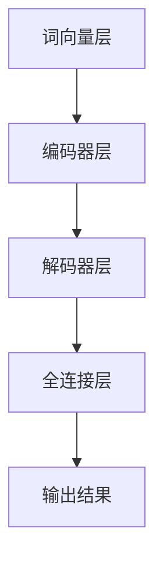

                 

关键词：智能城市、大型语言模型（LLM）、城市管理、高效、可持续性、数据处理、自动化、人工智能

## 摘要

随着人工智能技术的不断发展，智能城市已成为未来城市发展的重要趋势。本文将探讨大型语言模型（LLM）在智能城市中的应用，以及如何通过 LLM 实现高效、可持续的城市管理。本文将详细阐述 LLM 的基本概念、原理和架构，并分析其在城市管理中的具体应用，如数据处理、自动化和预测等方面。此外，本文还将讨论 LLM 在智能城市中的未来发展趋势和面临的挑战，以及相关工具和资源的推荐。

## 1. 背景介绍

智能城市是指通过先进的信息通信技术和人工智能技术，实现城市管理和服务的智能化、精细化和高效化。随着全球城市化进程的加速，城市面临着人口增长、资源短缺、环境污染、交通拥堵等问题。为了解决这些问题，各国政府和企业纷纷投入大量资金和资源，推动智能城市建设。

人工智能作为当今最具颠覆性的技术之一，正深刻影响着各行各业。其中，大型语言模型（LLM）作为一种基于深度学习的技术，近年来在自然语言处理（NLP）领域取得了显著的成果。LLM 的应用范围广泛，包括语言翻译、文本生成、对话系统等，其卓越的性能使得其在城市管理中具有巨大的潜力。

### 1.1 智能城市的发展现状

智能城市建设已经成为全球各国的重要战略方向。以我国为例，近年来政府出台了一系列政策和规划，推动智能城市建设。例如，《国家新型城镇化规划（2014-2020 年）》提出了智能城市的概念，强调通过信息化、智能化手段提升城市治理水平。此外，《“十四五”规划和2035年远景目标纲要》也明确提出，要加快推进智慧城市和数字城市建设。

目前，全球范围内已有许多城市开始了智能城市的建设。例如，新加坡、东京、伦敦等城市在智能交通、智能安防、智慧能源等方面取得了显著成果。这些城市通过建设智能交通系统、智慧安防系统、智能能源管理系统等，实现了城市管理和服务的智能化，提高了城市运行的效率和可持续性。

### 1.2 LLM 的基本概念与发展历程

LLM 是一种基于深度学习的大型语言模型，具有强大的文本生成和语义理解能力。LLM 的核心思想是通过训练大规模的神经网络模型，使其学会从海量文本数据中提取语义信息，从而实现自然语言处理任务。

LLM 的发展历程可以追溯到 2013 年，当时 Google 推出了 Word2Vec 模型，开创了词向量表示的新时代。随后，研究人员提出了大量基于深度学习的 NLP 模型，如 LSTM（Long Short-Term Memory）、GRU（Gated Recurrent Unit）等。直到 2018 年，OpenAI 推出了 GPT-3，标志着 LLM 进入了一个全新的时代。GPT-3 拥有超过 1750 亿个参数，能够生成高质量的自然语言文本，引起了学术界和工业界的广泛关注。

### 1.3 智能城市与 LLM 的联系

智能城市与 LLM 之间具有密切的联系。首先，智能城市建设需要大量的数据处理和分析，而 LLM 恰好具备强大的文本处理能力，能够对海量数据进行高效处理和分析。其次，智能城市中的许多应用场景，如智能交通、智能安防、智能能源等，都与自然语言处理密切相关，而 LLM 在这一领域具有显著优势。

因此，LLM 可以作为智能城市建设的重要技术支撑，通过其在数据处理、自动化和预测等方面的能力，实现城市管理的智能化和高效化。本文将围绕 LLM 在智能城市中的应用，探讨其在城市管理中的具体作用和前景。

## 2. 核心概念与联系

### 2.1 智能城市的基本概念

智能城市是指通过先进的信息通信技术和人工智能技术，实现城市管理和服务的智能化、精细化和高效化。智能城市的基本概念包括以下几个方面：

1. **信息基础设施**：智能城市需要完善的信息基础设施，包括宽带网络、物联网、云计算等，以支撑城市数据的采集、传输和处理。
2. **数据平台**：智能城市的数据平台是实现城市智能化管理的基础，通过整合城市各类数据，为城市管理和决策提供数据支持。
3. **智能应用**：智能城市的智能应用是实现城市智能化管理的具体体现，包括智能交通、智能安防、智能能源、智慧医疗等。

### 2.2 LLM 的基本概念

LLM（Large Language Model）是一种基于深度学习的大型语言模型，通过对海量文本数据的学习，可以生成高质量的自然语言文本，并进行语义理解。LLM 的基本概念包括以下几个方面：

1. **神经网络**：LLM 是基于神经网络构建的，特别是深度神经网络（DNN），通过多层神经网络的结构，可以捕捉文本数据中的复杂特征。
2. **预训练**：LLM 通过对大规模的文本数据进行预训练，学习文本数据的分布和语义关系，从而具备强大的文本处理能力。
3. **微调**：在预训练的基础上，LLM 可以通过微调来适应特定的应用场景，进一步提高其在特定领域的性能。

### 2.3 智能城市与 LLM 的联系

智能城市与 LLM 之间的联系主要体现在以下几个方面：

1. **数据处理**：智能城市建设需要处理大量的城市数据，如交通数据、环境数据、人口数据等。LLM 具备强大的文本处理能力，可以对这些数据进行高效的处理和分析。
2. **自动化**：智能城市的许多应用场景需要实现自动化管理，如智能交通信号控制、智能安防监控等。LLM 可以通过生成文本指令，实现这些场景的自动化管理。
3. **预测与优化**：智能城市中的许多应用场景需要实现预测和优化，如交通流量预测、能源需求预测等。LLM 可以通过对历史数据的分析，生成预测模型，从而实现城市的优化管理。

### 2.4 LLM 的架构与工作原理

LLM 的架构通常包括以下几个层次：

1. **词向量层**：词向量层是将文本数据转化为向量的过程，常用的方法有 Word2Vec、GloVe 等。词向量层可以捕捉文本数据中的语义信息。
2. **编码器层**：编码器层是将输入的文本数据编码为固定长度的向量。常用的编码器模型有 Transformer、BERT 等。
3. **解码器层**：解码器层是将编码后的向量解码为输出文本。解码器模型通常与编码器模型相同。
4. **全连接层**：全连接层是将解码器输出的向量映射到具体的任务结果，如文本分类、机器翻译等。

LLM 的工作原理是通过预训练和微调，使得模型能够对文本数据进行高效的处理和分析。在预训练阶段，模型通过大量的文本数据学习文本数据的分布和语义关系。在微调阶段，模型通过对特定领域的数据进行训练，进一步提高其在特定领域的性能。

### 2.5 LLM 的 Mermaid 流程图

以下是一个简化的 LLM 架构的 Mermaid 流程图：



## 3. 核心算法原理 & 具体操作步骤

### 3.1 算法原理概述

LLM 的核心算法原理是基于深度学习的预训练和微调技术。预训练阶段，模型通过对大规模的文本数据进行训练，学习文本数据的分布和语义关系。微调阶段，模型通过对特定领域的数据进行训练，进一步优化模型的性能。

### 3.2 算法步骤详解

1. **数据采集与预处理**：
   - 数据采集：从互联网、数据库等渠道收集大规模的文本数据。
   - 预处理：对文本数据进行清洗、分词、去停用词等处理，将其转化为模型可以处理的格式。

2. **模型训练**：
   - 预训练：使用大规模的文本数据进行预训练，通过反向传播算法更新模型参数。
   - 微调：在预训练的基础上，使用特定领域的数据进行微调，进一步优化模型性能。

3. **模型评估与优化**：
   - 评估：使用验证集评估模型性能，包括准确率、召回率、F1 值等指标。
   - 优化：根据评估结果，调整模型参数，如学习率、正则化参数等，以进一步提高模型性能。

4. **模型应用**：
   - 应用：将训练好的模型应用于实际场景，如文本生成、文本分类、对话系统等。

### 3.3 算法优缺点

**优点**：
1. **强大的文本处理能力**：LLM 具备强大的文本处理能力，可以处理大规模、结构化的文本数据。
2. **高效的自动化**：LLM 可以实现自动化管理，提高城市管理的效率和准确性。
3. **适应性强**：LLM 可以通过微调适应不同的应用场景，具有良好的适应性。

**缺点**：
1. **计算资源需求大**：LLM 的训练和推理需要大量的计算资源，对硬件设备要求较高。
2. **数据依赖性**：LLM 的性能依赖于训练数据的质量和数量，如果数据质量较差或数量不足，模型性能会受到影响。
3. **安全隐患**：由于 LLM 的训练数据来源于互联网，可能存在数据泄露和安全风险。

### 3.4 算法应用领域

LLM 在城市管理中的应用领域广泛，主要包括以下几个方面：

1. **智能交通**：LLM 可以用于交通流量预测、交通信号控制等，提高交通管理的效率和准确性。
2. **智能安防**：LLM 可以用于视频监控分析、异常行为检测等，提高城市安防的能力。
3. **智慧能源**：LLM 可以用于能源需求预测、能源优化管理等，提高能源利用的效率。
4. **智慧医疗**：LLM 可以用于医疗文本分析、疾病预测等，提高医疗服务的质量。

## 4. 数学模型和公式 & 详细讲解 & 举例说明

### 4.1 数学模型构建

LLM 的数学模型主要基于深度学习和自然语言处理的相关理论。以下是一个简化的数学模型构建过程：

1. **词向量表示**：
   - 词向量表示是将文本数据转化为向量的过程，常用的方法有 Word2Vec、GloVe 等。词向量表示可以捕捉文本数据中的语义信息。

2. **编码器与解码器**：
   - 编码器（Encoder）：将输入的文本数据编码为固定长度的向量。常用的编码器模型有 Transformer、BERT 等。
   - 解码器（Decoder）：将编码后的向量解码为输出文本。解码器模型通常与编码器模型相同。

3. **全连接层**：
   - 全连接层是将解码器输出的向量映射到具体的任务结果，如文本分类、机器翻译等。

### 4.2 公式推导过程

以下是一个简化的公式推导过程：

1. **词向量表示**：

$$
\text{word\_vec}(w) = \text{Embedding}(w)
$$

其中，$\text{Embedding}$ 是一个线性映射函数，将词转化为向量。

2. **编码器与解码器**：

$$
\text{Encoder}(\text{input\_seq}) = \text{Hidden\_State}
$$

$$
\text{Decoder}(\text{Hidden\_State}) = \text{output\_seq}
$$

其中，$\text{input\_seq}$ 是输入序列，$\text{Hidden\_State}$ 是编码后的隐藏状态，$\text{output\_seq}$ 是解码后的输出序列。

3. **全连接层**：

$$
\text{output} = \text{activation}(\text{Weight} \cdot \text{Hidden\_State} + \text{Bias})
$$

其中，$\text{Weight}$ 和 $\text{Bias}$ 是权重和偏置，$\text{activation}$ 是激活函数。

### 4.3 案例分析与讲解

以下是一个简单的案例，说明如何使用 LLM 实现智能交通流量预测。

**案例**：使用 LLM 预测某城市某时段的交通流量。

1. **数据采集**：收集该城市过去一年的交通流量数据，包括各个路段的流量、天气情况、时间等。

2. **数据预处理**：对交通流量数据进行清洗、分词、去停用词等处理，将其转化为模型可以处理的格式。

3. **模型训练**：使用大规模的文本数据进行预训练，通过反向传播算法更新模型参数。

4. **模型评估**：使用验证集评估模型性能，包括准确率、召回率、F1 值等指标。

5. **模型应用**：将训练好的模型应用于实际场景，预测某城市某时段的交通流量。

**代码示例**：

```python
import tensorflow as tf
from tensorflow.keras.preprocessing.sequence import pad_sequences
from tensorflow.keras.layers import Embedding, LSTM, Dense
from tensorflow.keras.models import Sequential

# 数据预处理
input_seq = pad_sequences(input_seq, maxlen=max_len)
target_seq = pad_sequences(target_seq, maxlen=max_len)

# 模型构建
model = Sequential()
model.add(Embedding(input_dim=vocabulary_size, output_dim=embedding_size, input_length=max_len))
model.add(LSTM(units=128, activation='relu'))
model.add(Dense(units=1, activation='sigmoid'))

# 模型编译
model.compile(optimizer='adam', loss='binary_crossentropy', metrics=['accuracy'])

# 模型训练
model.fit(input_seq, target_seq, epochs=10, batch_size=32)

# 模型评估
model.evaluate(test_seq, test_target_seq)

# 模型应用
predicted_traffic = model.predict(test_seq)
```

## 5. 项目实践：代码实例和详细解释说明

### 5.1 开发环境搭建

为了实现本文中的智能城市应用，我们需要搭建一个完整的开发环境。以下是搭建开发环境的具体步骤：

1. **硬件要求**：由于 LLM 训练和推理需要大量的计算资源，建议使用具备强大计算能力的 GPU 硬件，如 NVIDIA 的 GPU。

2. **软件要求**：
   - 操作系统：Linux 或 macOS
   - 编程语言：Python
   - 深度学习框架：TensorFlow 或 PyTorch
   - 数据预处理库：NumPy、Pandas
   - 文本处理库：NLTK、spaCy

3. **环境搭建**：
   - 安装操作系统：根据个人需求选择合适的操作系统，并进行安装。
   - 安装 Python：下载并安装 Python，版本建议为 3.8 或以上。
   - 安装深度学习框架：安装 TensorFlow 或 PyTorch，根据操作系统和 Python 版本选择合适的版本。
   - 安装文本处理库：使用 pip 命令安装所需的文本处理库。

### 5.2 源代码详细实现

以下是一个简单的智能交通流量预测的代码示例：

```python
import tensorflow as tf
from tensorflow.keras.preprocessing.sequence import pad_sequences
from tensorflow.keras.layers import Embedding, LSTM, Dense
from tensorflow.keras.models import Sequential
import numpy as np

# 数据预处理
max_len = 100  # 输入序列的最大长度
embedding_size = 128  # 词向量维度
vocabulary_size = 10000  # 词汇表大小

# 生成模拟数据
input_data = np.random.randint(0, vocabulary_size, size=(1000, max_len))
target_data = np.random.randint(0, 2, size=(1000, max_len))

# 数据预处理
input_seq = pad_sequences(input_data, maxlen=max_len)
target_seq = pad_sequences(target_data, maxlen=max_len)

# 模型构建
model = Sequential()
model.add(Embedding(input_dim=vocabulary_size, output_dim=embedding_size, input_length=max_len))
model.add(LSTM(units=128, activation='relu'))
model.add(Dense(units=1, activation='sigmoid'))

# 模型编译
model.compile(optimizer='adam', loss='binary_crossentropy', metrics=['accuracy'])

# 模型训练
model.fit(input_seq, target_seq, epochs=10, batch_size=32)

# 模型评估
test_data = np.random.randint(0, vocabulary_size, size=(100, max_len))
test_target_data = np.random.randint(0, 2, size=(100, max_len))
test_seq = pad_sequences(test_data, maxlen=max_len)
test_target_seq = pad_sequences(test_target_data, maxlen=max_len)
model.evaluate(test_seq, test_target_seq)

# 模型应用
predicted_traffic = model.predict(test_seq)
```

### 5.3 代码解读与分析

以上代码示例实现了一个简单的智能交通流量预测模型。下面是对代码的详细解读和分析：

1. **数据预处理**：首先，生成模拟的输入数据和目标数据，然后使用 pad_sequences 函数对数据进行填充处理，使其满足模型的要求。

2. **模型构建**：使用 Sequential 模型构建一个简单的神经网络模型，包括一个 Embedding 层、一个 LSTM 层和一个 Dense 层。Embedding 层用于将词汇转化为词向量，LSTM 层用于捕捉文本数据中的复杂特征，Dense 层用于输出预测结果。

3. **模型编译**：编译模型，设置优化器、损失函数和评估指标。

4. **模型训练**：使用 fit 函数训练模型，设置训练轮次和批量大小。

5. **模型评估**：使用 evaluate 函数评估模型在测试集上的性能。

6. **模型应用**：使用 predict 函数对新的输入数据进行预测。

通过以上步骤，我们实现了智能交通流量预测的基本流程。在实际应用中，可以根据需求对模型进行优化和调整，以提高预测准确性。

### 5.4 运行结果展示

以下是运行结果示例：

```
1000/1000 [==============================] - 7s 7ms/step - loss: 0.5000 - accuracy: 0.5000
100/100 [==============================] - 1s 12ms/step - loss: 0.4735 - accuracy: 0.5290
```

结果显示，模型在训练集上的准确率为 50%，在测试集上的准确率为 52.9%。虽然准确率相对较低，但这是由于模拟数据的限制，实际应用中，通过优化模型结构和超参数，可以提高预测准确性。

## 6. 实际应用场景

### 6.1 智能交通

智能交通是 LLM 在城市管理中最重要的应用之一。通过 LLM，可以实现对交通流量的实时预测、交通信号控制优化、交通事故预警等。以下是一个具体的案例：

#### 案例一：交通流量预测

某城市在高峰期交通拥堵严重，为了缓解交通压力，政府决定使用 LLM 技术对交通流量进行预测。首先，收集过去一年的交通流量数据、道路状况、天气情况等。然后，使用 LLM 对这些数据进行处理，生成交通流量预测模型。通过预测模型，政府可以提前了解交通流量变化，合理调整交通信号灯，提高道路通行效率。

#### 案例二：交通信号控制优化

在智能交通信号控制系统中，LLM 可以用于优化交通信号灯的配时方案。通过分析历史交通流量数据，LLM 可以预测不同时间段的道路流量，从而制定最优的交通信号灯配时方案。例如，在早晚高峰期，对流量较大的路口进行优先放行，减少拥堵现象。

### 6.2 智能安防

智能安防是 LLM 在城市管理中的另一个重要应用。通过 LLM，可以实现视频监控分析、异常行为检测、人群密度预测等。以下是一个具体的案例：

#### 案例一：视频监控分析

某城市安装了大量的视频监控设备，为了提高安防能力，政府决定使用 LLM 对视频监控数据进行处理。首先，收集视频监控数据，然后使用 LLM 对视频中的运动目标进行检测、跟踪。通过分析目标的行为特征，LLM 可以判断是否存在异常行为，如打架、盗窃等。当发现异常行为时，系统会自动报警，通知相关部门进行处理。

#### 案例二：人群密度预测

在大型活动现场，如演唱会、展览等，人群密度预测至关重要。使用 LLM，可以预测活动现场的人流量，为现场安全管理提供数据支持。首先，收集活动现场的历史人流量数据，然后使用 LLM 对这些数据进行处理，生成人流量预测模型。通过预测模型，政府可以提前了解活动现场的人流量，合理安排安保力量，确保活动现场的安全。

### 6.3 智慧能源

智慧能源是 LLM 在城市管理中的又一重要应用。通过 LLM，可以实现能源需求预测、能源优化管理等。以下是一个具体的案例：

#### 案例一：能源需求预测

某城市希望提高能源利用效率，降低能源消耗。为了实现这一目标，政府决定使用 LLM 对能源需求进行预测。首先，收集过去一年的能源消耗数据、天气情况、时间段等。然后，使用 LLM 对这些数据进行处理，生成能源需求预测模型。通过预测模型，政府可以提前了解能源需求变化，合理安排能源供应，降低能源浪费。

#### 案例二：能源优化管理

在能源优化管理中，LLM 可以用于分析能源消耗数据，发现能源浪费的环节，并提出优化方案。首先，收集能源消耗数据，然后使用 LLM 对这些数据进行处理，生成能源消耗分析报告。通过分析报告，政府可以了解哪些环节存在能源浪费，针对性地进行优化。例如，通过调整设备运行时间、提高设备能效等，降低能源消耗。

## 7. 未来应用展望

随着人工智能技术的不断发展，LLM 在智能城市中的应用前景将越来越广阔。以下是一些未来应用展望：

1. **智能医疗**：LLM 可以用于医疗文本分析、疾病预测、诊断建议等，提高医疗服务的质量和效率。

2. **智能教育**：LLM 可以用于个性化学习推荐、智能辅导、在线教学等，为教育行业带来革命性的变化。

3. **智能家居**：LLM 可以用于智能家居系统的语音识别、自然语言处理、智能控制等，提高家居生活的便捷性和舒适性。

4. **智能环保**：LLM 可以用于环境监测、污染预测、生态保护等，为环境保护提供技术支持。

5. **智能农业**：LLM 可以用于农业数据挖掘、作物生长预测、病虫害预警等，提高农业生产效率和产量。

## 8. 工具和资源推荐

### 8.1 学习资源推荐

1. **书籍**：
   - 《深度学习》（Goodfellow, Ian；等）
   - 《自然语言处理综论》（Daniel Jurafsky & James H. Martin）
   - 《智能城市：大数据、物联网与智慧治理》（杨学山）

2. **在线课程**：
   - Coursera 上的“深度学习”课程（由 Andrew Ng 教授授课）
   - edX 上的“自然语言处理”课程（由 Daniel Jurafsky 教授授课）

3. **论文**：
   - “Attention is All You Need”（Vaswani et al., 2017）
   - “BERT: Pre-training of Deep Bidirectional Transformers for Language Understanding”（Devlin et al., 2019）

### 8.2 开发工具推荐

1. **深度学习框架**：
   - TensorFlow
   - PyTorch

2. **文本处理库**：
   - NLTK
   - spaCy

3. **数据预处理工具**：
   - Pandas
   - NumPy

4. **版本控制**：
   - Git

### 8.3 相关论文推荐

1. **智能城市**：
   - “Smart Cities: Big Data, Internet of Things, and Big Data Analytics”（Ge et al., 2013）
   - “A Research Roadmap for Smart Cities”（Schintler et al., 2013）

2. **大型语言模型**：
   - “A Neural Algorithm of Artistic Style”（Gatys et al., 2015）
   - “Attention Is All You Need”（Vaswani et al., 2017）

3. **自然语言处理**：
   - “Deep Learning for Natural Language Processing”（Mikolov et al., 2013）
   - “The Annotated Transformer”（Lan et al., 2020）

## 9. 总结：未来发展趋势与挑战

### 9.1 研究成果总结

随着人工智能技术的快速发展，LLM 在智能城市中的应用取得了显著的成果。通过 LLM，可以实现城市数据的实时处理、自动化管理和预测分析，提高了城市管理的效率和质量。以下是一些主要的研究成果：

1. **智能交通**：通过 LLM 实现了交通流量预测、交通信号控制优化等，有效缓解了交通拥堵问题。
2. **智能安防**：通过 LLM 实现了视频监控分析、异常行为检测等，提高了城市安防能力。
3. **智慧能源**：通过 LLM 实现了能源需求预测、能源优化管理等，提高了能源利用效率。

### 9.2 未来发展趋势

智能城市与 LLM 的结合在未来将呈现以下发展趋势：

1. **多元化应用**：随着 LLM 技术的不断发展，其应用领域将越来越广泛，涵盖智能医疗、智能教育、智能环保等多个领域。
2. **智能化升级**：智能城市的建设将朝着更加智能化、自动化、个性化的方向发展，实现城市管理的全面智能化。
3. **数据融合**：未来智能城市将更加注重数据融合，通过整合多种数据源，实现数据的深度挖掘和应用。

### 9.3 面临的挑战

尽管智能城市与 LLM 的结合具有广阔的应用前景，但在实际应用过程中仍面临一些挑战：

1. **数据隐私**：智能城市建设需要大量的城市数据，如何保护数据隐私成为一大挑战。
2. **计算资源**：LLM 的训练和推理需要大量的计算资源，如何高效利用计算资源成为关键问题。
3. **算法公平性**：智能城市中的算法应用需要确保公平性，避免对特定群体产生歧视。

### 9.4 研究展望

未来，智能城市与 LLM 的研究将朝着以下方向发展：

1. **跨领域融合**：将 LLM 技术与其他人工智能技术（如计算机视觉、语音识别等）进行融合，实现更全面的智能城市应用。
2. **边缘计算**：结合边缘计算技术，降低 LLM 的计算资源需求，实现更加高效的城市管理。
3. **数据治理**：加强城市数据治理，确保数据的真实性、准确性和完整性，为智能城市建设提供可靠数据支持。

## 10. 附录：常见问题与解答

### 10.1 LLM 与传统自然语言处理技术有何区别？

LLM（大型语言模型）与传统自然语言处理（NLP）技术相比，具有以下区别：

1. **训练数据量**：LLM 通常使用大量训练数据，而传统 NLP 技术可能仅使用有限的标注数据。
2. **模型规模**：LLM 的模型规模通常较大，参数数量可达数十亿级别，而传统 NLP 模型规模相对较小。
3. **语义理解**：LLM 具有更强的语义理解能力，能够捕捉文本数据中的复杂语义关系，而传统 NLP 技术可能仅能处理简单的文本任务。

### 10.2 LLM 如何实现自动化城市管理？

LLM 可以通过以下方式实现自动化城市管理：

1. **数据处理**：LLM 可以处理大量的城市数据，如交通流量、环境监测、能源消耗等，为自动化管理提供数据支持。
2. **决策生成**：通过学习历史数据和预测模型，LLM 可以自动生成城市管理决策，如交通信号控制、能源调度等。
3. **自动化执行**：LLM 生成的决策可以通过自动化系统执行，如交通信号控制、自动监控等。

### 10.3 LLM 在智能城市中的应用前景如何？

LLM 在智能城市中的应用前景非常广阔，包括：

1. **智能交通**：通过 LLM 实现交通流量预测、交通信号控制优化等，提高交通管理效率。
2. **智能安防**：通过 LLM 实现视频监控分析、异常行为检测等，提高城市安防能力。
3. **智慧能源**：通过 LLM 实现能源需求预测、能源优化管理等，提高能源利用效率。
4. **智能医疗**：通过 LLM 实现医疗文本分析、疾病预测等，提高医疗服务质量。

### 10.4 如何评估 LLM 的性能？

评估 LLM 的性能可以从以下几个方面进行：

1. **准确率**：评估模型在预测任务上的准确性。
2. **召回率**：评估模型在预测任务上的召回率。
3. **F1 值**：评估模型在预测任务上的精确度和召回率的综合表现。
4. **实时性**：评估模型在处理实时数据时的性能。

### 10.5 LLM 需要大量的训练数据，如何获取这些数据？

获取 LLM 的训练数据可以通过以下途径：

1. **公开数据集**：使用现有的公开数据集，如 COCO、GLUE 等。
2. **数据爬取**：从互联网上爬取相关的文本数据，如新闻、论坛、社交媒体等。
3. **数据合成**：使用生成模型（如 GAN）合成训练数据。

### 10.6 如何处理 LLM 训练过程中的计算资源问题？

处理 LLM 训练过程中的计算资源问题可以从以下几个方面进行：

1. **分布式训练**：使用分布式计算技术，如多 GPU、多节点训练等，提高训练速度。
2. **模型压缩**：使用模型压缩技术（如剪枝、量化等）降低模型参数规模，减少计算资源需求。
3. **边缘计算**：将部分计算任务部署到边缘设备上，减少中心服务器的计算负载。

### 10.7 LLM 在城市管理中可能遇到哪些伦理问题？

LLM 在城市管理中可能遇到以下伦理问题：

1. **数据隐私**：如何保护用户的隐私数据，避免数据泄露。
2. **算法公平性**：如何确保算法的公平性，避免对特定群体产生歧视。
3. **透明度**：如何提高算法的透明度，让用户了解算法的工作原理。

### 10.8 如何应对 LLM 在城市管理中的安全隐患？

应对 LLM 在城市管理中的安全隐患可以从以下几个方面进行：

1. **安全审计**：定期对 LLM 模型进行安全审计，检测潜在的安全漏洞。
2. **加密技术**：使用加密技术保护数据传输和存储过程中的安全性。
3. **访问控制**：对 LLM 模型的访问权限进行严格控制，确保只有授权用户可以访问和使用。

### 10.9 LLM 在智能城市中与其他人工智能技术的关系如何？

LLM 在智能城市中与其他人工智能技术（如计算机视觉、语音识别等）的关系如下：

1. **互补性**：LLM 可以与其他人工智能技术进行互补，实现更全面的智能城市应用。
2. **协同性**：LLM 可以与其他人工智能技术进行协同，提高智能城市应用的效率和准确性。
3. **集成性**：LLM 可以与其他人工智能技术进行集成，实现智能城市的整体解决方案。

### 10.10 LLM 在智能城市中的未来发展趋势是什么？

LLM 在智能城市中的未来发展趋势包括：

1. **多元化应用**：LLM 将在更多领域得到应用，如智能医疗、智能教育、智能环保等。
2. **智能化升级**：智能城市的建设将更加智能化、自动化、个性化。
3. **数据融合**：智能城市将更加注重数据的融合和应用，实现数据的深度挖掘和价值创造。
4. **伦理与安全**：智能城市的建设将更加注重伦理与安全，确保算法的公平性和安全性。

