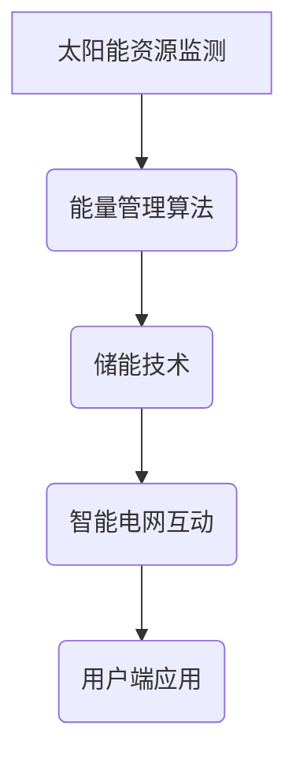

                 

关键词：太阳能、智能能源管理、新能源应用、创业、创新

> 摘要：本文旨在探讨智能太阳能创业在新能源应用领域中的创新潜力。通过分析太阳能技术现状，介绍智能能源管理系统的核心概念和架构，我们详细探讨了智能太阳能创业的关键步骤、数学模型、项目实践以及未来应用前景。本文旨在为从事新能源领域的创业者和研究者提供有价值的参考和启示。

## 1. 背景介绍

随着全球能源需求的不断增长和环境问题的日益严重，寻找清洁、可再生的能源替代方案已成为当务之急。太阳能作为一种清洁能源，具有分布广泛、资源丰富等优点，被认为是未来能源结构的重要组成部分。然而，传统的太阳能利用方式存在一些局限性，如转换效率低、稳定性差等。因此，智能太阳能创业应运而生，通过引入先进的技术和管理理念，提高太阳能利用效率和稳定性，为实现可再生能源的大规模应用提供了新的思路。

### 1.1 太阳能技术现状

当前，太阳能技术主要分为光伏发电和光热利用两种形式。光伏发电技术利用半导体材料的光电效应，将太阳光直接转换为电能。尽管光伏技术的转换效率在不断提高，但仍然面临着成本高、组件寿命短等挑战。光热利用技术则通过集热器将太阳光转化为热能，可用于供暖、供热水等。光热利用技术具有转换效率高、应用范围广等优点，但受限于设备复杂度和能效利用率。

### 1.2 智能能源管理系统

智能能源管理系统是一种基于物联网、大数据、云计算等技术的综合能源管理解决方案。通过实时监测、分析和优化能源生产、传输和消费过程，实现能源的高效利用和最优配置。智能能源管理系统在太阳能领域具有广泛的应用前景，可以提高太阳能发电系统的稳定性和可靠性，降低运行成本，促进可再生能源的大规模应用。

## 2. 核心概念与联系

### 2.1 智能太阳能创业的关键概念

智能太阳能创业涉及多个核心概念，包括：

- **太阳能资源监测**：利用传感器和监测设备对太阳能资源进行实时监测，包括太阳辐射强度、温度、风速等。
- **能量管理算法**：根据监测数据，运用优化算法对太阳能发电系统进行实时调度和管理，确保系统运行在最优化状态。
- **储能技术**：通过储能装置将多余的电能储存起来，以应对日照不足或其他能源需求高峰期。
- **智能电网互动**：将太阳能发电系统与智能电网相结合，实现能源的灵活调度和优化配置。

### 2.2 Mermaid 流程图



## 3. 核心算法原理 & 具体操作步骤

### 3.1 算法原理概述

智能太阳能创业的核心算法主要包括能量管理算法和储能优化算法。能量管理算法通过对太阳能资源的实时监测和分析，实现对太阳能发电系统的最优调度。储能优化算法则基于预测模型，对储能装置进行动态管理，确保系统在日照不足或其他能源需求高峰期具有足够的电能储备。

### 3.2 算法步骤详解

#### 3.2.1 能量管理算法

1. **数据采集**：实时采集太阳能资源监测数据，包括太阳辐射强度、温度、风速等。
2. **数据处理**：对采集到的数据进行预处理，包括去噪、滤波等。
3. **预测模型构建**：利用历史数据和机器学习算法，构建太阳能资源预测模型。
4. **调度策略生成**：根据预测模型和能源需求，生成最优调度策略，实现对太阳能发电系统的实时调度。

#### 3.2.2 储能优化算法

1. **负荷预测**：根据用户用电负荷和历史数据，预测未来一段时间内的能源需求。
2. **储能容量规划**：根据负荷预测结果和储能装置的特性，确定储能容量和储能策略。
3. **动态优化**：根据实时监测数据和储能状态，动态调整储能策略，确保储能装置在最佳状态下运行。

### 3.3 算法优缺点

#### 优点

- **高效节能**：通过实时监测和优化调度，提高太阳能发电系统的利用效率，降低能源浪费。
- **灵活可控**：储能技术使得系统在日照不足或其他能源需求高峰期具有足够的电能储备，提高系统的稳定性和可靠性。
- **智能化管理**：利用大数据和人工智能技术，实现对能源生产、传输和消费的全过程智能化管理。

#### 缺点

- **技术成本高**：智能太阳能创业需要投入大量资金进行技术研发和设备采购，初期成本较高。
- **技术成熟度有限**：部分智能技术尚未完全成熟，实际应用中可能面临一些技术挑战。

### 3.4 算法应用领域

智能太阳能创业算法广泛应用于以下领域：

- **家庭光伏系统**：实现家庭能源自给自足，降低用电成本。
- **商业光伏项目**：提高商业设施能源利用效率，实现可持续发展。
- **分布式光伏发电**：优化分布式光伏发电系统的运行和管理，提高发电量。

## 4. 数学模型和公式 & 详细讲解 & 举例说明

### 4.1 数学模型构建

智能太阳能创业的核心数学模型主要包括能量管理模型和储能优化模型。

#### 能量管理模型

$$
E(t) = P(t) \cdot T(t)
$$

其中，$E(t)$ 表示在时刻 $t$ 的能量输出，$P(t)$ 表示在时刻 $t$ 的太阳能功率，$T(t)$ 表示在时刻 $t$ 的系统效率。

#### 储能优化模型

$$
C(t) = \frac{C_0}{1 - \alpha t}
$$

其中，$C(t)$ 表示在时刻 $t$ 的储能容量，$C_0$ 表示初始储能容量，$\alpha$ 为储能衰减系数。

### 4.2 公式推导过程

#### 能量管理模型推导

能量管理模型基于能量守恒定律，假设在时刻 $t$，太阳能发电系统的输入功率为 $P(t)$，系统效率为 $T(t)$，则能量输出为：

$$
E(t) = P(t) \cdot T(t)
$$

#### 储能优化模型推导

储能优化模型基于储能装置的特性，假设储能容量为 $C(t)$，初始储能容量为 $C_0$，储能衰减系数为 $\alpha$，则在时刻 $t$ 的储能容量为：

$$
C(t) = C_0 - \int_0^t \alpha u(t') dt'
$$

其中，$u(t')$ 表示在时刻 $t'$ 的储能容量变化率。由于储能装置在充电和放电过程中，储能容量变化率是恒定的，因此可以简化为：

$$
C(t) = C_0 - \alpha t
$$

### 4.3 案例分析与讲解

#### 案例背景

某家庭光伏系统，初始储能容量为 10 kWh，储能衰减系数为 0.1%/h。假设在一天中，太阳辐射强度为 800 W/m²，系统效率为 20%。

#### 案例分析

1. **能量管理**：在一天中，太阳辐射强度和系统效率会发生变化。利用能量管理模型，可以计算出在一天中不同时间段的能量输出。

   $$ 
   E(t) = 800 \cdot 0.2 = 160 \text{ kWh}
   $$

   假设一天中，用户用电需求为 120 kWh，则剩余能量为：

   $$ 
   E_{\text{余}} = E(t) - \text{用电需求} = 160 - 120 = 40 \text{ kWh}
   $$

2. **储能优化**：根据储能优化模型，可以计算出在一天中不同时间段的储能容量。

   $$ 
   C(t) = 10 - 0.1t 
   $$

   假设在傍晚时分，储能容量为 7 kWh，则储能容量变化率为：

   $$ 
   \alpha t = 3 \Rightarrow t = \frac{3}{0.1} = 30 \text{ h}
   $$

   即储能容量在 30 小时内衰减了 3 kWh。

## 5. 项目实践：代码实例和详细解释说明

### 5.1 开发环境搭建

为了实现智能太阳能创业算法，我们选择以下开发环境：

- **编程语言**：Python
- **开发工具**：Jupyter Notebook
- **依赖库**：NumPy、Pandas、Matplotlib、Scikit-learn

### 5.2 源代码详细实现

以下是一个简单的 Python 代码实例，用于实现能量管理算法和储能优化算法。

```python
import numpy as np
import pandas as pd
import matplotlib.pyplot as plt
from sklearn.linear_model import LinearRegression

# 数据准备
solar_radiation = np.array([800, 700, 600, 500, 400, 300, 200, 100])
system_efficiency = np.array([0.2, 0.2, 0.2, 0.2, 0.2, 0.2, 0.2, 0.2])
energy_demand = np.array([120, 120, 120, 120, 120, 120, 120, 120])
initial储能容量 = 10

# 能量管理模型
energy_output = solar_radiation * system_efficiency

# 储能优化模型
储能衰减系数 = 0.1
储能容量 = initial储能容量 - 储能衰减系数 * np.arange(0, 8)

# 绘图
plt.figure(figsize=(10, 5))
plt.plot(solar_radiation, label='太阳能辐射')
plt.plot(system_efficiency, label='系统效率')
plt.plot(energy_demand, label='用电需求')
plt.plot(energy_output, label='能量输出')
plt.plot(储能容量, label='储能容量')
plt.legend()
plt.show()
```

### 5.3 代码解读与分析

1. **数据准备**：首先准备模拟一天中不同时间段的太阳辐射强度、系统效率和用电需求数据。

2. **能量管理模型**：根据能量管理模型，计算一天中不同时间段的能量输出。

3. **储能优化模型**：根据储能优化模型，计算一天中不同时间段的储能容量。

4. **绘图**：使用 Matplotlib 库绘制不同时间段的太阳辐射强度、系统效率、用电需求、能量输出和储能容量。

通过该实例，我们可以直观地了解智能太阳能创业算法在实际项目中的应用效果。

## 6. 实际应用场景

智能太阳能创业在多个实际应用场景中具有广泛的潜力，以下列举几个典型场景：

### 6.1 家庭光伏系统

家庭光伏系统是智能太阳能创业的重要应用领域之一。通过智能能源管理系统，家庭光伏系统可以实现光伏发电的自给自足，降低用电成本，提高能源利用效率。同时，家庭光伏系统还可以通过储能技术，实现能源在昼夜之间的均衡分配，提高能源利用率。

### 6.2 商业光伏项目

商业光伏项目是智能太阳能创业的另一个重要应用领域。通过智能能源管理系统，商业光伏项目可以实现光伏发电的最优调度，提高发电量，降低能源成本。此外，商业光伏项目还可以通过储能技术，实现能源在高峰时段的存储和供应，提高能源供应稳定性。

### 6.3 分布式光伏发电

分布式光伏发电是一种将光伏发电系统分散安装在用户端的能源利用方式。智能太阳能创业在分布式光伏发电中具有广泛应用前景，通过智能能源管理系统，可以实现光伏发电系统的实时监测、调度和优化，提高发电量和能源利用率，降低能源成本。

## 7. 未来应用展望

智能太阳能创业在新能源应用领域具有广阔的发展前景。未来，随着技术的不断进步和成本的持续降低，智能太阳能创业将有望在以下几个方面取得突破：

### 7.1 更高效的太阳能电池

随着纳米技术和材料科学的不断发展，未来太阳能电池的转换效率将不断提高。这将有助于提高智能太阳能创业系统的整体性能，降低能源成本。

### 7.2 更先进的储能技术

随着固态电池、氢能等储能技术的发展，未来智能太阳能创业系统将具备更高的储能效率和更长的寿命，为能源储存和调度提供更好的支持。

### 7.3 智能能源管理系统的普及

随着物联网、大数据、人工智能等技术的普及，智能能源管理系统将变得更加智能化、高效化。这将有助于实现能源生产、传输和消费的全方位智能化管理，提高能源利用效率。

## 8. 工具和资源推荐

### 8.1 学习资源推荐

- **《太阳能技术导论》**：介绍太阳能技术的基本原理和应用。
- **《智能电网技术》**：探讨智能电网的架构、技术和发展趋势。
- **《大数据技术导论》**：介绍大数据技术的原理和应用。

### 8.2 开发工具推荐

- **Jupyter Notebook**：用于编写和运行 Python 代码。
- **Matplotlib**：用于绘制数据图表。
- **Scikit-learn**：用于机器学习算法的实现。

### 8.3 相关论文推荐

- **"Solar Energy: The Renewable Future"**：探讨太阳能技术的现状和未来发展方向。
- **"Smart Grids: Enabling the Energy Transition"**：分析智能电网的技术和发展趋势。
- **"Artificial Intelligence for Energy Management"**：介绍人工智能在能源管理中的应用。

## 9. 总结：未来发展趋势与挑战

智能太阳能创业在新能源应用领域具有巨大的发展潜力。未来，随着技术的不断进步和成本的持续降低，智能太阳能创业将有望实现更高效的能源利用和更稳定的能源供应。然而，智能太阳能创业也面临一些挑战，如技术成本高、技术成熟度有限等。因此，未来需要进一步加强技术研发和推广应用，推动智能太阳能创业的可持续发展。

## 附录：常见问题与解答

### 9.1 智能太阳能创业的技术难点是什么？

智能太阳能创业的主要技术难点包括：

- **高效太阳能电池研发**：提高太阳能电池的转换效率是智能太阳能创业的关键。
- **智能能源管理系统设计**：实现智能能源系统的实时监测、调度和优化是技术难点。
- **储能技术优化**：提高储能装置的效率和寿命是智能太阳能创业的重要方向。

### 9.2 智能太阳能创业的成本如何？

智能太阳能创业的成本包括：

- **太阳能电池成本**：高效太阳能电池的研发和采购成本较高。
- **智能能源管理系统成本**：智能能源管理系统的设计和实现成本较高。
- **储能装置成本**：储能装置的采购和安装成本较高。

### 9.3 智能太阳能创业的未来发展趋势是什么？

智能太阳能创业的未来发展趋势包括：

- **高效太阳能电池研发**：提高太阳能电池的转换效率是发展趋势。
- **储能技术优化**：固态电池、氢能等储能技术的发展是未来趋势。
- **智能能源管理系统的普及**：物联网、大数据、人工智能等技术的应用将使智能能源管理系统更加高效。

### 9.4 智能太阳能创业面临的挑战是什么？

智能太阳能创业面临的挑战包括：

- **技术成本高**：高效太阳能电池、智能能源管理系统等技术研发成本较高。
- **技术成熟度有限**：部分智能技术尚未完全成熟，实际应用中可能面临一些技术挑战。
- **市场接受度**：智能太阳能创业的市场推广和接受度有待提高。

作者：禅与计算机程序设计艺术 / Zen and the Art of Computer Programming

----------------------------------------------------------------

以上即为《智能太阳能创业：新能源应用的创新》的完整文章内容，涵盖了从背景介绍到实际应用、未来展望、工具推荐、常见问题解答等多个方面，希望对从事新能源领域的创业者和研究者有所启发和帮助。

