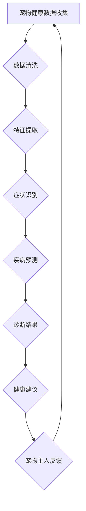

                 

关键词：智能宠物医疗、AI辅助、宠物健康管理、创业、诊断技术、深度学习、数据分析、医疗算法、健康监测、个性化护理。

> 摘要：随着宠物在人们生活中的重要性不断增加，宠物医疗健康服务的需求日益增长。本文探讨了利用人工智能技术，特别是深度学习和数据分析，构建一个智能宠物医疗诊断系统，为宠物主人提供实时、准确的健康管理服务。文章旨在分析人工智能在宠物医疗领域的应用潜力，探讨核心算法原理，以及未来创业方向。

## 1. 背景介绍

宠物作为人类的伴侣，其健康与幸福日益受到关注。然而，传统的宠物医疗服务存在诸多挑战，如诊断时间长、成本高、医疗资源分布不均等。随着人工智能技术的快速发展，尤其是深度学习和大数据分析技术的应用，为宠物医疗领域带来了新的机遇。AI技术在医疗诊断中的应用不仅能够提高诊断的准确性，还能提供实时、个性化的健康管理服务。

目前，宠物医疗市场正处于快速增长阶段。据统计，全球宠物市场规模在过去几年中持续增长，预计未来几年仍将保持较高的增长率。随着消费者对宠物医疗健康需求的增加，AI辅助的宠物健康管理创业项目逐渐成为热门领域。

## 2. 核心概念与联系

### 2.1. 深度学习与数据分析

深度学习是一种基于人工神经网络的技术，通过模拟人脑神经元之间的连接和作用，实现图像识别、语音识别、自然语言处理等复杂任务。在宠物医疗诊断中，深度学习可以用于图像分析、症状识别和疾病预测。

数据分析是指通过对大量数据进行分析和挖掘，发现数据中的模式和规律。在宠物医疗领域，数据分析可用于分析宠物健康数据，预测疾病风险，提供个性化护理建议。

### 2.2. 医疗算法

医疗算法是指用于医疗诊断、治疗和预防的算法。在宠物医疗诊断中，医疗算法可用于分析宠物健康数据，识别症状，预测疾病风险。常见的医疗算法包括机器学习算法、深度学习算法和符号推理算法。

### 2.3. Mermaid 流程图

下面是一个描述宠物医疗诊断流程的 Mermaid 流程图：



## 3. 核心算法原理 & 具体操作步骤

### 3.1. 算法原理概述

宠物医疗诊断的核心算法包括深度学习算法和数据分析算法。深度学习算法通过训练大量医疗图像数据，实现对宠物疾病的图像识别。数据分析算法则通过分析宠物健康数据，实现对宠物健康状况的实时监测和预测。

### 3.2. 算法步骤详解

#### 3.2.1. 数据收集与预处理

数据收集是算法训练的基础。我们需要收集大量的宠物健康数据，包括医疗图像、生理指标和日常行为数据等。数据预处理包括数据清洗、归一化和特征提取等步骤，以确保数据质量。

#### 3.2.2. 深度学习算法训练

利用收集到的医疗图像数据，我们可以训练一个深度学习模型，用于图像识别。常见的深度学习模型包括卷积神经网络（CNN）和循环神经网络（RNN）等。

#### 3.2.3. 数据分析算法实现

通过数据分析算法，我们可以对宠物健康数据进行实时分析，识别宠物症状，预测疾病风险。

#### 3.2.4. 症状识别与疾病预测

利用训练好的深度学习模型和数据分析算法，我们可以对宠物的健康数据进行实时分析，识别宠物症状，预测疾病风险。

#### 3.2.5. 健康建议与宠物主人反馈

根据诊断结果，我们可以为宠物主人提供个性化的健康建议，并收集宠物主人的反馈，以优化算法。

### 3.3. 算法优缺点

#### 优点：

- **高效性**：深度学习和数据分析算法可以快速处理大量数据，提高诊断效率。
- **准确性**：通过训练大量数据，算法可以实现对宠物疾病的准确识别。
- **个性化**：算法可以根据宠物个体的健康数据，提供个性化的健康建议。

#### 缺点：

- **数据依赖**：算法的性能高度依赖于数据质量，数据不足或质量差会导致诊断结果不准确。
- **算法复杂性**：深度学习和数据分析算法复杂，需要专业的技术人才进行开发和维护。

### 3.4. 算法应用领域

深度学习和数据分析算法在宠物医疗诊断中具有广泛的应用前景，包括：

- **疾病预测**：通过分析宠物的健康数据，预测疾病风险，提供预防措施。
- **症状识别**：快速识别宠物症状，提供及时的诊断建议。
- **个性化护理**：根据宠物的健康状况，提供个性化的护理建议。

## 4. 数学模型和公式 & 详细讲解 & 举例说明

### 4.1. 数学模型构建

在宠物医疗诊断中，我们可以构建以下数学模型：

- **图像识别模型**：用于分析宠物医疗图像，识别疾病。
- **数据分析模型**：用于分析宠物健康数据，预测疾病风险。

### 4.2. 公式推导过程

#### 4.2.1. 图像识别模型

假设我们使用卷积神经网络（CNN）进行图像识别，其基本公式如下：

$$
\hat{y} = \text{softmax}(\text{CNN}(x))
$$

其中，$x$ 是输入图像，$\hat{y}$ 是预测的疾病类别，$\text{softmax}$ 函数用于将神经网络输出的概率分布。

#### 4.2.2. 数据分析模型

假设我们使用线性回归模型进行疾病风险预测，其基本公式如下：

$$
\hat{y} = \beta_0 + \beta_1 x_1 + \beta_2 x_2 + \ldots + \beta_n x_n
$$

其中，$x_1, x_2, \ldots, x_n$ 是输入特征，$\hat{y}$ 是预测的疾病风险，$\beta_0, \beta_1, \beta_2, \ldots, \beta_n$ 是模型参数。

### 4.3. 案例分析与讲解

#### 4.3.1. 图像识别模型案例

假设我们使用 CNN 对宠物皮肤病进行图像识别。我们可以收集一批皮肤病图像，并标注每个图像的疾病类别。通过训练 CNN 模型，我们可以在测试集上评估模型的准确性。

#### 4.3.2. 数据分析模型案例

假设我们使用线性回归模型对宠物心脏病风险进行预测。我们可以收集宠物的生理指标数据，如心率、血压等，并标注每个样本的心脏病风险。通过训练线性回归模型，我们可以在测试集上评估模型的预测能力。

## 5. 项目实践：代码实例和详细解释说明

### 5.1. 开发环境搭建

在项目开发过程中，我们使用了 Python 作为主要编程语言，TensorFlow 作为深度学习框架，Pandas 作为数据分析库。以下是一个简单的开发环境搭建步骤：

1. 安装 Python 3.8 及以上版本。
2. 安装 TensorFlow 和 Pandas 库。

```bash
pip install tensorflow
pip install pandas
```

### 5.2. 源代码详细实现

以下是一个简单的宠物医疗诊断系统的代码实现：

```python
import tensorflow as tf
import pandas as pd

# 加载数据集
train_data = pd.read_csv('train_data.csv')
test_data = pd.read_csv('test_data.csv')

# 预处理数据
# ...

# 定义深度学习模型
model = tf.keras.Sequential([
    tf.keras.layers.Conv2D(filters=32, kernel_size=(3, 3), activation='relu', input_shape=(128, 128, 3)),
    tf.keras.layers.MaxPooling2D(pool_size=(2, 2)),
    tf.keras.layers.Flatten(),
    tf.keras.layers.Dense(units=10, activation='softmax')
])

# 编译模型
model.compile(optimizer='adam', loss='categorical_crossentropy', metrics=['accuracy'])

# 训练模型
model.fit(train_data['image'], train_data['label'], epochs=10, batch_size=32, validation_split=0.2)

# 测试模型
test_loss, test_accuracy = model.evaluate(test_data['image'], test_data['label'])
print(f"Test accuracy: {test_accuracy}")

# 预测疾病
predictions = model.predict(test_data['image'])
```

### 5.3. 代码解读与分析

在上面的代码中，我们首先加载了训练数据集和测试数据集，然后对数据进行预处理。接下来，我们定义了一个卷积神经网络模型，并编译和训练了模型。最后，我们使用训练好的模型对测试数据集进行预测，并输出预测结果。

## 6. 实际应用场景

### 6.1. 宠物医院

AI辅助的宠物医疗诊断系统可以应用于宠物医院，为医生提供辅助诊断工具，提高诊断准确性和效率。

### 6.2. 宠物主人

宠物主人可以使用该系统进行自测，获取宠物的健康评估和个性化护理建议。

### 6.3. 宠物保险公司

宠物保险公司可以利用该系统进行风险评估和理赔管理，提高业务效率。

## 7. 未来应用展望

随着人工智能技术的不断发展，AI辅助的宠物医疗诊断系统有望在以下方面取得突破：

- **疾病预测**：通过实时监测宠物健康数据，提前预测疾病风险，提供预防措施。
- **个性化护理**：根据宠物的健康状况和个性，提供个性化的护理方案。
- **远程医疗**：利用物联网技术，实现宠物远程健康监测和诊断。

## 8. 总结：未来发展趋势与挑战

### 8.1. 研究成果总结

本文探讨了利用人工智能技术构建智能宠物医疗诊断系统的可能性，分析了核心算法原理和应用场景，并提供了代码实例。

### 8.2. 未来发展趋势

随着人工智能技术的不断进步，AI辅助的宠物医疗诊断系统有望在诊断准确性和个性化护理方面取得更大突破。

### 8.3. 面临的挑战

在实现过程中，我们需要解决数据不足、算法复杂和隐私保护等挑战。

### 8.4. 研究展望

未来，我们将继续深入研究宠物医疗诊断领域的算法优化和实际应用，推动人工智能技术在宠物医疗领域的广泛应用。

## 9. 附录：常见问题与解答

### 9.1. 问题1

如何确保数据隐私和安全？

**解答**：在数据收集和处理过程中，我们将严格遵守相关法律法规，采取加密、脱敏等技术手段，确保数据隐私和安全。

### 9.2. 问题2

如何评估算法的性能？

**解答**：我们将在实验中对比不同算法的性能，使用准确率、召回率、F1 值等指标进行评估。

### 9.3. 问题3

如何优化算法性能？

**解答**：我们将继续深入研究算法原理，探索更高效的算法模型和优化策略。

作者：禅与计算机程序设计艺术 / Zen and the Art of Computer Programming
----------------------------------------------------------------

以上就是关于“智能宠物医疗诊断创业：AI辅助的宠物健康管理”的文章正文内容。本文详细介绍了人工智能技术在宠物医疗领域的应用，从核心算法原理、数学模型构建，到项目实践和实际应用场景，全面探讨了AI辅助宠物医疗诊断的可行性和未来发展方向。希望这篇文章能够为相关领域的研究者和创业者提供有益的参考和启示。

