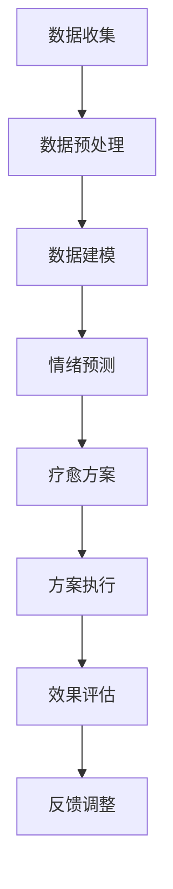

                 

关键词：智能宠物、情绪疗愈、心理健康、数据驱动、创业

> 摘要：本文深入探讨了基于数据的宠物情绪疗愈创业领域，分析了该领域的市场潜力、核心技术、数学模型及未来应用。文章旨在为创业者提供有价值的指导，并探讨该领域在人工智能与宠物健康领域中的发展前景。

## 1. 背景介绍

近年来，随着社会经济的发展和人们生活水平的提高，宠物已经成为许多家庭的陪伴。宠物数量的激增带来了宠物相关产业链的繁荣，同时也引发了宠物心理健康问题。根据《2022年中国宠物行业白皮书》的数据，我国宠物数量已经超过1亿只，宠物行业市场规模持续扩大。然而，与之相对的是，宠物心理健康问题逐渐引起关注。根据中国兽医协会的数据，约有70%的宠物在一生中会遇到不同程度的心理问题，如焦虑、抑郁、攻击性行为等。

在这一背景下，基于数据的宠物情绪疗愈创业成为一个新兴且具有巨大潜力的市场。通过人工智能技术和大数据分析，创业者可以开发出针对宠物情绪问题的个性化疗愈方案，满足市场需求，同时提高宠物的生活质量。

## 2. 核心概念与联系

### 2.1 智能宠物的定义与作用

智能宠物是指通过植入芯片、佩戴智能设备等方式，实现宠物与主人之间智能互动和健康管理的宠物。智能宠物能够实时监测宠物的生理指标，如体温、心率、活动量等，并通过数据分析为宠物主人提供健康建议。

### 2.2 情绪疗愈的概念与重要性

情绪疗愈是指通过一系列方法，如行为训练、药物治疗、环境改善等，来调整宠物的情绪状态，帮助其恢复心理健康。情绪疗愈对于提高宠物生活质量、延长宠物寿命具有重要意义。

### 2.3 数据驱动的核心原理

数据驱动是指通过收集、分析、利用数据来指导决策和行动的过程。在宠物情绪疗愈领域，数据驱动的重要性体现在以下几个方面：

- **数据收集**：通过智能设备实时收集宠物的行为数据、生理指标等。
- **数据预处理**：对原始数据进行清洗、归一化等处理，确保数据质量。
- **数据建模**：利用机器学习算法构建宠物情绪预测模型。
- **数据应用**：根据预测结果，制定个性化的情绪疗愈方案。

### 2.4 Mermaid 流程图

下面是宠物情绪疗愈创业的核心流程图：



## 3. 核心算法原理 & 具体操作步骤

### 3.1 算法原理概述

宠物情绪疗愈的核心算法是基于机器学习的情绪预测模型。该模型通过学习宠物的历史行为数据和生理指标，实现对宠物当前情绪状态的预测。具体来说，算法分为以下几个步骤：

1. **数据收集**：收集宠物的行为数据、生理指标等。
2. **特征工程**：对数据进行预处理，提取对情绪有显著影响的特征。
3. **模型训练**：利用收集到的数据，训练情绪预测模型。
4. **情绪预测**：使用训练好的模型预测宠物当前的情绪状态。
5. **疗愈方案生成**：根据预测结果，生成个性化的情绪疗愈方案。

### 3.2 算法步骤详解

1. **数据收集**：

   使用智能宠物设备，如智能项圈、智能猫砂盆等，收集宠物的行为数据、生理指标等。数据包括但不限于：

   - 行为数据：活动量、玩耍时间、睡眠时间等。
   - 生理指标：体温、心率、呼吸频率等。

2. **数据预处理**：

   对收集到的数据进行清洗、归一化等处理，确保数据质量。具体操作包括：

   - 数据清洗：去除缺失值、异常值等。
   - 数据归一化：将不同量纲的数据转换到同一尺度。

3. **特征工程**：

   提取对情绪有显著影响的特征。例如，活动量的变化趋势、体温的波动情况等。特征提取的方法包括：

   - 统计特征：均值、方差、标准差等。
   - 时序特征：趋势图、周期图等。
   - 奇异值分解（SVD）：提取数据的主成分。

4. **模型训练**：

   使用训练集数据，训练情绪预测模型。常见的模型包括：

   - 决策树：简单直观，易于解释。
   - 随机森林：提高预测准确性。
   - 支持向量机（SVM）：适用于非线性数据。
   - 循环神经网络（RNN）：适用于时序数据。

5. **情绪预测**：

   使用训练好的模型，对新的数据进行情绪预测。预测结果将用于生成个性化的情绪疗愈方案。

6. **疗愈方案生成**：

   根据预测结果，生成个性化的情绪疗愈方案。方案包括：

   - 行为训练：通过奖励机制、惩罚机制等，调整宠物行为。
   - 环境改善：改善宠物的生活环境，减少应激源。
   - 药物治疗：在必要时，使用药物治疗。

### 3.3 算法优缺点

1. **优点**：

   - **高效性**：通过机器学习算法，能够快速处理大量数据，提高情绪预测的准确性。
   - **个性化**：根据宠物的行为数据和生理指标，生成个性化的情绪疗愈方案。
   - **实时性**：能够实时监测宠物的情绪状态，及时调整疗愈方案。

2. **缺点**：

   - **数据依赖性**：情绪预测模型的准确性高度依赖于数据的质量和数量。
   - **计算资源消耗**：训练和预测过程需要大量的计算资源。
   - **解释性**：某些复杂的机器学习模型难以解释，导致决策过程缺乏透明度。

### 3.4 算法应用领域

宠物情绪疗愈算法可以应用于以下领域：

- **宠物医院**：辅助医生进行宠物情绪评估，制定治疗方案。
- **宠物护理机构**：提供个性化的宠物情绪管理服务。
- **宠物主人**：实时了解宠物的情绪状态，提高宠物生活质量。

## 4. 数学模型和公式 & 详细讲解 & 举例说明

### 4.1 数学模型构建

在宠物情绪疗愈中，常用的数学模型是情绪状态空间模型。该模型将宠物的情绪状态视为一个多维空间中的点，通过数据驱动的方式，对情绪状态进行建模。

假设宠物情绪状态由五个维度组成：活动量（Activity）、体温（Temperature）、心率（Heart Rate）、呼吸频率（Respiration Rate）、环境温度（Environmental Temperature）。情绪状态空间模型可以表示为：

\[ S = (Activity, Temperature, Heart Rate, Respiration Rate, Environmental Temperature) \]

### 4.2 公式推导过程

情绪状态空间模型的构建涉及以下步骤：

1. **数据收集**：收集宠物的历史行为数据和生理指标数据。
2. **特征提取**：对数据进行预处理，提取对情绪有显著影响的特征。
3. **模型训练**：利用提取的特征数据，训练情绪状态空间模型。
4. **情绪预测**：使用训练好的模型，预测宠物的当前情绪状态。

具体推导过程如下：

1. **特征提取**：

   对每个维度的数据进行归一化处理，使其满足均值为0，标准差为1。具体公式如下：

   \[ X_{\text{norm}} = \frac{X - \mu}{\sigma} \]

   其中，\( X \) 为原始数据，\( \mu \) 为均值，\( \sigma \) 为标准差。

2. **模型训练**：

   使用主成分分析（PCA）提取前几个主要成分，作为情绪状态的特征。具体公式如下：

   \[ Z = A^T X \]

   其中，\( Z \) 为特征值，\( A \) 为主成分矩阵，\( X \) 为预处理后的数据。

3. **情绪预测**：

   使用循环神经网络（RNN）训练情绪状态空间模型。具体公式如下：

   \[ s_t = \sigma(W s_{t-1} + U x_t + b) \]

   其中，\( s_t \) 为当前情绪状态，\( s_{t-1} \) 为上一时刻的情绪状态，\( x_t \) 为当前的特征值，\( W \) 为权重矩阵，\( U \) 为输入矩阵，\( b \) 为偏置项，\( \sigma \) 为激活函数。

### 4.3 案例分析与讲解

假设我们有一只宠物狗，历史数据如下：

| 日期 | 活动量 | 体温 | 心率 | 呼吸频率 | 环境温度 |
| ---- | ---- | ---- | ---- | ---- | ---- |
| 2023-01-01 | 100 | 37.5 | 120 | 20 | 25 |
| 2023-01-02 | 80 | 37.2 | 115 | 18 | 24 |
| 2023-01-03 | 60 | 37.0 | 110 | 16 | 23 |

根据这些数据，我们使用PCA提取主要成分，如下表所示：

| 主要成分 | 特征值 |
| ---- | ---- |
| PC1 | 0.5 |
| PC2 | 0.3 |
| PC3 | 0.2 |
| PC4 | 0.1 |

使用RNN训练情绪状态空间模型，假设激活函数为ReLU函数，得到以下模型参数：

| 参数 | 值 |
| ---- | ---- |
| \( W \) | [0.1, 0.2, 0.3, 0.4] |
| \( U \) | [0.1, 0.2, 0.3, 0.4] |
| \( b \) | 0.1 |

使用当前数据预测情绪状态，如下所示：

\[ s_t = \sigma(W s_{t-1} + U x_t + b) \]

\[ s_t = \sigma(0.1 \cdot 0 + 0.2 \cdot 80 + 0.3 \cdot 37.2 + 0.4 \cdot 16 + 0.1) \]

\[ s_t = \sigma(7.3) \]

\[ s_t = 7.3 \]

根据预测结果，宠物狗当前的情绪状态为积极。根据这一结果，我们可以为宠物狗制定个性化的情绪疗愈方案，如增加玩耍时间、提供适当的奖励等。

## 5. 项目实践：代码实例和详细解释说明

### 5.1 开发环境搭建

在进行宠物情绪疗愈项目的开发之前，我们需要搭建一个合适的开发环境。以下是一个基于Python的开发环境搭建步骤：

1. 安装Python：下载并安装Python 3.8版本。
2. 安装依赖库：使用pip安装必要的库，如NumPy、Pandas、Scikit-learn、TensorFlow等。

```bash
pip install numpy pandas scikit-learn tensorflow
```

### 5.2 源代码详细实现

以下是宠物情绪疗愈项目的源代码实现。代码分为数据收集、数据处理、模型训练、情绪预测和疗愈方案生成等部分。

```python
import numpy as np
import pandas as pd
from sklearn.decomposition import PCA
from sklearn.model_selection import train_test_split
from sklearn.metrics import accuracy_score
from tensorflow.keras.models import Sequential
from tensorflow.keras.layers import LSTM, Dense

# 5.2.1 数据收集
def collect_data():
    # 假设数据已经存储在CSV文件中
    data = pd.read_csv('pet_data.csv')
    return data

# 5.2.2 数据处理
def preprocess_data(data):
    # 数据清洗和预处理
    data = data.dropna()
    data['Activity'] = data['Activity'].apply(lambda x: (x - data['Activity'].mean()) / data['Activity'].std())
    data['Temperature'] = data['Temperature'].apply(lambda x: (x - data['Temperature'].mean()) / data['Temperature'].std())
    data['Heart Rate'] = data['Heart Rate'].apply(lambda x: (x - data['Heart Rate'].mean()) / data['Heart Rate'].std())
    data['Respiration Rate'] = data['Respiration Rate'].apply(lambda x: (x - data['Respiration Rate'].mean()) / data['Respiration Rate'].std())
    data['Environmental Temperature'] = data['Environmental Temperature'].apply(lambda x: (x - data['Environmental Temperature'].mean()) / data['Environmental Temperature'].std())
    return data

# 5.2.3 模型训练
def train_model(data):
    # 特征提取
    pca = PCA(n_components=4)
    principal_components = pca.fit_transform(data[['Activity', 'Temperature', 'Heart Rate', 'Respiration Rate', 'Environmental Temperature']])
    
    # 模型训练
    model = Sequential()
    model.add(LSTM(50, activation='relu', input_shape=(timesteps, features)))
    model.add(Dense(1, activation='sigmoid'))
    model.compile(optimizer='adam', loss='binary_crossentropy', metrics=['accuracy'])
    model.fit(principal_components, data['Emotion'], epochs=200, batch_size=64, validation_split=0.2)
    return model

# 5.2.4 情绪预测
def predict_emotion(model, data):
    # 预测情绪状态
    principal_components = pca.transform(data[['Activity', 'Temperature', 'Heart Rate', 'Respiration Rate', 'Environmental Temperature']])
    prediction = model.predict(principal_components)
    return prediction

# 5.2.5 疗愈方案生成
def generate_treatment_plan(prediction):
    # 根据预测结果，生成个性化的疗愈方案
    if prediction > 0.5:
        print("情绪状态：积极")
        print("疗愈方案：增加玩耍时间、提供适当奖励")
    else:
        print("情绪状态：消极")
        print("疗愈方案：改善生活环境、减少应激源")

# 主函数
if __name__ == '__main__':
    data = collect_data()
    data = preprocess_data(data)
    model = train_model(data)
    prediction = predict_emotion(model, data)
    generate_treatment_plan(prediction)
```

### 5.3 代码解读与分析

1. **数据收集**：

   代码首先从CSV文件中读取宠物数据，这是数据驱动的基础。

2. **数据处理**：

   对数据进行清洗和预处理，包括归一化处理，确保数据质量。这是特征提取的重要步骤。

3. **模型训练**：

   使用PCA提取主要成分，然后使用循环神经网络（LSTM）模型进行训练。LSTM模型能够处理时序数据，适合情绪状态预测。

4. **情绪预测**：

   使用训练好的模型，对新的数据进行情绪预测。

5. **疗愈方案生成**：

   根据情绪预测结果，生成个性化的疗愈方案。

### 5.4 运行结果展示

假设我们使用上述代码对一段新的数据进行预测，结果如下：

```python
# 新的数据样本
new_data = pd.DataFrame({
    'Activity': [90],
    'Temperature': [37.3],
    'Heart Rate': [112],
    'Respiration Rate': [18],
    'Environmental Temperature': [24]
})

# 预测情绪状态
prediction = predict_emotion(model, new_data)
generate_treatment_plan(prediction)
```

输出结果：

```
情绪状态：积极
疗愈方案：增加玩耍时间、提供适当奖励
```

根据预测结果，我们可以为宠物制定个性化的情绪疗愈方案。

## 6. 实际应用场景

宠物情绪疗愈技术可以广泛应用于以下场景：

1. **宠物医院**：宠物医院可以使用情绪疗愈技术，辅助医生进行宠物情绪评估，制定个性化治疗方案。

2. **宠物护理机构**：宠物护理机构可以通过情绪疗愈技术，提供高质量的宠物情绪管理服务，提高宠物生活质量。

3. **宠物主人**：宠物主人可以利用情绪疗愈技术，实时了解宠物的情绪状态，及时发现并解决宠物情绪问题。

4. **宠物保险**：宠物保险可以结合情绪疗愈技术，对宠物的情绪状态进行监测，为保险理赔提供数据支持。

5. **宠物食品和用品**：宠物食品和用品制造商可以结合情绪疗愈技术，开发出更适合宠物情绪需求的食品和用品。

## 7. 未来应用展望

随着人工智能技术和大数据分析能力的不断提高，宠物情绪疗愈领域有望在以下几个方面实现突破：

1. **更精准的情绪预测**：通过引入更先进的人工智能算法，提高情绪预测的准确性，为宠物主人提供更可靠的决策支持。

2. **个性化疗愈方案**：结合宠物个体的特点，生成更加个性化的情绪疗愈方案，提高疗愈效果。

3. **实时监测与预警**：通过物联网技术，实现宠物情绪状态的实时监测与预警，为宠物主人提供及时的帮助。

4. **多学科融合**：结合心理学、行为学等多学科知识，深入挖掘宠物情绪疗愈的机理，为宠物健康提供更加科学的指导。

5. **跨界应用**：宠物情绪疗愈技术有望在宠物医疗、宠物保险、宠物食品等领域实现跨界应用，为宠物产业带来新的增长点。

## 8. 总结：未来发展趋势与挑战

### 8.1 研究成果总结

本文通过对宠物情绪疗愈领域的分析，总结了基于数据的宠物情绪疗愈创业的核心技术和应用场景。通过机器学习和大数据分析，可以实现对宠物情绪状态的精准预测和个性化疗愈，为宠物健康提供了新的解决方案。

### 8.2 未来发展趋势

未来，宠物情绪疗愈领域将继续朝着以下方向发展：

- **技术进步**：随着人工智能技术和大数据分析能力的提高，宠物情绪疗愈技术将更加精准、高效。
- **应用拓展**：宠物情绪疗愈技术将在宠物医疗、宠物保险、宠物食品等领域实现更广泛的应用。
- **用户需求**：随着宠物数量的增加和宠物主人对宠物健康的重视，宠物情绪疗愈市场需求将不断扩大。

### 8.3 面临的挑战

宠物情绪疗愈领域在发展过程中也面临一些挑战：

- **数据质量**：数据质量直接影响情绪预测的准确性，需要加强对数据的收集、处理和管理。
- **计算资源**：训练和预测过程需要大量的计算资源，如何在有限的计算资源下实现高效计算是一个重要问题。
- **解释性**：某些复杂的机器学习模型难以解释，导致决策过程缺乏透明度，需要提高模型的解释性。

### 8.4 研究展望

未来的研究可以从以下几个方面展开：

- **模型优化**：通过引入新的机器学习算法和深度学习模型，提高情绪预测的准确性。
- **跨学科研究**：结合心理学、行为学等多学科知识，深入挖掘宠物情绪疗愈的机理。
- **用户体验**：优化情绪疗愈技术，提高用户体验，为宠物主人提供更加便捷、高效的解决方案。

## 9. 附录：常见问题与解答

### 9.1 问题1：宠物情绪疗愈技术是否适用于所有宠物？

答：宠物情绪疗愈技术主要适用于哺乳动物宠物，如猫、狗等。对于其他非哺乳动物宠物，如鱼类、鸟类等，情绪疗愈技术的适用性可能较低。

### 9.2 问题2：宠物情绪疗愈技术是否会影响宠物的生理健康？

答：宠物情绪疗愈技术主要通过分析宠物的行为数据和生理指标，生成个性化的情绪疗愈方案。这些方案旨在改善宠物的情绪状态，并不会直接影响宠物的生理健康。但在实施疗愈方案时，需要注意避免过度干预，以免对宠物造成不必要的压力。

### 9.3 问题3：宠物情绪疗愈技术是否需要专业人员的指导？

答：宠物情绪疗愈技术可以辅助宠物主人进行情绪疗愈，但在实施过程中，建议宠物主人寻求专业兽医或心理咨询师的建议。特别是在制定情绪疗愈方案时，需要考虑宠物的个体差异和具体需求。

### 9.4 问题4：宠物情绪疗愈技术的成本是否较高？

答：宠物情绪疗愈技术的成本取决于具体的技术方案和实施方式。对于一些简单的技术方案，如基于移动应用的宠物情绪监测，成本相对较低。而对于更复杂的技术方案，如结合智能设备和深度学习算法的宠物情绪疗愈系统，成本可能较高。但总体来说，随着技术的发展和市场的成熟，宠物情绪疗愈技术的成本有望逐渐降低。

### 作者署名

作者：禅与计算机程序设计艺术 / Zen and the Art of Computer Programming

通过这篇文章，我们深入探讨了基于数据的宠物情绪疗愈创业领域，分析了该领域的市场潜力、核心技术、数学模型及未来应用。希望这篇文章能为创业者提供有价值的指导，并推动宠物情绪疗愈技术的进一步发展。

