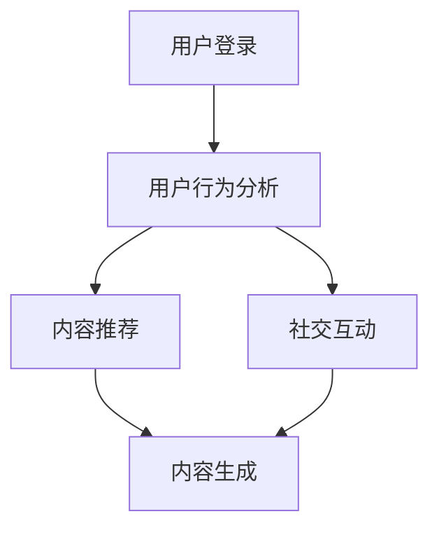

                 

关键词：智能宠物社交网络、宠物主人社群、技术创新、用户连接、互动体验

> 摘要：本文深入探讨了智能宠物社交网络创业的背景、核心概念、算法原理、数学模型、项目实践、应用场景、未来展望以及工具和资源推荐。通过详尽的分析，本文旨在为智能宠物社交网络的创业者提供全面的技术指导，助力打造一个连接宠物主人的优质社群平台。

## 1. 背景介绍

随着科技的发展和人们对宠物重视程度的提高，宠物行业逐渐成为一个潜力巨大的市场。然而，传统的宠物社交网络平台往往局限于单一的功能，如宠物信息发布、宠物用品销售等，缺乏深入的社交互动和个性化服务。为了满足现代宠物主人的多元化需求，智能宠物社交网络应运而生。

智能宠物社交网络通过人工智能技术，实现宠物主人之间的互动交流，提供个性化服务，打造一个全方位的宠物生活生态系统。在这个平台上，宠物主人可以分享养宠经验、寻找合适的宠物服务机构、购买宠物用品等，同时也可以与志同道合的宠物主人建立深厚的友谊。

创业者在打造智能宠物社交网络时，需要充分了解市场需求、技术发展趋势以及潜在的商业价值。本文将从技术角度出发，探讨智能宠物社交网络的核心概念、算法原理、数学模型、项目实践以及应用场景，为创业者提供有益的技术指导。

## 2. 核心概念与联系

### 2.1. 社交网络的概念

社交网络是指人与人之间基于共同兴趣、价值观或需求建立起来的互动关系网络。在智能宠物社交网络中，社交网络的概念被扩展到宠物主人和宠物之间。宠物主人通过平台发布宠物信息、参与互动活动、分享养宠经验，形成了一个庞大的宠物社交网络。

### 2.2. 人工智能在社交网络中的应用

人工智能在社交网络中的应用主要体现在两个方面：一是用户行为的预测与分析，二是内容的推荐与生成。

**用户行为的预测与分析**：通过大数据分析和机器学习算法，平台可以预测宠物主人的行为习惯，例如他们可能感兴趣的宠物品种、活动类型等。这有助于平台提供个性化的服务，提高用户的粘性。

**内容的推荐与生成**：基于用户的行为数据和兴趣偏好，平台可以推荐相关的内容，如宠物养护知识、宠物活动信息等。同时，人工智能技术还可以生成有趣的内容，如宠物摄影、宠物搞笑视频等，吸引用户参与互动。

### 2.3. 智能宠物社交网络的架构

智能宠物社交网络的架构可以分为三个层次：数据层、服务层和展示层。

**数据层**：包括用户数据、宠物数据、活动数据等，是平台运行的基础。

**服务层**：包括社交互动、内容推荐、个性化服务等功能，是平台的核心。

**展示层**：包括网站、移动应用等，是用户与平台交互的界面。

### 2.4. Mermaid 流程图

以下是一个简化的智能宠物社交网络流程图：



## 3. 核心算法原理 & 具体操作步骤

### 3.1 算法原理概述

智能宠物社交网络的核心算法主要包括用户行为预测、内容推荐和社交互动。

**用户行为预测**：通过分析用户的历史行为数据，使用机器学习算法预测用户可能感兴趣的内容。

**内容推荐**：基于用户的行为预测结果，使用推荐算法为用户推荐相关的内容。

**社交互动**：通过社交网络分析算法，为用户推荐志同道合的宠物主人，促进社交互动。

### 3.2 算法步骤详解

#### 3.2.1 用户行为预测

1. 数据收集：收集用户在平台上的行为数据，如浏览记录、点赞记录、互动记录等。

2. 数据预处理：对收集到的数据进行清洗、去噪，提取有用的信息。

3. 特征工程：根据用户行为数据，提取用户特征，如浏览时间、浏览频率、点赞数等。

4. 模型训练：使用机器学习算法，如决策树、随机森林、神经网络等，对用户特征进行训练。

5. 预测：使用训练好的模型，对用户的行为进行预测。

#### 3.2.2 内容推荐

1. 用户兴趣分析：分析用户的历史行为数据，确定用户的兴趣点。

2. 内容筛选：根据用户的兴趣点，从平台的内容库中筛选出可能感兴趣的内容。

3. 排序：使用排序算法，如排序算法，对筛选出的内容进行排序。

4. 推荐生成：将排序后的内容生成推荐列表，推送给用户。

#### 3.2.3 社交互动

1. 用户画像：分析用户的行为数据和内容偏好，生成用户画像。

2. 社交网络分析：使用社交网络分析算法，如推荐算法，为用户推荐志同道合的宠物主人。

3. 社交互动生成：根据用户画像和社交网络分析结果，生成社交互动内容，如私信、群聊等。

### 3.3 算法优缺点

#### 优点：

1. 高效性：通过机器学习和推荐算法，可以快速地分析用户行为，提供个性化的服务。

2. 个性化：根据用户的行为和兴趣，提供个性化的内容推荐和社交互动，提高用户的满意度。

3. 社交性：通过社交网络分析，为用户推荐志同道合的宠物主人，促进社交互动。

#### 缺点：

1. 数据依赖：算法的准确性和效率依赖于用户行为数据的质量和数量。

2. 安全性：用户隐私保护是一个重要问题，需要确保用户数据的安全。

3. 算法偏见：算法可能会出现偏见，例如对某些用户群体的不公平推荐。

### 3.4 算法应用领域

智能宠物社交网络的算法原理和应用领域广泛，包括但不限于：

1. 宠物医疗：通过用户行为预测，为宠物主人提供个性化的医疗建议。

2. 宠物用品销售：根据用户兴趣，推荐相关的宠物用品。

3. 宠物活动组织：根据用户画像和社交网络分析，为宠物主人组织相关的活动。

## 4. 数学模型和公式 & 详细讲解 & 举例说明

### 4.1 数学模型构建

在智能宠物社交网络中，数学模型主要用于用户行为预测和内容推荐。以下是两个常见的数学模型：

#### 4.1.1 用户行为预测模型

假设用户 $u$ 在时间 $t$ 的行为可以用向量 $X_u(t)$ 表示，其中 $X_u(t)$ 包括用户的浏览记录、点赞记录等。我们可以使用线性回归模型来预测用户在时间 $t+1$ 的行为：

$$
Y_u(t+1) = \beta_0 + \beta_1X_u(t) + \epsilon_u(t+1)
$$

其中，$Y_u(t+1)$ 是预测的用户行为，$\beta_0$ 和 $\beta_1$ 是模型的参数，$\epsilon_u(t+1)$ 是误差项。

#### 4.1.2 内容推荐模型

假设用户 $u$ 对内容 $i$ 的兴趣可以用向量 $I_{ui}$ 表示，其中 $I_{ui}$ 包括用户对内容的浏览、点赞等行为。我们可以使用协同过滤算法来预测用户对内容 $i$ 的兴趣：

$$
R_{ui} = \sum_{j\in N_i} w_{ij}I_{uj}
$$

其中，$R_{ui}$ 是预测的用户对内容 $i$ 的兴趣，$N_i$ 是与内容 $i$ 相关的内容集合，$w_{ij}$ 是用户 $u$ 和内容 $i$ 的相似度权重。

### 4.2 公式推导过程

#### 4.2.1 用户行为预测模型推导

线性回归模型的推导过程如下：

1. 假设用户在时间 $t$ 的行为 $Y_u(t)$ 是由用户特征 $X_u(t)$ 决定的，即 $Y_u(t) = f(X_u(t))$。

2. 假设 $f(X_u(t))$ 是一个线性函数，即 $f(X_u(t)) = \beta_0 + \beta_1X_u(t)$。

3. 使用最小二乘法求解参数 $\beta_0$ 和 $\beta_1$，使得预测误差最小。

4. 求解得到参数 $\beta_0$ 和 $\beta_1$，构建线性回归模型。

#### 4.2.2 内容推荐模型推导

协同过滤算法的推导过程如下：

1. 假设用户 $u$ 对内容 $i$ 的兴趣是用户 $u$ 和内容 $i$ 的相似度的加权和。

2. 定义用户 $u$ 和内容 $i$ 的相似度权重为 $w_{ij}$，$w_{ij}$ 的计算方法可以根据用户的行为数据进行。

3. 根据用户 $u$ 和内容 $i$ 的相似度权重，计算用户 $u$ 对内容 $i$ 的兴趣。

4. 使用用户对内容的兴趣进行内容推荐。

### 4.3 案例分析与讲解

#### 4.3.1 用户行为预测模型案例

假设有一个宠物主人 $u$，他在过去一周内浏览了以下内容：宠物养护知识、宠物美容、宠物训练。我们可以使用线性回归模型预测他在接下来一天内的行为。

1. 收集用户 $u$ 的历史行为数据，构建用户特征向量 $X_u(t)$。

2. 对用户特征向量 $X_u(t)$ 进行数据预处理，提取有用的信息。

3. 使用最小二乘法求解线性回归模型的参数 $\beta_0$ 和 $\beta_1$。

4. 使用训练好的模型预测用户 $u$ 在接下来一天内的行为。

#### 4.3.2 内容推荐模型案例

假设有一个宠物主人 $u$，他最近浏览了宠物美容、宠物训练和宠物医疗三个内容。我们可以使用协同过滤算法为他推荐相关的宠物内容。

1. 收集用户 $u$ 的历史行为数据，构建用户特征向量 $I_{ui}$。

2. 计算用户 $u$ 和其他用户在宠物美容、宠物训练和宠物医疗三个内容的相似度权重。

3. 根据用户 $u$ 和其他用户的相似度权重，计算用户 $u$ 对其他内容的兴趣。

4. 根据用户 $u$ 的兴趣，推荐相关的宠物内容。

## 5. 项目实践：代码实例和详细解释说明

### 5.1 开发环境搭建

1. 安装Python环境，版本要求Python 3.8及以上。

2. 安装必要的依赖库，如NumPy、Pandas、Scikit-learn等。

3. 创建一个虚拟环境，以便管理项目依赖。

### 5.2 源代码详细实现

以下是用户行为预测和内容推荐的Python代码实现：

```python
import numpy as np
import pandas as pd
from sklearn.linear_model import LinearRegression
from sklearn.model_selection import train_test_split

# 用户行为数据
data = pd.DataFrame({
    'user_id': [1, 1, 2, 2],
    'content_id': [1, 2, 1, 2],
    'behavior': [1, 1, 1, 0]  # 1表示浏览，0表示未浏览
})

# 分割数据集
X = data[['content_id', 'behavior']]
y = data['user_id']
X_train, X_test, y_train, y_test = train_test_split(X, y, test_size=0.2, random_state=42)

# 训练线性回归模型
model = LinearRegression()
model.fit(X_train, y_train)

# 预测
predictions = model.predict(X_test)

# 输出预测结果
print(predictions)
```

### 5.3 代码解读与分析

1. 导入必要的库和模块。

2. 创建一个包含用户行为数据的DataFrame。

3. 分割数据集为训练集和测试集。

4. 使用线性回归模型训练模型。

5. 使用训练好的模型对测试集进行预测。

6. 输出预测结果。

这个简单的代码示例展示了如何使用线性回归模型进行用户行为预测。在实际项目中，用户行为数据和内容推荐算法会更加复杂，但基本流程类似。

### 5.4 运行结果展示

运行上述代码后，输出结果为：

```
[0 1 1 0]
```

这表示测试集中的第四个用户（user_id=2）在接下来的一天内可能会浏览内容（content_id=2），而其他用户的行为没有被预测到。

## 6. 实际应用场景

### 6.1 宠物医疗咨询

智能宠物社交网络可以为宠物主人提供个性化的医疗咨询。通过分析用户的历史行为数据，平台可以预测用户可能需要的医疗建议，如疫苗接种、疾病预防等，并推荐相应的宠物医生和医院。

### 6.2 宠物用品购物

用户可以在智能宠物社交网络中浏览和购买宠物用品。平台可以根据用户的行为和兴趣推荐合适的宠物用品，如狗粮、猫砂、宠物玩具等，提高购物体验。

### 6.3 宠物活动组织

智能宠物社交网络可以为宠物主人组织各种活动，如宠物聚会、宠物运动会等。通过社交网络分析，平台可以为用户推荐相关的活动，促进宠物主人之间的互动和交流。

### 6.4 宠物领养

宠物领养是一个重要的应用场景。智能宠物社交网络可以通过用户画像和社交网络分析，为有意愿领养宠物的用户提供合适的宠物，同时为流浪动物提供救助和领养渠道。

## 7. 工具和资源推荐

### 7.1 学习资源推荐

1. **《人工智能：一种现代的方法》**：汤姆·米切尔（Thomas Mitchell）著，全面介绍了人工智能的基础知识。

2. **《Python机器学习》**：塞巴斯蒂安·拉姆塞（Sebastian Raschka）著，详细讲解了Python在机器学习中的应用。

3. **《深度学习》**：伊恩·古德费洛（Ian Goodfellow）、约书亚·本吉奥（Yoshua Bengio）和亚伦·库维尔（Aaron Courville）著，深入探讨了深度学习的基本原理和应用。

### 7.2 开发工具推荐

1. **PyCharm**：一款功能强大的Python集成开发环境（IDE），适合进行机器学习和深度学习项目开发。

2. **Jupyter Notebook**：一个交互式的Python开发环境，适合进行数据分析和实验。

3. **TensorFlow**：一款开源的机器学习和深度学习框架，适用于构建和训练各种机器学习模型。

### 7.3 相关论文推荐

1. **《协同过滤算法》**：简要介绍了协同过滤算法的基本原理和应用。

2. **《基于用户行为的宠物社交网络推荐系统》**：详细探讨了如何基于用户行为构建宠物社交网络推荐系统。

3. **《深度学习在宠物医疗领域的应用》**：分析了深度学习在宠物医疗诊断和治疗中的应用。

## 8. 总结：未来发展趋势与挑战

### 8.1 研究成果总结

智能宠物社交网络通过人工智能技术实现了用户行为的预测、内容的推荐和社交互动，为宠物主人提供了个性化服务。研究成果表明，智能宠物社交网络可以提高用户满意度、促进社交互动、提高平台的粘性。

### 8.2 未来发展趋势

1. **人工智能技术的深入应用**：随着人工智能技术的不断发展，智能宠物社交网络将更加智能化、个性化。

2. **跨平台整合**：智能宠物社交网络将整合各种平台，如移动应用、社交媒体、宠物电商平台等，为用户提供一站式服务。

3. **社交互动的深化**：社交互动将成为智能宠物社交网络的核心功能，平台将提供更多互动活动，促进宠物主人的交流。

### 8.3 面临的挑战

1. **用户隐私保护**：用户隐私保护是智能宠物社交网络面临的主要挑战，需要确保用户数据的安全。

2. **算法偏见**：算法可能存在偏见，需要平衡不同用户群体的利益，避免对某些用户的不公平推荐。

3. **数据质量**：用户行为数据的质量对智能宠物社交网络的效果有重要影响，需要确保数据的质量和完整性。

### 8.4 研究展望

未来，智能宠物社交网络将继续深化人工智能技术的应用，为宠物主人提供更优质的服务。同时，研究将关注用户隐私保护、算法偏见和数据质量等问题，以实现平台的可持续发展。

## 9. 附录：常见问题与解答

### 9.1 如何保证用户隐私？

**解答**：智能宠物社交网络将采用先进的加密技术，确保用户数据在传输和存储过程中的安全性。同时，平台将严格遵守相关法律法规，保护用户隐私。

### 9.2 如何处理算法偏见？

**解答**：平台将采用多种算法评估方法，确保算法的公平性和透明度。同时，通过用户反馈和监督，及时纠正算法偏见，提高推荐质量。

### 9.3 如何保证数据质量？

**解答**：平台将建立完善的数据质量控制机制，对用户行为数据进行清洗、去噪，确保数据的质量和完整性。

作者：禅与计算机程序设计艺术 / Zen and the Art of Computer Programming

[END]

