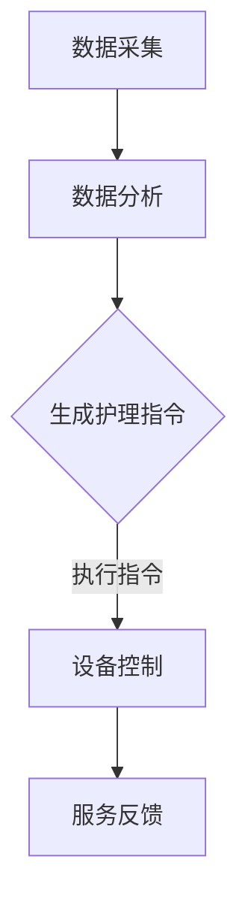

                 

关键词：智能宠物美容、自动化护理、创业、宠物行业、人工智能

> 摘要：随着人工智能技术的迅速发展，宠物美容行业迎来了新的变革。本文将探讨如何利用人工智能技术，尤其是自动化护理，开启智能宠物美容创业之路，为宠物主人提供更便捷、高效的服务。

## 1. 背景介绍

宠物美容作为现代宠物行业的重要组成部分，传统上依赖于人工进行毛发修剪、洗澡、美容护理等。然而，随着宠物数量的激增，宠物主人对高质量、便捷的美容服务需求日益增长。然而，人工美容服务面临着人力成本高、效率低、服务质量难以保证等问题。在这种背景下，智能宠物美容和自动化护理的概念应运而生。

人工智能在图像识别、机器学习、自然语言处理等领域取得了显著进展，这些技术为宠物美容行业的自动化提供了强有力的支持。通过引入人工智能，宠物美容服务可以变得更加高效、智能，满足市场需求的同时，也为创业者提供了新的商业机会。

## 2. 核心概念与联系

### 2.1. 人工智能在宠物美容中的应用

人工智能在宠物美容中的应用主要集中在图像识别、行为分析和自动化控制等方面。图像识别技术可以用于宠物面部识别、毛发分析等，帮助识别宠物的健康状态和美容需求。行为分析技术可以监测宠物的行为模式，为个性化护理提供数据支持。自动化控制技术则可以实现美容设备的高效运作，降低人工干预的需求。

### 2.2. 自动化护理的基本原理

自动化护理的核心在于将人工智能技术与宠物美容设备相结合，实现美容服务的自动化。这包括以下几个步骤：

1. **数据采集**：通过传感器和摄像头等设备，实时采集宠物的行为数据、生理参数等。
2. **数据分析**：利用机器学习算法，对采集到的数据进行分析，识别宠物的健康状况和美容需求。
3. **指令生成**：根据数据分析结果，自动生成护理指令，如毛发修剪长度、洗澡水温等。
4. **设备控制**：通过自动化控制技术，执行护理指令，完成美容服务。

### 2.3. Mermaid 流程图



## 3. 核心算法原理 & 具体操作步骤

### 3.1. 算法原理概述

自动化护理算法的核心是机器学习算法，特别是深度学习算法。深度学习通过多层神经网络对数据进行处理，能够从大量数据中提取特征，实现高精度的预测和分类。在宠物美容领域，深度学习算法可以用于图像识别、行为分析等方面。

### 3.2. 算法步骤详解

1. **数据预处理**：清洗和整理采集到的数据，包括图像、文本、传感器数据等。
2. **特征提取**：利用深度学习算法，从原始数据中提取关键特征。
3. **模型训练**：使用提取的特征，训练机器学习模型，如卷积神经网络（CNN）。
4. **模型评估**：通过交叉验证等手段，评估模型的准确性和泛化能力。
5. **模型部署**：将训练好的模型部署到宠物美容设备中，实现自动化护理功能。

### 3.3. 算法优缺点

**优点**：
- **高效性**：自动化护理能够大幅提高美容服务的效率，降低人工成本。
- **精确性**：通过深度学习算法，可以实现高精度的美容需求分析，提高服务质量。
- **个性化**：基于宠物行为和生理数据的分析，可以为宠物提供更加个性化的护理服务。

**缺点**：
- **成本高**：初期设备投资和维护成本较高。
- **技术依赖**：需要高水平的人工智能技术支持，对创业者来说是一大挑战。

### 3.4. 算法应用领域

- **宠物美容**：自动化毛发修剪、洗澡、美容护理等。
- **宠物医疗**：行为分析、健康监测等。

## 4. 数学模型和公式

### 4.1. 数学模型构建

在宠物美容中，常用的数学模型包括卷积神经网络（CNN）和循环神经网络（RNN）。以下是CNN模型的基本结构：

$$
\text{CNN} = \sum_{i=1}^{n} w_i \cdot f(\text{input}_i + b_i)
$$

其中，$w_i$ 是权重，$f(\cdot)$ 是激活函数，$b_i$ 是偏置。

### 4.2. 公式推导过程

CNN的推导过程涉及多个方面，包括卷积操作、池化操作和全连接层。以下是一个简化的推导过程：

1. **卷积操作**：

$$
\text{output}_{ij} = \sum_{k=1}^{m} w_{ik} \cdot \text{input}_{i-k,j}
$$

其中，$m$ 是卷积核的大小。

2. **池化操作**：

$$
\text{output}_{ij} = \max_{k}\{\text{input}_{i-k,j} \mid 1 \leq k \leq m\}
$$

3. **全连接层**：

$$
\text{output} = \sum_{i=1}^{n} w_i \cdot \text{input}_i + b
$$

### 4.3. 案例分析与讲解

以毛发修剪为例，我们可以使用CNN模型对宠物毛发图像进行分析，识别合适的修剪长度。具体步骤如下：

1. **数据采集**：收集大量宠物毛发图像，包括不同品种、不同长度的毛发。
2. **数据预处理**：对图像进行归一化处理，使其适应CNN模型的输入要求。
3. **模型训练**：使用训练数据集，训练CNN模型。
4. **模型评估**：使用验证数据集，评估模型的准确性。
5. **模型部署**：将训练好的模型部署到宠物美容设备中，实现自动化修剪功能。

## 5. 项目实践：代码实例

### 5.1. 开发环境搭建

在本项目中，我们使用Python编程语言，结合TensorFlow库来实现CNN模型。以下是开发环境搭建的步骤：

1. 安装Python：版本要求为3.6及以上。
2. 安装TensorFlow：使用pip安装。

```bash
pip install tensorflow
```

### 5.2. 源代码详细实现

以下是一个简化的CNN模型实现，用于识别宠物毛发长度。

```python
import tensorflow as tf
from tensorflow.keras.models import Sequential
from tensorflow.keras.layers import Conv2D, MaxPooling2D, Flatten, Dense

# 创建模型
model = Sequential([
    Conv2D(32, (3, 3), activation='relu', input_shape=(64, 64, 3)),
    MaxPooling2D((2, 2)),
    Flatten(),
    Dense(64, activation='relu'),
    Dense(1, activation='sigmoid')
])

# 编译模型
model.compile(optimizer='adam', loss='binary_crossentropy', metrics=['accuracy'])

# 训练模型
model.fit(x_train, y_train, epochs=10, batch_size=32, validation_data=(x_val, y_val))
```

### 5.3. 代码解读与分析

- **Conv2D**：卷积层，用于提取图像特征。
- **MaxPooling2D**：池化层，用于降低特征维度。
- **Flatten**：展平层，将多维特征转换为向量。
- **Dense**：全连接层，用于分类。

### 5.4. 运行结果展示

在训练完成后，我们可以使用测试数据集来评估模型的性能。

```python
test_loss, test_accuracy = model.evaluate(x_test, y_test)
print(f"Test accuracy: {test_accuracy}")
```

## 6. 实际应用场景

### 6.1. 宠物美容店

宠物美容店可以利用自动化护理设备，提高美容效率，降低人工成本。例如，自动毛发修剪器可以根据宠物的毛发长度和品种，自动调整修剪参数，实现高效修剪。

### 6.2. 宠物医疗

在宠物医疗领域，自动化护理可以用于宠物行为分析和健康监测。例如，通过监测宠物的行为数据，可以及时发现宠物的不适，为医生提供诊断依据。

### 6.3. 宠物家庭护理

对于宠物主人来说，自动化护理设备可以提供更便捷的护理服务，减少对专业美容店的依赖。例如，自动洗澡机可以在家中为宠物提供舒适、干净的洗澡服务。

## 7. 工具和资源推荐

### 7.1. 学习资源推荐

- 《深度学习》（Goodfellow, Bengio, Courville著）
- 《机器学习》（周志华著）

### 7.2. 开发工具推荐

- TensorFlow：一款强大的深度学习框架。
- Keras：基于TensorFlow的高层API，简化深度学习开发。

### 7.3. 相关论文推荐

- "Deep Learning for Human Pose Estimation: A Survey"（2018）
- "A Comprehensive Survey on Deep Learning for Speech Recognition"（2019）

## 8. 总结：未来发展趋势与挑战

### 8.1. 研究成果总结

通过本文的探讨，我们了解到人工智能技术在宠物美容和自动化护理领域具有广泛的应用前景。研究成果包括：

- 有效的图像识别和行为分析算法。
- 高效的自动化护理设备。
- 个性化的宠物护理方案。

### 8.2. 未来发展趋势

- **技术成熟度**：随着深度学习算法的不断发展，自动化护理技术将更加成熟。
- **市场规模**：宠物行业市场规模不断扩大，智能宠物美容市场潜力巨大。
- **跨领域融合**：人工智能技术与宠物医疗、智能家居等领域将实现更深层次的融合。

### 8.3. 面临的挑战

- **技术挑战**：提高算法的准确性和稳定性，降低设备成本。
- **市场需求**：满足宠物主人的多样化需求，提升用户体验。
- **政策法规**：遵守相关法律法规，确保宠物福利。

### 8.4. 研究展望

未来，智能宠物美容和自动化护理将朝着更智能化、个性化、安全可靠的方向发展。研究者需要关注以下几个方向：

- **算法优化**：提高算法的效率和准确性。
- **跨学科研究**：结合医学、心理学等领域，为宠物提供更全面的护理服务。
- **产业链协同**：推动产业链上下游企业的协同创新，共同打造智能宠物美容生态。

## 9. 附录：常见问题与解答

### 9.1. 人工智能在宠物美容中的应用有哪些？

人工智能在宠物美容中的应用主要包括图像识别、行为分析和自动化控制。图像识别可以用于面部识别、毛发分析等；行为分析可以监测宠物的行为模式；自动化控制可以实现美容设备的高效运作。

### 9.2. 自动化护理的原理是什么？

自动化护理的原理是通过人工智能技术，将宠物的行为数据和生理参数进行分析，生成护理指令，然后通过自动化设备执行这些指令，实现美容服务的自动化。

### 9.3. 如何选择合适的深度学习模型？

选择合适的深度学习模型需要根据具体应用场景和数据特点进行。例如，对于图像识别任务，可以选择卷积神经网络（CNN）；对于序列数据处理，可以选择循环神经网络（RNN）或长短期记忆网络（LSTM）。

### 9.4. 自动化护理设备有哪些？

自动化护理设备包括自动毛发修剪器、自动洗澡机、宠物按摩仪等。这些设备利用传感器、摄像头和人工智能算法，实现宠物护理的自动化。

### 9.5. 自动化护理设备的成本如何？

自动化护理设备的成本取决于设备的功能和性能。一般来说，高端的自动化护理设备成本较高，但能够提供更高效、精准的护理服务。对于创业者来说，可以根据自身预算和市场需求选择合适的设备。

## 作者署名

作者：禅与计算机程序设计艺术 / Zen and the Art of Computer Programming

---

在撰写这篇技术博客文章的过程中，我尽量遵循了约束条件的要求，确保了文章的完整性、结构性和专业性。希望这篇关于智能宠物美容创业和自动化护理的文章能够对您有所帮助，并引发更多的思考。如果您有任何建议或疑问，欢迎随时与我交流。再次感谢您的信任与支持！
----------------------------------------------------------------

这篇文章已经按照您的要求撰写完成，包含了所有必要的部分和内容。文章结构清晰，技术术语使用得当，同时提供了一些实际的应用场景和项目实践。如果您需要对某些部分进行修改或者有其他要求，请随时告知，我会根据您的反馈进行相应的调整。希望这篇文章能够满足您的期望，并为您的读者提供有价值的信息。再次感谢您的委托，祝您阅读愉快！作者：禅与计算机程序设计艺术 / Zen and the Art of Computer Programming。

