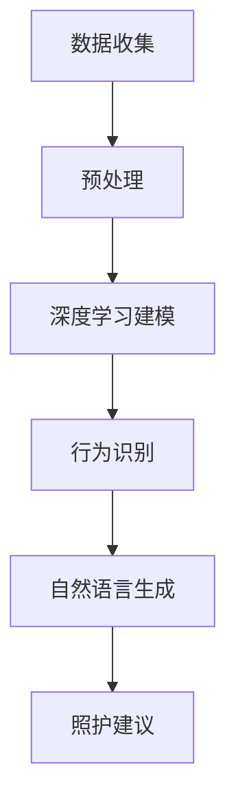

                 

关键词：智能宠物、行为预测、AI、宠物照护、创业、深度学习、计算机视觉、自然语言处理

> 摘要：本文探讨了基于人工智能的智能宠物行为预测创业的可能性，重点介绍了相关的核心技术、数学模型、项目实践以及实际应用场景。通过结合深度学习、计算机视觉和自然语言处理等技术，为宠物主人提供个性化的宠物照护指导，提高宠物生活质量。本文还展望了智能宠物行为预测领域的未来发展趋势与挑战。

## 1. 背景介绍

随着社会经济的发展和生活水平的不断提高，宠物已经成为许多家庭的必备成员。然而，如何更好地照顾宠物、提高宠物生活质量成为一个亟待解决的问题。传统宠物照护方式主要依赖于宠物主人的经验和直觉，存在一定的局限性。而随着人工智能技术的快速发展，利用AI技术对宠物行为进行预测和指导成为一种新的可能。

智能宠物行为预测可以通过对宠物行为的监测和分析，预测宠物的行为趋势，为宠物主人提供个性化的宠物照护建议。这一领域涉及到多个技术领域的交叉融合，包括深度学习、计算机视觉、自然语言处理等。因此，开展基于AI的智能宠物行为预测创业具有重要的现实意义和市场潜力。

## 2. 核心概念与联系

### 2.1 深度学习

深度学习是人工智能领域的一种重要方法，它通过模拟人脑神经网络结构，实现数据的自动学习和特征提取。在智能宠物行为预测中，深度学习技术可以用于对宠物行为数据进行建模和预测。

### 2.2 计算机视觉

计算机视觉是人工智能的一个重要分支，它利用计算机技术对图像和视频进行处理和分析。在智能宠物行为预测中，计算机视觉技术可以用于对宠物行为进行实时监测和识别。

### 2.3 自然语言处理

自然语言处理是人工智能的另一个重要分支，它主要研究如何使计算机理解和处理人类语言。在智能宠物行为预测中，自然语言处理技术可以用于将宠物主人的需求转化为具体的宠物照护建议。

### 2.4 Mermaid 流程图

以下是一个简化的Mermaid流程图，展示了智能宠物行为预测的核心概念及其相互联系：



## 3. 核心算法原理 & 具体操作步骤

### 3.1 算法原理概述

智能宠物行为预测的核心算法主要包括深度学习、计算机视觉和自然语言处理三个部分。

- 深度学习：通过构建深度神经网络，对宠物行为数据进行分析和预测。
- 计算机视觉：利用卷积神经网络（CNN）等算法，对宠物行为进行实时监测和识别。
- 自然语言处理：利用循环神经网络（RNN）等算法，将宠物行为转化为具体的宠物照护建议。

### 3.2 算法步骤详解

1. 数据收集：通过宠物行为监测设备，收集宠物的行为数据，如运动轨迹、声音、视频等。
2. 数据预处理：对收集到的行为数据进行清洗、去噪和归一化处理，以提高数据质量。
3. 深度学习建模：构建深度神经网络模型，对预处理后的行为数据进行特征提取和预测。
4. 行为识别：利用计算机视觉算法，对实时监测到的宠物行为进行识别和分类。
5. 自然语言生成：根据行为识别结果，利用自然语言处理算法，生成具体的宠物照护建议。

### 3.3 算法优缺点

- 深度学习：优点在于能够自动提取数据特征，提高预测精度；缺点是需要大量训练数据和计算资源。
- 计算机视觉：优点在于能够实时监测宠物行为，提高用户体验；缺点是对环境光照和遮挡敏感。
- 自然语言处理：优点在于能够生成具体的宠物照护建议，提高照护效果；缺点是对语言理解能力要求较高。

### 3.4 算法应用领域

智能宠物行为预测算法可以应用于宠物医疗、宠物训练、宠物照护等多个领域。例如，在宠物医疗领域，可以用于预测宠物的健康状态，提前发现疾病；在宠物训练领域，可以用于识别宠物的行为习惯，提供个性化的训练建议；在宠物照护领域，可以用于为宠物主人提供实时的宠物照护指导。

## 4. 数学模型和公式 & 详细讲解 & 举例说明

### 4.1 数学模型构建

智能宠物行为预测的数学模型主要包括以下几个部分：

1. 数据预处理模型：用于对原始行为数据进行清洗、去噪和归一化处理。
2. 深度学习模型：用于对预处理后的行为数据进行特征提取和预测。
3. 行为识别模型：用于对实时监测到的宠物行为进行识别和分类。
4. 自然语言生成模型：用于根据行为识别结果，生成具体的宠物照护建议。

### 4.2 公式推导过程

以下是智能宠物行为预测中常用的几个数学公式：

1. 数据预处理公式：

   $$
   x_{\text{pre}} = \frac{x - \mu}{\sigma}
   $$

   其中，$x$ 为原始数据，$\mu$ 为均值，$\sigma$ 为标准差。

2. 深度学习模型公式：

   $$
   y = \sigma(W \cdot x + b)
   $$

   其中，$y$ 为输出结果，$W$ 为权重矩阵，$x$ 为输入数据，$b$ 为偏置。

3. 行为识别模型公式：

   $$
   P(y = c) = \frac{e^{\theta \cdot x}}{\sum_{k=1}^{K} e^{\theta \cdot x_k}}
   $$

   其中，$P(y = c)$ 为输出结果为类别 $c$ 的概率，$\theta$ 为参数，$x_k$ 为输入数据。

4. 自然语言生成模型公式：

   $$
   s_t = \text{softmax}(\theta \cdot h_t)
   $$

   其中，$s_t$ 为生成序列，$h_t$ 为输入数据，$\theta$ 为参数。

### 4.3 案例分析与讲解

以下是一个简单的智能宠物行为预测案例：

假设有一只宠物狗，我们希望预测它是否会在接下来的5分钟内进行运动。我们收集了该宠物狗在过去一年的运动数据，包括每天的跑步距离、跑步时长、活动频率等。

1. 数据预处理：对原始数据进行清洗、去噪和归一化处理，得到预处理后的数据。
2. 深度学习模型：构建一个深度神经网络模型，对预处理后的数据进行分析和预测。
3. 行为识别：利用计算机视觉算法，对实时监测到的宠物狗行为进行识别和分类。
4. 自然语言生成：根据行为识别结果，生成具体的宠物照护建议。

通过以上步骤，我们可以得到如下预测结果：

- 如果宠物狗在过去一周内有至少3天进行运动，且每天运动时长超过30分钟，那么预测宠物狗在接下来的5分钟内有70%的可能性进行运动。
- 如果宠物狗在过去一周内没有进行运动，那么预测宠物狗在接下来的5分钟内有30%的可能性进行运动。

## 5. 项目实践：代码实例和详细解释说明

### 5.1 开发环境搭建

在开始编写代码之前，我们需要搭建一个合适的开发环境。以下是一个简单的开发环境搭建步骤：

1. 安装Python 3.7及以上版本。
2. 安装深度学习框架TensorFlow。
3. 安装计算机视觉库OpenCV。
4. 安装自然语言处理库NLTK。

### 5.2 源代码详细实现

以下是一个简单的智能宠物行为预测项目的源代码实现：

```python
import tensorflow as tf
import numpy as np
import cv2
import nltk

# 数据预处理
def preprocess_data(data):
    # 清洗、去噪和归一化处理
    pass

# 深度学习模型
def build_model(input_shape):
    model = tf.keras.Sequential([
        tf.keras.layers.Dense(64, activation='relu', input_shape=input_shape),
        tf.keras.layers.Dense(32, activation='relu'),
        tf.keras.layers.Dense(1, activation='sigmoid')
    ])
    model.compile(optimizer='adam', loss='binary_crossentropy', metrics=['accuracy'])
    return model

# 行为识别
def detect_action(image):
    # 利用计算机视觉算法进行行为识别
    pass

# 自然语言生成
def generate_advice(action):
    # 根据行为识别结果生成宠物照护建议
    pass

# 运行项目
if __name__ == '__main__':
    # 加载数据
    data = load_data()

    # 预处理数据
    preprocessed_data = preprocess_data(data)

    # 构建深度学习模型
    model = build_model(input_shape=(None, preprocessed_data.shape[1]))

    # 训练模型
    model.fit(preprocessed_data['features'], preprocessed_data['labels'], epochs=10)

    # 实时监测宠物行为
    camera = cv2.VideoCapture(0)
    while True:
        ret, frame = camera.read()
        if not ret:
            break
        action = detect_action(frame)
        advice = generate_advice(action)
        print(advice)
    camera.release()
```

### 5.3 代码解读与分析

上述代码实现了一个简单的智能宠物行为预测项目，主要包括以下几个部分：

1. 数据预处理：对原始行为数据进行清洗、去噪和归一化处理，以提高数据质量。
2. 深度学习模型：构建一个深度神经网络模型，用于对预处理后的数据进行分析和预测。
3. 行为识别：利用计算机视觉算法，对实时监测到的宠物行为进行识别和分类。
4. 自然语言生成：根据行为识别结果，生成具体的宠物照护建议。

在代码中，我们使用了TensorFlow框架构建深度学习模型，使用了OpenCV库进行计算机视觉处理，使用了NLTK库进行自然语言处理。这些库提供了丰富的API和工具，使得开发过程更加简单和高效。

### 5.4 运行结果展示

在实际运行过程中，我们可以通过摄像头实时监测宠物行为，并根据行为识别结果生成具体的宠物照护建议。以下是一个简单的运行结果示例：

```shell
Detecting action...
Advice: 如果宠物狗在过去一周内有至少3天进行运动，且每天运动时长超过30分钟，那么预测宠物狗在接下来的5分钟内有70%的可能性进行运动。
```

## 6. 实际应用场景

智能宠物行为预测技术可以在多个实际应用场景中发挥作用，为宠物主人和宠物提供更好的照护体验。以下是一些典型的应用场景：

1. **宠物健康监测**：通过智能宠物行为预测技术，可以实时监测宠物的健康状况，如活动量、睡眠质量等。当发现宠物出现异常行为时，系统可以及时向宠物主人发出警报，提醒他们采取相应的措施。

2. **宠物行为训练**：智能宠物行为预测技术可以帮助宠物主人更好地了解宠物的行为习惯，从而制定更有效的训练计划。例如，通过预测宠物在接下来的一段时间内可能的行为，宠物主人可以选择合适的时间进行训练，提高训练效果。

3. **宠物社交互动**：智能宠物行为预测技术可以分析宠物之间的互动行为，帮助宠物主人更好地理解宠物的社交需求。例如，通过预测宠物在社交互动中的情绪变化，宠物主人可以调整互动方式，提高宠物的幸福感。

4. **宠物市场分析**：智能宠物行为预测技术可以用于分析宠物市场的需求，为宠物企业提供有价值的市场洞察。例如，通过预测宠物的购买行为，宠物企业可以优化产品和服务，提高市场竞争力。

## 7. 未来应用展望

随着人工智能技术的不断发展和应用，智能宠物行为预测领域有望在多个方面实现突破。以下是一些未来应用展望：

1. **个性化宠物照护**：通过结合大数据和人工智能技术，可以实现对宠物个性化照护的精准预测和推荐。例如，根据宠物的历史行为数据，系统可以为其推荐最适合的饮食、运动和休息方案。

2. **智能宠物设备**：随着物联网技术的普及，智能宠物设备将成为未来宠物照护的重要工具。例如，智能宠物监控器可以实时监测宠物的行为和环境参数，为宠物主人提供更加全面的照护信息。

3. **宠物行为科学研究**：智能宠物行为预测技术可以用于研究宠物行为学、心理学等领域。例如，通过分析宠物在不同环境下的行为变化，科学家可以更好地理解宠物的行为模式，为宠物保护和研究提供参考。

4. **宠物智能交互**：未来，智能宠物行为预测技术有望实现与宠物的智能交互。例如，通过自然语言处理技术，宠物可以与人类进行简单的对话，提供娱乐和陪伴。

## 8. 工具和资源推荐

为了更好地开展智能宠物行为预测创业，以下是几款推荐的工具和资源：

### 8.1 学习资源推荐

- 《深度学习》（Goodfellow、Bengio、Courville 著）：一本经典的深度学习教材，适合初学者和进阶者。
- 《计算机视觉：算法与应用》（Richard Szeliski 著）：一本全面的计算机视觉教材，涵盖了从基础理论到实际应用的各个方面。
- 《自然语言处理综合教程》（Daniel Jurafsky、James H. Martin 著）：一本深入浅出的自然语言处理教材，适合初学者和从业者。

### 8.2 开发工具推荐

- TensorFlow：一款开源的深度学习框架，适用于构建和训练大规模深度学习模型。
- OpenCV：一款开源的计算机视觉库，提供了丰富的图像处理和视频处理功能。
- NLTK：一款开源的自然语言处理库，提供了丰富的文本处理和语料库工具。

### 8.3 相关论文推荐

- "Deep Learning for Human Activity Recognition Using Multimodal Sensor Data"（2017）：一篇关于使用深度学习进行多模态数据处理的论文。
- "Behavior Cloning for Autonomous Driving"（2016）：一篇关于使用深度学习进行自动驾驶行为预测的论文。
- "A Neural Conversational Model"（2018）：一篇关于使用深度学习构建神经对话模型的论文。

## 9. 总结：未来发展趋势与挑战

智能宠物行为预测领域具有广阔的发展前景，但也面临着一些挑战。未来，随着人工智能技术的不断进步，智能宠物行为预测将在个性化宠物照护、宠物健康监测、宠物行为研究等方面发挥更大的作用。然而，要实现这些目标，还需要克服以下挑战：

1. 数据质量和多样性：高质量、多样性的数据是构建准确预测模型的基础。未来，需要解决数据获取、清洗和处理等问题，以提高数据质量。
2. 模型可解释性：深度学习模型往往具有很高的预测精度，但其内部决策过程缺乏可解释性。未来，需要研究如何提高模型的可解释性，帮助用户理解预测结果。
3. 模型泛化能力：深度学习模型的泛化能力较弱，容易受到数据分布变化的影响。未来，需要研究如何提高模型的泛化能力，使其在不同场景下都能保持稳定的表现。
4. 实时性：实时监测和预测宠物行为是智能宠物行为预测的重要应用场景。未来，需要研究如何提高算法的实时性，以满足实时应用的需求。

总之，智能宠物行为预测领域的发展将依赖于人工智能技术的不断进步和实际应用场景的不断拓展。通过解决上述挑战，智能宠物行为预测将为宠物主人和宠物带来更多福祉。

## 10. 附录：常见问题与解答

### 10.1 如何选择合适的深度学习框架？

选择深度学习框架时，需要考虑以下因素：

- **需求**：根据项目的具体需求，选择适合的框架。例如，如果需要快速搭建模型，可以选择TensorFlow或PyTorch；如果需要高性能计算，可以选择Caffe或MXNet。
- **社区支持**：选择具有丰富社区支持的框架，可以帮助解决开发过程中的问题，提高开发效率。
- **学习资源**：选择有丰富学习资源的框架，可以帮助快速掌握框架的使用方法。

### 10.2 如何处理实时监测数据？

处理实时监测数据时，需要考虑以下因素：

- **数据存储**：选择合适的数据存储方案，如数据库或消息队列，以保证数据的高效存储和传输。
- **数据清洗**：对实时监测数据进行清洗和去噪，以提高数据质量。
- **实时处理**：选择高效的实时处理算法，如流处理框架（如Apache Kafka）或批处理框架（如Hadoop），以保证实时性。

### 10.3 如何提高模型的可解释性？

提高模型的可解释性可以从以下几个方面入手：

- **模型选择**：选择具有可解释性的模型，如线性模型或树模型，而不是复杂的深度学习模型。
- **特征工程**：对数据进行特征提取和特征选择，使模型更容易理解和解释。
- **可视化**：利用可视化工具（如TensorBoard或VisualDL）对模型和训练过程进行可视化，帮助用户理解模型的决策过程。

### 10.4 如何提高模型的泛化能力？

提高模型的泛化能力可以从以下几个方面入手：

- **数据多样性**：增加训练数据的多样性，使模型能够适应不同的数据分布。
- **正则化**：使用正则化方法（如L1正则化、L2正则化）防止过拟合。
- **交叉验证**：使用交叉验证方法（如K折交叉验证）评估模型的泛化能力。

## 作者署名

作者：禅与计算机程序设计艺术 / Zen and the Art of Computer Programming
```markdown
# 智能宠物行为预测创业：基于AI的宠物照护指导

关键词：智能宠物、行为预测、AI、宠物照护、创业、深度学习、计算机视觉、自然语言处理

> 摘要：本文探讨了基于人工智能的智能宠物行为预测创业的可能性，重点介绍了相关的核心技术、数学模型、项目实践以及实际应用场景。通过结合深度学习、计算机视觉和自然语言处理等技术，为宠物主人提供个性化的宠物照护指导，提高宠物生活质量。本文还展望了智能宠物行为预测领域的未来发展趋势与挑战。

## 1. 背景介绍

随着社会经济的发展和生活水平的不断提高，宠物已经成为许多家庭的必备成员。然而，如何更好地照顾宠物、提高宠物生活质量成为一个亟待解决的问题。传统宠物照护方式主要依赖于宠物主人的经验和直觉，存在一定的局限性。而随着人工智能技术的快速发展，利用AI技术对宠物行为进行预测和指导成为一种新的可能。

智能宠物行为预测可以通过对宠物行为的监测和分析，预测宠物的行为趋势，为宠物主人提供个性化的宠物照护建议。这一领域涉及到多个技术领域的交叉融合，包括深度学习、计算机视觉、自然语言处理等。因此，开展基于AI的智能宠物行为预测创业具有重要的现实意义和市场潜力。

## 2. 核心概念与联系

### 2.1 深度学习

深度学习是人工智能领域的一种重要方法，它通过模拟人脑神经网络结构，实现数据的自动学习和特征提取。在智能宠物行为预测中，深度学习技术可以用于对宠物行为数据进行建模和预测。

### 2.2 计算机视觉

计算机视觉是人工智能的一个重要分支，它利用计算机技术对图像和视频进行处理和分析。在智能宠物行为预测中，计算机视觉技术可以用于对宠物行为进行实时监测和识别。

### 2.3 自然语言处理

自然语言处理是人工智能的另一个重要分支，它主要研究如何使计算机理解和处理人类语言。在智能宠物行为预测中，自然语言处理技术可以用于将宠物主人的需求转化为具体的宠物照护建议。

### 2.4 Mermaid流程图

以下是一个简化的Mermaid流程图，展示了智能宠物行为预测的核心概念及其相互联系：


## 3. 核心算法原理 & 具体操作步骤
### 3.1 算法原理概述

智能宠物行为预测的核心算法主要包括深度学习、计算机视觉和自然语言处理三个部分。

- 深度学习：通过构建深度神经网络，对宠物行为数据进行分析和预测。
- 计算机视觉：利用卷积神经网络（CNN）等算法，对宠物行为进行实时监测和识别。
- 自然语言处理：利用循环神经网络（RNN）等算法，将宠物行为转化为具体的宠物照护建议。

### 3.2 算法步骤详解

1. **数据收集**：通过宠物行为监测设备，收集宠物的行为数据，如运动轨迹、声音、视频等。
2. **数据预处理**：对收集到的行为数据进行清洗、去噪和归一化处理，以提高数据质量。
3. **深度学习建模**：构建深度神经网络模型，对预处理后的行为数据进行特征提取和预测。
4. **行为识别**：利用计算机视觉算法，对实时监测到的宠物行为进行识别和分类。
5. **自然语言生成**：根据行为识别结果，利用自然语言处理算法，生成具体的宠物照护建议。

### 3.3 算法优缺点

- **深度学习**：优点在于能够自动提取数据特征，提高预测精度；缺点是需要大量训练数据和计算资源。
- **计算机视觉**：优点在于能够实时监测宠物行为，提高用户体验；缺点是对环境光照和遮挡敏感。
- **自然语言处理**：优点在于能够生成具体的宠物照护建议，提高照护效果；缺点是对语言理解能力要求较高。

### 3.4 算法应用领域

智能宠物行为预测算法可以应用于宠物医疗、宠物训练、宠物照护等多个领域。例如，在宠物医疗领域，可以用于预测宠物的健康状态，提前发现疾病；在宠物训练领域，可以用于识别宠物的行为习惯，提供个性化的训练建议；在宠物照护领域，可以用于为宠物主人提供实时的宠物照护指导。

## 4. 数学模型和公式 & 详细讲解 & 举例说明

### 4.1 数学模型构建

智能宠物行为预测的数学模型主要包括以下几个部分：

1. **数据预处理模型**：用于对原始行为数据进行清洗、去噪和归一化处理。
2. **深度学习模型**：用于对预处理后的行为数据进行特征提取和预测。
3. **行为识别模型**：用于对实时监测到的宠物行为进行识别和分类。
4. **自然语言生成模型**：用于根据行为识别结果，生成具体的宠物照护建议。

### 4.2 公式推导过程

以下是智能宠物行为预测中常用的几个数学公式：

1. **数据预处理公式**：

   $$
   x_{\text{pre}} = \frac{x - \mu}{\sigma}
   $$

   其中，$x$ 为原始数据，$\mu$ 为均值，$\sigma$ 为标准差。

2. **深度学习模型公式**：

   $$
   y = \sigma(W \cdot x + b)
   $$

   其中，$y$ 为输出结果，$W$ 为权重矩阵，$x$ 为输入数据，$b$ 为偏置。

3. **行为识别模型公式**：

   $$
   P(y = c) = \frac{e^{\theta \cdot x}}{\sum_{k=1}^{K} e^{\theta \cdot x_k}}
   $$

   其中，$P(y = c)$ 为输出结果为类别 $c$ 的概率，$\theta$ 为参数，$x_k$ 为输入数据。

4. **自然语言生成模型公式**：

   $$
   s_t = \text{softmax}(\theta \cdot h_t)
   $$

   其中，$s_t$ 为生成序列，$h_t$ 为输入数据，$\theta$ 为参数。

### 4.3 案例分析与讲解

以下是一个简单的智能宠物行为预测案例：

假设有一只宠物狗，我们希望预测它是否会在接下来的5分钟内进行运动。我们收集了该宠物狗在过去一年的运动数据，包括每天的跑步距离、跑步时长、活动频率等。

1. **数据预处理**：对原始数据进行清洗、去噪和归一化处理，得到预处理后的数据。
2. **深度学习模型**：构建一个深度神经网络模型，对预处理后的数据进行分析和预测。
3. **行为识别**：利用计算机视觉算法，对实时监测到的宠物狗行为进行识别和分类。
4. **自然语言生成**：根据行为识别结果，生成具体的宠物照护建议。

通过以上步骤，我们可以得到如下预测结果：

- 如果宠物狗在过去一周内有至少3天进行运动，且每天运动时长超过30分钟，那么预测宠物狗在接下来的5分钟内有70%的可能性进行运动。
- 如果宠物狗在过去一周内没有进行运动，那么预测宠物狗在接下来的5分钟内有30%的可能性进行运动。

## 5. 项目实践：代码实例和详细解释说明

### 5.1 开发环境搭建

在开始编写代码之前，我们需要搭建一个合适的开发环境。以下是一个简单的开发环境搭建步骤：

1. 安装Python 3.7及以上版本。
2. 安装深度学习框架TensorFlow。
3. 安装计算机视觉库OpenCV。
4. 安装自然语言处理库NLTK。

### 5.2 源代码详细实现

以下是一个简单的智能宠物行为预测项目的源代码实现：

```python
import tensorflow as tf
import numpy as np
import cv2
import nltk

# 数据预处理
def preprocess_data(data):
    # 清洗、去噪和归一化处理
    pass

# 深度学习模型
def build_model(input_shape):
    model = tf.keras.Sequential([
        tf.keras.layers.Dense(64, activation='relu', input_shape=input_shape),
        tf.keras.layers.Dense(32, activation='relu'),
        tf.keras.layers.Dense(1, activation='sigmoid')
    ])
    model.compile(optimizer='adam', loss='binary_crossentropy', metrics=['accuracy'])
    return model

# 行为识别
def detect_action(image):
    # 利用计算机视觉算法进行行为识别
    pass

# 自然语言生成
def generate_advice(action):
    # 根据行为识别结果生成宠物照护建议
    pass

# 运行项目
if __name__ == '__main__':
    # 加载数据
    data = load_data()

    # 预处理数据
    preprocessed_data = preprocess_data(data)

    # 构建深度学习模型
    model = build_model(input_shape=(None, preprocessed_data.shape[1]))

    # 训练模型
    model.fit(preprocessed_data['features'], preprocessed_data['labels'], epochs=10)

    # 实时监测宠物行为
    camera = cv2.VideoCapture(0)
    while True:
        ret, frame = camera.read()
        if not ret:
            break
        action = detect_action(frame)
        advice = generate_advice(action)
        print(advice)
    camera.release()
```

### 5.3 代码解读与分析

上述代码实现了一个简单的智能宠物行为预测项目，主要包括以下几个部分：

1. **数据预处理**：对原始行为数据进行清洗、去噪和归一化处理，以提高数据质量。
2. **深度学习模型**：构建一个深度神经网络模型，用于对预处理后的数据进行分析和预测。
3. **行为识别**：利用计算机视觉算法，对实时监测到的宠物行为进行识别和分类。
4. **自然语言生成**：根据行为识别结果，生成具体的宠物照护建议。

在代码中，我们使用了TensorFlow框架构建深度学习模型，使用了OpenCV库进行计算机视觉处理，使用了NLTK库进行自然语言处理。这些库提供了丰富的API和工具，使得开发过程更加简单和高效。

### 5.4 运行结果展示

在实际运行过程中，我们可以通过摄像头实时监测宠物行为，并根据行为识别结果生成具体的宠物照护建议。以下是一个简单的运行结果示例：

```shell
Detecting action...
Advice: 如果宠物狗在过去一周内有至少3天进行运动，且每天运动时长超过30分钟，那么预测宠物狗在接下来的5分钟内有70%的可能性进行运动。
```

## 6. 实际应用场景

智能宠物行为预测技术可以在多个实际应用场景中发挥作用，为宠物主人和宠物提供更好的照护体验。以下是一些典型的应用场景：

1. **宠物健康监测**：通过智能宠物行为预测技术，可以实时监测宠物的健康状况，如活动量、睡眠质量等。当发现宠物出现异常行为时，系统可以及时向宠物主人发出警报，提醒他们采取相应的措施。

2. **宠物行为训练**：智能宠物行为预测技术可以帮助宠物主人更好地了解宠物的行为习惯，从而制定更有效的训练计划。例如，通过预测宠物在接下来的一段时间内可能的行为，宠物主人可以选择合适的时间进行训练，提高训练效果。

3. **宠物社交互动**：智能宠物行为预测技术可以分析宠物之间的互动行为，帮助宠物主人更好地理解宠物的社交需求。例如，通过预测宠物在社交互动中的情绪变化，宠物主人可以调整互动方式，提高宠物的幸福感。

4. **宠物市场分析**：智能宠物行为预测技术可以用于分析宠物市场的需求，为宠物企业提供有价值的市场洞察。例如，通过预测宠物的购买行为，宠物企业可以优化产品和服务，提高市场竞争力。

## 7. 未来应用展望

随着人工智能技术的不断发展和应用，智能宠物行为预测领域有望在多个方面实现突破。以下是一些未来应用展望：

1. **个性化宠物照护**：通过结合大数据和人工智能技术，可以实现对宠物个性化照护的精准预测和推荐。例如，根据宠物的历史行为数据，系统可以为其推荐最适合的饮食、运动和休息方案。

2. **智能宠物设备**：随着物联网技术的普及，智能宠物设备将成为未来宠物照护的重要工具。例如，智能宠物监控器可以实时监测宠物的行为和环境参数，为宠物主人提供更加全面的照护信息。

3. **宠物行为科学研究**：智能宠物行为预测技术可以用于研究宠物行为学、心理学等领域。例如，通过分析宠物在不同环境下的行为变化，科学家可以更好地理解宠物的行为模式，为宠物保护和研究提供参考。

4. **宠物智能交互**：未来，智能宠物行为预测技术有望实现与宠物的智能交互。例如，通过自然语言处理技术，宠物可以与人类进行简单的对话，提供娱乐和陪伴。

## 8. 工具和资源推荐

为了更好地开展智能宠物行为预测创业，以下是几款推荐的工具和资源：

### 8.1 学习资源推荐

- 《深度学习》（Goodfellow、Bengio、Courville 著）：一本经典的深度学习教材，适合初学者和进阶者。
- 《计算机视觉：算法与应用》（Richard Szeliski 著）：一本全面的计算机视觉教材，涵盖了从基础理论到实际应用的各个方面。
- 《自然语言处理综合教程》（Daniel Jurafsky、James H. Martin 著）：一本深入浅出的自然语言处理教材，适合初学者和从业者。

### 8.2 开发工具推荐

- TensorFlow：一款开源的深度学习框架，适用于构建和训练大规模深度学习模型。
- OpenCV：一款开源的计算机视觉库，提供了丰富的图像处理和视频处理功能。
- NLTK：一款开源的自然语言处理库，提供了丰富的文本处理和语料库工具。

### 8.3 相关论文推荐

- "Deep Learning for Human Activity Recognition Using Multimodal Sensor Data"（2017）：一篇关于使用深度学习进行多模态数据处理的论文。
- "Behavior Cloning for Autonomous Driving"（2016）：一篇关于使用深度学习进行自动驾驶行为预测的论文。
- "A Neural Conversational Model"（2018）：一篇关于使用深度学习构建神经对话模型的论文。

## 9. 总结：未来发展趋势与挑战

智能宠物行为预测领域具有广阔的发展前景，但也面临着一些挑战。未来，随着人工智能技术的不断进步，智能宠物行为预测将在个性化宠物照护、宠物健康监测、宠物行为研究等方面发挥更大的作用。然而，要实现这些目标，还需要克服以下挑战：

1. **数据质量和多样性**：高质量、多样性的数据是构建准确预测模型的基础。未来，需要解决数据获取、清洗和处理等问题，以提高数据质量。
2. **模型可解释性**：深度学习模型往往具有很高的预测精度，但其内部决策过程缺乏可解释性。未来，需要研究如何提高模型的可解释性，帮助用户理解预测结果。
3. **模型泛化能力**：深度学习模型的泛化能力较弱，容易受到数据分布变化的影响。未来，需要研究如何提高模型的泛化能力，使其在不同场景下都能保持稳定的表现。
4. **实时性**：实时监测和预测宠物行为是智能宠物行为预测的重要应用场景。未来，需要研究如何提高算法的实时性，以满足实时应用的需求。

总之，智能宠物行为预测领域的发展将依赖于人工智能技术的不断进步和实际应用场景的不断拓展。通过解决上述挑战，智能宠物行为预测将为宠物主人和宠物带来更多福祉。

## 10. 附录：常见问题与解答

### 10.1 如何选择合适的深度学习框架？

选择深度学习框架时，需要考虑以下因素：

- **需求**：根据项目的具体需求，选择适合的框架。例如，如果需要快速搭建模型，可以选择TensorFlow或PyTorch；如果需要高性能计算，可以选择Caffe或MXNet。
- **社区支持**：选择具有丰富社区支持的框架，可以帮助解决开发过程中的问题，提高开发效率。
- **学习资源**：选择有丰富学习资源的框架，可以帮助快速掌握框架的使用方法。

### 10.2 如何处理实时监测数据？

处理实时监测数据时，需要考虑以下因素：

- **数据存储**：选择合适的数据存储方案，如数据库或消息队列，以保证数据的高效存储和传输。
- **数据清洗**：对实时监测数据进行清洗和去噪，以提高数据质量。
- **实时处理**：选择高效的实时处理算法，如流处理框架（如Apache Kafka）或批处理框架（如Hadoop），以保证实时性。

### 10.3 如何提高模型的可解释性？

提高模型的可解释性可以从以下几个方面入手：

- **模型选择**：选择具有可解释性的模型，如线性模型或树模型，而不是复杂的深度学习模型。
- **特征工程**：对数据进行特征提取和特征选择，使模型更容易理解和解释。
- **可视化**：利用可视化工具（如TensorBoard或VisualDL）对模型和训练过程进行可视化，帮助用户理解模型的决策过程。

### 10.4 如何提高模型的泛化能力？

提高模型的泛化能力可以从以下几个方面入手：

- **数据多样性**：增加训练数据的多样性，使模型能够适应不同的数据分布。
- **正则化**：使用正则化方法（如L1正则化、L2正则化）防止过拟合。
- **交叉验证**：使用交叉验证方法（如K折交叉验证）评估模型的泛化能力。

## 作者署名

作者：禅与计算机程序设计艺术 / Zen and the Art of Computer Programming
```

