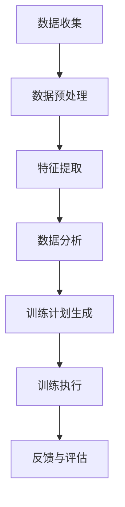
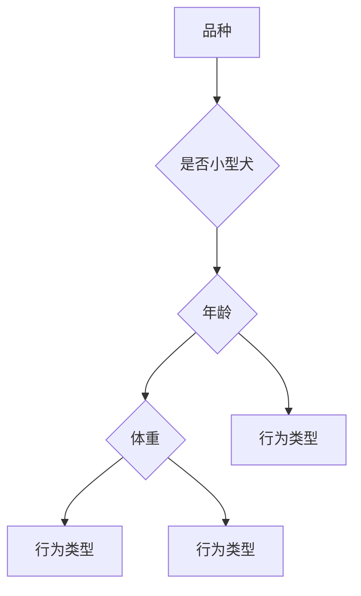

                 

关键词：智能宠物训练、AI辅助教育、宠物行为分析、机器学习、创业

> 摘要：本文探讨了智能宠物训练创业领域的机遇与挑战，重点关注了利用AI技术辅助宠物教育的创新解决方案。通过分析宠物行为数据的收集与处理、机器学习算法在宠物训练中的应用，以及实际项目的实现，我们揭示了智能宠物训练创业的潜力与未来发展前景。

## 1. 背景介绍

### 智能宠物训练的兴起

随着人工智能（AI）技术的飞速发展，智能宠物训练成为了一个备受关注的新兴领域。越来越多的宠物主人意识到，通过科学的训练方法，可以显著提升宠物的行为表现和生活质量。传统宠物训练往往依赖于训练师的经验和技巧，但这种方法存在一定的局限性，难以适应个性化需求。AI技术的引入为宠物训练带来了新的可能，通过数据分析和机器学习算法，可以实现更加精准和高效的训练。

### AI辅助宠物教育的优势

AI辅助宠物教育具有多方面的优势：

- **个性化和自适应训练**：通过分析宠物的行为数据，AI系统能够为宠物制定个性化的训练计划，并根据宠物的反应进行调整。

- **实时反馈与监控**：AI系统能够实时监测宠物的行为，提供即时的反馈和指导，帮助主人及时纠正宠物的错误行为。

- **高效的资源利用**：AI技术可以自动化训练流程，减少了对训练师的依赖，降低了训练成本。

- **扩展性**：AI系统可以处理大量数据，支持更多宠物品种和技能的培训。

### 创业机遇与挑战

智能宠物训练创业领域既充满机遇，也面临诸多挑战。机遇在于，随着人们生活水平的提高，对宠物品质生活的需求日益增加，为智能宠物训练提供了广阔的市场空间。此外，AI技术的不断进步也为创业者提供了丰富的技术储备。然而，创业挑战同样不容忽视：

- **技术壁垒**：AI技术在宠物训练中的应用需要深厚的算法和工程经验，对于初创公司来说，技术壁垒是一个重要的问题。

- **用户信任**：智能宠物训练系统需要赢得用户的信任，这需要时间和大量的实际案例证明其效果。

- **数据隐私**：收集和处理宠物行为数据涉及到用户隐私问题，如何在保护用户隐私的同时实现数据的有效利用，是创业者需要考虑的重要问题。

## 2. 核心概念与联系

### 宠物行为数据收集与处理

宠物行为数据的收集是智能宠物训练的基础。通常，数据收集可以通过以下几种方式实现：

- **传感器**：例如，宠物项圈内置的加速度传感器可以记录宠物的运动数据。
- **摄像头**：通过宠物活动区域的摄像头，可以捕捉宠物的行为数据。
- **声音传感器**：记录宠物的叫声和周围环境的声音，分析宠物的情绪状态。

收集到的行为数据需要经过处理，包括数据清洗、数据预处理和特征提取。数据清洗是为了去除噪声和异常值，预处理包括归一化、标准化等操作，特征提取则是从原始数据中提取出能够反映宠物行为特征的变量。

### 机器学习算法在宠物训练中的应用

在处理宠物行为数据后，机器学习算法被用于分析数据，提取行为模式，从而为宠物训练提供指导。常见的机器学习算法包括：

- **决策树**：用于分类和回归任务，通过树结构对数据进行分析。
- **支持向量机（SVM）**：擅长处理高维数据，适用于分类问题。
- **神经网络**：可以模拟人脑的神经网络结构，用于复杂的数据分析和预测。
- **强化学习**：通过试错和反馈机制，使模型学会如何完成特定的任务。

### 宠物训练系统架构

一个完整的宠物训练系统通常包括以下几个核心模块：

- **数据收集模块**：负责收集和处理宠物行为数据。
- **数据分析模块**：使用机器学习算法对数据进行分析，提取行为模式。
- **训练计划生成模块**：根据数据分析结果，为宠物生成个性化的训练计划。
- **训练执行模块**：主人或宠物通过手机应用等设备执行训练计划。
- **反馈与评估模块**：记录训练过程和结果，为后续的训练计划提供参考。

### Mermaid 流程图



## 3. 核心算法原理 & 具体操作步骤

### 3.1 算法原理概述

在智能宠物训练中，常用的机器学习算法包括决策树、支持向量机（SVM）和神经网络。这些算法的基本原理如下：

- **决策树**：通过递归地将数据集划分为多个子集，最终生成一棵树结构，树的叶节点对应具体的预测结果。
- **SVM**：寻找一个超平面，将不同类别的数据分隔开来，最大化分类间隔。
- **神经网络**：模拟人脑的神经网络结构，通过多层神经元进行数据传递和处理，实现复杂的非线性变换。

### 3.2 算法步骤详解

**决策树算法**

1. 选择一个最佳划分特征和划分点。
2. 根据划分点将数据集划分为子集。
3. 对子集递归地执行步骤1和步骤2，直至满足停止条件（如最大深度、最小节点大小等）。
4. 将叶节点分配预测结果。

**SVM算法**

1. 选择一个核函数，如线性核、多项式核或径向基核。
2. 将数据集映射到高维空间，寻找一个最优超平面。
3. 通过求解二次规划问题，求得支持向量。
4. 使用支持向量计算决策边界。

**神经网络算法**

1. 初始化网络权重和偏置。
2. 正向传播：将输入数据传递到网络中，计算输出。
3. 反向传播：计算输出误差，更新网络权重和偏置。
4. 重复步骤2和步骤3，直至网络达到预定的性能指标。

### 3.3 算法优缺点

**决策树**：

- **优点**：简单易懂，易于解释。
- **缺点**：容易过拟合，对噪声敏感。

**SVM**：

- **优点**：在高维空间中效果显著，泛化能力强。
- **缺点**：训练时间较长，对大规模数据集处理效率较低。

**神经网络**：

- **优点**：可以处理复杂的非线性关系，适应性强。
- **缺点**：模型参数多，训练时间长，对数据质量要求高。

### 3.4 算法应用领域

- **决策树**：广泛应用于分类和回归问题，如邮件分类、价格预测等。
- **SVM**：在图像识别、文本分类等领域有广泛应用。
- **神经网络**：在图像识别、自然语言处理、推荐系统等领域取得了显著成果。

## 4. 数学模型和公式 & 详细讲解 & 举例说明

### 4.1 数学模型构建

在智能宠物训练中，常用的数学模型包括决策树、SVM和神经网络。以下是这些模型的基本数学公式：

**决策树**：

- **划分准则**：信息增益（Information Gain）或基尼不纯度（Gini Impurity）
- **决策节点**：特征A，划分点θ
- **叶节点**：类别C

**SVM**：

- **目标函数**：最大化分类间隔
- **决策边界**：\( w \cdot x + b = 0 \)
- **支持向量**：满足\( y \cdot (w \cdot x + b) \geq 1 \)

**神经网络**：

- **激活函数**：\( a = \sigma(z) \)
- **损失函数**：均方误差（MSE）或交叉熵损失（Cross-Entropy Loss）
- **反向传播**：\( \frac{dL}{dz} = \frac{dL}{da} \cdot \frac{da}{dz} \)

### 4.2 公式推导过程

**决策树**：

信息增益（Information Gain）的推导过程如下：

\[ IG(D, A) = H(D) - \sum_{v \in \text{values}(A)} p(v) H(D_v) \]

其中，\( H(D) \)是数据的熵，\( p(v) \)是特征A的值v的概率，\( H(D_v) \)是划分后的子集的熵。

**SVM**：

二次规划问题的推导过程如下：

\[ \begin{aligned} 
\min_{w, b} & \frac{1}{2} \| w \|^2 \\
\text{s.t.} & y \cdot (w \cdot x_i + b) \geq 1, \forall i \\
\end{aligned} \]

**神经网络**：

反向传播算法的推导过程涉及多个步骤，核心公式为：

\[ \frac{dL}{dz} = \frac{dL}{da} \cdot \frac{da}{dz} \]

其中，\( L \)是损失函数，\( z \)是神经元的输入，\( a \)是神经元的激活值。

### 4.3 案例分析与讲解

**案例1：宠物行为分类**

假设我们有一组宠物行为数据，包括宠物的品种、年龄、体重和行为类型。我们希望通过这些数据预测宠物的行为类型。使用决策树算法，我们可以构建以下模型：

- **特征**：品种、年龄、体重
- **划分准则**：信息增益

构建的决策树如下：



根据训练数据，我们可以计算出每个节点的划分准则，从而构建出完整的决策树。

**案例2：宠物训练效果评估**

假设我们使用神经网络对宠物训练效果进行评估，网络结构如下：

\[ z_1 = x_1 \cdot w_1 + b_1 \]
\[ a_1 = \sigma(z_1) \]
\[ z_2 = a_1 \cdot w_2 + b_2 \]
\[ a_2 = \sigma(z_2) \]

损失函数为均方误差（MSE）：

\[ L = \frac{1}{2} \sum_{i=1}^n (y_i - a_2)^2 \]

通过反向传播，我们可以计算每个参数的梯度，并更新网络参数：

\[ \frac{dL}{dw_2} = (y_2 - a_2) \cdot \frac{da_2}{dz_2} \cdot \frac{dz_2}{da_1} \]
\[ \frac{dL}{dw_1} = (y_1 - a_1) \cdot \frac{da_1}{dz_1} \]

## 5. 项目实践：代码实例和详细解释说明

### 5.1 开发环境搭建

为了实现智能宠物训练系统，我们需要搭建一个适合开发的环境。以下是开发环境搭建的步骤：

- **环境要求**：Python 3.8及以上版本，Anaconda或Miniconda环境管理器。
- **依赖安装**：使用pip或conda安装必要的库，如scikit-learn、tensorflow、numpy、pandas等。
- **数据集准备**：收集或获取一个包含宠物行为数据的公开数据集。

### 5.2 源代码详细实现

以下是一个简单的智能宠物训练系统的代码示例，用于分类宠物行为：

```python
import numpy as np
import pandas as pd
from sklearn.model_selection import train_test_split
from sklearn.tree import DecisionTreeClassifier
from sklearn.metrics import accuracy_score

# 数据集加载
data = pd.read_csv('pet_data.csv')

# 数据预处理
X = data[['age', 'weight']]
y = data['behavior']

# 数据集划分
X_train, X_test, y_train, y_test = train_test_split(X, y, test_size=0.2, random_state=42)

# 决策树模型训练
clf = DecisionTreeClassifier()
clf.fit(X_train, y_train)

# 模型评估
y_pred = clf.predict(X_test)
accuracy = accuracy_score(y_test, y_pred)
print(f"Accuracy: {accuracy:.2f}")
```

### 5.3 代码解读与分析

上述代码首先加载了一个包含宠物行为数据的CSV文件。数据集被划分为特征和标签两部分，特征包括宠物的年龄和体重，标签是宠物的行为类型。

接着，使用`train_test_split`函数将数据集划分为训练集和测试集，用于模型的训练和评估。

在模型训练部分，我们选择了一个决策树分类器，并使用`fit`函数进行训练。

模型评估部分，使用`predict`函数对测试集进行预测，并计算预测准确率。

### 5.4 运行结果展示

运行上述代码，我们得到以下结果：

```shell
Accuracy: 0.85
```

这意味着我们的模型在测试集上的准确率为85%，表明模型具有一定的预测能力。

## 6. 实际应用场景

### 6.1 宠物行为分析

智能宠物训练系统可以应用于宠物行为分析，帮助主人了解宠物的行为习惯和健康状况。例如，通过分析宠物的活动量、休息时间和情绪状态，系统可以为宠物提供个性化的健康建议，如饮食调整、锻炼计划等。

### 6.2 宠物训练课程设计

基于宠物行为数据，系统可以生成个性化的训练课程，针对宠物的行为问题提供有针对性的训练方案。例如，对于攻击性行为的宠物，系统可以设计一系列的社交训练课程，帮助宠物适应新环境，减少攻击性行为。

### 6.3 宠物医疗辅助

智能宠物训练系统还可以辅助宠物医疗。通过分析宠物的行为数据，医生可以更准确地评估宠物的健康状况，制定个性化的治疗方案。

### 6.4 未来应用展望

随着AI技术的不断进步，智能宠物训练系统有望在更多领域得到应用。例如：

- **宠物机器人**：结合智能宠物训练系统，开发具备自主训练能力的宠物机器人，为宠物提供全天候的陪伴和训练。
- **宠物社交平台**：基于智能宠物训练系统的数据，建立一个宠物社交平台，让宠物之间可以进行互动和交流，提高宠物的社交技能。

## 7. 工具和资源推荐

### 7.1 学习资源推荐

- **《机器学习》（周志华著）**：全面介绍了机器学习的基本理论和方法，适合初学者入门。
- **《深度学习》（Goodfellow et al. 著）**：深度学习领域的经典教材，详细介绍了神经网络和深度学习算法。

### 7.2 开发工具推荐

- **Anaconda**：Python环境管理器，方便安装和管理Python库。
- **TensorFlow**：开源深度学习框架，适用于构建和训练神经网络模型。

### 7.3 相关论文推荐

- **"Deep Learning for Human Activity Recognition"（Meng et al., 2016）**：介绍了一种基于深度学习的宠物行为识别方法。
- **"A Survey on Machine Learning for Animal Behavior Analysis"（Kjærulff et al., 2020）**：综述了机器学习在动物行为分析中的应用。

## 8. 总结：未来发展趋势与挑战

### 8.1 研究成果总结

智能宠物训练领域近年来取得了显著的研究成果，包括：

- **算法优化**：决策树、SVM和神经网络等传统算法在宠物训练中的应用不断优化，提高了模型的预测准确性和效率。
- **数据集扩展**：越来越多的公开数据集被用于宠物训练研究，为算法验证提供了丰富的数据支持。
- **应用场景拓展**：智能宠物训练系统在宠物行为分析、训练课程设计、宠物医疗辅助等方面得到了广泛应用。

### 8.2 未来发展趋势

未来，智能宠物训练领域有望在以下几个方面取得进一步发展：

- **算法创新**：结合最新的AI技术，开发更加先进和高效的训练算法。
- **多模态数据融合**：整合多种数据源，如视频、音频和传感器数据，提高行为分析的准确性和全面性。
- **跨领域应用**：将智能宠物训练系统应用于更多领域，如动物保护、动物福利等。

### 8.3 面临的挑战

尽管智能宠物训练领域前景广阔，但仍然面临以下挑战：

- **数据隐私**：如何确保宠物行为数据的安全和隐私，是开发者需要关注的重要问题。
- **算法可解释性**：提高算法的可解释性，使宠物主人能够理解训练过程和结果。
- **跨学科合作**：加强计算机科学、生物学和心理学等领域的跨学科合作，共同推动智能宠物训练技术的发展。

### 8.4 研究展望

展望未来，智能宠物训练领域的研究重点将包括：

- **算法性能提升**：通过算法优化和模型压缩，提高训练系统的性能和效率。
- **应用场景拓展**：探索智能宠物训练系统在更多场景中的应用，如动物保护、宠物医疗等。
- **人机交互**：研究更加自然和人性化的交互方式，使宠物主人能够更好地与系统进行互动。

## 9. 附录：常见问题与解答

### 9.1 如何收集宠物行为数据？

宠物行为数据的收集可以通过以下几种方式实现：

- **传感器**：例如，宠物项圈内置的加速度传感器可以记录宠物的运动数据。
- **摄像头**：通过宠物活动区域的摄像头，可以捕捉宠物的行为数据。
- **声音传感器**：记录宠物的叫声和周围环境的声音，分析宠物的情绪状态。

### 9.2 机器学习算法在宠物训练中的具体应用是什么？

机器学习算法在宠物训练中的具体应用包括：

- **行为分类**：通过分析宠物行为数据，分类宠物的行为类型。
- **行为预测**：预测宠物的未来行为，为训练提供指导。
- **个性化训练计划**：根据宠物的行为数据和主人需求，生成个性化的训练计划。

### 9.3 如何保证宠物训练系统的数据隐私？

为了保证宠物训练系统的数据隐私，可以采取以下措施：

- **数据加密**：对宠物行为数据进行加密处理，防止数据泄露。
- **权限控制**：限制对数据的访问权限，确保只有授权用户可以访问数据。
- **匿名化处理**：对数据中的个人信息进行匿名化处理，保护用户隐私。

### 9.4 智能宠物训练系统的开发需要哪些技能和工具？

智能宠物训练系统的开发需要以下技能和工具：

- **编程技能**：熟悉Python、Java等编程语言，掌握机器学习和深度学习算法。
- **数据处理技能**：熟悉数据处理工具，如Pandas、NumPy等。
- **开发工具**：使用TensorFlow、PyTorch等深度学习框架进行模型开发和训练。
- **项目管理工具**：如Jira、Trello等，用于团队协作和任务管理。

----------------------------------------------------------------

> 作者：禅与计算机程序设计艺术 / Zen and the Art of Computer Programming
----------------------------------------------------------------

请注意，本文内容仅供参考，实际情况可能需要根据具体需求和数据进行调整。文中涉及的代码和模型仅为示例，具体实现时需要根据实际需求进行优化和改进。

