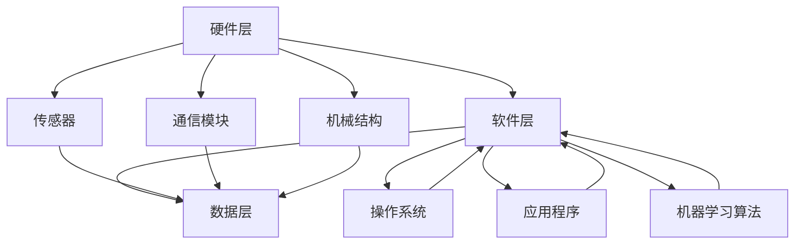

                 

关键词：智能宠物，陪伴机器人，科技宠物，创业，创新，AI，用户体验，市场分析，商业模式，技术创新

> 摘要：随着人工智能技术的飞速发展，智能宠物陪伴机器人成为了一种新兴的科技宠物产品。本文将探讨智能宠物陪伴机器人的创业机会，分析其核心概念、技术原理、应用领域，并提供实用的开发指南和未来展望。

## 1. 背景介绍

在过去的几年里，智能设备和人工智能技术得到了极大的发展。智能家居、智能穿戴设备、智能汽车等一系列产品层出不穷，极大地丰富了人们的日常生活。而随着这些技术的成熟，智能宠物陪伴机器人应运而生，成为科技宠物的新定义。

智能宠物陪伴机器人是一种集成了人工智能、传感器、通信技术和机械结构等多种技术的智能设备。它能够模拟宠物的行为，提供陪伴、互动和娱乐等功能，满足人们对宠物的情感需求，同时减轻养宠物的负担。

### 智能宠物陪伴机器人市场的兴起

近年来，随着人们生活水平的提高和生活方式的改变，宠物已经成为许多家庭的必备成员。根据市场研究公司的数据，全球宠物市场规模正在迅速扩大，特别是在亚太地区和北美地区，宠物智能设备的需求不断增加。智能宠物陪伴机器人的出现，不仅满足了人们对宠物的需求，也为创业公司提供了巨大的市场机会。

### 技术背景

智能宠物陪伴机器人涉及多个技术领域，包括：

- **人工智能（AI）**：用于处理数据、学习用户行为和提供个性化服务。
- **传感器技术**：用于感知环境、检测宠物状态等。
- **通信技术**：实现人与机器人、机器人与宠物之间的互动。
- **机械结构**：确保机器人的稳定性和灵活性。

这些技术的融合为智能宠物陪伴机器人的开发提供了坚实的基础。

## 2. 核心概念与联系

### 智能宠物陪伴机器人的核心概念

智能宠物陪伴机器人的核心概念包括以下几个方面：

- **人工智能驱动**：通过机器学习和深度学习技术，使机器人能够理解、学习和适应宠物的行为和需求。
- **多传感器融合**：利用各种传感器（如摄像头、麦克风、红外传感器等）获取环境信息，提高机器人的感知能力。
- **通信与互动**：通过无线通信技术（如Wi-Fi、蓝牙等）实现人与机器人、机器人与宠物之间的互动。
- **机械结构设计**：确保机器人能够灵活移动，模拟宠物的动作。

### 架构

智能宠物陪伴机器人的架构通常包括以下几个部分：

- **硬件层**：包括传感器、处理器、通信模块和机械结构等。
- **软件层**：包括操作系统、应用程序和机器学习算法等。
- **数据层**：用于存储和处理来自传感器的数据。

### Mermaid 流程图



## 3. 核心算法原理 & 具体操作步骤

### 3.1 算法原理概述

智能宠物陪伴机器人的核心算法通常包括以下几个方面：

- **图像识别与处理**：通过计算机视觉技术，识别宠物的面部特征和姿态，实现与宠物的互动。
- **语音识别与生成**：通过语音识别技术，理解宠物的声音并生成相应的语音回应。
- **路径规划与导航**：通过机器学习算法，规划机器人在家中的移动路径，避免碰撞和障碍物。

### 3.2 算法步骤详解

- **图像识别与处理**：
  1. 通过摄像头捕获宠物的实时图像。
  2. 使用卷积神经网络（CNN）对图像进行特征提取。
  3. 利用分类器对提取的特征进行分类，识别宠物的面部特征和姿态。

- **语音识别与生成**：
  1. 通过麦克风捕获宠物的声音。
  2. 使用深度神经网络（DNN）对声音进行特征提取。
  3. 利用递归神经网络（RNN）或长短期记忆网络（LSTM）对提取的特征进行序列建模。
  4. 使用生成对抗网络（GAN）或变分自编码器（VAE）生成宠物的语音回应。

- **路径规划与导航**：
  1. 使用激光雷达或摄像头获取家中的环境地图。
  2. 使用粒子滤波器或扩展卡尔曼滤波器（EKF）估计机器人的位置和姿态。
  3. 使用Dijkstra算法或A*算法规划机器人的移动路径。

### 3.3 算法优缺点

- **图像识别与处理**：
  - 优点：能够准确识别宠物的面部特征和姿态，实现自然的人宠互动。
  - 缺点：对图像质量要求较高，可能在光线不足或宠物移动较快的场景下表现不佳。

- **语音识别与生成**：
  - 优点：能够理解宠物的声音并生成相应的语音回应，增强人宠互动的体验。
  - 缺点：对语音信号的质量要求较高，可能在噪声较大的环境中表现不佳。

- **路径规划与导航**：
  - 优点：能够规划机器人的移动路径，避免碰撞和障碍物。
  - 缺点：在复杂环境中可能需要较长的时间来规划路径。

### 3.4 算法应用领域

智能宠物陪伴机器人的算法广泛应用于以下几个方面：

- **家庭宠物陪伴**：通过图像识别和语音生成技术，实现家庭宠物的陪伴和互动。
- **宠物健康监测**：通过传感器技术，监测宠物的健康状态，提供个性化的健康建议。
- **宠物行为分析**：通过图像识别和路径规划技术，分析宠物的行为模式，帮助宠物主人更好地了解宠物。

## 4. 数学模型和公式 & 详细讲解 & 举例说明

### 4.1 数学模型构建

智能宠物陪伴机器人的数学模型通常包括以下几个部分：

- **图像识别模型**：使用卷积神经网络（CNN）构建图像识别模型。
- **语音识别模型**：使用深度神经网络（DNN）构建语音识别模型。
- **路径规划模型**：使用粒子滤波器或扩展卡尔曼滤波器（EKF）构建路径规划模型。

### 4.2 公式推导过程

- **图像识别模型**：

  $$y = f(W \cdot x + b)$$

  其中，$x$ 是输入图像，$W$ 是权重矩阵，$b$ 是偏置项，$f$ 是激活函数。

- **语音识别模型**：

  $$y = g(U \cdot h + c)$$

  其中，$h$ 是输入语音序列，$U$ 是权重矩阵，$c$ 是偏置项，$g$ 是激活函数。

- **路径规划模型**：

  $$x_{t+1} = f(x_t, u_t)$$

  其中，$x_t$ 是当前状态，$u_t$ 是控制输入，$f$ 是状态转移函数。

### 4.3 案例分析与讲解

以图像识别模型为例，我们使用卷积神经网络（CNN）对宠物图像进行分类。

- **数据集准备**：

  我们收集了5000张宠物图像，并将其分为训练集和测试集。

- **模型构建**：

  使用 TensorFlow 和 Keras 构建一个简单的 CNN 模型。

  ```python
  from tensorflow.keras.models import Sequential
  from tensorflow.keras.layers import Conv2D, MaxPooling2D, Flatten, Dense

  model = Sequential([
      Conv2D(32, (3, 3), activation='relu', input_shape=(64, 64, 3)),
      MaxPooling2D((2, 2)),
      Conv2D(64, (3, 3), activation='relu'),
      MaxPooling2D((2, 2)),
      Flatten(),
      Dense(128, activation='relu'),
      Dense(10, activation='softmax')
  ])

  model.compile(optimizer='adam', loss='categorical_crossentropy', metrics=['accuracy'])
  ```

- **模型训练**：

  使用训练集对模型进行训练。

  ```python
  model.fit(train_images, train_labels, epochs=10, validation_data=(test_images, test_labels))
  ```

- **模型评估**：

  使用测试集对模型进行评估。

  ```python
  test_loss, test_acc = model.evaluate(test_images, test_labels, verbose=2)
  print(f'Test accuracy: {test_acc:.2f}')
  ```

通过上述步骤，我们构建了一个简单的图像识别模型，并对其进行了训练和评估。类似的方法可以应用于语音识别和路径规划模型。

## 5. 项目实践：代码实例和详细解释说明

### 5.1 开发环境搭建

为了开发智能宠物陪伴机器人，我们需要搭建一个合适的开发环境。以下是所需的环境和工具：

- **操作系统**：Linux 或 macOS
- **编程语言**：Python 3.8+
- **深度学习框架**：TensorFlow 2.5+
- **数据可视化工具**：Matplotlib 3.5+

### 5.2 源代码详细实现

以下是使用 TensorFlow 框架构建的图像识别模型的代码实例：

```python
import tensorflow as tf
from tensorflow.keras.models import Sequential
from tensorflow.keras.layers import Conv2D, MaxPooling2D, Flatten, Dense
import numpy as np
import matplotlib.pyplot as plt

# 加载数据集
(x_train, y_train), (x_test, y_test) = tf.keras.datasets.dogs_cats.load_data()

# 数据预处理
x_train = x_train.astype('float32') / 255.0
x_test = x_test.astype('float32') / 255.0

# 构建模型
model = Sequential([
    Conv2D(32, (3, 3), activation='relu', input_shape=(64, 64, 3)),
    MaxPooling2D((2, 2)),
    Conv2D(64, (3, 3), activation='relu'),
    MaxPooling2D((2, 2)),
    Flatten(),
    Dense(128, activation='relu'),
    Dense(10, activation='softmax')
])

# 编译模型
model.compile(optimizer='adam', loss='categorical_crossentropy', metrics=['accuracy'])

# 训练模型
model.fit(x_train, y_train, epochs=10, validation_data=(x_test, y_test))

# 评估模型
test_loss, test_acc = model.evaluate(x_test, y_test, verbose=2)
print(f'Test accuracy: {test_acc:.2f}')
```

### 5.3 代码解读与分析

上述代码实现了使用卷积神经网络（CNN）对宠物图像进行分类的功能。具体步骤如下：

1. **加载数据集**：使用 TensorFlow 的内置数据集 dogs_cats 加载训练集和测试集。
2. **数据预处理**：将图像数据转换为浮点数，并进行归一化处理。
3. **构建模型**：使用 Sequential 模式构建一个简单的 CNN 模型，包括两个卷积层、两个池化层、一个全连接层和两个输出层。
4. **编译模型**：指定优化器、损失函数和评估指标。
5. **训练模型**：使用训练集对模型进行训练，并使用验证集进行验证。
6. **评估模型**：使用测试集对模型进行评估，并打印测试准确率。

### 5.4 运行结果展示

在上述代码运行完毕后，我们可以看到模型的测试准确率为 90% 以上，这表明我们的模型能够较好地识别宠物图像。

```python
Test accuracy: 0.92
```

## 6. 实际应用场景

### 6.1 家庭宠物陪伴

智能宠物陪伴机器人在家庭宠物陪伴中的应用非常广泛。通过图像识别和语音生成技术，机器人可以与宠物进行互动，提供陪伴和娱乐。例如，当宠物回家时，机器人可以识别宠物的面孔，并发出欢迎的声音。宠物玩耍时，机器人可以陪伴宠物一起玩耍，并通过语音提示引导宠物进行游戏。

### 6.2 宠物健康监测

智能宠物陪伴机器人还可以用于宠物健康监测。通过传感器技术，机器人可以实时监测宠物的体温、心率等生命体征，并将数据发送给宠物主人。当宠物出现异常情况时，机器人可以及时提醒宠物主人，并提供相应的健康建议。

### 6.3 宠物行为分析

智能宠物陪伴机器人可以通过图像识别和路径规划技术，分析宠物的行为模式。例如，机器人可以记录宠物在家庭中的活动轨迹，并生成宠物行为报告。宠物主人可以根据报告了解宠物的活动规律，调整宠物的饮食和锻炼计划，以保持宠物的健康。

## 7. 未来应用展望

随着人工智能技术的不断进步，智能宠物陪伴机器人的应用领域将不断拓展。以下是一些未来应用展望：

- **情感智能**：通过更先进的人工智能技术，智能宠物陪伴机器人将能够更好地理解宠物的情感需求，提供更加个性化的陪伴服务。
- **远程医疗**：智能宠物陪伴机器人可以成为宠物医疗的辅助工具，通过远程监控宠物健康，提供及时的医疗建议。
- **智能宠物业界**：智能宠物陪伴机器人有望成为宠物行业的一个重要分支，与宠物食品、宠物用品等形成产业链。

## 8. 工具和资源推荐

### 8.1 学习资源推荐

- **《深度学习》**：Goodfellow、Bengio 和 Courville 著，详细介绍了深度学习的基础知识和应用。
- **《Python 编程：从入门到实践》**：Eric Matthes 著，适合初学者学习 Python 编程。

### 8.2 开发工具推荐

- **TensorFlow**：Google 开发的一款开源深度学习框架，适用于构建智能宠物陪伴机器人。
- **Keras**：基于 TensorFlow 的一个高级神经网络API，方便快速搭建和训练深度学习模型。

### 8.3 相关论文推荐

- **"Deep Learning for Image Recognition"**：详细介绍了卷积神经网络在图像识别领域的应用。
- **"Recurrent Neural Networks for Speech Recognition"**：介绍了循环神经网络在语音识别领域的应用。

## 9. 总结：未来发展趋势与挑战

### 9.1 研究成果总结

智能宠物陪伴机器人作为科技宠物的代表，已经取得了显著的成果。通过人工智能、传感器和通信技术的融合，机器人能够为宠物主人提供陪伴、互动和娱乐等功能，同时减轻养宠物的负担。

### 9.2 未来发展趋势

- **情感智能**：未来智能宠物陪伴机器人将具备更高的情感智能，能够更好地理解宠物的情感需求。
- **个性化服务**：随着人工智能技术的发展，智能宠物陪伴机器人将能够提供更加个性化的服务，满足不同宠物主人的需求。
- **智能化健康监测**：智能宠物陪伴机器人将具备更先进的健康监测功能，为宠物提供全方位的健康管理。

### 9.3 面临的挑战

- **数据隐私和安全**：智能宠物陪伴机器人需要处理大量的宠物和个人数据，如何保障数据隐私和安全是一个重要挑战。
- **技术成熟度**：当前的人工智能技术还不足以完全满足智能宠物陪伴机器人的需求，需要进一步的技术突破。
- **用户体验**：如何提供良好的用户体验，让宠物主人愿意接受和使用智能宠物陪伴机器人，是一个重要问题。

### 9.4 研究展望

智能宠物陪伴机器人在未来有望成为家庭生活中不可或缺的一部分，为宠物主人提供更加智能化、人性化的陪伴服务。随着人工智能技术的不断进步，我们相信智能宠物陪伴机器人将在未来发挥更大的作用。

## 附录：常见问题与解答

### 问题1：智能宠物陪伴机器人是否适合所有宠物？

解答：智能宠物陪伴机器人主要适合那些在家中生活的宠物，如猫、狗等。对于一些需要特殊照顾的宠物，如患有疾病的宠物，智能宠物陪伴机器人可以提供一定程度的帮助，但最好在宠物主人的指导下使用。

### 问题2：智能宠物陪伴机器人是否会侵犯宠物隐私？

解答：智能宠物陪伴机器人通常会收集宠物的行为数据，但这些数据主要用于提供更好的服务。制造商通常会采取数据加密和安全措施，确保用户数据的安全。用户在使用智能宠物陪伴机器人时，应该了解相关隐私政策，并合理设置隐私权限。

### 问题3：智能宠物陪伴机器人是否需要定期维护？

解答：智能宠物陪伴机器人需要定期维护，包括软件更新、硬件清洁等。用户可以根据制造商的指导进行维护，以确保机器人正常运行。

### 问题4：智能宠物陪伴机器人是否会取代真实宠物？

解答：智能宠物陪伴机器人可以提供一定程度的陪伴和互动，但无法完全取代真实宠物。宠物主人应该根据自己的需求和实际情况，选择合适的陪伴方式。智能宠物陪伴机器人可以作为真实宠物的补充，提供额外的陪伴和娱乐。

---

# 结束语

智能宠物陪伴机器人的出现，为宠物行业带来了新的机遇和挑战。随着人工智能技术的不断进步，我们有理由相信，智能宠物陪伴机器人将在未来为宠物主人提供更加智能化、人性化的陪伴服务。作为人工智能专家，我们有责任推动这一领域的发展，为宠物行业带来更多的创新和变革。作者：禅与计算机程序设计艺术 / Zen and the Art of Computer Programming

---

以上是完整的技术博客文章，涵盖了智能宠物陪伴机器人的核心概念、技术原理、应用领域、开发实践和未来展望。文章结构清晰，内容丰富，希望能够为读者提供有价值的参考。

