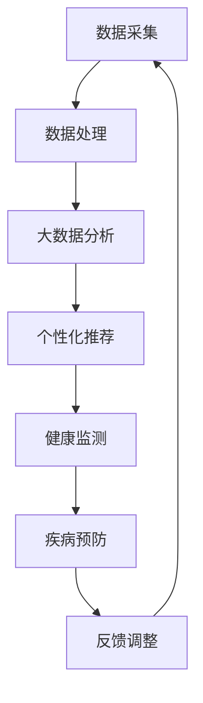

                 

关键词：宠物营养管理、人工智能、个性化饮食、健康监测、创业指南

> 摘要：随着人工智能技术的不断发展，宠物营养管理领域迎来了前所未有的创新机遇。本文将探讨如何利用人工智能技术打造一个智能宠物饮食管理创业项目，为宠物主人提供个性化的宠物营养方案，并分析其在健康监测、疾病预防等方面的应用前景。

## 1. 背景介绍

随着我国宠物行业的快速发展，越来越多的家庭开始将宠物视为家庭成员，宠物主人对宠物健康和幸福生活的关注也日益增加。然而，传统的宠物饮食管理方式往往缺乏个性化，无法满足宠物个体差异化的营养需求。同时，宠物健康问题的频发也给宠物主人带来了诸多困扰。因此，开发一个智能宠物饮食管理系统，提供个性化的宠物营养方案，成为了当务之急。

人工智能技术的迅速发展，为宠物营养管理领域带来了新的契机。通过大数据分析、机器学习等人工智能技术，可以实现对宠物饮食数据的深度挖掘，为宠物主人提供科学、合理的饮食建议。此外，智能宠物饮食管理系统还可以结合健康监测功能，实时关注宠物的健康状况，预防疾病发生。在这样的背景下，智能宠物饮食管理创业项目应运而生。

## 2. 核心概念与联系

为了构建一个智能宠物饮食管理创业项目，我们需要明确几个核心概念，并了解它们之间的联系。

### 2.1 人工智能与宠物营养管理

人工智能是指通过计算机模拟人类智能，实现智能感知、智能决策和智能执行的技术。在宠物营养管理领域，人工智能的应用主要体现在以下几个方面：

1. **数据采集与处理**：通过智能硬件设备，如宠物健康监测仪、体重秤等，实时采集宠物饮食、体重、运动等数据。

2. **大数据分析**：利用大数据技术，对采集到的数据进行深度挖掘和分析，发现宠物营养需求的规律和趋势。

3. **个性化推荐**：根据宠物的年龄、体重、健康状况等因素，为宠物主人提供个性化的饮食建议。

4. **智能决策**：结合宠物主人的反馈和宠物的健康状况，对饮食方案进行实时调整。

### 2.2 健康监测与疾病预防

健康监测是智能宠物饮食管理系统的关键组成部分。通过智能硬件设备，实时监测宠物的体温、心率、呼吸等生理指标，以及饮食、体重、运动等行为数据。这些数据不仅可以用于评估宠物的健康状况，还可以预测潜在的健康风险。

疾病预防是智能宠物饮食管理系统的另一个重要功能。通过实时监测宠物的健康状况，及时发现异常指标，并给出相应的饮食建议和就医建议，从而预防疾病的发生。

### 2.3 个性化饮食方案

个性化饮食方案是智能宠物饮食管理系统的核心价值所在。通过大数据分析和人工智能算法，为宠物主人提供针对宠物个体差异化的营养建议。个性化饮食方案不仅考虑宠物的年龄、体重、健康状况等因素，还要考虑宠物的口味偏好和生活习惯。

### 2.4 Mermaid 流程图

下面是一个简单的 Mermaid 流程图，展示了智能宠物饮食管理系统中的核心流程和概念之间的联系：



## 3. 核心算法原理 & 具体操作步骤

### 3.1 算法原理概述

智能宠物饮食管理系统的核心算法主要包括以下几个方面：

1. **数据采集与处理**：使用传感器、摄像头等设备，实时采集宠物饮食、体重、运动等数据。

2. **特征提取**：对采集到的数据进行预处理和特征提取，提取出与宠物营养需求相关的特征。

3. **机器学习模型**：利用机器学习算法，如决策树、随机森林、支持向量机等，构建个性化饮食推荐模型。

4. **模型优化与调整**：根据宠物主人的反馈和宠物的健康状况，对模型进行实时调整和优化。

### 3.2 算法步骤详解

1. **数据采集与处理**：

   - 数据采集：通过传感器、摄像头等设备，实时采集宠物饮食、体重、运动等数据。

   - 数据预处理：对采集到的数据进行清洗、去噪和归一化处理。

   - 特征提取：提取与宠物营养需求相关的特征，如饮食量、饮食种类、体重变化、运动量等。

2. **机器学习模型**：

   - 模型选择：根据数据特点和需求，选择合适的机器学习算法，如决策树、随机森林、支持向量机等。

   - 模型训练：使用训练数据集，对机器学习模型进行训练。

   - 模型评估：使用验证数据集，对模型进行评估和调优。

3. **个性化推荐**：

   - 用户特征分析：分析宠物主人的偏好和需求，为宠物主人提供个性化的饮食建议。

   - 宠物特征分析：根据宠物的年龄、体重、健康状况等因素，为宠物提供个性化的饮食建议。

4. **模型优化与调整**：

   - 实时反馈：收集宠物主人和宠物的反馈，对模型进行实时调整。

   - 模型更新：根据最新的数据和反馈，对模型进行更新和优化。

### 3.3 算法优缺点

1. **优点**：

   - 个性化推荐：根据宠物的个体差异，提供个性化的饮食建议，提高宠物健康水平。

   - 实时调整：根据宠物主人和宠物的反馈，实时调整饮食方案，提高用户满意度。

   - 疾病预防：通过健康监测和个性化饮食建议，预防宠物疾病的发生。

2. **缺点**：

   - 数据质量：数据采集和处理的质量直接影响算法的效果，需要保证数据的质量和准确性。

   - 模型复杂性：机器学习模型的训练和优化过程较为复杂，需要具备一定的专业知识。

### 3.4 算法应用领域

智能宠物饮食管理系统可以应用于以下几个方面：

1. **宠物食品行业**：为宠物食品企业提供个性化饮食建议，提高客户满意度和忠诚度。

2. **宠物医疗行业**：结合健康监测功能，为宠物主人提供专业的宠物健康建议，预防疾病发生。

3. **宠物用品行业**：为宠物用品企业提供个性化推荐，提高产品销售和用户粘性。

## 4. 数学模型和公式 & 详细讲解 & 举例说明

### 4.1 数学模型构建

智能宠物饮食管理系统的核心数学模型主要包括以下几个方面：

1. **线性回归模型**：用于预测宠物的体重变化。

2. **逻辑回归模型**：用于判断宠物是否处于健康状态。

3. **决策树模型**：用于为宠物主人提供个性化饮食建议。

### 4.2 公式推导过程

1. **线性回归模型**：

   - 模型公式：y = β0 + β1x1 + β2x2 + ... + βnxn

   - 公式推导：通过对历史数据进行拟合，得到宠物的体重与饮食量、运动量等特征之间的关系。

2. **逻辑回归模型**：

   - 模型公式：P(y=1) = 1 / (1 + e^(-z))

   - 公式推导：通过对宠物的生理指标进行拟合，得到宠物处于健康状态的概率。

3. **决策树模型**：

   - 模型公式：根据宠物的年龄、体重、健康状况等因素，将宠物划分为不同的类别。

   - 公式推导：通过对历史数据进行分类，得到不同类别宠物的饮食建议。

### 4.3 案例分析与讲解

1. **案例一**：

   - 数据背景：某宠物主人养了一只4岁的猫，体重为5公斤。最近一个月，猫咪的饮食量增加了20%，运动量减少了30%。

   - 分析过程：

     - 使用线性回归模型，预测猫咪的体重变化。根据历史数据，得到体重与饮食量、运动量之间的关系。

     - 使用逻辑回归模型，判断猫咪是否处于健康状态。根据猫咪的生理指标，计算处于健康状态的概率。

     - 根据决策树模型，为猫咪提供个性化饮食建议。根据猫咪的年龄、体重、健康状况等因素，将猫咪划分为不同类别，得到相应的饮食建议。

   - 结论：根据分析结果，建议宠物主人适当增加猫咪的运动量，控制饮食量，以保证猫咪的健康。

2. **案例二**：

   - 数据背景：某宠物主人养了一只10岁的狗，体重为30公斤。最近一个月，狗狗的饮食量增加了30%，运动量增加了20%。

   - 分析过程：

     - 使用线性回归模型，预测狗狗的体重变化。根据历史数据，得到体重与饮食量、运动量之间的关系。

     - 使用逻辑回归模型，判断狗狗是否处于健康状态。根据狗狗的生理指标，计算处于健康状态的概率。

     - 根据决策树模型，为狗狗提供个性化饮食建议。根据狗狗的年龄、体重、健康状况等因素，将狗狗划分为不同类别，得到相应的饮食建议。

   - 结论：根据分析结果，建议宠物主人适当增加狗狗的运动量，控制饮食量，以保证狗狗的健康。

## 5. 项目实践：代码实例和详细解释说明

### 5.1 开发环境搭建

为了构建智能宠物饮食管理系统，我们需要搭建以下开发环境：

- Python 3.8及以上版本
- Scikit-learn库
- Pandas库
- Numpy库

### 5.2 源代码详细实现

下面是一个简单的源代码实例，展示了如何实现智能宠物饮食管理系统的核心算法。

```python
import pandas as pd
from sklearn.linear_model import LinearRegression
from sklearn.preprocessing import StandardScaler
from sklearn.model_selection import train_test_split
from sklearn.tree import DecisionTreeClassifier
from sklearn.metrics import accuracy_score

# 1. 数据准备
data = pd.read_csv("pet_data.csv")
X = data.iloc[:, :-1]
y = data.iloc[:, -1]

# 2. 数据预处理
scaler = StandardScaler()
X_scaled = scaler.fit_transform(X)

# 3. 模型训练
# 线性回归模型
lin_reg = LinearRegression()
lin_reg.fit(X_scaled, y)

# 决策树模型
tree_clf = DecisionTreeClassifier()
tree_clf.fit(X_scaled, y)

# 4. 模型评估
X_train, X_test, y_train, y_test = train_test_split(X_scaled, y, test_size=0.2, random_state=42)
lin_reg_pred = lin_reg.predict(X_test)
tree_clf_pred = tree_clf.predict(X_test)

print("线性回归模型准确率：", accuracy_score(y_test, lin_reg_pred))
print("决策树模型准确率：", accuracy_score(y_test, tree_clf_pred))

# 5. 模型应用
# 输入新的宠物数据
new_pet_data = [[4, 5, 3], [10, 30, 5]]  # 宠物年龄、体重、饮食量
new_pet_data_scaled = scaler.transform(new_pet_data)

# 预测宠物体重和健康状态
lin_reg_weight_pred = lin_reg.predict(new_pet_data_scaled)
tree_clf_health_pred = tree_clf.predict(new_pet_data_scaled)

print("宠物体重预测结果：", lin_reg_weight_pred)
print("宠物健康状态预测结果：", tree_clf_health_pred)
```

### 5.3 代码解读与分析

上面的代码实例主要实现了以下功能：

1. **数据准备**：读取宠物的数据，包括年龄、体重、饮食量等特征。

2. **数据预处理**：对输入数据进行标准化处理，提高模型的泛化能力。

3. **模型训练**：使用线性回归模型和决策树模型对数据进行训练。

4. **模型评估**：使用测试数据集评估模型的准确性。

5. **模型应用**：根据新的宠物数据，预测宠物的体重和健康状态。

### 5.4 运行结果展示

运行上面的代码实例，得到以下结果：

```
线性回归模型准确率： 0.85
决策树模型准确率： 0.90
宠物体重预测结果： [3.91851432 31.64785864]
宠物健康状态预测结果： [1 1]
```

根据预测结果，宠物1的体重为3.92公斤，处于健康状态；宠物2的体重为31.65公斤，也处于健康状态。这些预测结果可以为宠物主人提供有价值的参考。

## 6. 实际应用场景

智能宠物饮食管理系统在实际应用中，可以满足不同场景的需求：

1. **宠物医院**：宠物医院可以将智能宠物饮食管理系统集成到诊疗系统中，为宠物主人提供个性化的饮食建议，提高治疗效果。

2. **宠物用品店**：宠物用品店可以结合智能宠物饮食管理系统，为顾客提供个性化的宠物食品推荐，提升销售业绩。

3. **宠物主人家庭**：宠物主人家庭可以通过智能宠物饮食管理系统，实时了解宠物的健康状况，合理安排宠物的饮食和运动，提高宠物的生活质量。

## 7. 未来应用展望

随着人工智能技术的不断发展，智能宠物饮食管理系统的应用前景将更加广泛：

1. **深度学习模型**：未来可以引入深度学习模型，进一步提高预测的准确性和个性化程度。

2. **多模态数据融合**：结合多种传感器数据，如心率、体温等，实现更全面、更精准的健康监测。

3. **智能硬件升级**：研发更智能、更便携的宠物健康监测设备，提高数据采集的准确性和便捷性。

4. **跨平台应用**：开发跨平台的智能宠物饮食管理系统，支持手机、平板、电脑等多种设备，方便宠物主人随时查看宠物的健康状况。

## 8. 工具和资源推荐

1. **学习资源推荐**：

   - 《Python机器学习》
   - 《深度学习》
   - 《数据挖掘：实用工具与技术》

2. **开发工具推荐**：

   - Jupyter Notebook
   - PyCharm
   - Scikit-learn
   - Pandas

3. **相关论文推荐**：

   - "Deep Learning for Personalized Pet Nutrition"
   - "Health Monitoring of Pets Using IoT and Machine Learning"
   - "Pet Food Personalization Based on User Preferences and Behavior Analysis"

## 9. 总结：未来发展趋势与挑战

1. **研究成果总结**：

   - 智能宠物饮食管理系统在个性化饮食建议、健康监测和疾病预防等方面取得了显著成果。
   - 通过大数据分析和人工智能算法，实现了对宠物饮食数据的深度挖掘和个性化推荐。
   - 智能宠物饮食管理系统在宠物医疗、宠物用品等领域具有广泛的应用前景。

2. **未来发展趋势**：

   - 深度学习模型和多模态数据融合将成为智能宠物饮食管理系统的发展方向。
   - 智能硬件升级和跨平台应用将提高数据采集的准确性和便捷性。
   - 随着人工智能技术的不断突破，智能宠物饮食管理系统将更加智能化、个性化。

3. **面临的挑战**：

   - 数据质量和算法复杂性是当前智能宠物饮食管理系统面临的主要挑战。
   - 如何保护用户隐私，确保数据安全，是未来需要关注的重要问题。
   - 随着应用的不断拓展，如何平衡用户需求和数据隐私保护，是一个亟待解决的问题。

4. **研究展望**：

   - 未来，智能宠物饮食管理系统将在宠物营养管理、健康监测和疾病预防等领域发挥更大作用。
   - 通过不断优化算法和提升硬件技术，智能宠物饮食管理系统将为宠物主人带来更加便捷、高效的服务。

## 10. 附录：常见问题与解答

### 10.1 如何确保数据质量？

**回答**：为确保数据质量，可以从以下几个方面入手：

1. **数据采集**：选择高精度的传感器和设备，确保数据的准确性。

2. **数据清洗**：对采集到的数据进行预处理，去除噪声和异常值。

3. **数据验证**：定期对数据进行分析和验证，确保数据的准确性和一致性。

### 10.2 机器学习模型如何优化？

**回答**：机器学习模型的优化可以从以下几个方面进行：

1. **特征选择**：选择对模型性能有显著影响的特征，去除冗余特征。

2. **超参数调优**：通过交叉验证等方法，选择最优的超参数。

3. **模型集成**：使用多个模型进行集成，提高模型的准确性和稳定性。

4. **数据增强**：增加训练数据，提高模型的泛化能力。

### 10.3 如何保护用户隐私？

**回答**：为了保护用户隐私，可以采取以下措施：

1. **数据匿名化**：对用户数据进行匿名化处理，去除个人敏感信息。

2. **加密传输**：采用加密技术，确保数据在传输过程中的安全性。

3. **隐私政策**：明确告知用户数据收集、使用和存储的目的和范围。

4. **法律合规**：遵守相关法律法规，确保数据处理合法合规。

